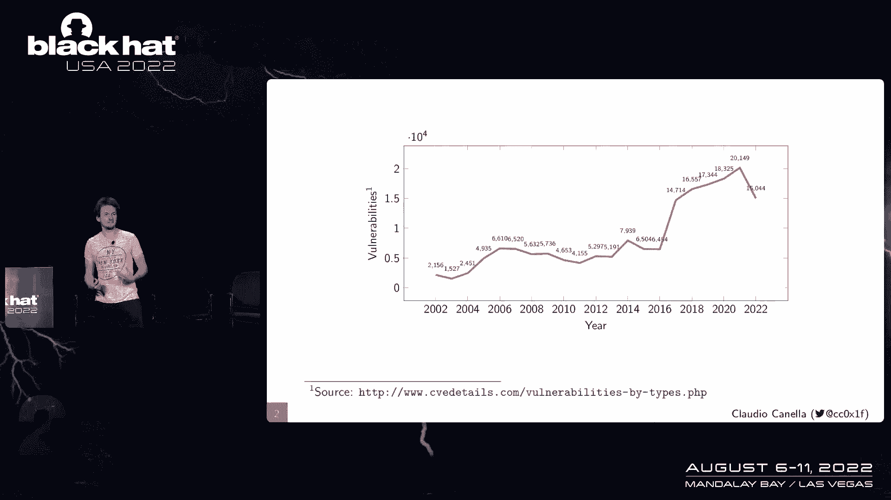
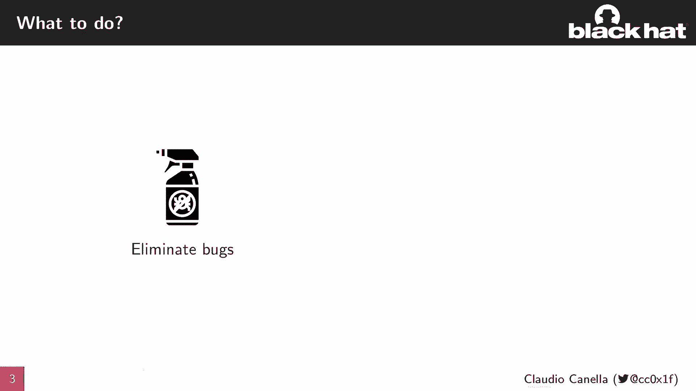
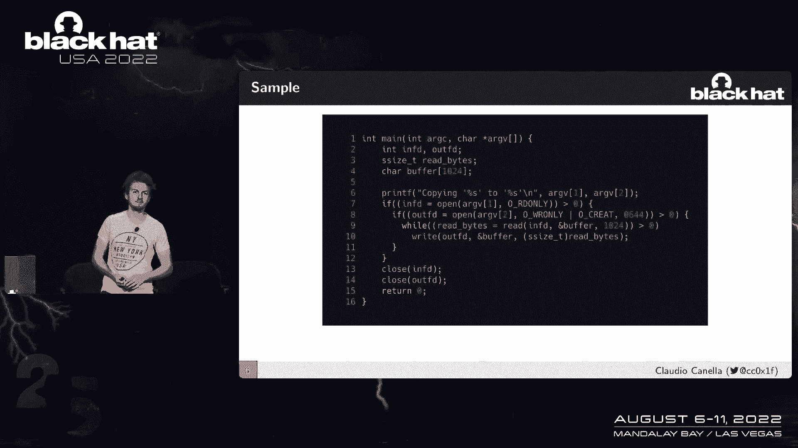
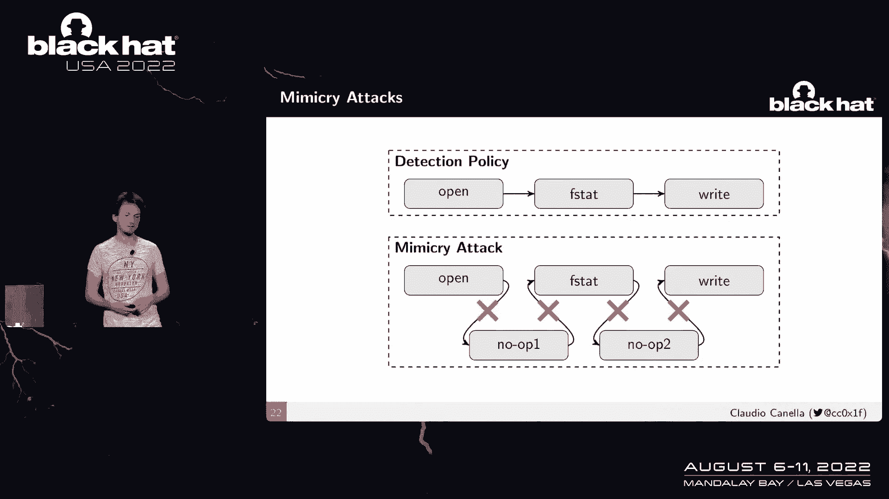
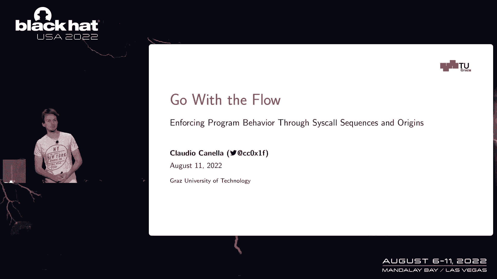

# P65：073 - Go With the Flow： Enforcing Program Behavior Through Syscall Sequences and - 坤坤武特 - BV1WK41167dt

谢谢你的介绍，所以欢迎来到我的演讲，随波逐流，我叫克劳迪娅·卡内拉，我目前是警卫的博士生，奥地利理工大学，如果你想在谈话结束后伸出手来，请通过推特或电子邮件这样做。

所以在我想谈论我实际上要呈现的东西之前，我想给大家一点动力，一件事是这些年来我们确实看到了很多袭击。

所以这里我们有C的个数，这是多年来一直在发行的，正如你在今年看到的，我们已经在超越价值的路上了，我们在前几年遇到的，所以我们确实需要找到一种方法来减轻潜在的攻击。

通常我们有两种不同的方法来做到这一点，所以第一件事显然是当我们确实有弱点时，我们确实想消除bug，显然这也是相当困难的，我们已经很久没有这样做了，我们能做的第二件事是，我们可以限制这些漏洞的开发后影响。

一旦有人，例如，攻击者已获得对应用程序的控制，所以他们不能为所欲为，他们在这次谈话中所能取得的成果受到严重限制，我不会谈论消除虫子，我从来没有做过这方面的研究。

所以我会把重点放在限制开发后的影响上显然在过去，也有几次尝试这样做，例如，沙箱，提出的一个非常突出的例子，就像17年前左右控制流的完整性，在静态分析中，完整性控制有一个非常简单的想法。

当我们编译应用程序时，或者使用二元或二元分析，我们提取应用程序的控制流，例如，这里我们有一个简单的抽象，我们有几个节点，我们提取节点一可以遵循的信息，可以将控制权转移到节点二。

它可以控制将控制权转移到节点四，节点一也可以将控制权转移到节点三，以此类推，所以用静态分析，我们提取这些信息，建立控制流图，然后用一些检查来仪器我们的二进制文件。

所以在我们把控制和完整性过渡到一个新的目标之前，我们所做的就是简单地检查，这是有效的转帐吗？所以说，例如，对于我们的节点免费，我们知道我们只能把控制权转移到第五和第六节点，这些可以是函数。

这可以是基本块，几乎所有的东西，因此，如果攻击者现在试图劫持我们应用程序的控制，我们有这个恶意流到不同的节点，然后看看我是否会阻止这一切，然而，CFI确实有一些限制，它通常只适用于单个域，例如。

您可以将CFI应用于用户空间，您可以将其应用于内核空间，但在跨安全域上下文中很难做到这一点，但显然这是我们想做的事情，因为我们几乎所有的漏洞都需要与操作系统交互，因为它是我们系统上的特权实体。

所以我们需要一种方法来限制与操作系统的交互，Linux已经为我们提供了一件事，这是Linux第二个安全计算接口，第二背后的想法很容易，我们检查每一个系统调用，不管它是不是过滤器的一部分，如果不是。

我们只是终止我们的申请，这里的典型流程是这样的，我们有我们的应用程序，应用程序本身，您使用开发人员，您负责确定应用程序需要的系统调用是什么，然后将它们发送到内核，为每个系统调用安装这些过滤器。

然后内部拦截系统调用，用过滤器检查，如果不是，则不是筛选器的一部分，我们只是简单地终止它，否则，我们执行系统调用并返回结果，所以这显然是我们可以用的很好的东西，限制攻击的开发后影响，然而。

第二个指南针在这种情况下有两个限制，第一个是我们只查看当前的系统调用，我们没有任何上下文信息，第二个是在这里很难申请，我们有一个非常简单的程序示例。

它除了复制一个文件之外什么也不做，一个文件到另一个文件的内容，但你作为一个开发人员，您有责任识别您的应用程序使用得很好的每一个被称为系统的系统，这在这样的事情上很简单，这不是一个大程序，如果你考虑大的。

这是相当复杂的，复杂应用，比如服务器等等，所以只是给你一个想法。

此应用程序可能需要多少系统调用，这是名单，正如我们所看到的，已经很多了，我想大多数人都无法识别系统。

当然啦，所以几年前我们研究了一个自动化的，我们在20年后在黑帽公司做了一个关于这个的演示，亚洲黑色，和我的同事一起，所以我们简单地自动化了这个，应用程序所需的系统调用的发现，但是当我们在做这个的时候。

我们还有一个想法，如果我们用，不仅强制当前系统调用，但是当前系统调用在前一个上下文中，所以我们试图强制执行这个调用序列。

这就引出了我今天要介绍的内容，这就是我们的思科流完整性保护概念，它把CFI和SE的想法带到，强制受S FIP保护的应用程序的程序行为，就像我们所说的，它是建立在三根柱子上的。

我们的第一个支柱是一个简单的状态机，在静态分析中，我们提取长度为2的每一个序列，显然还有更多其他长度是可能的，但我们只关注长度二，所以我们提取这些序列，然后试图强制执行它们，所以我们的助攻。

我们的应用程序只能按顺序调用这些系统调用，当我们静态地确定，就像我们在CFI里一样，但在不同的层面上，然而，我们试图进一步扩展这一点，以提供更严格的保护，这是通过社会出身，在同样的过程中。

当我们吸引时提取这些信息，我们还提取每个系统的起源，称为生成映射，从这个称为原点的系统到它不能执行的系统，很明显，这可以是一对一的映射，单个系统调用指令只能执行单个系统调用。

或者单个系统调用指令可能执行多个系统调用，我们在编译应用程序的静态分析过程中提取了这两件事，然而，如果没有我们的第三个支柱，SVIP就不会有任何东西，它实际上执行了信息，所以我们修改了Linux内核。

让它可以接收我们提供的信息，然后强制执行，拦截称为检查的系统，这是一个有效的过渡吗，它是有效的来源吗，如果是的话，我们继续行刑，所以这是免费的枕头，我们的地带建立在支柱上，在这次谈话中。

我将主要集中在前两个支柱上，在第三个支柱上更少，只是因为它更琐碎，这部分所以我们作为VIP实施，在概念验证实现中，我们称之为流动，这个流程由三部分组成，它是一个编译器。

所以我们将LLVM编译器工具链修改为，它执行sial序列和起源的提取，然后是一个简单的支持库，它什么也不做，然后提取信息，对SYL偏移量做一些调整并将其发送到内核，最后。

第三部分是修改后的Linux内核，负责执行，强制执行可以通过各种方式进行，我们选择完全修改Linux内核，所以说，但你也可以用PF之类的东西，所以让我们把注意力集中在提取部分。

我们提取的提取信息是什么类型的，一个非常简单的示例，只有一点点代码。

我们可以看到，我们有一个函数，因为它接受一个参数，它调用一些函数，它有一些，嗯，是啊，是啊，里面也有一些树枝，一个系统呼唤我们，我们提取信息的几个关键部分是很重要的，所以我们提取的是过渡，因此。

我们生成一个过程间和过程内的控制流图，这样我们就知道从哪里可以去哪里，这样我们就可以正确地提取序列，所以我们知道，例如，从无线，我们可以切换到4号线或6号线等等我们还必须调用目标。

这些代表了我们的过程间控制流图，我们知道在第二行我们将调用函数Scan f，在第四行，我们将调用printf，最后，我们还提取了系统调用的信息，所以我们知道在六行，我们将调用read系统调用。

我们为我们遇到的每一个文件提取所有这些信息，如果是C文件，如果是程序集文件，我们提取所有这些信息，生成目标文件响应和相应的目标文件，并将所有这些信息编码到目标文件中，因为只有在以后。

我们才能建立我们的整个控制流图，这叫做序列，第二部分比较复杂，它也建立在第一部分的基础上，这是首先被称为偏移结构，我们为什么要提取，这被称为偏移量，作为函数开始的偏移量，而不是绝对地址，我们只是这样做。

这样我们仍然可以使用地址空间等功能，布局，随机化，因为一旦它被加载，我们根本不知道最终的地址，所以我们这里有一个简单的翻译单元，我们有一个功能，我们以前已经见过这个函数，我们知道它将执行一个系统调用。

所以我们现在使用编译器后端的信息，我们看到一个叫做结构的系统，我们使用我们以前提取的信息，并用标签注释，所以我们要说这是在功能放克，系统调用号码3-9，因为在这一点上，我们不知道指令的偏移量。

之后会有几个关键的优化步骤，只有在最后，当我们为目标文件生成符号表时，我们能确定偏移量吗，一旦我们有了这个符号表，我们只需取为函数生成的地址，和为我们现在新生成的标签生成的地址，计算差额，注释。

添加系统呼叫号码的信息，我们有信息，所以我们知道我们的函数芬克将调用名为39的系统，我想是为了得到英国石油公司，2号线的系统调用，然而，我们在这里也看到了这个未知的偏移，这叫做无CB。

为什么我们有这个思科，cp是一个使用检查点执行系统调用的函数，所以我们不知道那里的偏移量是多少，因为它在不同的翻译单元，我们没有现成的这些信息，但我们有的是实际系统调用的信息，但在某一点上。

我们已经看到或将要看到这个函数被称为cp，那么我们就有了相反的问题，现在我们知道这个偏移量是多少了，但我们不知道系统调用是什么，所以我们注释这个信息，我们说我们在函数中叫做cp，作为我们编码的数字-1。

现在我们也有了未知的系统，所以我们知道那里的偏移量是多少，在链接器中的此函数中，我们结合这些信息得到我们的最终信息，我们现在也知道思科，cp将在称为free的系统中执行函数，我想它就在这个偏移量附近。

那么让我们来谈谈状态机的生成，在同样的过程中，我们为我们的SIL偏移生成最终信息，我们有所有这些目标文件，现在都有注释，包含这个新的部分和我们提取的信息，我们获取所有这些目标文件并将它们扔进链接器。

链接器提取所有这些并生成这个巨大的信息团，整个控制流图，整个信息系统的成本被称为抵消等等，但显然我们需要建立最终的思科序列，我们不能简单地使用这些信息，因为我们会严重超过近似。

我们仍然不知道任何程序间的圆盘序列，因此，我将使用这个示例简要说明状态机的生成，所以在左上角，你可以看到我们所在的当前函数，在右上角你可以看到我们提供的信息，在底部。

您可以看到我们遇到的最后一个系统成本，和状态机，所以我们这里的信息告诉我们，我们正在遇到一个向功能的过渡，对于一个和两个，或者简单地基于行号的顺序，我们知道我们首先过渡到完整的一个，所以让我们这样做。

我们递归地访问我们的函数，我们把所有的信息传递给它，我们看到这个函数中的第一件事是一个叫做Open的系统，所以我们要把这个开放的，将其添加到上次系统调用中，但是我们没有以前的系统调用。

所以这或多或少是我们的初始状态，然后我们有一个过渡到功能栏一在栏一，我们又有了一个叫做read的系统，现在我们确实有一个以前的系统调用，所以我们可以做的是添加状态机，从开放到阅读的过渡。

所以我们在那里有一个有效的过渡，然后我们把它吃掉，它增加了上一个系统成本，替换了以前的值，但是可以继续，但是我们没有任何关于功能栏一的进一步信息，所以我们在这里也不返回进一步的信息，所以我们会再次返回。

直到我们到达主函数和主函数，我们现在向食物过渡到，我们只是重复我们去食物，我们首先使用开放系统调用进行系统调用，我们的最后一个系统调用被读取，所以我们要增加一个从杂草到开放的过渡。

将我们遇到的最后一个系统调用转换为bar 2，现在添加从开放系统调用到stat系统调用的转换，所以我们现在知道从OPA系统有两个有效的转换，称为，在这个过程中我们还做了一件事就是我们每次遇到，和功能。

我们为这个函数添加所有称为偏移量的系统，所以简单地说，在这篇文章的结尾，一旦我们回到我们的主要功能，没有更多的信息了，我们生成了思科起源的整个地图，以及我们的序列。

然后我们在最后的二进制文件中再次对这些信息进行编码，将我们的支持库链接到它，它负责提取信息，现在我们已经启动了应用程序，我们也知道所有的函数地址，我们使用这些信息，进行抵消调整。

最后将其发送到我们的内核进行强制执行，内核非常简单，它拦截系统调用，它跟踪我遇到的上一个系统调用是什么，一旦我们执行了一个叫做，它在信息中查找，就是，当前系统称为前一个系统的有效目标。

所以它执行这个转换检查，一旦它通过这个，它执行这个独立的原点检查，查看系统调用是否也来自它有效的位置。

所以这基本上是我们S概念的想法，但一直令人感兴趣的是，显然是评价，我们的概念工具对性能的影响是什么，以及我们提供的安全，让我们从表演开始，所以我们做的第一件事是执行这个微型基准测试。

我们只是简单地遵循了Linux内核开发人员的做法，我们执行了GET PPD系统调用了一百万次，我们这样做是为了不同的设置，所以在第一列中我们看到我们根本没有使用任何保护措施，在第二个COM中。

我们将我们的实现与第二个COM进行了比较，然后我们对SVIP的所有不同配置进行了基准测试，所以只有国家检查，只有原产地检查，只有，显然我们在这里比没有保护要慢，我们的平均人数是302人而不是341人。

在我们联合保护的情况下，这是意料之中的，因为我们必须采取不同的，我们必须进行检查，但我们也必须采取不同的路径进入内核，有，内核称之为，的，与最快的回车路径相比的慢路径，这是我们与第二个的共同点。

因为我们需要拦截一个叫做，但我们可以看到的一件事是，我们的表现优于Seccomp，就我们执行的这个微观基准而言，只有七个周期，但还是有很多，之所以会这样，原因很简单，Seinternal使用CBPF。

一种程序语言来表达他们的过滤器，它相当复杂，它需要被解释，这需要相当大的开销，但是微基准很好地告诉你，就像对间接费用的粗略估计，但通常你的系统。

您的应用程序不会执行get ppp系统的100万个系统调用，叫做嗯，所以我们做的一件事是我们表演了这个Mac，这个马可基准，我们看了几个大型应用程序，并用我们的工具链编译它们，我们跑，我们也运行了它们。

所以很明显，我们可以报告一些性能数据，我们也可以说我们的系统实际上是有效的，所以这本身也像是一个功能正确性测试，因为我们能够，例如，对于一个memcached，我们对X引擎运行了整个测试套件。

没有任何错误，我们能够加载一个网站，连接到它，在不崩溃的情况下发出10万或100万个请求，对于FM，我们只需将一个文件转换为另一种文件格式，我们在这里可以看到的一件事是，我们有一个非常低的开销。

这里有趣的案例显然是组合案例，因为它提供了最多的保护，在所有情况下，我们的间接费用不到百分之二，即使我们执行的检查比秒多，我们提供更多的安全保障，所以即使我们做了这一切，我们的表演很精彩，事实上。

我想说这对大多数应用程序来说是可以接受的，我想指出的一件事，我还是不知道答案，为什么在FFMPEG中，我们有个奇怪的案子，在那里只是检查状态，或者只是检查思科的位置比我们将这些，我重复了这个实验。

我想大概有二十次，这种行为一直很普遍，我还在调查这件事，老实说，我不能完全肯定，是什么情况？我预料到会有一些奇怪的缓存行为，在那里，但显然我们也想知道的是，使用适合您的应用程序的安全好处是什么。

有一件事我们可以推理，它允许我们对我们系统提供的安全性进行推理，当我们看这里的状态机时，我们在评估中有几个应用程序，在我们的研究论文中，所以我们简单地从所有这些应用程序的状态机中提取了Dean。

并查看了一些关键指标，论文中有更多的指标，这里最重要的一些，所以让我们看看Nginx，这里的Nginx有最多的州，有107个州，显然这是相当多的，但这里有一件事很重要那就是107个州。

也是状态或系统调用的数量，在第二个COM过滤器中，所以它在那里是等价的，因为它是系统调用的源数，如果它是起源，显然在某个时候，我需要系统调用，所以这里的数字也符合我们以前的研究。

所以当我们自动生成过滤器时，我们也到了这个号码，和并发工作也有这个，所以我很有信心这是准确的，SEC的一件事是，这对第二来说很重要，我们有107个州，我们不强制他们周围的任何上下文。

所以这107个州中的每一个都可以到达每一个，一百零七个州之一，所以Seccomp中的平均转换次数是107次，我们的价格降到了74。5，所以平均来说，这107个状态中的每一个都可以到达其他74个系统调用。

显然这是一个相当高的数字，但与Seccomp相比，还是有进步的，是啊，是啊，三个三个系统调用，我们也为其他人看到了这一点，问题显然是，为什么我们有这么多的平均转换，有些事情我们需要这样做。

我们做得差不多了，就像你在CFI做的那样，当我们构建控制流图时，间接呼叫的解决相当复杂，这是个不可判定的问题，所以我们需要在那里过度近似，这导致了这个更高的数字上的这个高，现在我希望你保留这两个数字。

心中七十四一百零七，当我们过渡到我们的起源分析，然后我们做了几乎相同的事情，我们看了这些应用程序，我们查看了这些应用程序中的偏移总数，因此系统调用指令的总数，以及可以发生系统调用的系统的平均偏移量。

让我们再看看这里的Nginx，我们有318个系统调用指令，当我们再次想到SEC电脑时，当我们使用第二个补偿时，我们有107个系统调用，这些系统调用中的每一个，可以起源于这318个地点中的任何一个。

所以这很完美，如果你像一条岩链一样思考，我可以我仍然有相当大的攻击面，但有一件事我们现在有了我们的起源强制执行，我们把这个减为免费吗，所以即使我们平均有107个州。

这些系统调用中的每一个都只能在三个位置执行，这是相当大的削减，我们有一百个效果，少了一百个物理起源，加在一起我认为我们可以减少到74个可能的转变，减少到一个叫做位置的平均免费系统。

这是一个很好的安全福利，但是让我们在面向返回的编程的上下文中看看我们的概念，让我给你一个快速的入门，如果某人不太熟悉面向返回的编程，罗布背后的想法，简单地说，我们使用应用程序中现有的代码来利用程序。

我们需要这样做是有一定原因的，这里我就不讲太多细节了，但我们的想法是，我们通过简单地跳转到函数的部分来使用现有的代码，我们称之为小玩意，这些小工具通常是一种非常简单的形式，它们只是在同一个汇编程序中。

后面跟着返回指令的指令，就像我们在这里看到的，我们弹出RDI，我会回来的，我们执行系统调用，或者我们返回，然后我们返回，所以在一个典型的出口，你把这些小玩意锁在一起，这里唯一的要求是我们覆盖堆栈。

带有小工具的地址，以及我们需要简单说明的任何参数，所以这里我们有堆栈，我们有程序代码和寄存器，我们已经准备好了我们的堆栈，所以我们有我们的返回地址和参数在那里我们也有程序代码，所以我们只是返回。

执行一些汇编指令，返回到下一个小工具，我们现在有了我们的流行指令这是我们的小工具的一部分，我们将准备好的两个值弹出到寄存器中，回到我们的物理教学中，现在我们有一个工作的区块链执行系统调用。

我们指定的参数和我们还提供的参数，所以很明显，这对攻击者来说很有趣，我们这里的这些小玩意通常是无意的，所以考虑这个来自输入处理器的字节序列，你有零五五一五五fc免费，当我们把这个拆开的时候，这很简单。

并添加说明，所以我们给寄存器中的任何东西添加一个常量值，然而，如果我们跳过第一个字节，那么这个非常好的小工具的作业，所以我们弹出一些值并返回，攻击者显然也可以做到这一点。

所以它们可以简单地跳转到带下划线的地址和带下划线的指令，并执行一些他们想要的计算，即使不是，它们也是编译器或应用程序开发人员的意图，并且此属性是由于带有操作码的未对齐变量造成的。

现在Cisco指令本身很小，它只有一个字节序列零五零五零五，所以很容易找到潜在的思科指令，然而，当我们在这些面向返回的编程上下文中考虑sb时，我们确实对他们施加了一些限制。

所以我们用物理起源来限制这些岩链，所以说，例如，基础指令不再可能，因为我们在静态分析中从未遇到过底层的思科指令，因为我们是编译器，我们在这一点上对此一无所知。

也可能是shell代码或类似的东西也是不可能的，第二进，连同起源，我们还强调，不能说不是每一个序列都是可能的，所以这也是一个相当不错的减少，所以攻击者必须非常小心构建的小工具。

并且必须事先了解可能的转变和可能的起源，所以加上这个，我们可以说，S条对控制流劫持攻击施加了显著的限制，然而，SVIP在这方面并不完美，我们有类似于C5的限制，例如，正如我提到的，超近似。

这种过度近似导致了我们称之为，这叫做模仿攻击，在我们的情况下，这不是典型的模仿攻击，正如入侵检测系统的文献中所讨论的那样，但是稍微修改了一下，但是，让我简要讨论一下入侵检测系统中的模拟攻击。

因为我们还使用了所谓的序列来检测恶意行为，但不是我们正在使用的强制执行，所以我们在入侵检测系统中有这个检测策略，从开放系统调用，如果开放系统调用，后面跟着一个f，该系统调用，然后是正确的系统调用。

如果我们看到这种行为，那么我们就知道在模仿攻击中发生了恶意的事情，把这个检测联系起来很简单，因为攻击者可以简单地做到这一点，我们攻击者执行开放系统调用，然后执行一些无操作系统调用，它可以是任何东西。

假设这是一个读系统调用，然后读取系统调用后，攻击者执行系统调用，在那里，我们还可以进行另一个无操作系统调用，也可以再次读取系统调用，然后我们执行正确的系统，对攻击者来说唯一必要的是，例如，在本例中。

两个无操作系统调用，不要干扰实际的攻击，他们只是为了检测政策，在我们的情况下，有点不一样，因为我们不试图检测恶意行为，我们试图强制程序行为，但我们确实有这个过度近似，允许攻击者这样做，申请，例如。

没有从打开系统调用到s that系统调用的有效转换，但它确实有一个有效的转换，从开放到我们的无操作系统调用，它反过来又过渡到系统调用的f，所以知道这一点的攻击被称为序列，可以穿过嗯。

通过强制执行达到了最终的um系统称为它是技术中所需要的，然而，即使攻击者试图这样做，有简单的，仍然有限制，因此在no op系统调用和，源系统调用，并且no系统调用必须在有效源的有效目标处执行。

如果这是不可能的，如果不给出这个，这对这些边缘中的每一个都是可能的，所以有知识的攻击者可以找到方法，但我们仍然对攻击施加了一些限制。

我想指出的一件事，也是我做过的事情，我可能会在不久的将来发布，这是我和我的学生一起做的工作，它或多或少地限制了这样的文本。

让我们假设我们有一个简单的例子。

这里，我们有两个代码位置，我们有一个方程，a，我们有一个功能，它形成系统调用，然后使功能栏，一巴，其中一个还执行系统调用，并返回到我们的函数中的一个位置，b做了几乎相同的事情，它还执行相同的系统调用。

但是转换到不同的功能，所以我们在那里执行一个不同的系统，右边喊道，我们可以在这里看到，我们从中提取的信息，s，我们有过渡，所以我们知道打开，因为我们遇到了，它可以转换到读取或统计系统，我们有起源。

我们有，OPA可以发生在这些不同的位置，读取可以发生在这些位置，读取而不是这些位置，攻击者现在有可能，因为我们执行这些转换，这些来源检查相互独立，攻击者可以做的，只需在我们的位置A执行开放系统调用。

并过渡到位置B，并在那里执行stat系统调用，如有需要，这将通过两个测试检查，因为这是一个有效的过渡，并且两个系统调用都来自有效的源，这就是为什么我把SVIP的这个实现称为粗粒度，SVIP。

类似于你在CFI中看到的，我们有粗粒和细粒CFI，我和我的学生一起做的一件事是我们认为好吧，现在我们知道实际上在提取物理起源时，这些物理转换序列是可能的，让我们把这些部分更精细地缠绕在一起。

所以我们想出了这个细粒度的S条的想法，我们在那里进行过渡检查，也取决于以前的起源，所以现在我们有了打开的信息，当它发生在x 2的位置时，只能转换到名为read和o x 12的系统。

所以从这一点到这一点的过渡不再可能，我们已经在这方面工作了很长时间，它似乎真的做了我们想做的事情，所以它施加了更重要的限制，但现在是以性能为代价的，在我完成我的演讲之前，我想告诉你我们的概念验证。

你可以在GitHub上找到它。

我想指出的一件事，这是一个概念的学术证明，所以还是有限制的，我目前也在努力使它更容易使用，因为现在很难，但是您可以在GitHub上找到我们的概念实现验证，我也在努力释放一种更精细的溶液。

如果你想要更多的信息，所以显然没有足够的时间进入所有的食客，所以你可以在我们的报纸上找到更多的细节，你有所有的实现食客，我们在那里讨论，偶数势，比我们目前的限制更进一步的改进，和更广泛的安全讨论。

我们还在论文中演示了，如何防止特定的bug，如果我们的，如果应用程序会受到膨胀的保护，你现在可以在存档上找到它，简要回顾，所以有了SVIP，我们确实提供了这种完整性来使用内核转换。

我们还能够通过我们的思科过渡和我们的原产地检查来提供安全，我还想指出一件事，类似于我们的自动第二代过滤器，它是全自动的，它不需要开发人员的任何操作，除了添加类似编译器标志，否则它是全自动的。

它的运行时开销最小，不到2%，正如我们所看到的，感谢大家的关注，如果你有任何问题。

