# 课程 P65：073 - 随波逐流：通过系统调用序列和起源强制执行程序行为 🛡️


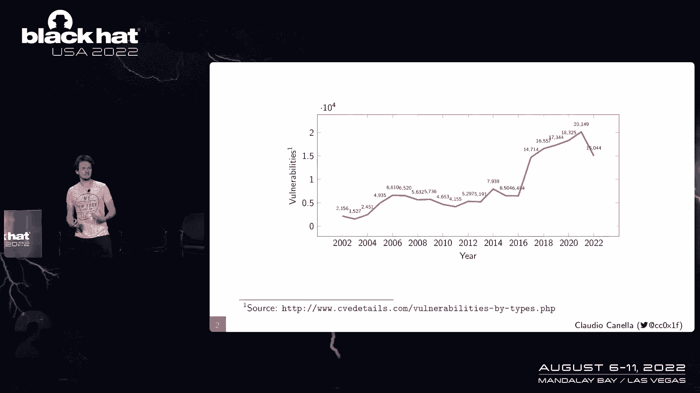

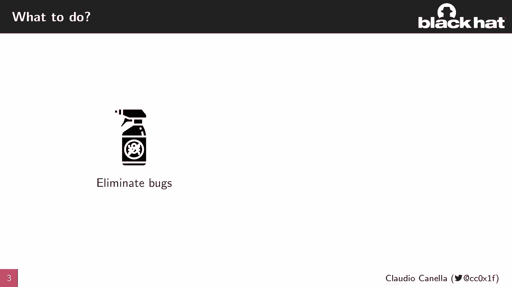

在本节课中，我们将学习一种名为 **Syscall Flow Integrity Protection (SFIP)** 的安全概念。该概念旨在通过强制执行系统调用的合法序列和来源，来限制程序被攻击后的影响范围。我们将了解其核心原理、实现方式以及它带来的安全效益。

## 概述

近年来，软件漏洞数量持续增长，我们需要有效的方法来限制漏洞被利用后的影响。传统的沙箱或控制流完整性（CFI）等方法存在一些局限。本次课程介绍的 **SFIP** 结合了系统调用过滤和程序行为分析，能够自动提取并强制执行合法的系统调用序列与来源，从而为程序提供更强的运行时保护。

## 动机：为何需要限制漏洞影响

我们首先看到软件漏洞（CVE）的数量逐年上升，这表明单纯消除漏洞非常困难。因此，我们需要关注如何**限制漏洞被利用后的影响**，即攻击者在控制程序后能做的事情受到严格约束。

过去已有一些尝试，例如沙箱和**控制流完整性（CFI）**。CFI的核心思想是：在编译或分析阶段提取程序的控制流图（CFG），然后在运行时检查控制流转移是否合法。其公式可抽象为：

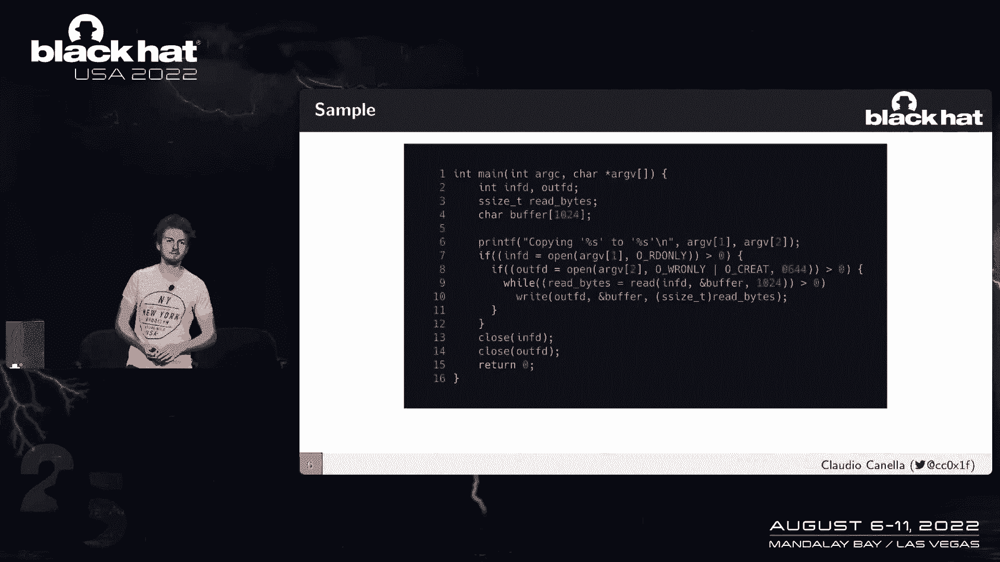

```
检查：当前跳转目标 ∈ 静态分析得出的合法目标集合
```

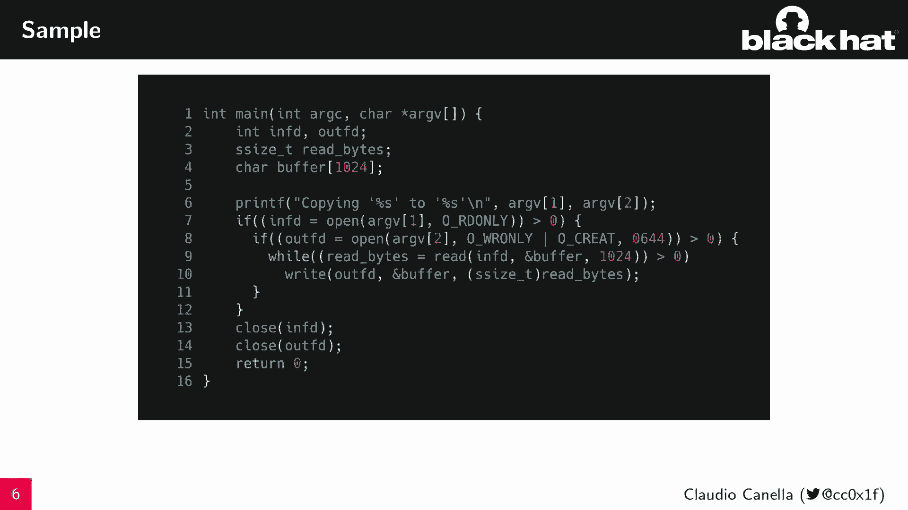

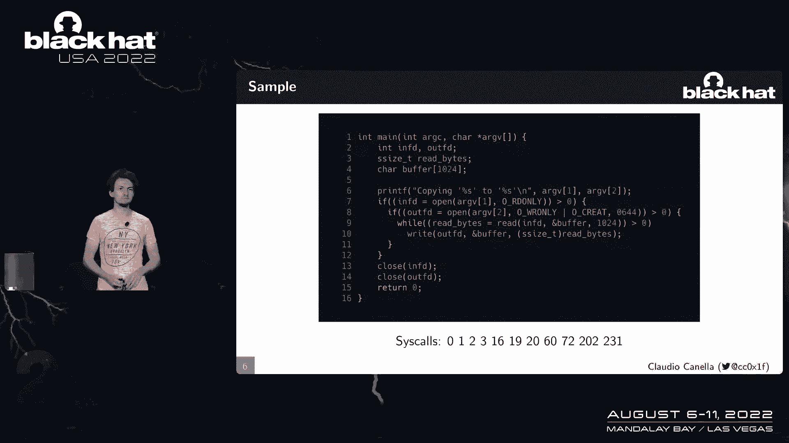

然而，CFI通常只适用于单个安全域（如用户空间或内核空间），难以处理跨域（如用户程序与操作系统）的交互。

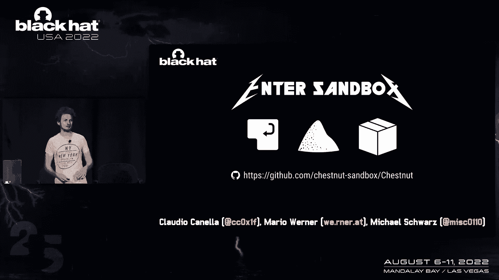

Linux 本身提供了 **seccomp** 机制来过滤系统调用。其流程是：开发者定义允许的系统调用列表，内核在每次系统调用时进行检查，若不在列表内则终止程序。其检查逻辑可简化为：

```c
if (current_syscall_number not in allowed_set) {
    terminate_process();
}
```

但 seccomp 有两个主要限制：
1.  它只检查**单个**系统调用，缺乏**上下文**信息（即调用序列）。
2.  对于大型复杂应用，由开发者手动确定所需的全部系统调用非常困难且容易出错。

## 引入 Syscall Flow Integrity Protection (SFIP)

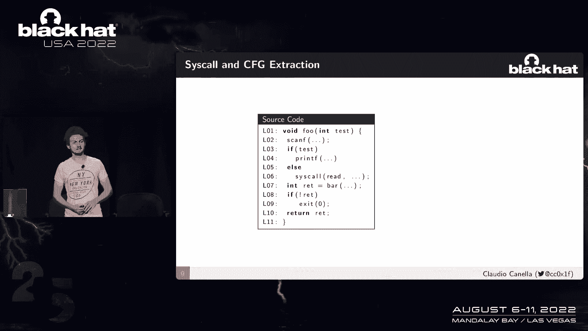

为了克服上述限制，我们提出了 **SFIP** 概念。它建立在三个支柱上：

1.  **状态机（State Machine）**：通过静态分析，提取程序所有可能的、长度为2的系统调用序列，并构建状态机来强制执行这些序列。
2.  **起源映射（Origin Mapping）**：在静态分析中，同时提取每个系统调用指令（即来源位置）与它能执行的系统调用号之间的映射关系。
3.  **内核执行（Kernel Enforcement）**：修改 Linux 内核，使其能接收并强制执行上述提取的序列和起源信息。

SFIP 的流程是：编译器工具链提取信息并编码到二进制文件中，一个支持库负责在程序启动时调整偏移量并将信息发送给内核，修改后的内核则在每次系统调用时进行拦截和检查。

接下来，我们将详细看看信息是如何提取的。

## 信息提取过程 🔍

信息提取是 SFIP 的前两个支柱（状态机和起源映射）的基础。这个过程主要由修改后的编译器工具链完成。

### 提取控制流与系统调用信息

编译器会分析源代码，构建过程内和过程间的控制流图（CFG）。在这个过程中，它会识别并记录所有系统调用指令的位置及其对应的系统调用号。

例如，对于一段简单代码，编译器会记录：
*   从 `main` 函数可以调用 `scanf` 和 `printf`。
*   在某个基本块中，有一处指令会执行 `read` 系统调用。

这些信息被编码到目标文件的特定段中。

### 提取系统调用起源（偏移量）

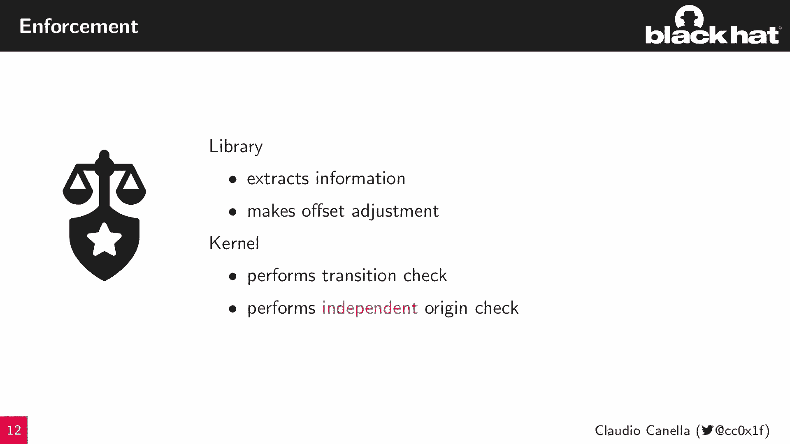

这部分更为复杂。编译器后端在遇到系统调用指令时，会用标签进行注释，记录该指令所在的函数以及系统调用号。由于此时指令的最终地址尚未确定，我们记录的是相对于函数开头的**偏移量**。

考虑一个翻译单元中的函数 `func`，它包含一个系统调用。编译器会生成类似如下的注释信息：
```
函数: func
偏移量: 0x10 (待最终确定)
系统调用号: 39
```

对于通过函数指针（如 `syscall` 函数）进行的系统调用，我们最初可能只知道偏移量而不知道具体的系统调用号，反之亦然。链接器在最终链接所有目标文件时，会整合这些信息，解决跨翻译单元的引用，生成完整的起源映射表。

### 生成状态机

链接器收集所有目标文件中的信息后，会构建出整个程序完整的控制流图。在此基础上，它遍历代码，模拟执行路径，记录下遇到的每一个系统调用序列（例如，`open` 之后是 `read`）。

最终，它会生成一个状态机，其中：
*   **状态**：表示上一个发生的系统调用（或初始状态）。
*   **转移**：表示从前一个系统调用到当前系统调用的合法转换。

同时，为每个函数生成的系统调用起源映射表也会被最终确定。所有这些信息被编码到最终的可执行文件中。

## 内核强制执行与评估 ⚙️

程序运行时，支持库会提取二进制中的 SFIP 信息，进行地址偏移调整，然后将其传递给修改后的内核。

内核的强制执行逻辑很简单，它拦截每个系统调用，并执行两步检查：
1.  **转移检查**：检查“当前系统调用”是否是“上一个系统调用”的有效后续目标（根据状态机）。
2.  **起源检查**：检查当前系统调用是否来自一个合法的指令位置（根据起源映射）。

只有两项检查都通过，系统调用才会被执行。

### 性能评估

我们对 SFIP 进行了性能测试。在微基准测试（连续执行一百万次 `getpid` 系统调用）中，SFIP 引入了开销，但其性能优于使用复杂 BPF 解释器的 seccomp。

在宏观基准测试中（编译并运行 Nginx、memcached、FFmpeg 等大型应用），SFIP 的开销非常低。即使在提供最全面保护（同时启用状态和起源检查）的组合模式下，所有测试应用的运行时开销也**低于 2%**，这对于大多数应用来说是可以接受的。

### 安全效益分析

SFIP 显著缩小了攻击面：
*   **状态机**：以 Nginx 为例，seccomp 允许 107 个系统调用中的任何一个相互转换（平均 107 个可能目标）。而 SFIP 的状态机将平均可能的下一个系统调用目标减少到约 74 个。
*   **起源映射**：Nginx 中有 318 个可以发起系统调用的指令位置。seccomp 下，每个允许的系统调用可以来自这 318 个位置中的任何一个。而 SFIP 的起源检查将每个系统调用平均限制在仅约 3 个特定位置执行。

在面向返回编程（ROP）攻击的背景下，SFIP 施加了严格限制：
1.  攻击者无法使用未在静态分析中出现的指令（如错位指令产生的意外 gadget）来执行系统调用。
2.  攻击者必须按照合法的系统调用序列来构建攻击链。
3.  攻击链中的每个系统调用还必须来自合法的起源位置。

这使得构建有效的 ROP 攻击变得极为困难。

## 限制与未来工作 🔮

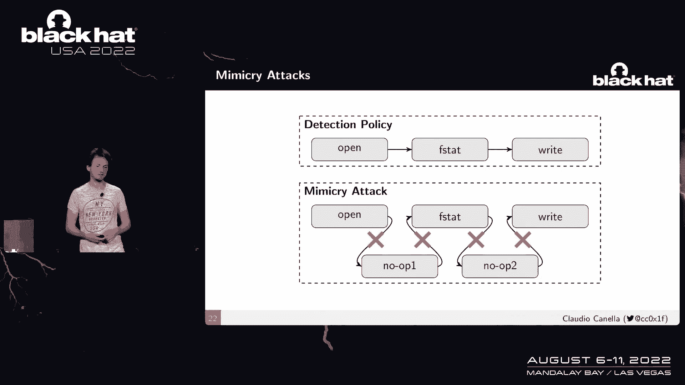

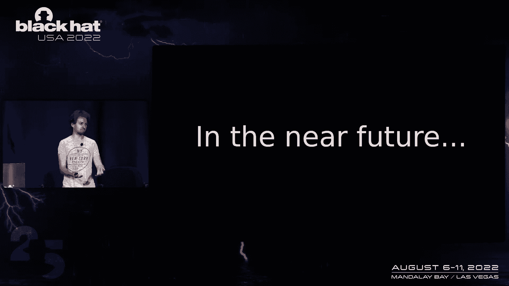

SFIP 并非完美，它也存在一些限制，主要源于静态分析的**过度近似**。这可能导致一种“模仿攻击”：攻击者通过插入无害的系统调用来“绕过”状态机的直接检查，迂回地达到恶意系统调用。

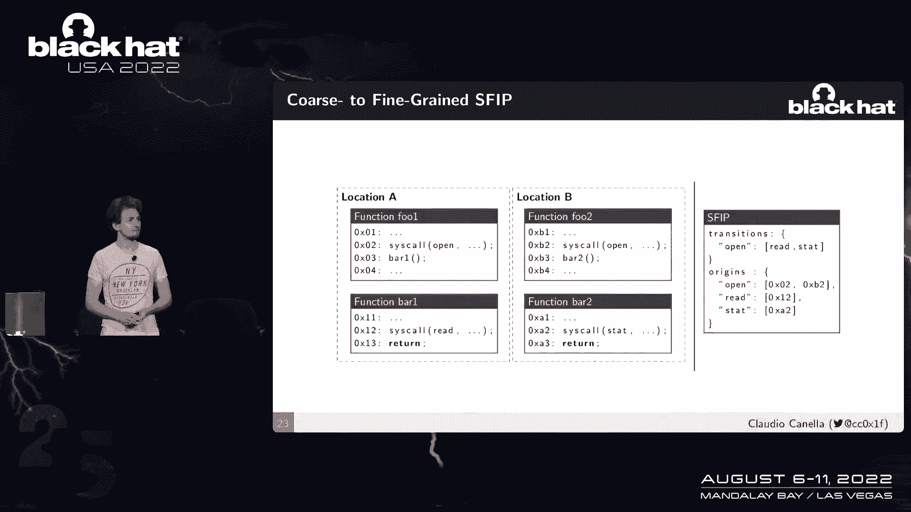

不过，即使在这种情况下，攻击仍受到起源检查的限制，并且攻击者需要深入了解程序内部状态。

我们正在研究**细粒度 SFIP**，它将转移检查与上一个系统调用的具体起源位置绑定。例如，“在位置 A 发生的 `open` 只能跳转到 `read`，而在位置 B 发生的 `open` 只能跳转到 `stat`”。这能提供更强的安全保障，但可能会带来更高的性能开销。

## 总结

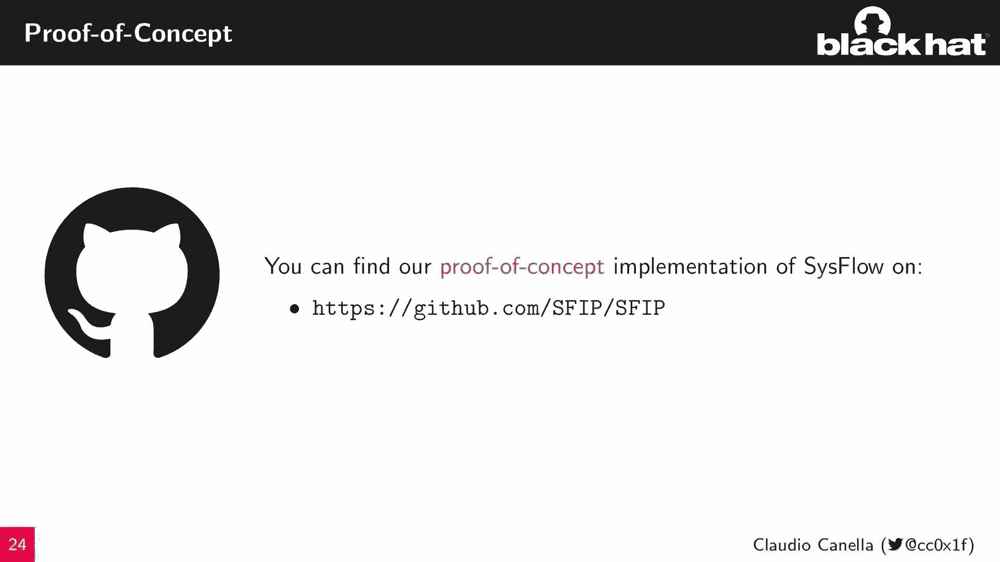

本节课我们一起学习了 **Syscall Flow Integrity Protection (SFIP)** 这一安全概念。

*   **它是什么**：一个通过强制执行合法系统调用序列和来源，来限制程序运行时行为的保护机制。
*   **如何工作**：基于静态分析自动提取程序行为模型（状态机和起源映射），并通过修改内核在运行时强制执行。
*   **有何优势**：
    *   **全自动**：无需开发者手动干预。
    *   **低开销**：运行时性能开销通常低于 2%。
    *   **高安全**：显著减少合法的系统调用转移和起源位置，极大增加了攻击者利用漏洞的难度。
*   **当前局限**：存在因静态分析过度近似而可能被迂回攻击的风险，更精细的模型正在研究中。

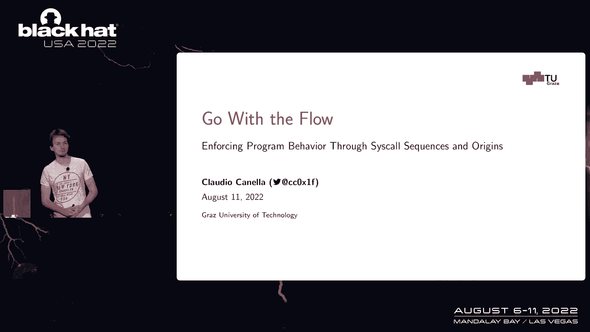

SFIP 为缓解控制流劫持攻击、限制漏洞利用影响提供了一种有效且实用的新思路。