# 课程 P66：075 - 人类在地球上制造的故障：SpaceX Starlink 用户终端黑盒安全评估 🛰️🔓

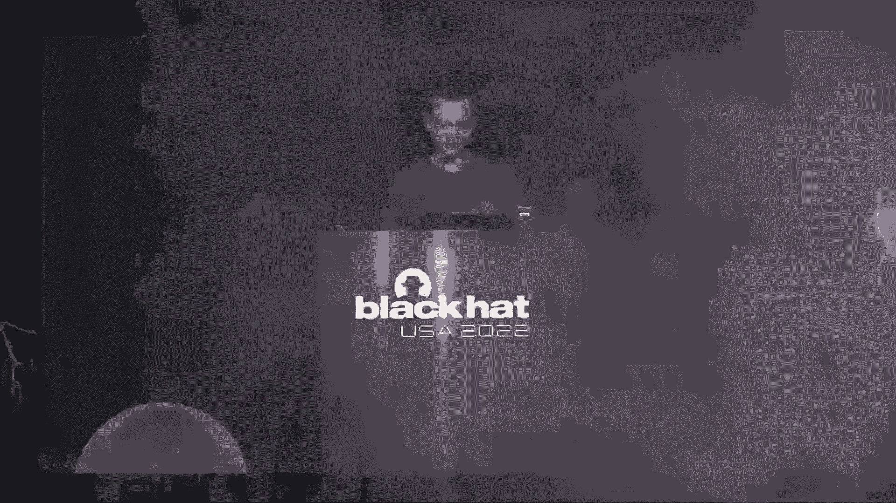

在本节课中，我们将学习如何对 SpaceX Starlink 用户终端进行黑盒安全评估。我们将从硬件拆解开始，逐步深入到固件提取、安全启动机制分析，并最终演示如何通过电压毛刺注入攻击绕过其安全防护，获取设备的根权限。整个过程将展示在缺乏数据表和开放样本的情况下，如何对一个复杂的嵌入式系统进行逆向工程和安全测试。

## 硬件拆解与初步分析

首先，我们需要对 Starlink 用户终端进行物理拆解，以了解其内部结构和关键组件。

拆下用户终端的塑料外壳后，会看到一个巨大的金属屏蔽罩。屏蔽罩上有一个小切口，显示了三个连接器：一个是以太网供电连接器，一个是电机连接器，另一个是未填充的连接器。通常情况下，未填充的连接器可能意味着存在调试接口，但在此设备上并非如此。

通过观察启动过程，我们发现设备使用 U-Boot 作为引导加载程序，但其输入被设置为 `null`。这意味着无法通过串行连接器进入 U-Boot 命令行界面来修改内核参数。

当设备完全启动后，会显示一个登录提示符。提示信息显示“开发登录已启用”，但紧接着是“否”，因为该设备并非开发版本。因此，无论输入什么凭据，都无法成功登录。

为了深入分析，我们必须继续拆解。这块主板的直径约为60厘米，结构复杂。

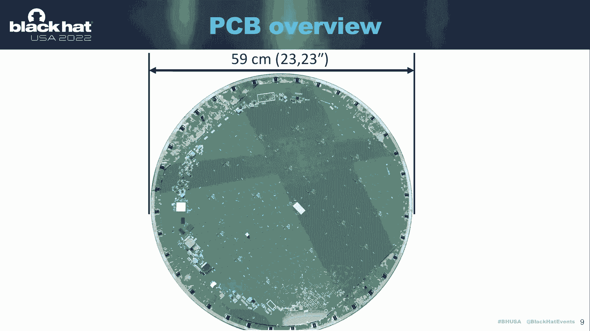

以下是我们在主板上识别出的关键区域：
*   **GPS接收芯片**：用于定位。
*   **以太网供电相关电路**：为设备提供网络和电力。
*   **时钟生成电路**：为 SoC 和射频硬件提供时钟信号。
*   **数字波束成形器**：由 ST 制造，代号为“设拉子”。每个波束成形器连接了16个前端模块，代号为“脉冲星”。
*   **片上系统**：这是一个定制的四核 ARM Cortex-A53，由 ST 制造，代号为“卡顿”。该芯片已进行过多次硅修订。
*   **安全元件**：用于实现高级安全功能，我们将在课程末尾详细解释其用途。
*   **4GB eMMC 存储芯片**：本质上是一张定制的 SD 卡，用于存储固件。
*   **8Gb DDR 内存**。

SoC 采用倒装芯片封装并集成了散热器。移除金属盖后，可以接触到芯片的背面，从而能够对芯片模具进行成像，这对于后续的物理攻击定位至关重要。

## 固件提取与分析

上一节我们介绍了硬件结构，本节中我们来看看如何提取并分析设备固件，以寻找潜在的软件漏洞。

为了提取固件，我需要读取 eMMC 存储芯片的内容。通常的做法是拆焊芯片，但为了避免损坏主板，我选择通过飞线连接到板上的测试点，并使用逻辑分析仪在设备启动时捕获通信数据。通过分析，确定了读取 eMMC 所需的时钟、命令和数据线。

eMMC 芯片工作在 1.8V，因此在家复现时，可以使用一个廉价的电平转换器和一个 SD 卡读卡器来直接读取其内容。

获得 eMMC 的二进制转储后，可以借助 GitHub 上可用的 GPL 代码将其划分为不同的分区。分区包括可信固件引导阶段、扁平设备树镜像、Linux 内核、根文件系统，以及一些运行时分区（如每台设备独有的校准数据、版本信息和 DishConfig）。

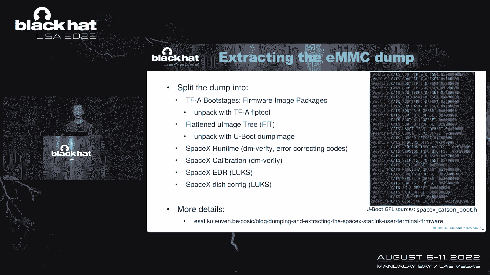

所有这些分区都受到加密或签名保护。可信固件引导阶段也实现了安全启动，这意味着我们无法轻易地将自己的固件刷写到 eMMC 芯片上。

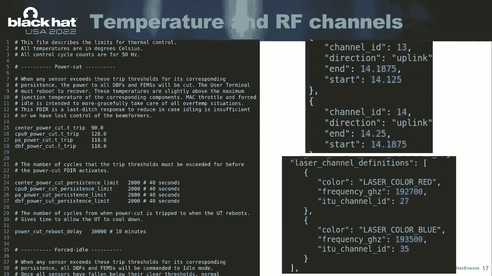

通过分析提取的固件，我们可以深入了解系统的工作原理。例如，固件中包含详细注释的文件，解释了热管理机制、使用的射频通道频率以及卫星间激光链路的频率。此外，代码显示 SpaceX 收集了大量用户终端遥测数据，并跟踪其开发设备的地理围栏位置。

## 登录机制与故障注入攻击思路

在分析了固件之后，我们重点关注了登录提示符的工作机制。代码逻辑是：打印“开发登录已启用”，然后检查设备是否为开发版本。如果是，则设置根密码并允许登录；如果不是，则不设置密码，导致无法登录。

逻辑分析仪捕获的输出显示，在打印“开发登录已启用”和“否”之间有两毫秒的间隔。我们的攻击思路就是利用故障注入，在这个检查执行的瞬间干扰设备，使其误判为开发版本。

谈到故障注入，对于这种采用倒装芯片封装、暴露硅背面的设备，通常会考虑使用激光故障注入、体偏置注入或电磁故障注入等高级技术。

然而，Starlink 用户终端的主板尺寸巨大，无法放入我们实验室的标准故障注入设备中。考虑到现实世界中设备安装在屋顶，使用激光等精密仪器进行攻击也不切实际。因此，我们决定采用黑盒攻击方式，即在不依赖数据表或类似产品参考的情况下进行尝试。

在多种可能的攻击向量中（如干扰时钟、干扰复位线），我最终选择了电压毛刺注入。初始设置相对简单：将芯片测试仪连接到 SoC 的电压电源上，并通过 Python 脚本控制毛刺的时序和参数，同时用示波器监控串行输出。

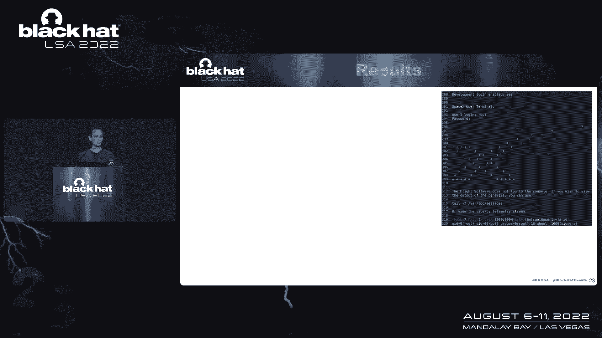

通过这种初步尝试，我们偶尔能得到“开发登录已启用：是”的结果，并可以使用用户名 `root` 和密码 `Falcon` 登录。这证明了 SoC 容易受到电压故障的影响。然而，这种攻击非常不可靠，成功率低，且每次尝试都需要长达12秒的完整重启周期。

## 深入引导链：攻击安全启动

为了提升攻击的可靠性和效率，我们需要将攻击目标前移到更早的引导阶段，即安全启动链。

该 SoC 实现了 ARM TrustZone 技术，拥有自己的引导只读存储器代码和一次性可编程存储器。引导只读存储器加载并验证第二阶段引导加载程序的证书（一种 SpaceX 自定义格式），检查签名有效性，然后验证固件镜像的哈希值是否与证书中存储的匹配。

在黑盒场景下，我们不知道签名验证和哈希比较的确切发生时间。因此，需要通过大量实验来缩小毛刺注入的正确时机。我们改进了实验设置：移除了大部分去耦电容以增加电压不稳定性，并使用了一个微探针在 CPU 核心区域采集侧信道信息。

侧信道信息（以蓝色显示）与串行输出（黑色）结合，帮助我们精确地定位了签名验证开始的时刻。我们发现，如果在签名验证刚开始时注入一个毛刺，可以完全跳过整个验证过程，使设备加载并执行我们控制的第二阶段引导加载程序。

通过这种方式，我们能够转储并分析引导只读存储器代码。我尝试在模拟器中对其进行模糊测试，但未发现软件漏洞。模拟故障攻击（假设单条指令被跳过）也未能成功，因为主引导加载程序中实现了针对此类故障模型的对策。然而，实际硬件的故障效应与模拟模型不同，这使得对策失效。

## 构建可重复的移动攻击平台

上一节我们证明了在实验室环境下攻击是可行的，本节中我们来看看如何将复杂的实验室设置简化为一个便携式的攻击工具。

我们面临的一个问题是，为了在引导只读存储器阶段成功注入毛刺，需要移除大量去耦电容，但这会导致系统在启动 Linux 时过于不稳定。因此，我需要设计一种方法，能够动态地启用和禁用这些去耦电容。

经过大量手工实验，我成功设计了一个由 MOSFET 控制的电路来解决这个问题。为了制作一个整洁、可移动的攻击平台，我使用平板扫描仪获取了主板的精确图像，并据此设计了定制 PCB。

最终的“改装芯片”由一个超频至 250MHz 的 Raspberry Pi Pico 微控制器控制，用于精确触发毛刺。该微控制器还负责控制 MOSFET 来开关去耦电容，并通过一个栅极驱动器注入电压毛刺。整个模块高度约6厘米。

这个移动设置成功实现了攻击，使我能够在用户终端上获得根 shell 并连接到网络。然而，在一次固件更新后，SpaceX 烧断了设备上的串行输出保险丝，导致控制台不再输出任何信息。

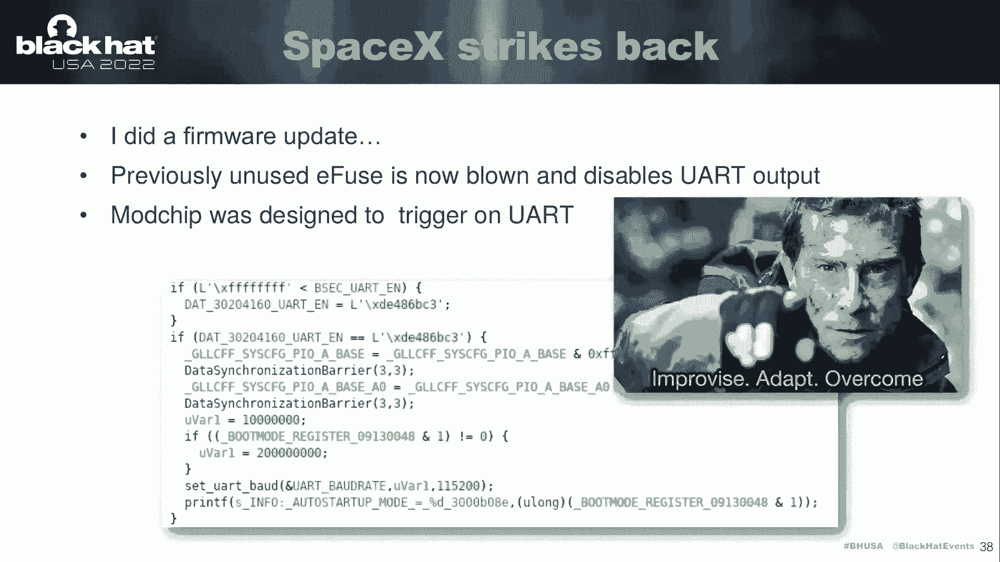

## 应对升级与探索网络

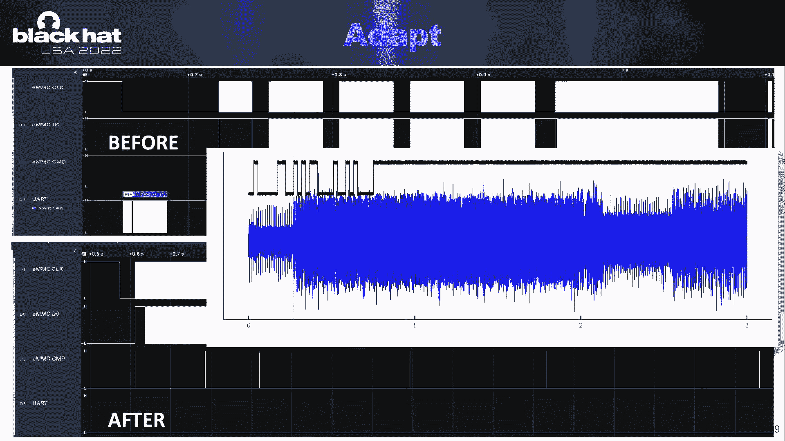

面对串行输出被禁用的新固件，我们需要调整攻击策略。

幸运的是，我们早期实验收集的侧信道数据仍然可用。通过比较保险丝烧断前后的侧信道波形，我们可以识别出关键的引导模式，从而确定毛刺注入的新时机。我通过修改“改装芯片”，增加了一条飞线来监控 eMMC 的数据线，成功适应了这一变化。

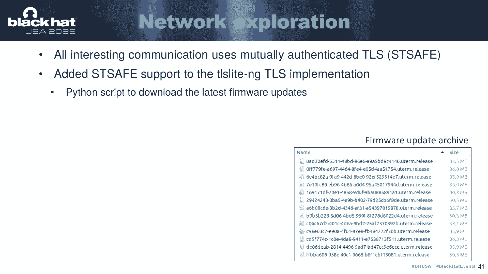

在获得设备访问权限后，我开始探索网络基础设施。设备与后端服务器的通信大多基于 IPv6，并使用 TLS 进行加密，其中客户端认证由 ST 安全元件处理。这意味着无法轻易拦截或篡改数据。

为了分析网络通信，我向一个纯 Python 实现的 TLS 库中添加了 ST 安全元件的支持，从而能够编写脚本在固件更新发布给特定用户终端之前就将其下载下来。我开始系统地收集固件更新，建立自己的档案库以观察其变化。

## 总结与现场演示

本节课中，我们一起学习了如何对 SpaceX Starlink 用户终端进行全面的黑盒安全评估。

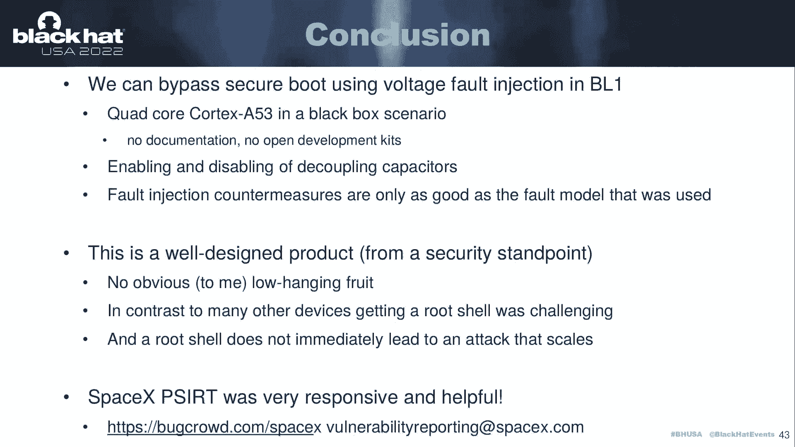

我们证明了可以通过电压毛刺注入攻击，在引导只读存储器阶段绕过其安全启动机制。攻击在一个定制的四核 Cortex-A53 SoC 上实现，且完全处于黑盒环境。我们发明了一种动态启用/禁用去耦电容的方法，并发现设备中实现的故障注入对策所基于的故障模型与实际硬件行为不符，因此被绕过。

从安全角度来看，这是一个设计精良的产品，没有明显的低级漏洞。SpaceX 的产品安全事件响应团队反应迅速且乐于助人。

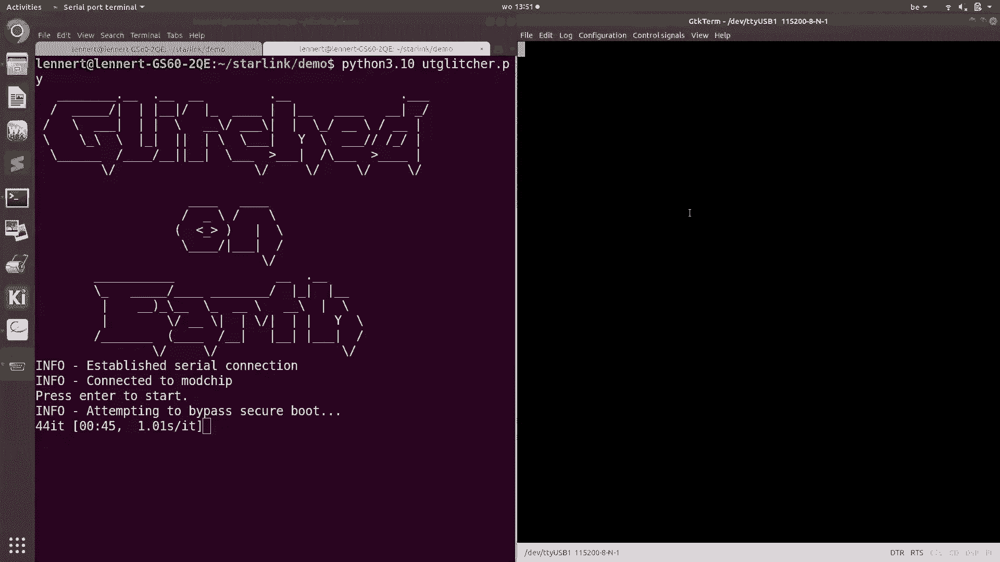

最后，我将尝试进行现场演示，展示如何利用“改装芯片”对一台串行保险丝已烧断的设备成功实施故障注入攻击，并最终获取根权限。

（现场演示部分：通过 Python 脚本与“改装芯片”通信，设置参数并触发攻击。成功后在串行终端使用 `root`/`Falcon` 登录，并执行命令查看系统日志和实时卫星连接状态。）

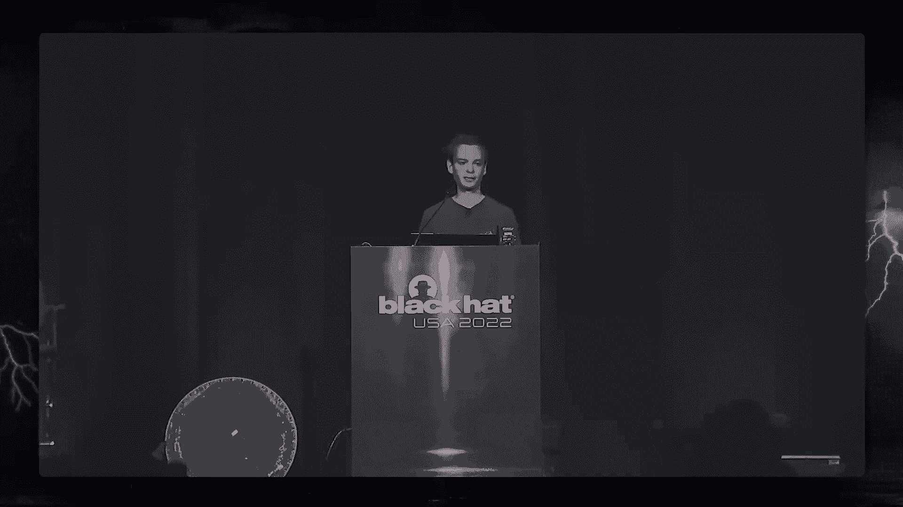

演示成功，表明即使在固件升级后，该攻击方法仍然有效。这为安全研究人员探索 Starlink 网络基础设施和波束成形器等组件提供了可能性。