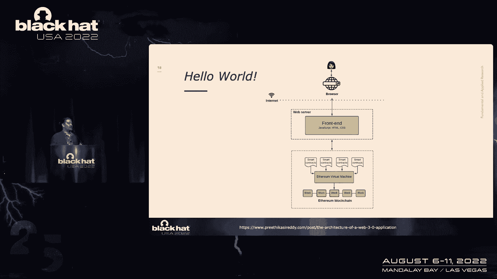
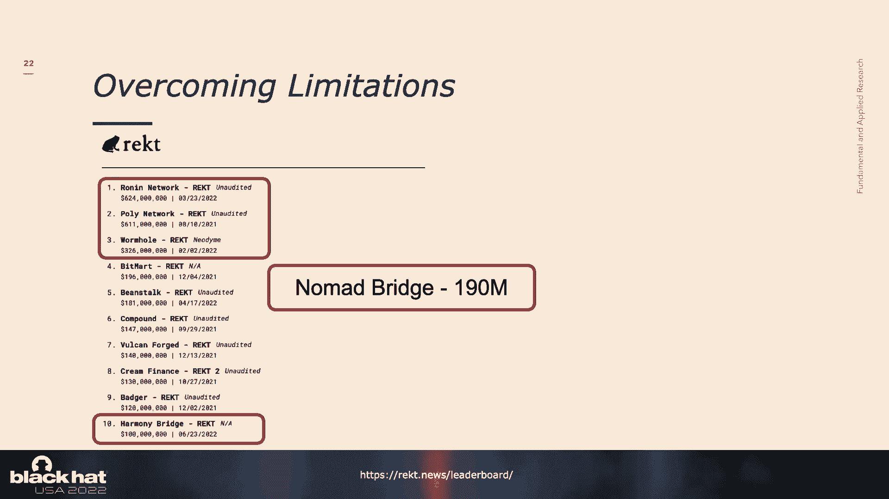
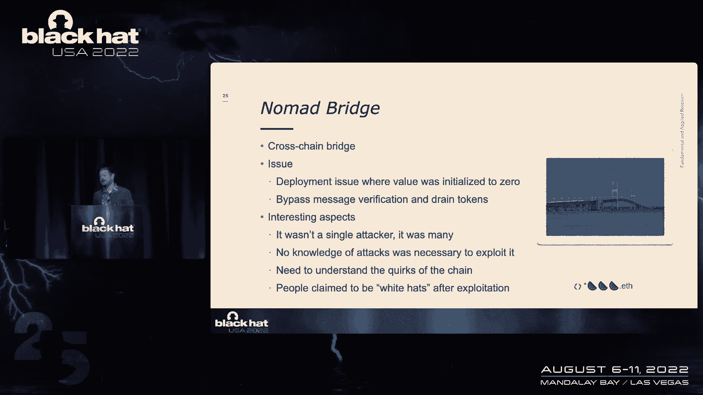
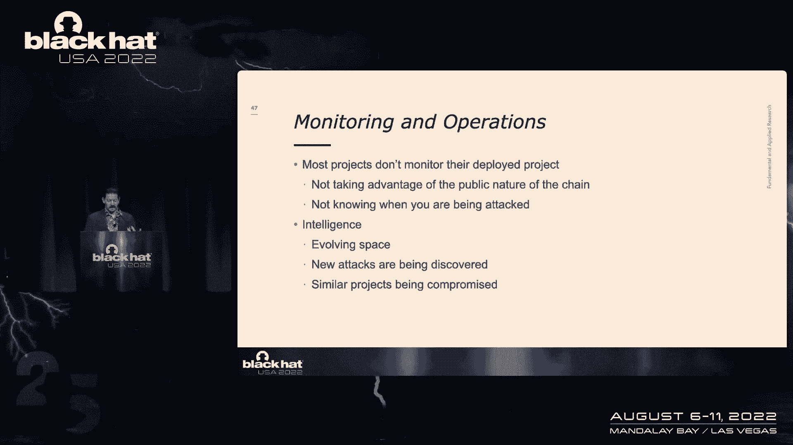
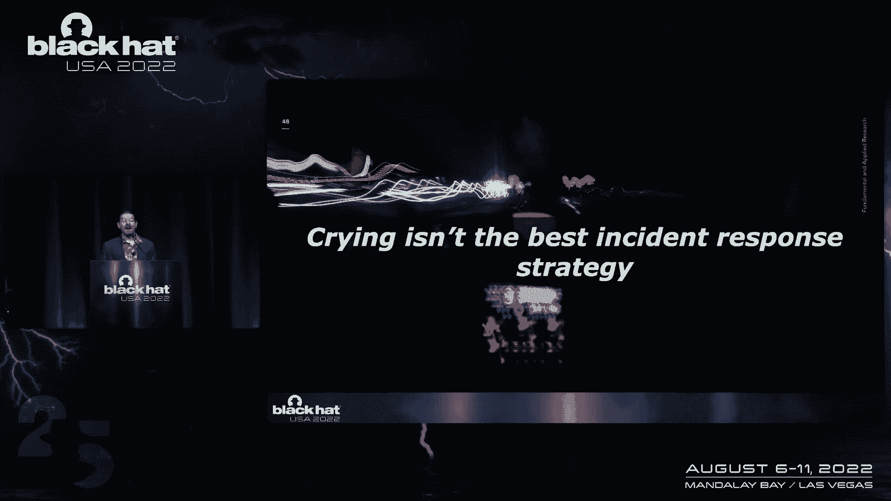

# 课程 P67：从黑客马拉松到被黑：Web3 的安全之旅 🛡️

在本节课中，我们将跟随 Nathan Hamiel 的演讲，系统性地探讨 Web3 领域的安全现状、核心问题及其根源。我们将分析真实的安全事件，理解其背后的技术、文化和流程因素，并探讨如何构建一个更安全的 Web3 生态系统。

## 概述

Web3 作为互联网的下一代愿景，其应用构建在区块链技术之上。然而，这个新兴领域正面临着严峻的安全挑战，频繁发生的高价值攻击事件揭示了其脆弱性。本节课旨在剖析这些安全问题持续存在的原因，并探讨安全社区如何参与其中，共同推动该领域走向成熟。

## Web3 安全现状：一场完美风暴

上一节我们介绍了课程背景，本节中我们来看看当前 Web3 领域面临的安全困境。如果用一句话总结，那就是：**缺乏经验的开发者在众目睽睽之下，于新兴平台上编写新的金融产品，失败的代价极高，而开发所需的时间和精力却极低。**

这构成了一场“完美风暴”。高价值的目标、公开暴露的代码以及尚未被完全探索的攻击面，意味着一个简单的错误就可能立即导致毁灭性的后果。Web3 项目没有“优雅失败”的奢侈，一旦被攻破，往往意味着资产的永久损失。

## 为何安全专业人士需要关注 Web3？

你可能会认为 Web3 的安全问题与己无关。然而，脆弱技术的存在不会让世界变得更好，它们往往在意想不到的地方被采用，使我们落后于防御曲线。此外：

*   **存在真正的创新技术**：如零知识证明和阈值密码学等先进密码学的研究，正得到区块链领域的大量资助，这些技术对传统业务也大有裨益。
*   **丰厚的漏洞赏金**：这里存在高达数百万美元的漏洞赏金计划。
*   **国家背景的攻击者已入场**：例如 Lazarus 集团被指控发动了史上最大的加密货币黑客攻击。
*   **安全是成功的基石**：Web3 提供了一个独特的用例——如果缺乏安全，它就根本无法成功。这与传统软件中“脆弱软件可能更有市场”的情况截然不同。

作为安全社区，我们不应排斥新技术。历史表明，新技术（如云计算、物联网）最终会迫使我们提升安全能力，其影响远超该领域本身。

## Web3 架构的复杂性与攻击面

在深入具体问题前，我们需要理解 Web3 应用的复杂性。一个简单的“Hello World”式链上应用看似无害，但一旦需要处理链下数据、追求可扩展性或高速度，架构就会变得异常复杂。

以下是构建一个功能完整的 DApp 可能引入的组件及其带来的新攻击面：

*   **预言机**：用于获取链下数据。
*   **钱包**：管理用户密钥和资产。
*   **去中心化存储**：如 IPFS 或 Arweave。
*   **二层网络/侧链**：为解决主链性能问题而构建。
*   **跨链桥**：实现不同区块链间的资产转移。

此外，Web3 生态并非只有以太坊，而是存在数百条区块链，每条链都可被视为独立的“操作系统”，每种智能合约语言都有其独特的框架和“怪癖”。例如，在某些语言中，用错误的值初始化变量可能默认为 `true`，从而导致灾难性后果。区块链本身对外部世界一无所知，这种孤立性催生了预言机、跨链桥等解决方案，而这些恰恰是安全事件的高发区。

## 典型攻击案例分析

上一节我们了解了攻击面，本节中我们通过几个发生在今年的真实案例，来看看攻击是如何发生的。这些攻击从简单到复杂，揭示了不同层面的问题。

**1. 跨链桥攻击：Wormhole**
跨链桥允许资产在不同区块链间转移。Wormhole 攻击源于一个初始化为零的值，绕过了消息授权。攻击者甚至无需理解漏洞原理，只需复制一个成功交易并替换钱包地址广播，即可盗取资产。这导致了“食人鱼”式的群体攻击，直至资金耗尽。

**2. 私钥泄露：Slope Wallet**
这是一个非托管钱包。其移动应用开启了详细日志记录，并将日志（意外包含了用户私钥和助记词）发送到第三方云服务。任何查看过日志的人都会立即发现这个致命错误。这凸显了错误配置和缺乏监控的严重后果。

**3. 验证者攻击：Ronin Network**
Ronin 是游戏 Axie Infinity 使用的侧链。攻击始于对一名开发者的网络钓鱼，最终攻击者控制了9个验证者中的4个（均由项目方运营），从而控制了网络并盗取6.24亿美元。此攻击被归因于国家背景的 Lazarus 集团，展示了传统攻击手法与区块链脆弱点的结合。

**4. 治理攻击：Beanstalk**
这是一个基于社区治理（DAO）的协议。攻击者利用闪电贷（一种需在同一交易内归还的贷款）操纵治理投票，获得了多数投票权，然后提案将项目所有资金转移给自己。这暴露了某些治理机制在设计上的脆弱性。

## 安全问题的根源剖析

面对如此多的高调攻击，为何问题仍未解决？根源在于技术、文化、经验和流程等多个层面。

**文化与理念**
*   **去中心化的双刃剑**：去中心化意味着没有单一责任方，同时也意味着“没有人拥有问题”。社区治理（DAO）在应对紧急安全漏洞时往往效率低下。
*   **“部署即永恒”的心态**：为了建立信任，许多项目追求代码不可升级。然而，安全是持续的过程，在未发现所有漏洞前锁定代码无异于作茧自缚。
*   **激进的透明度**：在公开的 GitHub 仓库和 issue 中讨论安全问题，在代码无法更新时反而成为攻击者的指南。
*   **“代码达尔文主义”**：认为开发者应自负其责，这种心态无助于生态系统整体的安全提升。

**经验与成熟度**
许多项目开发者是新手，缺乏构建金融级应用的经验和安全意识。常见问题包括：
*   未进行最基本的威胁建模（例如，“出错了怎么办？”）。
*   将安全审计视为“一次性认证”，而非持续安全过程的一部分。
*   缺乏传统开发中的安全护栏和代码审查流程。

**流程与标准**
目前严重缺乏成熟的安全流程和标准：
*   无正式的漏洞报告和响应流程。
*   几乎没有运行监控，甚至需要社区成员提醒项目方资金已被盗（如 Ronin 事件）。
*   未从传统 DevSecOps、威胁建模等领域吸取教训。

## 构建更安全的 Web3 未来

尽管挑战巨大，但现状比几年前已有所改善，有更多资源和信息可供利用。安全是一项团队运动，需要各方共同努力。

**对安全专业人士的建议**
*   **填补知识鸿沟**：学习 Web3 架构、智能合约语言和特定于链的保护机制。
*   **贡献安全能力**：编写漏洞报告、创建 CTF 挑战、参与漏洞赏金计划、开发静态分析工具（例如针对 Solidity 或 Rust 的 Semgrep 规则集）。

**对风投和基金会的建议**
*   不能仅满足于要求项目进行安全审计。应要求项目提供详细的安全计划、事件响应策略和监控方案。
*   资助更多的安全研究。

**对区块链核心开发团队的建议**
*   提供更好的安全文档和指南。
*   在编译器或原生层集成安全保护，防止一些显而易见的错误。
*   发布常见应用（如 AMM、跨链桥）的参考架构。

**对 Web3 项目方的建议（最为关键）**
*   **尽早引入安全**：安全不能是事后考虑。即使只有两人团队，也应投入安全资源。
*   **学习 DevSecOps**：实施威胁建模、静态分析、代码标记审查和功能测试。
*   **实施防御性编码**：在合约中内置保护措施，例如提款速率限制、紧急暂停功能。
*   **建立监控和响应策略**：利用区块链的公开特性监控异常交易，制定并演练事件响应计划。

## 总结

本节课我们一起学习了 Web3 领域严峻的安全形势。我们看到，高价值、高曝光度与不成熟的技术、文化和流程相结合，导致了频繁发生的灾难性攻击。从简单的配置错误到复杂的多阶段国家攻击，攻击面遍布整个技术栈。

解决这些问题没有银弹。它要求项目方摒弃“快速推出、无视安全”的心态，像对待传统金融软件一样重视安全生命周期。同时，也要求更广泛的安全社区积极介入，贡献专业知识，帮助这个新兴领域建立稳健的安全基础。只有当安全成为 Web3 基因的一部分时，其承诺的去中心化愿景才有可能真正实现。