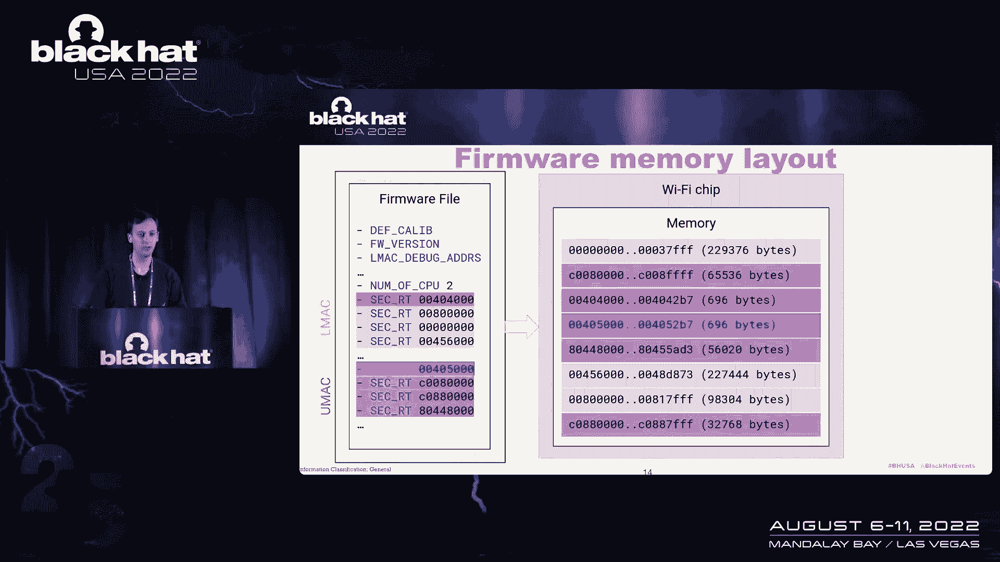
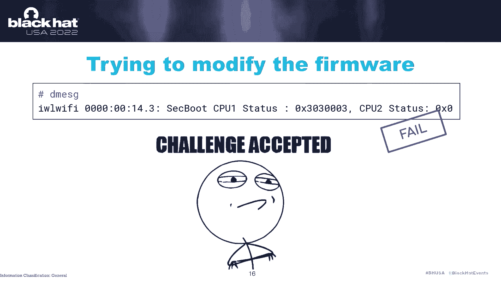
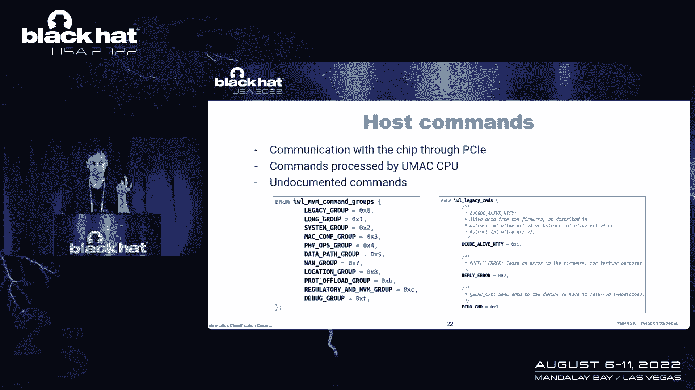
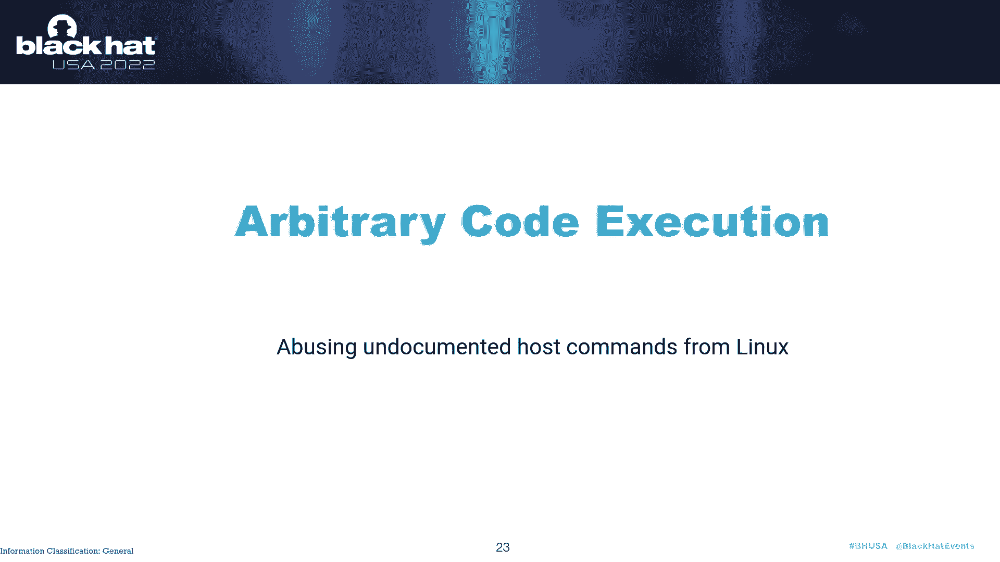
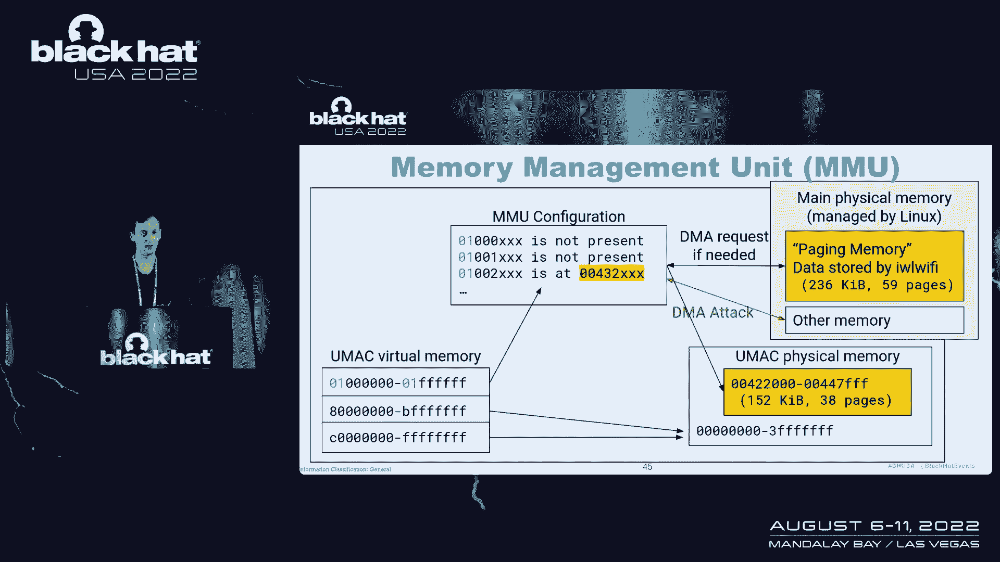
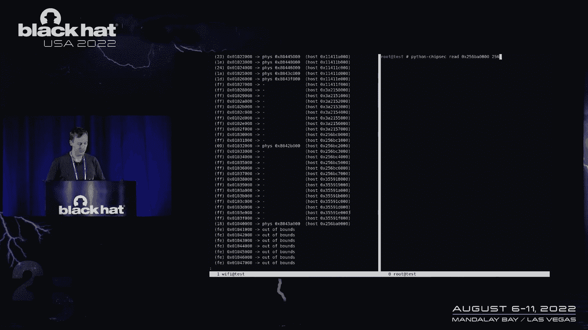
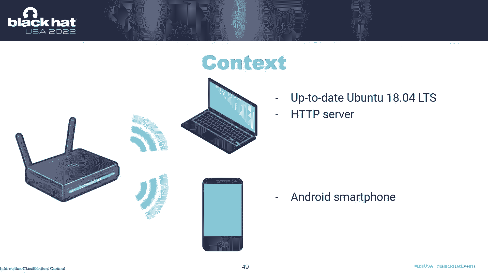

# 课程 P68：077 - 无线网络中的幽灵（iwlwifi版） 👻📡

在本节课中，我们将学习英特尔无线网卡（iwlwifi）固件的安全研究。我们将探讨如何分析固件、发现漏洞，并最终在网卡芯片上执行任意代码。课程内容从基础概念开始，逐步深入到实际利用技术。

---

## 固件分析 🔍

上一节我们介绍了课程概述，本节中我们来看看如何分析英特尔WiFi芯片上运行的固件。

固件在芯片启动时通过Linux内核的通道模块加载。该固件文件是一个包含头部信息和实际代码的二进制数据块。通过分析开源的Linux内核模块代码，我们可以解码固件结构。

固件元数据中包含了关键信息，例如：
*   **固件版本**：标识固件的构建版本。
*   **CPU数量**：英特尔WiFi芯片通常包含两个处理器。
*   **内存区域映射**：定义了代码和数据加载到芯片内存的哪些位置。

两个处理器分别是：
1.  **UMAC（用户媒体访问控制器）CPU**：负责处理高级WiFi协议。
2.  **LMAC（链路媒体访问控制器）CPU**：负责驱动物理层和底层协议。

两个处理器共享同一块片上内存。固件文件中的条目将这些处理器的不同状态映射到特定的内存区域。

为了深入分析，我们需要提取和解压固件中的代码。例如，可以使用名为 `iwlwifi-firmware-parser` 的工具，它能够解析固件文件并提取出可分析的代码段。

```bash
# 示例：使用工具解析固件
python3 iwlwifi-firmware-parser.py firmware.bin
```



通过这种方式，我们可以获得固件代码，以便进行逆向工程，更好地理解其功能。

---



## 与芯片通信 💬

了解了固件结构后，我们需要一种方式与WiFi芯片进行交互，以读取其状态和内存。

在Linux系统中，WiFi芯片作为PCIe设备暴露了一系列调试接口。通过sysfs文件系统，我们可以访问这些接口。

以下是关键的sysfs文件：
*   `/sys/kernel/debug/iwlwifi/.../mem`：此文件允许**读取**WiFi芯片的内存，但不能写入。
*   `/sys/kernel/debug/iwlwifi/.../fh_reg`：此文件允许读取芯片内部的功能硬件（FH）寄存器。

通过读取这些寄存器，我们可以获得有价值的信息。例如，通过读取 `PC` 和 `MAC` 寄存器，我们可以获取两个处理器当前正在执行的代码地址。这为我们提供了芯片运行时状态的窗口。

```c
// 示例：在Linux内核源码中查找寄存器定义的宏
#define IWL_FH_MEM_RREG(_addr) ...
#define IWL_FH_MEM_WREG(_addr, _val) ...
```



这种调试接口本不应在正常操作模式下暴露，但研究发现它们在某些配置下是可访问的。这为我们的安全研究提供了重要的切入点。



---

## 漏洞发现与利用 ⚔️

现在我们已经能够与芯片通信，本节我们来看看研究中发现的一些关键漏洞，以及如何利用它们。

研究发现，芯片处理来自主机的某些命令时存在漏洞。具体来说，在处理“读取”命令时，代码存在一个基本的缓冲区溢出问题。

以下是漏洞的简化逻辑：
1.  主机发送一个特制的命令数据包。
2.  芯片上的固件处理该命令，将数据复制到一个固定大小的缓冲区。
3.  由于缺乏边界检查，攻击者可以提供超长的数据，导致缓冲区溢出。

利用这个漏洞，我们可以覆盖芯片内存中的关键数据，例如函数指针或配置值。通过精心构造溢出数据，我们能够劫持程序执行流，转而执行我们注入的代码。

在实践中，利用过程分为几步：
1.  **信息收集**：利用sysfs接口读取芯片内存，了解内存布局和关键地址。
2.  **漏洞触发**：发送恶意命令包，触发缓冲区溢出。
3.  **代码执行**：通过溢出覆盖控制流，跳转到我们可控的内存区域执行代码。

最初，这只能在较旧的、处于“调试模式”的芯片上实现。因为默认的“污染模式”限制了内存写入。

---

## 绕过保护机制 🛡️➡️🚪

上一节我们利用了一个缓冲区溢出漏洞，但它在默认的“污染模式”下受到限制。本节我们探讨如何绕过这些保护机制，在更新的芯片上实现代码执行。

关键思路在于攻击固件加载过程。固件在芯片启动时由一个小的“加载器”程序验证并加载。这个加载器会检查固件的数字签名。

我们尝试了一种“检查-使用-时差”攻击：
1.  在加载器检查签名后、加载代码前，快速替换内存中的固件数据。
2.  结果发现，加载器在验证签名后立即使该内存区域只读，此方法失败。

然而，我们发现了另一个突破口。加载器在启动初期会使用一个数据区域（`data`段），而这个区域在签名验证**之前**就可写。我们可以：
1.  在加载器启动前，将修改后的固件代码写入该数据区域。
2.  等待加载器执行到该区域时，运行我们的代码。

通过这种方法，我们成功在更新的芯片上实现了任意代码执行。这需要本地高权限（能够在内核模块中运行代码），但证明了保护机制可以被绕过。

---

## 实验与工具 🧪

在获得代码执行能力后，我们开发了一些工具和实验来进一步研究芯片。

我们可以实现一个简单的**代码跟踪器**。方法是将特定函数的首条指令替换为“断点”指令，当函数被调用时，记录调用信息到一个全局缓冲区，然后通过调试接口读取。

```python
# 概念性代码：记录函数调用
def trace_function(function_address):
    # 1. 将 function_address 处的指令替换为断点指令
    # 2. 设置中断处理程序，将函数名记录到缓冲区
    # 3. 通过sysfs读取缓冲区数据
    pass
```

此外，我们尝试了**硬件模拟**。使用QEMU等工具模拟固件运行环境，并将对硬件的访问重定向到真实的物理芯片。这对于动态分析复杂功能很有用，但由于芯片内部计时器众多，模拟环境可能不稳定。

这些实验帮助我们更好地理解WiFi芯片在运行各种协议（如连接、认证、数据传输）时的内部状态和行为。

---

## DMA攻击探索 🎯

一个核心问题是：能否从WiFi芯片发起直接内存访问（DMA）攻击，读取或修改主机内存？

在x86系统上，DMA攻击通常通过PCIe总线进行。然而，英特尔WiFi芯片的DMA引擎对主机内存的访问是经过抽象和管理的，处理器不能直接访问物理地址。

我们转而研究芯片的**内存管理单元（MMU）**。MMU将处理器发出的内存访问请求，映射到主机物理内存的特定页面。研究发现，芯片上运行的代码有一部分是通过MMU动态从主机内存页加载的。

攻击思路是：**篡改MMU的页表映射**。
1.  通过漏洞获得代码执行能力。
2.  修改MMU配置，将原本映射到只读固件页的条目，重新映射到我们可控的主机内存区域。
3.  当芯片处理器访问该代码时，实际上执行的是我们放置在主机内存中的恶意代码。

通过精心构造，我们演示了如何利用此方法读取主机内存的特定区域。这证明了在默认配置下（某些保护未启用），从WiFi芯片发起有限DMA攻击是可能的。

---



## 实际案例：文件传输漏洞 📁



最后，我们回到朋友遇到的真实案例：通过智能手机向笔记本电脑HTTP服务器传输文件时，WiFi芯片出现硬件重启。

调查发现，根本原因与 **TLS（传输层安全）协议**的实现有关。在某些网络环境下，设备会使用一种称为“TLS会话票证”的机制来快速恢复安全连接。

问题在于，**英特尔WiFi芯片固件中实现的TLS会话票证机制存在缺陷**，与网络中的其他设备（或攻击者）发送的特定数据包不兼容。当处理这些畸形数据包时，会导致芯片固件发生断言错误或崩溃，进而触发硬件重启。

这个漏洞在几年前已被修复。确保你的WiFi芯片固件更新到最新版本，就可以免疫此类攻击。

---



## 总结 📝

本节课我们一起学习了英特尔iwlwifi无线网卡的安全研究。

我们从**固件分析**开始，理解了其结构和双处理器架构。接着，探索了通过sysfs与芯片**通信**的调试接口。然后，我们深入研究了一个**缓冲区溢出漏洞**，并展示了如何利用它在芯片上执行代码。

为了在更新的系统上实现利用，我们分析了**固件加载过程**，并找到了绕过签名验证的方法。利用代码执行能力，我们构建了**跟踪和模拟工具**以辅助分析。进一步，我们探讨了通过篡改**MMU页表**来实施DMA攻击的可能性。最后，我们分析了一个导致芯片重启的**真实世界TLS漏洞**。


这项研究揭示了现代WiFi芯片的复杂性及其潜在的安全风险。尽管尚未发现可直接远程利用的漏洞，但研究表明，一旦拥有本地高权限，攻击者可以对WiFi芯片进行深度操控。保持系统和固件更新是重要的防御措施。


---
*注：本教程根据技术演讲内容整理，涉及的安全漏洞已向厂商报告，部分已修复。研究内容仅供学习安全知识之用。*