# P69：079 - ELF Section Docking： Revisiting Stageless Payload Delivery - 坤坤武特 - BV1WK41167dt

小精灵区，鸭子，那是一个很长的标题，我们来谈谈精灵，希望那些精灵不会对我们很邪恶，而是为了搭建舞台，迪米特里，我在IBM X部队工作，我在那里研究进攻和防守，以前我做红队行动，和一些恶意软件工作。

和SAMIN或APP SC，我们要讨论的一件事是，嗯，我们要从进攻的角度来讨论。

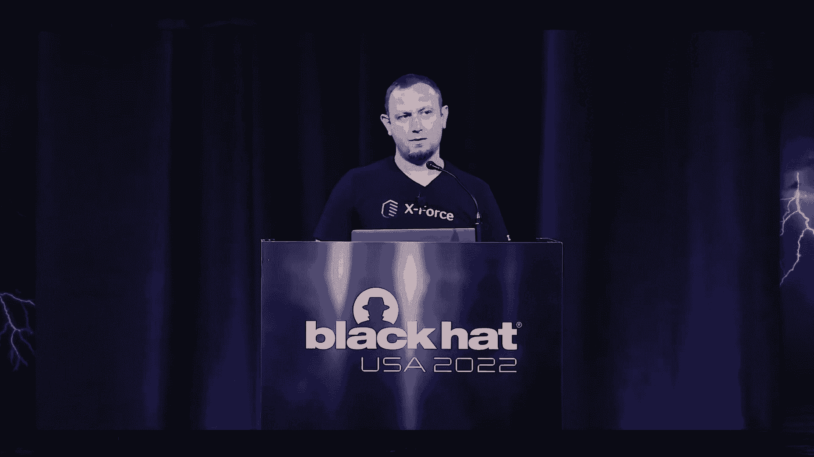

嗯，发生在红队操作员身上的一件可能是好的事情，当红队操作员失败时，然后呢，想法开始流动，我们开始修复我们以前不知道的事情，我们以前没有遇到过的情况，或者我们以前不在的环境。

所以从这个角度来看我们可以学到很多失败的人的东西，作为我们谈话的一部分，我们要看看进化论，Linux中静态有效负载的生存能力，我们现在要看看是怎么做到的，以及我们如何做得更好。

以及最终我们如何修复我们的失败，我们将开始努力找到共同点，也就是精灵区，并将其用作有效载荷的一个单位，所以静态传递，动态交付，所有这些我们都要讨论，然后呃，我们将进入精灵区对接。

帮助我们解决问题并正确和持久地完成接触的实际概念，但并非最不重要的，我们会有一个演示的东西，我们几乎通过，我们解决问题的时候，我们将给出一些指导，这种L点的概念可以被检测到，和，嗯，你知道的。

由公司减轻，所以他们说，在他们的报告中，90%的云工作负载是在Linux上运行的，我同意这一点，我们总是在云端看到Linux，但有趣的是，在21年，我可以想象，Linux恶意软件每年增长3。5%。

Linux只是很有趣，它跑，它运行工作负载，所以它一定有一些有趣的数据或访问，但这份报告报道的有趣的事情是从勒索软件的转变，我们以前见过的，它只是设置了它，算了吧，速战速决，获取投资回报率。

和舞台变成像矿工一样的秘密东西，Linux上温暖功能的复兴，信不信由你，以及对长期运营的偏好，而不是进来做事情然后出去，显然更喜欢少文件执行，因为在过去的几年里，探测能力一直在增长。

但是在内存执行中文件少执行的文件有一个警告，我们也要看看，所以当我们从进攻行动的角度来看，我们大约有几个选择来交付有效载荷，首先是动态的一面，根据经验，现在可能会达到70%。

在那里你基本上部署了Stager，然后你从外面取有效载荷，也许你做一些侦察，你在态势感知或什么的，然后加载并执行有效负载动态侧，好的静态部分基本上是捆绑了一次性部署所需的一切，你可能会觉得好吧，嗯。

有取舍，对呀，这是一个，这是一个刻度盘，有时候你需要一个，有时你需要另一个，但有趣的是，动态的部分，它的70%是有原因的，因为它的灵活性，爆炸依赖关系可以解释，你知道你在哪里部署。

你可以评估环境和诸如此类的事情，但也会失去很多东西，你可能会浪费很多时间，发布能力，休眠，也许是个问题，如果你产生了大量的流量，也许你在试图弄清楚你在系统中的位置，而且静态的一面也有问题。

因为你有耦合变体，对呀，这将是它，所以有设计所需的动态特性。

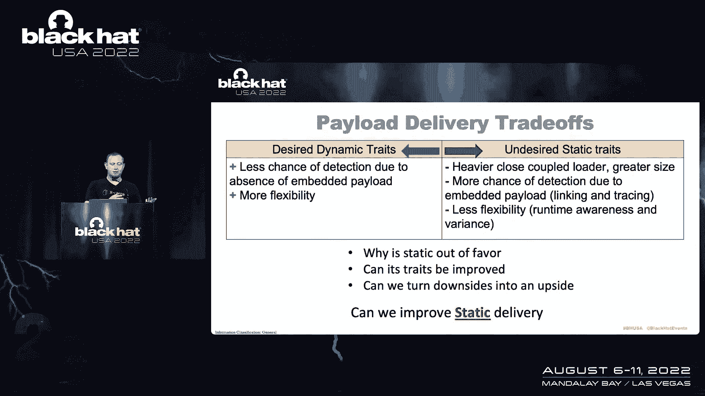

动态的，嗯，可以说被发现的机会更少，因为你是分阶段工作的，也许是对的，有更多的灵活性，但在静态方面也有不希望的状态，就是你重得多，因为您需要将整个有效负载与加载程序捆绑在一起，如果你做得不好。

你可能有更多的机会被发现，因为我们现在要看看事情是怎么做的，你会看到它可能不理想，你试图做更少的灵活性，我们已经谈过了，但我还有这个，这个，我脑子里的这个东西，静态是30%，动态是70%，是呀。

市场可能是对的，他们正在转向动态，但在美学上可能还剩下一些东西，所以我们需要看看，嗯，在什么，静态计数器中还有什么可用的，动态侧可以安装什么防御，所以我们在这里试图改善静态传递，与动态交付相反。

这是以前更容易理解的，我们看看解决方案，或者一些我们需要进行历史之旅的想法，我们现在如何嵌入有效负载。

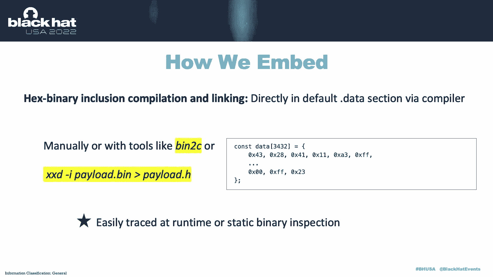

这是嗯，它已经在那里有一段时间了，在Linux上只有几种方法可以做到这一点，其中一个方法是你的标准，把二进制文件变成黑客，将新的有效负载或shell代码转换为黑客，然后把它粘在一个变量右边。

它将进入数据部分，放入数据部分，它会是，它会在那里等你取回，你可以用几个非常基本的工具来做，你可以确定我们是准时的，或者静态地有人会抓住你，然后你可以使用编译和链接并说好，嗯，如果我想数据，在一节中。

我为什么不具体说明哪个部分。

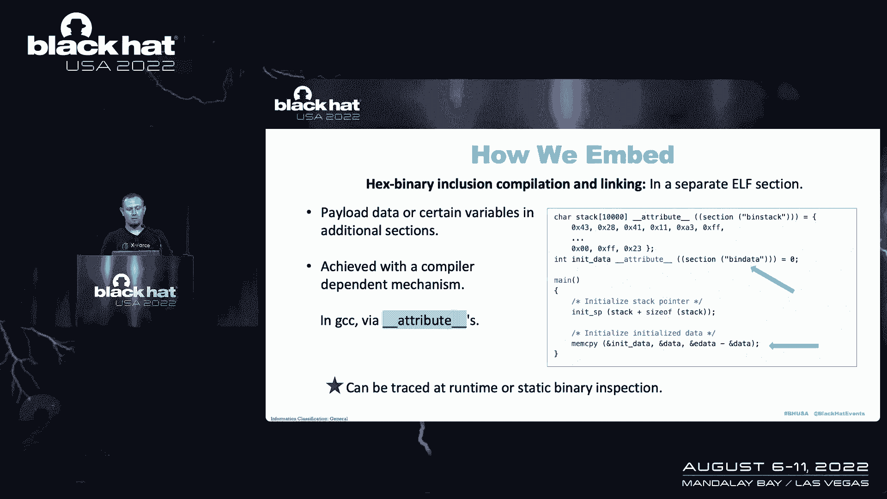

我要把数据放进去，你实际上可以通过编译器来完成，um设置，你可以，你可以，呃，告诉编译器要将数据放置在哪里，您可以在带有属性的GCC中进行，您本质上指定了一个节，说嗨，我的有效载荷将在那个部分。

然后二进制将是一个单独的部分，在那里它被装载，也有可能被追踪到，因为调用或查找有效负载的方式是，当内存是，该节被加载到内存中，你可以调查一下，说嘿，我找到了我的有效载荷，把它给我，我要启动和运行。

如果您不喜欢使用GCC，您可以直接进入组装，你实际上可以在bin指令或编译器允许你做的任何事情中做，然后呃，这将是一个类似的链接，您将从内存中的加载程序中找到一个外部变量，它仍然会被装载。

你从那里开始类似于GCC，但没有悬垂，你可以，嗯，几乎复制组装在侧面所做的，如果你想用C语言做，可以进行内联组装，嗯，有一些工具可以做得更好，更符合人体工程学，如果你愿意，但问题是。

它不会改变你与有效载荷实际交互的方式，因为你总是需要做的一件事，就是，你需要教育精灵，你需要构造精灵二进制，你做这件事的方式，你会说，好的，这是一个通过项目的数据部分，prog位，指令，对，这很重要。

所以说，然而，你走哪条路你走哪条路来创造你的，或者将有效负载嵌入到二进制文件中，仍然有可能内省并找到它，所以在我们继续前进之前，我认为更深入地研究，这些部分是，我说过碎片，我已经谈到了内存加载。

但实际上，阿尔法ALF标准规定您的二进制文件由部分组成，在每个部分都有旗帜，并基于这些标志或属性，您的系统加载程序将表现为，大多数时候，数据被标记为可加载到内存中，嗯，这是有道理的权利。

因为你如何在记忆中找到东西，你需要能够遍历内存并访问它，有些东西需要在那里，所以需要从磁盘加载到内存中，所以说，不是所有的部分，并非所有章节，不是ELF标准中的所有类型的截面，默认情况下这样做。

带着…的属性，呃，默认情况下假设加载到内存中，所以我们可以利用这一点，嗯，真正的问题，当您试图将有效负载嵌入到静态二进制文件中时，你的编译器背叛了你，你的链接器背叛了你，因为他们想成为一个好帮手。

好的好仆人，他们真的想尝试，和，嗯，链接一切，所以当你把东西加载到内存中时，当您执行加载程序时，然后你就能找到你放进去的东西，所以嗯，打破这种联系是有挑战的，对呀，你能做什么，你能做的不多。

你必须有一个非常有效的精灵一起工作，所以携带进程位的数据携带部分，标志被PT加载，基本上是一个，这是嘿的一个术语，接受会话负载，加载到内存中，所以静态链接，那么我们如何以更好的方式嵌入，如果你开始思考。

然后你有几个选择，您可以避免OS加载器，基本上是一些会处决你的小精灵的东西，你怎么，你是怎么做到的，嗯，为什么不这样，这样你就可以教育装载机不要看部分，不要加载它，但它非常非常乱，请记住。

您是在对抗系统上执行此操作的，那里可能没有编译器，那里可能没有工具，每一个动作都会杀死你，所以我们开始研究这个奇怪的财产，默认情况下，并不是所有的ELF部分都可以加载到内存中，然后呃。

如果我们避免在区段上设置Flex会发生什么，对呀，有数据，但它不能加载，或者和或查看加载程序固有的已知内容，在Linux上不会加载到内存中，还有一个像ELF部分的高清节点类型这样的东西，它非常普遍。

其实，每个可执行文件，或者几乎每个Linux上默认的可执行文件都有，右边是区段，那么编译器使用的只是把像API版本，或者开发人员可以在其中传达一些许可信息，只是数据，它是你精灵中的记录结构化数据。

它的结构很简单，这是一个记录，其中数据记录的前置大小，也许还有一点头元数据，你会有多少记录，如果你确实阅读了默认情况下每个系统可执行文件的单独部分，你就会看到，那很好，让我们更进一步。

所以到目前为止我们认为这个想法是在精灵中创建一个休眠部分，默认情况下不会被加载器加载到内存中，但如果我们在同一个可执行文件中完成，我们有挑战，因为截面是一个截面，截面的结构。

它必须以某种方式绑在装载机上，它需要找到它的，嗯，它是，它与变量的关系，那个部分连接到，从图形上看，呃，这有点像，好的，嗯，你可以拿一段，你可以创建它，然后说它不能加载，对呀。

我们的工作是将该有效负载与编译器和链接器完全解耦，和连接器，所以编译器链接器不应该知道它们，所以如果编译器和链接器是我们的敌人，在这种情况下，我们想要什么，我们想在装载机之外创建一个精灵部分。

也许创建一个加载程序，它将以某种方式知道二进制文件，知道那个部分，但要以这样的方式去做，不是内在编译或与之链接的，到目前为止，这个想法是打破从加载器到有效载荷的偏移关系。

通过有效载荷装载器存在的区段之间的完全分离，和属于加载程序本身的节，所以你可以想到，作为有效载荷将是实体的一个完全陌生的部分，那个精灵是给装载机的，这基本上是对接部分，右键将节停靠在可执行文件上。

那是装载机，所以如果编译器是问题所在，我们正试图解耦有效载荷，我们在避免操作系统加载器，我们如何做好这件事，如果在我们能够将一个节编译成二进制文件之前，这是维护API兼容性的加载程序。

ELF内部部分的二进制兼容性，与代码的API兼容性相反，本质上，它看起来像一个，这是一个框架，你可以在安全的方面把它分成你所做的事情，你红色的一面和蓝色的一面，也就是，你知道在你那边的环境中，对呀。

在那里部署恶意软件，你会有三个组件，你会有一个完全不知道正在加载什么的加载器，你就会有，您将有一个部分形式的有效负载，对所以嗯，就像被任何记忆参考完全分割的乐高，但它们会生活在同一个二进制中，和装载机。

它只需要知道如何加载，不是它装载的东西，精灵区是什么，码头和我们试图弄清楚的特征，完全二元分离的想法，嗯，加载程序完全没有给定的有效载荷，你可以把它给受害者，它会留在那里，它不需要携带任何有效载荷。

并有通用的机制来找到它自己不知道的部分，但我们可以指示它正确地这样做，在它自己的二进制文件中查找偏移量，把它装起来，然后从那里出发，所以我们创造了这种分离，有效载荷本身也是单独创建的，它没有直接缠住。

或者与装载机耦合，装载机将不再进入，将数据放入变量右侧，没有更多的亲密耦合，你离开，你也获得了休眠，所以说，比如说，装载机可以在那里坐上几个月，什么都不做就对了。

然后它可以神奇地在自己的二进制文件中找到自己的有效载荷，所以非常的休眠控制，支持的挑战之一是，呃，这是一个可检测的，第二，他们相当好，嗯有点，你知道的，追踪，他们的行为是，封隔器的熵非常非常非常明显。

对呀，然后最后，但重要的是，呃，Python可执行文件，比如说，非常非常难，因为当你冻僵的时候，它不是一个普通的精灵，比方说Python可执行文件，所以在我们的情况下，我们也需要克服这一点。

但这也为您创建胖二进制文件创造了可能性，您可以有多个部分和联系人表，您的工具位于该二进制文件中，你基本上一个接一个地打电话，或者你想要的任何东西对吧，所以从红队操作员的角度来看。

避免很多阻碍你进步的事情，也注入了连接两个乐高的东西，也可以运到受害者身边，如果你想你能做什么，您实际上可以在不同的可执行文件中创建休眠阶段，并加载可执行文件。

将这些阶段从一个可执行文件加载到另一个可执行文件，对，因为没有更多的线性跟踪，您可以使用自己的部分，或者您可以工作并找到其他可执行部分并加载它们，这就是Alfpack工厂对吧，它是它是一种。

有概念证明的概念，如果你愿意，在那里你实现了这种想法，那种分离，嗯，我在这些碎片上做了记号，呃，红色和蓝色，只是为了表明在哪里，在恶意软件部署、位置或配置的演变中，是啊，是啊，你的碎片就会掉下来。

比如说，ELF注射器通常可以是嗯，一次拍摄，你把它存放在一个安全的地方，你知道我们试图在静态方面做什么，或者你知道如果你的环境允许你，如果你没有被发现，你可以在受害者一侧放置一个注射器来创建这些管道。

使用不同的可执行文件，实现不同的休眠变量，甚至可以横穿，嗯，你知道吗，各种粘合剂，如果你愿意，但是嗯，因此可以实现有效载荷的分离、再附着和场，我们讨论过的另一件奇怪的事情。

我们我们说我们发现恶意软件更好，但它更可取的原因是，因为检测在内存中的检测比在磁盘上的检测少，然而，这种说法并不总是正确的，你必须在特定的环境中看到是什么杀死了你，是什么让你活得更久一点，对等等。

比如说，如果你如果你呃，如果你融入噪音，噪音是磁盘，所以就这样吧，你在磁盘上适应和克服，如果你很在，在一个非常安静的环境中，由防御工具，那么你可以尝试不同的事情和文件较少的恶意软件可能会为你工作。

而是为了展示我们如何以无文件的方式加载节，我们精灵后面有一些东西可以让你这样做，我们也会经历的，但最重要的是与部分和呃，加载到内存中是你不需要做和保护和保护。

当您在二进制文件中的某个地方有一段shell代码时，你把它装起来说，好的，我们会做那个，使该段可执行，当你这么做的时候，嗯，没人知道会发生什么对吧，所以保护会杀了你，嗯和嗯，部分中的有效负载是。

您可以有两个加载器，没有什么能阻止您删除两个完全不同的二进制文件，两个可以装载的装载机，呃，彼此的有效载荷从彼此的部分对，所以活着，给你更多的灵活性，让你可以用静态的东西做什么，所以文件是执行的。

我们已经实现了两个选项，到目前为止已知的，至少对我来说，选项A是用户执行，基本上，它是，我们在这个演示中使用了一个金属有效载荷，它实际上只是元流体的一代植入物，我们使用一个精确到。

基本上覆盖加载到加载程序本身内存中的部分，把它擦干净，因此没有确切的，呃，系统调用权，我们稍后会看到我们是如何检测到的，我们可以在那里越过探测，所以用户精确，呃，知道中心知道出口，这是很有用的。

但缺点是你再也不会使用那个装载机了，因为内存是叠加的，你真的不能永远用那个装载机做任何事情了，在记忆中对吧，和有效载荷中运输部分的其他美丽之处，呃，真正的白化病，你不需要做任何，呃。

你知道你会用shell代码做的事情，如果你能把你的恶意软件变成精灵并停靠它，把它插到装载机上，这就是你要做的，第二个选择，b是mmod创建，也就是，你知道，很多防守队员都知道，嗯。

它在产品文件系统中创建匿名文件，它执行，呃，思科，呃，三三四三十九，我相信做对了，但它是，它也是可以检测到的，它里面有确切的E，但好处是你可以永远不止一次地这样做，就检测而言，嗯，如果你拿大约。

所以我们说的是静态的东西，所以我们也要努力进行静态检测，如果你走垃圾箱，如果你拿金属，也就是MSF有效载荷，我们在这里工作的，只是为了演示，你运行一个垃圾箱，在上面走，它会像圣诞树一样亮起来。

对会非常非常，即使你已经融合了，那么它仍然会找出不同的启发式来锁定，金属制品对吧，但如果你在运行一个垃圾箱，在分段装载机上行走，该装载机有一个分段，嗯，然后你看到的东西很少，这些东西就更少了。

因为你在幻灯片上看到的，只有我在兴奋，调试我的可执行文件，以便能够显示我在哪里，你知道区别，通常你什么也看不见，垃圾箱散步很好，因为如果你是防守者，你可以看看可执行文件的熵，看看它有多少，搭配的怎么样。

呃你所期望的，所以从那个角度来看对接部分实际上把针向右移动了一点，因为你部署的不再是你的金属，它是你的你的捆绑，但它是以这样一种方式完成的，它改变了熵，所以，但是对于那些将与这个概念合作的人来说。

谁需要检测到这一点，你知道的，用它，用熵来检测，还有动态的一面，我知道我们在做静态方面的工作，但动态检测也是我们的动漫，嗯，所以有几件事要处理，所以说，Linux世界中的BPF已经达到了。

是防守者看待事物的一个非常有用的工具，然后呃，基本上，它是一个内核仪器，可以在用户区域进行修改，基本上说嘿，这是追踪点，我想让内核看看并报告给我，如果你知道发生了什么，一些事情发生了。

或者一个叫做右的系统，所以说，例如，输入MFD打开，MFG出口或出口的成员，MD开放或中心，没错，所以BPF嗯可以为你做这件事，这就是为什么我们想使用用户，高管或MFD能够稍微正确地使用它。

这取决于你所处的环境，嗯，你应该能做到，另一件事是雅拉对嗯，雅拉，它现在的工作方式，从命令行，它不检测截面加载，但你实际上可以从，如果你掉进一个，我们以后会看到的，基本上寻找一个节点节。

或者你可以按大小来做，不管是什么情况，不管怎么样，你知道你的环境和你对它的期望，现在演示，我将通过演示来叙述，我们会看到很多活动部件的执行，通过用户exe，我们显然会看到对接。

然后我们将通过一些检测能力。

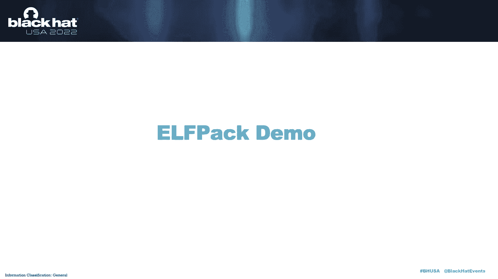

看看它们是如何显现的，所有的权利，所以我们从设置好的模拟环境开始，不同的标签，受害者选项卡，您显然在其中部署了您的口腔恶意软件，嗯，然后你我们用，甜瓜，呃，回调基本上捕捉http最差的有效载荷。

只是为了它，对呀，你可以用任何你想抓的东西来抓它，但本质上就是这样，我们现在没有你的部门会议，所以让我们试着跟踪，带着我们有效载荷的部分进入装载机，把他们撮合在一起对吧，就像乐高，呃，金属精灵。

它是有效载荷，并说好的，嗯，这是我的摇篮，我要给你一个摇篮，也就是，你知道它有用的部分，嗯，你要运送到受害者那边，我将指定该部分的名称，装载机要寻找的地方，嗯，为它为区段，它需要把有效载荷拿出来。

或者什么的，然后是装载机的其他一些功能，就是它有办法挖矿，区段中的密钥来解密有效负载本身，所以我们在这里做的一件事是，好的，嗯，继续用另一个部分，钥匙在哪里，钥匙，呃，一个方块会是，然后我给你一把钥匙。

对呀，这样我们就可以玩了，呃，模糊顶部的金属，在采矿之上，把乌龙钥匙从街区里拿出来，对呀，所以就，呃，只是我们必须做的一个例子，为了订婚能够做到这一点，一旦这样做了，我们就可以，我们实际上可以发射。

哦耶，所以我们看到有不同的选择，有MFD，或者如果你想用确切的，如果您想为执行提供背景，或者如果要更改进程表中的名称，或者不管是什么情况，你应该能做到这一点，也能持续下去，但对你来说尤其重要。

您可以将参数传递给有效负载，例如，有效负载可能有一些变量，它需要在，装载机应该能够做到这一点，呃为了它，让我们看看如何实际执行，所以我们指定了，加载程序将查看一堆调试信息，别在意，但我本质上就是这样。

用户Zag加载正在找到的ALF部分，然后我们回到我们的回调，我们在这里看到了会议，这是一个完整的会议权利，我们可以在里面做任何我们想做的事情。

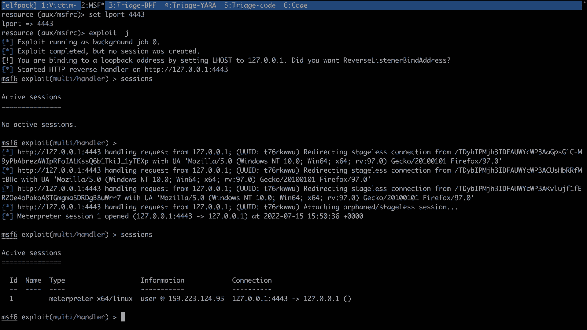

有效载荷来自停靠在加载程序上的完全未知的二进制文件。

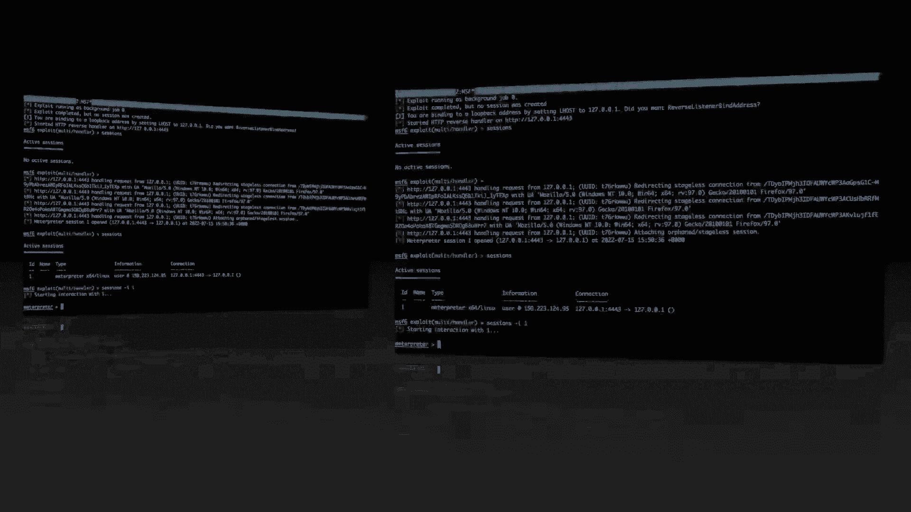

只是为了表明它不仅仅是被创造出来的，但你实际上可以通过它运行命令，但奇怪的是，如何检测以及在后端看到什么，所以把一切都清理干净，启动它，让我们看看检测，所以首先检测部分，让我们看看这里的BPF痕迹。

我们有一个配置文件，我们说，像中心这样的基本东西，轴中心um出口mm d和任何情况，基本上只是说嘿，给我一面旗子，我在系统上检测到一些东西，当这种情况发生时，所以BPF痕迹是，我认为这是一个突破。

我认为这很有用，但我们显然需要解决这个问题来部署，BPF跟踪，这是一个，这是一个超级用户功能，你必须在系统上拥有，你显然会作为一个嗯来做，作为管理员或安全人员，只是这次我们要回到检测是如何发生的。

所以我的T盒会议有点混乱，在这里，我们再做一次捆绑，能够看到这是如何明显地发生的，因为我们正在执行shell命令，然后我们发射装载机或摇篮，这是一个带有坞段的装载机，之后我们唯一能看到的就是这个入口。

就像系统调用，它应该执行一些东西，一些有效载荷，我们不知道是什么，它没有任何网络流量，它所做的一切，它有全名，不幸的是，这是金属本身的礼貌，你能做的不多，除非你能把金属本身清理干净，把它处理掉。

但我相信它已经完成了，这样你就可以真正连接到一些东西，你又有了，你现在才有一个会议，bpf跟踪看不到http回调，或者类似于无害的主机名调用对，雅拉，相似追踪，只是现在您有了一个代码。

应该能够在静态站点上做到这一点，嗯，你说，好的，嗯，让我浏览一下整个系统上所有的可执行文件，正如她所指出的那样倾倒，比如说，或者扔掉其他部分，看看我能从那里得到什么，因为现在作为一个防守者。

你应该可以担心你的部分的大小，里面是什么类型的东西，是不是高清节点，为什么高清节点不那么可执行，为什么，为什么不止一个，对呀，所以你真的需要经历并看到这一点，显然目前没有很多环境被用来对抗这种情况。

这样我们就可以再活一天，好吧，如果你愿意，但正如你所看到的，斯诺德是，呃是真的很大，有效载荷在哪里，它是，嗯，不是很好，雅拉，你知道吗，有API接口，防御者可以通过并检测到它。

这基本上是LPAC阿尔夫回来的，呃做。

所以外卖，外卖是精灵，分段对接生活在灰色地带，在完全静态编译您的有效载荷到您的加载器之间，并允许您作为操作员，恶意软件编写器能够延长你的寿命，取决于你所处的环境，因为它给了你更多的灵活性。

如果你在动态方面有更多的灵活性，您现在在静态方面获得了更多的灵活性，你可能会达到休眠，如果你想用一些变量，你可以在空气间隙的环境中工作，因为您可以将多个有效负载分段在不同的部分中。

你可以打任何你想打的电话，精灵文档可以实现API而不是API兼容性，因为精灵是共同点，我们正在研究的，所以不会发生API更改，除非精灵改变，你知道它已经在第一版上30多年了，嗯和嗯，你知道的。

精灵对接克服，内存中的UM封隔器，所以你可以把你的影响力，你可以把你的冷冻，um口译员，如果你愿意，就像鲁比或其他什么情况，你不必解压，您不必有任何类型的标题，你不必有TPFS就能做到这一点。

从防守的角度来看，我们已经展示了防守的能力，他们如何在美学方面做到这两者，动态侧，你知道，有点说这是一种新的方式，将恶意软件带入环境并创建工具来对抗恶意软件，但进攻显然可以进一步发挥作用，做加密。

就像我们在这里做的那样，我们可以用工厂的概念来借用摇篮，借用不同可执行文件的不同段。

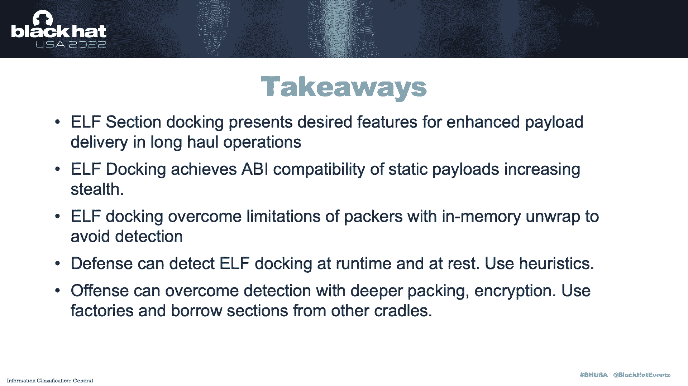

继续生活在受害者的土地上，我们还剩三分钟，我可以回答一些问题，这是概念证明的代码，嗯，你们这些家伙，就可以，你知道，它是，是麻省理工学院，你可以把它，和它一起玩，如果有问题，我会回答。

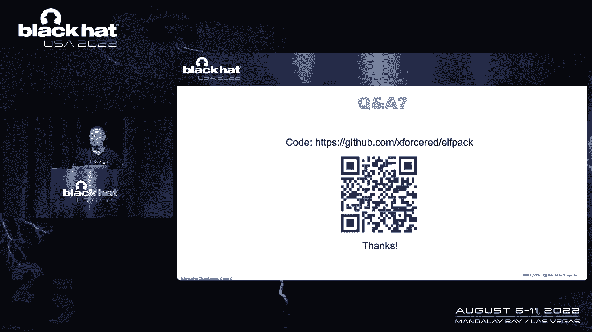

酷，非常感谢，我在外面等你，或，你知道，如果有人离线有问题。

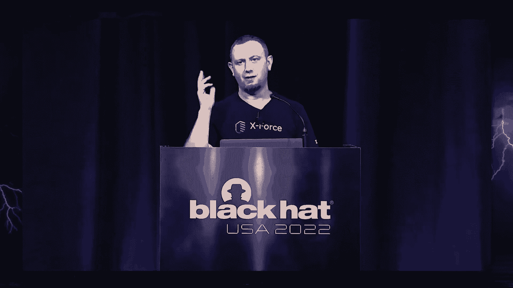

我就能回答了。

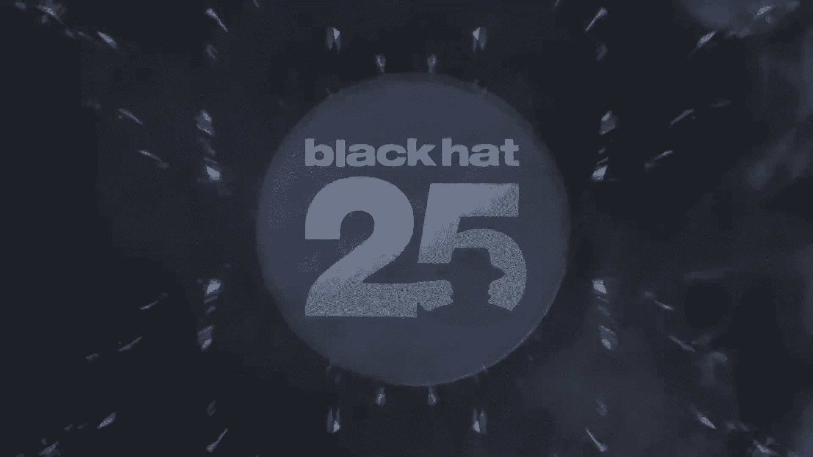