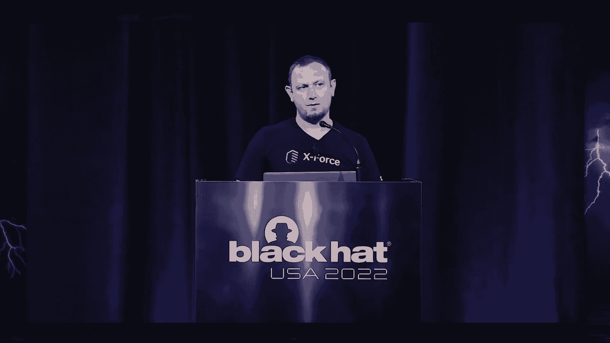
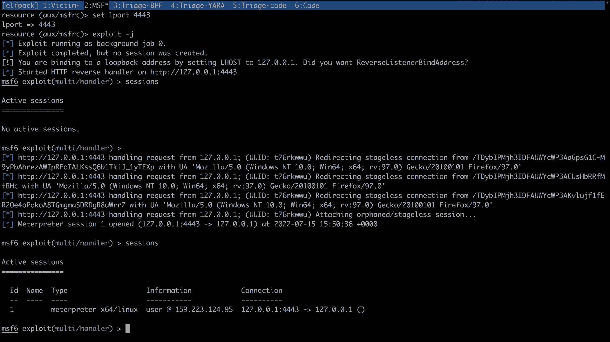
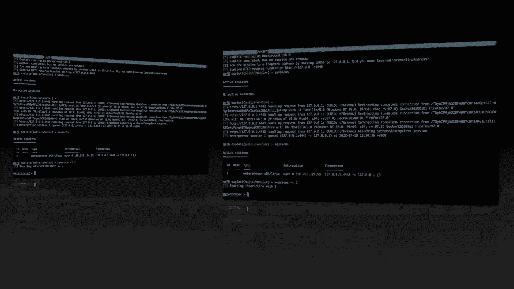
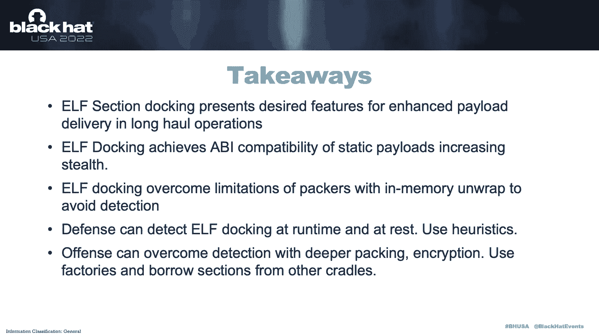
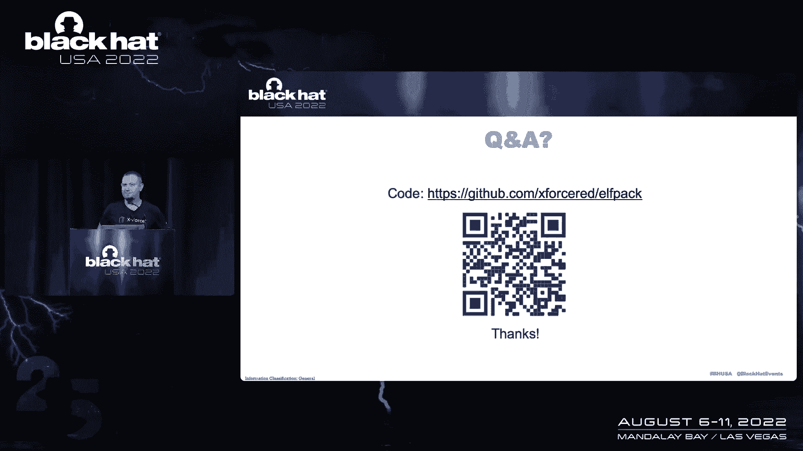

# P69：079 - ELF 节对接：重新审视无阶段载荷交付 🔗





在本教程中，我们将探讨一种在 Linux 环境下交付恶意软件载荷的新思路：**ELF 节对接**。我们将从攻击者（红队）的视角出发，分析传统静态和动态载荷交付方式的优缺点，并详细介绍如何通过将载荷“停靠”在 ELF 可执行文件的特定节中，来实现更隐蔽、更灵活的持久化攻击。课程涵盖核心概念、实现原理、演示操作以及相关的检测与缓解思路。

---

## 从失败中学习：载荷交付的演变 🧠


在红队行动中，失败往往能带来新的思路。当我们遇到未知环境或部署受阻时，会开始思考如何修复和改进我们的工具与方法。

本节我们将审视 Linux 中静态载荷的生存现状，探讨其实现方式、如何改进，并最终引入 **ELF 节对接** 的概念来解决传统方法的问题。


---


## 静态 vs. 动态载荷交付 ⚖️

从攻击行动的角度看，我们主要有两种载荷交付选择：

**动态交付** 目前可能占 70%。这种方式先部署一个轻量级的 **引导程序**，然后从外部获取完整的载荷。它的优势在于灵活性高，能适应不同环境，但也可能因网络流量、延迟等问题而暴露。

**静态交付** 则是一次性捆绑部署所需的所有组件。它的优点是部署简单，但缺点也很明显：文件体积大，与引导程序耦合紧密，缺乏灵活性。

市场趋势似乎偏向动态交付，但静态交付在特定场景下仍有其价值。我们的目标是改善静态交付方式，使其能媲美动态交付的某些优势。

---

## 传统载荷嵌入方式的历史回顾 🕰️

在 Linux 上，将载荷嵌入二进制文件的方法已经存在一段时间。以下是几种常见方法：

*   **变量存储**：将载荷或 Shellcode 转换为字节数组，存放在全局变量中。编译器会将其放入 `.data` 或 `.rodata` 节。
    ```c
    unsigned char payload[] = {0x90, 0x90, 0xcc, 0xc3}; // 示例载荷
    ```
*   **编译器指令**：使用编译器属性（如 GCC 的 `__attribute__((section("section_name")))`）明确指定将数据放入某个自定义节。
    ```c
    __attribute__((section(".my_payload"))) unsigned char payload[] = {...};
    ```
*   **汇编级操作**：直接编写汇编代码，定义节并填充数据，实现最底层的控制。

然而，无论采用哪种方法，都存在一个根本问题：**编译器、链接器和操作系统加载器会“帮助”我们将这些节加载到内存中**，并建立符号引用。这使得载荷在二进制文件中相对容易被定位和识别。

---

## 深入理解 ELF 节与加载器 🤔

ELF 标准规定二进制文件由不同的 **节** 组成。每个节都有标志位，系统加载器根据这些标志决定其行为（例如，是否将其加载到内存）。

默认情况下，并非所有节都会被加载。例如，类型为 `SHT_NOTE` 的节通常只包含调试或版权信息，默认不会被加载到内存。这为我们提供了一个思路：**能否将载荷放在一个默认不会被加载的节中？**

但挑战在于，如果载荷和加载器在同一个可执行文件中，链接器仍然会建立它们之间的联系。我们需要的是 **彻底的解耦**。

---

## 核心概念：ELF 节对接 🧩

如果编译器和链接器是我们的“对手”，那么理想状态是：**创建一个完全独立于加载器编译和链接过程的 ELF 节**。

**ELF 节对接** 的核心思想就在于此：
1.  **加载器**：一个普通的、不包含任何载荷数据的可执行文件。
2.  **载荷节**：一个独立的、包含加密或混淆后载荷的 ELF 节。
3.  **对接**：通过工具将载荷节“粘贴”到加载器可执行文件的末尾或其他位置，**而不修改加载器原有的节表结构**（或进行巧妙修改）。加载器在运行时，通过解析自身文件，在特定偏移量找到这个“停靠”的节，将其解密并加载到内存执行。

这种方法实现了 **二进制层面的分离**：
*   **对加载器而言**：它完全不知道自身携带了载荷，只是通用地实现了查找和加载“停靠节”的代码。
*   **对载荷而言**：它是一个独立的实体，可以在不同加载器之间复用。
*   **优势**：获得了“休眠”能力（载荷静默存在于磁盘）、避免了传统打包器的熵值特征、并支持创建“胖二进制文件”（一个加载器携带多个不同功能的载荷节）。

---


## 实现：内存执行与检测规避 🛡️

将节中的载荷加载到内存并执行，主要有两种方式：

**选项 A：用户态执行**
*   **描述**：加载器直接覆盖自身进程内存，将载荷映射到可执行内存区域并跳转执行。
*   **代码思路**：使用 `memcpy` 或类似函数将载荷字节复制到具有可执行权限的内存页。
*   **优点**：无需额外系统调用，相对隐蔽。
*   **缺点**：加载器自身内存被破坏，通常只能使用一次。





**选项 B：memfd_create**
*   **描述**：使用 `memfd_create()` 系统调用在内存中创建匿名文件，将载荷写入，然后执行。
*   **代码思路**：
    ```c
    int fd = memfd_create("", MFD_CLOEXEC);
    write(fd, payload, payload_size);
    fexecve(fd, argv, envp);
    ```
*   **优点**：加载器可重复使用，更符合“无文件”攻击特征。
*   **缺点**：会触发 `memfd_create` 和 `fexecve` 等系统调用，可能被监控工具检测。

从检测角度看，传统的基于熵值或 YARA 规则扫描静态文件的方法，对于节对接的载荷效果会减弱，因为载荷被分离和加密了。防守方需要：
1.  分析 ELF 文件结构，查找异常或自定义的节。
2.  监控可疑的系统调用序列（如 `memfd_create` + `fexecve`）。
3.  使用 eBPF 等内核态工具进行运行时行为监控。

---

## 演示概要与总结 🎬


在演示环节，我们展示了如何：
1.  使用工具生成一个独立的载荷节。
2.  将该节对接到一个干净的加载器二进制文件上。
3.  执行加载器，它成功在自身文件内找到并解密载荷节，建立远程连接。
4.  使用 eBPF 和 YARA 进行检测，证明该方法能有效规避基础的静态扫描，但可能被高级的运行时监控捕获。

**总结**
本节课我们一起学习了 **ELF 节对接** 这一高级载荷交付技术。它巧妙地利用了 ELF 文件格式的特性，在静态交付中引入了动态的灵活性，实现了载荷与加载器的二进制分离。



**关键收获**：
*   **对于攻击方**：提供了一种更隐蔽、支持休眠和多载荷的静态部署方式，扩展了在严格环境下的操作空间。
*   **对于防守方**：需要超越传统的文件扫描，加强对 ELF 文件结构异常的分析和内存执行行为的监控。




这项技术处于灰色地带，它既不是完全静态编译，也不是传统的动态下载，而是为红队操作员提供了又一种有价值的持久化工具。