# 课程 P7-007：Industroyer2 🛡️ - 沙虫组织对乌克兰电网的再次网络攻击

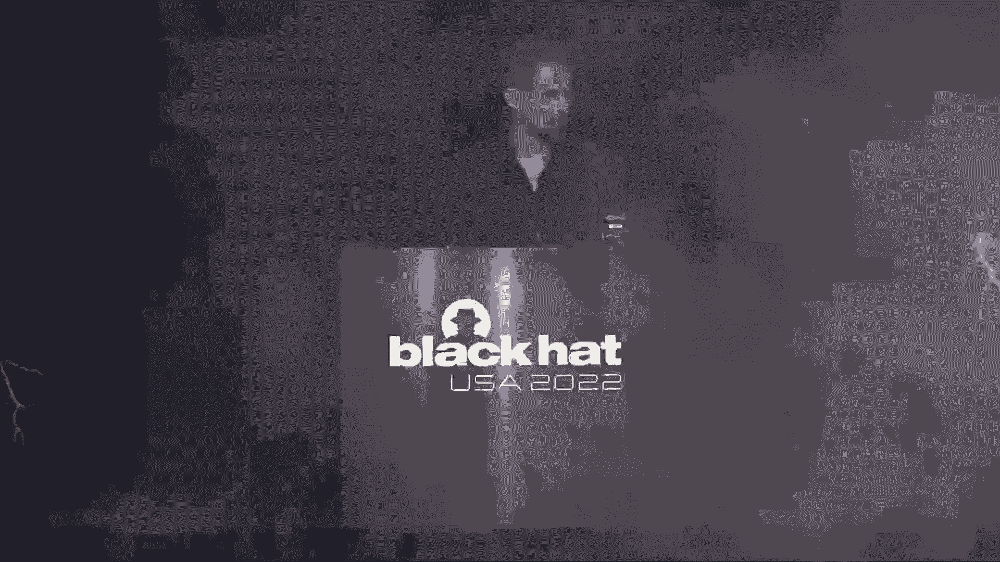

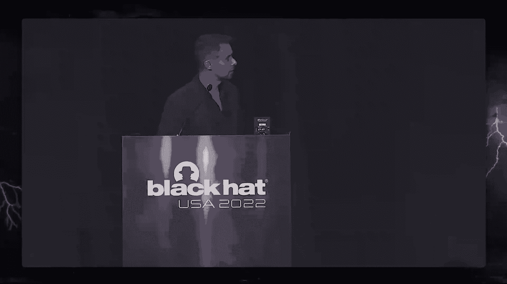

在本课程中，我们将学习关于Industroyer2恶意软件的知识。这是臭名昭著的Sandworm（沙虫）APT组织对乌克兰电网发起的又一次复杂网络攻击。我们将回顾其前身Industroyer，分析本次攻击事件，并探讨相关的防御策略。

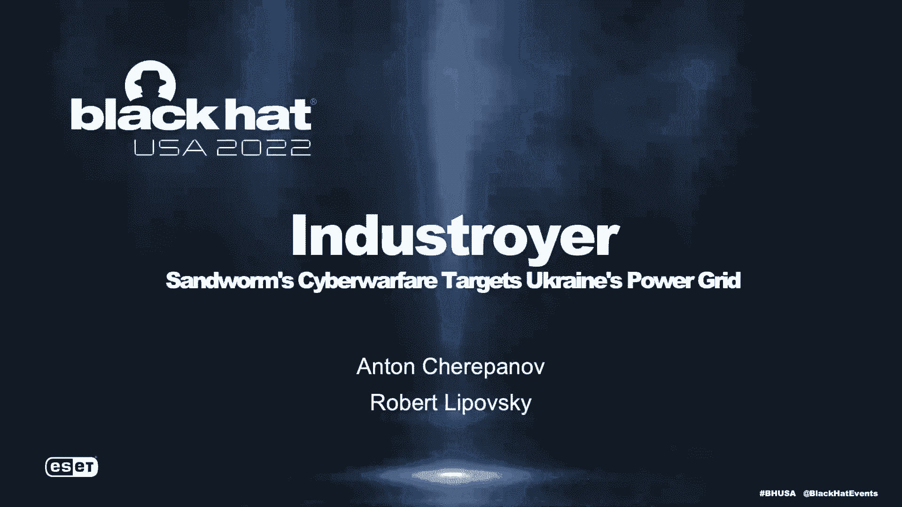

---

## 背景与攻击组织

上一节我们介绍了本课程的主题。本节中，我们来看看攻击的背景和发起者。

2014年，甚至可能在2013年底，针对乌克兰高价值目标的APT活动显著增加。这发生在俄罗斯占领克里米亚和顿巴斯战争开始之前。攻击目标包括政府、外交、媒体、运输乃至乌克兰选举机构。

以下是多年来对乌克兰进行针对性攻击的最值得注意的APT组织列表。请注意，这不是一个全面的列表，只是我们的选择。

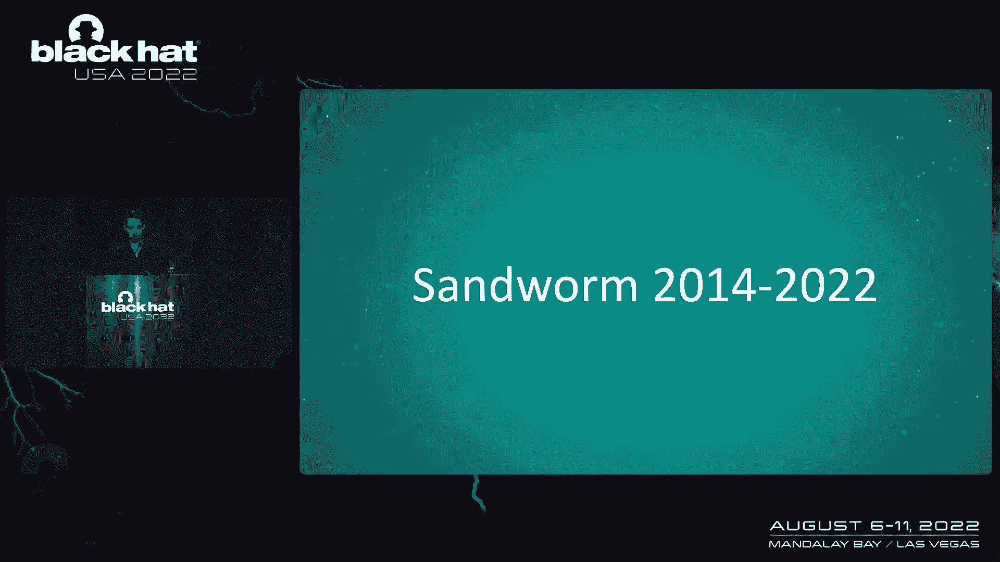

*   Sandworm（沙虫）：被归因于俄罗斯军事情报局GRU，是电网攻击的幕后黑手。
*   其他组织：列表还包括其他活跃的APT组织。

从这些组织中，我们将重点关注最具攻击性、专门攻击电网的Sandworm（沙虫）组织。该组织因使用BlackEnergy（黑色能量）恶意软件而得名，其命令与控制服务器地址中发现了与科幻小说《沙丘》相关的文本字符串。

我们追踪该组织可追溯到2011年。2013年底，我们观察到针对乌克兰的针对性APT活动显著增加。攻击者使用精心设计的鱼叉式网络钓鱼邮件作为初始入侵手段。

例如，攻击者曾利用顿巴斯战争作为诱饵，邮件附件中包含一份所谓的“分离主义支持者名单”的幻灯片。这是一种高效的社会工程攻击。在后台，BlackEnergy恶意软件会从远程服务器下载并安装，有时甚至利用PowerPoint中的零日漏洞。

---

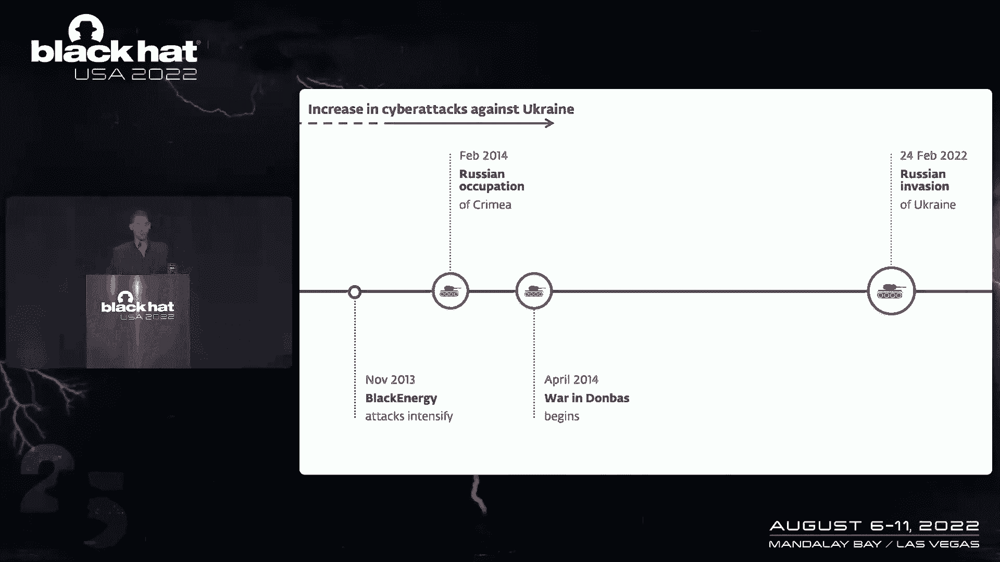

## 历史攻击回顾：从BlackEnergy到Industroyer

上一节我们了解了攻击者背景。本节中，我们回顾Sandworm组织对乌克兰电网的历史攻击。

BlackEnergy恶意软件被用于针对乌克兰许多组织的攻击。但最引人注目的，是2015年12月针对乌克兰电网的攻击，这导致了历史上首次由网络攻击引发的大规模停电。

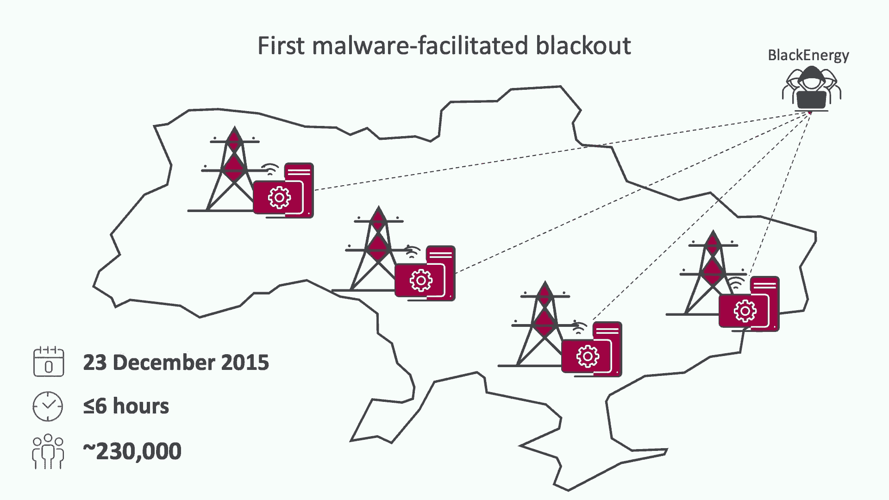

攻击者滥用远程访问软件，手动切断了电力流动。结果，全国超过20万家庭在不同地区断电数小时。一段泄露的视频显示，攻击者远程操作了变电站的工作站。

几乎整整一年后，2016年12月，又发生了一次由网络攻击造成的停电。这次攻击有了显著升级：攻击者部署了名为**Industroyer**（或“CrashOverride”）的恶意软件。

Industroyer与之前手动中断的方式不同，它是**有史以来第一个专门设计用于自动化攻击电网的恶意软件**。在接下来的几年里，Sandworm的工具集不断进化，活动也出现分化。

*   **BlackEnergy集群**：继续针对能源部门。
*   **TeleBots集群**：主要针对乌克兰金融部门，也是2017年6月NotPetya破坏性网络攻击的幕后黑手。将NotPetya与Sandworm联系起来的一个关键证据是基于代码相似性。

随后几年，Sandworm的活动仍在继续，但更为低调。

---

## 2022年战争期间的网络攻击

上一节我们回顾了历史攻击。本节中，我们看看2022年俄乌战争爆发前后，Sandworm组织发起的一系列网络攻击。

2022年2月23日，就在俄罗斯军事入侵前几个小时，我们在乌克兰检测到名为**HermeticWiper**（密封擦除器）的恶意软件。它在数百个系统上发动攻击，意图破坏计算机使其无法启动。

这只是2月以来我们在乌克兰发现的一系列擦除器恶意软件中的第一个。它们的技战术水平参差不齐。例如，**CaddyWiper**更为先进，它滥用了一个合法的磁盘分区软件来进行低级文件系统操作。

密封擦除器并非此次行动中使用的唯一恶意软件。

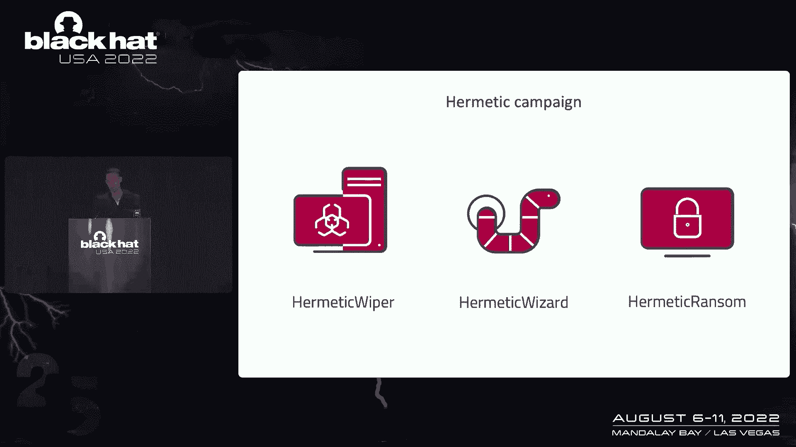

*   **HermeticWizard**（密封向导）：一种在网络内传播的蠕虫。
*   **HermeticRansom**（密封勒索）：伪装成勒索软件，但实际是破坏性恶意软件。其代码质量较差，一种可能的解释是攻击者在发现被检测后，试图匆忙部署它以掩盖真实意图。

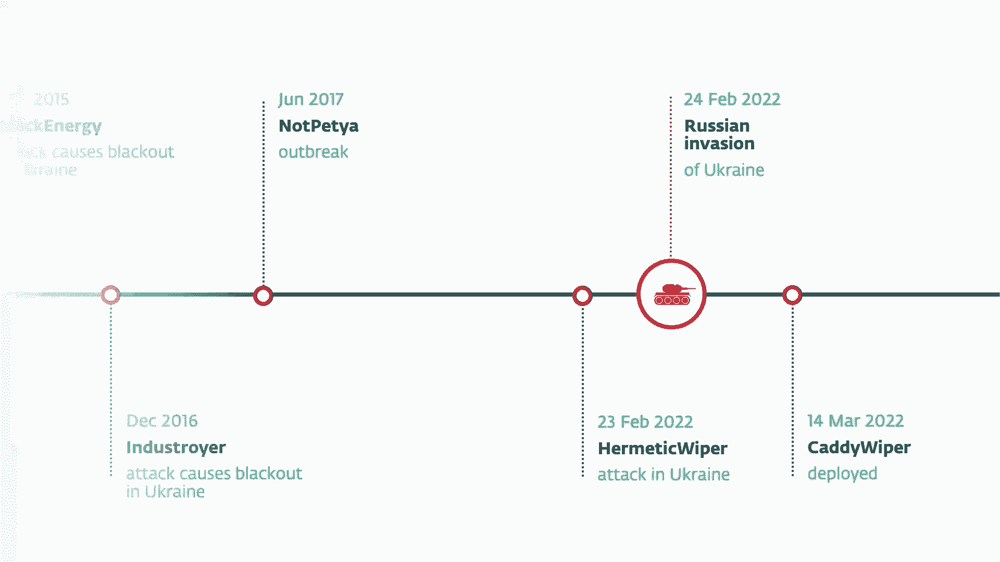

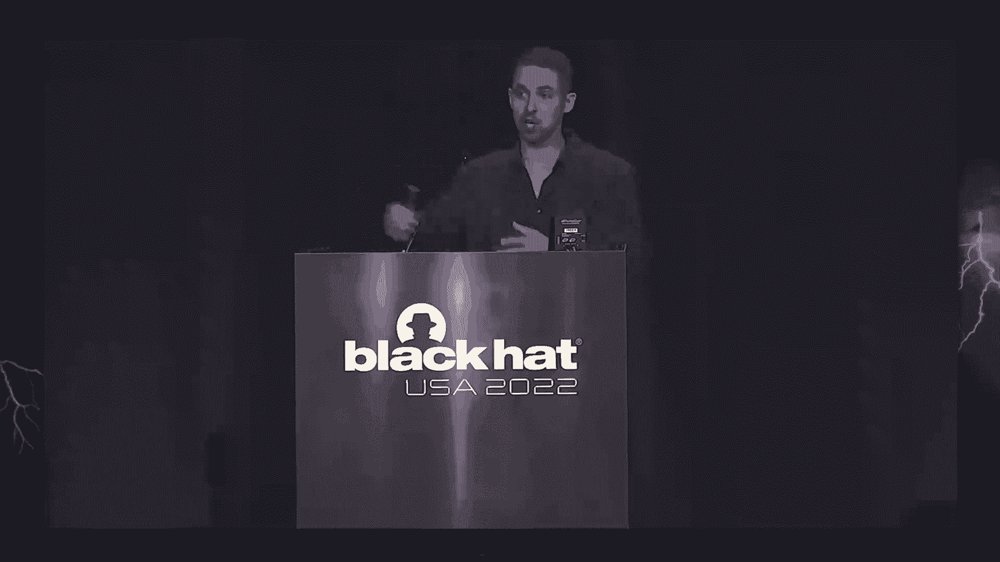

密封勒索软件显示的勒索信息中包含一些代码“彩蛋”。2022年3月14日，我们发现了另一个擦除器**CaddyWiper**，它针对金融部门，并有意避免破坏域控制器上的数据。

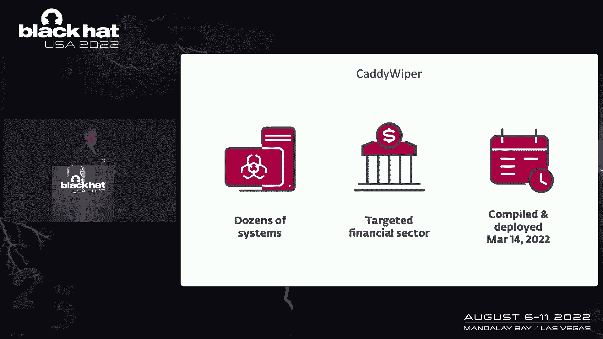

---

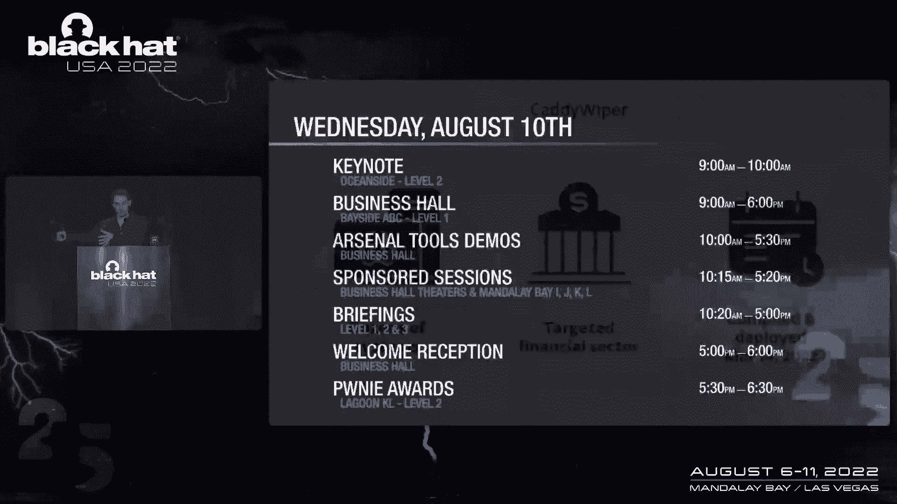

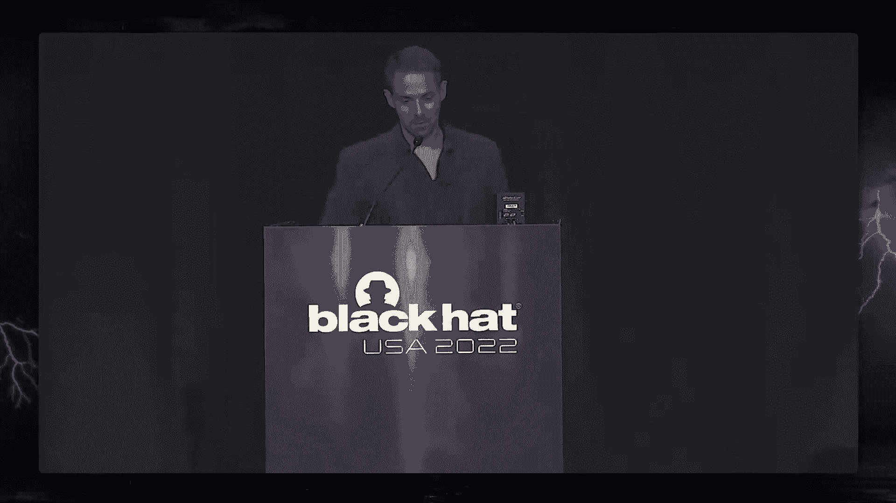

## 2022年4月：Industroyer2攻击事件分析

上一节我们介绍了战争初期的攻击。本节中，我们深入分析2022年4月发生的Industroyer2攻击事件。

2022年4月8日，我们协助乌克兰一家能源供应商应对网络事件。分析发现，这是一个新版本的Industroyer恶意软件，即**Industroyer2**。这是过去五年来我们首次看到其活跃。

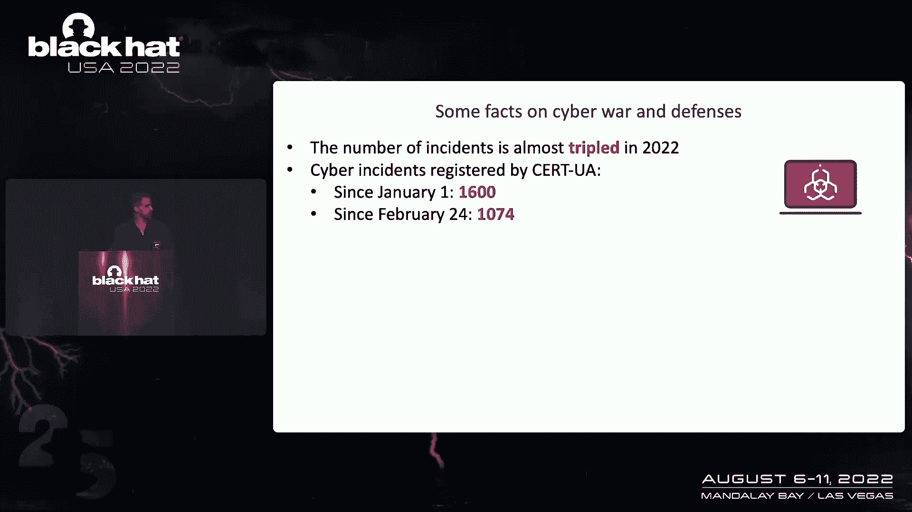

尽管第一代Industroyer攻击导致约一小时的停电，但这次攻击被挫败了，没有造成停电。这得益于目标端防御者的快速响应以及ESET等公司的协助。然而，如果攻击成功，理论上超过200万人可能受到影响。因此，这仍然是战争中最重大的未遂网络攻击之一。

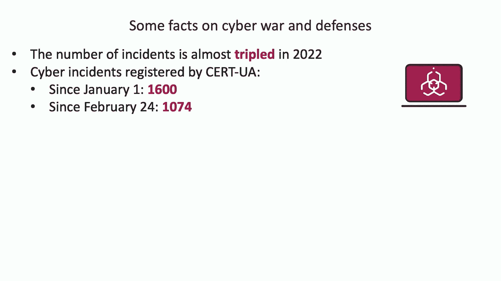

根据事件响应分析，初始入侵可能发生在2022年2月之前。这是一次精心策划、技术复杂的行动。攻击者使用了多种工具：

*   使用带有字母“Z”（入侵象征）算法的工具。
*   针对Linux系统的**OrcSsh**后门。
*   多种擦除脚本（如**SoloShredder**, **AwfulShredder**）用于清理痕迹。
*   攻击计划在周五下班时间（工作站大多关闭时）触发，意图最大化对民用基础设施的影响。

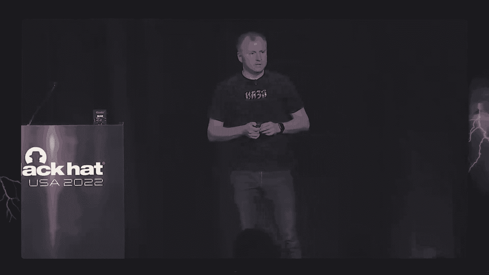

在获得网络访问权限后，事件响应团队在不到12小时内得出了初步结论，并与合作伙伴分享了入侵指标（IOCs）。

---

## Industroyer（第一代）技术回顾

上一节我们概述了Industroyer2事件。本节中，我们回顾第一代Industroyer的技术细节，以便对比。

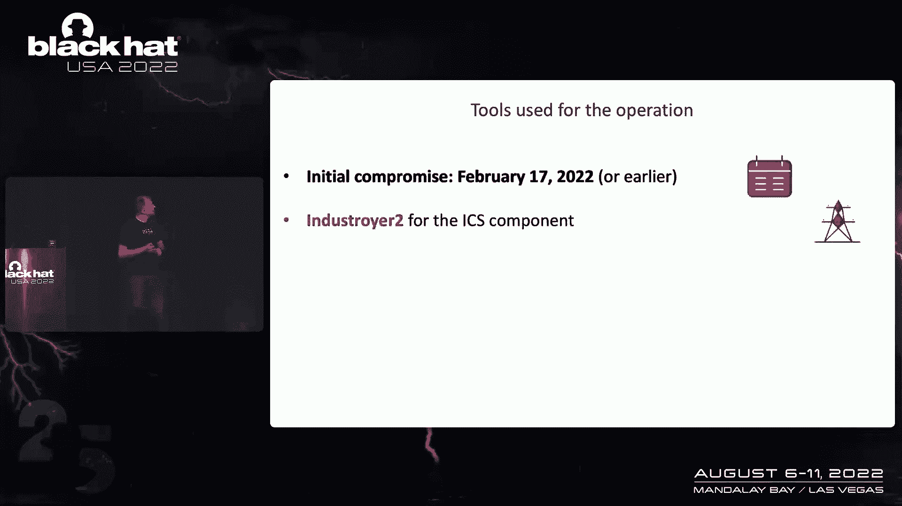

第一代Industroyer是独特的，因为它不仅是第一个专门攻击电网的恶意软件，也是有史以来第二个能对工业硬件造成物理损害的恶意软件（继Stuxnet之后，第三个是Triton）。

它的攻击目标有三个：
1.  **切断电路**：在预设时间使用有效载荷模块打开断路器。
2.  **擦除SCADA软件**：使操作员无法查看和控制环境状态。这由一个擦除组件完成，专门删除属于SCADA软件的文件，并通过损坏关键文件使控制站无法启动。
3.  **禁用保护继电器**：这些设备保护电网免受有害条件影响。如果被禁用，电网可能变得脆弱甚至受损。这是通过一个拒绝服务（DoS）模块实现的，它试图利用西门子保护继电器的漏洞，通过发送特制UDP数据包将其切换到固件更新模式并卡住。

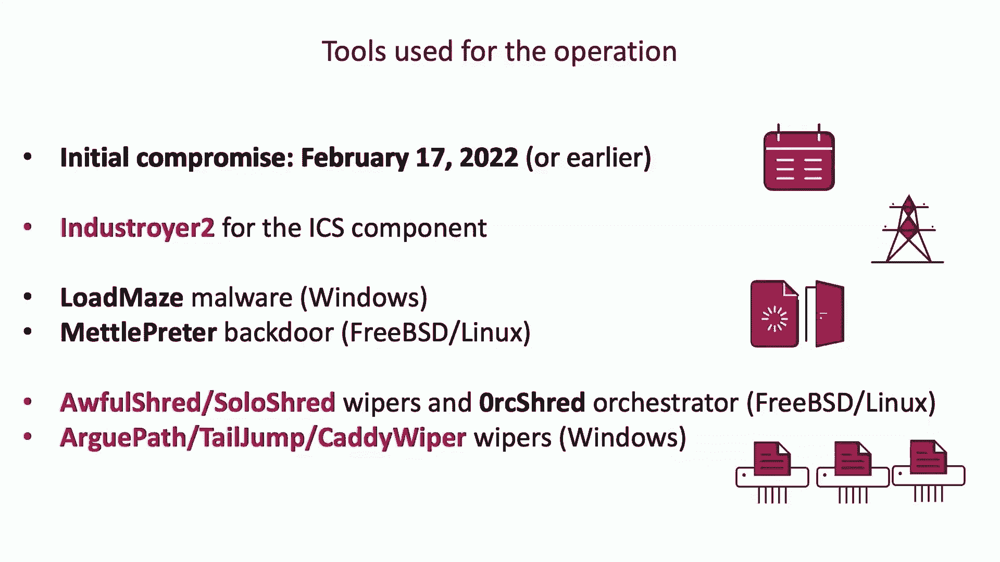

如果攻击成功，停电可能会持续更长时间。但这次攻击失败了，部分原因是乌克兰防御者基于前一年的经验增强了韧性，部分原因是攻击者犯了编码错误。

Industroyer是一个模块化框架。其架构包括一个启动器组件（负责定时攻击）和多个实现了不同工业通信协议的有效载荷模块（DLL）。我们重点关注**IEC 104**协议，因为Industroyer2也使用它。

IEC 104协议是电网中使用的远程控制协议，设计于几十年前，缺乏安全性考虑，采用客户端-服务器模型且没有身份验证。恶意软件所做的是创建并传输所谓的**ASDU消息**来改变远程站的状态，例如发送“信息对象地址（IOA）到状态关闭”的命令。

在Industroyer中，配置决定了这些IOA映射到变电站环境中的哪个物理设备。恶意软件根据其配置创建这些电报。它还会终止合法的SCADA进程以避免冲突，并支持控制台输出和日志记录。

---

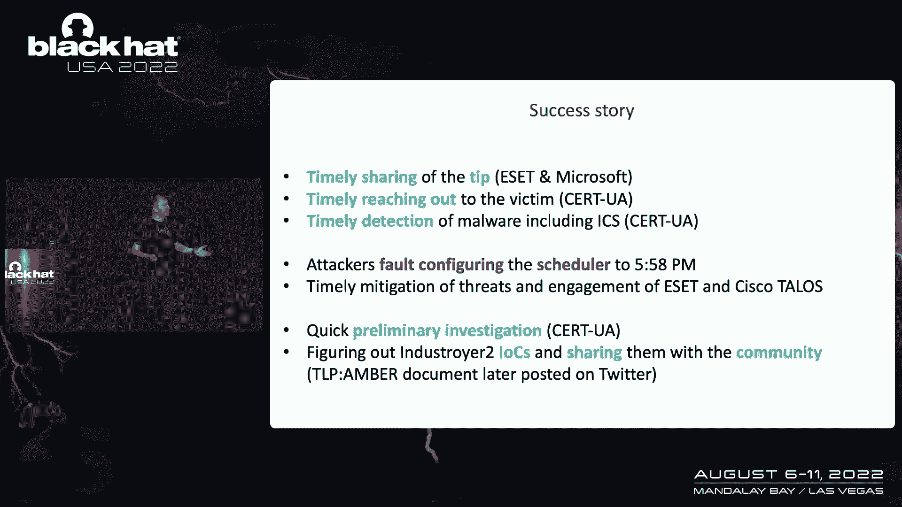

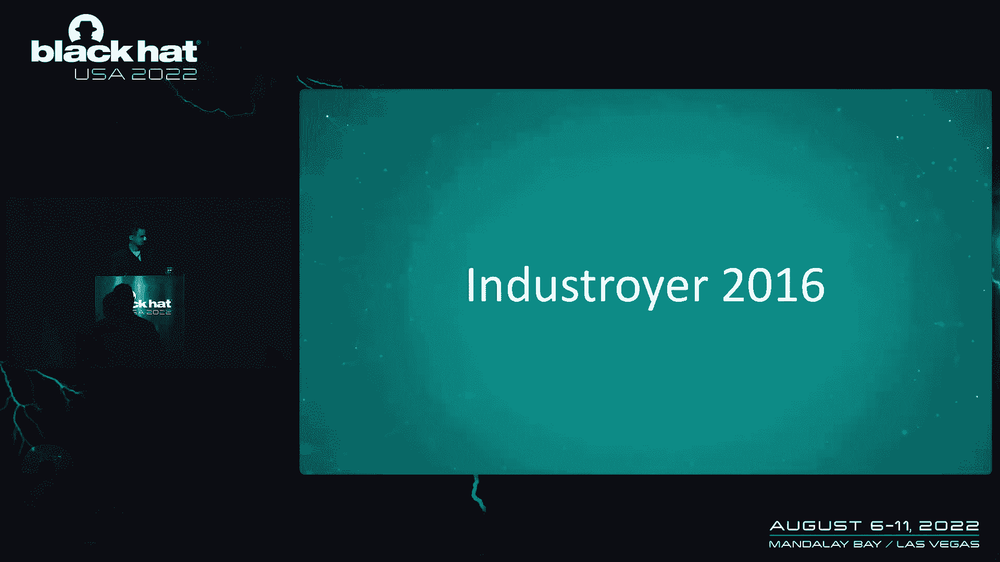

## Industroyer2技术细节分析

上一节我们回顾了第一代Industroyer。本节中，我们详细分析Industroyer2的技术细节。

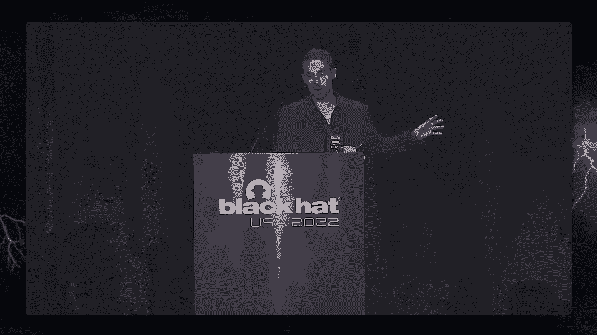

与第一代相比，Industroyer2有很多代码相似性，可以认为是从同一源代码演变而来。架构上的显著区别在于：Industroyer2的两个组件（通信和擦除）包含在一个可执行文件中，而最初的是一个模块化框架。它只实现了**IEC 104**协议。

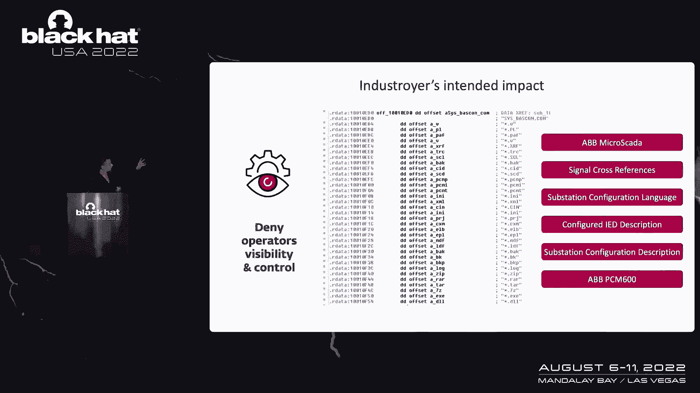

配置是嵌入在二进制文件中的硬编码字符串。这意味着对于不同配置的部署，攻击者每次都必须重新编译它。我们分析了两个不同配置的样本，它们似乎都是在2022年3月2日至3日编译的，但实际策划可能更早。

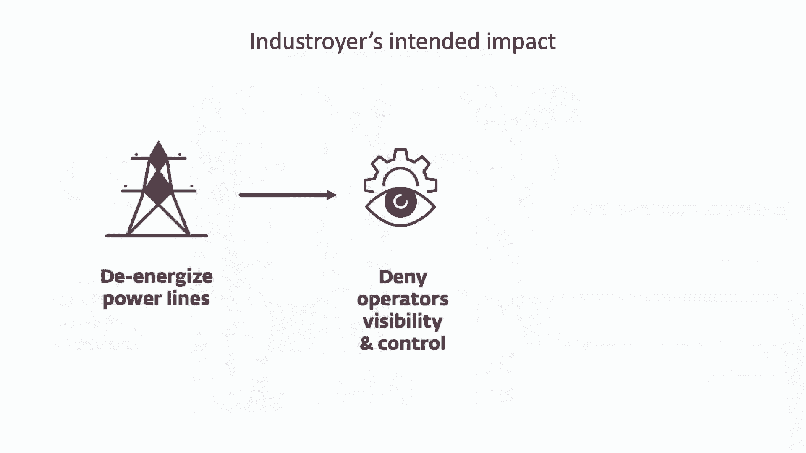

新的配置格式包含IP地址、端口号和IOA列表。恶意软件能够同时与多个设备通信。我们分析的一个样本包含三个IP地址，另一个包含八个。

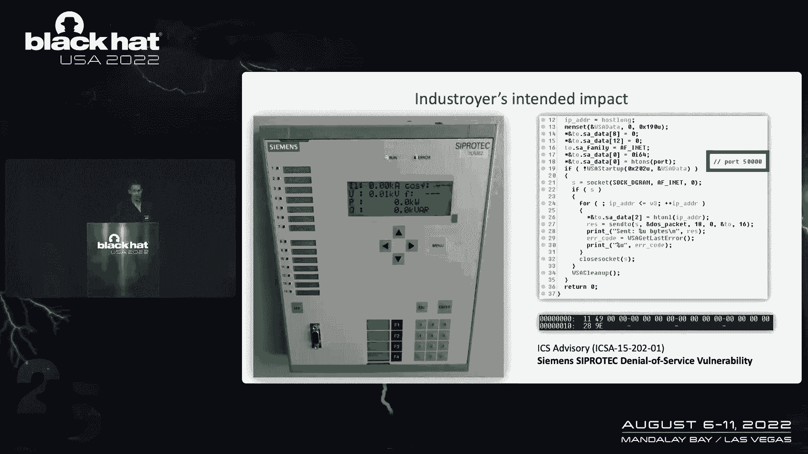

与第一代类似，它会终止合法的SCADA进程，并重命名文件以禁用软件的自动执行。在一个样本中，我们发现了110个IOA，另一个样本中有68个。

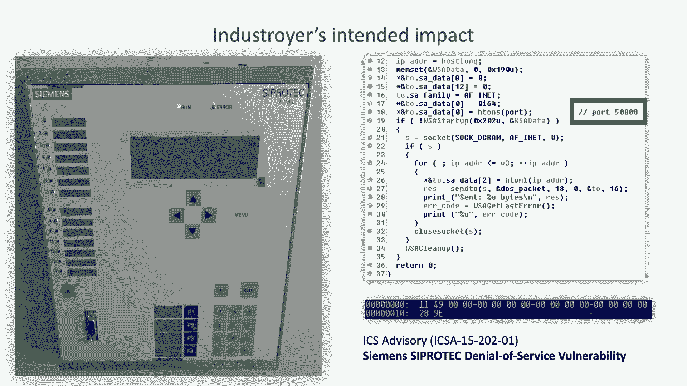

恶意软件发送的数据包是动态生成的。它发送的是“双命令”（DCO），即执行“关闭”或“打开”的命令。**重要的是，它没有利用任何漏洞，只是按照设计的方式使用协议**。

将配置转换为人类可读格式后，可以看到它发送执行命令。确定每个IOA的具体功能很困难，因为这取决于具体的工业设备和设置。然而，通过搜索一些特定的IOA，可以找到它们可能对应的功能，例如属于断路器或保护设备的控制命令。

与旧版本相比，新版本的日志输出更简洁，用代码代替了文本。

---

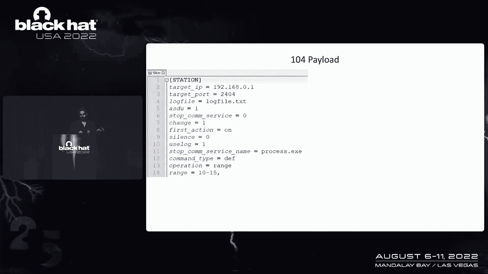

## 关联的破坏性工具

上一节我们分析了Industroyer2本身。本节中，我们看看在此次攻击中与Industroyer2一同部署的其他破坏性工具。

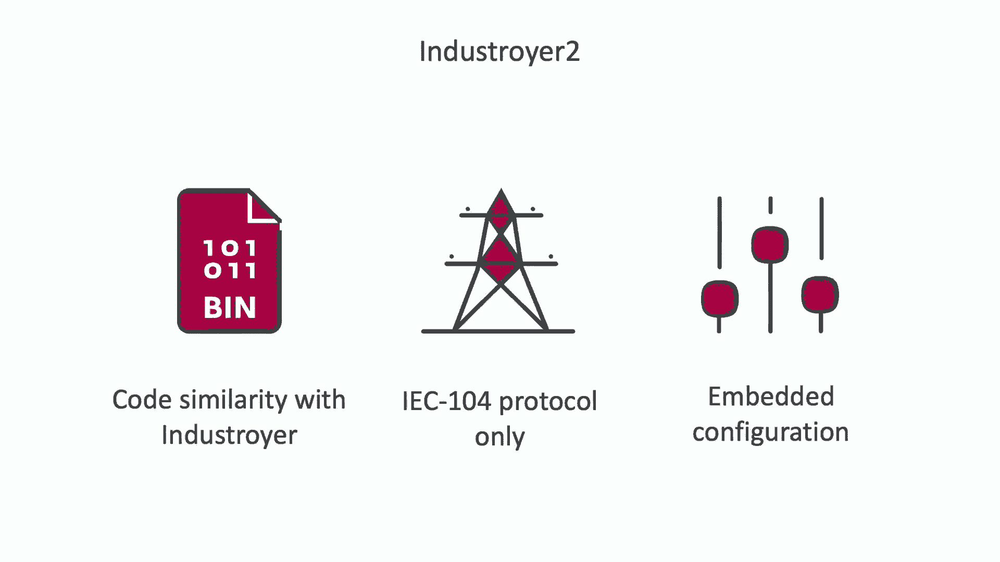

攻击者部署了**CaddyWiper**，以使恢复变得更加困难。他们同时使用了针对Windows和Linux系统的版本。

*   **Windows版CaddyWiper**：相对简单，用零覆盖C盘和其他磁盘上的文件，然后执行`shutdown /r /f /t 0`命令重启系统。
*   **Linux版CaddyWiper**：攻击者使用了额外的擦除器，并尝试通过SSH连接到其他主机进行传播。

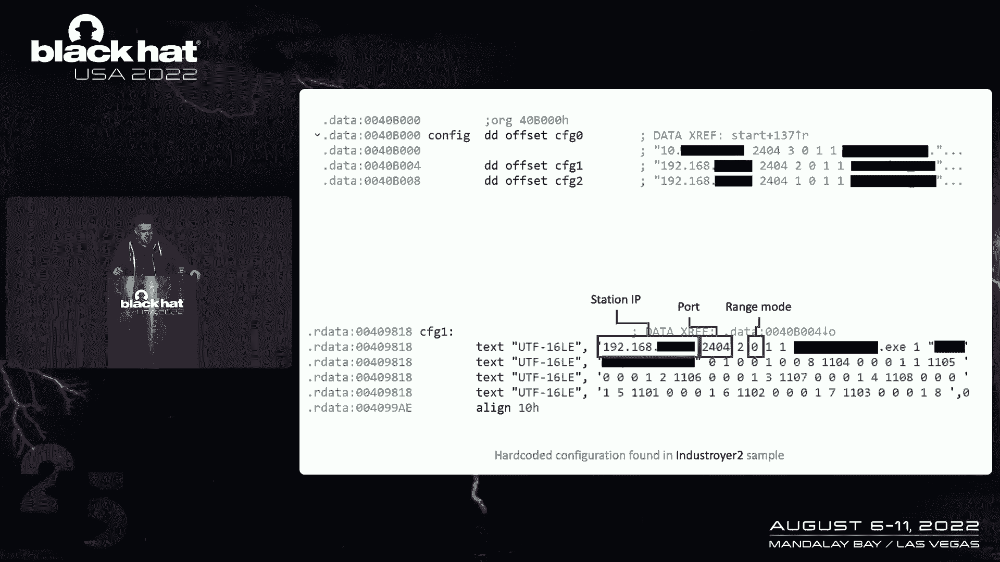

攻击者使用计划任务来调度恶意软件的执行。时间线显示，他们先部署恶意软件，然后创建计划任务，意图在特定时间（如下班后）依次执行Industroyer2和CaddyWiper。

---

## 防御与检测建议

上一节我们了解了攻击中使用的各种工具。本节中，我们探讨如何防御和检测此类威胁。

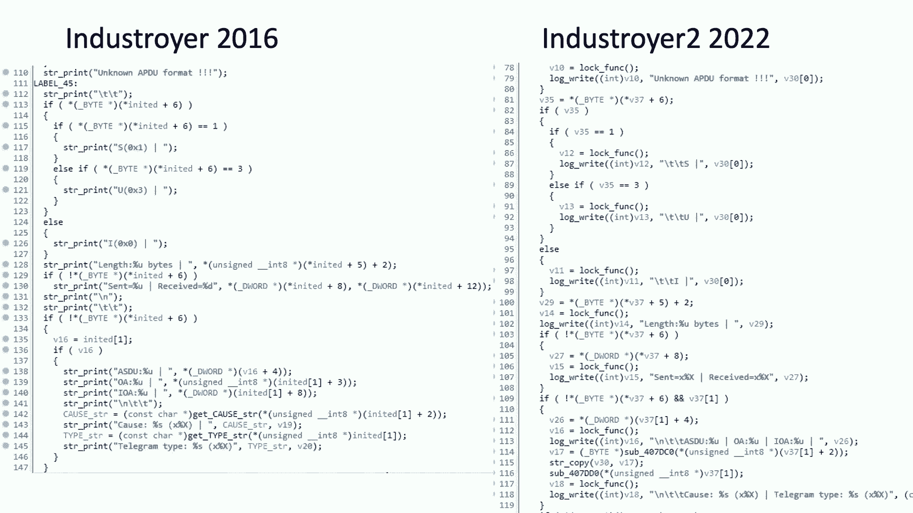

我们可以使用多种方法进行检测。首先，我们将发布本次捕获的恶意软件样本的YARA规则。此外，我们还发布了一个**Snort规则**，用于检测Industroyer2使用的特定IEC 104网络流量模式。

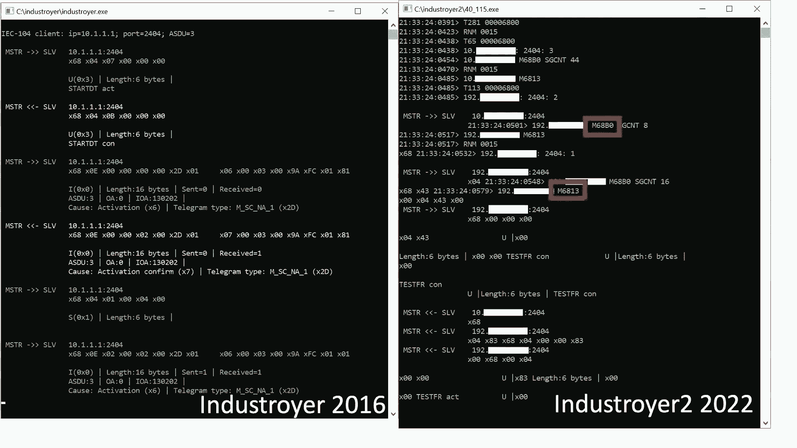

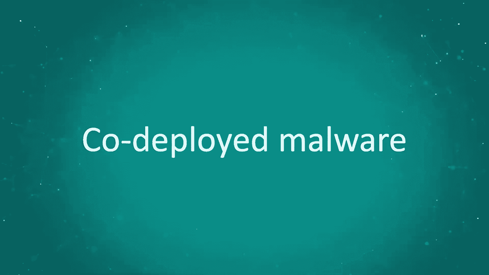

使用Snort规则的关键是根据您的环境进行调整。例如，在工业控制环境（OT）中强制检查所有网络流量可能不总是可行，且难以确定哪些是恶意流量。另一个限制是规则触发时，攻击可能已经发生。因此，我们建议监控其他可疑活动。

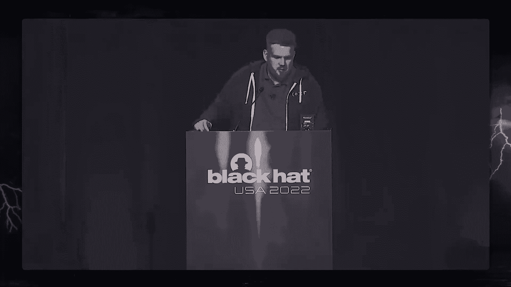

例如，攻击者使用了**Impact**框架（一个用Python实现各种工业协议的开源框架）进行远程执行。Sandworm组织大量使用此工具，尤其是其`ics`模块。我们可以基于其网络流量特征进行检测，因为它包含固定的时间戳和总长度值。

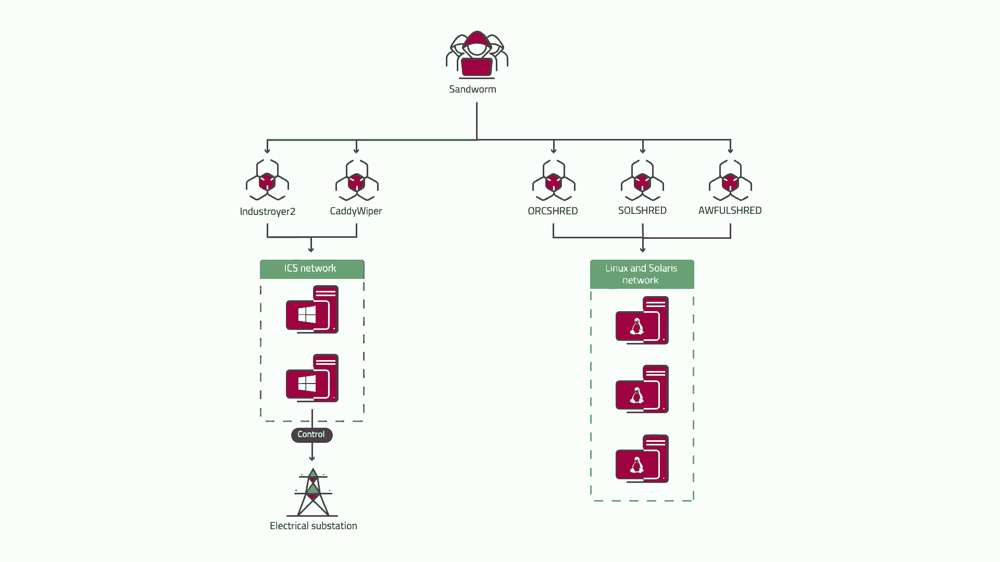

攻击者还使用了自定义脚本来通过组策略推送计划任务。为此，您可以查看组策略对象（GPO）的异常修改记录。

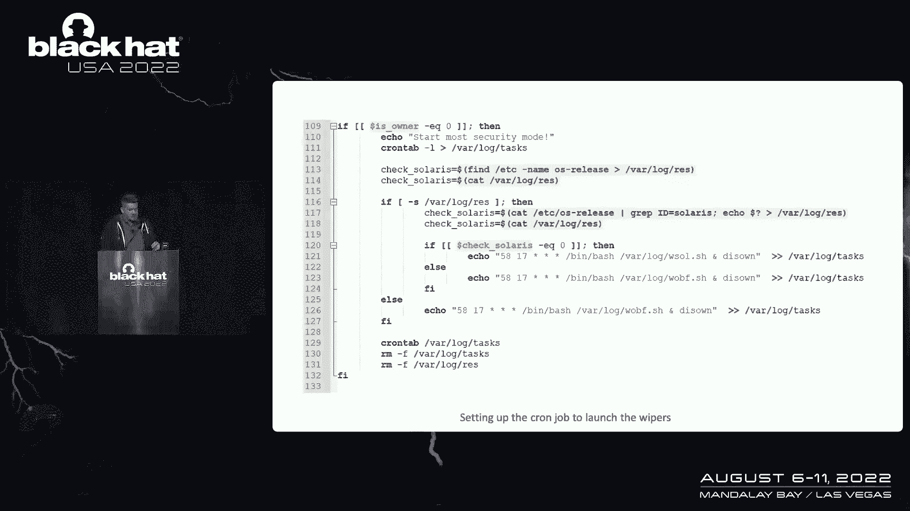

---

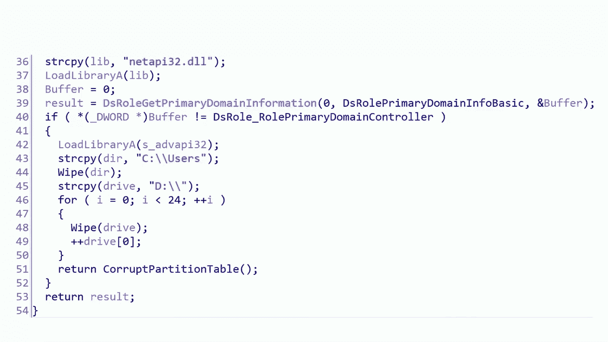

## 总结与进一步阅读

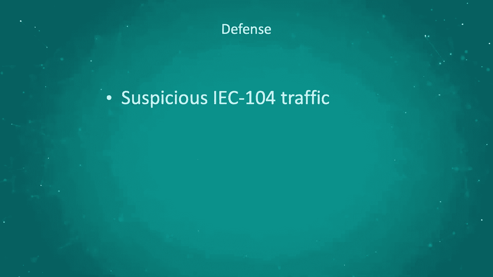

本节课中，我们一起学习了关于Industroyer2恶意软件的攻击活动。我们回顾了Sandworm组织的历史，分析了2022年4月针对乌克兰电网的未遂攻击，并对比了Industroyer两代版本的技术细节。我们还探讨了相关的防御和检测方法。

Industroyer的两个版本都未能实现其最终目标，这得益于防御者的努力。但在评估其威胁时需保持谨慎：这种威胁不应被夸大，但也不应被淡化或低估。威胁是严重的，但可以通过适当的安全措施来挫败。

以下是进一步的阅读材料，您可以在我们在线分享的幻灯片中找到相关链接：

*   ESET关于Industroyer2的详细研究报告
*   关于Sandworm组织历史活动的分析
*   IEC 104协议安全白皮书
*   针对工业控制系统的安全防护最佳实践

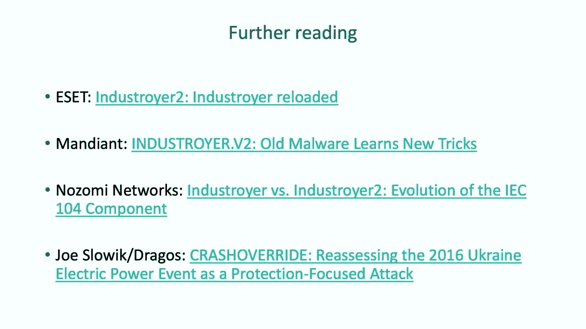

---

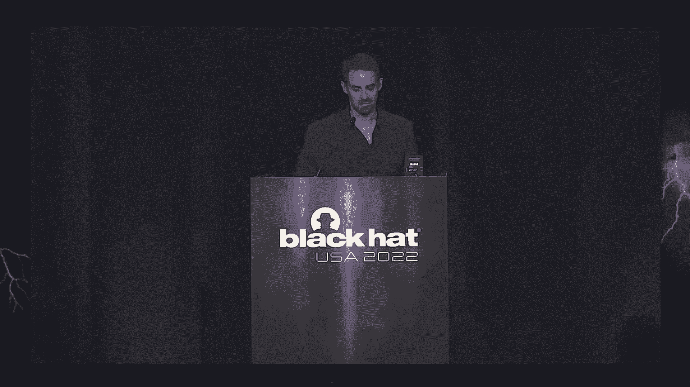

**本节课中我们一起学习了：**
*   Sandworm（沙虫）APT组织的背景和历史攻击。
*   2022年俄乌战争期间的一系列网络攻击，包括HermeticWiper和CaddyWiper。
*   Industroyer2攻击事件的详细过程和分析。
*   第一代Industroyer与第二代Industroyer2的技术对比。
*   与Industroyer2关联的破坏性工具（如CaddyWiper）。
*   针对此类工业控制系统攻击的防御与检测建议。