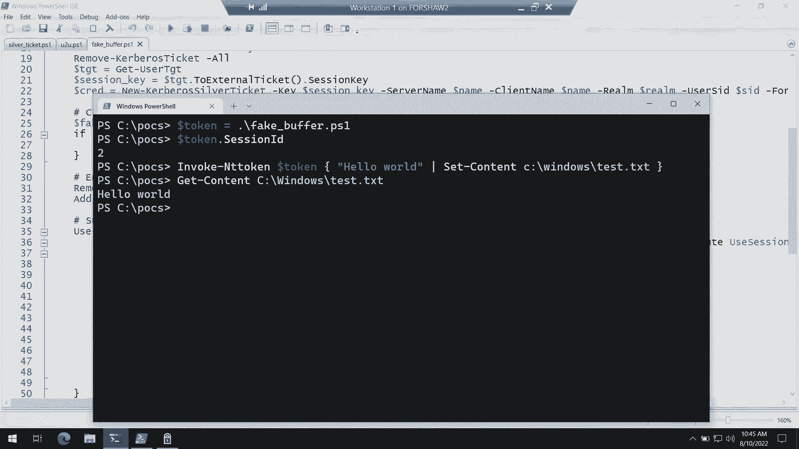

# 课程 P70-080：将 Kerberos 权限提升到新水平 🔐

在本课程中，我们将学习如何利用 Windows 系统中的 Kerberos 身份验证协议，在本地计算机上进行权限提升。我们将从基础的银票攻击开始，逐步深入到更高级的技术，包括用户对用户（U2U）身份验证、会话令牌迁移，以及如何绕过凭证保护等现代安全机制。课程内容面向对 Kerberos 有基本了解的初学者，我们将用简单的语言和清晰的示例来解释核心概念。

---

## 背景与 Kerberos 基础

上一节我们介绍了课程的主题。本节中，我们来看看 Kerberos 在 Windows 本地环境中的基本工作原理。

Kerberos 是为远程客户端到服务器的身份验证而设计的。然而，在 Windows 中，你同样可以使用 Kerberos 对同一台计算机进行身份验证。

当你登录到一台域内的 Windows 计算机时，会向密钥分发中心（KDC）发起请求。你的密码用于向内部的其他服务发出身份验证请求，并确定你属于哪些用户组。

在本地进行身份验证时，我们通常不会直接使用 TCP 套接字与 KDC 通信，而是使用一个名为 **SSPI** 的接口。这是用户模式与 **LSASS** 进程（本地安全机构子系统服务）之间的一种通信方式，LSASS 是 Windows 上进行身份验证的核心组件。

我们通常调用 `InitializeSecurityContext` 函数向 LSASS 发出请求。LSASS 会调用其进程中运行的 `kerberos.dll`。你需要提供你的票证授予票证（TGT），并说明你想向哪个本地服务发起服务身份验证请求。

这需要一个称为 **服务主体名称（SPN）** 的标识符。SPN 被发送到 KDC，KDC 使用它查找对应的长期密钥。这个密钥实际上是从本地系统的计算机账户密码派生出来的。KDC 解密你的 TGT，将组信息输出到服务票证中，并使用计算机账户的密钥加密这张服务票证。

随后，服务器可以调用 `AcceptSecurityContext` 函数。服务器（即本地系统）知道自己的计算机账户密钥，因此可以解密票证，并在本地系统上模拟该用户执行操作。

---

## 银票攻击 🎫

上一节我们介绍了 Kerberos 的本地工作流程。本节中，我们来看看一种已知的攻击方法——银票攻击，以及它在本地环境中的应用。

首先，我们需要密钥来伪造票证。我们不知道计算机账户的密钥，但我们知道**用户的密钥**，因为 Kerberos 中每个用户的密钥都从其密码派生而来。

我们向 LSASS 认证，然后可以在自己的进程中生成相同的用户密钥。我们只需要密码。接着，我们可以为任意服务伪造一张票证，并在其中声明自己是管理员。然后，我们调用 `AcceptSecurityContext`，LSASS 会解密票证并给我们一个管理员令牌。至此，攻击完成。

以下是其核心步骤的简化表示：

1.  **获取用户密码**。
2.  **派生用户密钥**：`用户密钥 = 派生自(用户密码)`。
3.  **伪造服务票证**：使用用户密钥加密一个包含管理员组（如 SID `S-1-5-32-544`）的票证。
4.  **提交票证**：通过 `AcceptSecurityContext` 将伪造的票证提交给 LSASS。
5.  **获取令牌**：LSASS 解密票证（因为它使用用户密钥加密），并返回一个高权限的访问令牌。

然而，当我们尝试执行标准的银票攻击时，可能会遇到错误。错误信息可能提示票证无效，但这通常不是代码错误。问题根源在于一种称为 **PAC 签名验证** 的机制。

---

## PAC 签名验证与 U2U 身份验证 🔑

上一节我们遇到了银票攻击的障碍。本节中，我们来深入探究 PAC 签名验证以及如何绕过它。

服务票证包含一个特权属性证书（PAC），其中包含用户的组信息等敏感数据。PAC 使用服务器密钥（计算机账户密钥）进行签名，以确保其完整性。

在标准的银票攻击中，我们使用用户密钥加密票证，但 PAC 的签名仍然是使用计算机账户密钥生成的。当 LSASS 收到票证时，它会尝试使用计算机账户密钥验证 PAC 签名，由于签名不匹配，验证会失败。

那么，银票攻击成功需要什么条件呢？关键在于一个特殊的标志：**`ISC_REQ_USE_SESSION_KEY`**。

如果你查阅 MSDN，会得到一个非常通用的解释。但根据 Kerberos RFC 4120，当使用这个标志时，票证是使用**服务器 TGT 中的会话密钥**加密的，而不是服务器的长期密钥（计算机账户密钥）。这个过程被称为 **用户对用户（U2U）身份验证**。

这意味着，如果我们能获得代表目标用户、且使用其 TGT 会话密钥加密的服务票证，我们就可以用这个会话密钥来签名我们伪造的银票，从而绕过 PAC 签名验证。

问题在于，如何获得这个 TGT 会话密钥？LSASS 通常不会轻易交出 TGT。幸运的是，存在一个已知的技巧：**无约束委派 TGT 提取**。

当服务被配置为无约束委派时，它收到的一些服务票证中会**嵌入原始用户的完整 TGT 及其会话密钥**。我们可以请求 LSASS 为这样一个无约束委派服务创建票证，然后从返回的票证中提取出嵌入的 TGT 和会话密钥。

现在我们有了活跃的 TGT 及其会话密钥。我们可以使用这个会话密钥，而不是用户的长期密码密钥，来签名我们伪造的银票。这样，PAC 签名验证就会通过。

此外，在伪造票证时，我们可以修改 PAC 中的 **`KERB_VALIDATION_INFO`** 结构，添加任意组 SID，例如域管理员组（`S-1-5-21-<domain>-512`）。由于域内的计算机通常将域管理员视为本地管理员，这能让我们获得本地管理员权限。

---

## 令牌会话与模拟限制 🚧

上一节我们成功获得了管理员组令牌。本节中，我们尝试使用这个令牌时，可能会遇到另一个错误：“模拟级别”错误。

这通常是因为我们获得的令牌存在于 **会话 0** 中，而我们试图在非会话 0 的上下文中模拟它。Windows 为了防止某些攻击，默认阻止从会话 0 模拟令牌到其他会话。

网络身份验证（如我们的 Kerberos 认证）默认在会话 0 中创建令牌。因此，我们需要一种方法将会话 0 中的令牌“移动”到我们自己的会话中。

经过分析，我们发现 LSASS 中存在一个用于跟踪**环回身份验证**的机制。当客户端和服务器在同一台机器上通信时，这个机制会被触发。

其工作流程如下：
1.  客户端调用 `InitializeSecurityContext` 时，LSASS 开始跟踪，计算一个哈希值（基于返回的安全缓冲区）。
2.  服务器稍后调用 `AcceptSecurityContext` 时，传入相似的安全缓冲区。
3.  LSASS 计算传入缓冲区的哈希，并在跟踪表中查找匹配项。如果找到，则认为这是合法的环回身份验证，并允许跨会话构建令牌。

我们需要利用这个机制。但有一个难题：我们不能直接修改 `AcceptSecurityContext` 传入的缓冲区（AP-REQ），因为这会改变其哈希值，导致查找失败。

解决方案在于安全缓冲区描述符的 **`SecBuffer`** 结构。它有一个类型字段和一个属性字段。我们可以创建两个缓冲区：
*   **缓冲区 A**：包含我们修改后的恶意 AP-REQ 数据，类型为 `SECBUFFER_TOKEN`，但属性被标记为 `SECBUFFER_READONLY`。
*   **缓冲区 B**：包含原始的、良性的 AP-REQ 数据，类型为 `SECBUFFER_TOKEN`。

LSASS 的环回跟踪哈希函数在计算时，会忽略 `SECBUFFER_READONLY` 属性，因此它使用**缓冲区 B** 来计算哈希，这样就能与之前 `InitializeSecurityContext` 记录的哈希匹配。
而 Kerberos 协议处理模块在查找票证时，会使用**缓冲区 A** 中的数据。这样，我们就实现了“偷梁换柱”，既修改了票证，又保证了跟踪机制的正常工作，从而成功将令牌从会话 0 迁移到我们自己的会话。

---

## 应对凭证保护与 KDC 钉扎攻击 🎯

上一节我们解决了令牌会话问题。本节中，我们考虑更现代的环境，如 Windows 11，其中默认启用了**凭证保护**。

凭证保护阻止了我们之前使用的“无约束委派 TGT 提取”技巧，因为我们无法再从 LSASS 进程中提取出包含会话密钥的 TGT。

我们需要重新获得对用户对用户票证关键材料的控制。一个大胆的想法是：**运行我们自己的 KDC**。

我们可以利用 Kerberos 的一个特性：**KDC 钉扎**。通过向 LSASS 发送请求，我们可以将一个特定的 Kerberos 领域绑定到我们指定的主机名（如 `127.0.0.1`）。

然后，我们在本地运行一个自己编写的 KDC 服务器。当我们的代码调用 `InitializeSecurityContext` 时，LSASS 会与我们本地的假 KDC 通信（端口 88）。由于我们完全控制这个 KDC，我们可以签发任何我们想要的票证，并掌握所有的关键材料（TGT 密钥、会话密钥等）。

这样，即使凭证保护开启，我们也能为任意用户生成有效的、使用 U2U 会话密钥签名的服务票证，从而完成权限提升攻击。这种方法完全绕过了对真实域 KDC 和用户密码的依赖。

---

## 缓解与检测建议 🛡️

上一节我们展示了多种攻击路径。本节中，我们来看看如何防御和检测这类攻击。

**缓解措施：**
1.  **禁用非必要服务的 U2U**：对于非系统服务（如 IIS 应用程序池标识），可以在 Kerberos 配置中禁用 U2U 身份验证功能。
2.  **强制 Kerberos 装甲（FAST）**：启用 Kerberos 装甲可以保护客户端与 KDC 之间的通道，使得中间人攻击（如我们自建 KDC）更加困难，因为通信会使用计算机账户密码签名。
3.  **启用凭证保护**：尽管我们展示了绕过方法，但凭证保护仍然极大地增加了攻击者提取关键材料的难度，并阻止了无约束委派攻击，应保持启用。
4.  **限制 KDC 通信**：使用企业防火墙规则，只允许客户端与受信任的、已知的 KDC 服务器通信，可以阻止 KDC 钉扎攻击指向互联网上的恶意服务器。

**检测建议：**
*   监控 Windows 安全事件日志，特别是事件 ID **4672**（特殊权限分配给新登录）。如果发现非本地管理员的域用户账户在计算机上被授予了管理员令牌，这可能是一个异常信号，值得深入调查。

---

## 总结

在本节课中，我们一起学习了 Kerberos 协议在 Windows 本地权限提升中的多种利用方式。

我们从经典的银票攻击开始，理解了其原理和限制。接着，我们深入探讨了 PAC 签名验证机制，并引入了用户对用户（U2U）身份验证和 TGT 会话密钥的概念，以绕过该验证。然后，我们解决了因令牌位于会话 0 而导致的模拟限制问题，利用了 LSASS 的环回身份验证跟踪机制。最后，面对现代系统如 Windows 11 的凭证保护，我们介绍了通过 KDC 钉扎和运行本地恶意 KDC 来完全控制认证流程的高级攻击手法。

通过这一系列步骤，我们展示了攻击者如何从获取普通用户权限开始，逐步提升至系统管理员权限。了解这些技术有助于我们更好地构建防御体系，监控异常活动，并保护系统安全。

---
*注：本教程基于公开的安全研究内容整理，旨在用于教育目的，帮助理解相关安全机制。文中提及的某些漏洞可能已被软件供应商修复。*