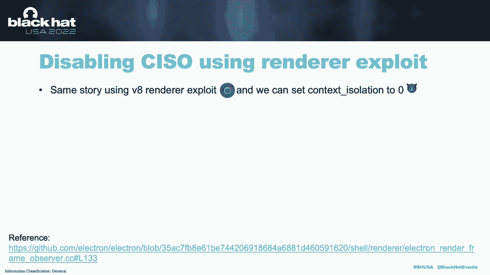

# 课程 P71：ElectroVolt - 在发现新攻击面的同时攻陷流行桌面应用 🚀


在本课程中，我们将学习 Electron 框架的安全机制，并探索如何利用其配置漏洞和设计缺陷，对流行的桌面应用程序（如 VS Code、Discord、Microsoft Teams 等）进行攻击。我们将从最宽松的安全配置开始，逐步深入到最严格的配置，并揭示一个隐藏在 Electron 内部的新攻击向量。

## 概述：什么是 Electron？💻

Electron 是一个流行的开源框架，用于构建跨平台的桌面应用程序。其核心理念是：如果你能构建一个网站，你就能构建一个桌面应用。许多常用应用，如 Microsoft Teams、Discord、Slack 等都基于 Electron 构建。

Electron 本质上构建于 Chromium 和 Node.js 之上。这意味着开发者仅使用 JavaScript、HTML 和 CSS 就能发布一个原生的桌面应用。


在深入探讨漏洞之前，理解 Electron 的架构至关重要。

## Electron 架构与进程模型 🔧

Electron 中有两种类型的进程：主进程和渲染器进程。

*   **主进程**：是所有 Electron 应用的起点。它使用 `BrowserWindow` 类创建多个渲染器进程，并能访问原生 GUI API 来创建菜单、托盘等对象。**一个应用只能有一个主进程**。
*   **渲染器进程**：其主要功能是使用 Chromium 渲染网页。因此，它继承了 Chromium 的许多特性，如站点隔离、多进程等。


主进程和渲染器进程通过 IPC（进程间通信）模块进行通信。开发者可以在 `BrowserWindow` 配置的 `webPreferences` 标志中应用多种安全设置，以控制渲染器进程的行为。配置越宽松，应用就越脆弱。

以下是代码示例：

**主进程 (main.js)**
```javascript
const { BrowserWindow, ipcMain } = require('electron');
const win = new BrowserWindow({
  webPreferences: {
    nodeIntegration: true,
    contextIsolation: false,
    sandbox: false
  }
});
win.loadURL('https://google.com');
ipcMain.on('open-url', (event, url) => {
  // 处理打开URL的逻辑
});
```

**预加载脚本 (preload.js)**
```javascript
const { contextBridge, ipcRenderer } = require('electron');
contextBridge.exposeInMainWorld('electron', {
  openURL: (url) => ipcRenderer.send('open-url', url)
});
```

**网页 (index.html)**
```html
<script>
  window.electron.openURL('http://attacker.com');
</script>
```

如你所见，通过设置 `webPreferences`，你可以控制渲染器进程的安全特性。最不安全的配置是 `sandbox: false`、`contextIsolation: false` 且 `nodeIntegration: true`，因为网页可以直接访问 Node.js 原语，攻击者只需执行 `require('child_process').exec()` 即可运行任意 shell 命令。

Electron 开发者考虑到了这一点，并引入了**上下文隔离**机制。

## 上下文隔离：关键防御 🛡️

启用上下文隔离后，渲染器进程被分为两个独立的上下文：
1.  **应用上下文**：运行网页的 JavaScript。
2.  **隔离上下文**：运行预加载脚本 (`preload.js`) 和 Electron 的内部代码。

这两个上下文完全隔离，网页无法直接访问 Node.js 原语。这与 Chrome 浏览器中扩展内容脚本与网页脚本隔离的“隔离世界”概念类似。


在本课程中，我们的攻击面主要集中在**渲染器进程**。我们将从滥用最宽松的配置开始，逐步过渡到更复杂的利用方式。


为保持幻灯片简洁，我们约定以下术语：
*   **Node Integration (NI)**: Node.js 集成
*   **Context Isolation (CI)**: 上下文隔离
*   **Sandbox (SB)**: 沙箱

## 案例研究 1：宽松配置下的攻击 (NI=true, CI=false, SB=false) 💥

这是最不安全的配置。Node.js 直接暴露给渲染器，因此获取 shell 非常简单。攻击者只需找到一种方法将 JavaScript 嵌入到网页视图中即可。

我们来看一个在真实世界常用应用 VS Code 中发现的案例。

VS Code 是一个源代码编辑器。它有一个功能，在打开源代码前会询问用户是以受限模式还是非受限模式打开。作为本用例的一部分，我们找到了一种方法，可以在 VS Code 的**受限模式**下实现远程代码执行。


以下是攻击链的示意图：


攻击涉及三个框架（图中方框所示）。绿色的框架运行在最严格的 Electron 设置下，而红色的框架运行在我们刚刚讨论的不安全配置下（NI=true）。攻击者的目标是设法从绿色框架跳转到红色框架。

攻击步骤如下：
1.  攻击者首先在 Markdown 预览器（绿色，受严格 CSP 限制）中获得立足点。通过 `meta` 重定向到外部网站，从而可以运行任意 JavaScript。
2.  泄露 VS Code 的扩展 ID（一个难以猜测的长字符串）。
3.  利用泄露的 ID，通过 `postMessage` 调用目标 VS Code Webview。
4.  再次利用该 Webview，通过 `channel.do.read` 泄露项目在受害者机器上的下载目录。
5.  利用 `vscode-file:` 协议（类似于 `file:` 协议，但可以从不同源调用）进行路径遍历，加载项目中的恶意 HTML 文件。
6.  在该 HTML 文件中，通过 `top.require` 访问 Node.js 原语，弹出 shell。

我们因此获得了微软提供的 **$6,000** 漏洞赏金。

## 案例研究 2：启用上下文隔离 (NI=false, CI=true, SB=false) 🎯


现在，我们提高安全级别，启用上下文隔离。此时，Node.js 不再直接对渲染器可用。攻击此类配置有两种方法：
1.  使用 Chrome V8 渲染器漏洞利用（因为沙箱被禁用）。
2.  尝试找到某种方法**禁用上下文隔离**（我们将在后续讨论）。

我们来看一个在 Discord 中发现的远程代码执行案例。

Discord 当时使用的是旧版 Electron (12.14.1)，这意味着它间接使用了旧版 Chrome (83)。我们发现最有趣的攻击面是**视频嵌入**功能。当用户向受害者发送带有 YouTube 链接的消息时，视频会被展开。

我们发现在第三方嵌入（Vimeo）中存在一个 XSS，借此获得了在 Discord 中的初始 JavaScript 执行能力。但问题是，Electron 应用中的 iframe **默认是沙箱化的**，因此不能直接运行 Chrome 83 的渲染器漏洞利用。


我们深入研究了 Discord 的代码，发现了一个新窗口文件处理程序中的**错误配置**，可以通过 `window.open` 打开一个新窗口，而这个新窗口**没有启用沙箱**。攻击者可以打开一个指向其控制的外部网站的窗口，然后运行 Chrome V8 渲染器漏洞利用以获取 RCE。

Discord 通过升级到最新的 Electron 版本并修复新窗口的错误配置（限制其重定向到外部网站）来修复此问题。我们因此获得了 **$5,000** 的漏洞赏金。

## 案例研究 3：启用沙箱 (NI=false, CI=false, SB=true) 🔐


现在，我们更进一步，启用沙箱但禁用上下文隔离。由于渲染器启用了沙箱，我们无法直接运行 Chrome 漏洞利用来获取 RCE，因为沙箱会阻止恶意系统调用。同时，Node.js 集成被禁用，因此渲染器无法访问 Node 模块。

但关键在于，此时加载的网站与 Electron 内部代码或预加载代码之间**没有隔离**。Electron 的内部代码也是用 JavaScript 编写的。那么，我们能否通过原型污染等手段覆盖 Electron 的内部代码呢？

**如何获取 Shell？**
*   **Electron 版本 < 10**：可以使用原型污染小工具泄露 `remote` 模块或 IPC 模块。`remote` 模块允许从主进程桥接 JavaScript 对象到渲染器进程。一旦在沙箱窗口中访问到 `remote` 模块，获取 Node.js 原语就变得很简单。
*   **Electron 版本 10-14**：`remote` 模块默认被禁用。但仍可尝试泄露它（如果开发者显式启用），或寻找 IPC 错误配置。
*   **Electron 版本 > 14**：`remote` 模块因安全考虑已被完全弃用。但仍可使用原型污染泄露 IPC 模块，然后寻找 Web 应用或 Electron 内部代码中配置不当的 IPC 通道。

我们展示了一个在测试版 Electron 中发现的新颖的原型污染小工具。通过覆盖特定的内置 JavaScript 函数，我们能够访问包含所需模块的 `webpack.require`，从而在目标应用中实现 RCE。

与 V8 漏洞利用相比，这种方法更可靠，不需要二进制漏洞利用知识，并且适用于那些根本没有 Chrome 漏洞利用可用的应用。

对于沙箱启用的情况，虽然无法直接访问 Node.js 原语，但可以泄露 Electron 的 IPC 绑定，然后调用开发者定义的 IPC 通道（如 `openURL`）或 Electron 的内部通道（如 `electron.` 或 `guest.`）。


**Microsoft Teams 案例**：我们通过 CKEditor 中的一个零日漏洞（用于富文本格式化）在渲染器中获得了立足点。我们发现，当打开新窗口时，上下文隔离被禁用，但沙箱启用。我们使用原型污染小工具泄露了 IPC，然后利用 Electron 的内部 IPC API (`ipcRendererInternal`) 调用了一个浏览器进程函数来读取文件，实现了本地文件读取，并最终通过窃取的 JWT 令牌完成了账户接管。我们因此获得了 **$3,000** 的漏洞赏金。

## 核心发现：攻击最严格配置 (NI=false, CI=true, SB=true) 🧠


这是大多数应用推荐的安全配置：Node.js 原语不暴露给渲染器，上下文隔离启用，沙箱启用。攻破此配置是我们研究的核心部分。


此时你可能会问：这难道不就等同于在浏览器中获得一个 XSS 吗？答案是否定的。因为 Electron 的代码是 Chrome 代码和 Electron 特定代码的结合体。我们的目标是找到滥用这两者交集的方法，从而颠覆 Electron 的所有防御。


### 攻击向量 1：在受控渲染器中启用子框架 Node 集成 (NISF)

**什么是子框架 Node 集成？**
默认情况下，iframe 或子窗口无法访问 Node.js 原语或预加载脚本。`nodeIntegrationInSubFrames` 标志控制是否向子框架提供此访问权限。

在代码中，如果父窗口启用了 NISF 且沙箱被禁用，则子框架可以访问 Node.js 原语。如果 NISF 被禁用，则无论沙箱如何，所有预加载脚本都会加载到该 iframe 中。


在大多数情况下，NISF 是被禁用的，因为开发者通常不需要它。因此，即使我们在 iframe 中获得立足点，也无法访问上下文桥暴露的 API。


**如何破解？**
我们深入研究了 Electron 源代码，发现 NISF 的检查是在**渲染器进程**中进行的。如果我们能运行一个渲染器漏洞利用，并找到方法将该检查变量从 0 翻转为 1，我们就能启用 NISF。


**Element App 案例**：
Element 使用 Chrome 91 和 Electron 13。我们通过深链错误配置在嵌入内容中发现了 XSS。主进程定义了一个危险的 IPC 通道 `user-download-open`（使用 `shell.openPath`）。渲染器进程通过 `electron.send` 暴露了一个方法来代理消息到主进程。




我们的漏洞利用步骤如下：
1.  创建一个 `srcdoc` iframe。
2.  运行 Chrome V8 漏洞利用，在该 iframe 中启用 NISF。
3.  现在，在这个新的 iframe 中，我们可以访问之前暴露的 `electron.send` 方法，并传递参数来弹出 shell。


我们因此从互联网漏洞赏金计划获得了 **$3,000** 的赏金。

### 攻击向量 2：在受控渲染器中禁用上下文隔离 (CI)


同样的原理，我们发现上下文隔离的检查也发生在渲染器进程中。我们可以使用 V8 渲染器漏洞利用，将上下文隔离的检查变量从 1 覆盖为 0，从而禁用它。


**未公开应用的案例**：
我们发现该应用有一个功能，可以在 iframe 中嵌入不受信任的内容。主进程中有一个危险的 IPC 通道 `open-and-discord`。预加载脚本中有一个 `isAllowedUrl` 函数进行白名单检查，只允许 HTTPS 协议。

我们的漏洞利用步骤如下：
1.  使用 V8 漏洞利用禁用上下文隔离。
2.  重定向到另一个网页 (`leak.html`)。
3.  页面重载后，上下文隔离已被禁用。此时，我们可以执行原型污染，直接访问 IPC 模块。
4.  绕过预加载脚本的白名单检查，直接调用危险的 IPC 通道，即使使用 `file://` 协议也能弹出 shell。

我们因此从一个未公开的赏金计划获得了 **$5,000** 的赏金。

## 同站点源欺骗攻击 🌐

在 Electron 应用中，Chrome 会对相同顶级域名的子域名使用相同的进程（站点隔离不适用）。例如，`main.example.com` 和 `sandbox.example.com` 可能共享同一个进程。

如果攻击者在 `sandbox.example.com` 上获得立足点，并想访问 `main.example.com` 上的预加载 API 和 Node.js 原语，他们可以运行 Chrome 渲染器漏洞利用，将 `document.url` 和 `securityContext` 的源/端口设置为 `main.example.com` 的值。这样，他们就能伪装成父页面，访问所有暴露给 `main.example.com` 的特权上下文。

## 缓解措施与总结 🛡️


我们发现的漏洞已由 Electron 团队在代码层面修复（例如，将关键安全检查从渲染器进程移至更安全的位置），并分配了 CVE。

**给开发者的建议：**
1.  **启用所有推荐的安全标志**：`nodeIntegration: false`, `contextIsolation: true`, `sandbox: true`。
2.  **谨慎使用不受信任的第三方嵌入**：确保其有良好的安全记录。
3.  **保持 Electron 和 Chromium 的补丁更新**：避免存在可利用的已知漏洞。
4.  **避免实现敏感的 IPC 通道**：特别是那些包含危险 Node.js 同步函数（如 `shell.openPath`）的通道。
5.  **全面缓解安全风险**：考虑应用中的所有窗口和域名（包括子域名），确保都应用了适当的安全设置。

**关键要点：**
1.  **对于安全研究人员**：深入审计你所评估的框架，不要局限于应用层。设计层面的缺陷可能让你在拥有适当原语的情况下绕过多种安全设置。
2.  **对于防御方**：Electron 应用是理想的攻击目标，因为用户会点击任何地方或打开任何链接。在威胁建模中，应将组织内使用的 Electron 应用考虑在内。
3.  **最小化攻击面**：以更高的标准审视所有安全问题。对所有窗口应用所有安全设置，防止攻击者从严格环境跳转到宽松环境。

## 总结 📚

在本课程中，我们一起深入探讨了 Electron 框架的安全机制。我们从最基础的架构和进程模型讲起，逐步分析了在不同安全配置（从宽松到严格）下对流行桌面应用的攻击案例，包括 VS Code、Discord、Microsoft Teams 等。我们重点揭示了一个新的攻击面：通过渲染器漏洞利用篡改 Electron 内部的安全检查变量（如启用子框架 Node 集成或禁用上下文隔离），从而在最严格的安全配置下实现攻击。最后，我们讨论了同站点源欺骗等高级技巧，并给出了关键的缓解措施和安全建议。


希望本课程能帮助你更好地理解 Electron 应用的安全风险，并为构建或评估更安全的桌面应用提供指导。