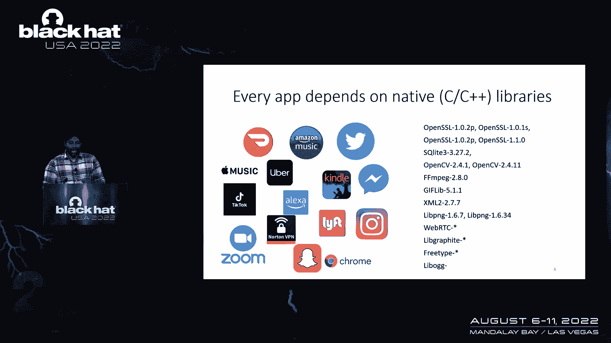
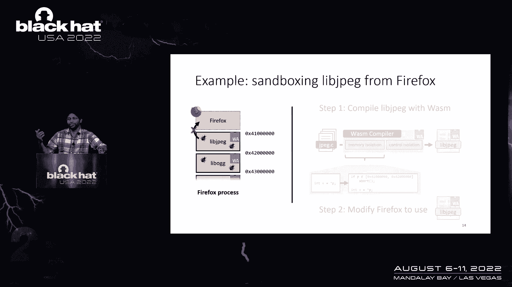
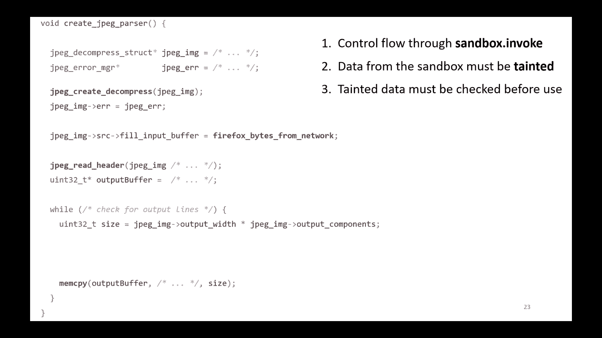
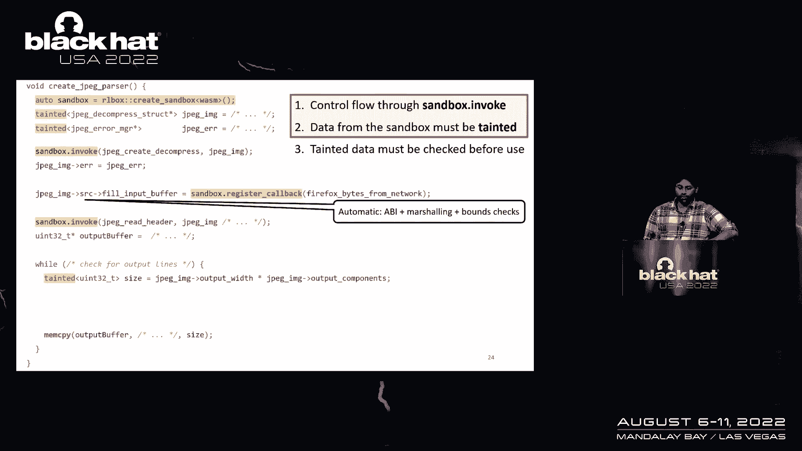

# 课程 P72：082 - 如何使用进程内沙箱保护应用程序免受漏洞侵害 🔒


在本课程中，我们将学习一种名为“进程内沙箱”的技术，它用于保护应用程序免受其依赖的本地代码库中漏洞的影响。我们将探讨为何需要这项技术、其面临的挑战，并介绍一个名为 RL Box 的框架，该框架极大地简化了在现有大型应用程序中集成沙箱的过程。

---



## 为什么需要进程内沙箱？🤔

我们使用的每一个应用程序都在某种程度上依赖于本地代码。本地代码通常存在内存安全漏洞。据统计，在谷歌 Chrome 和微软 Windows 中发现的漏洞中，约 70% 是内存安全漏洞，例如缓冲区溢出、释放后使用等。

你可能会想：“让我们停止用 C++ 编写代码，全部改用 Rust 等安全语言。”然而，问题在于这些安全语言本身也构建在相同的不安全库之上。例如，Rust 的 `cc` 板条箱或 Node.js 的 API 可能依赖数百万行 C 代码。当这些底层库存在漏洞时，它们仍会被用于真实的攻击中，危害浏览器、消息应用等系统。


现有的缓解技术（如地址空间布局随机化、栈保护等）只是攻击者需要克服的小障碍。完全用 Rust 重写所有现有 C/C++ 代码是不现实的，因为存在数十亿行代码，且涉及性能、可移植性和测试等巨大挑战。因此，我们需要寻找其他解决方案。

---

## 什么是进程内沙箱？📦

进程内沙箱的核心思想是：将有缺陷的本地代码隔离起来，使其无法影响应用程序的其余部分。传统方法是将不信任的代码放入单独的进程中，但这会引入进程间通信的开销，导致性能下降、内存占用增加，并且难以在现有应用程序中改造。

我们尝试的有效技术是**进程内沙箱**。具体做法是：将不信任的库（如 libjpeg）使用 **WebAssembly** 编译器进行编译和沙箱化，然后在**同一个进程**中运行它们。



可以将 WebAssembly 视为一个能通过运行时检查来隔离代码的编译器。其关键机制是**范围检查**。应用程序中的任何内存读取都会被转换为类似以下的形式：


```c
// 伪代码表示范围检查思想
if (address >= sandbox_start && address <= sandbox_end) {
    value = *address;
} else {
    trap(); // 触发错误，阻止越界访问
}
```

这样做的目标是让应用程序从一整块可以访问任意地址空间的代码，转变为由多个明确组件构成的结构。每个沙箱化组件只能访问其被分配的特定内存区域。例如，libjpeg 只能访问地址 `0x4100` 到 `0x4200` 之间的内存。

最终结果是，当 libjpeg 中出现释放后使用、缓冲区溢出等漏洞时，它无法触及 Firefox 主进程或其他组件的内存。这实现了代码重用和性能保障（无进程间通信开销），但引入了新的工程挑战。

---


## 进程内沙箱的挑战与痛点 ⚙️

将进程内沙箱集成到现有大型代码库（如 Firefox）中非常困难。以沙箱化 libjpeg 为例，步骤如下：


1.  **解耦库**：不仅是将代码移到单独文件夹，还需要理清共享的数据结构、分离纠缠的控制流。
2.  **处理数据共享**：由于组件拥有独立内存，需要在不同组件间**编组**数据。这面临挑战：
    *   WebAssembly 使用不同的调用约定和 API。
    *   需要编写额外的“胶水代码”来适配。
    *   必须谨慎、惰性地进行编组以控制开销。
3.  **添加安全检查**：原本受信任的库（如 libjpeg）在被沙箱化后变为不可信。必须修改应用程序代码，在所有使用该库输出的地方添加合理性检查或数据消毒。

手动进行这些更改极其困难。一个简单的10行图像渲染示例，在手动添加所有必要的编组、API适配和安全检查代码后，几乎每一行都被修改，代码变得难以理解、维护和审查。安全细节与功能代码混杂，并且需要为每个平台和每个要沙箱化的库重复此过程。

结论是：手动实现进程内沙箱在实践中非常容易失败，需要框架辅助。


---

## RL Box 框架：简化沙箱集成 🛠️



为了解决上述挑战，我们构建了 **RL Box** 框架。它是一个纯 C++ 库，旨在简化在现有大型代码库中采用沙箱的过程。其核心思想是**利用类型系统**来自动处理低级细节、跟踪不可信数据，并通过编译时错误确保安全。



RL Box 遵循三个核心原则：

1.  **控制流必须显式**：调用要沙箱化的库函数时，必须通过 `sandbox->invoke` 这样的 API。
2.  **沙箱输出的数据必须被标记**：从沙箱中获取的数据（如一个整数）会被包装为 `tainted<T>` 类型（例如 `tainted<uint32_t>`），与普通数据区分开。
3.  **使用前必须检查被污染的数据**：任何 `tainted<T>` 类型的数据在使用前（例如传入 `memcpy`）都必须经过验证。RL Box 会强制产生编译错误，直到你调用如 `copy_and_verify` 这样的 API 进行消毒。


应用这些原则后，之前复杂的示例代码变得清晰许多。RL Box 在幕后自动处理了 API 编组、数据封送甚至部分边界检查。开发者通常只需要添加少量（2-4行）数据验证代码即可完成沙箱化。

---

## 部署经验与总结 🚀

在开发 RL Box 后，我们进行了大量测试，涵盖 Firefox、Node.js、Apache 等应用，以及图像渲染、音频视频、XML 解析等多个库类别。RL Box 能够自动生成数百行胶水代码，使得为一个库添加沙箱仅需数天。

**2020年2月**，RL Box 在 Firefox 浏览器中正式发布。最初仅在 macOS 和 Linux 上沙箱化少数库。经过两年的改进，现已支持所有平台（包括 Android），并沙箱化了多个库。

**性能方面**，对高价值用例（如 XML 解析、字体解压）的测量显示，性能开销约为 **10%**。对于浏览器这样的复杂应用，这个开销在可接受范围内，且对最终用户无感。

我们仍在持续改进，包括：
*   提升性能，等待 WebAssembly 线程等特性标准化。
*   改进工具链以在低资源环境（如 32 位架构）中良好工作。
*   优化虚拟内存占用。
*   改进 RL Box API，使其更符合现代 C++ 习惯，更易于使用。


**总结**：本节课我们一起学习了进程内沙箱技术。它是一种保护应用程序免受本地代码漏洞影响的实用方法。RL Box 框架极大地降低了集成沙箱的工程难度，并已在 Firefox 中生产就绪地使用了两年。这项技术结合了代码重用、性能保障和强大的安全隔离，是应对庞大遗留代码库安全问题的有效方案。