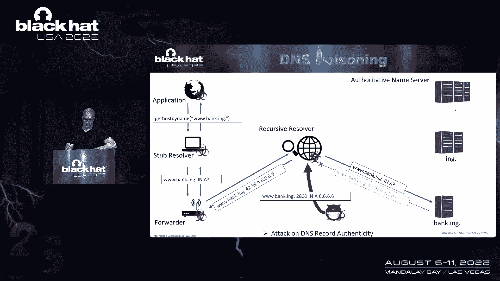
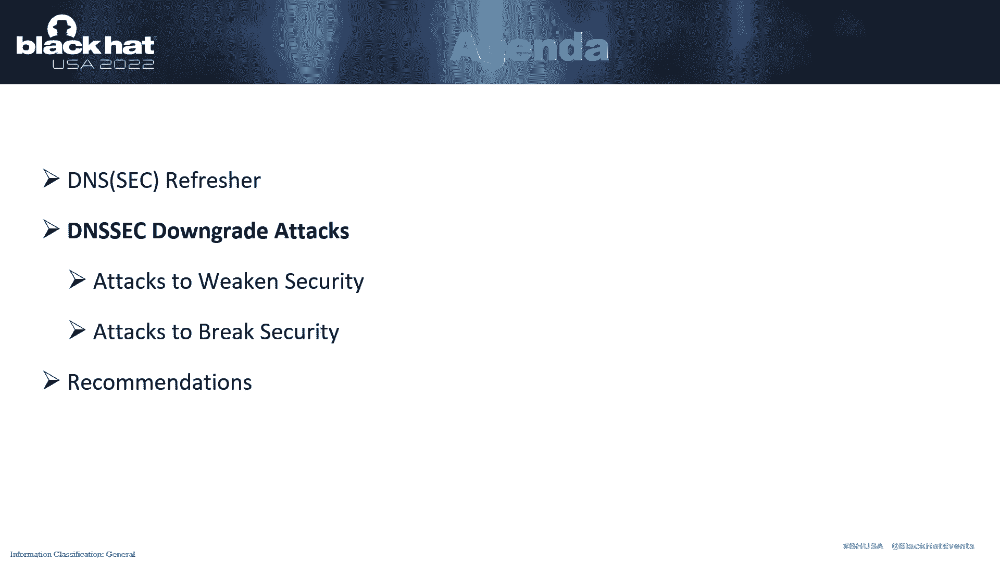
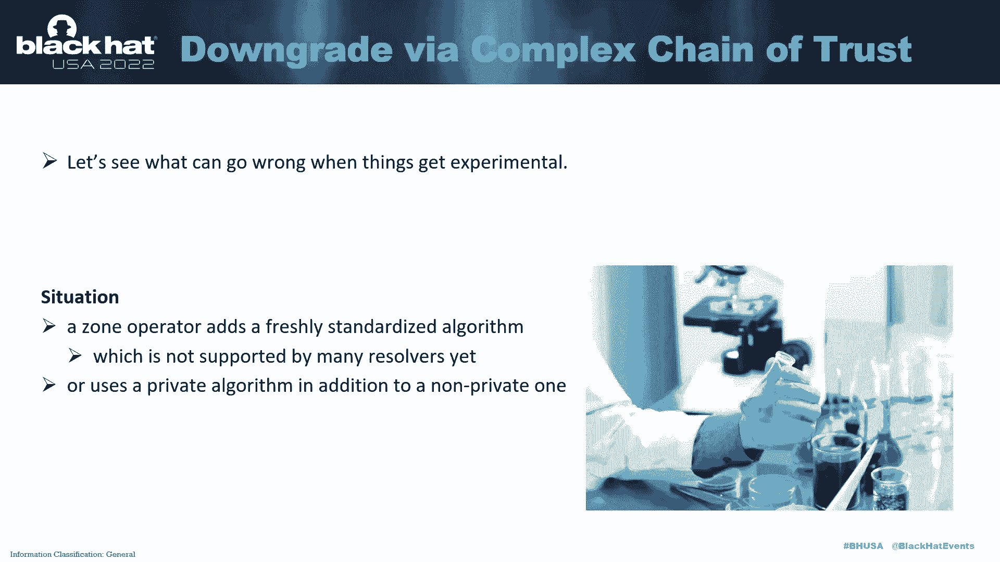
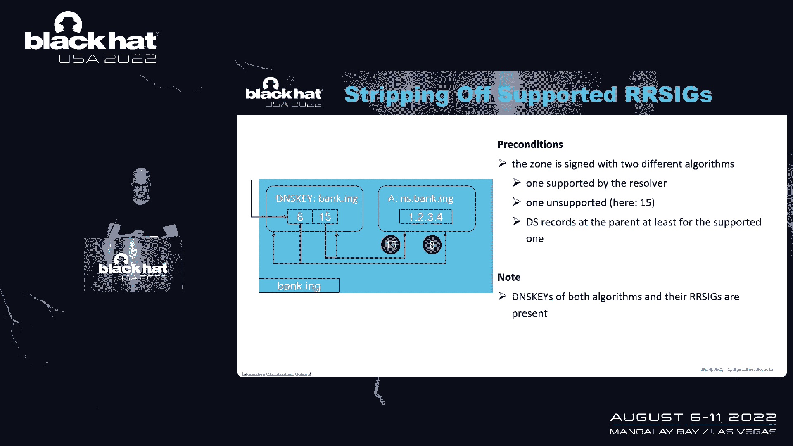
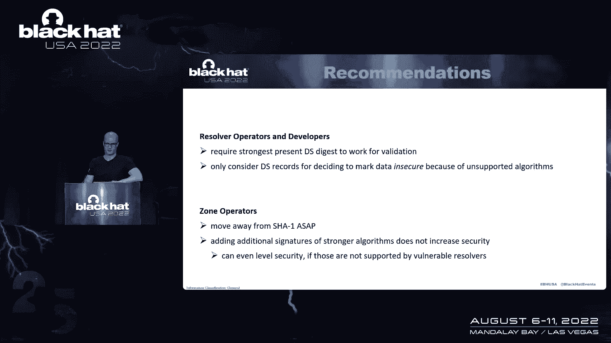

# P73：084 - DNSSEC Downgrade Attacks - 坤坤武特 - BV1WK41167dt

非常感谢，你好，大家欢迎来到DX降级攻击，所以我演讲的主题是Stic降级攻击，但我一开始就调查他们，DNS几乎参与了互联网上的所有交易，许多机制依赖于安全性，或密码恢复机制，也是主要的验证。

和许多其他人，因此，集合是实现DNS记录安全性的解决方案的目标，虽然这里的每个人可能都听说过对TA的降级攻击，别让SI受到攻击，到目前为止没有看到太多的关注，所以我的演讲结构如下。

然后我会解释DX降级攻击，我给你带了两节课，所以首先是削弱安全性的攻击，另一种是破坏安全的攻击，然后我将提出一些建议来结束我的演讲，好的，所以这是常见设置中的S分辨率，我们有一个应用程序。

一个用户想浏览网站，因此应用程序执行库调用，它是一个停止解析器，有帖子名，解析到IP地址，然后停止求解器将其转换为s请求，而网络转发到这里，向前井将其转发到递归解析器，递归解析器将完成繁重的工作。

什么都不假设，它的缓存里什么都没有，它会首先请求根区域的权威服务器提供有问题的记录，通常不会有答案，所以它会发送一个转介响应，说嘿，我不知道，但问问这个更接近名字的服务器，我们可能会给你一个答案。

第二个服务器也没有记录和问题的答案，因此，我们将再次发送转介响应，直到递归解析器引用到实际服务器，它有有问题的记录，在其数据库中的本地，这样服务器就会发送问题的实际答案，携带有关记录。

然后递归解析器将缓存并回复转发器，会把他们送去，然后向保证人发送答复，子求解器将把它交给应用程序。

可以说，在S中最大的威胁被视为中毒，这是对DNS记录真实性的攻击，在这里，它发生在递归解析器和权威名称服务器之间，并注意到每个下游DNS服务器现在也有它的缓存毒药，但它也可能发生在其他地方，当然是这样。

例如，在水和递归解析器之间，在实践中，如果房子一开始就有安全保障，它就有安全保障，所以我们有停止求解器和前进水之间的通信，通常使用disover https或dns over tas。

因为我们只有一个连接要管理，但是连接管理的成本高得令人望而却步，用于递归解析器和权威名称服务之间的通信，这就是为什么UDP通常有一个DNS，此外，还使用了ASIC，那是怎么工作的，所以首先。

sset提供数据来源，真实性，并建立数据的完整性，它没有提供的只是设计上的保密性，它通过使用加密签名保护DNS数据来做到这一点，放入用于验证的公钥中的信任，签名是通过公共基础设施委托的。

该基础结构内置到DNS层次结构中并与之对齐，让我们看一看，那是什么样子的信任链，但首先，让我们看看正在使用哪些记录，我们有签名记录，在记录集上创建签名，定义为具有相同的名称、类型和类类，几乎总是互联网。

所以我们就跳过这里，然后是I记录，它携带用于验证的公钥材料和DS记录，只载有个别子项目摘要的委托签署人记录如此，这些非常大致地符合证书和其他公共基础设施，所有这些记录都指定了签名算法，另外。

ds记录指定摘要类型号，我一会儿就回来找他们，所以在这里我们看到了信任链，前三区，处于亲子关系中的，这里，根区臭氧，臭氧的例子，我们在根区域设置了信任锚，所以这是我记录的一个院长。

我们需要有一些直接的信任概念，不是内嵌在这个大眼睛里的，是呀，然后可以使用i记录对保持sq记录集进行身份验证，也就是他们的签名在这个图中由区域箭头表示，这些也用于验证DS记录，这里有一个摘要类型二。

指向一个算法号为十三的平方，位于子区域的，所以这基本上和以前一样，但现在我们没有信任锚，但是DS观察真实性的记录，本质上我们也看到了这一点，所以说，这里有两个不同类型的DS记录。

指向子区域中的相同DSI记录，和，那个，然后可以使用一个来验证来自该区域的目标记录上的签名，所以www，例子，本例中的org地址记录，所以我为什么不能去掉签名或记录，假装他们不存在。

DNS中内置了一种机制，而不是经过身份验证的机制，否认存在，并且使用特定的记录类型来标记命名空间中的空间隔，它还指定出现在间隔边界处的记录类型，是的，是的，所以它只是说好，有平方记录。

或者没有DSQ记录，但它没有说有算法八中的一个来保护算法的存在，有一个要求内置在规范中，它说一旦有算法的记录，它们也必须在算法A中至少有一个，一旦有这样的SI记录。

区域中的所有数据上也必须有该算法的签名，存在什么算法，所以有很多，相当多，我听说那些是标准化的，不需要全部记住，所以我们只是快速地检查它们，主要用于发展目的，也是为了展示一个基础的。

这两个人此刻正在对峙，你可以看到他们不建议再签署了，和预备役来支持他们，还有其他正在面临的，本质上是这样的，首先，决议者采用它们，然后它们将用于签名区域，作为一个非常粗略的经验法则。

我们可以说只是为了把它放在脑后，非常粗略的经验法则，算法越高，越安全，有四种已标准化的摘要类型和，有效，其中三个正在积极使用，当我们进行调查时，我们研究了几个域集，所以我们调查了顶级域。

其中90%以上是安全签署的，我们还调查了前五十万个时域基本上发现了另一种方式，大约不到10%，甚至不到5%的人是通过这篇文章获得的，在事情的解析器方面，我们实验室里有九个解析器，我们调查了哪些很受欢迎。

绑定和其他，也是一个流行的开放解析器服务，想想谷歌和CloudFlare，我们还从端口扫描中查看了15000个可公开访问的解析器，i，p，v，四个地址空间，并在其中发现了3000个验证解析器。

在这里大约有20%，是呀，这将是我们将在下面看到的数字的基础，好的，所以让我们进入攻击。

我们的接受者模型是一个路径攻击者，这基本上被Dean Asic使用的线程模型所涵盖，因此，位于解析器和权威服务器之间的攻击者，攻击者可以发送read，修改，副本，延迟，抑制消息，随便啦。

但它不知道密码序列，破解密码学以保持解释简单，我们在这里进一步假设攻击者可以通过解析器触发解析，例如，通过发送一个查询，我们还假设空缓存，让我们看看攻击程序，所以首先攻击者的目标，以及具体的攻击场景。

就是冒充受害者域的权威名称服务器，它之所以如此，是因为处于中间位置的男性通常要付出高昂的代价，也是为了维持，因此，攻击者首先发送对名称服务器的请求。

获取名称服务器到递归解析器的入口记录，递归解析器将执行我们在前面的幻灯片中看到的解析操作，最终我们引用了权威的名称服务器，所以在那个时候，它已经知道那个名称服务器的地址。

但因为这些记录是在转介答复中获得的，他们不太值得信任，上面写着，好的，我真的很想确切地知道，我会问权威的名字，以便确认，因此它发送对这些记录的查询，权威名称服务器使用真实值进行响应，在答复中。

攻击者会拦截它并替换记录，根据特定语义记录的数据，所以在这里获得冒充，地址记录，而且攻击者会根据特定的降级机制篡改签名，我们一会儿就会看到，所以最终，可能在，通常在那之后，递归解析器将查询院长。

受害者区域的I记录集，权威服务器将再次用真实的值响应，我们的攻击者再次拦截那些并再次操纵那些在运输中的人，根据具体的力学，因此递归解析器将执行验证链的验证，并假设works将存储值并将其保存在缓存中。

所以现在攻击者可以停止机制，它用来在中间位置获得它们，我们将成功地模拟权威名称服务器，如果现在另一个客户端来了，并发送了对受害者域的查询，指向攻击者的解析器的过程。

然后它会对它倾向于放在那里的任何邪恶记录做出反应，好的，所以第一类文本是削弱这里安全性的文本，攻击者的目标是使解析器，使用最弱的验证路径，然后攻击信任环节中最薄弱的链条。

这非常大致地符合SSL降级攻击中的降级到导出，我们知道我给你们带来了两个特殊的机械师，它正在降级到一个更弱的，最大和降级到较弱的签名，所以两者都在我们海洋的特定变化中被提及，但是是的。

我们基本上概括了它们，所以为什么不研究它们，一个关于沙一个和ASIC的音符，所以沙一号在密码分析方面被打破了，但是是的，对非ASA病例的攻击已经证明，例如，回到1919年。

但是对SSEE本身的实际攻击还没有发表，但我希望它能在不久的将来出版，或者至少发生，所以结果，莎朗从1919年开始就被淘汰了，但它仍然被广泛使用，所以在它的签名算法5和7的形式中，这是不推荐的。

和消化类型一，甚至被禁止，但正如我们在这张桌子上看到的，甚至顶级域名都存在，独占沙一的受保护，是呀，解析器仍然必须支持它，几乎所有人都这样做了，而且是的，所以我们的第二个目标是导出第一个降级机制。

降级到较弱的s消化这里我们有两个ds，父区域中的记录，一个消化弱，一个消化强，并且两者都由解析器支持，在受害者区的腹腔里有一个，匹配两个摘要，我们假设攻击者可以打破较弱的一个，所以想象一下表演。

攻击者现在为较弱的算法伪造i，并替换真实的Desi和答复中的所有签名，它拦截并欺骗目标区，当然啦，正如我们现在在这张图中看到的，更强的消化不再匹配任何东西，通过更强的消化的路径变得无效，现在的问题是。

解析器是否会通过较弱的s记录返回到验证路径，事实证明，实际上有许多易受攻击的服务器反对它，所以在我们从端口扫描中获得的开放解析器中，超过90%的人愿意把Q降低到，至少到较弱的边缘，大约四分之一就可以了。

即使我想展示一个的一周，我们这一圈的动力只有最强的，按9消化而不是解析器，至少执行比沙更强的，一个是，我们发现只有谷歌和种族才能执行的流行解析器，比沙瓦内斯特还要强，基本上所有其他人都接受了削减。

我只是即使它是在，好的，所以下一个机制是降级到这里的弱签名，用两种算法分配的区域，一弱一强，两者都由解析器支持，这对于一个从一个算法到另一个算法的区域来说是典型的。

所以这个区域要么在运输过程中完全不安全，这显然不是一件好事，或者在某个时间点用两个算法签名，我们的假设是，攻击者可以伪造区域数据，我们继续，所以这里的程序很简单，因此攻击者只需将数据放置在DNS响应中。

这样，较强密钥的签名就无效了，所以这是一种明显的可选掩盖策略，对攻击者来说，只是拍摄，现在的问题是解析器会接受较弱的签名吗，即使有更强的存在，无效，让我们看看RFC对那口井说了什么，这个，比如说。

基本上，因为每个记录都必须用存在的每个算法签名，恶意的一方，不能过滤掉较强的签名并强制验证器使用较弱的签名，如果两人都在场，所以我们应该是安全的，对呀，原来我们不是所有的解析器。

我们实际上研究了向量较弱的签名，即使较弱的签名是基于一个的，原因是这里的更新RFC，它本质上只是说早期数据应该接受它们所呈现的任何单一路径，当涉及到签名算法时，这个RC旨在促进非常大区域的算法更新。

但当我们摆脱，我真的想咬我们回来的方式，这么倒霉，好的，来总结它，或者在几秒钟内弱地发短信作为计数器，防止降级到较弱的消化的措施，一个建议是需要最强的礼物，用于构造验证路径的摘要。

尤其是如果我想展示一个的那一周，当涉及到防止降级到弱信号井的对策时，我们基本上可以希望一些人从一个足够快的地方迁移出去，所以因为坚持最强算法的签名，最终有风险断开域，好的，所以下一堂课是破坏安全的课文。

用那口井打破安全，老实说，即使是一个更弱的算法也是一个相当大的障碍，对于一个我们还没有做到的人来说，所以我们，作为一个研究团队，在降级攻击中找到了解决这个问题的方法来支持安全，这些是，有效。

大致相当于将攻击降级为无或SSL，从我们的SSL类比中剥离，我们之前有的，所有这些攻击，利用为S数据分配安全状态的验证逻辑，因此，他们首先要确保哪种安全，上面说整个信任链已经被证明是真实的。

然后对客户机的响应携带有问题的记录，以及覆盖它们的签名，响应也有身份验证的数据消息，如所述，但是在几乎所有的用例中，大多数客户机都有效地忽略了松弛，相反，这是假的，它说，没有一个好的信任链可以建立。

这也不可能发生，因为签名未能验证，其效果是将曲面箭头响应发送到客户端，以后没有任何区域，还有一个不确定的，在这里不太相关，是啊，是啊，例如，在奇怪的情况下，我们没有信任锚和根，更重要的是没有安全感。

这意味着记录没有以解析器可以验证的方式被证明是安全的，这是可能发生的，例如，因为有确凿的证据，在层次结构中的某个点不存在记录，我想我之前提到的NSEC记录，否认存在。

当使用不支持的摘要类型进行身份验证时，不存在不支持的算法，如果发现记录不安全，对客户端的响应，然后在没有权威认证数据标志的情况下携带有问题的记录，我们接下来的攻击，欺骗解析器标记不安全第一机制的方式。

在这里降级签名记录上的签名算法号。

我们专门在区域中测试了一个区域，所以这里，例如，一个使用算法十三保护的，在攻击中，攻击者将签名算法号重写为解析器不支持的数字，因此，信任链在最后一环被打破，所以我们调查的签名级别。

我们发现谷歌公共DNS很容易受到这种攻击，由于如此多的区域和用户受到影响，它被报道得很快，也被修复了，好的，我们现在的下一种攻击是。

是啊，是啊，本质上，它观察了错误时会发生什么，当事情变得实验性的时候，所以我们有一个更复杂的信任链，想象一个自己的运算符向区域添加了一个新的标准化算法，它还没有得到很多解析器的支持，但由于后者非常。

非常罕见，让我们来做第一个，我们的机制一现在正在剥离支持的签名记录，该区域用两种不同的算法签名。

一个由解析器支持，一个不支持，还有父母的记录，至少对于支持的一个注意，这里是两个算法，以及签名记录，所以八和五，十五个人都在这里，攻击者继续，将支持和签名记录从dns消息发送到解析器。

从而只留下关于签名记录的不受支持的算法，所以这里应该有算法h的签名记录，但它不是，因此，验证路径由不受支持的算法强制执行，我们调查了这个漏洞，发现很好地知道，实验室里没有解析器祝你好运。

但实际上两个流行的开放解析器服务，即CloudFlare和Google Web，容易受到这种类型的攻击，说到文本表面，是啊，是啊，在这种类型的攻击中，我们的数据集中大约有7%到8%的解析器。

下一个机制最后一个，但更重要的是，在这里再次剥离不支持的SI记录，用两种不同算法分配的。

一个由解析器支持，另一个不是，我们为他们每个人都有一个P中的边缘，父母双方的记录，是呀，如S中所示，这两个记录都存在，签名也存在，所以攻击者继续在su记录中删除和支持。

和所有确定它的所有签名从任何消息到解析器，并且同样只留下关于密钥和签名记录的不受支持的算法，这里注意，算法h的p应该存在，算法辅助工具的签名记录也应该存在，再次，验证路径强制由不受支持的算法路由，是呀。

所以我们有一个实现，我们的实验室很容易受到这次攻击，这是一个Windows服务器，和递归，AO和所有测试的Windows服务器版本，还有一个流行的解析器容易受到这种类型的攻击，这是开放DNS。

就开放互联网上的技术表面而言，5%到6%的解析器易受攻击，好的。

如何才能很好地防止这些攻击，在考虑算法时建议的对策，解析器应该完全基于ds来确定不安全，所以只要有一个支持的记录，他们真的应该坚持在我的记录中至少有一个支持，一旦有这样的支持，DQ记录。

解析器应坚持支持所有以后的签名记录，让我们总结一下，因此，我们对解决运营商和开发商的建议基本上是从反措施中得出的，因此，需要最强的当前地址来进行验证，这样攻击者就不能降级到较弱的最大值。

正如我们现在看到的，他们应该只考虑记录，以决定标记数据不安全，因为不支持的算法，因为否则攻击者可能会继续删除不受支持的算法，做它的恶行，我们对区域运营商的建议，所以首先，请尽快离开一个，第二次，请记住。

添加更强算法的额外签名不会增加安全性，正如我们所看到的，如果这些签名算法不受易受攻击的求解器支持，它甚至可以提高安全性。

就是这样。

