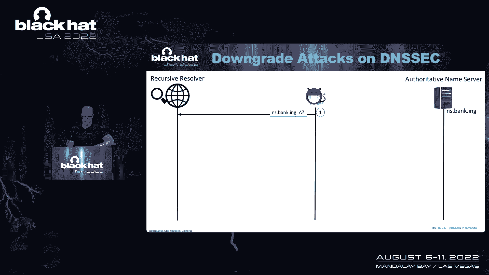
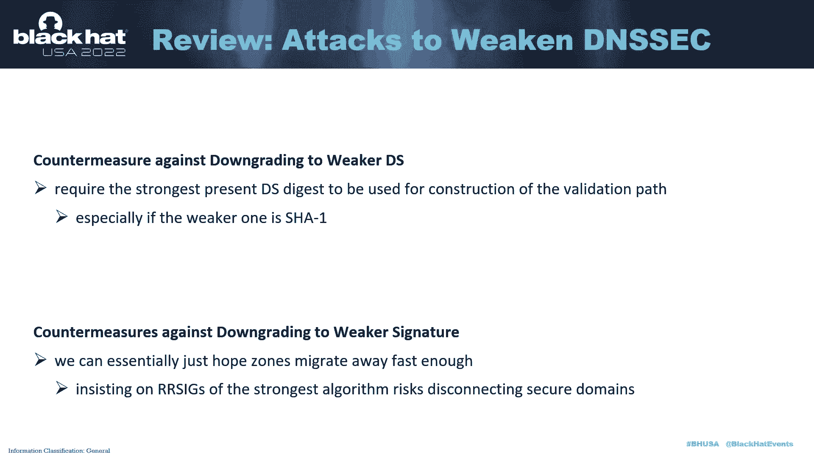
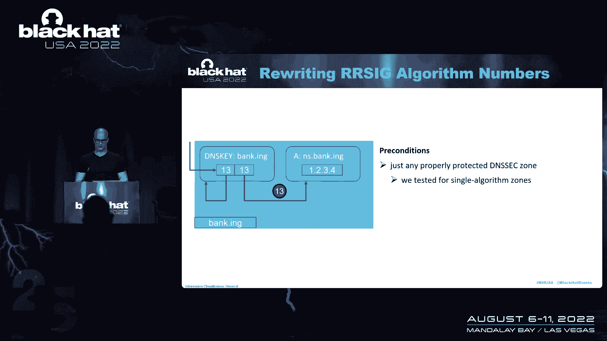
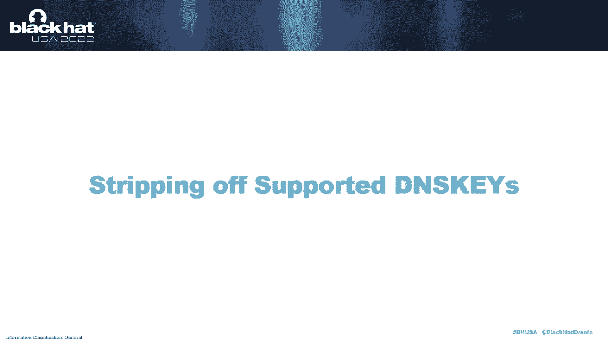
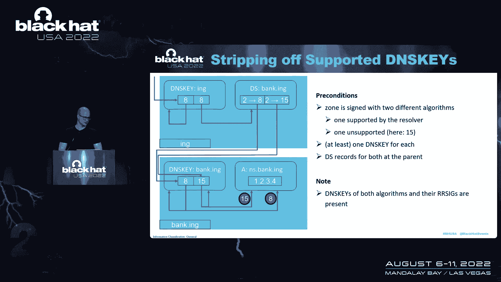
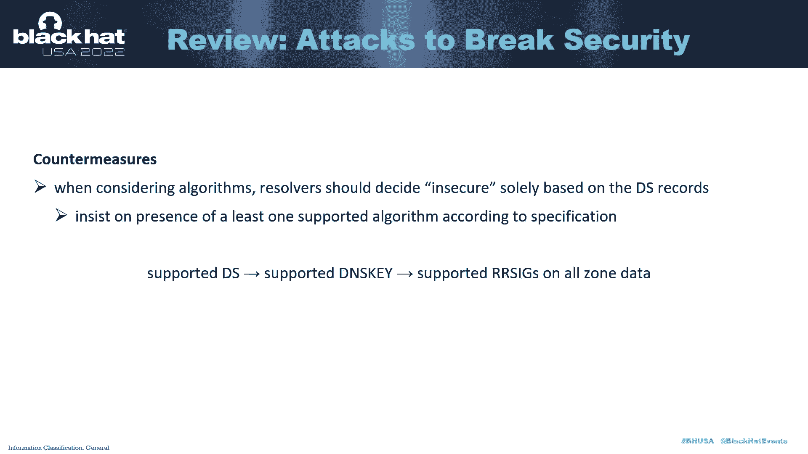

# 课程 P73：084 - DNSSEC 降级攻击 🔓

在本节课中，我们将学习 DNSSEC 降级攻击。DNSSEC 旨在为 DNS 记录提供安全性和真实性验证，但攻击者可能利用协议实现中的弱点，迫使解析器使用较弱的加密算法，甚至完全绕过安全验证。我们将探讨这些攻击的原理、具体机制以及防御建议。

---

## DNS 解析基础 🔍

上一节我们介绍了课程主题，本节中我们来看看 DNS 解析的基本流程。DNS 几乎参与了互联网上的所有事务，许多安全机制（如密码恢复）都依赖于它。

一个典型的 DNS 解析过程如下：
1.  用户应用程序发起域名查询。
2.  本地存根解析器（Stub Resolver）将查询转换为 DNS 请求。
3.  请求被发送到转发器（Forwarder）。
4.  转发器将请求发送给递归解析器（Recursive Resolver）。
5.  递归解析器从根域名服务器开始，层层查询，直到找到负责目标域名的权威名称服务器。
6.  权威名称服务器返回包含所需记录的答案。
7.  答案沿原路返回，最终交付给应用程序，并被各级解析器缓存。

## DNSSEC 简介 🛡️

上一节我们介绍了 DNS 解析流程，本节中我们来看看 DNSSEC 如何为这个过程提供安全保护。DNS 面临的最大威胁之一是缓存投毒攻击，即攻击者伪造 DNS 记录。DNSSEC 通过加密签名来保护 DNS 数据的来源和完整性（但不提供保密性）。

DNSSEC 的核心是建立一条从根域到目标域名的信任链。它使用几种关键记录类型：
*   **RRSIG 记录**：包含对特定记录集（相同域名、类型和类）的加密签名。
*   **DNSKEY 记录**：包含用于验证签名的公钥材料。
*   **DS 记录**：存储在父区域，包含子区域 DNSKEY 记录的哈希摘要，用于委托信任。

信任链的工作方式类似于公钥基础设施（PKI）。解析器从预配置的信任锚（如根域的 DNSKEY）开始，通过验证一系列 RRSIG 和 DS 记录，最终确认目标记录的真实性。

此外，DNSSEC 使用 NSEC/NSEC3 记录来提供“经过验证的不存在”响应，证明某个域名或记录类型确实不存在。

目前存在多种签名和摘要算法。一个粗略的经验法则是：**算法编号越高，通常越安全**。例如，SHA-1（摘要类型 1）已被认为不安全且被弃用，但仍在一些地方使用。

## 攻击者模型与攻击流程 ⚔️

上一节我们了解了 DNSSEC 如何工作，本节中我们来看看攻击者如何试图破坏它。我们假设攻击者位于递归解析器与权威名称服务器之间的路径上，可以读取、修改、复制、延迟或丢弃传输中的 DNS 消息，但无法破解密码学原语。攻击者可以触发解析器对特定域名进行查询。

以下是攻击的基本流程：
1.  **触发查询**：攻击者向递归解析器发送对目标域名权威名称服务器的查询。
2.  **拦截与篡改**：当真实的权威服务器返回应答时，攻击者拦截并篡改其中的记录（如 IP 地址）。
3.  **操纵 DNSSEC 记录**：攻击者同时拦截并篡改 DNSSEC 相关的 RRSIG、DNSKEY 或 DS 记录，根据具体的降级攻击机制进行修改。
4.  **缓存投毒**：如果递归解析器的验证逻辑存在漏洞，接受了被篡改的记录，则会将其存入缓存。
5.  **攻击完成**：此后，其他客户端向该解析器查询受害域名时，将收到攻击者设置的恶意记录。

## 第一类攻击：削弱安全性 📉

上一节概述了攻击流程，本节中我们深入第一类攻击：削弱安全性。这类攻击的目标是**诱使解析器使用信任链中最弱的加密算法**进行验证，从而利用弱算法的漏洞。

以下是两种具体的机制：

**1. 降级至较弱的摘要算法**
假设父区域中存在两条 DS 记录，分别对应强摘要算法（如 SHA-256）和弱摘要算法（如 SHA-1）。子区域有对应的 DNSKEY 记录。
*   **攻击**：攻击者伪造弱摘要算法对应的 DNSKEY 和签名，并**在应答中删除强摘要算法的 DS 记录**。
*   **结果**：许多解析器会回退到仅使用剩余的弱摘要算法路径进行验证，使得攻击得以成功。

**2. 降级至较弱的签名算法**
假设一个区域同时使用强签名算法（如 RSA/SHA-256）和弱签名算法（如 RSA/SHA-1）对数据进行签名。
*   **攻击**：攻击者**使强密钥的签名在传输中失效**（例如，篡改签名数据），但保留弱签名有效。
*   **结果**：尽管规范要求所有存在的算法都必须有效，但一些解析器为了支持算法轮转，可能会接受仅弱签名有效的状态，从而被攻击。

## 第二类攻击：破坏安全性 🚫

上一节我们看到了如何削弱安全性，本节中我们来看看更彻底的攻击：完全破坏安全性。这类攻击旨在**欺骗解析器将本应安全的记录标记为“不安全”**，从而完全绕过 DNSSEC 验证。

解析器对客户端的响应包含一个“Authenticated Data”标志。若验证成功，此标志被设置，记录被视为安全。若验证失败（如信任链断裂），此标志不被设置，记录被视为不安全。我们的攻击即操纵此状态。

以下是三种具体机制：

**1. 篡改签名算法编号**
*   **场景**：区域使用解析器支持的算法（如算法13）签名。
*   **攻击**：攻击者将 RRSIG 记录中的**签名算法号改为一个解析器不支持的数字**。
*   **结果**：信任链在最后一环断裂，解析器将记录标记为不安全。例如，Google Public DNS 曾受此影响。

**2. 剥离受支持的签名记录**
*   **场景**：区域用两种算法签名，一种受解析器支持（如算法8），一种不受支持（如算法15）。父区域有对应的 DS 记录。
*   **攻击**：攻击者从应答中**删除受支持算法（算法8）的所有 RRSIG 记录**，只留下不受支持算法的签名。
*   **结果**：解析器被迫尝试使用不受支持的算法验证，导致失败，从而将记录标记为不安全。Cloudflare 和 Google 的解析器曾受此影响。

**3. 剥离受支持的 DNSKEY 记录**
*   **场景**：区域存在两个 DNSKEY，分别对应受支持和不受支持的算法，且都有对应的 DS 记录和签名。
*   **攻击**：攻击者从应答中**删除受支持的 DNSKEY 记录及其所有签名**。
*   **结果**：解析器只能看到不受支持的密钥和签名，验证失败，记录被标记为不安全。一些 Windows Server DNS 和 OpenDNS 曾受此影响。

## 防御建议与总结 🛡️

上一节我们分析了多种攻击手段，本节中我们来看看如何防御。对策主要针对解析器运营商、开发者和区域运营商。

**对解析器运营商/开发者的建议：**
*   **坚持最强算法**：在存在多个 DS 记录时，应要求使用最强的摘要算法构建验证路径，防止降级到弱摘要（如 SHA-1）。
*   **基于 DS 记录判定安全性**：判断记录是否“安全”应**仅基于 DS 记录**。只要存在受支持的 DS 记录，解析器就应要求后续的 DNSKEY 和 RRSIG 记录也必须受支持，防止攻击者通过剥离记录来制造不安全状态。

**对区域运营商的建议：**
*   **尽快淘汰 SHA-1**：停止使用不安全的 SHA-1 算法。
*   **审慎添加算法**：添加更强的算法签名不会自动提升安全性，如果解析器不支持新算法，反而可能引入新的攻击面。迁移时应确保解析器支持度已足够高。

---

**本节课总结**
本节课我们一起学习了 DNSSEC 降级攻击。我们首先回顾了 DNS 解析和 DNSSEC 的基本原理，然后介绍了攻击者模型和通用攻击流程。我们详细分析了两大类攻击：**削弱安全性**的攻击（迫使使用弱算法）和**破坏安全性**的攻击（诱使解析器将安全记录标记为不安全）。最后，我们探讨了针对解析器和区域运营商的防御建议，核心在于坚持使用强算法并严格依据 DS 记录来决定验证逻辑。理解这些攻击有助于更好地部署和维护安全的 DNS 基础设施。