# 课程 P74：085 - 文件描述符中的魔鬼：是时候抓住它们了 🔍

在本课程中，我们将学习文件描述符相关的漏洞研究。我们将探讨文件描述符的基本概念，分析在文件描述符导出和导入操作中可能出现的风险条件，并了解如何发现、修复以及利用这些漏洞。

---

## 背景知识：什么是文件描述符？📁

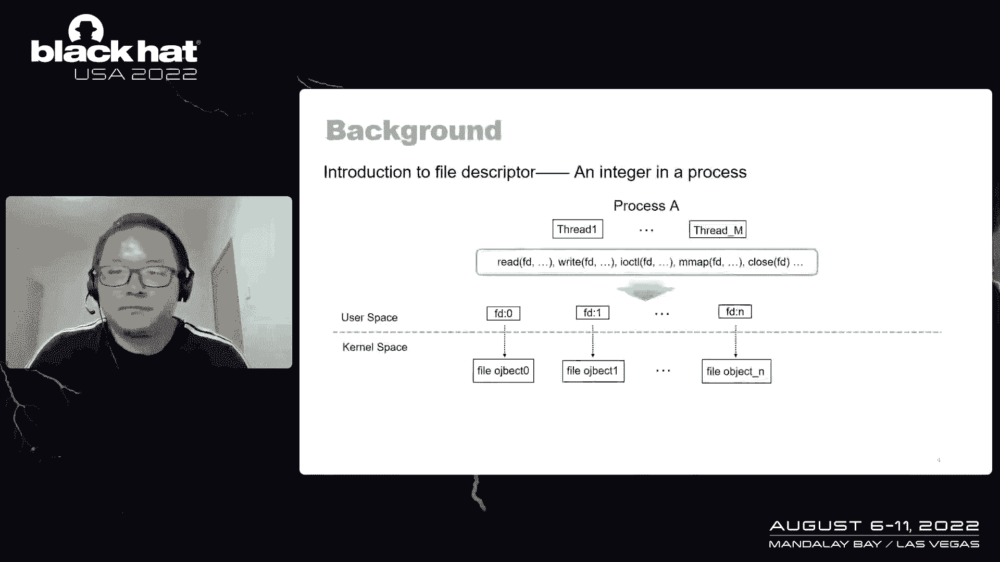

在Linux系统中，一切皆文件。文件描述符在Linux中几乎无处不在。

一个文件描述符是一个整数，用于标识进程中的一个已打开文件。一个进程中可能存在许多文件描述符，其值可以是0、1、2等。进程中的所有线程都可以通过类似 `read`、`write` 的系统调用来操作文件描述符。

通常，每个文件描述符在内核空间都与一个文件对象相关联。当我们在用户空间操作一个文件描述符时，内核空间内相关联的文件对象也会被相应地操作。

为了记录文件描述符与文件对象之间的映射关系，每个进程都创建了一个文件描述符数组。该数组是一个文件对象指针数组，其索引就是文件描述符。通过它，我们可以轻松知道哪个文件对象与特定的文件描述符相关联。

内核需要频繁处理文件对象与文件描述符之间的转换。一方面，内核需要将一个文件对象作为文件描述符导出给用户进程，以便用户进程可以对其进行读写操作。这种从文件对象到文件描述符的转换通过**文件描述符导出操作**完成。另一方面，内核需要导入文件描述符，以找到相关联的文件对象，以便在系统调用中进行进一步操作。这种从文件描述符到文件对象的转换通过**文件描述符导入操作**完成。

文件描述符的导出和导入操作是内核中非常常见和基础的操作。

---

## 文件描述符导出操作详解 🚀

上一节我们介绍了文件描述符的基本概念，本节中我们来看看文件描述符的导出操作。

内核中的文件描述符导出操作分为三个步骤。例如，这里有一个文件对象 X，我们想将其导出为一个文件描述符。

以下是文件描述符导出操作的步骤：

1.  **获取并使用文件描述符**：获取一个可用的文件描述符，例如 X。
2.  **设置文件描述符数组**：确保文件描述符数组中，以该文件描述符为索引的元素指向目标文件对象。
3.  **将文件描述符传递给用户进程**：将文件描述符的值返回给用户空间。

完成这三个步骤后，文件描述符导出操作就完成了，用户进程就可以对该文件描述符进行读写操作。

---

## 文件描述符导入操作详解 🔄

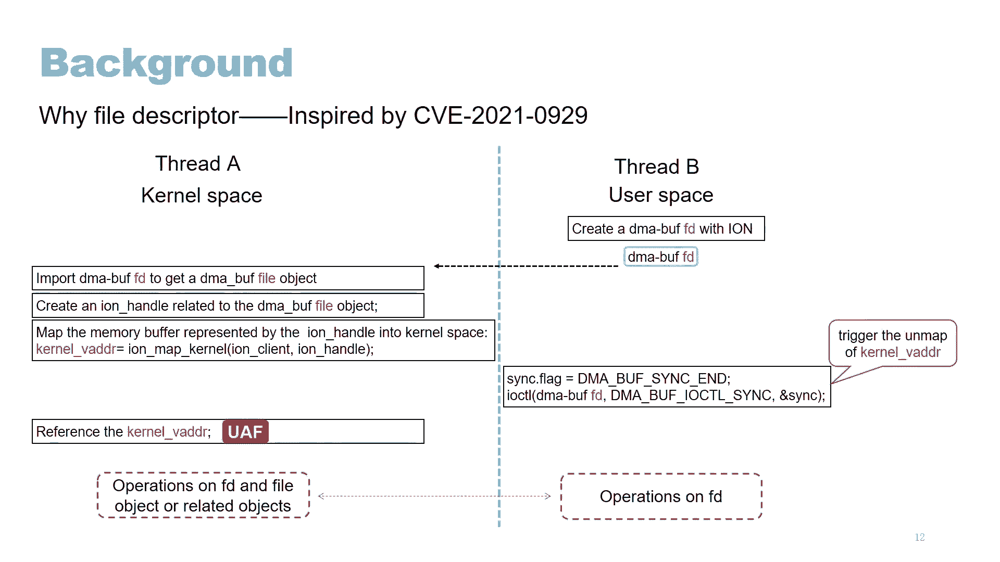

了解了导出操作后，我们再来看看与之对应的导入操作。

内核中的文件描述符导入操作分为两个步骤。例如，这里有一个文件描述符 X，我们想导入它。

以下是文件描述符导入操作的步骤：

1.  **查找文件描述符数组以获取文件对象**：根据文件描述符的值，在文件描述符数组中找到对应的文件对象指针。
2.  **获取文件引用**：增加该文件对象的引用计数，确保在操作期间它不会被释放。

完成这两个步骤后，文件描述符导入操作就完成了，内核就可以操作该文件对象了。

---

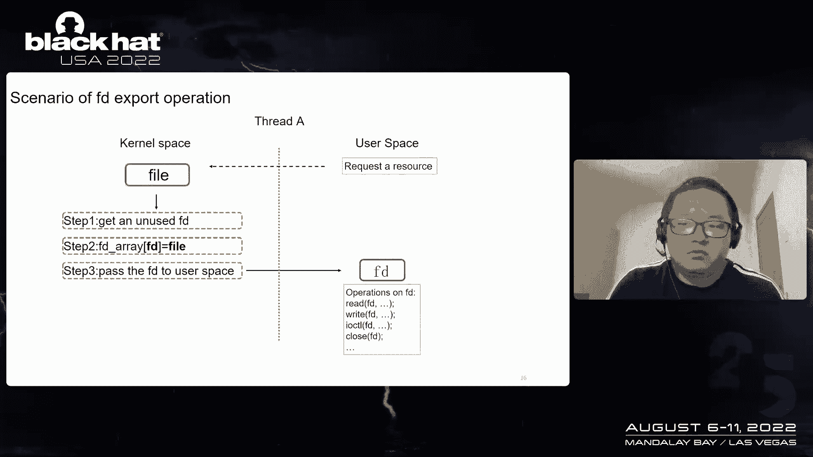

## 总结与相关操作

让我们总结一下。文件描述符导出操作分三步完成：获取并使用文件描述符、设置文件描述符数组、将文件描述符传递给用户空间。文件描述符导入操作分两步完成：查找文件描述符数组以找到文件对象、获取文件引用。

我们还需要了解另一个与文件描述符相关的操作：**关闭文件描述符**。当我们关闭一个文件描述符时，文件描述符数组中以其为索引的元素将被设置为空（NULL），然后相关联的文件对象的引用计数会被减少。如果引用计数降为零，文件对象将被释放，该文件描述符将变为未使用状态。

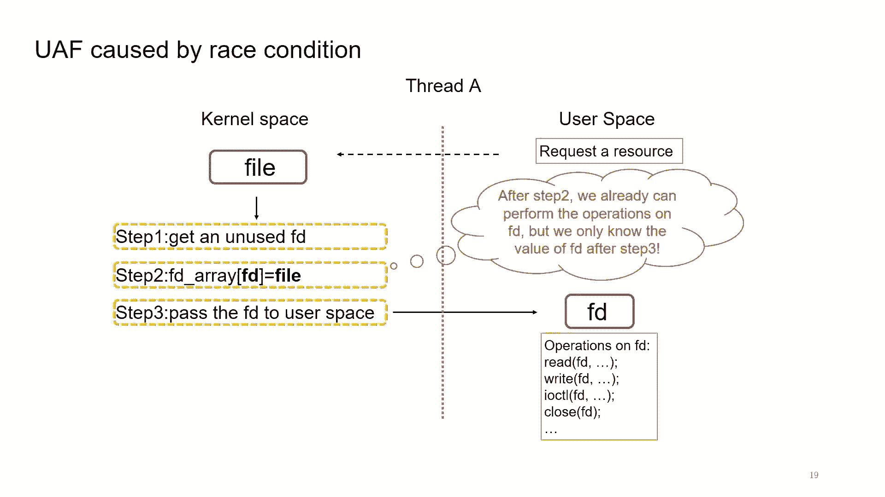

---

## 研究动机：为什么研究文件描述符？💡

这项研究灵感来源于去年发现的一个漏洞，即 CVE-2021-0929。该漏洞揭示了一个重要线索：文件描述符可以在内核空间和用户空间之间共享。因此，内核操作和用户操作之间可能发生风险条件。

以下是两种可以想到的风险条件：

*   **风险条件一**：线程A在内核空间操作文件对象，同时线程B在用户空间操作文件描述符。
*   **风险条件二**：线程A在内核空间操作文件描述符，同时线程B也在用户空间操作文件描述符。

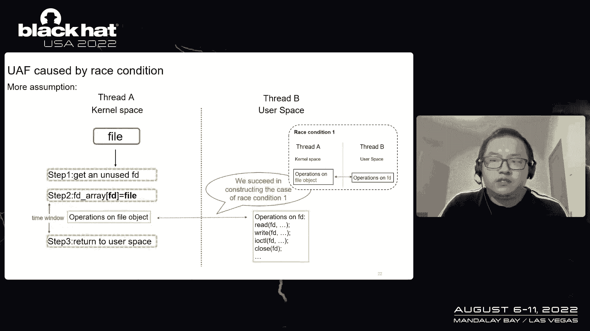

我开始思考，在这些风险条件下，文件描述符的导出和导入操作中可能存在更多问题。因此，我应该尝试在这些操作中构造此类风险条件。

---

## 文件描述符导出操作中的问题 🕳️

上一节我们讨论了研究动机，本节我们将深入探讨文件描述符导出操作中的问题。本节将讨论四个部分：文件描述符导出操作的常见场景、由风险条件引起的释放后使用问题、以及如何发现和修复这些问题。

首先，让我们看看文件描述符导出操作的常见场景。由于用户进程通常会通过打开文件来请求某种资源，内核会创建一个代表该资源的文件对象。这个文件对象将通过前面提到的文件描述符导出操作被导出为一个文件描述符。用户进程获知文件描述符的值后，将通过系统调用对文件描述符执行操作。

这是一个典型的例子。如你所见，系统调用 `open` 的实现就是我们正在讨论的场景。创建一个文件对象，然后通过文件描述符导出操作将该文件对象作为文件描述符导出给用户进程。

但这种常规的文件描述符导出操作是顺序执行的，这离我们想要讨论的风险条件还很远。因此，让我们回顾一下这个场景，以确保我们没有遗漏什么。

我们知道文件描述符导出操作分三步完成。实际上，在第二步完成后，我们就已经具备了在文件描述符上执行操作的能力，因为此时文件描述符已经与一个有效的文件对象关联。然而，我们只能在第三步之后才能对文件描述符执行操作，因为我们在第三步之后才知道文件描述符的值。

但是，我们是否必须等待文件描述符从内核传递出来才能知道它的值呢？答案是否定的，因为文件描述符是可预测的。

我们可以提前知道下一个文件描述符的值。首先，对于一个新进程，文件描述符是按升序分配的。文件描述符0、1、2通常已被占用，那么3将是下一个从内核导出的文件描述符，然后是4、5、6，依此类推。其次，文件描述符在关闭后会被重用。

既然我们可以提前知道文件描述符的值，我们就可以将常规的文件描述符导出操作场景改为并行场景。

假设有两个线程。线程A执行文件描述符导出操作的三个步骤。线程B在第二步完成后立即对文件描述符执行操作。我们可以看到，在文件描述符导出操作的第二步和第三步之间存在一个时间窗口。因此，如果在这个时间窗口内对文件对象进行某些操作，我们就能成功构造出风险条件一的案例。

如你所见，线程A正在对文件对象执行操作，而线程B正在对文件描述符执行操作。在这种情况下，我们可以构造一个潜在的释放后使用案例。线程B可以在线程A完成第二步后立即关闭文件描述符。关闭文件描述符将触发文件对象及其相关对象的释放。之后，当线程A操作文件对象时，就会发生释放后使用。

然而，这个释放后使用场景目前仅基于我们的假设。我们仍然不知道现实世界中是否存在任何实际案例。因此，我开始在现实世界中搜索此类问题。

为了彻底搜索这些问题，我查找了所有执行文件描述符导出操作第二步的内核API。以下是我找到的API。`fd_install` 是我们在内核中最常见的API，还有许多其他API封装了 `fd_install`。

基于这些内核API，我在一些供应商的内核中搜索了有问题的代码模式。我很快在两个供应商的内核中找到了两种典型的有问题代码模式。如你所见，文件或相关对象在文件描述符导出操作的第二步之后被引用。这恰恰证明了我们的假设是正确的。

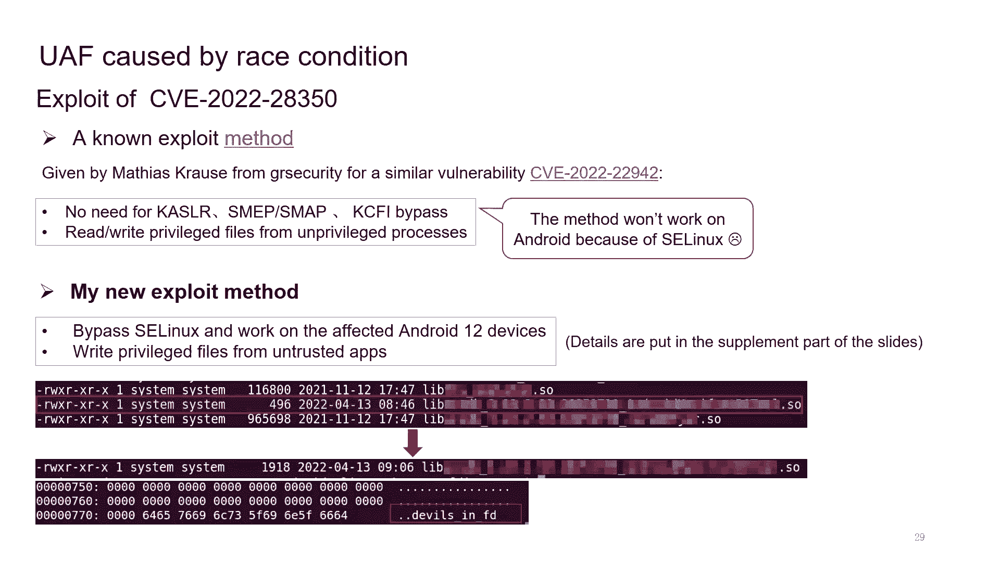

于是我花时间在许多内核中搜索这种有问题的模式。最终，我发现了相当多具有此模式的问题。事实证明，这种有问题的模式既存在于供应商内核中，也存在于Linux主流内核中。

从这些漏洞中，我们可以总结出一些有趣的事实。首先，使用DMA缓冲区更容易引入此类问题。这是合理的，因为DMA缓冲区组件设计用于在多个设备驱动程序和子系统之间共享缓冲区，因此它将DMA缓冲区对象作为文件描述符导出到用户空间以实现共享目的。但不幸的是，许多驱动程序没有妥善处理文件描述符导出操作，导致了释放后使用问题。

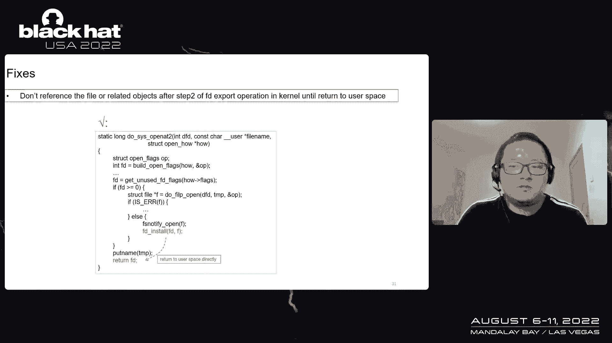

其次，我发现GPU驱动程序似乎更容易引入此类问题。于是我开始在许多GPU驱动程序中搜索这种有问题的模式。最终，我在ARM Mali GPU驱动程序中发现了两个漏洞。事情变得更有趣了，因为许多Android设备使用Mali驱动程序，并且Mali驱动程序可以被Android上的非受信任应用程序访问。

让我们看看漏洞 CVE-2022-23449，这是我在Mali驱动程序中发现的N-day漏洞。它影响Mali驱动程序的某些旧版本。一些Android 10设备或供应商仍在使用旧版本的Mali驱动程序，因此它们受到该漏洞的影响。

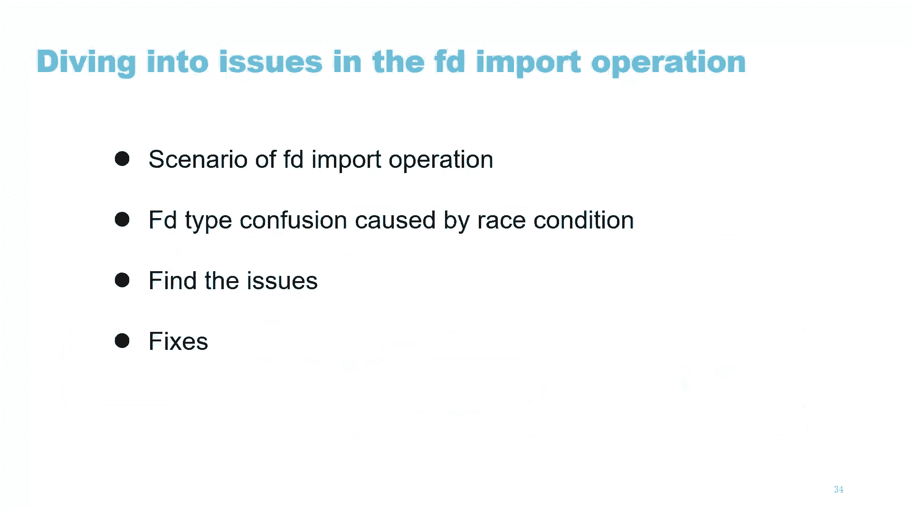

漏洞 CVE-2022-23450 是我在Mali驱动程序中发现的真正的零日漏洞。它存在于某个版本的Mali驱动程序中，一些Android 12设备或供应商受到影响。目前，该漏洞已被修复。我还针对此漏洞编写了利用程序。

实际上，在我的利用方法之前，G.R. Security的Matthias Cross已经为类似的漏洞提供了一种已知的利用方法。使用这种方法，我们可以从未授权进程中完成对特权文件的读写，而无需担心KASLR、SMAP或CFI等缓解措施。然而，由于SELinux，这种方法在Android上不起作用。

为了在受影响的Android设备上利用此漏洞，我想出了一种新方法，使我能够从未受信任的应用程序成功写入特权文件。这里有一个概念验证。在这个概念验证中，我成功从一个非受信任的应用程序写入了一个特权共享库。由于时间有限，利用的细节放在幻灯片的补充部分。

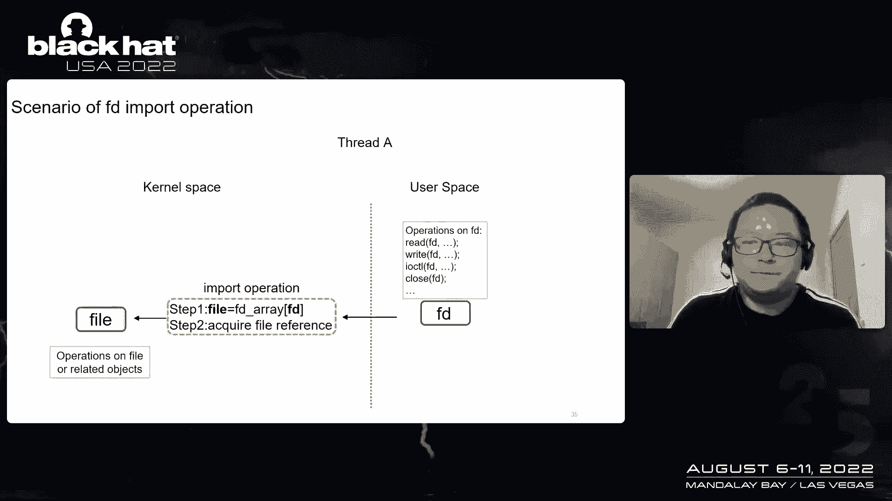

为了发现由文件描述符导出操作中的风险条件引起的释放后使用问题，我们只需要检查在列出的函数之后是否引用了文件或相关对象。这可以通过像CodeQL这样的工具更有效地完成。

针对此类问题有两种修复方法。第一种方法很明显，即在内核中，在文件描述符导出操作的第二步之后，直到写入用户空间之前，不要引用文件或相关对象。这是一个例子，是系统调用 `open` 实现的一部分。如你所见，在安装文件描述符后，没有引用文件对象，而是直接将文件描述符返回给用户空间。

第二种修复方法是使用锁保护来引用文件或相关对象，并在文件描述符的释放函数中共享相同的锁。如你所见，如果我们在两段代码中共享同一个互斥锁，风险条件就永远不会成功，因此释放后使用不会发生。这是来自供应商S的一个实际例子。

---

## 文件描述符导入操作中的问题 🌀

上一节我们探讨了导出操作中的问题，本节中我们来看看文件描述符导入操作中的问题。本节将讨论四个部分：文件描述符导入操作的场景、由风险条件引起的文件描述符类型混淆，以及如何发现和修复这些问题。

让我们看看文件描述符导入操作的常见场景。当用户进程通过 `read`、`write` 等系统调用对文件描述符执行操作时，文件描述符将被传递到内核空间。内核将通过文件描述符导入操作获取相关联的文件对象。之后，内核将操作该文件对象以完成后续工作。

这是一个场景示例，即系统调用 `write` 的实现。如你所见，文件描述符导入操作在函数 `fdget_pos` 中执行，然后获取文件对象并将其传递给 `vfs_write` 以进行进一步操作。

但这种常规的文件描述符导入操作是顺序执行的，这离我们想要看到的风险条件还很远。因此，我开始研究内核中各种文件描述符导入操作的场景，并参考了所有列出的用于文件描述符导入操作的内核API。最终，我发现了一些非常有趣的问题。

让我们来看看它们。第一个是 CVE-2022-2172，我在某供应商内核中发现的。如你所见，这个函数将创建一个特定的DMA缓冲区文件描述符，然后导入该文件描述符以获取DMA缓冲区对象。之后，该DMA缓冲区对象的私有字段将被引用为一个 `kgsl_map_object` 以供后续使用。该函数中的三个步骤很简单。在顺序执行中，这通常是安全的。但如果涉及风险条件呢？

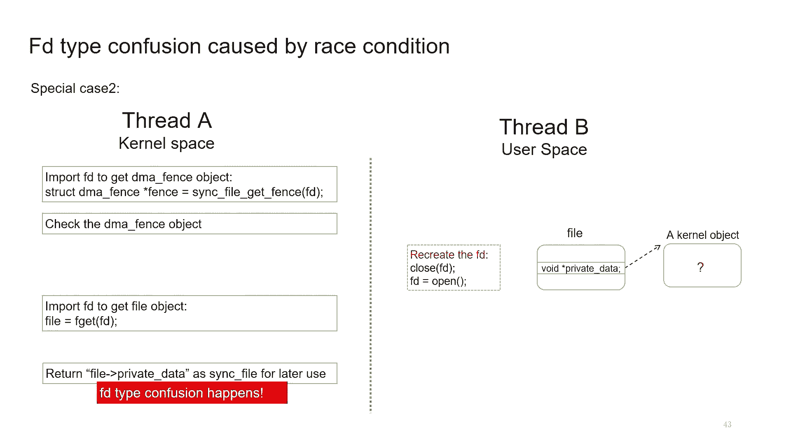

我发现，如果我们将风险条件应用到这种情况中，就会发生一些有趣的事情。详情如下。如你所见，线程A将执行该函数的三个步骤。它将在第一步创建一个特定的DMA缓冲区文件描述符。在此之后，线程B关闭该文件描述符并创建一个不同的DMA缓冲区文件描述符。这将使线程A中的文件描述符变成一个完全不同的文件描述符。结果，当线程A导入DMA缓冲区文件描述符时，它将得到一个完全不同的DMA缓冲区对象。但线程A仍然将该DMA缓冲区的私有字段视为 `kgsl_map_object`。这将导致类型混淆问题。

第二个问题是这样的。有一个从用户空间传递来的同步文件描述符。该函数第一次导入该文件描述符以获取DMA围栏对象。它会检查DMA围栏对象以确保其有效。然后，该函数第二次导入该文件描述符。文件对象的私有数据作为同步文件对象返回以供后续使用。该函数中的四个步骤很简单。在顺序执行中，这通常是安全的。但我发现，如果我们将风险条件应用到这种情况中，也会发生一些有趣的事情。详情如下。如你所见，线程A将执行该函数的四个步骤。它将第一次导入文件描述符以获取DMA围栏对象。它会检查DMA围栏对象以确保其有效。在此之后，线程B关闭该文件描述符并创建一个不同的文件描述符。这将使线程A中的文件描述符变成一个完全不同的文件描述符。结果，当线程A第二次导入文件描述符时，它将得到一个完全不同的文件对象。但线程A仍然将文件对象的私有数据视为同步文件对象。这也会导致类型混淆问题。

这两个特殊问题代表了文件描述符导入操作场景中的两种问题类型。

第一种类型是 **“创建即导入”型文件描述符**。该类型的模式如下：
1.  创建一个特定类型的文件描述符。
2.  导入该文件描述符以获取特定类型的文件对象。
3.  引用文件对象的私有数据或其他相关的私有对象。

由于存在时间窗口，文件描述符可以被重新创建。

第二种类型是 **“双重导入”型文件描述符**。该类型的模式如下：
1.  第一次导入文件描述符以获取文件对象A，该对象被用于目的A。
2.  内核再次导入文件描述符以获取文件对象B，该对象被用于目的B。

由于两次文件描述符导入操作之间存在时间窗口，文件描述符可以被重新创建。

这两种类型的问题都可能导致文件描述符类型混淆。然而，仍然有两个问题需要回答：是否存在更多此类问题，以及如何更有效地发现这些问题。

实际上，通过模糊测试来发现此类问题可能很困难。因为有时有问题的代码隐藏在内核中，用户进程几乎无法察觉。而且，风险窗口可能非常小。因此我在想，也许我们可以通过一些检测代码在编译时检测此类问题。

这是一个文件描述符的常规生命周期。如你所见，文件描述符的初始状态是“未使用”。当文件描述符通过 `fd_install` 与一个文件对象关联时，状态将变为“已创建”。当文件描述符被返回给用户空间时，状态将从“已创建”变为“用户持有”。当用户进程通过系统调用操作文件描述符时，内核会导入它，状态将从“用户持有”变为“首次使用”。当系统调用返回时，状态将从“首次使用”变回“用户持有”。

文件描述符导入操作场景中的两种问题类型可以在文件描述符的生命周期中清晰地定位。“创建即导入”型问题可能发生在文件描述符状态从“已创建”变为“首次使用”时。“双重导入”型问题可能发生在文件描述符状态从“首次使用”变为“二次使用”时。

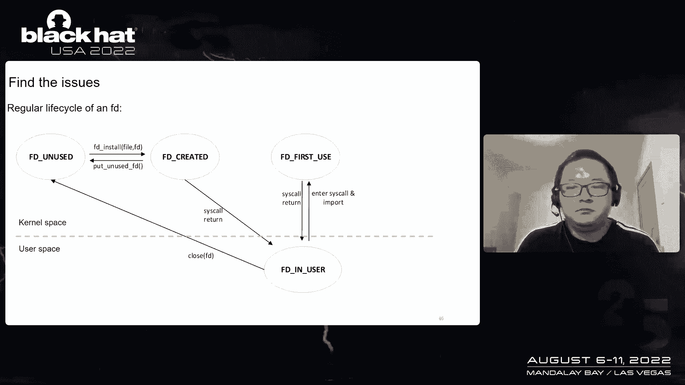

实际上，检测代码的实现非常简单。只需要在少数内核API（如 `fd_install`、`fdget` 等）中添加一些代码即可。我已经将检测代码放在了GitHub上。

以下是我通过检测工具和代码审计发现的问题。似乎在供应商内核的文件描述符导入操作场景中存在相当多的问题。

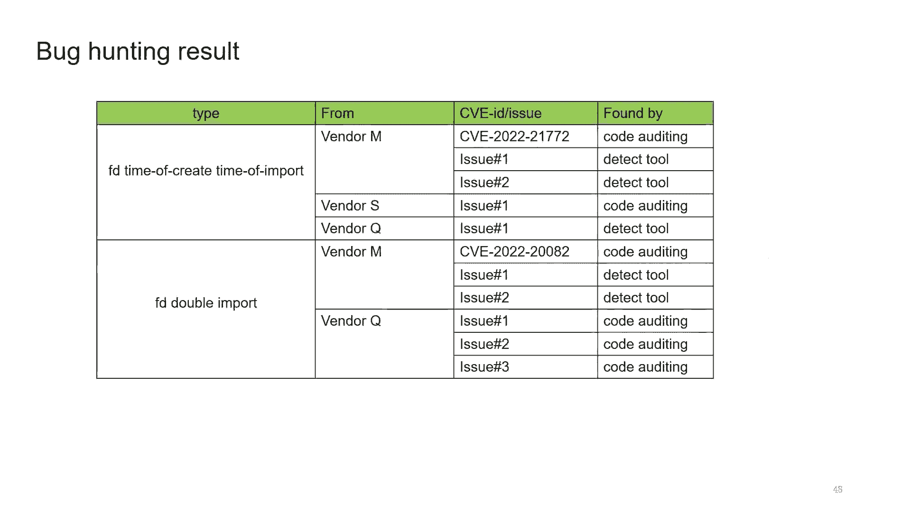

对于“创建即导入”型问题的修复是显而易见的。内核应该直接为用户创建一个特定的文件对象，而不是先创建一个文件描述符再导入它。

对于“双重导入”型问题的修复也是显而易见的。内核应该只导入文件描述符一次以获取文件对象，所有后续代码都应直接处理这个文件对象。多次导入同一个文件描述符从来都不是一个好主意。

---

## 总结与未来工作 🎯

本节课中我们一起学习了文件描述符相关的漏洞。在本讲座中，我讨论了由内核中文件描述符导出操作的风险条件引起的典型释放后使用问题。

因此，我们可能需要问自己一个非常明显的问题：是否存在其他类似文件描述符的资源，它们也是可预测的，并且在内核中有导出操作？答案是肯定的。

我发现IDR是这种类型的一个非常典型的资源。它是可预测的，并且可以在内核中对其执行导出操作。它被广泛用作内核驱动程序中的句柄ID、会话ID或对象ID等。因此，未来的工作方向是：我们可以尝试在IDR或其他自定义实现的索引中找到类似的释放后使用问题。

我还讨论了由文件描述符导入操作中的风险条件引起的文件描述符类型混淆问题。这里也有一个非常明显的问题：是否存在其他类似文件描述符的资源，可以在内核中对它们执行类似的导入操作？答案是肯定的。

有许多资源可以在内核中执行类似的导入操作，例如IDR、进程PID、用户虚拟地址等。因此，我们可以尝试在这些资源中找到类似的问题。

感谢我的同事们帮助我完成幻灯片，他们提出了很好的建议。实际上，我非常想谈谈我对 CVE-2022-23450 的利用方法，但由于时间限制，我将所有利用细节放在了补充部分。同时，我已经证明，即使风险窗口非常小，我所研究的问题也是可利用的。将这些问题转化为内存破坏以进行利用的细节也放在了补充部分，如果你感兴趣的话可以查看。

---

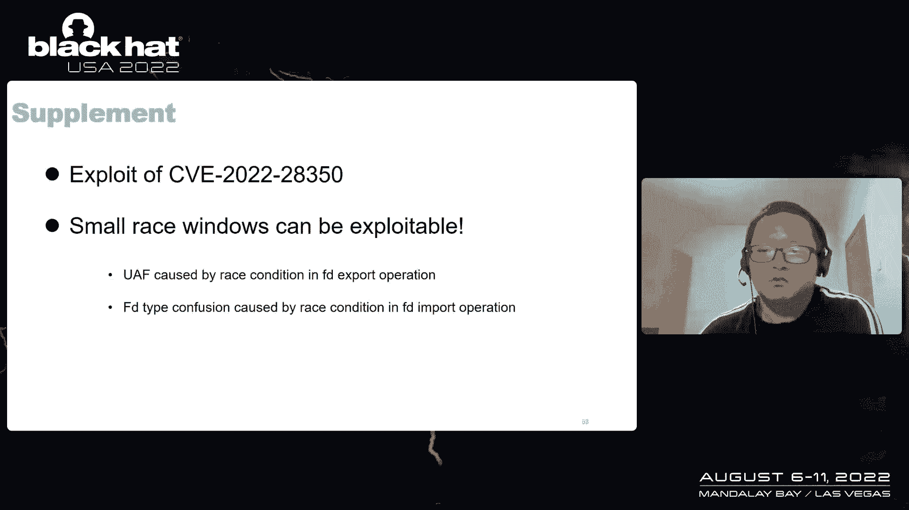

本节课中，我们一起学习了文件描述符的基本概念、导出和导入操作中的风险条件、由此引发的释放后使用和类型混淆漏洞、以及发现和修复这些漏洞的方法。理解这些底层机制对于系统安全至关重要。