# P75：086 - Dive Into Apple IO80211Family Vol. 2 - 坤坤武特 - BV1WK41167dt

嗨你好，每个人，呃欢迎参加我的演讲，嗯今天，我的主题与苹果的WiFi Subsi有关，模糊与内核漏洞研究，标题是潜入苹果，八点零到十一点取样卷二，嗯，我叫王宇，来自如此小的科技和企业数据安全公司，嗯。

我可以通过这个电子邮件地址联系到，今天的演讲，呃可以看作是我黑帽子的第二部分，2020年美国话题，嗯，可以在这里找到，如果你以前没有听说过这个话题，别担心，我将首先介绍子系统，然后快速地完成前面的工作。

首先是WiFi子系统，让我们回到两年前，一月的一天，我发现了一件有趣的事，一个叫飞机场的司机从系统中消失了，但随着研究的深入，我发现从iOS13和Mac OS 10。15开始，卡塔琳娜苹果反映了。

呃8个0到11个WiFi客户端分机，并将新一代更名为家庭版2网络架构背后，反映，我想呃，这是一个概念的改变，目标之一是从基本的网络通信能力升级，支持所有类型的苹果设备之间的可信隐私共享，这里有一个简报。

呃，从用户模式框架到家庭扩展的架构图，插件，和低级扩展，我们可以看到版本一和版本二之间的变化，比如说，这里嗯，再也没有机场了，呃，Broadcom系列扩展，我们仍然是研究人员，所以两年前，呃。

我的工作还包括早期的，呃，供资框架，的单个代码覆盖率分析，并得出了一个内核地址，并有解决方案，由于工作的结果，我发现的内核漏洞可以分为几种类型，就像脆弱性只影响V第一种也是唯一的第二种方式。

V1和V2都是，在特定情况下，我已经详细宣布了一些漏洞，但其他我不能透露的，因为它们以前没有修理过，黑色有美国，这些漏洞存在于上述组件中的各个组件中，比如说，呃，二十二十，九十八，三十二岁在家庭扩展中。

而九十八三在底层驱动程序中，两年过去了，让我们回到，呃，二十二，呃，以前的所有漏洞都已修复，操作系统的整体安全性得到了提高，Mac是扬声器Moi Ventura已经发布，苹果硅的时代已经到来。

但我还有很多问题，比如呃，第二版中的家庭又被反映出来了，名字又改回了IO一个零到十一的家庭，那么这背后发生了什么，以及如何识别新的攻击面，安全工程还有什么可以改进的，最重要的是。

你还能找到一个新的高质量内核漏洞吗，嗯是的，请允许我快速回答这些问题，变化是唯一一致的，领域知识是非常重要的，为了安全工程诚实，可以改进的地方太多了，对于一个能力狩猎，我不得不说，呃是的，绝对的。

所以我们开始了，新一代融资框架的改进从攻击面识别开始，我的第一个要求其实很简单，我想在发送和接收数据时更改网络的各种设置，呃那么呃，这样的接口，呃至少应该包括嗯对我来说，至少包括传统的BSD。

i o控制ik连接调用方法，uh系列和六个控制接口包的发送和接收，和网络设置面，至于网络接口本身，我们将在下面的幻灯片中参考它们，顺便说一句，一个有趣的话题是，我们应该尝试快速高级和低级接口，同时。

两年前我有一个很好的案子，为了为了为了这个，呃，Mac OS蓝牙嗡嗡声，我可以调用蓝牙框架提供的接口，但是直接与内核对话，意味着我可以绕过用户模式的检查和限制，嗯，我的意思是，发送呃。

原始数据直接到固件，嗯，这里我列出了一些最新的案例，苹果的官方GitHub上没有x nu 820分店，但重要的是，呃，在树枝上我们可以看到新的，呃，比如说，连接，IO控制接口。

苹果也有一个名为Nexus的模块，此外，二八分支包含了很多Skyworks的生存源代码，比如呃，这里，此控件注册，所以我们可以，基于这个领域的知识扩展我们的战斗框架。

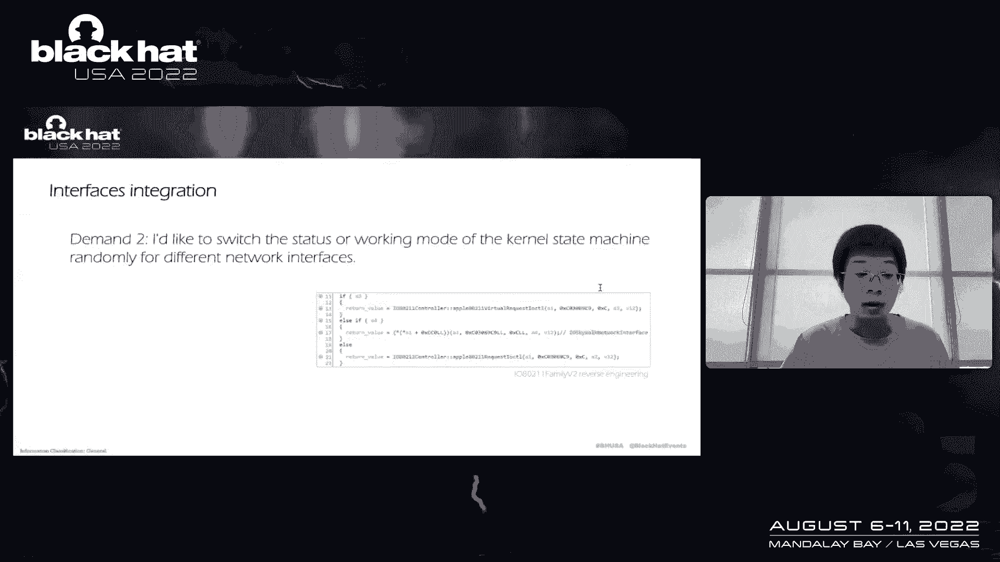

需求二是关于接口集成，我想呃，为不同的网络接口随机切换内核状态机的状态或工作模式，逆向工程表明大量的，大量的界面火花，不同的子系统或状态，同时，这也导致了下一个需求，我需要找出并跟踪哪些接口被触发。

并公布代码覆盖率，呃，但我真的不想让内核慢下来，所以内核在我的书中基于，解决方案是可以接受的，我可以接受，在这个阶段，系统中有一些默认接口，嗯，你有模糊程序吗，以前和他们谈过，如果答案是否定的，2。

我想该是有归宿的时候了，嗯，比如说，呃，不是零，是最常见的一种，一个p one，呃AP在点的简称，啊啊，d是苹果的简称，无线直接链路，他们都是我们的目标，下一部分是关于X NU测试用例，呃。

可以在这里展示，我列出了他们中的一些人，比如网络代理，嗯，如果您以前没有读过这个测试用例，我强烈建议你这样做，因为它们包含潜在的攻击服务，到目前为止，新一代苹果。

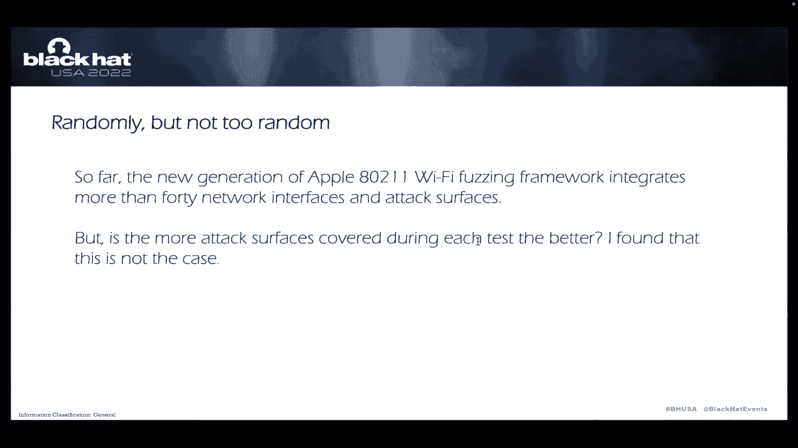

嗯八零到十一战斗框架，集成了四十多个网络接口和类型曲面，我想提到的一件事是，在每一次攻击中覆盖的攻击面越多，呃，每个任务，越好，嗯，我发现事实并非如此，呃，当他们，呃，要求随机参数，结果不如预期。

一号潜水艇，用于类型曲面和领域知识，我们需要通过学习一个新的源代码来积累尽可能多的知识，文档和测试用例，但在我们建造了更远的，呃每一轮，我想我们应该随机选择两个或三个接口单元，并尽可能充分地测试它们。

下一部分与内核调试有关，有时我们不得不依靠，远程内核调试器的强大功能，调试器，因为提供的信息，在Panog中通常无助于找到根本原因，变量值有时需要动态分析。

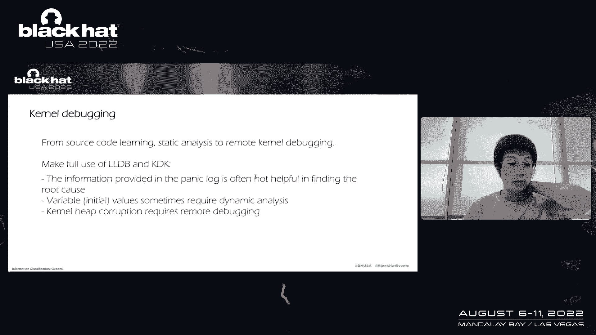

是啊，是啊，这是一个漏洞，我上周在苹果硅上发现，我是二，呃，马科斯·武拉，帐单号码是，呃，呃，二十二，五，三，十一。

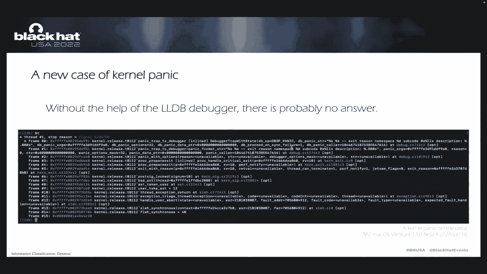

呃，这是内存损坏，呃问题嗯，我有一张更详细的照片，但是盔甲说明，但没关系，盔甲说明书，这里的成本实际上没有有价值的信息，没有LDB调试器的帮助。

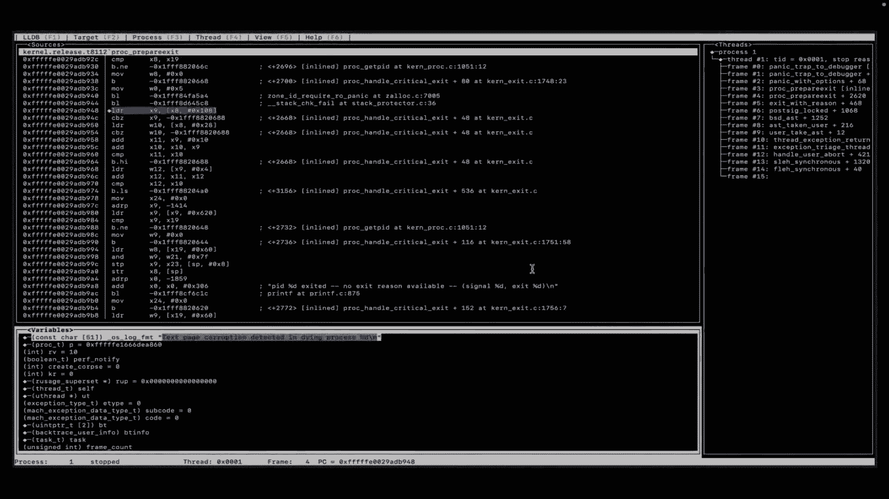

可能没有答案，但是在苹果硅平台上，我们缺乏官方支持，pdk文件上说，Apple Silicon不支持活动内核调试，嗯，我们不能设置断点，呃继续代码执行，这意味着跳过代码。

这意味着我们需要第三方调试解决方案的帮助，像朝日Linux。

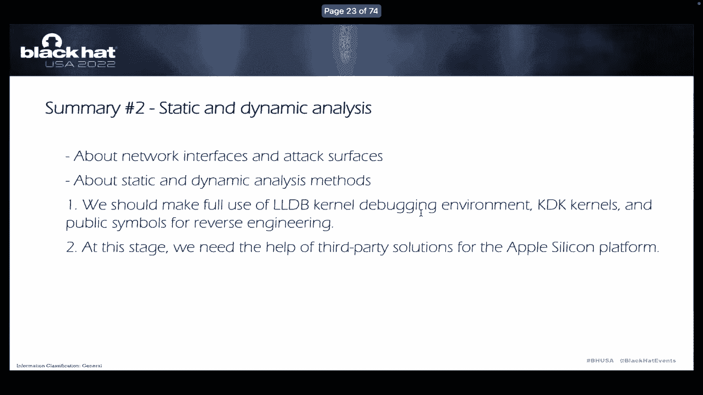

所以这里是第二部分的总结，嗯是的，我们需要呃的帮助，苹果系统平台的第三方解决方案，而恐慌的画面是一个典型的腐败案例，所以我们需要我们，我们还需要内核地址和类型，呃，我们甚至需要实施呃。

汽车等动态监控解决方案，呃，第三方封闭源代码内核扩展的特点，我想讨论的另一件事是，我们得做一些修复，因为有时建筑之旅或内核KKS不太好用，这是一个呃，我遇到的问题之一。

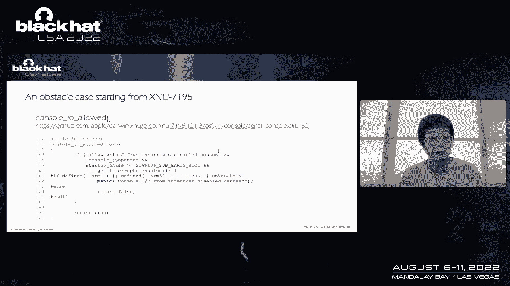

x u 71，九十五，一个叫做控制台的函数，内核中引入了i o警报，嗯，这是呃，这个铁杆，呃，函数将检查系统是否发出控制台，i，o，万一呃，Windows平台上禁用中断。

这种蓝屏死亡可以归类为IO IO QL错误，因为我们无法访问调度级别的可老化数据，然而，建造汽车和内核总是会发出这样的我，o，请求，这样我们就不能使用内核调试器了，没有人在互联网上抱怨这样的问题。

呃我也是，所以看起来我们都默默地修好了这种盒子，四年前，我开源了一个名为Kima的Mac OS项目，我使用引擎中的内核来实现简单的，呃汽车和代码覆盖分析解决方案。

这一次我把kon、内核和引擎分成了苹果平台，在化疗的帮助下，我相信我们可以做得更多，这是第三部分的总结，嗯是的，有时我们必须做修复，因为建筑内核或游客不太好用，我想提到的最后一部分是，呃，呃，呃。

本节是关于苹果SDK构建的，和第三方工具，苹果SDK包含许多信息用途，比如WiFi，相关文件和数据结构，嗯，这将节省大量的逆向工程时间，呃，此外，Mac OS操作系统中内置了许多有趣的命令行工具。

比如机场，空中控制，呃，你知道的，他们都是，呃，潜在目标，顺便说一句，WiFi开发者社区一直在维护界面和功能列表，我认为我们应该为社区的最新变化做出贡献，上次我们有时间的时候，我我颠倒了界面。

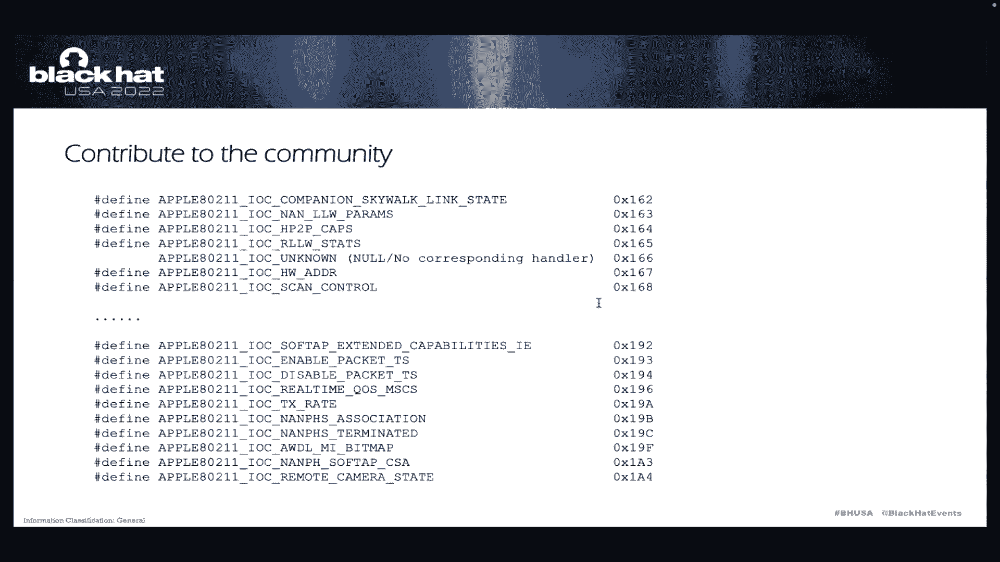

就像这个是天行者链接状态，而这一次，比如说，一个呃一个四个遥控摄像头的状态是最新的变化，是啊，是啊，到目前为止我们有，呃讨论了四个接受，嗯，关于网络接口和文本表面，关于静态分析，呃，静动力分析方法。

创建工具和，剩下的，如果我们把一切都放在一起，我们将获得构建新一代WiFi FU的路线图。

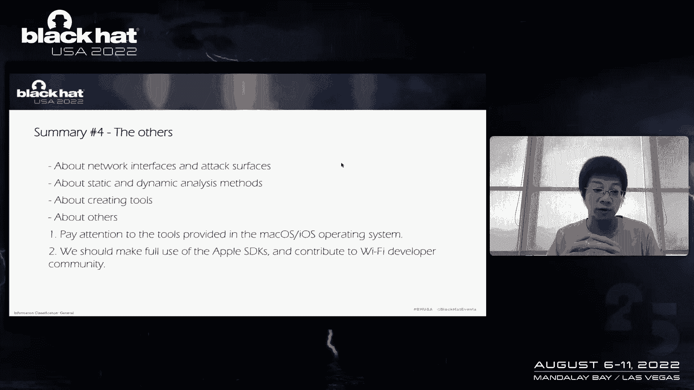

这是系统的整体架构，从用户模式到内核模式，从高级接口到低级接口和攻击面，从目标到主机，是啊，是啊，这是一个，这是一个，这是一幅大画面，是啊，是啊，我有一个短视频，我会告诉你它是怎么工作的，是啊，是啊。

这就是我们所做的，嗯，在左边，它是，这是一个目标机器，右边是主机，它们由一只太阳鸟连接在一起，三个，呃是网络适配器，的，和，呃，的，操作系统版本是Mac OS Ventura，呃，帐单号码是，二十二。

一个五，311 f，呃，我做这个视频的时候最新的一个，嗯然后让我，内核崩溃了，立即，和对调试器的中断，CPU疯狂，嗯是的，这是我零日的弱点之一，但这里的信息是没用的，别担心，担心，好的。

让我们回到幻灯片上，嗯在下一节，我有，呃，让我们说，嗯，我们的价格是多少？对于这次的打扰，我们深表歉意，请忍耐一下，呃，你能看到我的屏幕吗，好的，呃，所以让我让我继续，好的，这是我报告的一些内核漏洞。

其中一些被分配了像这样的光盘，呃，三二，八，三七，我们以后会看到的，嗯，脆弱性，呃，CB 20298。

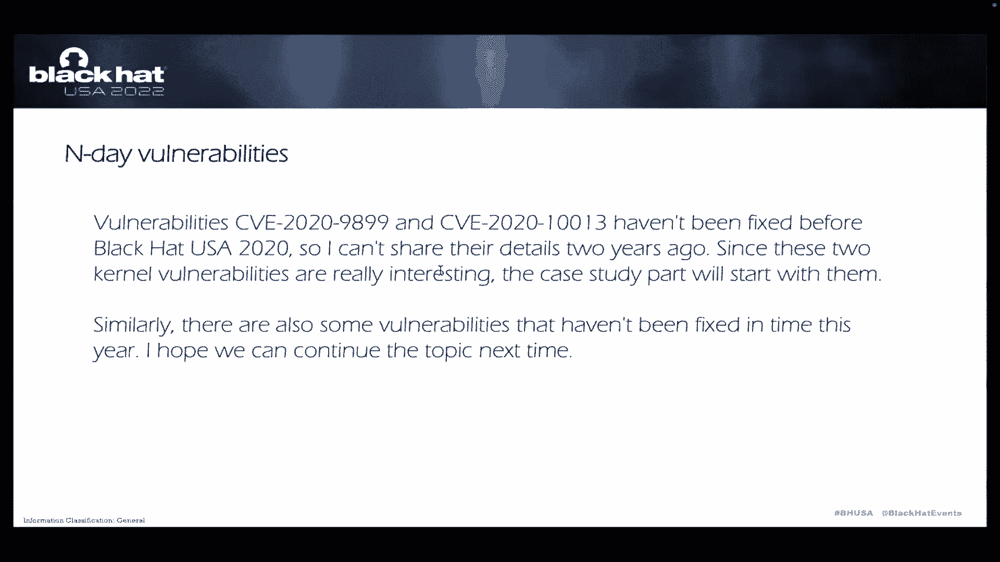

九十九和二千二百一十三以前还没有修好，黑帽美国二十年代，所以我不能分享他们两年前的细节，因为这两个内核漏洞非常有趣，所以呃，的，案例研究部分将从他们开始，同样也有一些漏洞，呃，今年没有及时修好的。

所以我希望我们能继续这个话题，也许明年或者下次，我们要讨论的第一类是基于核堆栈的规则扣，脆弱性，嗯二二八，99设置错误的配置文件，补丁信息在这里，呃，漏洞与兄弟有关，独立层，奥勒呃，这里呃。

我们可以看到一个名为OSL箭头的函数，输入参数是Broadcom错误，然后呃，我们在这里可以看到。

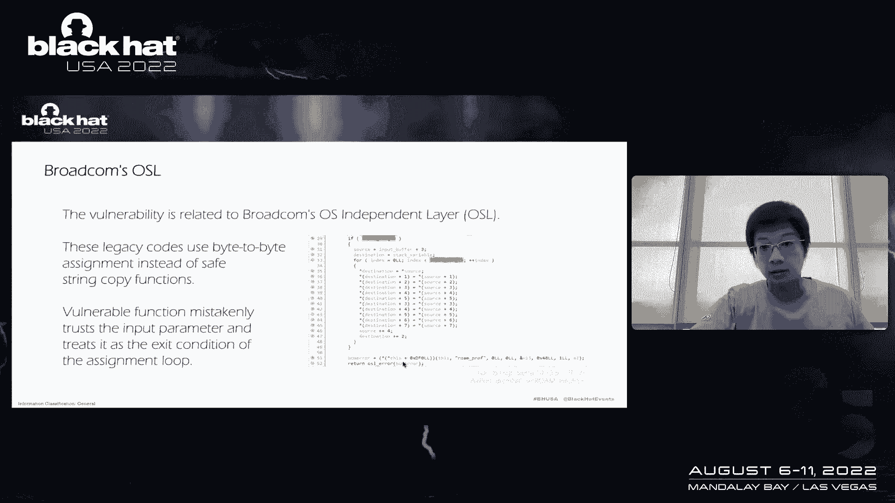

嗯，这个遗留代码，呃用by来买赋值而不是字符串，安全字符串复制函数，我想是因为它是一个，呃，遗留代码，我想呃，用ik编译这个遗留代码一定是一个挑战，根本原因可能与编译器或其他东西有关，嗯。

然后最重要的是，呃，一个函数错误地信任输入参数，并将其视为，呃，这里赋值循环的退出条件。

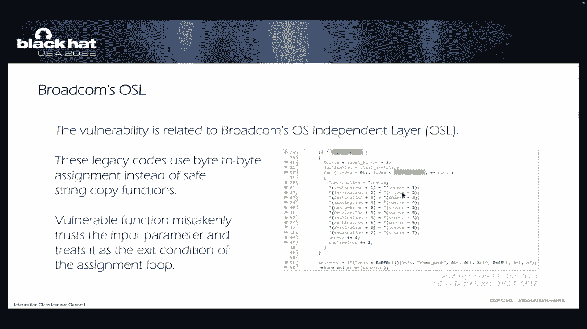

所以嗯，以下是内核崩溃的信息，呃，保留当前指令，和人民币，呃，在这一点上是，呃，呃是指向，呃，八b八，是啊，是啊，是啊，是啊，八点了，这个应该是回信地址，这个应该是RBP，所以呃，我们就可以。

这意味着我们可以控制，R i p和和呃R rbp，所以是的，你可以在这里看到，呃，我已经覆盖了RBP寄存器，嗯，这里没有呃，内核，呃，呃，堆栈中的金丝雀保护，所以我想这是一个呃。

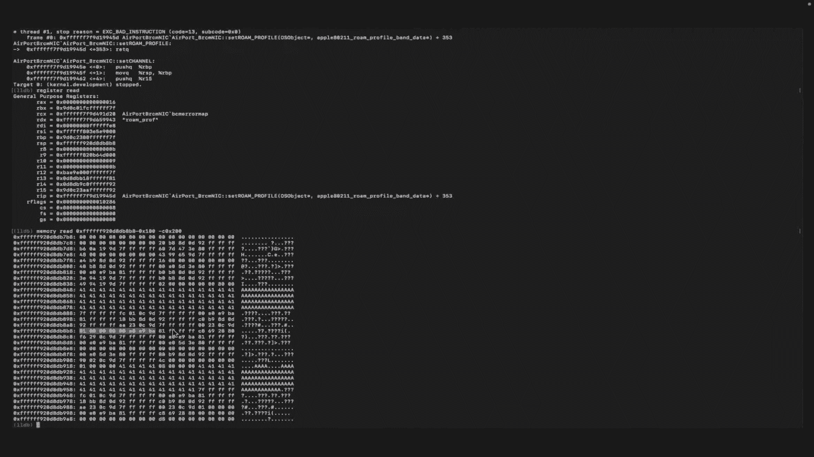

与，遗留代码，嗯，一个经常被问到的问题。

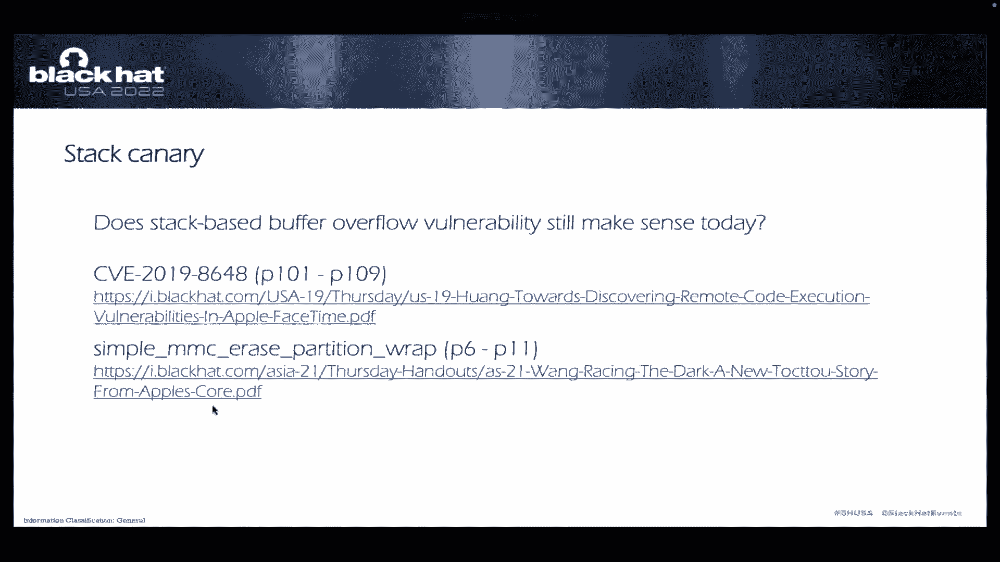

基于堆栈的漏洞缓冲区在今天仍然有意义吗，一个很好的例子来自企鹅，呃，cb二十，呃，二十九，呃，八六，四八，那样的话，llvm，把金丝雀插错位置，另一个值得衡量的案例是，这个，嗯嗯。

基于核步长的缓冲器的导出，在现实世界中不像在书中那样直截了当，尤其是当您没有内核调试器时，所以嗯，今天仍然可以看到基于漏洞的设置泡沫，尤其是在代码和98，九十九，一个函数没有步骤，cookie保护。

我们可以控制局部变量，RBP甚至IP寄存器，两年过去了，呃，你可能会问，嗯，是否还有如此高质量的内核堆栈基于我们正确的漏洞，这次绝对是CB232，呃，三十二八四七，漏洞影响iOS15。6。

Mac OS系泊和其他平台，呃，三十二，八四七与蓝牙配置文件和配置功能有关，总之，函数之间传递基于堆栈的变量，但是Wallable函数错误地将它们视为正常和可信的输入。

基于这种信任的计算可能会导致严重的问题。

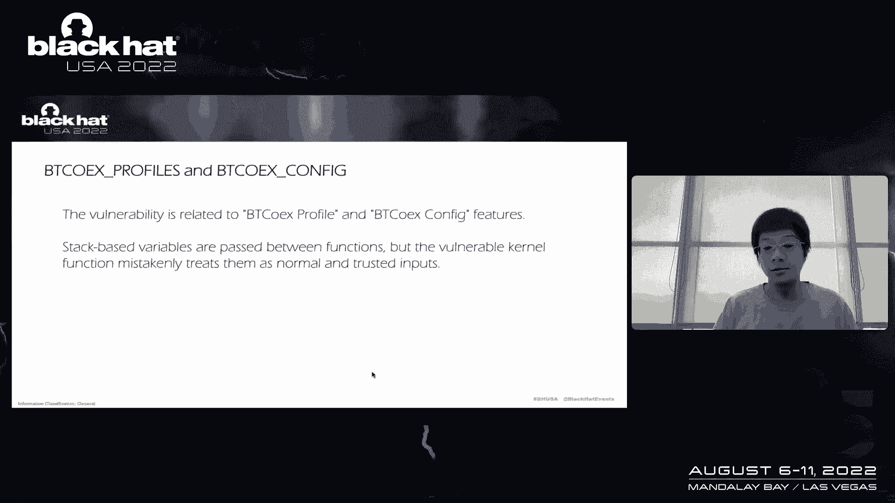

是啊，是啊，我有一个恐慌的信息，大家可以看到，呃，rbx，这里是嗯，其实，呃，基于堆栈的变量，并且可以控制解析的处理，比如说，RCX，呃，我们可以控制这个值，所以呃，这是一个，它是基于堆栈的，呃。

计算和呃，终于到了，呃，呃，内核堆栈或超读和覆盖，所以对于这个案子。

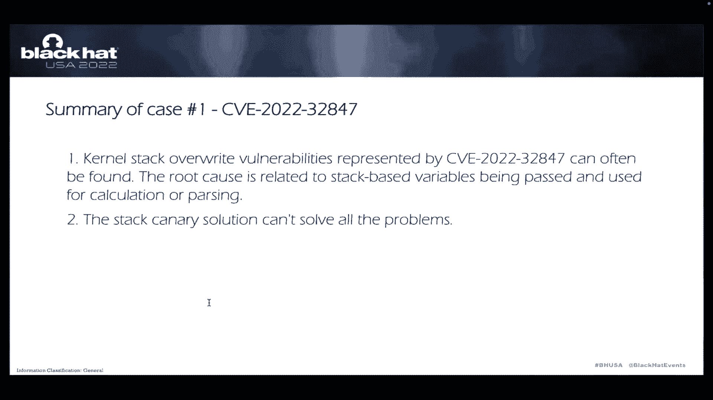

我会说，嗯，内核堆栈或内核堆栈重写漏洞表示为三二，八四七经常可以找到，根本原因与传递和用于的基于堆栈的变量有关，或用于计算保单，但是里面的数据，局部变量中的uh由用户模式或恶意输入控制，所以嗯，是啊。

是啊，这个，这是根菜，和堆栈金丝雀解决方案，金丝雀的解决方案不能解决所有的问题，下一个类别是三个内存正确漏洞，第一个案例是呃，呃，cb二十，呃，一百一十三个，嗯是的，所以这是补丁信息，呃。

例如iOS14和Mac OS，嗯，总之，嗯，奇怪的内核空间边界条件导致了这个漏洞，逆向工程，呃显示有两个分支，呃，一个是一个是，呃，这里，如果输入参数来自用户模式，呃，它需要进入，这里是复制分支，如果。

呃，输入参数来自内核模式是，我需要进入记忆分支，这样的边界条件是至关重要的，嗯，依我看，现在不是时候，不是做的时候，呃，自由式嗯，就像你在这里看到的，RDI寄存器，RDI寄存器中的值可以绕过那口井。

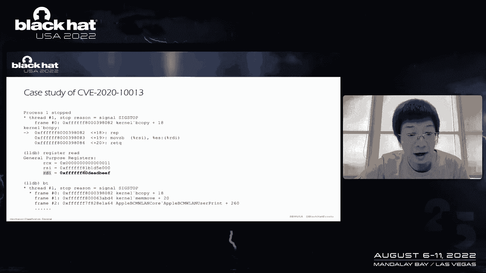

检查轨道，所以嗯，如此如此，别让防守和表演时间，呃，变成了表演的塞子，核心课程堆栈是这样的，嗯我们是的，就是说我们，我们去记忆移动分店，但是这个参数可以从用户模式控制，UM结合内核信息泄露漏洞。

可以确认一个完整的本地ELP链，呃，一个很好的信息披露例子，我可以分享的是，呃，二十二九八三，呃，这里有一个链接，如果你有兴趣，所以对于，呃，cb二十，二十，呃，一百三十。

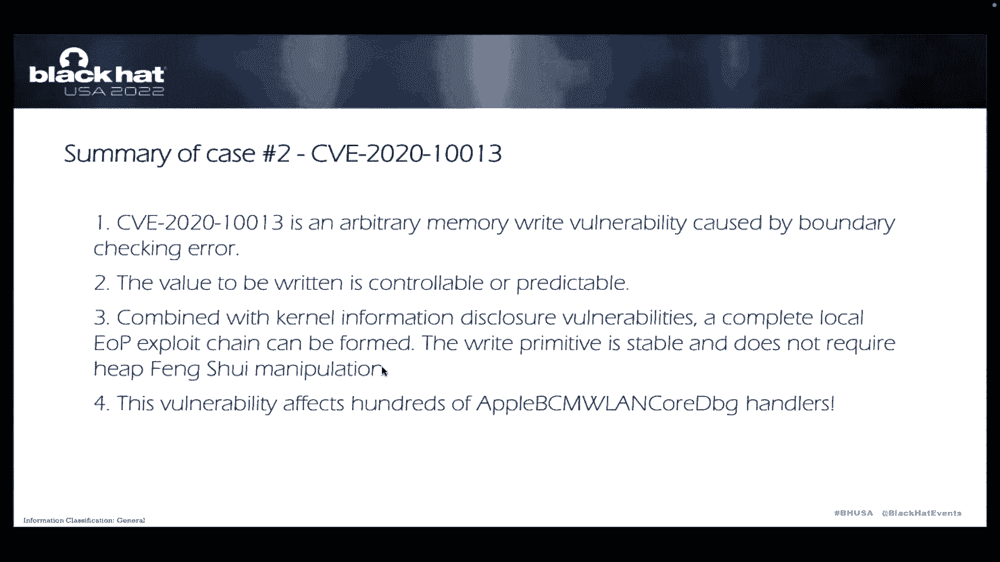

我会说，嗯，呃，这是一个任意的记忆，就在我们能力由边界检查箭头引起的时候，价值是正确的，是可控的或可预测的，呃，结合内核信息泄露漏洞，可以确认一个完整的本地EP链出口链，右原始是稳定的。

不需要髋关节操作，呃，的，呃，最后一个是有趣的部分，此漏洞影响数百个，嗯，实际上大约有两百个处理人员，是的，是的，呃，两年过去了，呃，它们的质量还这么高吗，任意内核内存，对呀，脆弱性，绝对。

这一次我们有cb222266762，嗯，读取RX，十五分和Mac OS货币，嗯是的，为了这个案子，呃，一句话足以解释课程，忘记消毒的易受攻击的功能，使用模式指针或地址，我还列出了几个，功能应该被调用。

在macos和freebsd平台上，呃，在Linux内核上使用复制和复制出，我们应该用，从用户复制并复制到用户，在Windows内核上，嗯，我们应该，呃，使用正确的阅读和正确的，对呀，是啊，是啊。

下面是调用堆栈，嗯在其他世界，呃，内核将把数据写入您提供的任何地址，呃，RBX是目标地址，RX是一个，这是一个固定值，嗯是的，在微小的计划中不可思议，但事情就这样发生了，第二个案件的摘要嗯，比起呃。

一百一十三个，呃的根本原因，二六七六二比较简单，但是使用指针消毒的一个函数，嗯那个，但这个简单的简单，脆弱的稳定是强大的，他们是完美的第一部分，嗯，对于这种情况，要写入的值是固定的，嗯。

因为我也是一种开发人员，所以内核漏洞造成的呃，从一个用户复制到另一个用户是很常见的，内核开发人员应该仔细检查所有的输入参数，嗯是的，所有的一切，呃，所有的输入都是潜在的有害的，下一个。

呃类别是最常见的内核，堆自动边界，读写漏洞，我可以和你分享两个案例，嗯二十二，呃三十二，八三七和八六十，呃是的，iOS和Mac OS蒙特雷。

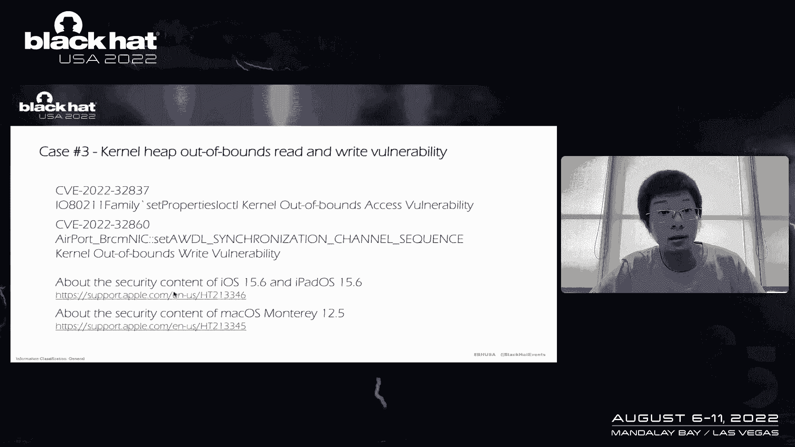

是啊，是啊，所以第一个，呃三十二八三七，嗯，我可以把镜头设置成任何数据，呃，例如，如果df嗯和这是呃，基于英特尔平台的测试，调用堆栈是，呃，与内存复制有关，是的，是的，这是一个，呃，苹果硅上的堆栈。

嗯是的，将镜头设置为，例如，如果意味着偏执狂肯定会死，嗯是的，但是这种呃，呃，一个可变性很容易被调试器捕获，但是这个，为了，第二个，呃，二十二十，三十，两个，八，六十，嗯，为了这个案子。

自动边界的总数不足以导致内核恐慌，呃，它只是读到，呃，呃，在，呃，臀部物体，或者给那个臀部对象写信，所以在这种情况下，我们需要内核地址消毒剂的帮助，我们需要修复内核中的恐慌问题。

第二节中提到的car和kernel，好的总结，嗯，我想说这种类型的弱点很容易被。

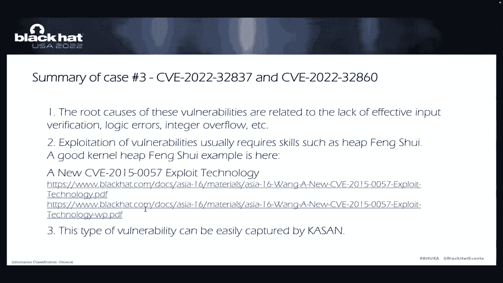

内核地址，Zer，而利用漏洞通常需要技能，呃，比如髋关节功能，我有一个很好的内核，臀部例子，呃二十五，哦，哦，五七，嗯，这里有一个链接，这种能力的根本原因是，很多原因，呃，比如说，缺乏呃，有效输入验证。

逻辑错误，呃整数楼层，是啊，是啊，等等，最后一种情况是类型混淆，一个可变性，嗯，那个和功能是相关的，呃，在我的。

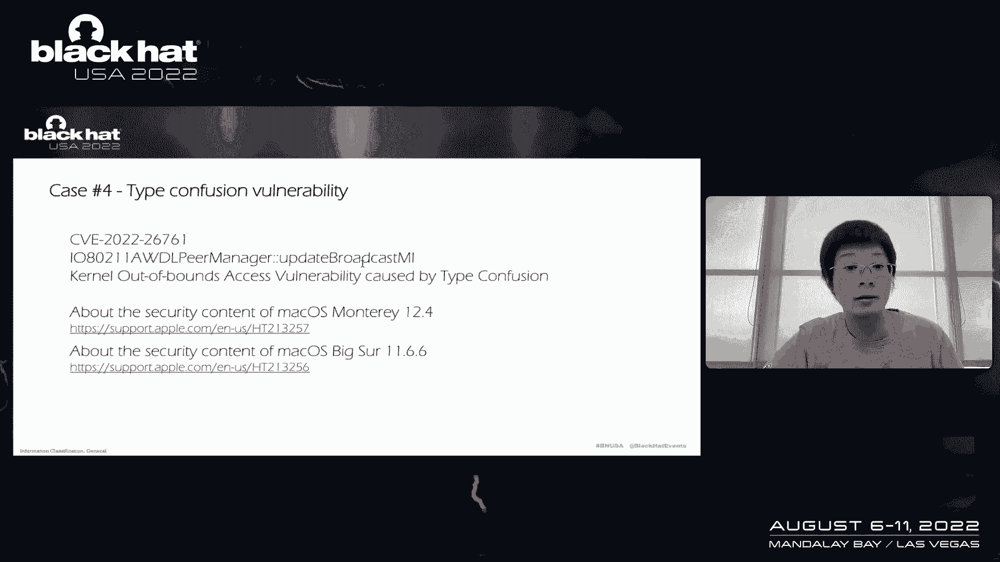

所以嗯，是啊，是啊，总之，嗯，函数的第一个参数，天行者界面，这个呃物体，呃，这个物体的大小很大，是大于呃，黑客中的六千八百字节，嗯，我和我甩了，呃，那个物体，呃，然而事情完成了，呃，请注意。

下面的呃对象是很多，呃，比呃小，六点半，这样我们就可以看到，嗯是的，这里有两个不同的对象，这里的值是不同的，因为呃，这是一种不同的呃类型，所以五分钟王先生五分钟，好的。

因此高度混乱意味着这种类型的混乱意味着超出界限，所以是的，因为这个是一个较小的物体，然后呃，它没有，呃，六千字节，所以这是一个呃，自动绑定访问和自动读写，问题，在看了这个1-6-7-6-1的补丁之后。

我发现在一个函数中仍然有一个非指针引用bug，嗯，顺便说一句，我发现了很多非点的参考资料，呃，有时我不得不报告他们，因为他们，呃意义变慢了，我的起毛努力，嗯是的，这是这个案子的摘要，呃，回调函数。

尤其是，呃，对于不同的体系结构，接口或工作模式，状态机和异常处理需要精心设计，嗯和，是啊，是啊，呃，康纳，案件事项，呃，好的补丁值得审核，还有一件事，嗯，呃，的后续行动，呃，哦，七，哦六是，呃。

与内核臀部自动边界相关，对呀，和后续ID，呃，三十七与任意记忆有关，呃，我最近向他们报告了，嗯，三个，哦，一七，呃，据我所知，这是两年内第二次，或者三年，同样的功能被发现是脆弱的，嗯，这里是其他的，呃。

好例子，嗯，这个九十八三四，是啊，是啊，它也是WiFi子系统，呃，据我所知，第二次被发现脆弱，这个三十九十二，这是历史上第三次，发现相同的功能易受攻击，所以是的，所以我想。

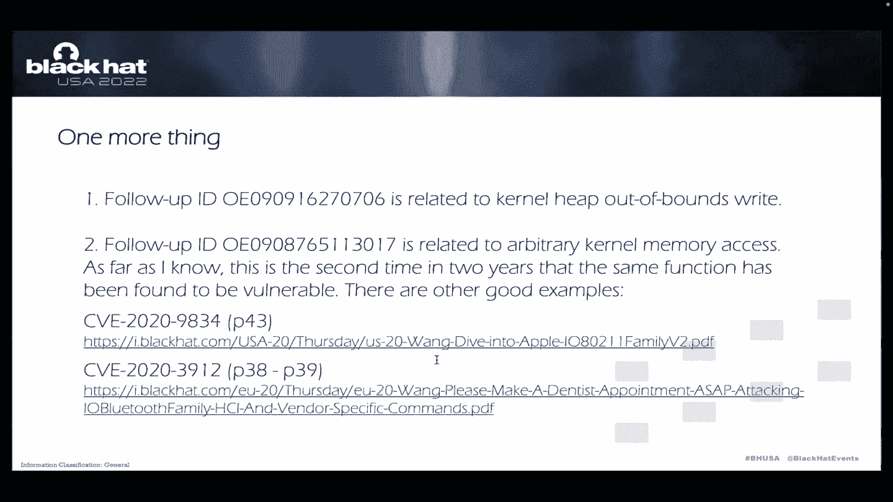

每隔一段时间就会引入这个新的漏洞，呃，即使旧的刚刚修好，所以是的，是啊，是啊，最后一部分，呃，外卖和结尾，从内核开发的角度，嗯，我想说苹果已经做出了很多努力，嗯。

Mac OS和iOS的安全性得到了显著提高，呃，内核开发人员，呃，我们要小心，呃，检查所有输入参数，更新的功能总是意味着新的攻击面，嗯是的，回调，呃，异常处理，这台机器需要精心设计。

从我们脆弱性研究的角度来看，我列出了，六分，他们之前已经提到过了，呃最后一个是，呃，是啊，是啊，从安全工程和漏洞搜索的角度，嗯是的，我会说如果你做了，呃，从一点到四点，比如说，呃。

集成界面和文本曲面集成，内核地址，搅拌器，搅拌器，称为覆盖分析，以及对硅平台有用的部分工具，嗯是的，呃，结合所有可用的手段，例如逆向工程，内核调试，呃，x u资源，SDK K DK，第三方工具，嗯。

如果你做过这个或者只是学习，你会发现，嗯，苹果做了很多工作，但结果似乎和任何东西都相似但你知道，嗯，我们已经看到了，我们有，我们都见过苹果和苹果，硅进展，所以耶，让我们继续前进，是啊，是啊，谢谢。呃。

那是我的演示文稿。

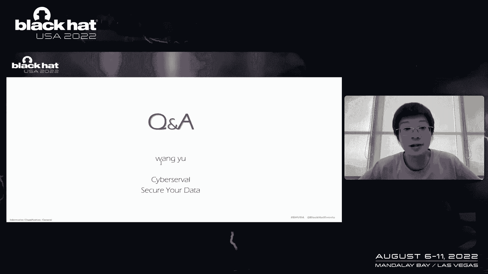