# 课程 P75：086 - 潜入苹果 IO80211Family 卷二 🔍

在本节课中，我们将学习苹果 WiFi 子系统（IO80211Family）的架构演变、漏洞研究方法论，以及如何识别和利用新一代系统中的内核漏洞。我们将从宏观架构入手，逐步深入到具体的漏洞案例分析，旨在为初学者提供一个清晰、系统的研究视角。

## 概述 📋

苹果的 WiFi 子系统经历了从“AirPort”到“IO80211Family v1”，再到“IO80211Family v2”的架构重构。从 iOS 13 和 macOS 10.15 Catalina 开始，苹果重构了 WiFi 客户端扩展，并将其重命名为“Family v2”。这一变化的核心目标是从基础网络通信能力升级，以支持所有苹果设备间可信、隐私的共享。本教程将基于此背景，探讨如何在该子系统中进行漏洞研究。

## 新一代模糊测试框架的需求 🎯

上一节我们介绍了架构背景，本节中我们来看看构建一个针对新框架的模糊测试系统需要满足哪些核心需求。

### 需求一：广泛的接口覆盖

我的第一个需求很简单：我希望在发送和接收数据时，能够改变网络的各种设置。因此，需要覆盖的接口至少应包括：
*   传统的 BSD `ioctl` 接口。
*   `ifnet` 和 `socket` 控制接口。
*   数据包的发送和接收路径。
*   网络设置相关的接口。

一个有趣的思路是同时尝试高级和低级接口。例如，在 macOS 蓝牙研究中，直接与内核对话可以绕过用户模式的检查和限制，意味着可以直接向固件发送原始数据。

以下是基于最新 XNU 源码（如 `xnu-8201` 分支）可以找到的一些新接口案例：
*   新的 `connectx` `ioctl` 接口。
*   名为 `Nexus` 的模块。
*   `skywalk` 分支包含了许多 Skywalk 框架的源代码，例如 `siocgifdevcontrol` 注册信息。

基于这些领域知识，我们可以扩展我们的测试框架。

### 需求二：接口与状态集成

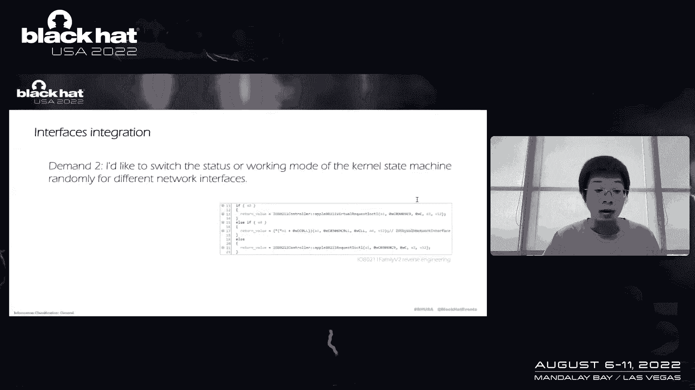

我希望能够为不同的网络接口随机切换内核状态机的状态或工作模式。逆向工程表明，大量接口会触发不同的子系统或状态。这引出了下一个需求：我需要找出并跟踪哪些接口被触发，并收集代码覆盖率数据。但我不希望显著拖慢内核速度，因此基于内核的轻量级解决方案是可以接受的。

目前系统中存在一些默认接口。如果你的模糊测试程序从未与它们交互过，那么是时候将它们纳入目标了。例如：
*   `en0`：最常见的有线/无线接口。
*   `ap1`：Access Point 模式的简称。
*   `awdl0`：Apple Wireless Direct Link 的简称。

这些都是我们的潜在目标。

### 需求三：借鉴 XNU 测试用例

XNU 源码中包含了许多有价值的测试用例。以下是其中一部分：
*   `network_agent`
*   `ifnet_test`
*   `ioctl_test`

如果你之前没有阅读过这些测试用例，我强烈建议你这样做，因为它们可能揭示了潜在的攻击面。

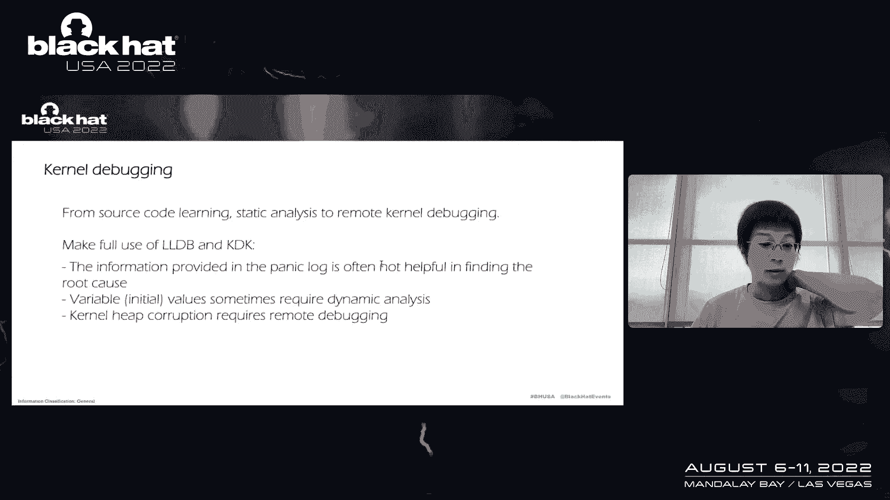

到目前为止，新一代苹果 IO80211Family 模糊测试框架集成了超过 40 个网络接口和类型化接口。需要指出的是，在一次模糊测试任务中，并非覆盖的攻击面越多越好。当要求随机参数时，结果往往不如预期。对于类型化接口和领域知识，我们需要通过学习源码、文档和测试用例来积累。但在构建模糊测试器时，每一轮随机选择两到三个接口进行充分测试，效果可能更好。

### 需求四：内核调试能力

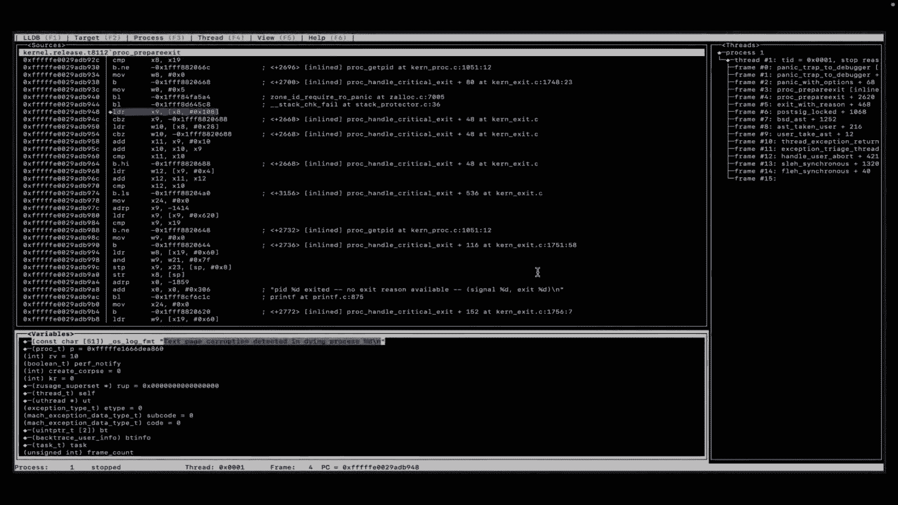

有时我们必须依赖远程内核调试器的强大功能，因为内核崩溃（Panic）提供的信息通常不足以找到根本原因，变量的值有时需要动态分析。

例如，我上周在 Apple Silicon 的 macOS Ventura（版本 22.5.3）上发现的一个内存损坏漏洞。更详细的崩溃画面和反汇编代码本身没有提供有价值的信息，没有 LLDB 调试器的帮助可能无法找到答案。

但在 Apple Silicon 平台上，我们缺乏官方支持。PDK 文件指出，Apple Silicon 不支持活动内核调试。我们不能设置断点并继续执行代码，这意味着需要第三方调试解决方案的帮助，例如 Asahi Linux。

**本节总结**：在 Apple Silicon 平台，我们需要第三方调试解决方案。内核崩溃画面是典型的损坏案例，因此我们需要内核地址消毒器（KASAN）和类型混淆检测器（KTYPO）。我们甚至需要实现自动化的动态监控解决方案。

## 工具链的构建与修复 🔧

上一节我们讨论了核心需求，本节将关注实现这些需求所需的工具，以及可能遇到的挑战和修复方法。

我想讨论的另一件事是，我们有时不得不进行一些修复，因为构建定制内核或使用现有工具（如 `kern.telemetry`）可能不太好用。

例如，在 XNU 7195 中，内核引入了一个名为 `console_io_alert` 的函数。这个函数会检查系统是否发出了控制台 I/O 请求，以防在平台中断被禁用时（类似于 Windows 的蓝屏死机），这可以归类为 I/O 队列错误，因为我们无法访问调度器级别的可分页数据。然而，构建定制内核总是会发出这样的 I/O 请求，导致我们无法使用内核调试器。互联网上似乎没有人抱怨这个问题，看起来我们都默默地修复了这类问题。

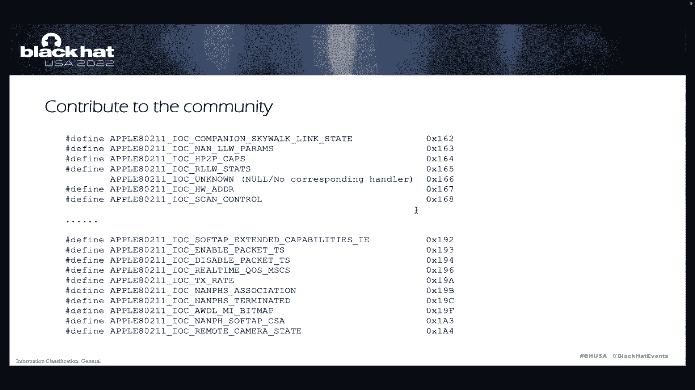

四年前，我开源了一个名为 `Kisama` 的 macOS 项目，使用内核引擎实现简单的代码覆盖率分析解决方案。这次，我将内核和引擎部分拆分出来，专注于苹果平台。在模糊测试的帮助下，我相信我们可以做得更多。

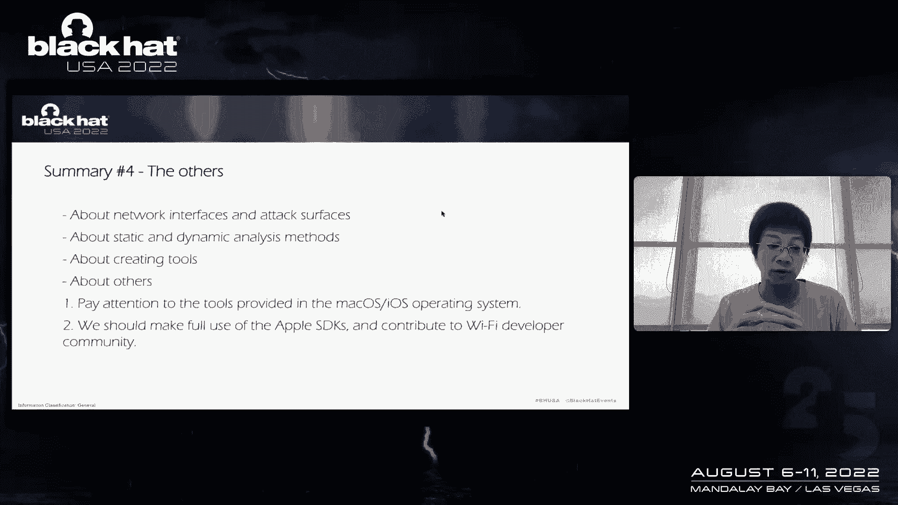

**本节总结**：是的，有时我们必须进行修复，因为构建定制内核或使用现有工具可能不太顺利。

## 利用苹果 SDK 与第三方工具 📚

本节是关于苹果 SDK 和第三方工具的利用。苹果 SDK 包含许多有用的信息，例如 WiFi 相关的头文件和数据结构，这将节省大量的逆向工程时间。此外，macOS 操作系统中内置了许多有趣的命令行工具，例如：
*   `airport`
*   `airportd`
*   `aircrack-ng`

它们都是潜在的研究目标。顺便提一下，WiFi 开发者社区一直在维护接口和功能列表，我们应该为社区贡献最新的变化。上次我有时间时，逆向分析了 `SkywalkLinkStatus` 接口。而这次，例如 `AFC`（Apple Remote Camera）的状态接口是最新的变化。

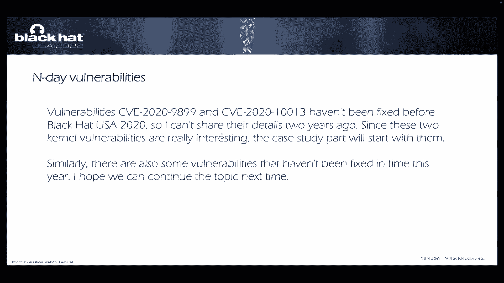

## 构建新一代 WiFi 模糊测试路线图 🗺️

到目前为止，我们讨论了四个方面的需求：关于网络接口和类型化接口、关于静态和动态分析方法、关于创建工具、以及其余部分。如果我们将一切整合起来，就能获得构建新一代 WiFi 模糊测试器的路线图。

这是系统的整体架构图，从用户模式到内核模式，从高级接口到低级接口和攻击面，从目标机到主机。这是一幅宏大的蓝图。我有一个短视频可以展示它是如何工作的：左边是目标机器，右边是主机，它们通过一个 Thunderbolt 适配器连接在一起。目标机的操作系统版本是 macOS Ventura 22.5.3。内核会立即崩溃并触发调试器中断，CPU 状态混乱。这是我发现的零日漏洞之一，但这里的信息没有实际用处。

在下一节，我将展示一些我报告的内核漏洞。其中一些被分配了 CVE 编号，例如 CVE-2022-32837。我们稍后会看到。漏洞如 CVE-2020-9983 和 CVE-2020-2213 在两年前的黑帽美国大会上尚未修复，因此当时我不能分享细节。因为这两个内核漏洞非常有趣，所以案例研究部分将从它们开始。同样，今年也有一些漏洞没有及时修复，我希望我们能继续这个话题，也许在明年或下次。

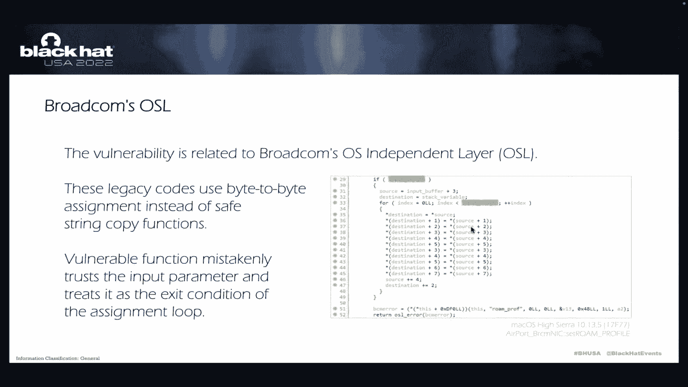

## 漏洞案例分析 💥

上一节我们勾勒出了研究框架，本节我们将深入分析几个具体的内核漏洞类型和案例。

### 类型一：基于内核栈的缓冲区溢出

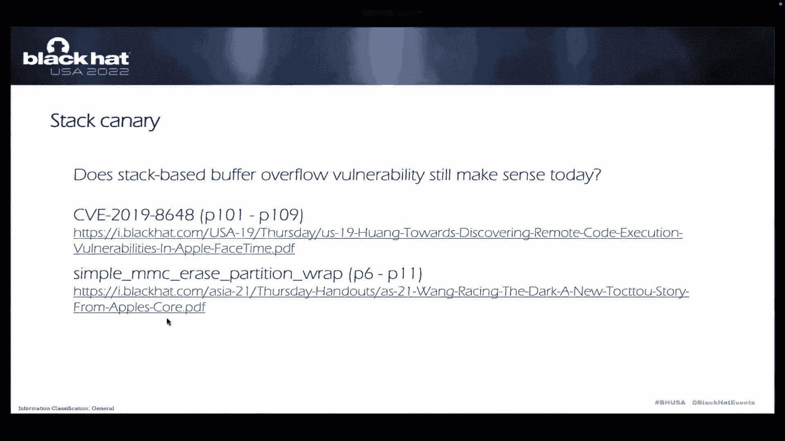

第一个案例是 **CVE-2020-9983**（设置错误的配置文件）。补丁信息在此。该漏洞与 Broadcom 的独立层（`bcm`）有关。这里我们可以看到一个名为 `osl_strcpy` 的函数，输入参数是 `broadcom_error`。我们可以看到这是一段遗留代码，使用 `by` 字节赋值而不是安全的字符串复制函数（如 `strlcpy`）。我想是因为它是遗留代码，用 IOKit 编译这段遗留代码一定是个挑战。根本原因可能与编译器或其他东西有关。

最重要的是，一个函数错误地信任输入参数，并将其视为赋值循环的退出条件。

以下是内核崩溃信息：`RIP`（指令指针）和 `RBP`（基址指针）在这一点上指向 `0x8b8`。这应该是返回地址，这应该是 `RBP`。所以这意味着我们可以控制 `RIP` 和 `RBP` 寄存器。你可以看到我已经覆盖了 `RBP` 寄存器。内核栈中没有金丝雀（canary）保护，所以我认为这是一个与遗留代码相关的问题。

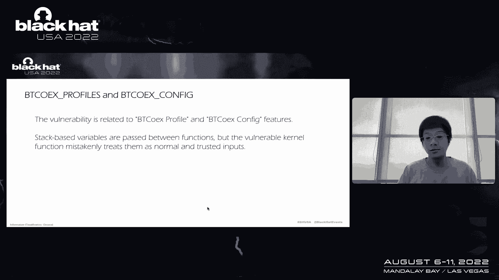

一个常被问到的问题是：**基于栈的缓冲区溢出漏洞在今天还有意义吗？** 一个很好的例子来自 `penguin` CVE-2020-29846，在那种情况下，LLVM 将栈金丝雀放错了位置。另一个值得注意的案例是这个基于内核栈的缓冲区溢出，在现实世界中并不像书中那样直接，尤其是当你没有内核调试器时。所以，今天仍然可以看到基于栈的缓冲区溢出漏洞，尤其是在代码 `98-99` 中，一个函数没有栈 cookie 保护。我们可以控制局部变量、`RBP` 甚至 `RIP` 寄存器。

两年过去了，你可能会问：是否还有如此高质量的内核栈缓冲区溢出漏洞？这次绝对是 **CVE-2022-32847**。该漏洞影响 iOS 15.6、macOS Monterey 等平台。CVE-2022-32847 与蓝牙配置文件和配置功能有关。总之，函数之间传递基于栈的变量，但可写函数错误地将它们视为正常和可信的输入。基于这种信任的计算可能会导致严重问题。

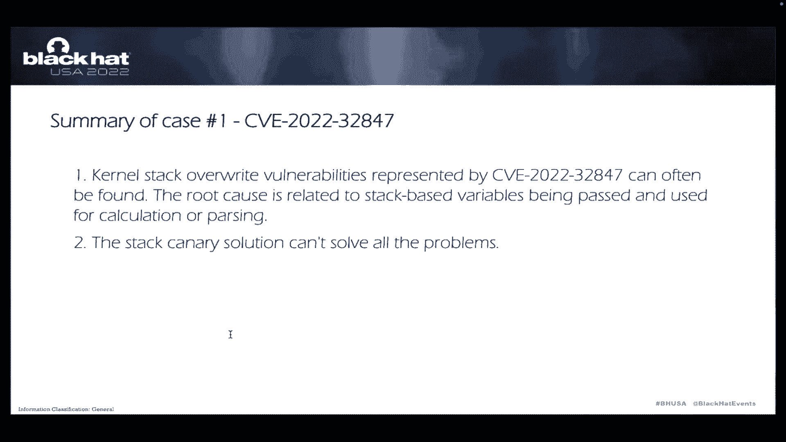

我有一个崩溃信息，大家可以看到 `RBX` 这里其实是基于栈的变量，并且可以控制后续的解析处理。例如 `RCX`，我们可以控制这个值。所以这是一个基于栈的计算，最终导致内核栈越界读取和写入。

对于这个案例，我会说：像 CVE-2022-32847 这样的内核栈重写漏洞仍然经常可以找到。根本原因与传递和用于计算或用于策略的基于栈的变量有关，但局部变量中的数据由用户模式或恶意输入控制。栈金丝雀解决方案不能解决所有问题。

### 类型二：内存写漏洞

第一个案例是 **CVE-2020-10013**。例如影响 iOS 14 和 macOS。总之，奇怪的内核空间边界条件导致了此漏洞。逆向工程显示有两个分支：如果输入参数来自用户模式，它需要进入 `copy` 分支；如果输入参数来自内核模式，则需要进入 `memory` 分支。这样的边界条件至关重要。

在我看来，现在不是做自由风格（freestyle）的时候。就像你在这里看到的，`RDI` 寄存器中的值可以绕过良好的检查轨道。所以，不要让防御和表演时间变成了表演的塞子。内核调用栈是这样的：我们进入了 `memory move` 分支，但是这个参数可以从用户模式控制。结合内核信息泄露漏洞，可以构建一个完整的本地 EoP（权限提升）利用链。

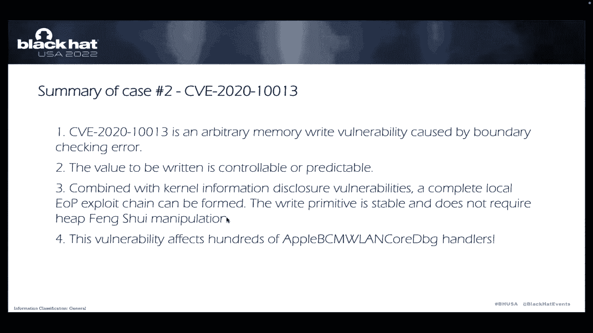

一个很好的信息披露例子我可以分享的是 CVE-2020-9983，这里有一个链接，如果你有兴趣。

对于 CVE-2020-10013，我会说：这是一个任意内存写漏洞，在我们有能力由边界检查箭头引起的时候，其值是可控或可预测的。结合内核信息泄露漏洞，可以确认一个完整的本地 EoP 利用链。利用是稳定的，不需要堆操作。

最后一个有趣的部分是，此漏洞影响了数百个（实际上大约两百个）处理程序。两年过去了，它们的质量还这么高吗？绝对是的。这一次我们有 **CVE-2022-26762**，影响 iOS 15 和 macOS Monterey。

对于这个案例，一句话足以解释：一个忘记进行指针消毒的易受攻击函数使用了用户模式指针或地址。我还列出了几个函数，在 macOS 和 FreeBSD 平台上应该调用 `copyin`/`copyout`；在 Linux 内核上应该使用 `copy_from_user` 和 `copy_to_user`；在 Windows 内核上应该使用 `ProbeForRead` 和 `ProbeForWrite`。

调用堆栈显示，在其他情况下，内核会将数据写入你提供的任何地址。`RBX` 是目标地址，`RDX` 是一个固定值。在微小的计划中不可思议，但事情就这样发生了。

第二个案例（CVE-2022-26762）的摘要比起 CVE-2020-10013，其根本原因更简单：一个函数忘记使用指针消毒。但这个简单的漏洞是稳定且强大的，它们是完美的利用原语。对于这种情况，要写入的值是固定的。因为我也是一个内核开发者，所以由 `copyin`/`copyout` 引起的漏洞很常见。内核开发人员应该仔细检查所有的输入参数。是的，所有的输入都是潜在有害的。

### 类型三：内核堆越界读写漏洞

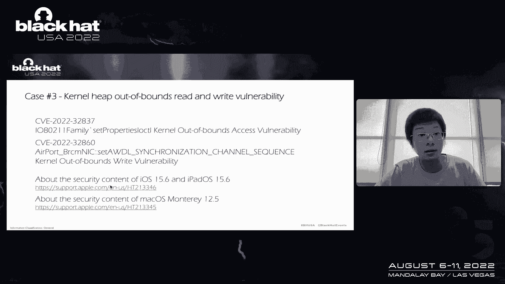

我可以和你分享两个案例：**CVE-2022-32837** 和 **CVE-2022-32860**，影响 iOS 和 macOS Monterey。

第一个，CVE-2022-32837。我可以将长度设置为任何数据。例如，如果 `DF`（方向标志）被设置，在基于 Intel 平台的测试中，调用堆栈与内存复制有关。在 Apple Silicon 上的堆栈，将长度设置为例如 `0xffffffff` 肯定会导致崩溃。但这种漏洞很容易被调试器捕获。

第二个，CVE-2022-32860。对于这个案例，越界访问的总量不足以直接导致内核恐慌。它只是读取或写入堆对象之后的数据。所以在这种情况下，我们需要内核地址消毒器（KASAN）的帮助，我们需要修复第二节中提到的定制内核的恐慌问题。

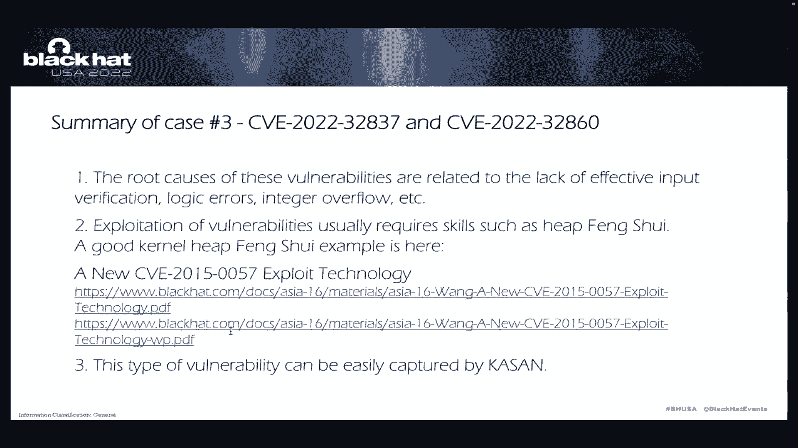

**总结**：我想说这种类型的漏洞很容易被内核地址消毒器（KASAN）捕获，而利用通常需要堆喷（heap spraying）等技能。我有一个很好的内核堆喷例子 CVE-2021-30761，这里有一个链接。这种漏洞的根本原因有很多，例如缺乏有效的输入验证、逻辑错误、整数溢出等等。

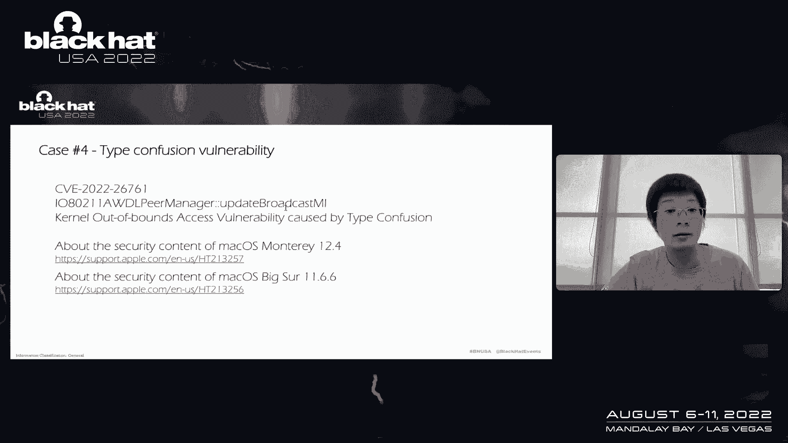

### 类型四：类型混淆漏洞

这个漏洞与 `Skywalk` 接口的一个函数有关。总之，函数的第一个参数（一个 `Skywalk` 接口对象）的大小很大，大于 6800 字节。我释放了那个对象。然而，事情完成了。请注意，下面使用的对象要小得多，小于 6800 字节。这样我们就可以看到，这里有两个不同的对象，这里的值是不同的，因为它们是不同的类型。所以，类型混淆意味着越界访问。因为第二个是一个较小的对象，它没有 6800 字节，所以这是一个越界访问和读写问题。

在看了 CVE-2021-30761 的补丁之后，我发现在一个函数中仍然有一个“非指针引用”错误。顺便说一下，我发现了很多非指针引用错误，有时我不得不报告它们，因为它们显著拖慢了我的模糊测试工作。

**本案例摘要**：回调函数，尤其是对于不同的体系结构、接口或工作模式，状态机和异常处理需要精心设计。好的补丁值得审核。

还有一件事，CVE-2021-30761 的后续 CVE-2022-32837 与内核堆越界访问相关。而后续的 CVE-2022-32899 与任意内存写相关。我最近向他们报告了 CVE-2023-xxx。据我所知，这是两年或三年内，同一个功能第二次被发现存在漏洞。这里是其他好例子：CVE-2020-9834，它也是 WiFi 子系统，据我所知是第二次被发现脆弱。CVE-2020-9923，这是历史上第三次发现相同的功能易受攻击。

所以，我想每隔一段时间就会引入新的漏洞，即使旧的刚刚修复。

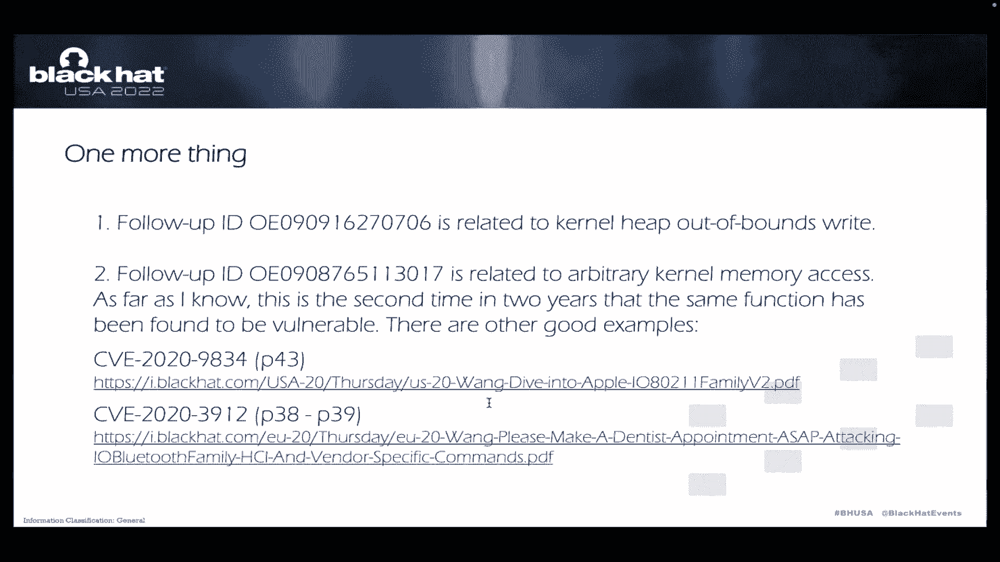

## 总结与要点 🎓

本节课中我们一起学习了苹果 IO80211Family 的漏洞研究全景。最后一部分是要点和结尾。

从内核开发的角度，我想说苹果已经做出了很多努力，macOS 和 iOS 的安全性得到了显著提高。内核开发人员要小心检查所有输入参数。更新的功能总是意味着新的攻击面。是的，回调、异常处理、状态机需要精心设计。

从我们漏洞研究者的角度来看，我列出了六个要点（之前已经提到过）。最后一个是：从安全工程和漏洞搜寻的角度，我会说如果你做到了第一到第四点（例如，集成接口和类型化接口、内核地址消毒器、代码覆盖率分析、以及对 Apple Silicon 平台有用的部分工具），是的，结合所有可用的手段（例如逆向工程、内核调试、XNU 资源、SDK/KDK、第三方工具），如果你做过这些或者只是学习，你会发现苹果做了很多工作，但结果似乎和以前相似。但你知道，我们已经看到了苹果和 Apple Silicon 的进展。所以，让我们继续前进。

谢谢，那是我的演示文稿。