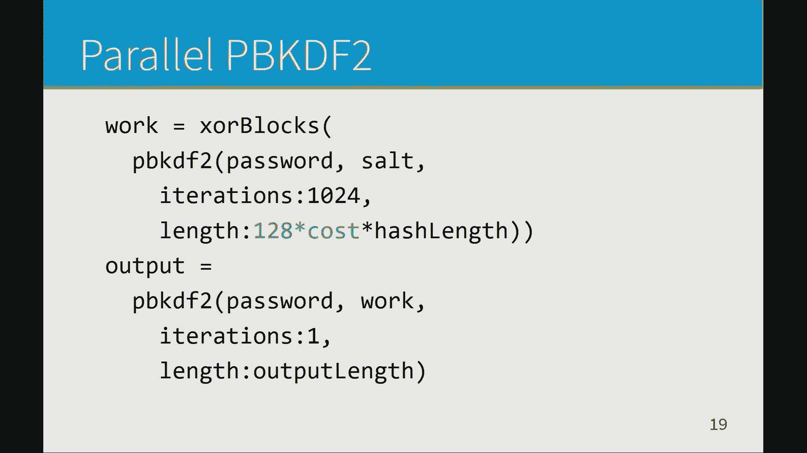
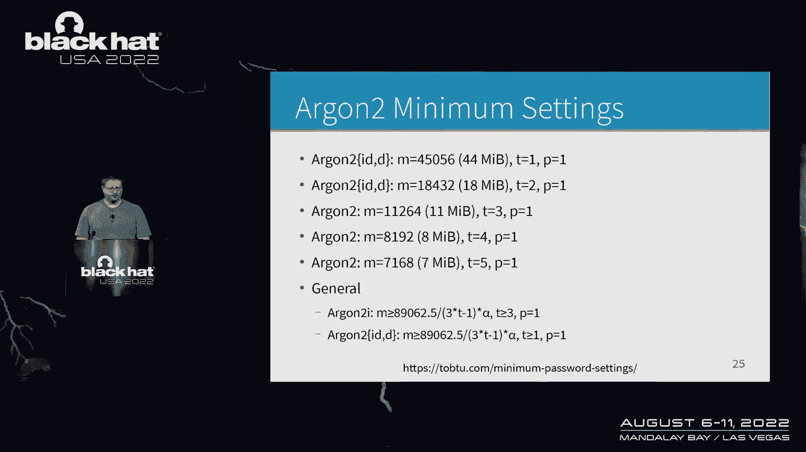
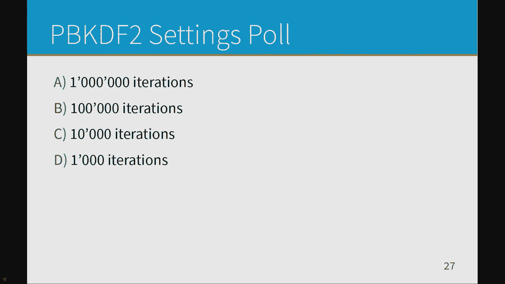
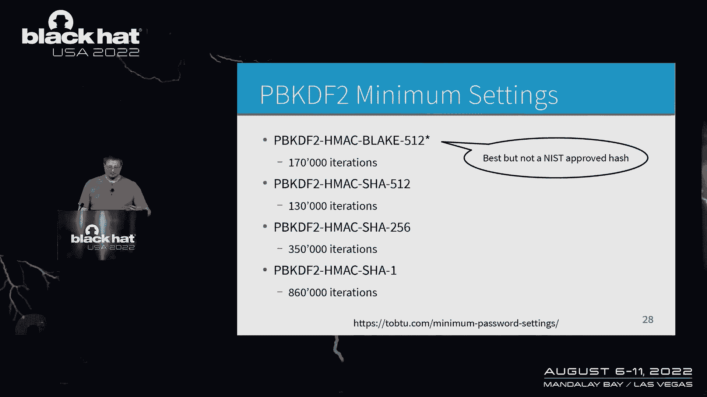
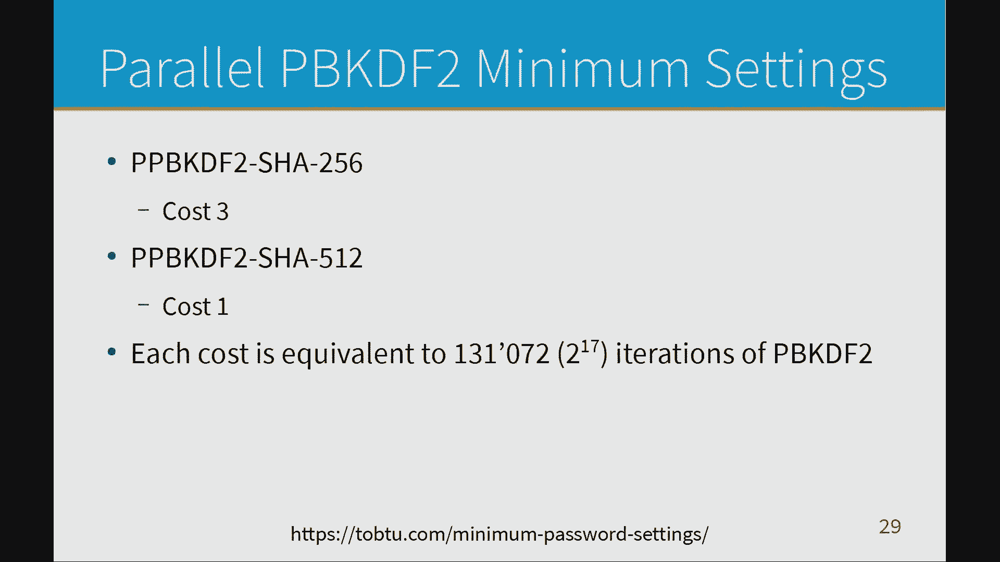
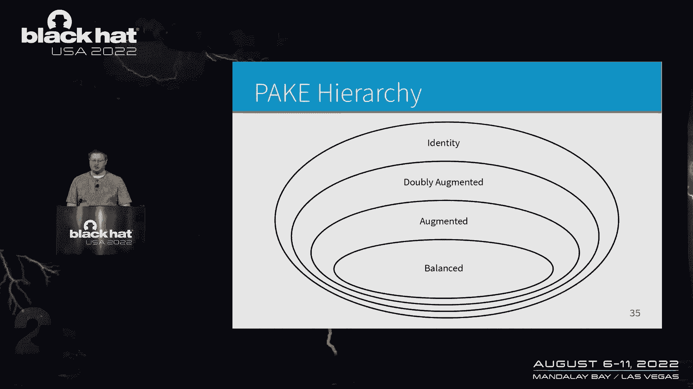
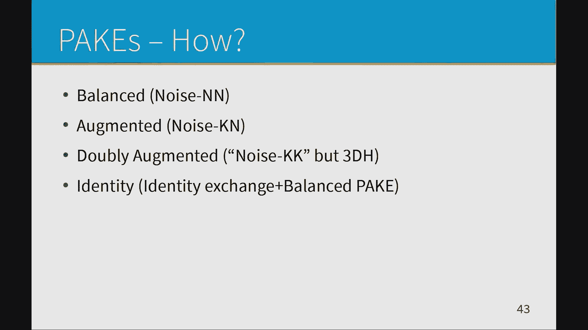
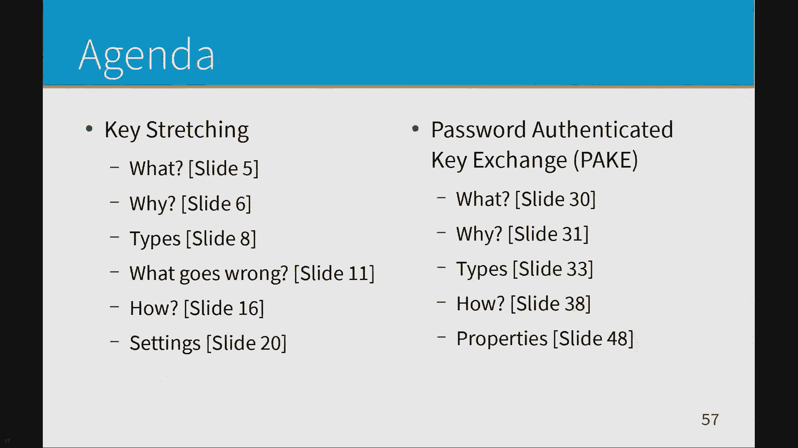
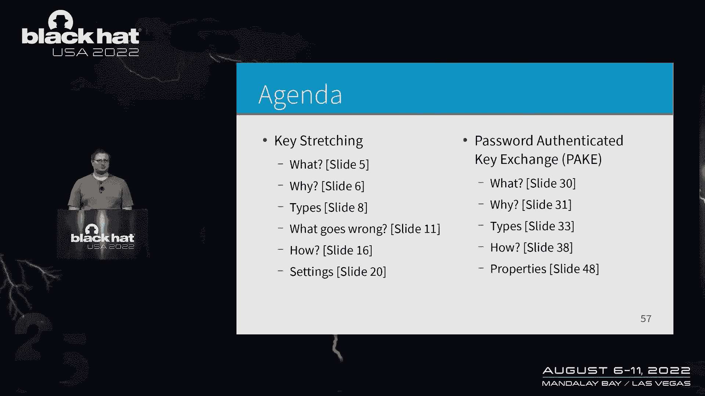
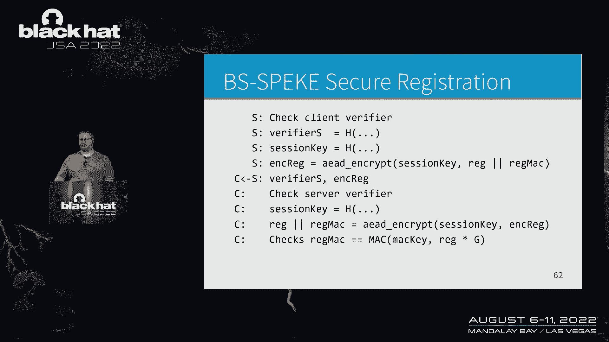

# 课程 P76：087 - 密钥拉伸与PAKEs原理解析 🔐

在本节课中，我们将学习**密钥拉伸**和**PAKE**的核心概念。我们将探讨它们为何重要、如何工作，以及在实际应用中如何避免常见的安全漏洞。课程内容将涵盖从基础定义到具体算法实现的各个方面。

---

## 我是谁？我为什么在这里？ 🎤

我是一名信息安全领域的密码破解者，也是一名密码学爱好者。我的工作由密码管理器赞助。我开始审计软件，发现了许多安全漏洞。这是我第一次真正进行审计工作，过程中发现了降级攻击等各类问题。我研究了其他系统，发现它们存在类似的漏洞。最终，我决定深入研究如何构建一个安全的系统，并由此开启了我的探索之旅。

我成功破解了Maqua原始版本的代表团，但该问题已被修复。接下来，我们将讨论**密钥拉伸**和**密码认证密钥交换**。

---

## 什么是密钥拉伸？ 🔑

密钥拉伸通常用于处理密码。哈希可用于身份验证，例如，当你登录网站时，服务器会哈希你的密码，在数据库中查找并比对结果。**密码密钥派生函数**则用于生成密钥，通常用于加密或其他算法。

密钥拉伸还可用于生成指纹，例如Signal安全号码。它生成一个30位的十进制数字（约100位），然后将其扩展到112位。使用密钥拉伸处理密码是本节讨论的核心内容。

然而，Madison曾存在一个漏洞，bcrypt的费用设置为12。这些算法非常缓慢，每秒仅能进行约100次哈希运算。相比之下，GPU可以更快地执行哈希运算。例如，针对数据库中所有密码哈希进行猜测，可能需要90个GPU小时。某些系统在MD5哈希旁存储了盐值，导致1500万个哈希在10天内被破解了1100万个。MD5速度非常快，攻击者只需运行算法即可在短时间内破解大量密码。其中，73%的密码强度较弱。

---

## 计算困难性与内存困难性 ⚙️

**计算困难性**指的是需要完成的工作量。哈希运算涉及并行和顺序处理。攻击者只关心总工作量，而防御者则关心所需时间。如果使用多核CPU或支持SIMD指令，可以并行执行大量哈希运算，从而在短时间内完成更多工作。

**内存困难性**指的是算法使用的内存量。更多的内存会限制GPU可使用的线程数，并影响带宽消耗。GPU通常具有较高的带宽，但内存困难算法主要受事务数量限制，而非带宽。例如，在GPU上读取64位随机整数，并通过快速操作（如加法、异或）进行处理。

**并行PBKDF**将在后续讨论。PBKDF2和bcrypt是常见的算法。内存困难算法如Argon2，如果遵循以下三个步骤（包括可选的记忆硬件步骤），则更为安全：
1.  对所有输入（密码、盐值等）进行哈希。
2.  使用生成的种子进行工作，生成一个工作值。
3.  使用KDF将工作值拉伸到所需大小。

如果不遵循这些步骤，算法可能存在漏洞。CV算法曾因实现错误而存在漏洞，例如默默解密并截断到72字节。这是英国政府警方网络警报的代码，具体细节由Paul Moore在Twitter上发布。

---

## 哈希与HMAC的正确使用 🛡️

p_hash为64字节，仅留给密码8字节的空间。一个简单的解决方法是：将所有内容与密码一起哈希。这接近于正确使用解密的方式。你应该使用HMAC对密码进行哈希，其中胡椒作为密钥，消息是密码。然后，将其放入并转换为ASCII。

即使遵循所有步骤，仍可能出现漏洞。例如，某些系统只检查特定字符的首次出现，可能导致哈希碰撞，使得任意密码在某些情况下匹配。当漏洞出现时，我计算了这些概率，虽然未仔细检查，但基本正确。

---

## 密钥拉伸的三个步骤 📝

以下是密钥拉伸的三个核心步骤（已移除可选内容）：
1.  对所有输入进行哈希。
2.  使用生成的种子进行工作。
3.  使用KDF拉伸到所需大小。

许多人可能觉得这些步骤缺少细节，但这是构建安全系统的基础。

PBKDF2存在两个主要问题：
1.  如果不进行HMAC初始化和完成操作，而仅使用HMAC，防御者需要做两倍的工作。如果用户输入非常长的密码，每次处理都会消耗大量资源，可能导致拒绝服务攻击。
2.  如果要求PBKDF2输出更多数据，工作量会增加，但可能被滥用。

---

## 并行PBKDF与算法选择 🔄

我提出了**并行PBKDF**的概念。基本思想是：请求大量输出，将所有块组合，然后使用PBKDF2拉伸到所需长度。目前，建议使用PBKDF2或Balloon哈希，但Balloon哈希尚未完全实现。

确保攻击者每秒在GPU上的猜测次数少于一万次。Jeremy Gosney曾表示，在漏洞出现后，密码哈希应确保最快的GPU每秒猜测次数低于一万次。这被认为是相当慢的。我引用了这一观点，并将GPU定义为最适合密码破解的硬件。

这些建议高度依赖于硬件。如果进行服务器身份验证哈希，你希望确保吞吐量符合需求。由于这些因素取决于硬件，我将重点讨论最低要求，因为这更容易给出明确建议。

---

## bcrypt的最低设置建议 ⚡

bcrypt非常快速，运行时间可达毫秒级。总体建议是：使用最高成本设置，并进行多次迭代。这基于当前GPU的内存事务数量。bcrypt的最低设置非常简单。

技术上，bcrypt需要9次迭代，因为其成本处理方式是指数级的。严格来说是8.1次，但必须输入整数。屏幕底部的链接是我的网页，我会更新最新建议。

现行建议基于RFC制定者给出的设置，例如：2次迭代、64MB内存、3次迭代等。这些设置差异很大。我使用的密码管理器KeePass甚至不允许设置2次迭代。我的最低要求基于当前GPU的内存带宽，但缺乏良好的基准测试数据。

---

## 通用公式与算法性能 📊

通用公式中，变量A表示实际可消耗的内存带宽百分比，取决于内存设置。假设为64MB，当内存翻倍时，性能会下降。GPU速度可能会降低到四分之一，因为它在使用一半线程的情况下做了两倍的工作。

同样，最低设置基于内存带宽。对于PBKDF2，你认为的高数字是多少？行业标准是什么？我的最低要求取决于实际使用的哈希算法。例如，SHA-1在GPU上非常快，因此要求更高。从技术上讲，BLAKE2b是最佳算法，因为它具有内部并行性。作为防御者，你可以使用SIMD指令加速，但攻击者同样可以加速。

---

## 并行PBKDF2与密码认证 🔐

并行PBKDF2非常简单。例如，成本3相当于超过10万次迭代。你可以使用这些进行密码认证。当登录网站时，不是直接发送密码，而是进行密钥交换。几年前，一些公司无意中记录了密码。如果切换到密码KDF，即使记录信息，也不会泄露重要内容。

你还可以使用PAKE建立加密隧道，例如使用Magic Wormhole发送文件。如果你听说过“滚开”，可能不是SCRAM的问题。你必须在加密通道上进行操作，因为任何看到这些信息的人，如果看到成功的登录消息，就相当于获取了密码哈希。在日志记录的情况下，你会记录密码哈希值。

---

## PAKE的类型与属性 🧩

PAKE分为点对点和客户端-服务器类型。不要称这些为对称或非对称，因为非对称密码学暗示只有两种类型。**双重增强PAKE**是Mike Hamburg在一封长邮件中提到的概念。几年前，他说不知道有什么好的应用场景。我找到了一个完美的匹配：Wi-Fi。例如，门铃和接入点之间使用双重增强PAKE，可以防止攻击者入侵门铃后利用存储的信息攻击网络。

**身份PAKE**涉及身份、角色和权限，非常适合某些场景。**平衡PAKE**适用于需要平衡选择的场景。从技术上讲，你可以使用任何PAKE，但某些类型需要更多工作。如果需要双重增强或身份选择，可以使用相应类型。

---

## PAKE的工作原理与算法 🏗️

PAKE的工作原理类似于Diffie-Hellman密钥交换。Alice和Bob生成随机私钥，通过标量点乘法生成公钥并交换。然后，他们将私钥应用于对方的公钥，得到共享密钥。除非存在中间人攻击，否则双方应得到相同的共享密钥。

使用PAKE时，可以隐藏正在交换的临时密钥。一种方法是将密码哈希后通过哈希曲线函数处理，生成密码点。生成临时密钥时，将该点添加到临时密钥中并交换。接收方通过减法移除该点，并应用私钥。假设密码正确，双方应得到相同的共享密钥。

另一种方法是隐藏生成器。使用哈希曲线处理密码，但使用密码点作为生成器。该专利在27年后到期，我们现在可以使用这种方法。这是最简单的方法，因为它只是Diffie-Hellman，且不依赖密码加减法。

---

## OPAQUE与PAKE的实现 🔧

使用**OPAQUE**隐藏所有信息：使用密码和随机值进行哈希曲线处理，生成盲盐。服务器像使用私钥一样使用盐，并将其发回。客户端通过标量点解盲，进行标量点乘法。服务器不知道密码点，客户端不知道盐值。

PAKE的类型通过字母表示：N表示无静态密钥，K表示对方知道静态密钥。第一个字母表示发起方，第二个表示接收方。例如，平衡PAKE不需要密钥拉伸。我忘了提到平衡PAKE和Wi-Fi：Wi-Fi联盟选择了一个已被破解的平衡PAKE，并将密码存储在接入点和设备上，而不是使用双重增强PAKE。

---

## PAKE的属性与API设计 📋

PAKE具有以下属性：
*   **前向保密**：每条消息都防止预先计算。
*   **保护盐值**：防止攻击者在入侵服务器前用不同密码多次运行密码KDF，入侵后立即检查所有密码。
*   **量子烦扰**：这是我想出的术语。量子烦扰意味着攻击者必须为每个密码解决一个离散对数问题。如果量子计算机出现，每个密码都可能被破解。量子烦扰是量子计算机出现与经典计算机破解之间的间隙。

对于不透明PAKE，如果因为它很脆弱，量子计算机一出现，每个密码都可能被GPU等经典计算机破解。平衡PAKE没有预先计算或安全注册问题。绿色操作只是额外操作，速度相当相似。每次进行标量点乘法时，需要进行域反转，这虽然有些昂贵，但比标量乘法少。你可以将多个域反转组合成一个，从而减少开销。

如果你要实施任何PAKE，应使用以下API设计：
1.  初始化所有信息，获取秘密。
2.  返回一条消息（如果你是首先接收信息的一方，则没有消息）。
3.  收到消息后，将其发送到函数，返回下一条消息和状态。

这样设计可以防止API滥用。许多SRP6a的实现只是简单计算a和m，但开发者可能不清楚其含义。此外，API应支持基于密码返回密钥的功能，以便只运行一次密码KDF，生成用于PAKE和加密的密钥。

---

## 小抄与总结 📖

根据我的判断，以下是正确答案：
*   双重增强PAKE：隐藏生成器和盐值。
*   平衡PAKE：不需要密钥拉伸。
*   身份PAKE：适用于对等或物联网场景。

双重增强PAKE和平衡PAKE适用于客户端-服务器场景。Wi-Fi联盟选择了已被破解的平衡PAKE，并将密码存储在设备上，而不是使用双重增强PAKE。

---

## 额外内容：服务器检查与验证 ✅

算法的上半部分涉及PAKE流程，服务器检查客户端验证器，生成另一个验证者和会话密钥。会话密钥用于加密注册时的临时私钥和公钥注册表的MAC。服务器加密后发送，客户端检查服务验证器是否正确，创建会话密钥，并解密临时私钥。

从密码生成的MAC密钥用于签名公钥或哈希。如果失败，意味着注册过程中存在中间人攻击。你可以检测到这种情况。

---

## bcrypt的缓存硬度与性能 ⚡

bcrypt的工作方式是缓存使用的硬算法，其缓存硬度来源于算法设计。每个操作都是添加、异或等。我使用了两个重叠的盒子，这些盒子需要是良好的二进制数。因为盒子重叠，你可以选择任何尺寸。

在笔记本电脑上进行的基准测试显示，对于GPU攻击者，所有设置都相同。因为bcrypt没有太多调整空间。作为防御者，他们不会在意。你可以在bcrypt上花费4毫秒，或在PBKDF2上花费近800毫秒。最低设置仅需1到2毫秒，非常快。如果你熟悉bcrypt，成本15高得离谱且耗时。

---

## 总结 🎯

在本节课中，我们一起学习了**密钥拉伸**和**PAKE**的核心概念。我们从基础定义开始，探讨了计算困难性、内存困难性、常见算法（如PBKDF2、bcrypt、Argon2）以及它们的安全属性。我们还深入分析了PAKE的类型、工作原理、属性（如前向保密、量子烦扰）以及正确的API设计方法。

通过理解这些内容，你可以更好地选择和使用密钥拉伸与PAKE算法，构建更安全的系统。记住，安全是一个持续的过程，需要不断更新知识和应对新的威胁。