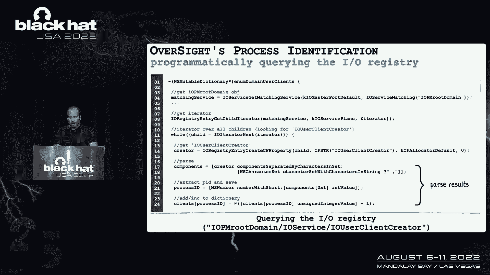
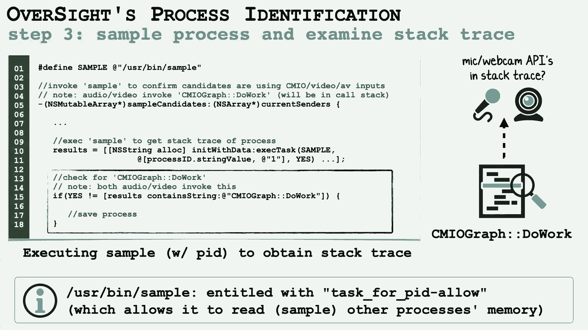
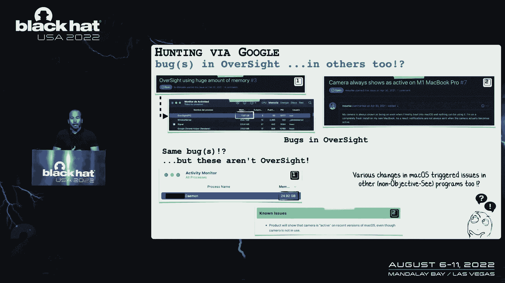
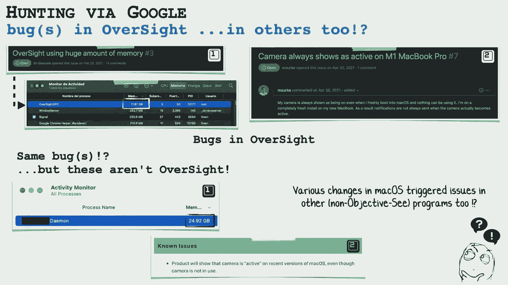
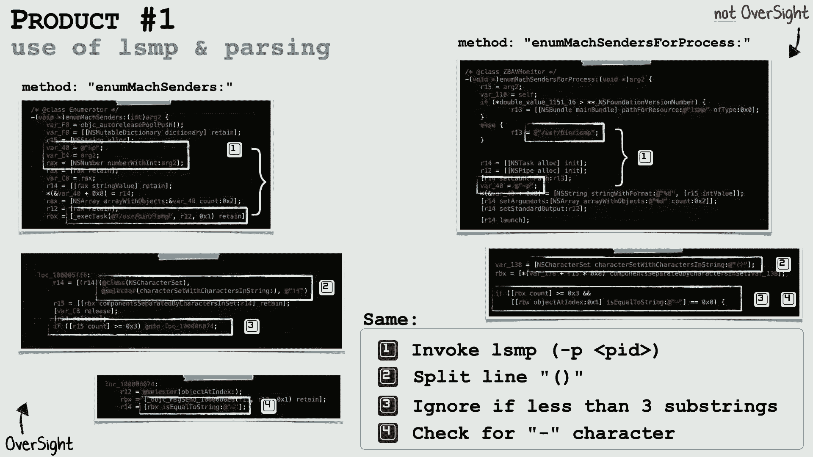
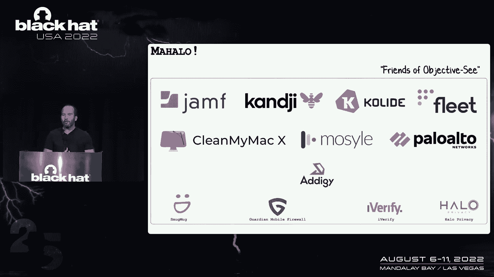

# P77：088 - Déjà Vu： Uncovering Stolen Algorithms in Commercial Products - 坤坤武特 - BV1WK41167dt

所有的权利，欢迎来到一个关于发现商业产品中被盗算法的讲座，我是帕特里克·沃德尔，今天我很高兴能和我的好同事和朋友一起演讲，汤姆·麦奎尔，他也是约翰霍普金斯大学的讲师，所以今天我们想和你谈谈一个问题。

我们认为这是一个影响我们社区的系统性问题，这就是被盗算法在商业产品中的广泛使用，如果它能发生在我们身上，它正在发生在别人身上，可能也会发生在你身上，所以在这里我们将首先介绍受害者应用程序。

然后我们将讨论我们如何能够找到并证明商业产品，我们正在使用它的闭源算法，然后展示我们最终是如何以双赢的方式解决这个问题的，所以首先让我们谈谈监督，受害人，在谈话的这一部分。

我们将讨论监督并向您描述其算法的细节，它的内部，这与证明其代码被盗并在商业产品中实现有关，所以监督是一个很简单的，你写的非常简单的实用程序，真的，它是在2016年作为一个免费但封闭来源的应用程序发布的。

它的目标很简单，相当直截了当，随时提醒你任何东西访问麦克风或网络摄像头，并准确地确定负责此类访问的进程，这种能力能够识别正在访问的活动进程或麦克风，麦克风或网络摄像头是监督最独特的功能。

当时没有其他工具有这种能力，监督主要是为了检测秘密恶意软件，可能会以零日漏洞溜到您的系统上，如果这样的恶意软件，尽管试图访问麦克风或网络摄像头，不是监视你，或者你知道，打开麦克风把你的系统变成一个房间。

音频捕获设备，监督会对这种行为发出警报，这个动作，即使它对恶意软件没有先验知识，疏忽也很擅长检测零日漏洞，尤其是那些针对麦克风和网络摄像头访问的，比如说，缩放中的远程bug。

甚至被幻灯片上的恶意软件利用的零天，我们可以看到一些监督在行动的例子，探测这种利用，无意的最终疏忽，在报道行为不端的好应用程序方面发挥了关键作用，比如说，它揭示了一个事实。

即Mac OS上的Shazam过去总是倾听，即使关机也不理想，现在回到"上级要员"的杀手锏，这就是我提到的识别能力，访问麦克风或网络摄像头的过程是什么，显然这是一个基本特征，对呀，这应该是允许的对吧。

在这种情况下，我们可能甚至不想提醒用户，但如果是某种民族国家恶意软件，偷偷进入你的设备，并试图通过微型监视你，网络摄像头，显然这是上级要员应该警惕的，正如我当时提到的，没有其他工具有这种能力。

问题是为什么不，我们可以在幻灯片上看到，虽然这真的很容易，和大约十行代码从操作系统获得通知，从Mac OS来看，麦克风或网络摄像头已经被激活，所以说，现在让我们确切地看看监督是如何识别负责任的过程的。

再次试图访问麦克风或网络摄像头的过程，现在有点牵扯，并利用Mac OS的各种未记录的特性，现在了解这种方法，虽然，在商业产品中找到它是必要的，然后也，你知道的，了解它的工作原理。

允许我们证明它是被盗使用的，所以监督使用三个步骤，我现在会仔细检查每一个，首先，它枚举模拟消息，所以当一个进程想要访问麦克风或引擎盖下的网络摄像头时，与麦克风或网络摄像头对话的系统API或框架。

我们将发送所谓的模拟信息，对着麦克风或摄像机，Damon，负责系统流程的负责人，直接与微型网络摄像头交互，上级要员说很酷，让我列举一下这些模拟消息，这样我就可以了解他们最近的过程。

或者当前正在再次访问网络摄像头中的麦克风，目的是确定哪一个是主要的，活跃的那个，现在，不幸的是，Apple不允许您枚举来自其他进程的模拟消息，所以上级不能直接这么做，原来，虽然。

Mac OS附带了一个名为LP列表模拟端口的实用程序。

它有必要的权利来进行此枚举，所以监督在代码中做什么，它只是执行LP吗，我们可以在幻灯片上看到这个，执行LP非常简单，它的命令行实用程序内置在moos中，现在，有点难，再多做一点工作，尽管解析其输出。

因为LP不是为了以编程方式使用而设计的，的输出，所以我们在幻灯片上有一些片段，我们基本上可以看到我如何解析输出，拉出发送麦克风或网络摄像机的进程，达蒙现在有模拟信息，正如我提到的，我们真的很感兴趣。

主动访问麦克风或网络摄像头的人，监督也需要另一种机制。

所以我做了更多的逆向工程，这有点类似于Windows上的注册表，有各种未记录的键值对，它们又有一个列表，最近访问麦克风或网络摄像头的进程，或目前正在再次这样做，这些没有时间戳。

所以我们不知道到底是哪一个，又是这样，这是上级要员的密码，它的内部算法，我们可以看到我们直接访问I，o，幸运的是，在这种情况下，我们可以直接访问I，o，登记册，我们不必执行任何其他外部命令行实用程序。

正如我们在幻灯片上看到的，我们要做的是在io用户创建者密钥下寻找进程。

再次在IOM根域下，不过，一旦我们得到这些信息，我们必须解析它，因为它也不是为了以编程方式摄入而设计的，终于，从他们那里获得堆栈或回溯，我们需要最后一步，因为来自LP和I O的进程列表。

我们再次寻找访问麦克风网络摄像头的确切对象，我们还希望避免假阳性，类似于枚举模拟消息，Apple不允许您采样或读取其他进程的远程内存，所以又一次，我们必须利用Mac OS中内置的命令行实用程序。

有正确权利的人，特别是，示例实用程序，在幻灯片上我们可以看到我们只是执行示例实用程序，抓取它的输出，然后具体分析，我们在找字符串cm下划线io图，做工作，这是一个方法名和API，它将被一个进程调用。

该进程正在主动访问麦克风或网络摄像头，因为我们刚刚对这个过程进行了采样，我们可以看到堆栈或线程跟踪有这个键，你有这三个步骤，监督，能够准确一致地识别访问微型网络摄像头的过程，再加上它是免费的。

使它相当受欢迎，广受欢迎，不幸的是，尽管这种受欢迎是有代价的，所以现在我们要谈谈监督是如何被撕裂的，它的秘密被无耻地窃取以获取商业利益，首先呢，这怎么可能，对呀，有人黑进我的电脑了吗？窃取源代码，否。

实际上那样比那样简单得多，任何拥有反汇编器和基本逆向工程知识的人，可以简单地对监督应用程序进行反向工程，技术上微不足道，没那么多，尤其是考虑到这是偷一个免费的工具，从一个非营利组织为了商业利益给我。

这是一条明显的界限，也是，值得注意的是，监督的算法首先是，非常独特，对呀，它是基于大量的逆向工程，操作系统的许多未记录的功能，事实上，如果你谷歌算法的核心组件，谷歌上没有点击量，因为再一次。

它也是无证的，我有点不好意思承认这一点，算法有点笨拙，我是说，首先也是最重要的，我是一名安全研究员，不是软件工程师，你知道，要相信这种说法，即疏忽，你知道可能有点脆，我们将看到。

当苹果向Mac OS推出最新的安全更新时，疏忽被可怕地打破了，一线希望，不过，如果公司逐字复制监督代码，这意味着他们的代码也可能有这些未记录的字符串，甚至可能是同样的虫子，类比，我喜欢给的是。

我们考虑剽窃，如果有人抄袭你写的东西，未记录的特征，或者你的拼写和语法错误，臭虫，如果你发现他们这样做，证明这一点是微不足道的，那么这一切是如何开始的呢，你知道吗，我从没想过"上级要员"会被偷走。

所以我其实不是在找这个，但几年前，我在分析一个被标记为恶意客户端的二进制文件，我一开始看它，我意识到没有真正的恶意软件，它更像是一个潜在的不需要的程序或潜在的不需要的应用程序，其中一个安全程序。

很多时候会告诉用户，他们的系统被感染了，即使他们不是，然后尝试获取信用卡信息，我正要忽略它继续前进，但后来我注意到一些很奇怪的事情，它正在执行LP实用程序，现在，这又是一个未记录的功能。

Mac OS组件，我有点像，嗯哼，那很有趣，也是，我查阅了这个实用程序的营销材料，我看到他们声称可以保护麦克风和网络摄像头，出于隐私原因，所以我深入研究了这个，越来越多，我做得越多，我就像。

我以前见过这个代码，这看起来像是疏忽，现在大约在这个时候，苹果也推送了更新，打破了监督，我之前提到过是的，有点脆，所以在幻灯片的顶部。

我们有一些漏洞报告是由监督的用户提交的，我们可以看到它有大量的内存泄漏，不正确的报告，虽然这确实是苹果在M One系统上打破的东西，但不管怎样，监督头虫，所以我做了每个软件开发人员都会做的事情，你知道。

跳上谷歌，找出修复方法，我发现用户抱怨类似的问题，我的记忆正在被利用，摄像机一直开着，当它不应该，我首先想哇哦，对不起，你们都喜欢，我知道，这是一个流行的实用程序，但我真的很难过，你知道吗。

粉碎你所有的电脑，嗯，原来他们对这些同样的抱怨，在监督中的确切错误实际上归因于其他过程，其他方案，其他软件。

我就想等等，其他公司是否又复制了我的代码，他们一字不差地复制了bug和所有，正如我们将看到的那样，情况就是这样，所以在这一点上，我决定做一些更积极主动的狩猎，也许还在寻找其他肇事者。

所以我根据疏忽算法制定了一个简单的YARA规则，现在你们中的许多人可能都熟悉使用Yarra检测恶意软件签名，但当然你可以用它来检测任何二进制文件，例如，幻灯片上的那个，只是在寻找LP字符串。

写了一个纱罗，跑了一堆这个，你知道，在互联网上，在二进制文件的大尸体上，又发现了几个二进制文件，基于初始分诊的几种商业产品，看起来可疑地类似于监督，所以在这一点上，我有一些商业产品。

乍一看似乎与我的实用程序非常相似，当然啦，所以我们必须深入挖掘来证明，毫无疑问，这些商业产品中的代码直接来自监督，所以现在，汤姆将讲述我们如何证明等价性，在监督和这些商业产品之间。

所有的权利，谢谢帕特里克，正如帕特里克指出的那样，我们有三个不同的样本有效地从我们可以看到的搜索中，所以我们想做的是找出它们的相似之处，关于守则，来自监督和这些产品的代码，从恶意软件分析。

从bug报告或规则，和本节，如果你看左手边，这都是疏忽代码，右手边是产品，我们将在这里讨论三种不同的产品，在这一点上，这个疏忽仍然闭源，正如帕特里克提到的，算法本身是关于方式的独特性。

我们可以找出并将这些与监督初始算法联系起来，正如帕特里克指出的那样，算法很脆弱，尤其是当我们开始看这张幻灯片的时候，我们看到LP执行它的用法，然后以一种低效的方式解析它，我代表帕特里克说。

可能有很多不同的方法可以做到这一点，对不起，你的红贾克斯会是更好的方法，但如果你看右手边，你真的看不出来，您看不到对此进行的任何优化，所以这给了我们一点保证，这个特殊的应用程序开始寻找相机和麦克风。

以类似的方式，那个疏忽做得对，严格LP，在括号上拆分，寻找右边里面的坑，一直到那些细节，如果你看，我们已经提到了方法名称，那些很相似，但当你把事情颠倒过来的时候，这不一定是决定性的。

这也可能是查看其他组件的另一种方法。

但当我们开始进一步挖掘时，我们思考帕特里克所说的，对疏忽算法的三个独特组件进行排序，我们现在看到了第一部分之后的第二部分，在这种情况下，它也是，我，o，注册表查询相同的值，同样。

这些是未记录的API和未记录的组件。

所以说，它执行这个的方式有点独特，穿过，寻找那些再次分裂的人，我们可以做一些更有效的事情，但在这个特殊的案例中，我们看到同样的方法，这种更多的第三个组成部分是，在我看来是独一无二的。

Apple提供了示例实用程序，允许您使用，你知道吗，痕迹和回溯痕迹，所以你可以找啊，它在执行什么，在我们的特殊情况下，有一点是它是相当侵入性的，对呀，它停止了这个过程，必须经过并取样。

所以你知道它不是一个被动的组件，在这里被利用，正如帕特指出的那样，监督算法采用前两个组件，把它们相交，试图看看是否有一个独特的它，如果没有，继续第三步，试图找到独特的它，目前可以访问摄像头和麦克风。

如果你看看这两个产品，我们在左边和右边又有了疏忽，这里的独特之处在于样本是执行的，而且正在寻找的是非常独特的对吧，CI图做功是，当应用程序可以访问摄像机或麦克风时。

这是将被踢出并在处理之前实际执行的线程，所以如果它目前确实可以访问它，它会在回溯痕迹中显示出来，所以当我们取样的时候，我们会在里面看到的，这就是你看到这个的原因，用那种方式做，在谈话之前。

没有很多CMI图做工作，你会看到它们与一些过程有关，撞车，一些资源使用，但没有任何与这个具体案件有关的，所以它是非常独特的，所以把这三个放在一起就给出了算法的一个很好的图像，这是一个疏忽。

现在在另一个产品中，所以我们也把这个带到了下一个产品中，对于这个来说，这只是一个产品，但现在我们看这个。

这是用不同的语言写的，好吧，这个是用斯威夫特写的，所以你可以看到有一些，转换到另一种编程语言的努力程度，可能是为了适应框架和任何产品，但如果你从拆卸的角度来看，它仍然符合监督用于LP的逻辑。

在圆括号上拆分的行上右x execusplit再向右，可能有一只雷克斯和这里发生的一切，但这表明我们在这个产品中仍然有，算法的第一部分也是，再挖一点，我们在这个产品中得到算法的第二部分，看着I O。

登记册，查找相同唯一值的键值对，这样它就可以去识别特定的它，模拟端口的摄像头麦克风，在这种特殊情况下，和前两个一模一样，所以这是一个很好的指标，这个特定的算法也适用于这个产品，当我们看第三个产品时。

在这种情况下，我们将看到三个不同的组件非常相似，但有一些轻微的变化，主要是想，我想增强解析实用程序，所以在这种情况下，雷克斯，所以在这些基础上有一点改进，但尽管如此，核心逻辑仍然存在，并且在这些。

所以在这里你看到了，精确，在线条上分裂，它将通过雷克斯，再找一次付钱吧，几乎一模一样，呃，在I O中，再次查询注册表，你可以看到特别的，呃，我们看到的值键值对，这与监督的方式相同，最后，在本例中。

我们还看到示例实用程序的执行，并引入CMI图，这是相机麦克风框架的一部分来进行分析，以确定此特定进程中的摄像机或麦克风处理当前是否处于活动状态，对呀，所以这里我们有三种不同的产品现在有这些组件。

嵌入其中的监督算法的核心组件，很明显。

所以我要去找帕特。

让他说完一些关于这件事的好消息，谢谢汤姆，所以在这一点上你知道，通过逆向工程，本质上窃取了它的算法，所以你知道，我想简短地结束，谈谈如何，我们可以解决这个问题，把这个变成一个幸福的结局，现在很明显。

我要去联系肇事者，但我学得很快，有一种获胜的方法，首先你需要明白你的目标是什么，你要钱吗，你想不想，你知道吗，公开谈论他们，把他们打倒在地，你想让他们删除代码吗，真正知道你想要什么。

因为当你接近他们的时候，他们通常会回来说好吧，你想要什么，先弄清楚，然后也创建证明权，我想正如汤姆所展示的，我们有无可辩驳的证据，但是，你必须考虑到这样一个事实，你可能会和法律团队或知识产权团队交谈。

在这些商业或公司实体，然后我可能不明白寄存器值，等等，等等，所以是的，提供证据，但也试着解释它，以一种可能更高水平的方式，与那些可能没有很低技术技能的人一起消化，说到律师，找自己的律师也是个好主意。

这是可选的，但强烈推荐，我没有别的可以告诉公司你有一个，我注意到在一些场景中，公司没把我当回事，当我提到我有一个律师，他们真的开始和我聊天更多，我要感谢F，我直接和他们一起工作，如果你不熟悉F。

开发人员和非营利组织，所以他们非常有帮助，所以我真的想花一点时间来感谢他们，最后一旦你有了，你知道的，你的目标定义了你的证明，你身后的法律团队，你知道的，专业地伸出援手，别在推特上发火。

除非你的最终目标只是制造混乱，现在这些公司想要什么，很高兴知道他们中的大多数人想要一个友好的解决方案，当我开始做这个的时候，这是我学到的东西，我真的不知道，这是大多数侵权案件。

实际上是一个可以说非常天真的开发人员的结果，与整个公司的恶意，所以当我开始的时候，我发现这些肇事者，我有点像男人，这些邪恶的公司试图从，你知道的，它真的变得更加细致入微，那么公司想要什么呢，一般来说。

他们想确保两件事在法律上一切都好，一旦你接近他们，你知道他们意识到发生了什么，所以首先，他们通常想要一个许可协议，经常追溯适用，这基本上意味着他们在法律上摆脱了困境，然后通常他们也不想被贬低。

这也是可以理解的，尤其是在单个开发人员的情况下，又一次天真地受到责备，而且是的，这些公司愿意付钱，所以说，让我们再来看看从中产生的一些双赢的决心，这些是来自一些公司的直接通信，他们负责从监督处窃取代码。

注意到这三家公司也承认了过错，那个是的，对监督进行了逆向工程，并以未经授权的方式用于商业利益，首先承认这个问题，发送电子邮件，是啊，是啊，我们的坏，其次，他们说，好的，我们将采取积极主动的措施。

从我们的产品中删除未编写的代码，这是伟大的，然后第三个，最重要的是，他们说，你知道嘿，我们能得到追溯许可证吗，我们愿意在经济上补偿你，赔偿许可证的一切，所以又来了，这是一种双赢的又一次双赢的回应。

有点相似，公司明确承认不当使用，删除了代码，所以再一次，那种双赢，所以说，让我们用一些外卖来结束这一切。

首先也是最重要的，如果您是开发人员，别像我一样天真，以为你的代码不会被偷，即使是闭源的，所以不幸的是，这意味着你必须积极主动，而且是的，这是额外的工作，但是也许使用我们在这个演示中谈到的方法。

看看公司是否在窃取你的工作，如果是这样，您也可以采取我们描述的步骤来伸出援手，并希望以互利的方式解决，或者至少现在对你有益，如果你是一家公司，教育你的雇主是非常重要的，关于这个话题的员工。

甚至只是重申窃取代码是不行的，就像我想的那样，这很明显，但显然，从公司的角度来看，情况并非如此，这是显而易见的，因为这将避免法律和光学问题，对呀，这样做确实是明智的。

一些好的想法可能是实施内部程序来检测这一点，也许扫描你的源代码，或者在开发人员实现新特性时询问他们，1。你从哪儿弄来的，在我的职业生涯中，我在许多大公司工作过，当我实现一个新功能时，从来没有一次。

有人问我，帕特里克，这是你偷的吗，1。你从哪儿弄来的，我是说对我来说，道德上，那是我不愿意跨越的界限，但还是没有人和我登记并问，最后，这对你的公司非常重要，如果有人接近你，尤其是和，你知道证据。

并试图非常专业，在情感上成熟友好，现在有一些情况，公司最初否认了一切，它只是令人震惊，但你知道我们都，我们都去了一些地方，所以我认为有很多机会打壁球，在它成为一个问题之前，我想你知道，大多数公司意识到。

一旦到了这个地步，对每个人来说都有问题，所以再一次，如果他们只是采取这些步骤来教育他们的开发人员，也许你知道在这个场景中，如果你知道，Patrick的工具有一个很好的特性，这是另一家公司想要的。

也许有一种方法可以做到这一点，我们将联系并讨论许可协议，对呀，这是一个相当标准的程序，你知道的，偷窃，然后在门襟的幻灯片上结束，在我们进入Q和A之前，这是一个总结。

我只想简单地感谢那些支持Objective C基金会的了不起的公司，我们正在做的所有以社区为中心的工作，我还要感谢黑帽会议，允许我们就这个有点争议的话题发言。

最后感谢在座的各位。