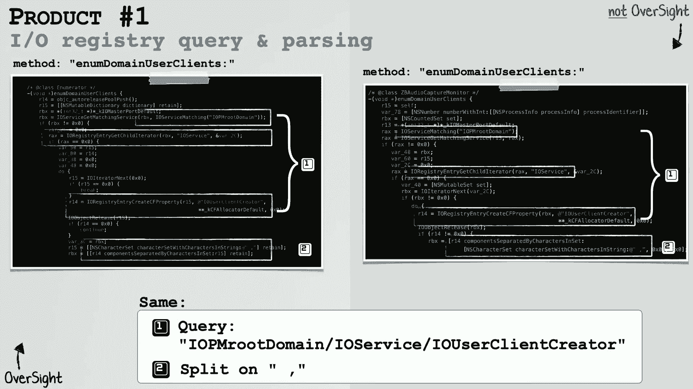
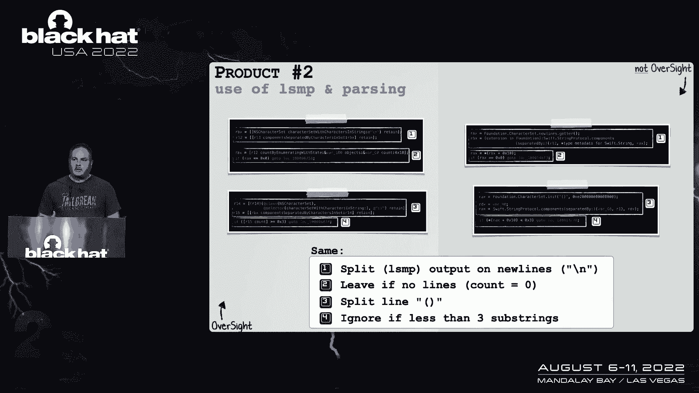
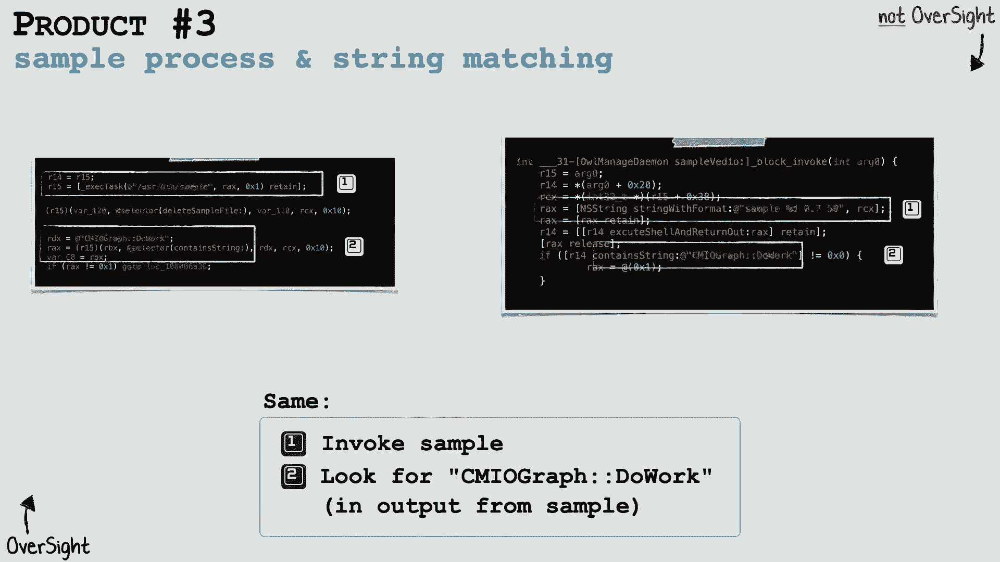

# 课程 P77：088 - 商业产品中的算法剽窃：发现与应对 🕵️♂️

在本节课中，我们将学习如何发现商业产品中被盗用的闭源算法，并通过一个真实案例——名为“OverSight”的应用程序——来了解从发现、取证到友好解决的全过程。我们将重点介绍算法的独特构成、如何通过技术手段证明代码被盗，以及如何与侵权方进行有效沟通以实现双赢。

---

## 受害者应用程序：OverSight 简介

上一节我们介绍了课程主题，本节中我们来看看受害者应用程序“OverSight”。

OverSight 是一个在2016年发布的免费但闭源的实用程序。它的目标很简单：当任何进程访问麦克风或网络摄像头时，向用户发出警报，并准确识别出是哪个进程在访问。这种能够识别正在访问麦克风或摄像头的活动进程的能力，是 OverSight 最独特的功能，当时没有其他工具能做到这一点。

OverSight 主要用于检测可能通过零日漏洞潜入系统的秘密恶意软件。即使对恶意软件没有先验知识，它也能对这种访问行为发出警报。因此，它在检测针对麦克风和摄像头的零日漏洞方面非常有效，例如 Zoom 中的远程漏洞或被幻灯片中恶意软件利用的漏洞。

OverSight 在报告行为不当的应用程序方面也发挥了关键作用。例如，它曾揭示 Mac OS 上的 Shazam 应用即使在关闭后也一直在监听。

---

## OverSight 的核心算法 🔍


上一节我们介绍了 OverSight 的功能，本节中我们来看看其识别进程的核心算法是如何工作的。了解这个方法对于在商业产品中找到它并证明其被盗用至关重要。

OverSight 使用三个步骤来识别负责访问麦克风或网络摄像头的进程。


**第一步：枚举模拟消息**
当一个进程想要访问麦克风或摄像头时，系统 API 会向负责与硬件交互的守护进程（Damon）发送模拟消息。OverSight 试图枚举这些消息以了解是哪个进程在访问。然而，Apple 不允许直接枚举来自其他进程的模拟消息。

因此，OverSight 利用了 Mac OS 内置的一个名为 `lsof` 的命令行实用程序，该程序拥有进行此枚举的必要权限。OverSight 在代码中执行 `lsof` 命令。


```bash
# OverSight 执行 lsof 命令的示意代码
system("lsof -c Damon | grep 'Mic\\|Camera'")
```

然后，它需要解析 `lsof` 的输出，提取出发送模拟消息给麦克风或摄像头守护进程的进程 ID。这个输出并非为编程解析而设计，因此解析工作有一定难度。


**第二步：查询 I/O 注册表**
仅凭第一步的信息，OverSight 无法确定是哪个进程在**主动**访问。因此，它进行了更多的逆向工程，发现 Mac OS 中有一个类似于 Windows 注册表的机制，包含各种未记录的键值对。其中有一个列表，记录了最近或当前正在访问麦克风或摄像头的进程（但没有时间戳）。

以下是 OverSight 访问 I/O 注册表的示意代码：

```objectivec
// 在 IORegistry 中查找特定键值
io_registry_entry_t entry = IORegistryEntryFromPath(kIOMasterPortDefault, "IOService:/IOResources/IOHDACodecDevice");
// ... 获取并解析相关进程信息
```

同样，这些信息也需要进行解析。

**第三步：获取进程堆栈回溯**
从前两步获得的进程列表中，OverSight 需要找出确切访问麦克风或摄像头的对象，并避免误报。由于 Apple 不允许读取其他进程的远程内存，OverSight 再次利用了系统内置的命令行实用程序 `sample`。

它执行 `sample` 命令来获取目标进程的堆栈跟踪（线程回溯），并分析其中是否包含一个关键的方法调用字符串 `CMIOGraph`。如果一个进程正在主动访问麦克风或摄像头，其调用栈中就会出现这个 API 方法名。

```bash
# 对进程进行采样并获取堆栈跟踪
sample <PID> 1 -file /tmp/stacktrace.txt
```

然后，OverSight 会分析输出，寻找 `CMIOGraph` 字符串。


结合这三个步骤，OverSight 能够准确、一致地识别出访问麦克风或网络摄像头的进程。

---


## 算法是如何被窃取的？ 💻

上一节我们剖析了 OverSight 的算法，本节中我们来看看这个算法是如何被他人窃取并用于商业产品的。

窃取过程在技术上并不复杂。任何拥有反汇编器和基本逆向工程知识的人，都可以对 OverSight 应用程序进行逆向工程。考虑到这是从一个非营利组织窃取免费工具用于商业利益，这种行为越过了明显的道德和法律界限。


OverSight 的算法非常独特，因为它基于大量的逆向工程和对操作系统许多未记录功能的利用。在谷歌上搜索其核心组件，几乎找不到任何信息，因为这些功能本身也是未公开的。

此外，作者承认该算法有些“笨拙”，因为它是由安全研究员而非专业软件工程师编写的。这一点后来成为了一个关键线索：当苹果发布新的安全更新时，OverSight 出现了严重的 Bug（如内存泄漏、错误报告）。如果一家公司逐字复制了 OverSight 的代码，那么他们的代码中很可能也包含这些未记录的字符串和同样的 Bug。这就好比抄袭文章时，连原作者的特有表达方式和拼写错误也一并抄了过去。

**发现过程：**
作者最初并非有意寻找剽窃者。几年前，他在分析一个被标记为“恶意”的客户端二进制文件时，发现它并非真正的恶意软件，而更像是一个潜在的不需要的程序。然而，他注意到这个程序正在执行 `lsof` 实用程序——这是一个未记录的功能。

查阅该程序的营销材料后，发现它声称可以出于隐私原因保护麦克风和网络摄像头。深入分析后，作者越来越觉得这段代码非常眼熟，看起来就像是 OverSight。


与此同时，苹果的更新导致 OverSight 出现 Bug，用户提交了大量错误报告。作者在谷歌上搜索修复方法时，发现其他商业软件的用户也在抱怨完全相同的问题（如内存被利用、摄像头常亮）。这些用户将问题归咎于“其他软件”。这促使作者怀疑，是否有其他公司复制了他的代码，并且连 Bug 也一并复制了。



为了主动搜寻，作者根据 OverSight 的算法制定了一个简单的 YARA 规则（YARA 通常用于恶意软件签名检测，但也可用于检测任何二进制文件中的特定模式）。例如，规则可以搜索执行 `lsof` 的代码模式。运行这个规则对大量互联网上的二进制文件进行扫描后，作者发现了几个商业产品，其代码与 OverSight 惊人地相似。

至此，作者锁定了几款涉嫌剽窃的商业产品，但需要更深入的证据来证明。

---

## 证明代码等价性：技术取证 🧾



上一节我们了解了发现过程，本节中我们来看看如何通过技术手段，无可辩驳地证明这些商业产品中的代码直接来源于 OverSight。

我们通过逆向工程，对比了 OverSight 与三款可疑产品的代码。OverSight 算法的独特性及其脆弱性（如低效的解析方式）成为了关键的识别特征。

**以下是核心对比点：**

1.  **`lsof` 的执行与解析：**
    OverSight 执行 `lsof` 并以一种特定的、低效的方式解析其输出（例如，在括号上拆分字符串以提取进程 ID）。在涉嫌剽窃的产品中，我们看到了完全相同的执行命令和**完全相同的、未做任何优化的解析逻辑**。这强烈暗示代码并非独立实现。

2.  **I/O 注册表查询：**
    OverSight 查询特定的、未记录的 I/O 注册表键值对来获取进程信息。在涉嫌剽窃的产品中，我们发现了**完全相同的注册表路径和键值查询**。这种对未公开 API 的相同使用方式，是代码复制的有力证据。




3.  **`sample` 实用程序的执行与 `CMIOGraph` 搜索：**
    OverSight 使用 `sample` 命令获取进程堆栈，并搜索独特的字符串 `CMIOGraph`，以确认该进程当前是否在主动访问摄像头或麦克风。这是一个相当侵入性且独特的操作。
    在涉嫌剽窃的产品中，我们同样看到了**执行 `sample` 命令并搜索 `CMIOGraph` 字符串的代码**。这个特定的方法名与摄像头/麦克风框架相关，在公开讨论中极少出现，因此其出现具有高度指向性。

**针对不同产品的发现：**
*   **产品A：** 几乎逐字复制了 OverSight 的所有三个步骤，包括低效的解析代码。
*   **产品B：** 虽然用 Swift 语言重写，但反编译后，其逻辑仍然完全遵循 OverSight 用于 `lsof` 和 I/O 注册表查询的算法。
*   **产品C：** 核心逻辑与 OverSight 相同，仅在解析 `lsof` 输出时尝试使用了正则表达式进行轻微“改进”，但算法骨架未变。

将这三个独特组件的重复出现结合起来，构成了 OverSight 算法在这些商业产品中被实现的无可辩驳的证据。

---

## 如何解决问题：实现双赢结局 🤝

上一节我们完成了技术取证，本节中我们来看看如何与侵权方沟通，将冲突转化为双赢的解决方案。

在掌握确凿证据后，联系侵权方是下一步。但方法很重要：


1.  **明确你的目标：** 在联系对方之前，想清楚你想要什么。是要求经济赔偿？是希望对方公开承认并道歉？还是仅仅要求他们删除代码？明确目标有助于有效谈判。
2.  **准备证据并通俗化解释：** 准备好我们之前展示的那种技术对比证据。同时，要考虑到你可能会与公司的法务或知识产权团队沟通，他们可能不具备深度的技术背景。因此，需要用更高层次、易于理解的语言解释你的发现。
3.  **寻求法律支持（强烈推荐）：** 考虑咨询或聘请自己的律师。拥有法律代表可以增加你的谈判分量。在某些案例中，当作者提及自己有律师后，公司方才开始更认真地对待此事。
4.  **专业地联系对方：** 通过正式、专业的渠道（如邮件）联系对方公司，避免在社交媒体上公开宣泄情绪（除非你的目标就是制造舆论压力）。

**公司通常想要什么？**
大多数公司，在意识到问题后，也希望友好解决。他们通常希望：
*   **获得许可协议（通常要求追溯适用）：** 这能使他们在法律上“洗脱”过去的侵权责任。
*   **避免声誉受损：** 他们不希望此事被公开贬低或造成负面舆论。
*   **愿意经济补偿：** 为了达成上述两点，他们通常愿意支付赔偿或许可费用。


**实际成果：**
在 OverSight 的案例中，作者联系了几家公司，并得到了积极的“双赢”回应：
*   **承认错误：** 公司承认对 OverSight 进行了逆向工程并在未授权的情况下用于商业产品。
*   **采取行动：** 承诺立即从其产品中删除有问题的代码。
*   **寻求许可与赔偿：** 请求获得追溯许可证，并愿意为此支付经济补偿。

---

## 总结与启示 📚

本节课中，我们一起学习了商业产品中算法被盗用的完整案例。

**给开发者的启示：**
不要天真地认为你的闭源代码不会被窃取。需要保持警惕，可以主动使用类似 YARA 规则扫描、监控错误报告关联性等方法，来检查是否有公司窃取你的工作。如果发现，可以遵循本节课所述的步骤（明确目标、准备证据、寻求法律建议、专业沟通）来维护自己的权益。

**给公司的启示：**
对公司而言，教育员工尊重知识产权至关重要。应建立内部流程（如代码审查时询问来源、对引入的第三方代码进行扫描）来防止无意的代码剽窃行为。如果有人带着证据专业地联系你，应以成熟、友好的态度积极应对，寻求解决方案，这通常比否认和对抗更能避免法律和声誉风险。


通过教育、清晰的内部政策和负责任的应对，可以避免大多数此类问题，保护创新者，也维护企业自身的健康发展。