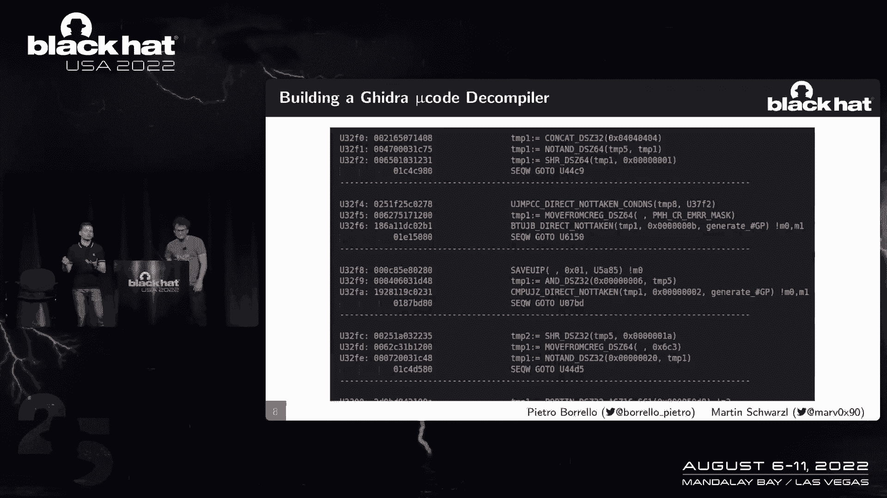
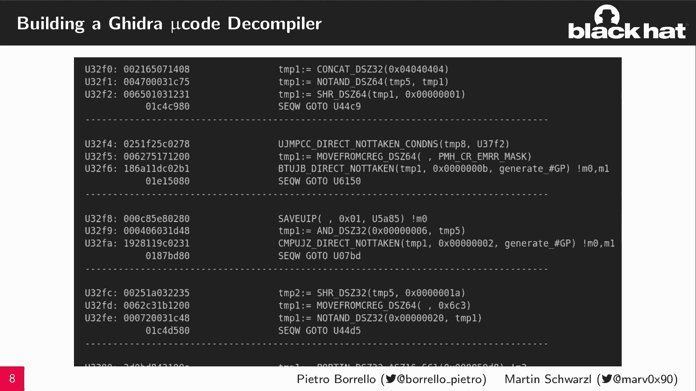
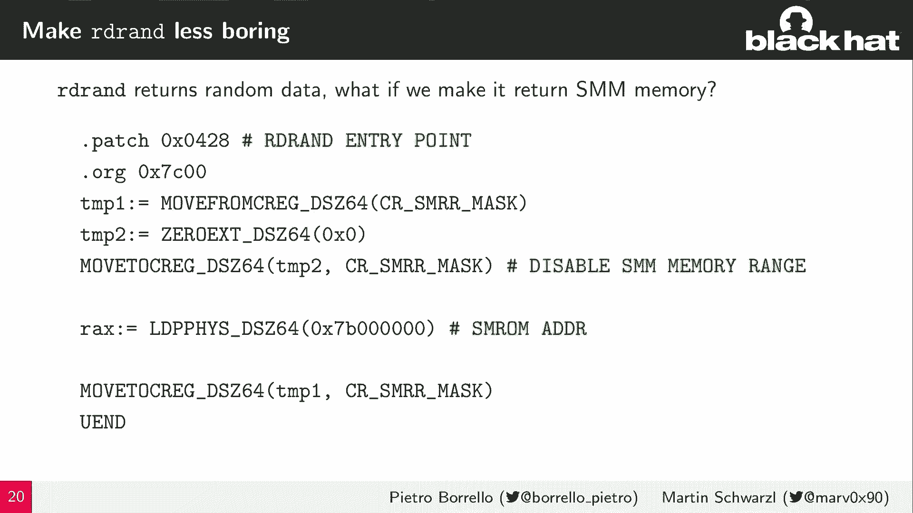
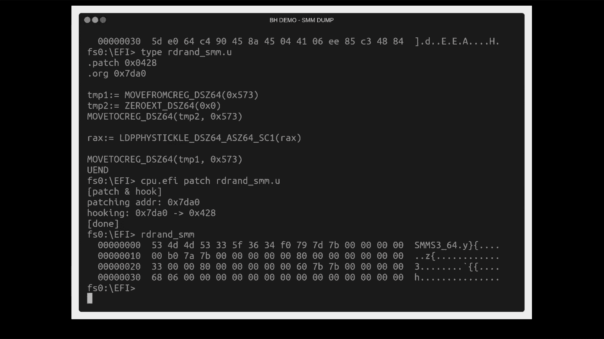
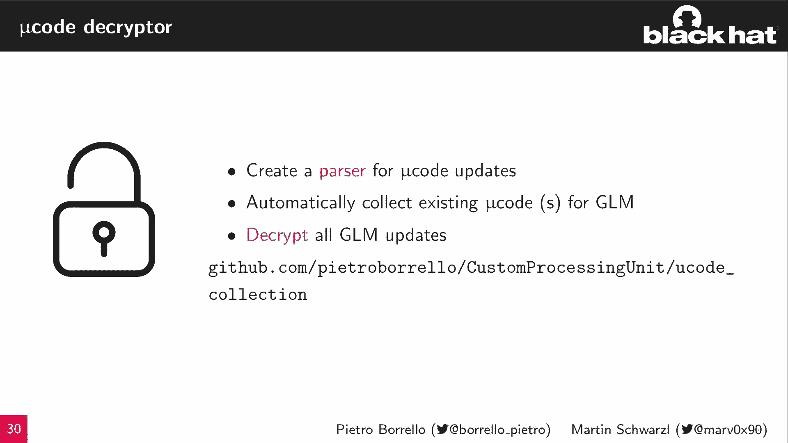
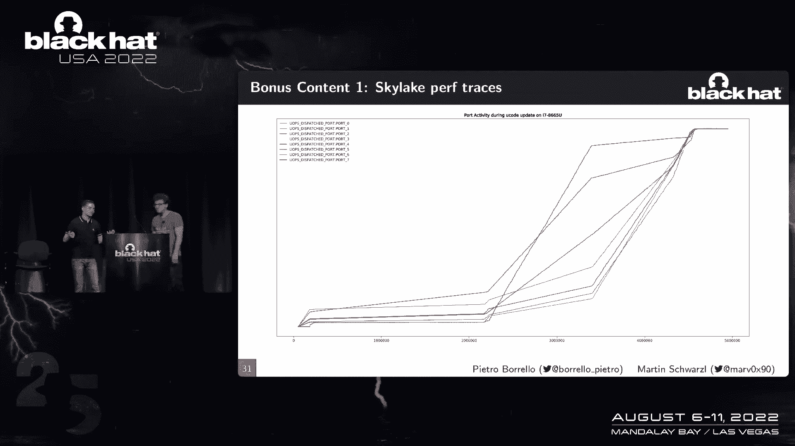
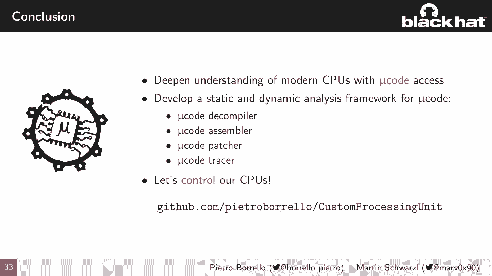

# 课程 P78：089 - 自定义处理单元：追踪与修补英特尔 Atom 微码 🧠💻

在本节课中，我们将学习 CPU 微码的工作原理，并介绍首个用于微码静态与动态分析的软件框架。我们将了解如何利用该框架对微码更新算法进行逆向工程，并最终实现对微码的追踪、钩取和修补。

---

## CPU 工作原理概述

在深入探讨微码之前，我们需要先了解 CPU 的基本工作原理。在大学课程中，大多数人知道 CPU 遵循 **取指-解码-执行** 的循环。

从高层视角看，CPU 前端负责取指和解码阶段，后端是执行引擎，中间是内存子系统，它们通过缓存等技术来加速处理。

然而，实际情况更为复杂。指令需要被高效执行，它们被翻译成微操作。大多数简单指令对应一两个微操作，例如寄存器访问。但有些指令需要更复杂的逻辑，例如 `CPUID` 指令，它包含多个“叶子”并根据输入条件执行。

为此，CPU 中有一个称为 **微码定序器** 的组件，它负责发出一系列微操作流，以实现复杂指令的逻辑。

---

## 微码初步：Red Unlock 发现

我们的研究基于 Positive Technologies 的 **Red Unlock** 发现，该发现由 Maryaolov 及其团队完成。

他们在 Intel 管理引擎中发现了一个漏洞，能够使 CPU 进入特殊状态并进行调试。通过读取特殊缓冲区（如缓存或段缓冲区），他们成功提取并逆向工程了 Goldmont 微码格式，并为此提出了反汇编方案。

基于此逆向工程，他们发现了一些新的未公开指令，这些指令允许控制对内部缓冲区的访问。

---

## 微码定序器与补丁机制

那么，微码定序器具体如何工作呢？假设有一条需要一系列微操作实现的复杂指令（如 `CPUID`）。CPU 中有一个翻译表，指令在此匹配，CPU 将接收并执行微指令来实现复杂逻辑。

微指令被组织成 **三元组**，每个三元组都关联着一个 **序列词**。序列词像一个序列号，可能影响微操作过程中的同步或控制流。

显然，微码可能需要修复。因此，CPU 支持一种内部内存（RAM），可以在其中编辑和修补微码。在这两个内部缓冲区（ROM 和 RAM）之间传递控制流，需要一个名为 **匹配补丁** 的组件。

每次执行指令时，如果指令需要跳转到 RAM（例如打了补丁的新指令），匹配补丁机制会将控制流重定向到 RAM 并执行那里的新指令。

---

## 微码结构分析

通过调查反汇编代码，我们发现微码指令是三元组管理，第四个操作总是一个空操作。序列词则定义了当前微码指令的属性。

观察微码结构，我们发现它类似于 x86 汇编：有分支指令、内部临时寄存器等。序列词指令指示下一条微码指令的位置。

微码是高度优化的。CPU 中的微码缓冲区很小，必须将所有实现功能的指令紧凑打包。因此，微码高度纠缠，多个函数之间共享代码块，这使得分析变得困难。

如果能从更高层次查看微码会很酷，但不幸的是，这就像查看没有源代码的编译器输出，因为相关文档不存在。

---

## 引入反编译器

为此，我们带来了一个 **反编译器**。它可以将微码转换为更易读的形式，例如，你可以看到 `RC4` 解密功能的伪 C 代码，这为逆向工程提供了一个清晰的起点。

在分析过程中，我们注意到微码总是与一个特定组件进行特殊交互，这个组件叫做 **CRBUS**。

为了更好地理解，我们必须了解 CRBUS 是什么。它是 CPU 用于与内部组件交互的总线。例如，MSR（模型特定寄存器）被映射到总线地址，其中一些实际上就像控制状态寄存器。系统管理模式配置也映射到总线上。

系统管理模式是 CPU 中的一个特权环（ring -2），通常不应被访问。配置也在这条总线上。另一个有趣的组件是 **JTAG**（或类似接口）。

---

## JTAG 与微码定序器访问

**JTAG** 是一个非常有趣的组件，英特尔在硅验证后使用它来访问 CPU 的所有内部缓冲区，例如 TLB 或加载/存储缓冲区。通过 JTAG，可以检查这些组件是否正常工作。

更重要的是，微码定序器可以通过 JTAG 访问。这意味着，通过 JTAG，可以访问并修改微码 ROM 和 RAM。

如果我们能访问 CRBUS，就可以控制微码。基本上，如果你能访问这条总线，你就控制了微码。

---

## 利用未公开指令

我们还需要一个构建模块：那些未公开的指令。Positive Technologies 的发现之一就是存在能够访问 CPU 内部组件的未公开指令，其中就包括 CRBUS。

我们可以利用这个原始指令，作为访问 Red Unlock 后 CPU 的 CRBUS 的简单方法。但问题在于，我们如何利用它来访问 JTAG 并修改微码定序器呢？

这时，我们的反编译器就派上用场了。我们可以分析微码如何使用 CRBUS 访问 JTAG 来修改微码定序器。我们可以简单地模仿 CPU 的行为，定义包装函数来访问 JTAG，从而实现对微码、序列词甚至匹配补丁的任意读写。

---

## 实现微码钩取与补丁

我们已经提到了匹配补丁机制。这类似于软件钩取：我想覆盖这个函数，并将其重定向到另一个函数。在微码层面，这真的那么简单吗？

是的。我们仍然可以利用反编译器来了解匹配补丁是如何被编程和使用的。每次我们想钩取或修补时，我们可以编程匹配补丁的地址，让它跳转到我们想要的指令。

总结一下：我们可以钩住微码，用我们自己的代码更新并覆盖它。现在，CPU 变得超级可定制了。

---

## 框架能力总结

这为我们的框架带来了核心能力：我们可以利用这些未公开的指令，通过软件为微码打补丁。这使得我们可以完全观察 CPU 的行为，并完全控制它们的行为。所有这些都是通过软件实现的，例如定制的 UEFI 应用程序或内核模块。

总结框架：我们现在可以修补代码、钩取代码、运行我们自己的自定义代码。我们甚至可以做得更多：我们可以追踪代码。

---

## 从补丁开始：改变 CPU 行为

首先从补丁开始。我们可以改变 CPU 的行为。请注意，通常只有英特尔被允许这样做，因为微码补丁是经过签名的，你不应该加载自己的补丁。但使用我们的框架，我们可以注入微码补丁来彻底改变 CPU 的行为。

我们可以改变微编码指令，甚至为 CPU 添加新功能。也许现在听起来太复杂了，让我们做一个简单的程序，比如在微码中实现一个 “Hello World”。

---

## 示例：微码 “Hello World”

让我介绍第一个微码 “Hello World”。我在想我们能用一个指令做什么。让我们选择 `RDRAND` 指令，它应该为你提供一个密码学强度的随机数。

让我们修补它，让它返回 “Hello World”。使用我们的框架，你可以选择我们想钩住哪个指令，然后指定跳转到哪条指令。你可以看到，我们有两个微操作将 “Hello World” 加载到寄存器中，这样你就不会得到随机数，而是得到 “Hello World”。然后，你只需让指令流继续执行。

我们还需要一个组件：**微码汇编器**。我们的框架可以从微码的文本表示进行翻译。我们需要与微码定序器交互，实际上就是编写微码。因此，我们汇编微码，将其写入我们设置的地址（例如 `0x700`，这类似于 DRAM 的起始地址），然后设置匹配补丁。这样，每次你执行 `RDRAND`，你实际上会返回一个单词。

这个例子很好，但我想大家想看更多。

---

## 更深入的示例：访问受保护内存

我们知道 `RDRAND` 返回随机数据。让我们改变它。我不喜欢随机数据，我想看些有趣的东西。让我们让 `RDRAND` 返回系统管理模式内存地址。

系统管理模式是 CPU 中的一个隔离环境（ring -2），你显然不应该访问它。但我们可以改变 `RDRAND` 指令的微码，让它加载 SMM 地址。如果你现在从这里读取会发生什么？

你会读到一堆 `0xFF`。如果你从飞地外部访问飞地内存，内存保护单元会保护该区域，你将无法访问。但我们在微码层面，所以我们可以改变这一点。

利用我们的框架，我们可以了解 SMM 配置在 CRBUS 中的位置，并将其清零，这样这个 SMM 区域就不再受保护了。但之后你可能会破坏 CPU，因为它禁用了内存保护。因此，你可以在修改前后保存和恢复 SMM 配置。

---

## 演示：动态修补

为了让人们相信，让我们展示一个演示。例如，我们在 UEFI 应用程序中有一个简单的程序，它转储 `RDRAND` 的结果，通常是随机数据。但我们可以用补丁对 CPU 进行编程来改变它，让它返回我们指定的单词。

使用我们的 CPU 框架和自定义处理单元框架，我们钩住补丁。下次你执行程序时，你会得到我们指定的单词。这非常酷。

关于系统管理模式，让我们做更酷的事情。我们仍然有一个简单的程序，一个充满 `RDRAND` 内容的缓冲区，这显然是随机的。但让我们应用我们的补丁（之前看到的补丁，修改为转储不同的地址）。下次我们执行转储内存的程序时，你实际上转储了系统管理模式内存，你可以在那里看到 SMM 的头部。

---

## 微码钩取与追踪

更进一步，如果我们设置这个匹配补丁机制，并在某些事件中执行自定义微码会怎样？我们可以在不停止执行的情况下继续运行。我们实际上不需要修补东西，但我们可以观察事物。

这就引出了 **微码钩取**，你可以在其中执行更多代码，扩展某些功能，或者进行观察。例如，在执行指令之后，你甚至可以劫持它而不会被察觉。

我们可以制作自己的性能计数器。假设你想观察 CPU 中的某些东西，但现有的性能计数器不够好。例如，你想观察每次执行 `WBINVD` 指令（该指令会刷新内部缓冲区，用于缓解 MDS 漏洞）的次数。我们可以利用钩子钩住要跟踪指令的入口点，然后继续执行。在我们的钩子中，我们可以实现一个简单的计数器，每次执行指令时递增。这样，你就有效地定义了自己的性能计数器。

我们还可以用钩子做更聪明的事情。如果我们定义一个钩子，每次触发时转储时间戳，然后你可以为 CPU 中的每一个微操作编程这个钩子。每次执行微操作，你将在执行微操作的地方转储时间戳。最终，你将拥有所有钩子触发的时间戳。然后你可以重新排序，从而有效地获得在 CPU 中执行的微操作的跟踪。这基本上导致了 **微码控制流重建**，你可以清楚地了解内部发生了什么。

你可以有效地对在 CPU 中执行的微码进行动态跟踪。

---

## 逆向工程微码更新算法

现在我们有了所有的构建模块来查看微码更新例程。那么，我们能利用这些追踪做什么呢？我们可以应用这些追踪来观察微码更新期间所做的一切。

我们这样做是为了微码更新。如果你静态地看微码更新代码，会发现大量代码，即使有我们的反编译器，逆向工程也很困难。但有了追踪就好多了，因为你可以准确地观察更新中采取的控制流。

现在，我们可以触发微码更新，然后追踪执行了哪些微码指令。我们重复所有可能的微码指令，然后恢复顺序，查看时间戳。我们可以确切地看到哪些微码指令被访问。

这样，你就有效地对英特尔一直保密的微码更新算法进行了逆向工程。

---

## 微码更新流程分析

微码更新通常由写入特定 MSR 触发。CPU 做的第一件事是应用更新并解密它。因此，它首先将更新移动到一个秘密位置，例如物理地址 `0xFEC00000`。这是一个特殊的物理地址，CPU 把微码更新放在那里。

我们可以看看我们逆向工程的微码更新格式。在开头，有一些数据：公布微码数据的日期、CPU ID、安全版本号。然后你有一个 **随机数**，我们稍后会重点讨论，但它用于生成解密的密钥。然后你有一个加密的更新和签名，用于验证微码更新实际上来自英特尔。

更新过程中发生的第一件事是检查随机数是否符合预期。CPU 有一个允许的随机数模数列表，这样它就知道更新没有被篡改。然后必须生成密钥来解密更新。CPU 使用两个不同的秘密来实现：一个秘密是嵌入在每个微码更新中的随机数（每次更新都不同），另一个是每个 CPU 都有的永久性秘密。CPU 将随机数和永久秘密一起使用，通过基于哈希的密钥派生函数算法生成解密密钥，然后生成 RC4 密钥。

生成了 RC4 密钥后，他们丢弃前 0x200 个字节，因为这些字节与密钥字节太接近。然后，CPU 可以解密更新。显然，在解密之后，需要检查加密的更新是否正确签名。因此，计算 SHA-256 哈希，结合元数据和随机数，这样你就不能篡改它。如果验证成功，那么你终于可以应用微码更新了。

---

## 特殊物理地址的奥秘

一开始提到的奇怪地址是什么？这些地址是 CPU 使用的特殊物理地址，用于保存微码更新。如果我们查询操作系统，操作系统将不知道这些地址的用途。我们也可以尝试读取这个地址，如果访问未受保护的内存飞地，我们只会读到 `0xFF`。所以一定有什么特别之处。

我们应该进一步调查，也许用我们的框架来看看发生了什么。我们可以看到 CPU 对这个地址做了什么：每次执行微更新时，CPU 会像设置总线位一样启用此地址。我们可以在这个地址周围设置钩子，测量启用此地址时的访问时间，结果令人惊讶：只有大约 20 个周期。内存访问通常很慢，但这个地址快得惊人。

我们还可以观察到，此地址的内容不在 CPU 核心之间共享，就像 CPU 在这个地址上有本地视图。我们只能加载相对较少的数据量，即使映射的区域要大得多。然后我们观察到替换策略：当我们写入数据时，有时会丢失数据。

这让我想起了一些事情：20 个周期、超级快、不在核心间共享、适合一定大小、有替换策略。这表明它是一个 **缓存**。我很担心这个：CPU 通过这个物理地址在 L2 缓存上有一个特殊的视图，专门用于微码更新。它看起来像一个无法从其他核心访问的私有缓冲区。

---

## 解密后的微码结构

最后，我们得到了解密的微码。你可以看看它的结构，它看起来像一种字节码。CPU 解释这个字节码，就像你下载了一个告诉你如何更新 CPU 的安装程序。有不同的命令，CPU 在更新时遵循这些命令，例如：重置内部缓冲区、写入微码进行更新、设置匹配补丁钩子，甚至控制流指令。

在更新过程中，你可以根据不同的条件执行更新的条件部分。这基本上允许你动态地启用或禁用某些功能。

---

## 构建解密工具与开源

我们应该把所有这些放在一起，构建一个解密工具。我们为微码更新创建了一个解析器，收集所有数据，然后我们进行了解密。现在我们在 CPU 秘密中，Goldmont 的 CPU 微码被我们解密并公开释放了，这样大家都可以看到。

有一件事要提：反编译器也在存储库中被引用。这是一个单独的 GitHub 仓库。反编译器支持微码更新，这样你就可以观察到 Goldmont 微码更新的高级视图。

---

## 额外内容与未来方向

你在开头还提到了一些额外的内容。让我们看看一些很酷的东西。所有的讨论都是关于我们的框架，但这在多大程度上具有普适性呢？很难说。

但我们可以在这里使用 Brandon Falk 的酷技术，在微码更新期间跟踪性能计数器。在微更新期间，整个世界都停止了，但性能计数器没有。所以，如果我们追踪更新期间的执行端口使用情况，我们可以尝试推断更新期间发生了什么。我们可以看到，有时加载和存储端口被大量使用，所以这就像内存绑定的操作，也许是在到处复制数据。也许算术操作用得更多，所以你有一个微码被解密的过程。你可以试着猜测那里发生了什么，也许机器学习在这里会很方便。

还有更多额外内容。你昨天提到了 `EPIC FAIL`。我想我们可以利用它。我们还有一个特殊的地址，CPU 希望访问该地址。昨天我们讨论了 `EPIC FAIL`，我们可以从 Chris Thomas 的一个非常酷的开发中获得灵感，因为这被称为“内存罪恶”，你可以在其中移动 `EPIC` 来映射不同的东西。

最初的开发是利用了类似突破系统管理模式的东西。但在这里，我们可以将 `EPIC` 内存区域移动到处理器的 L2 缓存视图上，以便处理器实际上访问 `EPIC`，而不是微更新内容。所以这实际上是一个失败的漏洞利用，但很有趣。

我们试着把 `EPIC` 和微更新使用的哈希表都移过去，例如，计算 SHA 哈希，这样我们就可以产生错误的哈希，从而绕过签名验证。我们甚至试着把 `EPIC` 放在微缓冲区上，当它被解密时。但是微更新算法的复杂性阻止了我们进一步利用它。我觉得这很酷，是未来的一个方向。

---

## 课程总结

在本节课中，我们一起学习了 CPU 微码的基础知识，并深入了解了其工作原理。我们介绍了一个强大的软件框架，它能够对微码进行静态和动态分析、逆向工程更新算法、以及实现追踪、钩取和修补。

通过反编译器、汇编器、补丁和追踪器，你现在可以开始在自己的系统上探索微码的奥秘。我们的框架是开源的，欢迎大家使用和贡献。

感谢大家的学习。