# P79：090 - Controlling the Source： Abusing Source Code Management Systems - 坤坤武特 - BV1WK41167dt

所有的权利，非常感谢，所以欢迎来到我的黑帽子简报会，控制源头，滥用源代码管理系统，我是布雷特霍金斯。

我是IBMX红色部队的对手模拟小组的，所以今天的议程，我要过一遍介绍，就像围绕这项研究的某种关键动机一样，然后我将了解源代码管理系统的背景，在那里，我将深入攻击三个流行的源代码管理系统。

包括GitHub企业，gitlab企业版和bitbucket，然后我要看一下我写的一个工具，叫做配置管理工具包，帮助促成这些攻击，我有三个演示放在一起，在那里你会看到软件供应链攻击，你还会看到横向运动。

从源代码管理系统到其他DevOps系统，我会用防御性的考虑和结论来结束事情。

所以关于我的一点点，我是布雷特，我是对手模拟队的，x力红，我们有两到三个月的约会，追求一个组织皇冠上的宝石，测试他们的检测响应能力，在我在XForce Red之前，我戴了许多不同的帽子。

在进攻和防守方面，常设员额，我在许多会议上讲过话，包括德比肯，狂野西部黑客，二月双方和黑客，教黑客，我也是一个开源工具的作者，所以我是Sharp坚持的作者，隐形斗篷和现在的SCM套件。

我是尽职调查项目的贡献者，所以首先，这项研究是如何产生的，首先，只是真实世界的经验，攻击这些系统，越来越多的客户要求我们追求这些系统，只是因为他们扮演的角色，如果你仔细想想，在当今世界。

软件在所有东西上运行，它跑到我们的车上了，它在运行我们的交通控制系统，我们的医疗器械，还有更多的好吧，运行的软件是源代码，源代码是在这些源代码管理系统中开发和维护的，从攻击者的角度来看。

这使得他们成为一个非常有趣的目标，我们也开始看到这一点，所以如果你看看去年的青金石组，声称对那里的一些大组织进行源代码盗窃，与微软一起使用他们的Azure DevOps实例。

T通过他们的Bitbucket实例移动，然后三星Globin和他们的GitHub企业实例，显然在过去的两年里，软件供应链攻击确实变得更加流行，如果你看看太阳风的缺口，比如说。

这使得私营和公共部门的多个组织能够妥协，我对这项研究有两个主要目标，所以第一个是让更多的人注意保护这些系统，BlackHat是做到这一点的完美平台，其次，没有太多的研究。

现在攻击和防御这些源代码管理系统，所以我的目标是这将激励未来的研究，关于捍卫这些关键系统，不管你是进攻还是防守，你会从这次谈话中得到一些东西，您将学习一些针对源代码管理系统的不同攻击。

你将学会如何保护这些系统，最后从冒犯的角度来看，你将学会如何滥用这些系统，从特权和非特权上下文，就在我开始之前，你知道我对这件事的看法，你知道我现在是红队的接线员，在那之前我已经做了很长时间了。

我是蓝队的，这就是我对这项研究的看法，你知道我不是DevOps工程师，我不是软件开发人员，也不是系统管理员，所以现在我们将了解一些源代码管理系统的背景，所以首先，什么是源代码管理系统说得很简单。

它管理源代码存储库，它允许多个开发人员同时处理代码，跟踪问题，你知道的，它与DevOps管道中的其他系统集成，对呀，所以其他CICD系统，如果你看看我在这项研究中包括的三种流行的系统。

这是我们在约会中看到的三个最受欢迎的，所以这就是我选择这些进行研究的原因，所以GitHub企业，Gitlab企业，然后是比特桶服务器，我们在约定中看到的比特桶服务器比比特桶云更多。

所以这就是我关注钻桶侧的地方，所有这些，尽管它们支持不同的托管选项，无论您是在前提下还是在云中托管它们，它们还支持集成到DevOps管道中，当你谈论DevOps管道时，这些系统处于构建阶段。

所以你开发了你的源代码，然后你知道它是建造的，测试过的，已部署，然后投入生产，正如你在这里看到的，DevOps管道中的所有其他阶段，依靠源代码的完整性，在这些系统中开发和维护的，当你谈论源代码完整性时。

让我们谈谈软件供应链攻击，所以对于软件供应链攻击，攻击者只是将自己注入开发过程，在某个时候部署恶意代码，这有两个角度，你可以像太阳风攻击者一样追求构建的完整性，或者您可以追求源代码的完整性。

所以我的研究特别集中在图表中的场景B和C，寻找这些源代码管理系统，你会看到一个软件供应链攻击的演示，在这个演示文稿中，从源代码管理点来看，您也是另一个有用的场景。

这些可以是DevOps管道中其他系统的初始访问点，所以因为他们建立了集成，如果你能破坏其中一个系统，你可以，比如说，转向CICD平台，转向分销平台，你也会在演示中看到这一点。

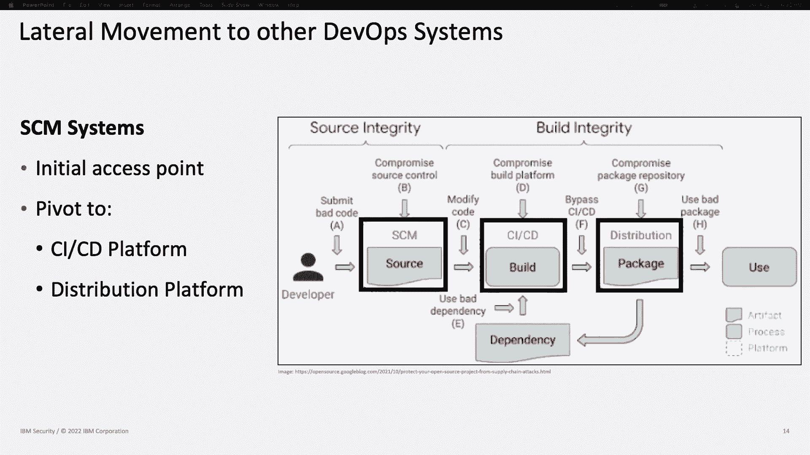

所有的权利，所以现在我们将讨论攻击和防御GitHub Enterprise。

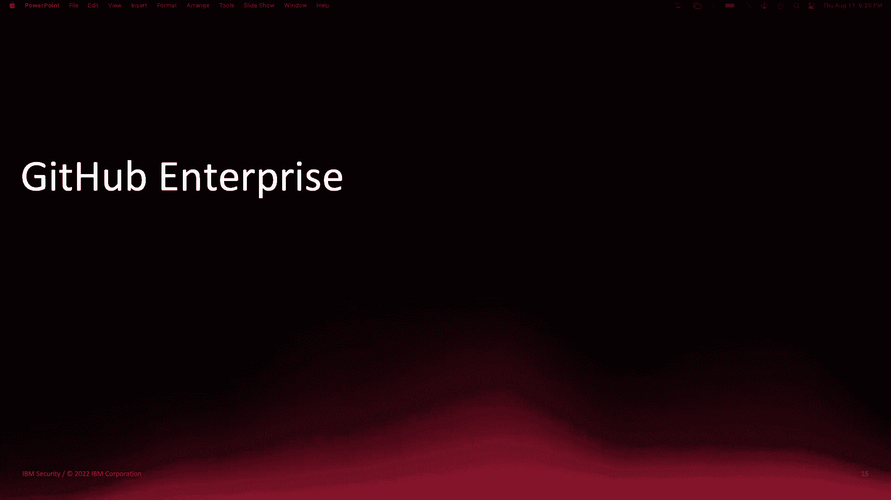

所以术语企业与GitHub企业，将引用整个GitHub企业实例，GitHub企业中的一个组织，因此，一个企业可以在其下面有一个到多个组织，你有不同的企业角色，以及GitHub企业中的组织角色。

存储库也有不同的角色，所以不管你能不能你能，你只是读了一个存储库，您有写访问权限和访问权限吗，等，然后您有访问令牌作用域，所以为了访问其余的API，您可以使用访问令牌或API令牌进行身份验证。

您有不同的作用域应用于此，这基本上告诉你你被授权做什么，使用该访问令牌访问其余API，在这个演示中，你会看到对其他API的滥用，所以你知道会在所有这些中滥用这一点，你知道今天所有这些系统。

所以他们每个人都有一个休息API基本上是一个编程接口，您可以与它们交互以实现不同的功能，所以现在我们将经历不同的攻击和场景，GitHub企业，这不是一个详尽的列表，这些只是我研究过的。

我们的团队利用他们的参与了解了所有这些场景的全部细节，一定要看看我的白皮书，在演示文稿的最后我会有一个链接，也会在黑帽网站上分享，所以我们来谈谈侦察，所以在GitHub企业的侦察方面。

真正关注三个主要方面，所以专注于存储库，文件和代码，因为这些对攻击者来说是最有价值的，从侦察的角度来看，现在您可以通过Web界面进行这种侦察，剩下的API，或者你也可以用我的SCM工具包工具来做。

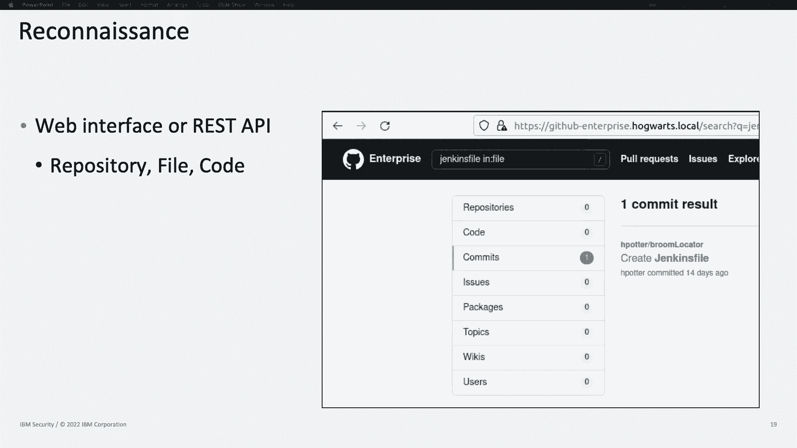

我稍后会展示，在这次侦察的伐木方面，此活动将登录HA代理日志，我有一个搜索标准，带着我的截图，过滤我的一些侦察活动，所以你可以在那里看到我，搜索密码或Jenkins文件之类的东西。

在GitHub Enterprise中可以进行的另一种攻击，是存储库接管，所以GitHub企业中的站点管理员角色，就像GitHub企业中的管理员角色，如果您是网站管理员。

您可以解锁任何存储库进行修改访问，这包括私人存储库，所以你可以在左边的截图中看到，有一个私人存储库，然后在右边的截图上，我正在使用我的站点管理访问权限来解锁该存储库，在那里我可以完全访问它的所有设置。

你知道回购中的任何代码，在这次攻击的日志记录方面，这将记录在审计中，登录GitHub企业服务器和那里的搜索条件，嗯，用于查找此活动是操作回购点工作人员下划线立即解锁，您将在这里看到的所有搜索条件和日志。

我把它们都包括在博客文章和白皮书中，所以你可以看看那些，之后，作为网站管理员，您可以在GitHub Enterprise中进行的另一种攻击是，可以进行用户模拟，所以你有两个选择，您可以模拟用户登录。

你可以通过Web界面来做到这一点，你可以在截图中看到，或者一个更隐蔽的选项是，您可以使用模拟令牌，现在，您可以通过Web界面或其他API创建模拟令牌，当您为用户创建模拟令牌时，该用户看不到该模拟令牌。

只有其他站点管理员才能看到该用户正在被模拟，此活动也将记录在自动日志中，和GitHub企业服务器，我有几个不同的搜索标准，就如何再次检测到此活动而言，所有这些都将包括日志中的搜索条件。

它们包括在博客文章和白皮书中，你可以做的另一个攻击是，您可以将用户提升为站点管理员，所以如果你是网站管理员，您可以推广任何其他用户站点管理，或将任何用户从网站管理员降级，这在哪里有用。

假设你破坏了网站管理帐户，你很担心，你知道你是，你在担心他们，你知道基本上你担心蓝队，你的尾巴是对的，所以你想切换到另一个用户，但保持那边的管理访问权限，这样您就可以将另一个用户提升为网站管理员。

切换到其他用户，并且此活动也记录在审核日志中，我在那里列出了几个不同的搜索标准，审计日志的好处是什么，它会告诉你某件事是否通过API完成，所以它会通过API告诉你是否有东西被滥用了。

所以你可以在截图中看到，它说这是由一个邓布利多用户通过API推广的，GitHub企业中持久性的三个选项，所以你知道，显然从攻击的角度来看，您希望保持对这些系统的持久访问。

所以您可以使用个人访问令牌来做到这一点，您可以作为普通用户通过Web界面创建这些，GitHub企业，不允许您使用REST API创建个人访问令牌，您也可以使用我前面提到的模拟令牌，最后一个选项是。

您还可以使用SSH键进行持久性，您可以作为普通用户这样做，通过Web界面，休息API，或者您可以使用SCM工具包，持久性活动也将记录在GitHub企业中，审计日志，你可以看到那里的截图。

并过滤我的一些活动，对于GitHub Enterprise，我想提到的最后一件事是管理控制台，所以管理层，GitHub Enterprise中有几个主要的控制台，所以您有管理控制台。

然后您有站点管理控制台，管理控制台是您可以配置整个企业实例的地方，您可以通过一个共享密码访问它，站点管理控制台专门用于管理组织的不同方面，所以就像你知道的那样，用户基于角色的访问。

但是在管理控制台中可以做的一些不同的事情是，比如说，将您的公共SSH密钥添加到GitHub企业实例中。

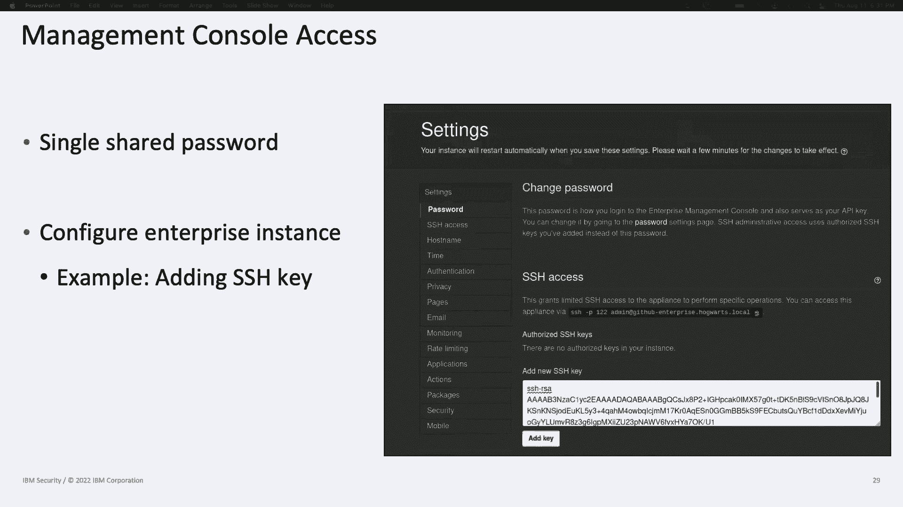

以便您可以SSH到服务器本身，一次在服务器上，你可以做一些不同的有趣的事情，默认的SSH端口是一二二，您将使用管理员用户帐户SSH，您可以做的一件事是通过插科打诨列出GitHub企业配置，配置命令。

这可能包含活动目录凭据，取决于服务器与服务器上其他感兴趣的文件集成的内容，是机密配置文件，机密配置文件可以包含API密钥或SSH密钥。

这取决于GitHub Enterprise在日志方面与该环境中集成的内容，例如，加东西，比如在管理控制台中添加公共SSH密钥，这将被记录在管理日志中，所以你可以看到我在那里有一张截图。

在那里我正在过滤我的一些活动，在管理控制台中添加SSH键，现在我们要开始攻击Gitlab企业号，所以Gitlab企业，你会听到项目这个术语，您可以互换使用项目或存储库，它们的意思和你知道的一样。

项目和主机代码跟踪问题并包含CICD管道，有五个，你知道的，项目或存储库的五个权限，你可以从攻击者的角度看到，你会想要危及用户，具有开发人员或更高权限的，就像GitHub Enterprise一样。

如果要使用访问令牌或API密钥，有不同的范围应用于此，授权您在其余API中可以做的事情，就像你知道GitHub企业一样，你可以用剩下的API做很多不同的事情，你会在演示中看到这一点。

这些是我将再次报道的攻击场景，并非详尽无遗的清单，你知道，我研究过的，这些攻击的全部细节将在白皮书中，另外，您可以使用配置管理工具包工具执行其中的一些操作，所以就像GitHub企业一样，你知道的。

侦察在Gitlab企业中很重要，侧重于存储库，文件和代码，您可以使用Web界面来完成此操作，立即休息API或SCM工具包，在日志方面是我认为很有趣的事情，因此此活动记录在生产日志和API日志中。

但是如果你看到上面的截图，对就我进行侦察的活动而言实际上是被过滤的，所以另一种方法，我最终使用了访问日志和下面的截图，你可以看到当我使用访问日志过滤侦察活动时，我真的能看到那个活动。

就像GitHub Enterprise一样，您也可以模拟其他用户，因此，如果您是Gitlab企业中的管理员角色，您可以通过Web界面撤消模拟用户登录，你可以在截图中看到，或者更隐蔽的选项。

再次创建模拟令牌，你可以通过Web界面或其他API来做到这一点，一次又一次，仅限其他管理用户，可以看到为该用户创建了模拟令牌，该用户不知道他们正在被冒充，这将同时记录在生产日志和API日志中。

在Gitlab企业服务器上，我又有了一些搜索标准，所有的搜索条件和所有重要的日志都包括在博客文章中，还有白皮书，所以我刚刚得到了一张截图，某些模拟令牌的筛选，活动，你可以做的另一件事就像另一个系统一样。

您可以将用户提升为管理员，所以如果你是管理员，Gitlab企业，您可以提升用户，任何用户管理或从管理中降级任何用户，您可以通过Web界面进行此操作，休息API或SCM工具包。

这个活动也将记录在生产日志和API日志中，所以你可以在那里看到一个截图，比如说，我会过滤用户促销活动，与gitlab企业相同的三个持久性选项，但有几个警告，因此。

您可以在Web界面中以普通用户的身份创建个人访问令牌，或者gitlab企业也提供了通过其他API来实现这一点的能力，但您必须是管理用户，您还有模拟令牌，但这需要管理权限，最后一个选项是SSH键。

您可以作为普通用户创建这些，通过Web界面，再次休息API或SCM工具包，生产日志和API日志是记录此活动的地方，所以上面的截图显示了我过滤一些个人访问，令牌活动。

底部的截图显示了我对一些SSH键活动的过滤，所以这里又有一次袭击，您可以使用Think itlab Enterprise修改持续集成或持续交付管道，所以在Gitlab企业中。

这些Gitlab跑步者有一个概念，gitlab运行程序将执行gitlab ci配置文件中的指令，来自该配置文件的将被命名为dot gitlab ci yml，它将位于存储库的根目录中。

所以你需要开发人员，项目的维护者或所有者角色，以便在修改该文件后修改该文件，尽管这将触发管道为该项目运行，在侦察方面寻找，你知道的，有Gitlab运行程序可供受损用户使用的存储库。

有一些侦察模块和一个配置管理工具包，你可以做到这一点，所以通过Web界面更新这个配置文件，它将被记录在生产日志中，但显然您可以通过get命令行工具更新此文件，所以真的。

对gitlab ci配置文件的任何更新都应该仔细检查，在被推之前需要批准。

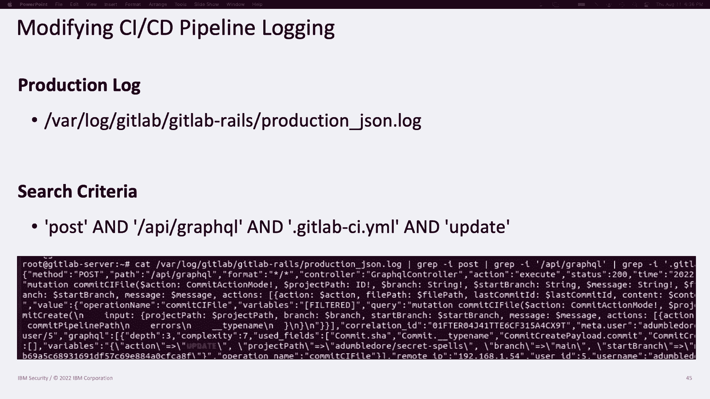

所以这里最后提到的gitlab企业是关于SSH访问的，从攻击者的角度来看，很少有不同的有趣的事情，服务器上的Gitlab配置文件，以便可以包含凭据，像活动目录凭据，取决于系统集成了什么。

还有一个Gitlab秘密文件，它也可能包含API密钥，取决于现有的集成，最后，还有一个关于Gitlab企业的PostgreSQL数据库，里面有些有趣的东西，所以你可以在截图中看到，我在过滤。

就像用户名的用户表，加密密码和一次性密码备份码，从攻击者的角度来看，这是三件有趣的事情，如果您有访问Gitlab企业服务器的SSH访问权限。

所以我们要讨论的最后一个攻击系统是比特桶，然后我们将进入一些演示和配置管理工具包。

所以在比特桶中，还有项目的概念，这是专门的比特桶服务器，我关注的是什么，一个项目可以包含一到多个存储库，它有点像我的一个仓库的容器，Bitbucket服务器有四个主要的权限级别，你有全局权限。

它会告诉你你是什么类型的用户，然后你也有项目和回购的权限，所以不管你是他们的管理员，写访问，读取访问，等，最后就像其他两个系统一样，有不同的作用域被应用于访问令牌。

它们在比特桶服务器中被称为http访问令牌，和一些不同的东西，虽然比特桶服务器是，这些访问令牌的范围仅限于，能够与存储库或项目交互，话虽如此，但你可以做许多其他不同的事情，剩下的API和比特桶服务器。

您只需验证，比如偷来的cookie或用户名密码，这些是我将再次为比特桶服务器经历的攻击，并非详尽无遗的清单，这些攻击的全部细节在白皮书中，您可以使用SCM工具包执行其中的许多操作，所以就像其他的一样。

你可以通过网络界面进行侦察，休息API或SCM工具包，我发现一件事很有趣，你知道的，做这项研究的测试是，这个活动被记录在比特桶日志中，然而，我不得不提高伐木水平，为了让我的侦察活动出现。

所以一旦我提高了日志记录水平，你可以在那里看到我搜索的查询，像API键，不管我执行侦察任务是为了什么，就像其他两个系统一样，如果您是管理员，您可以将任何用户提升为管理员或将任何用户从管理员降级。

您可以通过Web界面来实现这一点，休息API或SCM工具包，将记录此活动，在访问日志和审核日志中，所以你可以看到那里，我有一个截图，显示我的用户推广活动在访问日志中，因此，比特桶服务器持久性的两个选项。

您会注意到模拟令牌丢失了，这是因为没有模拟令牌的概念，使用比特桶服务器，您可以作为普通用户创建个人访问令牌或SSH密钥，您可以通过Web界面来实现这一点，休息API或SCM工具包。

并且该活动也将记录在访问日志和审计日志中，我有一张我的SSH键版本活动的截图，只是另一个提醒，此活动和搜索条件的所有日志都包含在博客文章中，和白皮书，我将在演示文稿结束时链接到它，因此。

Bitbucket服务器的最后一次攻击是围绕修改CC管道进行的，与Gitlab企业如此相似，但有点不同，所以比特桶是阿特拉斯的产品，还有一种产品叫竹子，竹子可以作为CICD管道。

所以如果一个小桶回购是用竹子，作为CICD管道，它会有一个竹制的破折号，存储库根目录中的spes目录，它将在该文件夹中有一个配置文件，所以它要么有一个YAML文件，就是竹芋，你可以在截图中看到。

或者它将是一个Java规范文件，它将是棕榈点XML，您需要对回购进行写或管理访问，修改该配置文件，但一旦你这样做了，这将触发管道自动运行，所以你可以在截图中看到，我在竹配置文件中添加了一些行，触发管道。

这个活动要记录在竹子里，登录竹子服务器，所以你可以看到一个截图，我的一些活动更新了这个文件，所以再次，就像Gitlab企业一样，对这些Cicd配置文件的任何提交都应该仔细检查。

正如你在这三个系统中看到的，你可以用剩下的API做很多不同的事情，所以我想创建一个工具来帮助自动化，因为我不想一直查找API文档。

在订婚期间执行爬行请求，这就是配置管理工具包的来源，SEM工具包是一个源代码管理攻击工具包，我用C写的，这样就可以用命令和控制框架在内存中运行。

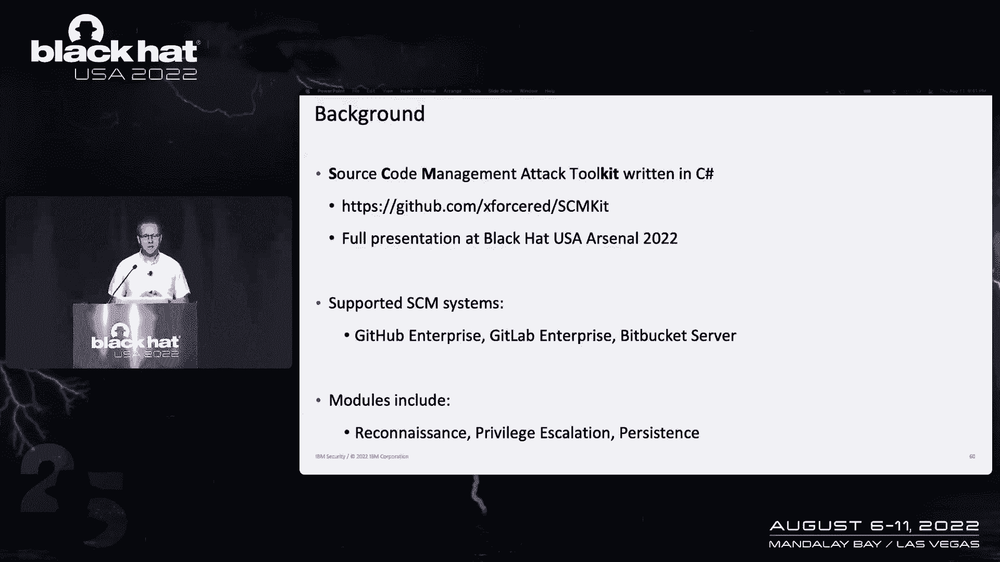

像钴击，我有工具的URL，我这周刚推的，本周我还在黑帽阿森纳做了一个关于该工具的完整演示，也是，它支持攻击GitHub企业，Gitlab企业和Bitbucket服务器，有多个模块可以做侦察之类的事情。

特权，隔离与坚持，下面是在内存中运行SCM工具包的示例截图，你会在演示中看到这些，但这只是展示了我使用一个名为内联执行程序集的实用程序，也是由x力红的一个成员开发的。

肖恩·琼斯能够在内存中运行SCM工具包，所以在这里，我正在做代码搜索模块，搜索API的秘密，下面是一个使用scm kit执行特权的示例。

通过将用户提升为站点管理员来升级GitHub Enterprise，这里有一个在Gitlab企业中进行持久性的示例。

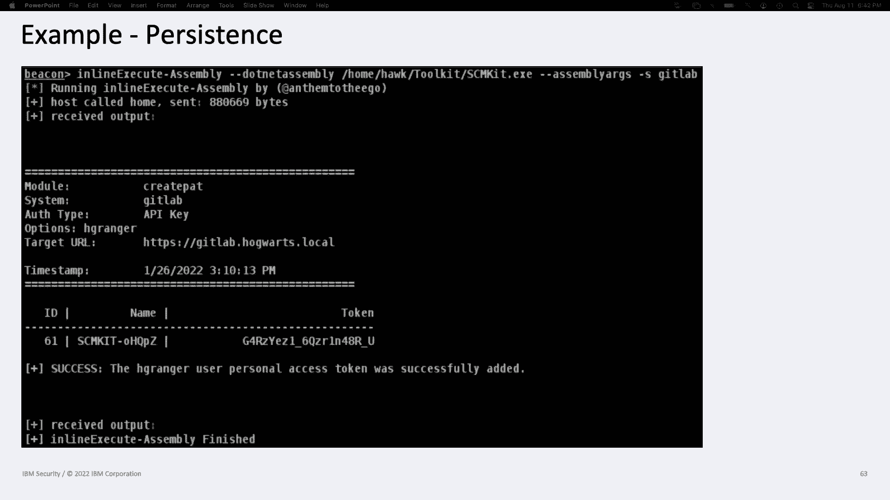

通过个人访问令牌，所以现在我们要做演示，所以我把第一个演示放在一起，我要对GitHub企业进行软件供应链攻击，第二个演示我要做横向运动，从Gitlab企业到手工工厂，它是一个包存储库系统。

然后我要展示的第三个演示是做横向运动，从Bitbucket服务器到Jenkins。

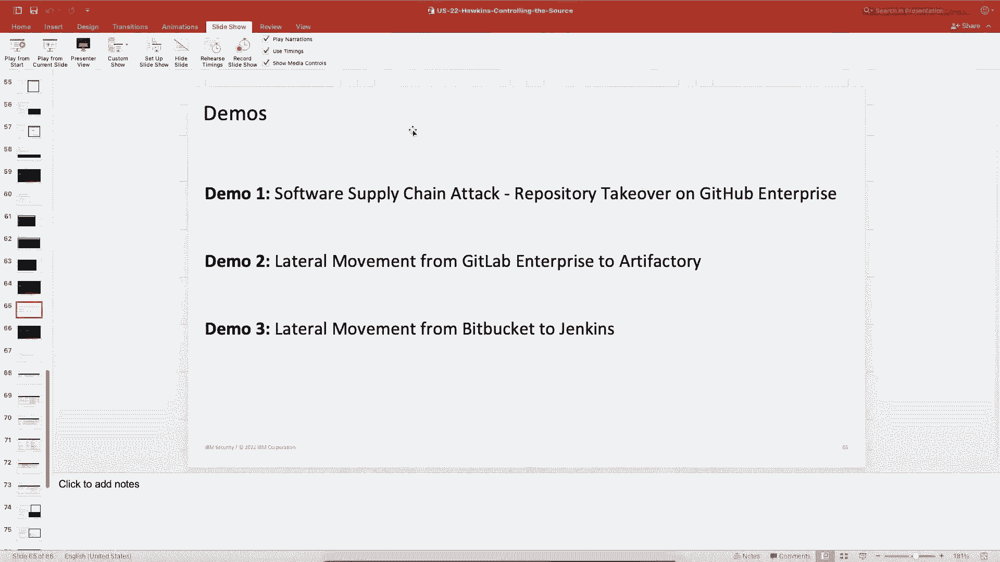

所以只是为了在这里搭建舞台，我们现在可以访问GitHub企业，作为一个妥协的用户H波特，我们有兴趣获得对WOS存储库的修改访问权。

ws，是一个虚构的软件，它运行在，魔法世界里所有的魔杖，因此，我们希望能够获得对这个存储库的修改访问权，这样我们就可以执行软件供应链攻击，所以我们要用配置管理工具包做的第一件事。

作为我们的妥协Hpotter用户，他只是一个普通用户，我们要做搜索回购模块，带着SEM工具包寻找一个。

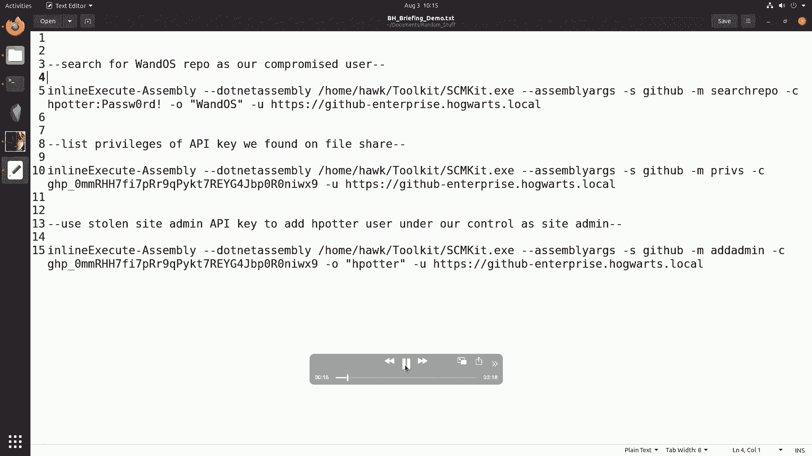

所以我们要继续在钴打击中运行这个命令，我要把这个贴在这里，所有的权利，所以我们要运行这个命令，你将要看到的，我们的h potter用户看不到One OS存储库，所有的权利。

所以它一定是某种我们看不到的私人存储库，然而，作为这次行动的一部分，我们在文件共享上发现了一个API密钥，在我们的约定中。

我们通常在用户工作站上找到API密钥，文件共享，内部维基之类的东西，所以我们找到了这个API密钥，我们想验证这个API密钥，看看它有什么特权，所以要做到这一点。

我们将使用带有Prizz模块的配置管理工具包，使用API密钥进行身份验证。

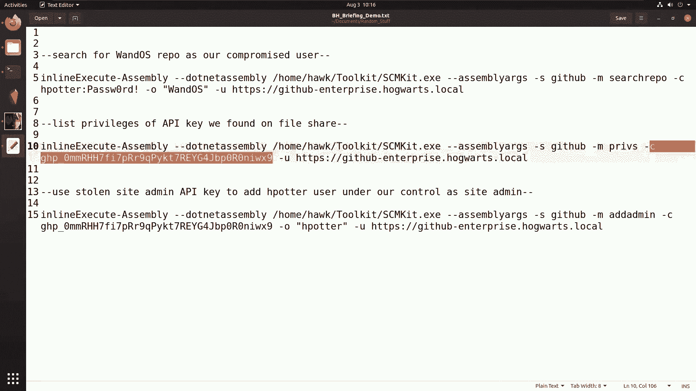

所以我们要继续在这里运行这个命令，看看这个API密钥是否有效，我们在文件共享中发现的，它有什么特权，你将在这里看到的，我们找到的这个API密钥，这是一个场景，你知道我们在约会时会做，我们的对手模拟交战。

我们实际上已经进行了这个场景，因此，这是网站管理访问，所以我们有站点管理API密钥，我们有一个经常妥协的用户H Potter，所以我们要做的是，我们将使用带有添加管理模块的配置管理工具包。

那个API密钥，我们要推广我们妥协的H波特。

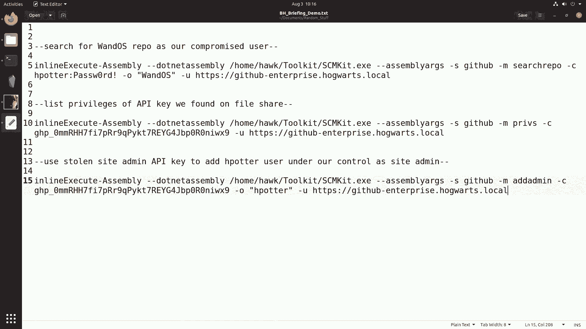

用户到站点管理，所以我们要在这里运行这个命令，我们要看看，是h potter将被添加到网站管理角色，所以现在如果我们回到GitHub企业Web界面并刷新。

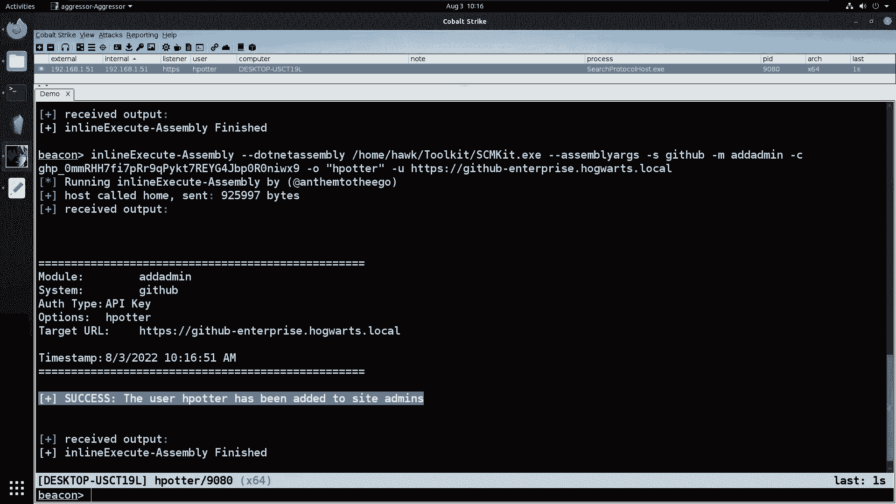

你将要看到的是，会有一艘火箭飞船出现在右上方，这是GitHub Enterprise中的站点管理控制台，所以现在我们在GitHub Enterprise中拥有站点管理访问权限，我们要看看用户。

看看有没有有趣的用户，这个DevOps用户看起来很有趣，你知道我们很想看看，所以我们要钻到这里，所以我们要去看看那些，您将看到的是用户开发操作，用户实际上拥有私人的Wandos存储库。

这就是为什么我们不能把它视为我们正常的h potter用户，所以这里有两个选择，您可以执行用户模拟攻击来模拟，那个用户Devops用户，或者我们要做的是，我们要做一个存储库，通过解锁此存储库进行接管。

所以我们要继续，默认情况下解锁这个，GitHub企业，这个存储库将解锁两个小时，所以你必须在这里提供一个理由，这都登录在GitHub企业服务器上，所以现在这个存储库。

One OS存储库为H Potter锁定，所以现在我们应该可以完全访问回购及其代码，以及它的所有设置，所以现在我们要回去，你会看到这里，现在我们将可以访问存储库，为了进一步证明这一点。

我们将用Git命令行工具来展示。

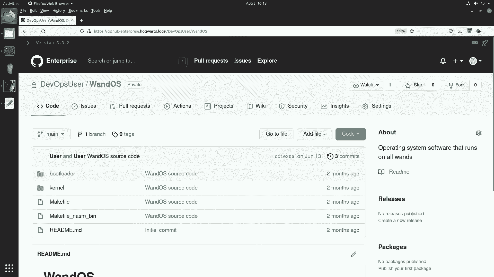

我们也可以用h potter用户克隆存储库，现在我们的攻击路径，你知道一个普通用户，我们在文件共享上发现了一个网站管理API罐，我们使用API密钥来推广我们受损的用户，到站点管理。

其中我们对One的存储库执行了存储库接管，现在我们可以，你知道，修改软件作为软件供应链的一部分，攻击第二个演示，我将展示做横向运动，从Gitlab企业到手工工厂，它是一个包存储库系统。

正如我在Gitlab企业中提到的。

有这些Gitlab跑步者的概念，它们将执行Gitlab CI配置文件中的指令，所以我们要对我们的受损用户进行侦察，看看我们的用户是否可以访问任何Gitlab运行程序。

所以我们首先要用配置管理工具包来做这个列表运行器模块。

所以我们要继续认证，查看我们的用户是否可以访问任何Gitlab运行程序，以及这些跑步者被分配到哪些存储库，你会看到。

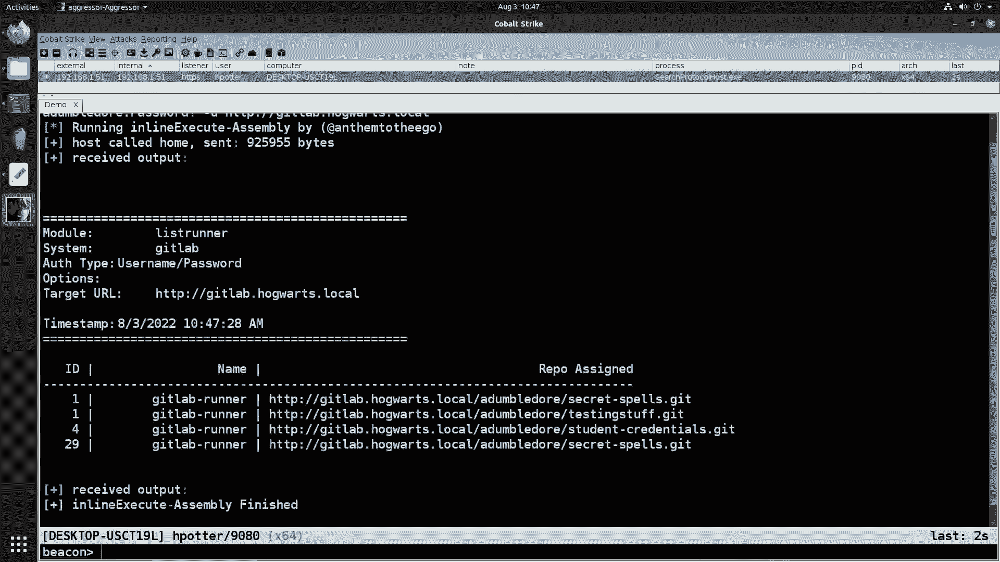

我们会在这里得到一些点击，秘密咒语目录，是我们最终要关注的，所以我们现在可以接触到一些跑步者，让我们继续对gitlab ci配置文件进行一些侦察，我们要交叉参考跑步者。

我们可以使用Gitlab CI配置文件访问。

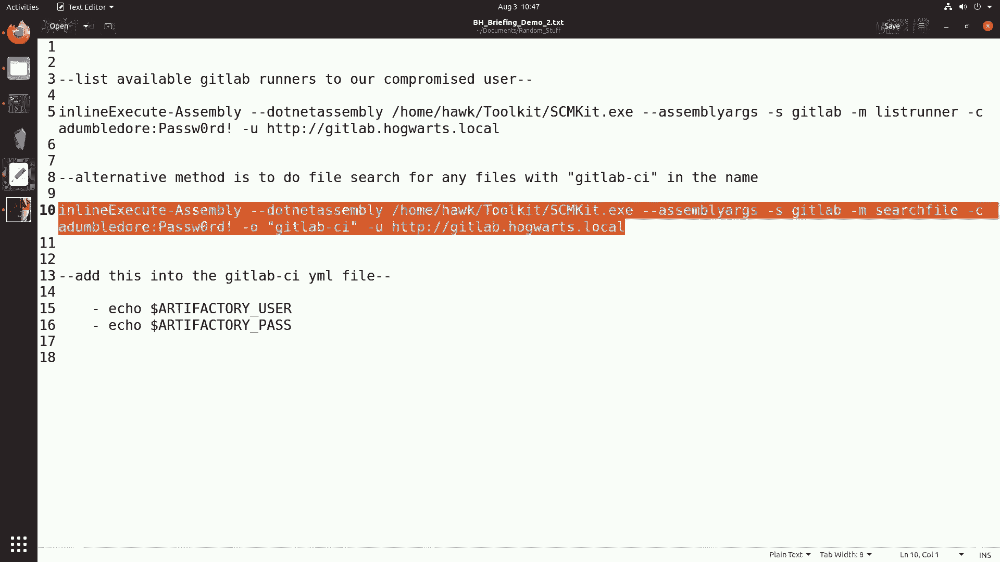

基本上是既有，所以我们要做搜索文件模块，使用配置管理工具包搜索gitlab ci，会有几个热门歌曲出现，但我们还是要把重点放在这个秘密咒语目录上，所以你可以在这里看到。

secret spell目录具有ci配置文件，它还有一个Gitlab运行器，我们可以访问，所以我们要去回购，并尝试修改此配置文件。

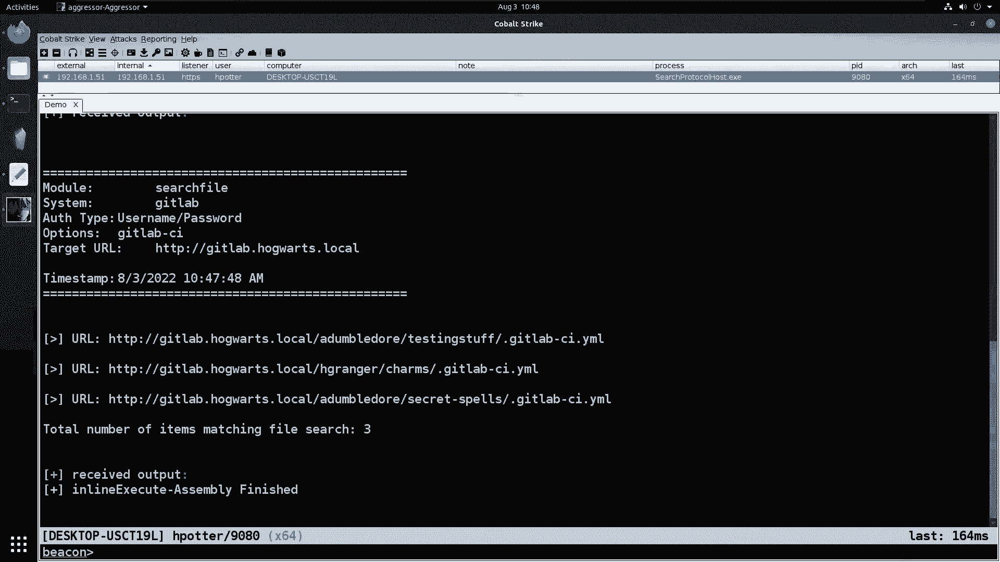

现在我通过Web界面来做这件事，只是为了演示的目的，但显然您可以通过Git命令行工具来实现这一点，在这种环境下，特别是，你将要看到的是，Gitlab和Artifactory之间有一些集成。

所以它基本上是把一个文件推到手工工厂，它是一个包存储库系统，你可以看到它在做什么，它正在用人工制品的用户名和密码进行身份验证，推送此文件，所以我们想要的是我们想要得到这些证书。

所以我们要修改这个配置文件来打印工件，正在使用的用户名和密码，所以我们要继续更新这个文件，更新此CI配置文件后，这将触发管道自动运行，所以我们要继续并提交我们的更改，所有的权利，所以你会看到它会验证。

它是一个很好的配置文件，然后我们要做的是，我们要去看看管道，看看我们的工作，并确保它运行，以及我们应该在新修改的作业的作业输出中看到什么，与该配置文件一起的现在是Artifactory凭据。

为什么从攻击者的角度来看这很有用，如果你能接触到艺术品，你知道你可以上传其他项目中使用的恶意包，或者部署的，所以我们要继续，你可以看到我们的管道运行，看看我们的工作。

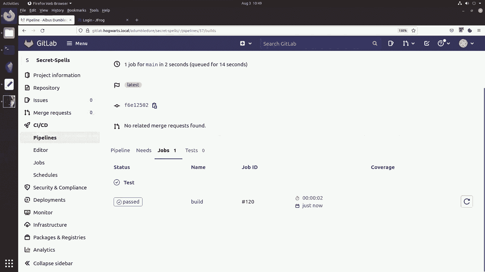

我们将查看作业输出，你会在底部看到什么，它确实打印出了正在使用的凭据，所以工件用户名和密码。

所以我们要继续验证这些凭据，通过登录Artifactory，所以要用管理用户名登录这里，也是，如果你没注意到我的实验室，我是个哈利波特书呆子，所以这就是为什么我有这一切，你知道吗，霍格沃茨。

霍格沃茨的东西设置，所以我是一个巨大的哈利波特书呆子，所以你可以在这里看到，我们可以进入人工制品，又在哪里，现在我们可以进入，我们可以上传恶意包，你知道的。

我们完成了从Gitlab企业到Artifactory的横向移动。

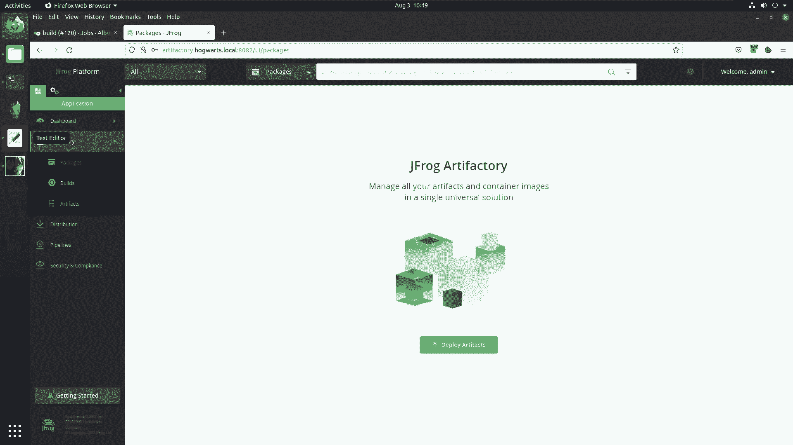

我要展示的最后一个演示是做梯子月亮，从Bitbucket服务器到Jenkins，所以Jenkins是一个构建系统。

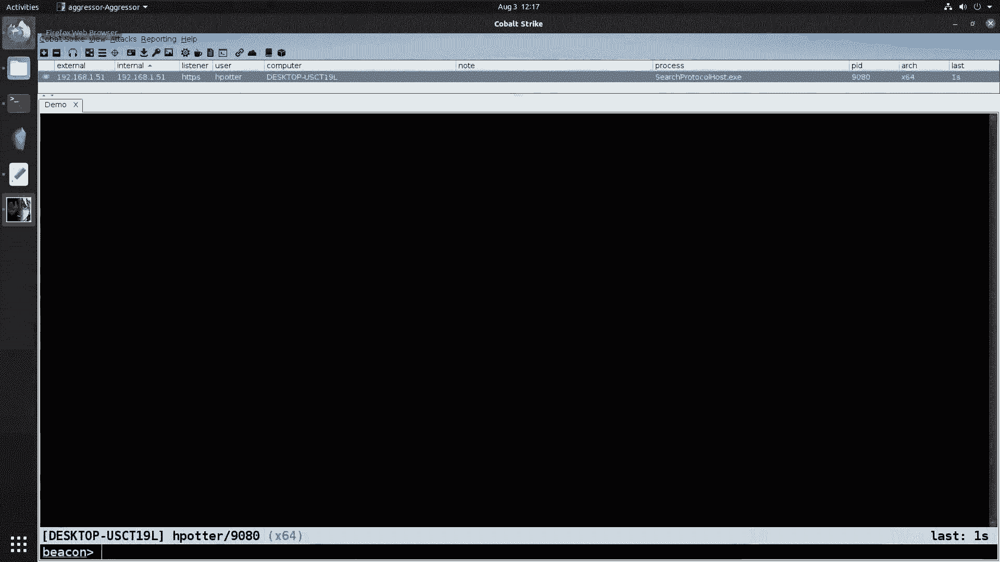

Cicd系统和Jenkins显然可以用来构建应用程序，所以如果源代码管理系统和Jenkins之间有集成设置，它将运行所谓的Jenkins配置文件，在源代码管理存储库中。

配置文件的名称将是Jenkins文件，所以我们对受损用户所做的是，我们用的是DM工具包，我们正在搜索任何Jenkins CI配置文件，使用搜索文件模块，搜索Jenkins文件。

所以我们要继续在这里进行搜索。

您将看到弹出几个实例，我们要关注这个掠夺者地图应用程序目录，所以我们要去这个掠夺者地图应用回购，并尝试修改此Jenkins CI配置文件。

现在我们的目标是这个文件，所以当Jenkins运行ccd配置文件时，它运行在Jenkins服务器本身上，所以我们感兴趣的是我们想在詹金斯的动作之外表演，所以我们要在这个配置文件中做什么。

我再次在Web界面中这样做，您也可以通过Git命令行工具来完成，我们要做的是我们要拥有它，执行一些命令，将我们的公共SSH密钥添加到Jenkins用户帐户的授权密钥文件中，这样。

我们可以以Jenkins用户帐户的身份SSH到Jenkins服务器，现在这在詹金斯这边是可以防止的，如果你有像沙箱一样的地方来编写Groovy脚本，所以我要继续更新这个Jenkins文件，你知道。

通常在现实世界的环境中，比如在约会期间，你只要，你知道的，让你知道詹金斯按照任何时间表运行，它正在运行以提取更新的配置文件，尤其是如果你还没有为这个案子破坏Jenkins服务器，在这个演示中。

我要手动运行Jenkins的工作，这样我们就可以看到结果了，所以我们要继续进行詹金斯的工作，一次又一次，它将从存储库中提取更新的Jenkins CI配置文件，并运行它，它会运行我们刚刚放入的动作。

所以它会运行，我是谁主机名，然后在我们的公共SSH密钥，从我们的私人公共，授权密钥文件的SSH密钥对。

所以你可以看到它跑了，所以现在我们应该可以SSH到Jenkins服务器，作为Jenkins用户帐户，所以我们要继续和我们的相关士兵在这里嘘。

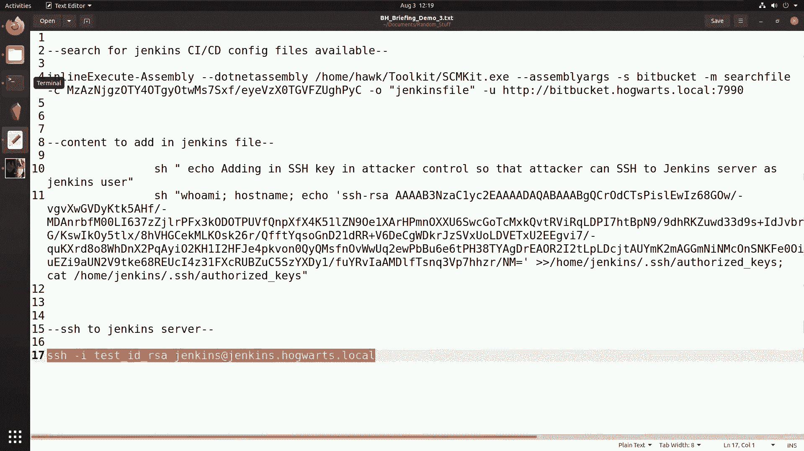

SSH密钥和我们添加的公钥，你可以看到那里，我们已经成功地从over转到了Bitbucket的Jenkins，所以说，这种表演，一个能够利用这些与源代码管理系统集成的示例，旋转，建立系统。

对于配置管理工具包工具本身，我在仓库里有一根纱线，可以为攻击者申请的静态签名，如果他们在此默认状态下使用此工具，我在工具中也有一个静态用户代理字符串，这样你就有了，我现在已经在那里列出了。

这样做的原因再次是用这个工具检测活动，所以我有一个Snort规则，包括在配置管理工具包中，这个的回购，另外在您的Web代理中，最后可以为此用户代理字符串添加规则。

使用SCM工具包创建的任何访问令牌或SSH密钥，这些名字将与SCM套件破折号一起呈现，这样您就可以在源代码管理系统中设置规则，以检测使用以下命令创建的任何访问令牌或SSH密钥，在名字的开头。

我不打算进入这些日志和日志过滤器和细节，仅仅因为它们再次被包括在博客文章和白皮书中，嗯，但对于GitHub企业来说，呃，确保将这三个日志转发到您的SIM卡，然后我有一些规则你可以应用。

检测我今天在GitHub Enterprise中展示的活动，对于Gitlab企业，确保您得到了应用程序日志，生产日志，API日志和weblog转发到您的SIM卡，然后确保你得到这些规则。

申请了我一路展示的活动，你知道的，侦察，用户模拟，我上次在Bitbucket服务器上展示的所有不同的攻击。

确保你拿到了访问日志，审核日志和Bitbucket日志将其转发到您的SIM卡，然后在竹子服务器上，确保你有你的竹木为它在你的sim以及，所有这些规则，以及转发到SIM卡所需的所有日志。

它们都包括在博客文章和白皮书中，在配置方面，全面指导，用于源代码管理系统，在个人访问方面，令牌和SSH密钥，确保设置了自动过期日期，并且不允许用户创建没有过期的这些，到期日，把这些当成密码。

就像我们有密码的过期日期一样，所以我们应该对访问令牌和SSH密钥做同样的事情，在访问和授权方面，极限，这些系统中的管理员帐户数，你知道在最大或最小，需要有两个，您需要有一个主管理员和一个备份。

但不应该有更多，除非绝对必要，你知道管理用户越多，攻击者的攻击面越多，确保启用多因素身份验证，最后禁用用户模拟，正如你所看到的。

我在GitHub Enterprise和GitLab Enterprise中利用了这一特性，在存储库访问和代码提交方面，在最低特权的政策上运作，所以不要只给每个人访问所有存储库的权限，另外。

请确保在足够的时间内删除代码分支，所以我一次又一次地看到，开发人员将创建某种类似于测试代码分支的，他们会向它提交凭据，把剩下的留给我们的红队去找，另外，每当用户提交代码时，要求至少对该提交进行一次批准。

这样他们就可以检查以确保提交中没有恶意，并要求通过gpg密钥或证书进行签名提交，在伐木方面，所以你看到了，我展示了一堆不同的日志，你可以在一些不同的检测规则中使用。

所以确保你收到了我转发给你的SIM卡的日志，另外，正如您在Bitbucket服务器等系统中看到的那样，我不得不提高记录水平来检测侦察活动，因此，在需要时也增加日志记录级别，所以总之。

你知道这些系统包含了一些最敏感的信息组织，它们对组织来说真的是一个至关重要的部分，和DevOps中的一个关键组件，比如生命周期，攻击者越来越关注这些，因为今天软件几乎运行在所有东西上，在我们的车之间。

交通控制系统，对呀，医疗器械，对呀，所以这些系统非常重要，视组织而定，对呀，源代码的妥协，一个组织的管理系统可能导致另一个组织内部的妥协，最后你知道这些系统它们确实需要更多的可见性。

他们需要社区的更多研究，对你来说是一个行动的号召，都是你知道的，我真的希望看到未来的研究，有人把这项研究提升到了一个新的水平，进一步捍卫这些系统，在我结束之前，我只是在没有这些人的情况下得到了一些承认。

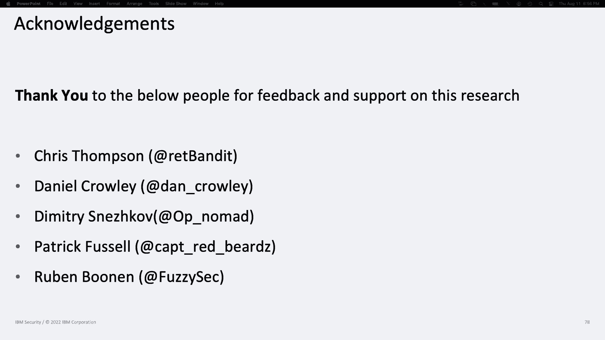

他们支持我完成了整个研究项目在没有他们的情况下给了我大量非常棒的反馈，我今天就不会站在这里，所以我要感谢克里斯，汤普森，丹尼尔，克劳利，迪米特里，帕特里克，弗塞尔和鲁本，布宁。

所以正如我提到的博客文章和白皮书URL。

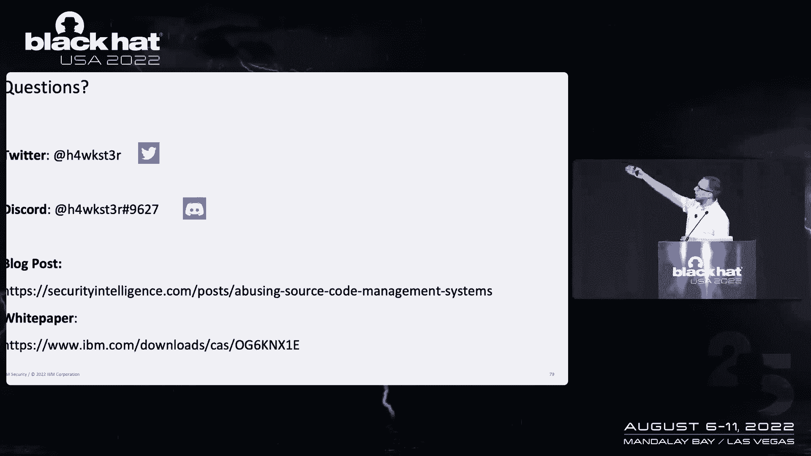

我把这个放在这里，那是有，白皮书将有我今天所说的全部细节，如果你有任何问题，请随时在推特上联系我或不和，或者在走廊上和我说话，我很乐意用这个回答任何人的问题。

就是这样。