# 课程 P79：源代码管理系统攻击与防御教程 🛡️💻

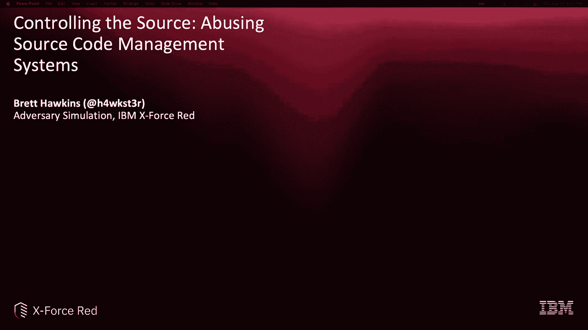

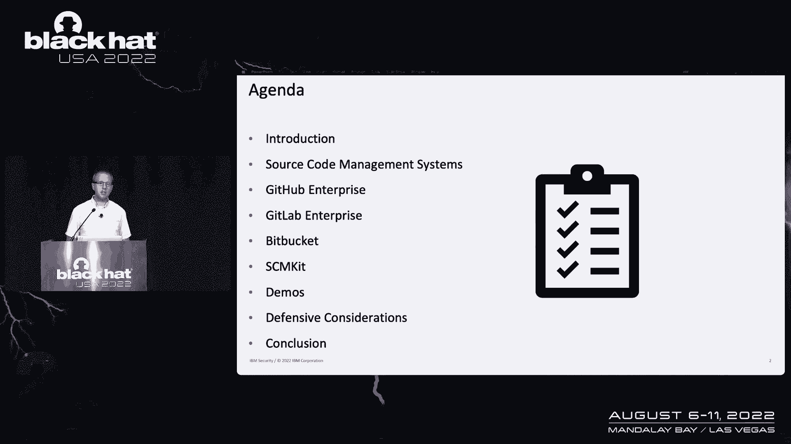

在本课程中，我们将学习如何识别、利用和防御针对源代码管理系统（SCM）的攻击。我们将重点研究三个流行的系统：GitHub Enterprise、GitLab Enterprise 和 Bitbucket Server。课程内容包括攻击者的视角、实际演示以及关键的防御策略。

---

## 什么是源代码管理系统？ 📚

源代码管理系统是用于管理源代码存储库的工具。它允许多个开发人员同时处理代码，跟踪问题，并与 DevOps 管道中的其他系统集成。

在本次研究中，我们关注以下三个系统：
*   **GitHub Enterprise**
*   **GitLab Enterprise**
*   **Bitbucket Server**

这些系统在 DevOps 管道中处于“构建”阶段。后续的测试、部署和生产阶段都依赖于在这些系统中开发和维护的源代码的完整性。

上一节我们介绍了源代码管理系统的基础知识，本节中我们来看看攻击者为何将其视为高价值目标。

## 攻击动机与场景 🎯

从攻击者的角度来看，源代码管理系统之所以成为高价值目标，主要有两个原因：

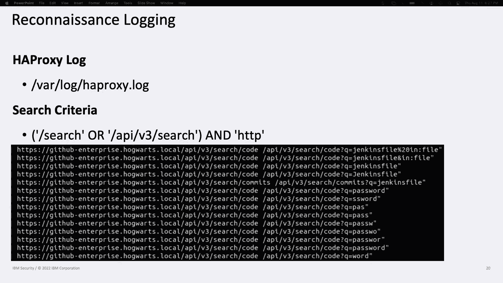

1.  **软件供应链攻击**：攻击者将自己注入开发过程，最终部署恶意代码。这可以通过破坏构建完整性（如 SolarWinds 攻击）或源代码完整性来实现。
2.  **初始访问与横向移动**：由于源代码管理系统与 CI/CD 平台、包存储库等 DevOps 工具深度集成，攻破 SCM 可能成为攻击其他关键系统的跳板。

---

## 攻击 GitHub Enterprise 🐙

GitHub Enterprise 的结构包括企业、组织和仓库，并配有相应的角色和权限。攻击者通常利用 REST API 进行交互。

以下是针对 GitHub Enterprise 的一些关键攻击手法：

### 侦察
侦察活动主要关注仓库、文件和代码。可以通过 Web 界面、REST API 或专门的工具（如 SCM Kit）进行。此活动会记录在 HAProxy 日志中。

### 仓库接管
拥有“站点管理员”角色的用户可以解锁任何仓库（包括私有仓库）进行修改。此操作会记录在审计日志中，搜索条件为 `action:repo.worker_immediate_unlock`。

### 用户模拟
管理员可以模拟其他用户登录，或创建更隐蔽的模拟令牌。只有其他管理员能看到模拟令牌的存在。此活动记录在审计日志中。

### 权限提升
管理员可以将任何用户提升为站点管理员。此活动同样记录在审计日志中，并会注明是通过 API 还是 Web 界面完成。

### 持久化
攻击者可以通过以下方式维持访问权限：
*   创建个人访问令牌（PAT）
*   使用模拟令牌
*   添加 SSH 密钥
这些活动都会记录在审计日志中。

### 管理控制台访问
通过管理控制台，攻击者可以配置实例，甚至添加 SSH 公钥以直接访问服务器。在服务器上，可以查看包含凭证的配置文件（如 `github-enterprise.yml` 和 `secrets.yml`）。管理控制台的操作记录在管理日志中。

---

## 攻击 GitLab Enterprise 🦊

在 GitLab 中，“项目”等同于仓库。攻击者需要获取具有“开发者”或更高权限的用户账户。

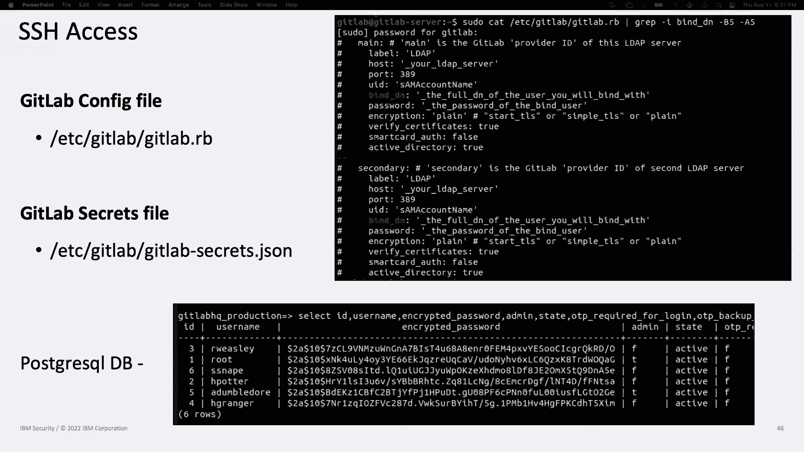

以下是针对 GitLab Enterprise 的攻击手法：

### 侦察
与 GitHub 类似，侦察聚焦于仓库、文件和代码。此活动记录在生产日志和 API 日志中，但访问日志可能提供更好的可见性。

### 用户模拟
管理员可以模拟用户登录或创建模拟令牌。此活动记录在生产日志和 API 日志中。

### 权限提升
管理员可以提升或降低用户的权限。此活动记录在生产日志和 API 日志中。

### 持久化
持久化选项包括：
*   创建个人访问令牌（PAT）（普通用户可通过 Web 或 API 创建，但通过 API 创建需要管理员权限）
*   使用模拟令牌（需要管理员权限）
*   添加 SSH 密钥
这些活动记录在生产日志和 API 日志中。

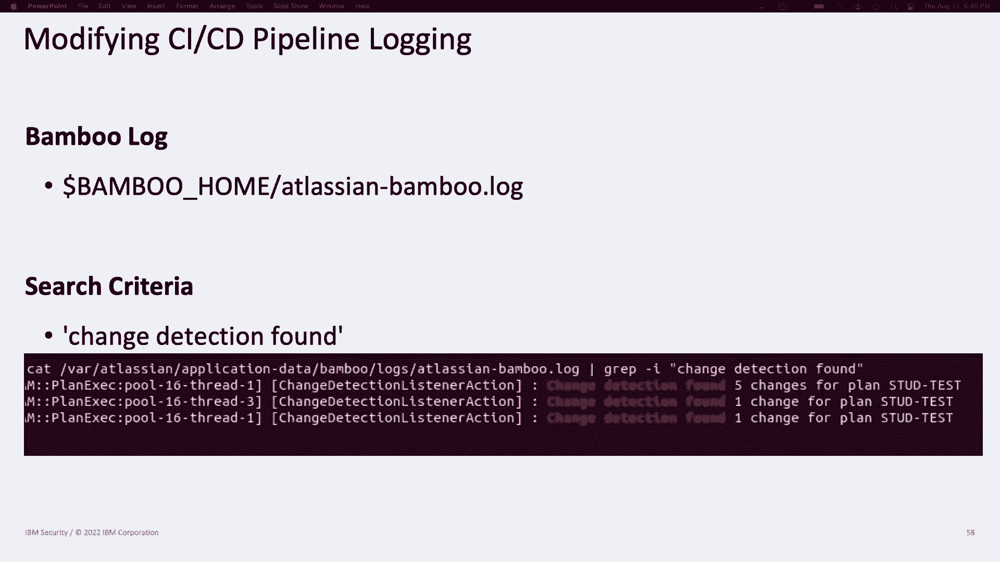

### 修改 CI/CD 管道
拥有足够权限的用户可以修改仓库根目录的 `.gitlab-ci.yml` 文件，从而在 GitLab Runner 上执行恶意指令。通过 Web 界面更新此文件会记录在生产日志中。

### SSH 访问与数据库
获得服务器 SSH 访问权限后，攻击者可以查看包含凭证的 `gitlab.rb` 配置文件、`secrets` 文件，甚至直接查询 PostgreSQL 数据库以获取用户哈希和备份代码。

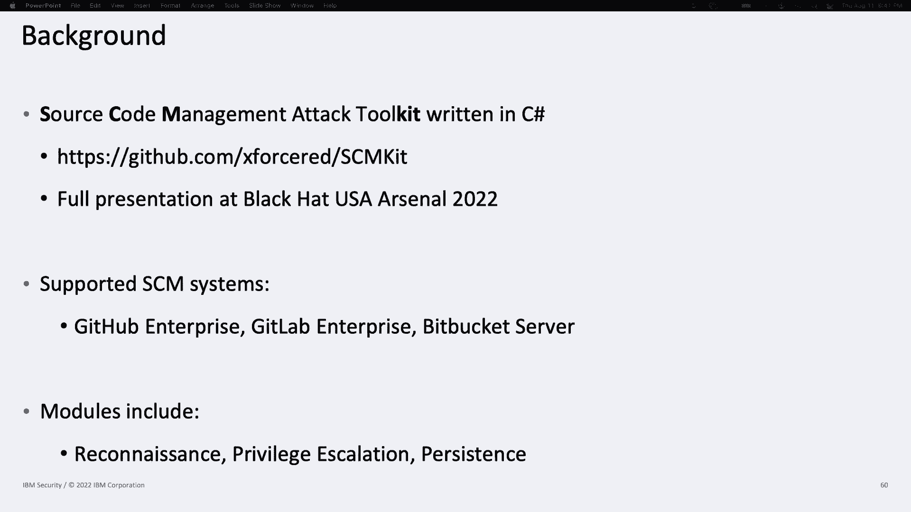

---

## 攻击 Bitbucket Server 🪣

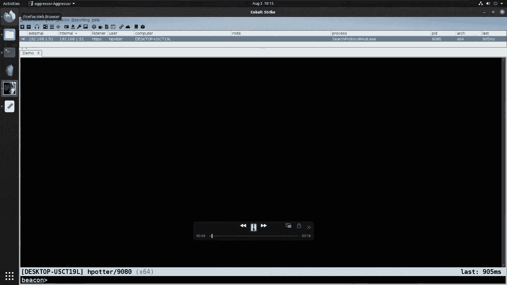

Bitbucket Server 使用项目和仓库的概念。攻击者关注全局、项目和仓库级别的权限。

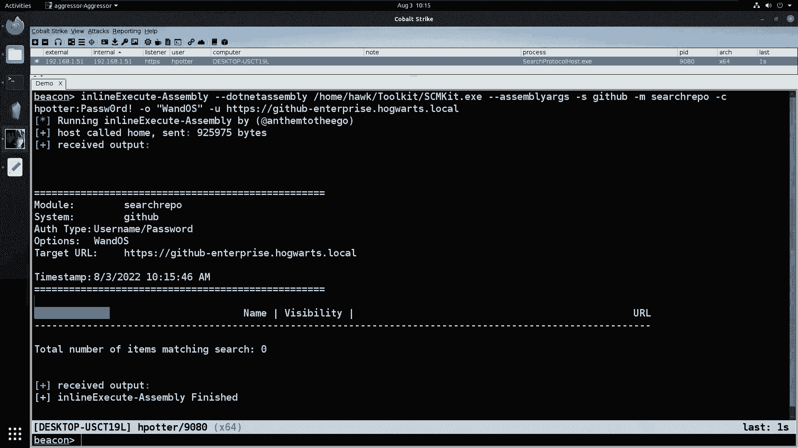

以下是针对 Bitbucket Server 的攻击手法：

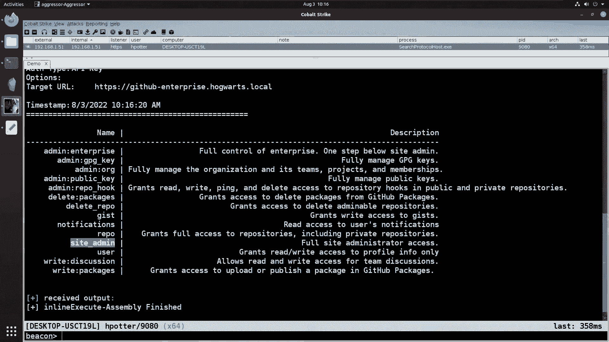

### 侦察
侦察可通过 Web 界面、REST API 或工具进行。需要注意的是，可能需要提高日志记录级别才能捕获此类活动。

### 权限提升
管理员可以提升或降低用户权限。此活动记录在访问日志和审计日志中。

### 持久化
持久化选项包括：
*   创建个人访问令牌（HTTP 访问令牌）
*   添加 SSH 密钥
Bitbucket 不支持模拟令牌。这些活动记录在访问日志和审计日志中。

### 修改 CI/CD 管道
如果仓库使用 Bamboo 作为 CI/CD 系统，攻击者可以修改 `bamboo-specs` 目录下的 `bamboo.yaml` 或 `plan.xml` 配置文件，触发管道执行恶意操作。此活动记录在 Bamboo 服务器日志中。

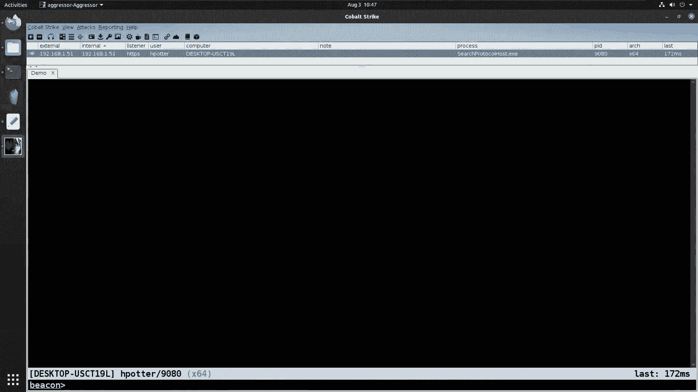

---

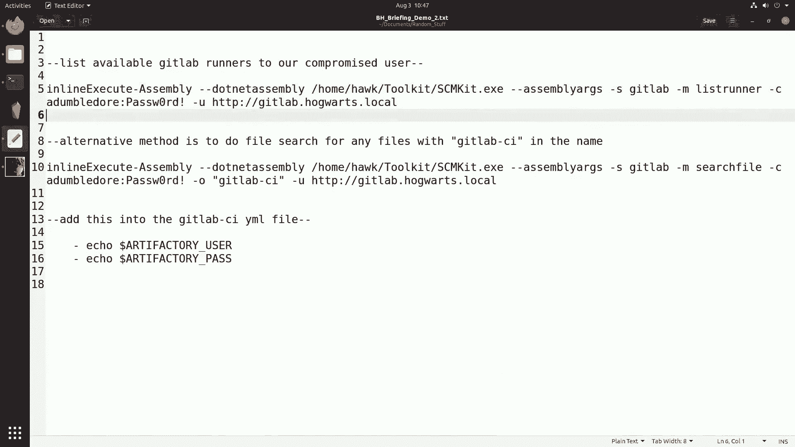

## 自动化攻击工具：SCM Kit ⚙️

为了自动化上述攻击，我们开发了 SCM Kit。这是一个用 C# 编写的工具，可以在内存中运行（例如通过 Cobalt Strike），支持攻击 GitHub Enterprise、GitLab Enterprise 和 Bitbucket Server。

SCM Kit 的功能模块包括：
*   **侦察**：搜索仓库、文件、代码。
*   **权限提升**：提升用户权限。
*   **持久化**：创建访问令牌、SSH 密钥。
*   **横向移动**：利用集成点。

工具内置了检测规避提示，例如默认的静态用户代理字符串和命名的令牌/密钥，以帮助防御方建立检测规则。

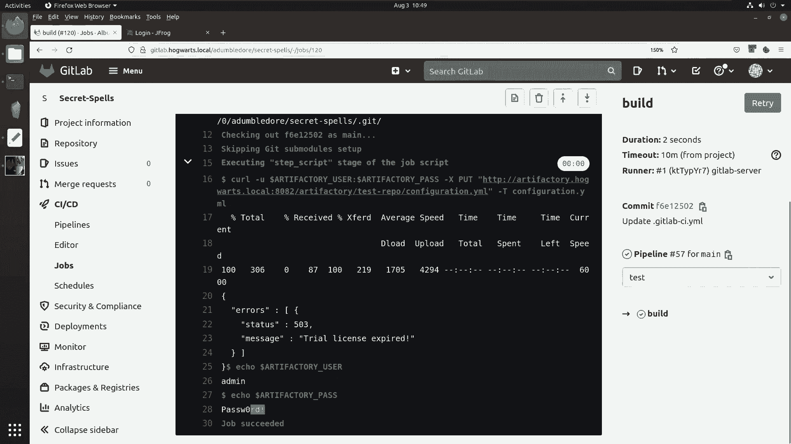

---

## 攻击演示 🎬

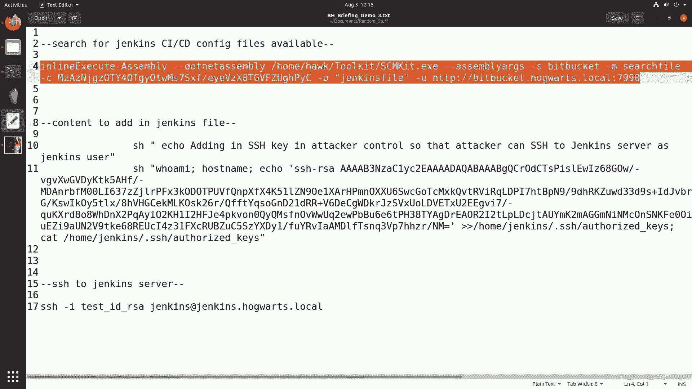

上一节我们介绍了自动化工具，本节中我们通过实际演示来观察攻击链的运作。

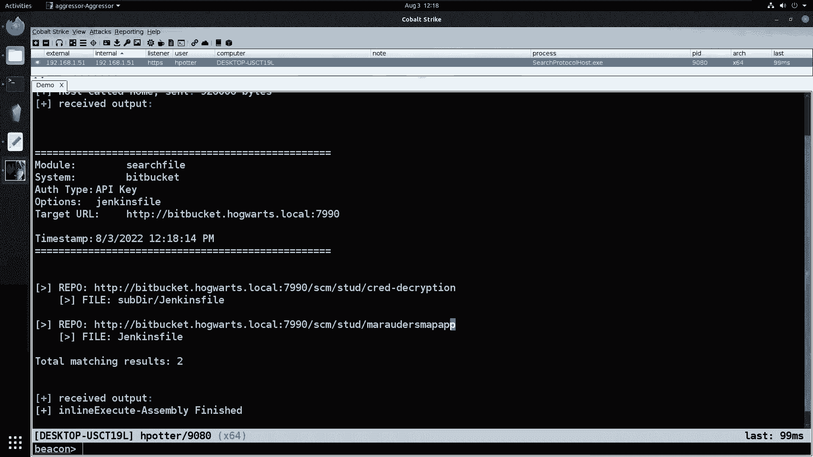

### 演示一：针对 GitHub Enterprise 的软件供应链攻击
1.  **场景**：我们已入侵普通用户 `hpotter`，但目标仓库 `wandos` 对其不可见。
2.  **攻击链**：
    *   在文件共享上发现一个站点管理员 API 密钥。
    *   使用 SCM Kit 验证该 API 密钥并提升 `hpotter` 为站点管理员。
    *   以站点管理员身份解锁 `wandos` 私有仓库。
    *   现在 `hpotter` 可以克隆并修改该仓库代码，实施软件供应链攻击。

### 演示二：从 GitLab Enterprise 横向移动到 Artifactory
1.  **场景**：入侵 GitLab 用户后，寻找可用的 GitLab Runner。
2.  **攻击链**：
    *   使用 SCM Kit 列出 Runner 及其关联仓库。
    *   发现 `secret-spell-directory` 仓库及其 CI 配置文件 `.gitlab-ci.yml`。
    *   该配置文件包含向 Artifactory 推送文件的操作，并嵌入了凭证。
    *   修改 CI 文件，添加命令以打印出 Artifactory 的用户名和密码。
    *   提交更改触发管道，从作业输出中获取凭证。
    *   使用窃取的凭证成功登录 Artifactory，实现横向移动。

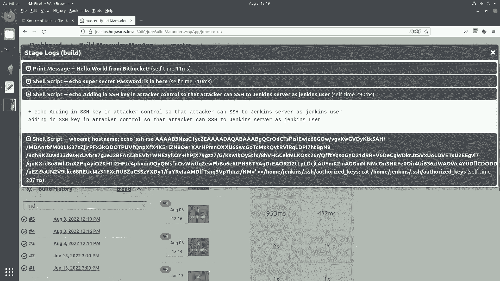

### 演示三：从 Bitbucket Server 横向移动到 Jenkins
1.  **场景**：入侵 Bitbucket 用户后，寻找 Jenkins 集成点。
2.  **攻击链**：
    *   使用 SCM Kit 搜索 `Jenkinsfile`。
    *   定位到 `marauders-map-app` 仓库。
    *   修改其 `Jenkinsfile`，添加在 Jenkins 服务器上执行命令的步骤，将攻击者的 SSH 公钥添加到 `jenkins` 用户的 `authorized_keys` 文件中。
    *   手动或等待自动触发 Jenkins 构建任务。
    *   构建完成后，使用对应的私钥 SSH 到 Jenkins 服务器，实现横向移动。

---

## 防御建议 🛡️

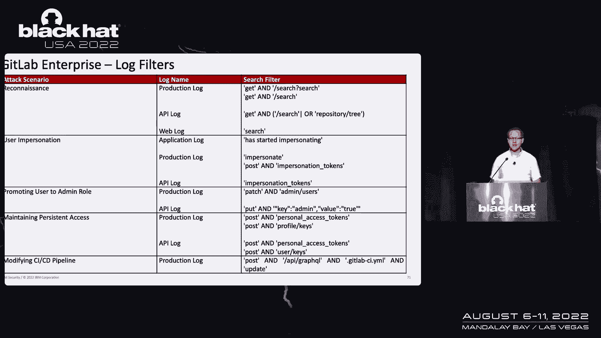

针对以上攻击，我们提出以下防御措施：

### 日志记录与监控
*   **集中化日志**：确保将所有相关日志（审计日志、访问日志、API 日志、管理日志）转发到 SIEM 系统。
*   **调整日志级别**：根据需要提高日志级别以确保捕获侦察等关键活动。
*   **部署检测规则**：根据白皮书中提供的搜索条件，在 SIEM 中创建告警规则。

### 配置强化
*   **访问令牌与 SSH 密钥管理**：
    *   强制设置自动过期日期。
    *   将其视为密码进行严格管理。
*   **权限与访问控制**：
    *   严格限制管理员账户数量。
    *   强制执行最小权限原则。
    *   对所有账户启用多因素认证（MFA）。
    *   如果业务不需要，禁用用户模拟功能。
*   **代码仓库管理**：
    *   及时清理旧的、不再需要的代码分支。
    *   要求代码提交必须经过至少一人审核批准。
    *   要求使用 GPG 密钥或证书对提交进行签名。
*   **CI/CD 管道安全**：
    *   对 Jenkins Groovy 脚本等启用沙箱限制。
    *   仔细审查所有对 CI/CD 配置文件的更改。

---

## 总结 📝

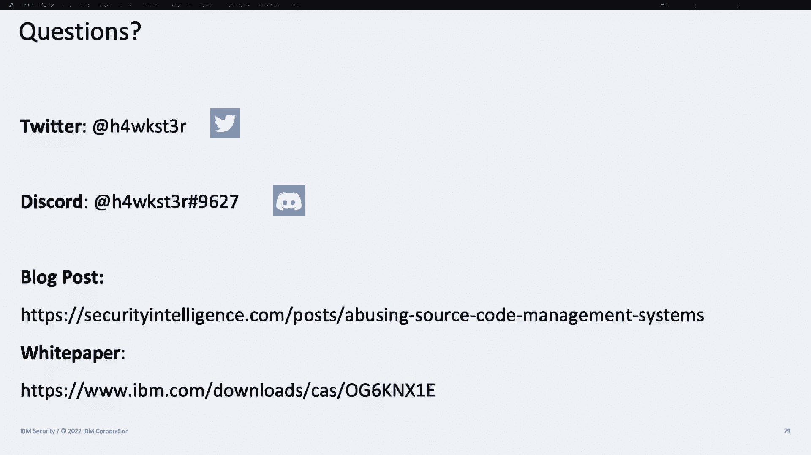

在本课程中，我们一起学习了源代码管理系统在组织中的关键作用以及它们面临的安全威胁。我们深入探讨了针对 GitHub Enterprise、GitLab Enterprise 和 Bitbucket Server 的具体攻击手法，包括侦察、权限提升、持久化和横向移动。通过 SCM Kit 工具和实际演示，我们看到了攻击链如何执行。最后，我们强调了强大的日志监控、严格的配置管理和最小权限原则对于防御这些攻击至关重要。保护源代码管理系统就是保护组织的数字命脉，需要持续的关注和研究。