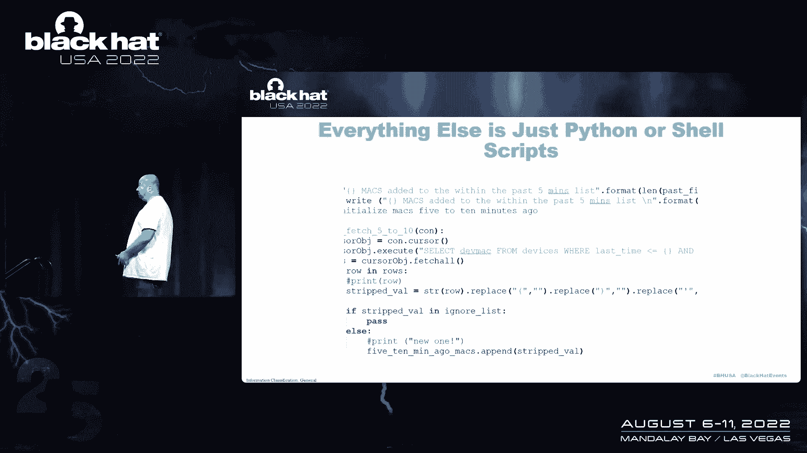
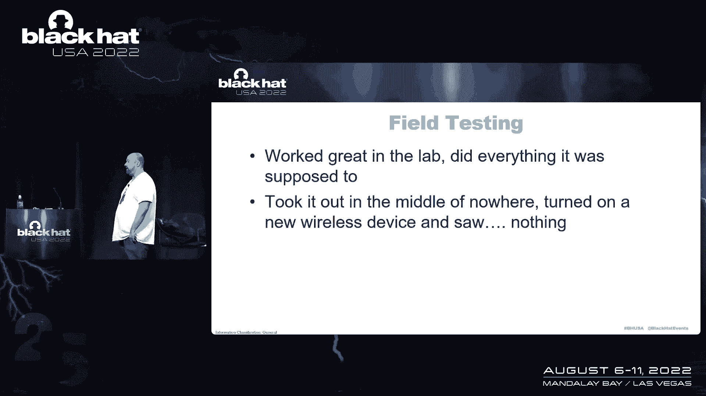
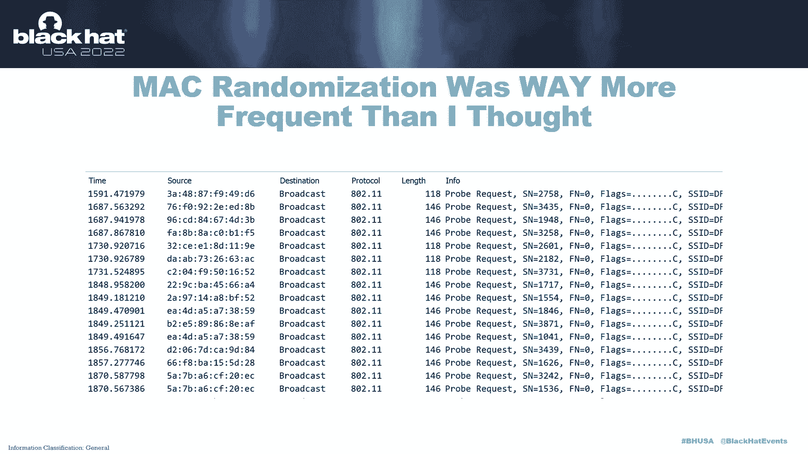
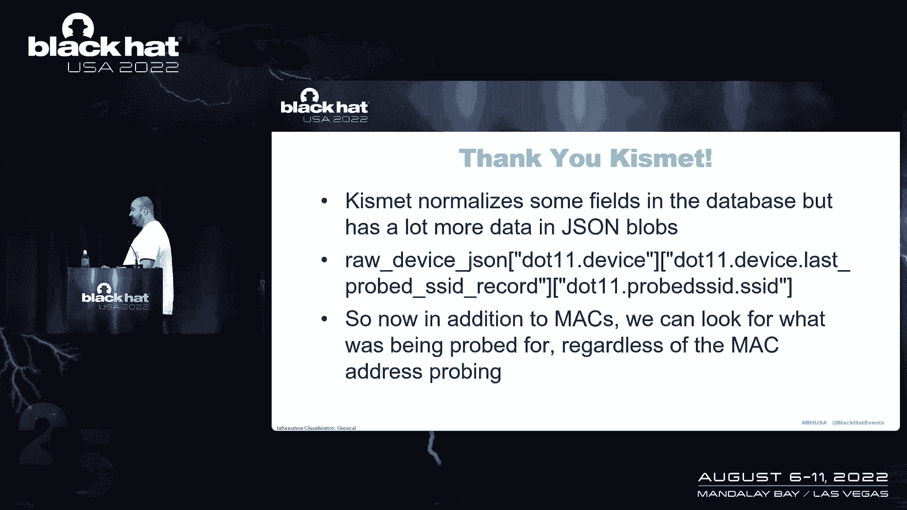
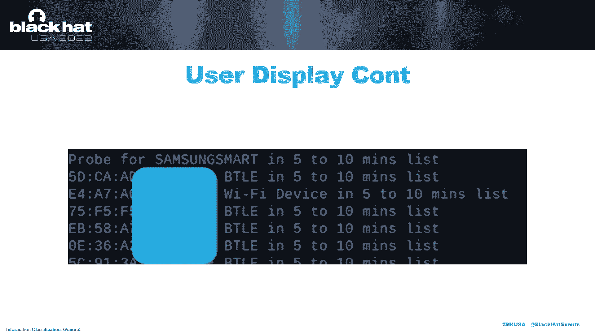
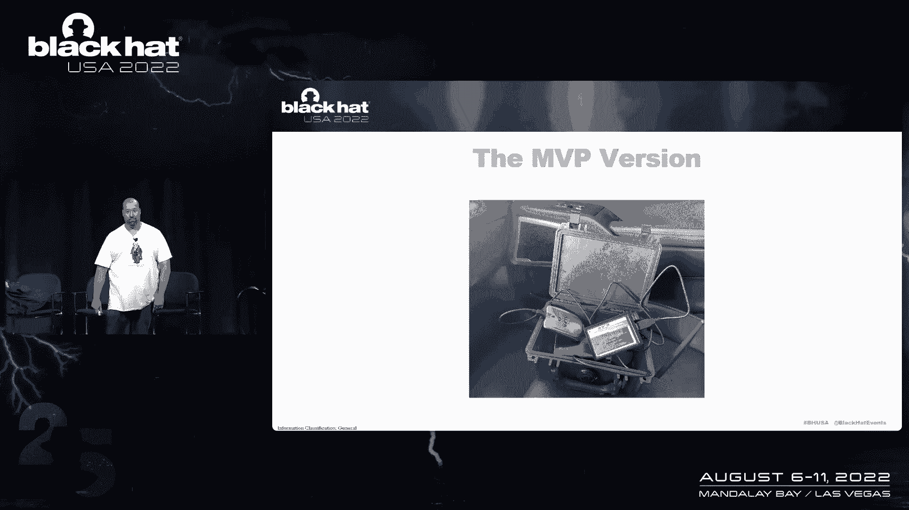
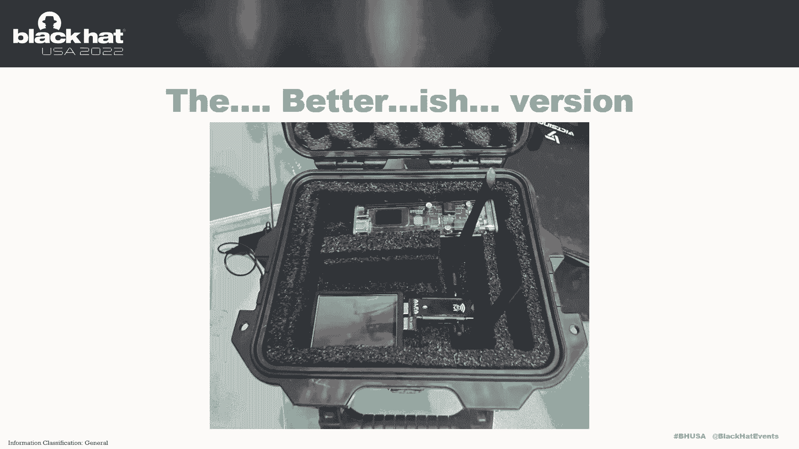
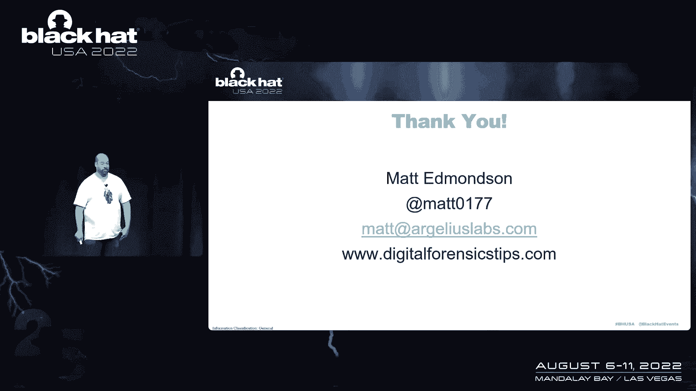

# 课程 P80：091 - 用树莓派追踪你的尾巴 🍃


在本课程中，我们将学习如何利用树莓派和无线嗅探技术，构建一个被动式设备，用于检测是否有人或设备在跟踪你。我们将从项目背景讲起，逐步介绍所需的硬件、核心软件、工作原理以及如何应对现代设备隐私保护机制带来的挑战。

## 项目背景与动机

我进行这次分享的原因非常重要。去年年底，一位在政府机构工作的朋友联系我，讨论一个WiFi相关问题。他并非担心自身安全，而是担心一位秘密线人的安危。这位线人与一个严重的民族国家恐怖组织有联系。朋友担心，如果他与我会面时被跟踪，跟踪者可能会根据我的信息追溯到并伤害这位线人。

几年前，我曾提到过一种利用无线信号判断是否被跟踪的方法。朋友记得此事，但他们的技术团队没有现成方案，于是他找到了我。我最初不愿重复造轮子，但经过研究，发现市面上充斥着侵犯隐私的技术，却鲜有工具能帮助处于这种困境的人。这令人沮丧。

考虑到这种工具几乎不会被滥用（因为它仅用于检测跟踪，而非帮助跟踪他人），我决定尝试构建一个。

## 核心概念：被动监视探测

监视探测包含许多常识性技巧，例如变道观察谁跟随、驶离高速公路再返回看谁同样操作等。在技术层面，我们采用的方法是基于无线信号的被动探测。

试想，即使是一个拥有顶级设备和技巧的国家级监视小组，其成员口袋里很可能仍有手机、车里可能有蓝牙设备（如AirPods或车载同步设备）。这些设备会不断探测周围的无线网络。

我们的策略是：被动监听周围的WiFi和蓝牙设备信号。我们并不关心它们是否处于活动连接状态，只关心它们是否存在。如果你在多个地点（例如星巴克、另一个地点、再一个地点）都发现了同一个设备，那么它很可能在跟踪你。

## 所需硬件清单



以下是构建该设备所需的硬件组件。设计初衷是尽量利用手头已有或非常廉价的部件。


*   **树莓派**：我使用了树莓派B型。目前虽然存在短缺导致价格上涨，但很多人可能已有闲置。
*   **外置无线网卡**：需要支持监听模式。经过社区咨询，很多人推荐使用阿尔法卡。
*   **电池组**：用于户外供电。一个便宜的充电宝即可提供超过8小时的续航。
*   **小型显示屏**：用于提供设备状态反馈。一个在亚马逊上售价约5美元的小屏幕就足够。
*   **外壳与按钮**：用于保护设备和进行简单交互。初期测试甚至可以使用粗糙但耐用的界面（如大按钮）。

## 核心软件：Kismet

我们使用 **Kismet** 作为核心软件来处理无线信号。

Kismet是一个免费工具，能将无线网卡置于监听模式，被动嗅探空气中的WiFi、蓝牙等多种信号。它非常强大，并且将所有收集到的数据写入一个SQLite数据库，这为我们后续的数据分析提供了便利。

你可以通过以下方式启动Kismet：
```bash
kismet -c <interface>
```
其中 `<interface>` 是你的无线网卡接口名。

## 工作原理与数据处理

上一节我们介绍了硬件和Kismet软件，本节中我们来看看系统如何工作并处理数据。

系统启动后，Kismet会自动开始嗅探并将数据写入数据库。我们的Python代码会实时读取最新的数据库文件。

最初的方法（记录不同地点看到的设备）效果不佳，因此我们改为基于时间窗口的方法：系统持续监控，并检查在当前时间窗口（如过去1分钟）内看到的设备，是否也出现在之前的时间窗口（如5-10分钟前、10-15分钟前等）中。如果是，则触发警报。

以下是处理逻辑的简化描述：
1.  系统维护几个列表，分别存储5-10分钟前、10-15分钟前等时间段内看到的设备。
2.  每分钟，检查当前看到的设备是否存在于上述任何一个历史列表中。
3.  每五分钟，滚动更新这些列表（例如，将5-10分钟列表变为10-15分钟列表，并用新的数据填充5-10分钟列表）。

## 创建忽略列表



为了避免对自己或周围常见设备告警，我们需要“忽略列表”功能。

操作流程如下：
1.  在安全环境中启动设备，让其运行几分钟，收集周围所有正常设备的信号。
2.  通过一个简单的按钮或命令，将当前数据库中所有设备的MAC地址加入忽略列表。
3.  此后，系统将只对不在忽略列表中的新设备发出警报。



## 应对MAC地址随机化的挑战

在现代设备隐私保护机制下，MAC地址随机化带来了重大挑战。设备在探测网络时，会频繁使用随机的MAC地址，这使得仅依靠MAC地址进行追踪的方法几乎失效。



解决方案是转而关注**探测请求**中的网络名称。即使MAC地址不断变化，设备所寻找的WiFi网络名称往往是固定或独特的。例如，设备可能一直在寻找名为“Cin‘s WiFi”的网络。



因此，我们升级了Python代码，除了检查MAC地址，还深入解析Kismet数据库中的JSON字段，提取设备正在探测的网络名称，并对其应用相同的时间窗口比对逻辑。



## 测试、效果与未来改进

经过实地测试，该系统能够有效工作。当有新的、独特的网络探测请求反复出现在不同时间窗口时，设备会发出警报。



未来可能的改进方向包括：
*   **支持更多无线协议**：例如轮胎压力监测系统信号，其传输距离更远。
*   **集成GPS**：在事后分析中，结合地理位置数据生成跟踪地图。
*   **优化数据分析**：编写更强大的脚本，从日志中提取更深层次的关联信息。

## 安全启示与总结

本节课中我们一起学习了如何构建一个基于树莓派的被动跟踪检测设备。更重要的是，我们获得了一个关键的安全启示：**设备所探测的WiFi网络名称可能成为独特的标识符**。

无论是个人还是组织，常常会设置独特、有趣的WiFi名称。这些名称可能在无意中泄露身份或位置信息，并被用于设备识别和追踪。

本项目的所有代码和零件清单均已公开。记住核心原则：不要让“完美”成为“足够好”的敌人。即使方案不完美，只要它能提供有价值的帮助，就值得去实施。

---




**总结**：我们利用树莓派、Kismet和自定义Python脚本，构建了一个被动检测跟踪的设备。它通过监听WiFi/蓝牙信号，并比对设备MAC地址及网络探测请求在不同时间窗口的出现情况来工作。该项目不仅是一个实用工具，也提醒我们关注无线隐私设置的潜在风险。