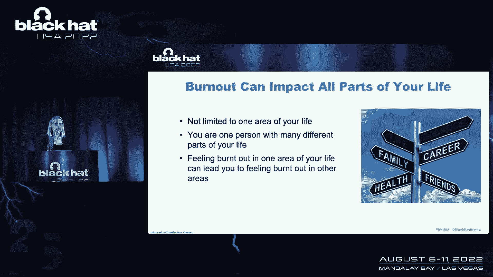
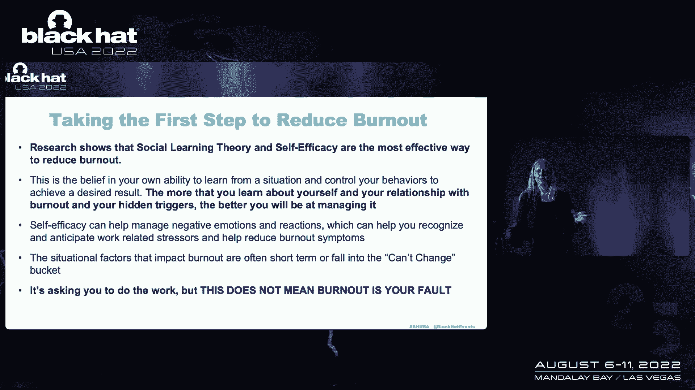
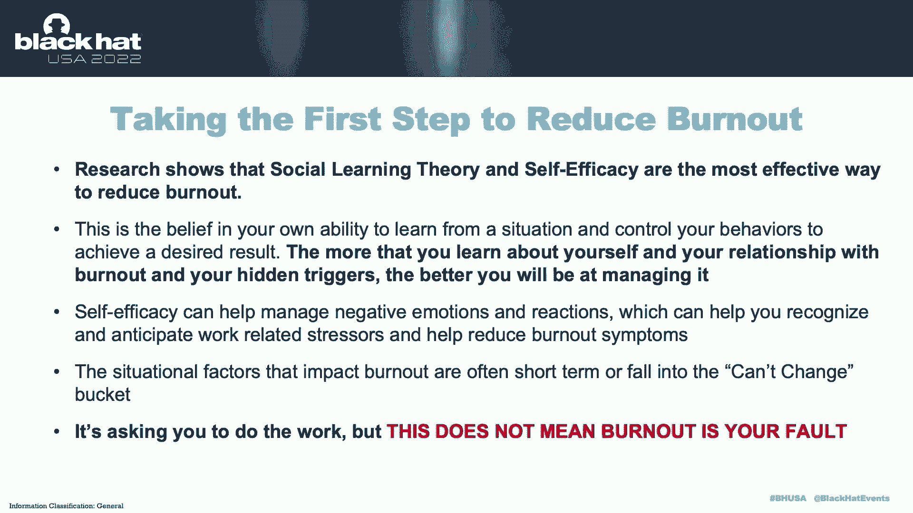
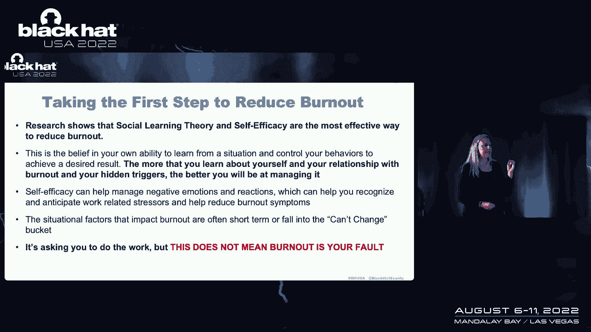
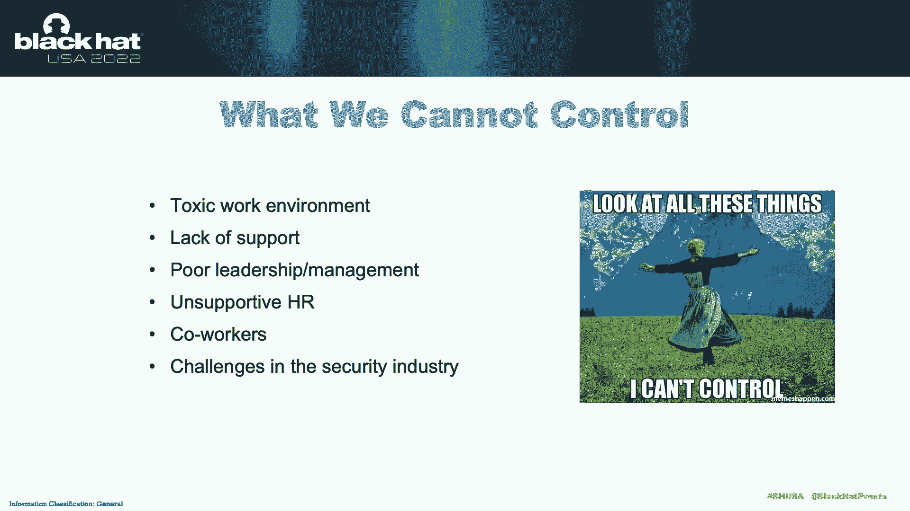
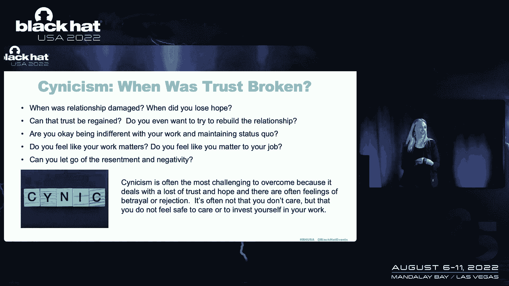
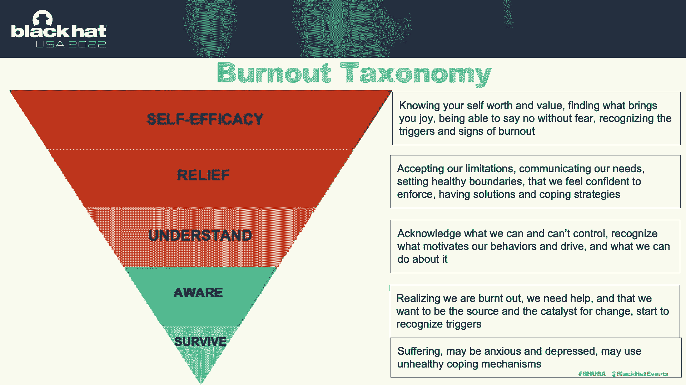

# 课程 P81：092 - 关于职业倦怠的探讨 🧠🔥

在本节课中，我们将要学习职业倦怠的定义、表现，特别是在网络安全行业的普遍性，并探讨如何通过增强自我认知来有效管理和应对倦怠。我们将避免使用简单的“创可贴”式解决方案，而是深入理解其根源。

---

## 什么是职业倦怠？🤔

职业倦怠在临床上被定义为一种心理综合症，由工作中长期的情绪和人际压力源引发。它不一定源于你申请工作时看到的工作描述，也不一定是你为工作所做的事情。它更多地被定义为一种关系——你与同事、经理以及生活中其他人际关系互动中可能发生的情况。

上一节我们介绍了倦怠的基本概念，本节中我们来看看它的具体表现形式。

## 倦怠的三种表现方式 😫

根据研究，当我们感到筋疲力尽时，倾向于通过三种不同的方式来表达：

*   **情感耗竭**：你感到疲惫，付出了太多，资源被过度消耗和耗尽。
*   **玩世不恭/去人格化**：你感到愤怒、疏离、无所谓，对工作不再感到满意。
*   **个人成就感降低**：你觉得自己不擅长工作，感觉糟糕，甚至可能认为自己明天就会被解雇。

在网络安全行业的研究中发现，由**玩世嫉俗**引发的倦怠反应最为常见。这是一种独特的断开感、愤怒和怨恨。

重要的是从整体角度来看待倦怠。当你在工作中感到沮丧时，这种情绪可能会被带回家，影响你的伴侣、孩子和朋友，产生滚雪球效应，最终全面耗尽你的精力。

---

## 网络安全行业的倦怠现状 🛡️

当我们聚焦于网络安全行业时，情况尤为严峻。研究表明，该行业有**70%到80%**的专业人员正在经历倦怠。这意味着，如果有一万名安全专业人员，其中大约七千人可能处于倦怠状态。

以下是导致网络安全行业倦怠高发的一些常见诱因：

*   **高认知负荷**：需要持续反应和预测网络攻击的脑力工作量。
*   **人员短缺与工作量增加**。
*   **在组织中的定位困难**：为不理解安全重要性的管理层工作，难以争取所需资源。
*   **缺乏组织理解与赞赏**：组织内其他人通常不了解安全实践，更不用说如何支持安全团队。

---

## 为何传统建议往往无效？🚫

当我们上网搜索“如何治疗倦怠”时，通常会找到诸如冥想、培养新爱好、减少工作、休假等建议。然而，当你真正处于倦怠的“黑暗”状态时，这些建议可能令人沮丧甚至愤怒。

因为你可能会想：“如果我减少工作，我的焦虑会爆棚”、“休假时我也会不停查邮件”、“我累得甚至无法开始一项新爱好”。这些建议本身是好的，但问题在于，处于深度倦怠状态的人不知道如何“到达”那个可以执行这些建议的心理状态。

因此，我们需要一个更循序渐进的过程，我称之为“倦怠分类法”，它从“生存”开始，逐步走向“缓解”和“自我效能感”。

---

## 应对倦怠的核心：自我认知与自我效能感 💡

研究表明，应对倦怠最有效的方法与**社会学习理论**和**自我效能感**有关。这意味着，你对自己了解得越多，对自己的反应、触发因素、信念和心理叙事认识得越清晰，你就越能有效地管理它。

这并非将倦怠归咎于你。有很多糟糕的情境因素，如有毒的工作环境或管理不善。增强自我认知的目的是区分**你能控制什么**和**不能控制什么**。因为最终，承受痛苦的是你——是你感到愤怒，是你的人际关系受损。

例如，面对一个总是迟到的同事，你无法控制他的行为，但你可以控制自己对此的反应和叙事。反复在脑海中反刍“他应该准时”的故事只会让你持续愤怒。

---

## 从意识到行动的步骤 🧭

以下是帮助你从意识到行动，逐步应对倦怠的框架：

**1. 识别与承认**
首先，意识到“我倦怠了，这不好”。停止用“我应该……”来责备自己。允许自己感受这些情绪（悲伤、愤怒），仅仅是承认它们的存在。

**2. 理解与探索**
开始问自己问题：我为什么会有这种反应？是什么触发了我的情绪？我在这里需要什么？寻找模式，理解让你沮丧的事情。

**3. 管理与小步改变**
基于你的理解，开始实施微小的改变。例如，如果某个会议让你特别沮丧，之后安排15分钟休息。如果某人触发你，暂时离开一下。为自己的成功做好准备，设定可实现的小目标。

**4. 建立自我效能感**
这是知道自己的价值，能够预见并管理触发因素的状态。就像对压力源“施展柔术”：我看到你来了，我躲开它。这需要持续的自省和调整。

---

## 实用建议与工具 🛠️

以下是一些快速且实用的建议，帮助你开始这段旅程：

*   **明确你的极限与目标**：思考幸福对你而言是什么样子？你想从工作中获得什么？如果不知道目的地，你就无法判断是否到达。
*   **寻求专业帮助**：考虑通过治疗师或教练来获得支持，他们可以帮助你提高自我认知，理清思路。
*   **了解你的内外触发因素**：识别外部情境和内心批判的声音。
*   **有意识地安排“恢复性时间”**：尝试每天留出时间做一些真正让你恢复精力、感到满足的事情（不仅仅是消遣）。
*   **庆祝小事，捍卫你的幸福**：你的工作很重要，但它不必定义你的全部价值和幸福。找到工作之外能让你充满活力的事物，并保护它。

---

## 总结与鼓励 🌈

本节课中我们一起学习了职业倦怠的复杂性和在网络安全行业的高发性。我们认识到，简单的解决方案往往不够，真正的改变始于深度的自我认知，区分可控与不可控因素，并从小处着手建立自我效能感。

请记住，经历倦怠不是你的错，但走出困境的责任在于你自己。你不应该承受这种痛苦。希望本次讨论能让你开始思考：“我不必这样。”从这里出发，决定你想做什么，以及你可以去向何方。你完全有能力找到属于自己的平静与满足。