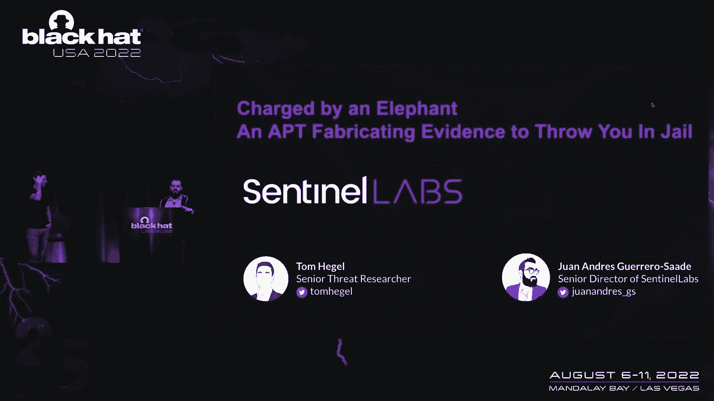
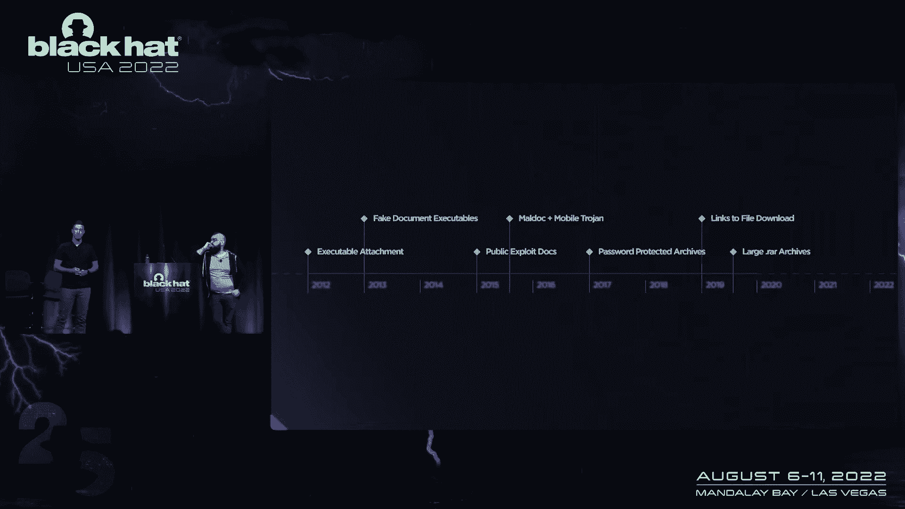
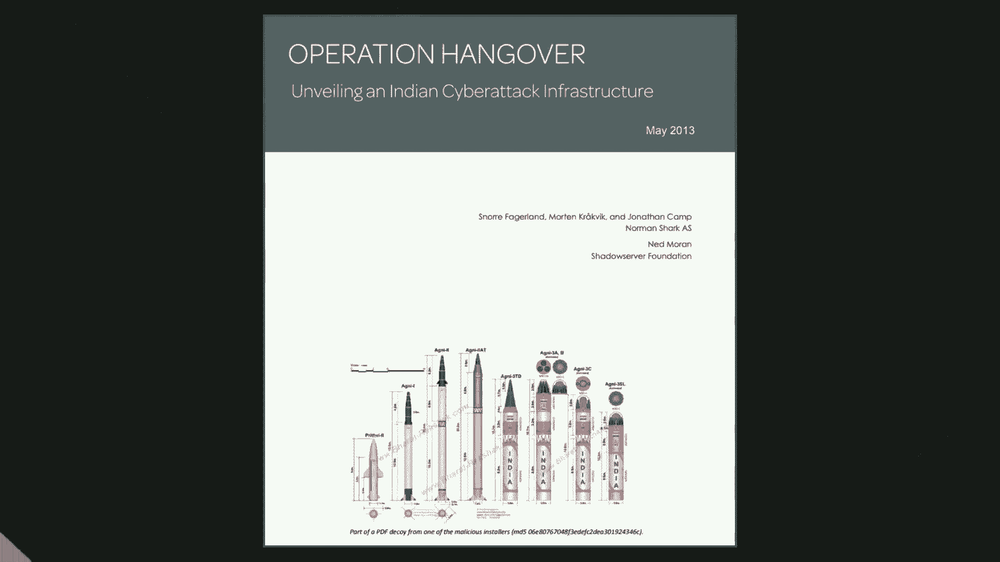
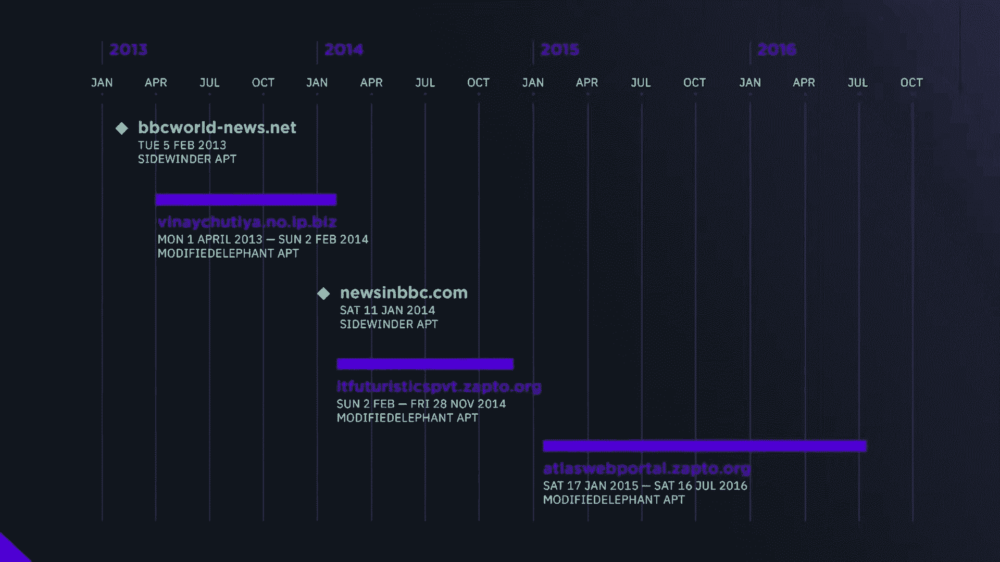
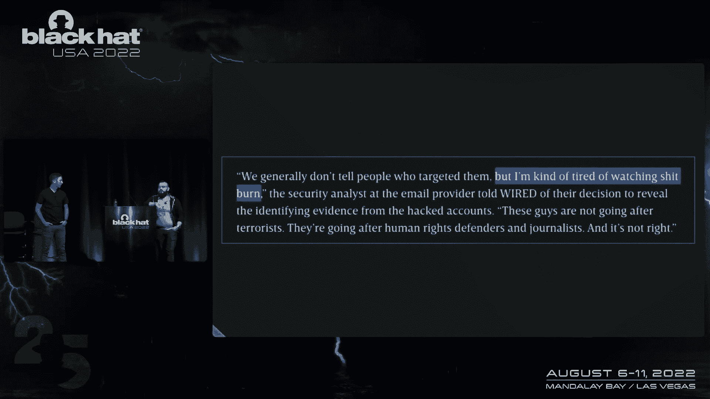
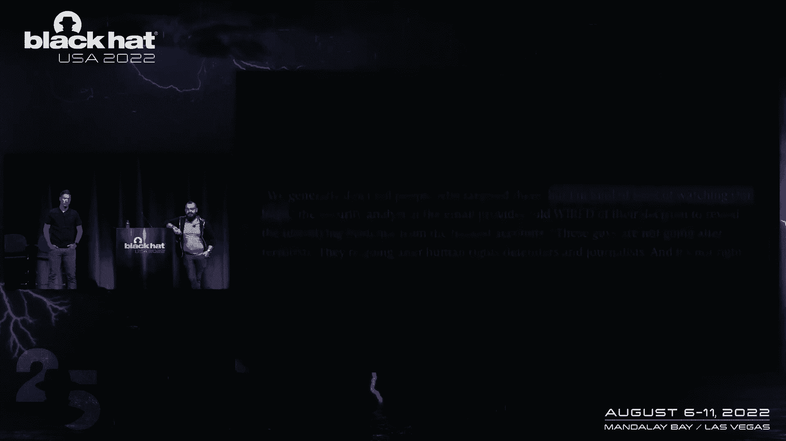

# P82：093 - Charged by an Elephant – An APT Fabricating Evidence to Throw You In Jail - 坤坤武特 - BV1WK41167dt

 (upbeat music)。

 - Now it's my pleasure to welcome to stage， Tom Haggle and Jags。 - All right。 - Yep。 - I know。

 (audience applauding)， - All right。 All right， hello， hello。

 Thanks for showing up everybody。 Thank you for coming to hang out。

 My name is Panganarajarajarajaraj。

 Jags is fine。 This is my boy Tom Haggle。

 We're over at Sentinel Labs in Sentinel-1， of McCarran Airport fame。

 Today we're gonna talk about a threat actor， we call a modified elephant。

 It's actually a pretty somber story in a lot of ways。 We're just trying to kind of highlight。

 some of the human costs that goes， into some of these operations， that you don't usually hear about。

 right？ It's all malware and phishing。 We talk about info-sec。

 but there is very much a human cost associated， to some of these things。

 and we're gonna try to delve into some of that。 This all kicks off for us with some stories and work。

 unrelated to modified elephant。 There was a story on Vice by Andrada Fiskutian。

 who's a fantastic journalist out of Romania， where she reports on this Turkish journalist。

 Baris Belémon， who was essentially framed terrorism。 And the guys over at Arsenal Consulting。

 amazing IR company， they had done this pro bono work for the journalists。

 and figured out that malware had been used， to implant evidence on his machine。

 and then it was thrown in prison。 So we followed up with the Arsenal report at the time。

 and of course， the IR work itself is solid。 We don't need to do the digital forensic stuff。

 Those guys have it done。 They did it right。 But coming from the threat intelligence side。

 it's actually much more curious to know， are there more operations by these people？

 If they're willing to do this kind of really messed up stuff， are they， what else have they done？

 Chances are it's not just somebody who decided， to get into hacking for just that one egregious act。

 So from the threat intel side， it becomes really important for us。

 to sort of try to track some of the actors， and try to understand what else they're up to。

 Interestingly， after all this， all these folks got acquitted。

 but it took years for them to actually get out of jail， and frankly。

 I'm pretty sure Baris is back in prison， for some totally unrelated thing now。

 But as we kept tracking it， we came across this actor， we called E-O-Maniac。

 It's a reference to the letters E-G-M， which appear in a lot of the new malware， that we found。

 sort of like a previously unrelated， malware toolkit that we were able to connect based on like。

 code similarity and a few other things。 It gets really interesting because as we are digging。

 into this actor， like if you saw Kim said her this morning， I mean， she's a giant in our space。

 particularly because like she's not just regurgitating， you know， whatever， some company sends her。

 or some random report， like she's as close as we get， to an investigative journalist in cyber。

 And when she started to dig into it， and we were talking about the report。

 what she finds is actually a ton of， from the attribute。

 the contributory threads that we pulled based on E-O-Maniac。

 what she finds is actually connections to sort of， reinforcing the connections that we found。

 to the Turkish police， particularly things， in the hacking team leak and so on。

 So we have this sort of trend of like， we're seeing law enforcement abusing malware。

 to do obviously egregious things。 When we finish this investigation。

 we get a ping from the guys at Arsenal， Mark Spencer， you know， the IR folks， basically saying。

 "Hey， if you care， about that case， like， you should check out， what's happening in India。

 we're working something else。"， - Yeah， so at that point， we begin to look into the secondary case。

 and completely different。 Different type of story， but it strikes the same core to us。

 where we have a large group of activists， that are potentially being targeted。

 with evidence that was planted， and they're being used to， using that to throw them in jail。

 For terrorism charges and so forth。 And this is one of the first articles。

 from the Washington Post that began to highlight， this activity。 And as that quickly evolved。

 more activity began to be found from our friends at Arsenal。 And we start to get an idea of。

 there's actually， it's not just a handful of activists， but there's potentially the possibility。

 that there's a larger campaign at play here， that as threat researchers really sticks out to us。

 and we really want to begin diving in。 So， thankfully， we are blessed by the Arsenal team。

 that is able to release the forensic details publicly。

 And there's a lot of stuff that people have written on it。

 and there's deep dives into particular pieces， but you're actually able to go right to the website。

 and download the actual forensic reports， that are being used to help the defense team。

 or these activists have been arrested。 And the cases centered around what's called the BK-16。

 We'll talk more about the individuals here in a second。

 but ultimately we have four reports that came from Arsenal。

 that detail the forensic evidence of malware， that was associated with potential documents。

 that were planted and those documents then being used。

 as evidence in cases against these individuals。 So in these documents， we're able to take a look at。

 malware samples。 Those malware samples can then lead， to new sets of infrastructure。

 And as we begin to deep dive into this， through a set of infrastructure analysis。

 taking a look at all the samples and building our case， we're actually able to lead to what we call。

 the modified elephant apt。 This is a combination of the entire profile。

 of this actor that we see hitting these BK-16 activists， and then leading to a larger campaign。

 that spans about 10 years。 Pretty shocking considering the case。

 against these individuals where this malware， that is associated with what we call modified elephants。

 is being used in cases that is leading to forensic evidence， of documents that are fabricated。

 So there's a very particular， I guess， threats in our case， where the actor is really just。

 I don't know， what would you say？ - Entirely unscrupulous？ - Exactly。 Keep in mind。

 like we're obviously， we work a lot of APT cases。 It's not that we are staunchly against。

 intelligence， collection or espionage or whatever。

 Like we understand that that's sort of a part of things。

 And people have been talking about lawful intercept， malware forever。

 but it turns out that if you give， capabilities like this with no controls， to law enforcement。

 they don't just use it for collection。 - Yeah， it was an interesting set of infrastructure as well。

 You know， we have about 10 years of activity， that we're able to look at and thanks to the insight。

 that Arsenal gave us and then widening the intelligence， into this actor based on our own telemetry。

 or in our own analysis， we're able to get， a really interesting historical understanding。

 of how this actor has evolved over time。 So to take a look at what they do as an adversary。

 we're gonna kind of highlight some particular pieces， to how they attack these individuals。

 and what they've done historically。 - Guys， hold on here。

 This is not about to blow you away with malware， which is probably the worst part。 - Yeah。

 the worst part about this is the simplicity， and the simplicity and the unsophistic。

 unsophistication of it all leading to some of the most， horrific results in my opinion。

 But what you're seeing here is one of the phishing emails。

 from 2013 that is associated with modified elephants。 And this is just one of many。

 many examples of how they have， a tempted initial access into these， these activist machines。

 And this is a brutal example of the simplicity here。

 where they are literally emailing an executable file。

 trying to get them to open it。 They've evolved over time， and this is a timeline。

 of what we've seen them do over the last decade， evolving their。

 particularly their phishing techniques。 So we'll talk about other techniques。

 but looking at phishing alone， you know， early days， they were doing just what I just showed you。

 emailing shared up executables， emailing executableswith。doc。exe。

 And then eventually getting to exploit documents， malicious documents that are a bit more fabricated。

 and are going to compromise a vulnerability on the machine， to ultimately lead to infecting it。

 They go through a couple of different iterations， of what they do overall， but nothing shocking。

 I would say。

 - That's the worst part。 So just to kind of really highlight sort of what we mean。

 by this kind of digital entrapment。

 what the Arsenal reports show is not that a machine， has malware and has incriminating documents。

 It's literally being able to track these net wire rat sessions。

 attacker sessions where they're connected to the malware， in these machines。

 dropping documents into volumes， folders that the owners of the machines have never accessed。

 The documents are created with a version of Microsoft Word， that they've never had。

 like the different version of it。 As far as the incident reports could tell。

 they'd never been opened by anybody there。 So like it's literally like attacker session。

 just drop docs over time and bolt。 So you can see here a list of like a lot of the letters。

 and look， I would love to come here and tell you like。

 this is the most sophisticated APT we've ever seen， and they do really bad stuff。

 The banality of this is terrible。 Like net wire rat costs like a hundred bucks。

 and you could probably just get it for free at this point， but intent is a very different situation。

 - Yeah， and one interesting piece here that Arsenal。

 actually discovered during the forensic reports was， in many of these cases we're seeing this actor。

 operating on multiple victim machines， planting similar evidence within 15 minute time span。

 And these targets are unrelated individuals。 So it's a very interesting campaign。

 but we'll talk about the different malware here in a second， but yeah， net wire is one of them。

 - So actually when we talk about the evidence。

 I mean you can see this is sort of the main， the main document， there's about 10 that they really。

 the prosecution focuses on， but the main document is this plain stated plot。

 to assassinate Prime Minister Modi， about as plainly as you can think of， right？

 Like we're gonna need some M4s and like 400，000 rounds， and we're gonna target his road shows。

 for an effective strike。 Like it's as plain spoken， like， you know， let's get to killing the PM。

 The other documents are similarly this idea， that like they're sort of fomantic domestic chaos。

 Like keep in mind， look， whatever the politics， are going on there。

 whatever the different groups live， that it's a local context and I'm sure。

 that you can have different opinions about it。 But at the end of the day， like， yeah。

 these guys are activists， but taking， you're trying to sort of frame the idea， of this sort of 15。

 16 individuals， as this destabilizing force for the entire country， in a series of what， like， 10。

 15 letters， that's what the prosecution focuses on， but in the most plain spoken sort of way。

 So what makes it more interesting for us is this， which is one， again， one of the top 10 documents。

 is the last one planted。 It's literally 11 days before the search and seizure。

 So when you start talking about some semblance of attribution。

 there's no point to putting an incriminating document。

 to the machine unless somebody shows up to check it。 So start to kind of form a very simple picture。

 as we go forward。 So of course， after that， these 16 individuals， get thrown in jail。

 As if that's not bad enough， now with COVID and everything， Stan Swamy。

 who was a Jesuit human rights activist， actually passed away in jail。 So yes。

 it's all malware and phishing， and what not， but for us， there's a very real human costs。

 and a very clear implication to what's going on here。

 - So some of the planted evidence that we showed you， in some of the phishing emails。

 or the malware and timelines we get a lot， is coming from one target in particular is Ronah Wilson。

 And the arsenal reports tend to focus on him a lot as well， but this individual sticks out to us。

 because of the amount of activity， and the persistent nature of these attacks。

 against this individual over almost a decade， it was shocking。

 Even from somebody that we researched top tier APTs all day。

 it was shocking to see the persistent level， of activity coming from these actors。

 And looking at all the data for this individual， we get a very unique picture of the motivations。

 and the different nexus of actors coming out of India， that are targeting this individual。

 So we have modified elephant， obviously。 That activity with Ronah Wilson， this individual。

 it goes back 2012 plus， there's activity， that is kind of fuzzy before 2012。

 but if you're familiar with the Indian threat landscape， that's kind of the big shift in that arena。

 So it kind of started there， and then later on， we begin to see his email accounts。

 being compromised 2018， which we'll talk more， about that in a bit。

 And that all ties back to what we call modified elephant。 However。

 there's a complete other subset of activity， that we see targeting this individual during our analysis。

 that links to another one， another APT。 I'm very familiar with this side winder。

 And then we have other activity that links to， what Arsenal found is a iPhone that was infected。

 from Ronah Wilson by Pegasus。 Everyone knows the mobile spy work group， on the private sector side。

 So one other really interesting thing here， talking about the links between modified elephants。

 and all these other， this other relation， of Indian APT activity is the early， early side。

 of what we call modified elephant to actually links。

 through infrastructure overlap with the almighty， operation hangover report。

 If you're not familiar with this， operation hangover is。

 was kind of the turning point for public knowledge， on Indian APT activity that this report。

 isn't just written in 2013， but it reports on activity， as that spanned years prior。

 And it was a big shift because this actually highlighted， the relations between Indian APT activity。

 and what we know as potential contractors。 One in particular that a lot of this activity stems from。

 going into the future is the App and Security Group， out of India。 And that group in particular。

 you can kind of think of them， as the tree trunk to all of today's threat activity。

 coming out of India。 Everything one way or another tends to lead back to them。

 In the case of modified elephant that turned out true。

 through the use of infrastructure that was previously， reported in operation hangover。

 So Sidewinder， I mentioned I'm intimately familiar， with them。

 They're an espionage group that tends to focus throughout Asia。 And I report on them last year。

 And my report here is prior to any insight into modified elephant， to that point。

 And that report highlights activity that was them targeting。

 government organizations and private businesses， for espionage purposes throughout Asia。

 So they're well reported。 The industry is well aware of them。

 But they are kind of more sophisticated in many ways。

 than what you would think modified elephant is。 So there's an interesting relationship between modified。

 elephant activity and Sidewinder。 Are they potentially coming from the same reporting。

 organization assigned to target this particular individual？ That's where the mystery kind of begins。

 It's sort of interesting for us。 I know sort of all the names don't necessarily。

 mean a whole lot to folks who are not in the threat until game。

 But what makes this interesting to us， is you have this activity that seems。

 to be very related to law enforcement of modified elephant。

 But this nexus is revolving around Roan O' Wilson。

 also brings in another APT that has been known for a long time。

 as doing the kind of national security work， you would expect， sort of like espionage。

 on foreign countries， things that are sort， of important to the state。

 So to have it all kind of revolve around this person， entails a different level of tasking。

 from a larger organization than just having。

 one sort of rogue set of actors that have decided to target him。 So that relationship can actually。

 be highlighted in many interesting ways， where there's probably a deeper bond between what。

 we see as modified elephant and Sidewinder overall。 Being that we're lucky enough to have insight。

 into almost a decade of activity from modified elephants， with sprinkles of these other APTs。

 we can get pretty interesting timeline here， of an overlap of infrastructure being used to target。

 modified elephants， typical targets， the exactivists and so forth。

 So what you're seeing here are the green domains there。

 That's infrastructure that's been attributed， to Sidewinder activity。 And then the blue side。

 we see the infrastructure， that we associate with modified elephants。

 And when you compare them against what's， being used to target these individuals at the same time。

 we begin to see a really interesting overlap of kind。

 of tasking in many ways where there's passing back and forth。 As you can see。

 modified elephant is much more persistent， using them much longer while Sidewinder was more of a one。

 and one and burn kind of case。 It's also be clear that modified elephant is not， a subtle attacker。

 Yes。 Like with someone like Sidewinder who's doing sort， of proper espionage。

 you might get some sort of careful curtail。 We'll send you a fish and email。 We'll wait。

 We'll see what happens。 Modified elephant will just keep hitting the same target over， and over it。

 Like why don't you open this breaking attachment？ It's not subtle。 It's not amazing。

 It's just persistent。 Yeah。 Many times within an hour， shocking using the same samples。

 over and over and over， refording the fish and emails， that failed months ago。 It's interesting。

 So talking about the Pegasus overlap， which I mentioned briefly。

 I want to kind of explain a little bit around how that kind of ties。

 in here because it's kind of confusing in many ways。

 So I want to make sure you have a good understanding of this。 But from our perspective， we're not。

 seeing a direct link between modified elephant and NSO。

 But that link is done through what we see coming， from the forensic reports。

 So it's kind of time-line it here or kind of show you the workflow。

 We have a hard drive that's recovered， and the forensic analysis is done on that。

 And then there's an iTunes backup of one of Ronah Wilson's iPhones 2017， 2018。

 And that iPhone 6S has indicators that it's infected with Pegasus。

 And that was all identified by Arsenal， so major kudos to them。 But again。

 this really shows the overarching tasking being done， from the entity leading these actors。

 So is it the same organization that's assigning， Sidewind or modified elephant and also making use of Pegasus。

 to target these individuals？ Kind of a spray and pray approach getting as many options。

 as they can to infect these people and track them。

 It's also important to note that since we don't know who the operator is。

 for Pegasus in this particular case， there is the question of whether it is modified elephant also。

 having access to Pegasus。 Because we see them attempting to use mobile malware at some point。

 sort of again， crappy， android malware。 And that didn't seem to go too well at the time。

 But after how many years of successful operations do you， start to get a greater level of support？

 Or is there just a completely separate entity that gets to use。

 Pegasus and also cares about this target？ On that note。

 this is kind of a timeline of the techniques， that we see associated with modified elephants。

 And then a little bit of a highlight of where that Pegasus side kind， of starts to play here。

 So on the far left-hand side， early years 2012 and beyond。

 we see primarily the initial infection vector， is leaning towards phishing emails。

 And that the technique in phishing emails ultimately， has very throughout the years。

 But in the beginning， they were making use of dark comment。

 rat to deploy onto these victim machines for their collection。

 and typical remote access Trojan activities。 And then they ultimately ended up relying on net wire。

 almost completely from a couple of years afterwards。

 But there were a few cases in there where we saw interesting。

 attempts at trying to deliver probably the most poorly done， key logger in all of this area。

 It's like a visual basic garbage key logger。 And when I say garbage。

 it's not just the VB aspect of it。 But it's also like it's using email addresses。

 to exfiltrate the data。 They're sort of emailing it to these accounts， which ends up。

 being the crux of some interesting attribution details， that we're going to go into in a little bit。

 Yeah， those emails that were being used in the key logger。

 were actually an interesting pivot point for us， on collecting and clustering the entire modified elephant。

 threat actor， because those emails were， used across many samples and， again， the attribution side。

 as well。 The interesting part is later on in their lifespan， going into today。

 we obviously see the mobile side， with the Pegasus。

 And that's where we think they are tending to lean nowadays。

 But understanding of that is a little bit more fuzzy。

 as we go to modern days of who they're potentially targeting。

 But then we have the email takeover side， which， gets in a little bit more confusing area。

 So we have， during these campaigns， activity， that is associated with these individuals having their email。

 accounts compromised through the public free email services， Gmail， Yahoo， and so forth。

 And those accounts， ultimately， being， used to do more malicious activity。

 which we'll talk about here， in a second。 So this is where things get even more interesting。

 Andy Greenberg over at Wired hits us up， when we had accepted for this talk。 And he's like， amen。

 the story sounds fascinating。 We'd love to follow up。 When we started talking。

 we sort of started going through some， of what we had found。

 Some of what we had found that we couldn't necessarily talk， about in the report。

 Because there's a fair amount of data， sharing that happens in the industry。

 as we try to go after bad guys。 And you have to respect TLP。

 You have to respect where data is coming from and so on。 And we were under certain restrictions。

 of what we couldn't publish。 But there was a sort of interesting set of data there。 It wasn't ours。

 But it came from a source that will remain， nameless because of their own request。

 But someone incredibly brave， incredibly brilliant， who was willing to go the extra mile just。

 to do what they considered to be the right thing。 This person actually spoke directly with Andy。

 And it turns out-- this is not like a whistleblower situation。 It turns out that if you do appeal。

 to lawyers that have a conscience at a service provider， they're not all soulless。

 And you do get some folks who are concerned about human rights。

 are concerned about doing the right thing。 And we're actually-- the way that our friend put it。

 is that they're tired of watching shit burn。 And that's a situation that we tend。

 to be in a lot in threat intelligence， where， you know terrible things are happening。

 And you just kind of watch it go down， because you don't have access to doing more。

 So in this particular case， the company， was willing to provide the data。

 And it makes for a much more interesting story。

 Yeah， so to understand a little bit， the Wired article goes into great detail here。

 And this is to try and summarize kind of how this link is done。

 And what you'll find in that Wired article， is linking modified elephants ultimately。

 to a particular police-- or Pune Vindia， a police individual。

 And the process of how we got that data， obviously， is we want to keep it-- or who we got that from。

 is a little bit more sensitive。 However， that data can then be used and verified， to make this link。

 And so this is kind of a summary of how Wired and Andy， was able to use other individuals。

 In particular， we have John Scott-Raelton， from Amnesty International and Zishan--， Zishan Lab。

 Sorry， John Scott-Rael--， JSR from Citizen Lab and Seshan-Acees from NISO's。 Just to kind of look。

 attribution is complicated。 Attribution is hard。 I've written on it before。

 I'm not sort of sidestepping that。 But in the process of Andy doing his homework。

 they handed the indicators alone with no context， to two different researchers at totally different companies。

 without telling them what this is about and said， hey， who can you link this with？

 How has this been used？ Can you sort of verify？ And this is what they came up with。

 It's not sort of what we alone were pushing。 So focusing on the victims first to kind of summarize this。

 what we have is during these email account compromises。

 we have a couple interesting things happening。 First is when modified elephants compromise。

 these email accounts， we see a recovery email address being， added to those accounts。

 And then we also begin to see a particular phone number being， added to these accounts as well。

 Ultimately， this kind of signals our expectation， of modified elephants historically。

 in the lack of operational security， the lack of--， Savviness？ Exactly。

 It was a pretty egregious sort of mistake， in a variety of ways。 But presumably。

 they wanted to make， sure that they could just get access again if they ever lost， access。

 So in this case， we have three accounts that are compromised。

 And then that ultimately leads to those accounts being， accessed through the same infrastructure。

 that we're seeing modified elephants associated， with through their attacks and their long term C2 setup。

 and so forth。 And then those accounts that are already compromised。

 are then later being used to fish other individuals that。

 are of targets to modified elephant as well。 And a fascinating approach to an attack technique。

 is pretending to be these other individuals that， may have more trust or may have some relevance。

 to additional targets。 And that ultimately leads to additional targeting。

 throughout this set of the BK-16 activists in India， that we referenced at the beginning。

 So we had the victims that are all compromised at this point， but what about the attacker？

 How does modified elephant link to the Pune Police of India？ So we have the email address。

 And thanks to those two individuals from the Wired article。

 we have the email address that was associated with--， through leak databases， in particular。

 we have the true caller database， the app that's， used to identify individuals that you can install on your phone。

 The India version of that was leaked a while back。 That particular email address is associated。

 with the same individual that is named actually using， an email address。

 So we have some more confidence there that it is actually his。

 And then we have that phone number also linking， to archived websites， actual police websites。

 that reference this is the individual。 And this is his personal email--。

 or his email address on an official government website。 So the case was pretty solid at that point。

 And that alone was shocking。 However， JSR from Citizen Lab took it a step further。

 John's got reulted and his simple genius decided。

 to just put the phone number in WhatsApp。 And it turns out that up to the time of our investigation。

 the same person is still using the same phone number， with this picture， name。

 everything sort of put in there。 Yeah。 Pretty shocking， at least。

 So the part where this kind of gets more concerning is fine。 We can say this is like this idiotic。

 not very good， but very malicious threat actors out there。 But like， hey。

 if you don't go clicking on phishing emails， maybe you're not so bad。

 But a reality what we're seeing is an evolution， of their tactics in a way that's very concerning。

 Because you already have the sort of the Saneso Pegasus tie-in。

 which we all know the visibility into what's， happening with Pegasus is horrible。

 Take it up with Apple， but it's absolutely ridiculous。

 that all we get is just whack-a-mole with exploits， and there's no visibility into what's。

 happening with the actual malware。 Nobody knows if any of our phones are infected。

 I don't know what to tell you。 We can all sit and stare at this thing。

 and I don't know what we're going to do about it。 Reboot it。 Yeah， just reboot it。

 And then at the same time， what we also get， as we talk to some of these service providers。

 is an understanding that it's not that they've stopped phishing。

 It's that they're now hijacking sessions， and doing things directly on cloud accounts。

 for these folks and a much wider set of folks。 And that's part of the biggest concern for us。 Like。

 look， Arsenal did a fantastic job。 Pro Bono， those guys are amazing。

 And we hope that it continues to help the defense team。

 But these actors have been around for 10 years。 What else have they done？

 What other people have ended up in prison over， like digital evidence that nobody knew had just。

 been placed on their machines？ So the idea that it's just this one case。

 it only begins to scratch the surface。 There are more victims。 There are more people being targeted。

 There are more people being surveilled。 And there's a lot of suspicious stuff happening。

 around several cases， not just me， case 16。 So our biggest concern now is， yes。

 it was easier to track them earlier on。 What do you do when they're just operating in the cloud？

 Like， a lot of these things start， to put the onus on the service providers。

 And the truth is that while there， are some that are amazing and willing to do the right thing。

 there's a lot that don't seem to really give a damn。 So as a part of that， there's actually。

 a lot of missing forensic artifacts。 If you go pay attention to the Arsenal reporting。

 they're working on the official forensic images that。

 are being used in court that law enforcement provided。

 They've only provided them for a small subset， of the folks that are in jail。

 And they're still a lot missing。 God knows what else you would find in some of these things。

 But at this time， they haven't been provided so far。

 We hope that the legal defense team gets their hands， on these things。

 and we can continue to bolster， our understanding。 But if we start to zoom out a little bit。

 I think what we want to discuss is， it's not just this very particular case in India。

 with these very particular folks and this very， particular threat actor。

 but rather the issues that come， when it comes to digital evidence。

 This is something that nobody really wants to talk about。

 It's hard enough to get the right evidence and make a case。

 and take someone to court and then hope that you can prosecute， them。

 assuming that they've done something wrong。 But keep in mind that in the last two cases。

 the only thing that helps these folks， is a company out of Boston with a very good heart。

 willing to do pro bono work for them。 There is no aspect of that， of these different court systems。

 wherein introducing digital evidence entails， some kind of independent verification。

 and actually having to go through and supervise， the integrity of devices。

 That's the other part that I really want to emphasize。

 when we have conversations about lawful intercept malware。 What does it mean to find evidence。

 to present evidence， to have forensic chain of custody when a device has， been compromised？

 And you know it's been compromised because you compromised it。

 So there are some questions there where， look， maybe we're， in Western countries and we have a--。

 we're a little more comfortable with our court systems， and our government。

 depending on how you want to take that。 But this is an issue worldwide。 And as you can see。

 even when it's forensically proven， that doesn't mean that you get to go home。

 Talking about the digital evidence part， and again， sort of in a broader perspective。

 look at the situation， like what happened in Turkey more recently。

 There's been all these Ergenecon trials。 It's a really complicated story about sort。

 of internal Turkish politics。 But one part of it centers around a messaging， app called Bylok。

 And what makes the case sort of interesting， is they crack down on this smartphone messaging app。

 saying that it's being used to plan a coup， and that it's like for people who are against the government。

 or whatever。 So they crack down on the app and then use the fact， that if you have this app。

 then you're， plotting against the government and you're going to jail。 And they throw， I think。

 several thousand people in prison。 Where it all goes wrong is it turns out。

 that they base that on like has your phone ever contacted， these IPs。

 And the IPs are not necessarily that specific。 More importantly， there's certain ads that。

 would have meant that your phone， totally unsuspecting， had touched those IPs at some point。

 So eventually， you get a bunch of people acquitted。 But it's absolutely ridiculous that this。

 is an evidentiary standard anywhere， that your phone ever touched an IP period。 It's ridiculous。

 But some of these are really patently bad cases。 What is flying below the threshold of what。

 calls these things into question？ The real point here is this isn't this freewheeling。

 hippified idea of no one should use malware， no government should hack anyone。 But actually。

 we want to draw a distinction between what， does it mean for you to use malware for intelligence。

 collection in the context of intelligence organizations， versus doing it for law enforcement。

 And I think that's a very important question for us， to figure out。

 because the two are not the same。 They don't have the same evidentiary standard。

 They don't have the same metrics for success。 It's why talking to FBI and NSA are very different experiences。

 So one of them is trying to understand things。 The other one has to bolster DOJ in making cases。

 Very different motivations。 So what we want to start to do is at least push this notion。

 of what is the standard for lawful intercept malware when， it's being done for law enforcement。

 And why should that have， I don't know， upload capabilities？ Who oversees the use of these things。

 by police as opposed to intelligence agencies？ And why isn't there more oversight？ I mean。

 technically， if it's for law enforcement， it isn't necessarily quite on the same standards。

 of secrecy as the intelligence community。 I know that that's an oversimplification in some cases。

 but at the end of the day， the thing to highlight--。

 and it's something that touches close to home--， is that the real issue here is not malware。

 It's actually the importance of social institutions。 You're talking about activists being targeted。

 but more importantly， the media is largely， terrified to touch this topic because journalists have。

 been getting thrown in prison as well。 The judges keep passing up the case。

 because they don't want to be the ones ruling on it。

 So if the courts are not going to be able to uphold， any kind of standard。

 and the journalists are not， going to be able to uphold any kind of standard。

 it does not matter that it has been forensically proven。

 and put in plain sight and verified by multiple companies。

 that these people did nothing more than just， cross the wrong folks。 So with that。

 I think we might have actually kept them in it。 If people want to ask questions。 But absolutely。

 I can't think our source enough。

 I can't think our signal consulting enough。 These people are doing God's work。

 I know before the question even comes up， a lot of people keep asking us who this cop is。

 We're not just trying to be spicy and withholding that。

 We think it's really important that the legal defense team。

 gets to get that data directly from the service providers。

 and use it at the court to try to help these individuals。

 rather than us have a particularly spicier talk。 So with that， thank you so much。

 Thank you for coming。

 [APPLAUSE]， [MUSIC PLAYING]， [MUSIC PLAYING]， (upbeat music)， (upbeat music)。

