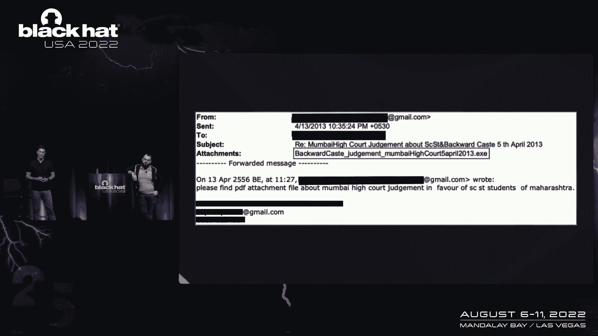

# 课程 P82：093 - 被“大象”指控：一个伪造证据将你送入监狱的APT组织 🐘

在本节课中，我们将要学习一个被称为“Modified Elephant”（修改的大象）的APT组织。这个案例并非关于复杂的技术，而是揭示了网络攻击背后真实而沉重的人道代价。我们将看到，攻击者如何利用简单的恶意软件，通过伪造数字证据，将活动人士投入监狱。

---

## 故事的起源：从土耳其到印度

上一节我们介绍了课程的主题，本节中我们来看看整个调查的起点。

一切始于一篇新闻报道。罗马尼亚记者安德拉达·菲斯库蒂安报道了土耳其记者巴里斯·佩克曼的案例。他因恐怖主义指控被诬陷入狱。一家名为Arsenal Consulting的事件响应公司进行了无偿调查，发现攻击者使用恶意软件在他的电脑上植入了证据。

从威胁情报的角度看，这引发了一个关键问题：实施如此恶劣行为的攻击者，是否还进行了其他行动？我们开始追踪相关活动，并发现了一个我们称之为“E-O-Maniac”的攻击者。这个名字源于其新恶意软件中反复出现的“E-G-M”字母。

随着调查深入，我们和记者金·齐特等合作，发现了该活动与土耳其警方之间的关联线索。这揭示了一种令人担忧的趋势：执法部门滥用恶意软件进行明显不当的行为。

---

## 聚焦印度：BK-16案件

在完成上述调查后，我们收到了Arsenal公司的提醒，开始关注印度发生的另一起类似案件。

这起案件的核心是一群被称为“BK-16”的活动人士。他们被指控犯有恐怖主义罪行，而证据同样可能是被植入其电脑的。

以下是Arsenal公司发布的四份法证报告揭示的关键信息：
*   **恶意软件样本**：在受害者的机器上发现了特定的恶意软件。
*   **植入的证据**：发现了被用作指控依据的文件，但这些文件很可能是攻击者远程放置的。
*   **基础设施关联**：通过对样本和基础设施的分析，我们最终将这些活动归因于一个我们命名为“Modified Elephant”的APT组织。

这个组织的活动时间跨度长达约十年，其行为模式非常明确：利用恶意软件伪造证据，陷害特定目标。

---

## 攻击手法：简单却致命

上一节我们了解了案件背景，本节中我们来看看“Modified Elephant”具体是如何进行攻击的。

需要强调的是，他们的技术并不复杂，甚至可以说是简陋，但造成的后果却极其严重。

以下是他们多年来网络钓鱼手法的演变时间线：
*   **早期（约2013年）**：直接通过邮件发送可执行文件（如`.exe`），诱骗受害者点击。
*   **发展中**：使用带有恶意宏或漏洞的文档文件进行攻击。
*   **近期**：手法有所演进，但整体上并不高明。

攻击的“简单性”还体现在证据植入过程上。根据Arsenal的报告，攻击者通过远程控制（如使用NetWire RAT），直接将文档放入受害者从未访问过的文件夹。这些文档的创建信息（如Word版本）也与受害者机器的情况不符。更值得注意的是，攻击者曾在15分钟内，在多个不相关的受害者机器上植入相似证据。

---

## 伪造的证据与真实的人道代价

那么，这些被植入的证据具体是什么？它们造成了怎样的后果？

指控这些活动人士的核心证据是一些文件，其中一份主要文件是一份直言不讳的、详细策划刺杀印度总理莫迪的计划。其他文件也旨在描绘这群人意图制造国内混乱的形象。

一个关键细节是：最后一份证据文件是在警方搜查其住所的**11天前**才被植入的。这强烈暗示，植入证据的目的就是为了让执法部门来“发现”它。

后果是严重的：16名活动人士被投入监狱。更悲惨的是，其中一位名叫斯坦·斯瓦米的耶稣会人权活动家，在狱中因新冠疫情去世。这个案例清晰地表明，网络攻击背后是真实的人道灾难。

---

## 目标画像：罗纳·威尔逊的十年围猎

在所有目标中，一位名叫罗纳·威尔逊的活动人士尤为突出，他遭受了长达近十年的持续攻击。

针对他的攻击活动呈现出复杂的图景：
*   **Modified Elephant**：自2012年起对其发起长期、持续的钓鱼攻击。
*   **SideWinder**：另一个专注于亚洲地区间谍活动的APT组织，也将其列为目标。
*   **Pegasus**：Arsenal在其2017-2018年的iPhone备份中发现了这款高级商业间谍软件的感染痕迹。

这种多组织、多手段的长期围猎，暗示针对此人的任务可能来自更高层级的协调，而并非某个独立的攻击小组。

---

## 基础设施与组织关联

通过分析攻击基础设施，我们发现了更多关联。

我们发现了Modified Elephant使用的基础设施，与另一个知名APT组织SideWinder的基础设施存在重叠和时间上的交替使用。此外，Modified Elephant最早的基础设施，与2013年一份关于印度APT活动的里程碑式报告“Operation Hangover”中披露的基础设施存在重叠。该报告将许多活动关联到了印度一家名为“Appin Security Group”的潜在承包商。

这些关联表明，印度境内的网络威胁活动可能存在一个共同的源头或生态。

---

##  attribution：追踪到警方个人

 attribution（归因）是复杂而困难的，但在此案中，我们获得了一些惊人的发现。

在调查过程中，我们与《连线》杂志的记者安迪·格林伯格合作。一位勇敢的业内人士提供了关键数据，显示Modified Elephant在入侵受害者邮箱后，会向这些账户添加一个特定的**恢复邮箱**和一个特定的**手机号码**。

以下是《连线》杂志与研究人员（如公民实验室的约翰·斯科特-雷尔顿）验证后的归因链条：
1.  恢复邮箱关联到个人：通过泄露的Truecaller数据库等，该邮箱被关联到印度浦那市的一名警察个人。
2.  手机号码关联到官方身份：该号码出现在政府警务网站上，作为该警察的联系方式。
3.  实时验证：将该号码输入WhatsApp，直到调查时，其个人资料仍显示为该警察的姓名和照片。

这一发现直接将攻击活动与具体的执法个人联系起来。

---

## 战术演进与更广泛的担忧

攻击者的战术正在演变，这带来了更广泛的担忧。

他们并未停止攻击，而是转向了更隐蔽的方式：
*   **转向移动端与云服务**：除了可能使用Pegasus，他们开始更多地劫持云账户会话，直接在云端进行操作，这留下了更少的本地取证痕迹。
*   **服务提供商的责任**：取证工作越来越依赖于云服务商的日志与合作，但并非所有提供商都愿意或能够提供协助。
*   **未被揭露的冰山**：Modified Elephant已活跃十年，BK-16案件可能只是冰山一角。还有多少类似案件？有多少人因被伪造的数字证据而入狱？

---

## 核心问题：数字证据的可靠性与监督

本节课的最后，我们希望探讨一个更根本的问题：数字证据的可靠性及其监督机制。

BK-16和土耳其的案例暴露出严重问题：
*   **证据标准缺失**：在法庭上引入数字证据时，缺乏独立的验证机制和对设备完整性的监督。
*   **“合法拦截”恶意软件的滥用**：当执法部门使用恶意软件时，如何保证其不被用于伪造证据？谁来进行监督？为什么这类工具会具备“上传”（植入文件）功能？
*   **情报与执法的区别**：为情报收集而进行的黑客活动，与为执法取证而进行的黑客活动，目的、标准和监督机制应有本质不同。

最终，这不仅仅是技术或恶意软件的问题，而是关乎**社会制度**的健全。当媒体因恐惧而不敢报道，当司法系统不愿或不能坚持标准时，即使有确凿的法证证据证明清白，正义也可能无法伸张。

---

本节课中我们一起学习了“Modified Elephant”APT组织的活动。他们利用并不高明的技术，通过伪造数字证据对活动人士进行陷害和迫害，造成了真实的人道悲剧。这个案例警示我们，必须审视数字时代证据的可靠性，并呼吁对执法部门使用监控技术建立严格的监督与问责机制。感谢Arsenal Consulting等团队的无偿工作，以及所有勇敢的业内人士，是他们让真相得以浮现。