# 课程 P83：094 - TruEMU：一个可扩展、开源的iOS全系统模拟器 🍎

在本节课中，我们将学习TruEMU项目。这是一个旨在为iOS安全研究提供免费、开源、全系统模拟环境的工具。我们将探讨其设计目标、实现原理、核心功能以及如何将其用于实际研究。

## 当前iOS研究现状 🔍

上一节我们介绍了课程主题，本节中我们来看看当前进行iOS研究的常见方法。最主流的方式是使用真实设备。

以下是几种使用真实设备的选项：

*   **苹果安全研究设备**：这是苹果官方提供的真实设备。主要问题在于需要签署保密协议，并且有义务向苹果报告所有发现。
*   **内部设备**：这些设备通常因泄露而获得，仅限于苹果内部使用。因此存在法律风险，且设备非常稀有。
*   **越狱设备**：可以从商店购买，但需要先进行越狱才能用于研究。这本身就是一个较高的门槛。不过，近期有研究利用Checkm8漏洞，使得在构建特殊线缆后可以进行调试。
*   **非越狱设备**：这类设备沙盒限制严格，权限很低。如果需要进行内核调试或破解，只能使用非交互式的`paniclog`，非常困难。

除了真实设备，也可以使用模拟环境。

以下是几种模拟环境的选项：

*   **第三方商业模拟器**：这类模拟器技术先进，但价格昂贵，且通常仅支持本地部署，个人研究者难以获取。
*   **苹果虚拟机**：这是苹果提供的Mac虚拟机。其自定义选项有限，但已有研究者用它完成了一些出色的工作。
*   **Corellium或QEMU**：这些方案在2019年的欧洲会议上展示过。但它们仅支持有限的iOS版本，硬件支持不全，代码质量导致维护困难，且目前已被弃用。


因此，我们尝试构建一个模拟器，以解决上述方法带来的诸多问题。

## TruEMU的设计目标 🎯

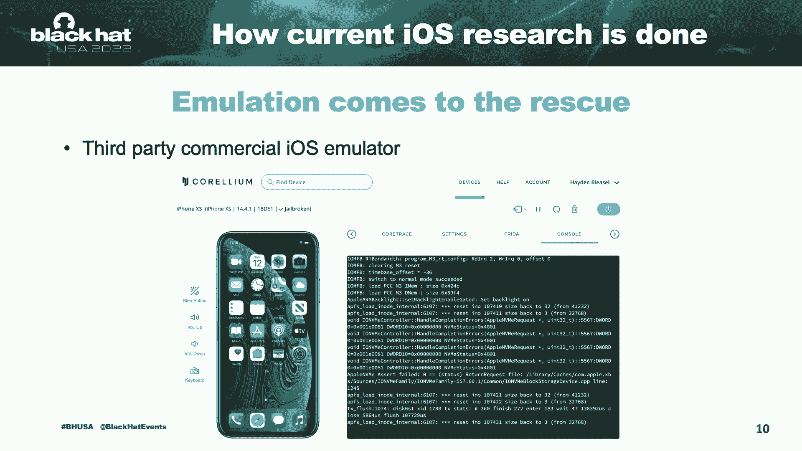

上一节我们讨论了现有研究方法的局限性，本节中我们来看看TruEMU项目的设计目标。我们希望构建一个免费、可用于研究的iOS模拟器。

具体目标如下：

*   **免费开源**：尽可能免费和开源。
*   **广泛的iOS版本支持**：支持从iOS 14到仍在测试中的iOS 16等多个版本。
*   **易于内核调试**：方便研究者进行内核级调试。
*   **支持模糊测试**：能够用于漏洞挖掘。

基于这些目标，我们实现了以下显著特性：

*   **模拟真实硬件**：尽可能接近真实硬件行为。
*   **支持安全ARM和iBoot**：对安全ARM和iBoot的支持仍处于实验阶段。
*   **USB支持**：可以安装真实的iOS系统。
*   **支持苹果自定义CPU特性**：例如SPRGXF。
*   **完全开源**：代码仓库链接已在幻灯片中给出。

## 实现原理与挑战 ⚙️

上一节我们明确了设计目标，本节中我们来看看如何实现这些功能，并克服了哪些挑战。总体思路是模拟新设备。

实现流程如下：

1.  **从设备树获取信息**。
2.  **构建桩模型**：一个不执行任何操作，仅记录CPU每次访问的模型。
3.  **动态与静态逆向工程**：分析硬件行为和工作原理。
4.  **编写模拟代码**：根据已知协议，模拟硬件所需的响应。
5.  **完成设备模拟**。


让我们深入几个关键步骤。

### 设备树解析

设备树信息可以从苹果官方下载的iOS固件中找到。其优点是包含了丰富的外设信息，并被iOS内核广泛用于匹配驱动程序。

以下是一个GPIO控制器在设备树中的条目示例：

```
compatible = "apple,s5l-gpio";
interrupts = <0x803 0x8 0x89>;
reg = <0x0 0x23c100000 0x0 0x4000>;
apple,nr-gpios = <0x90>;
```

*   **`compatible`属性**：用于匹配驱动程序。内核会根据此字符串寻找对应设备的驱动。
*   **`interrupts`属性**：列出了设备使用的中断列表。本例中，GPIO使用了中断`0x803`到`0x89`。
*   **`reg`条目**：定义了设备在内存中的映射地址，即MMIO地址。
*   **`apple,nr-gpios`属性**：表示此设备拥有的GPIO引脚数量。

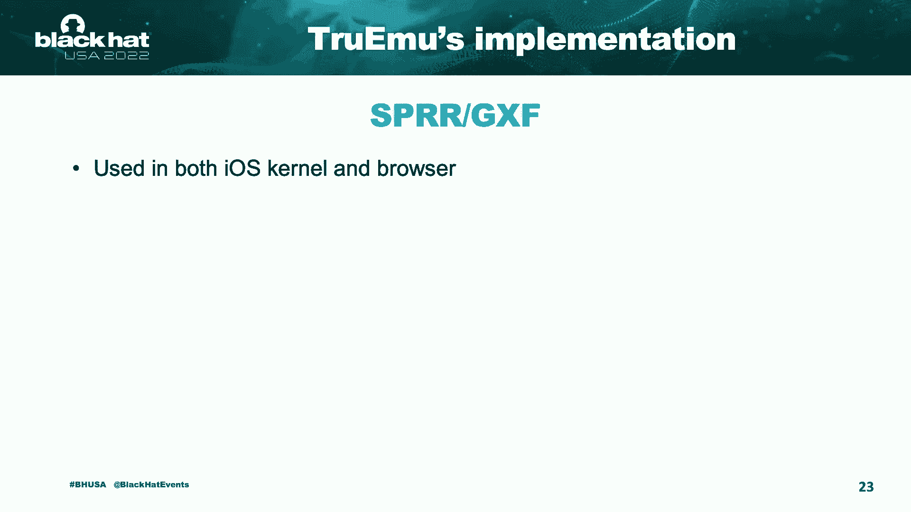

### 构建桩模型

利用设备树信息，我们可以构建一个桩模型。具体做法是将一个虚拟内存区域映射到设备树中指定的MMIO地址。然后，记录CPU对该区域的每一次读写访问，并打印出回溯信息。

通过回溯信息，我们可以追踪软件的执行逻辑。我们甚至可以尝试触发中断线，观察中断是如何被处理的。

以下是一个来自显示控制器的示例日志：

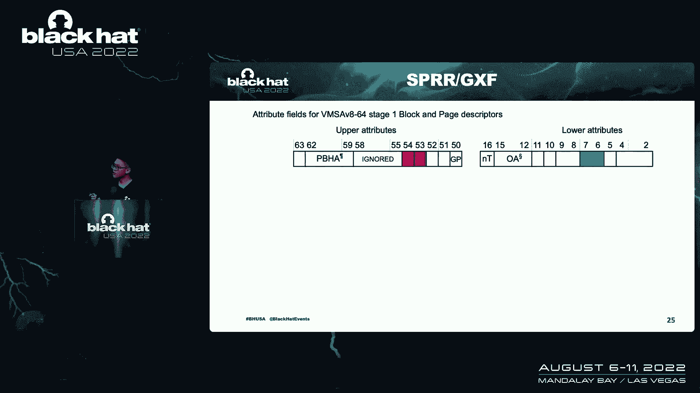

```
WRITE to offset 0x1234, value 0x5678, PC: 0xfffffff007654321
```

从中可以看到偏移量、CPU写入的值以及程序计数器地址，便于导航到iOS内核代码。

### 苹果自定义CPU特性：SPRGXF

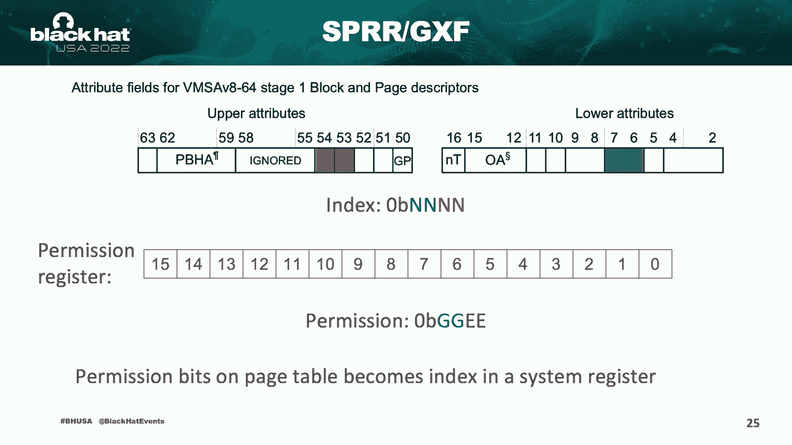

接下来是一个非常有趣的CPU特性，即苹果自定义的**SPRGXF**。该特性在iOS内核和用户态浏览器中均有使用。

它本质上是苹果创建的一种自定义特权级别。那么它如何融入正常的特权级别模型呢？

正常的ARM特权级别从EL3到EL0，数字越大，权限越高。EL0是用户态，EL3是监控态。SPRGXF在此基础上创建了GL2和GL3级别。

*   **GL2**：是EL2的守护模式，比普通EL2拥有更高权限。
*   **GXF**：是“守护执行特性”的缩写。要进入此模式，需要使用非标准指令`G.Enter`。使用`G.Exit`指令可以从守护模式退出到普通模式。

守护模式与普通模式的关键区别在于，它们可以拥有不同的内存页权限。可以创建一些页面，只能由守护模式写入，而不能被普通模式修改。

其工作原理如下：正常的页描述符中，某些颜色位用于确定页面的读、写、执行权限。然而，苹果重新定义了这些位的含义，将其转换为一个索引值。


这个索引用于查询一个64位的系统寄存器。该寄存器定义了16个权限索引，每个索引用4位来描述一个页面的权限：其中2位用于守护模式，2位用于普通模式。

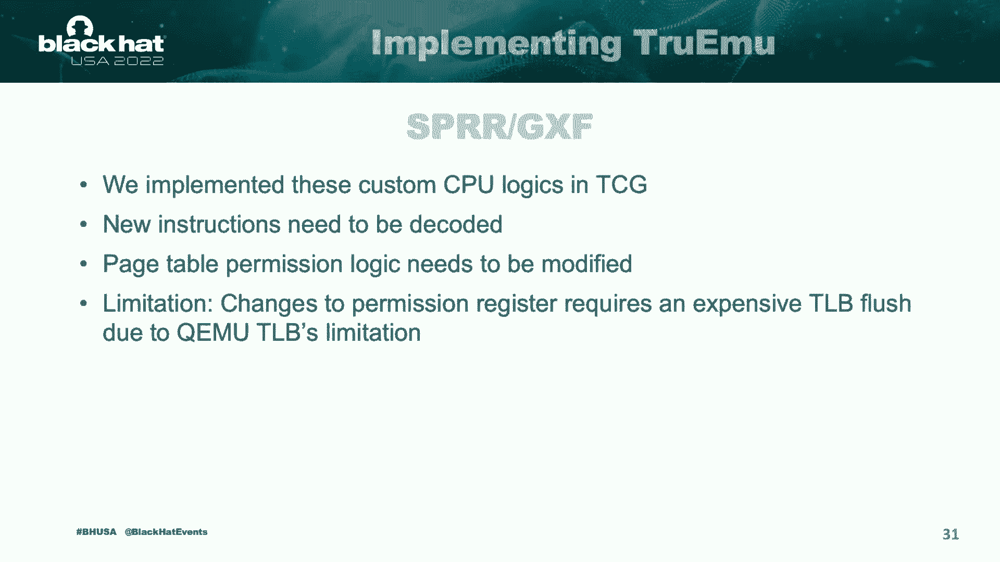

因此，页面级的权限位现在变成了系统寄存器的索引。

**在iOS内核中的应用**：苹果有一个称为**页面保护层**的组件，通常简称为PPL。它包含了序列敏感性代码。

比较守护模式代码和普通模式代码的大小，可以发现巨大差异。根据我的对比，守护模式代码量比普通模式少300倍以上。这意味着攻击面更小。即使攻击者攻破了普通模式，仍然需要突破PPL才能获得更强大的漏洞利用能力。

**在用户态的应用**：该特性也被用于**JIT编译器**。浏览器使用JIT将JavaScript编译成本地代码以加速执行。为此，需要创建同时可写和可执行的页面。

但这里存在一个问题：对于JIT页面，需要频繁在写模式和执行模式之间切换。更改页面权限的操作对CPU来说开销很大，会影响性能。

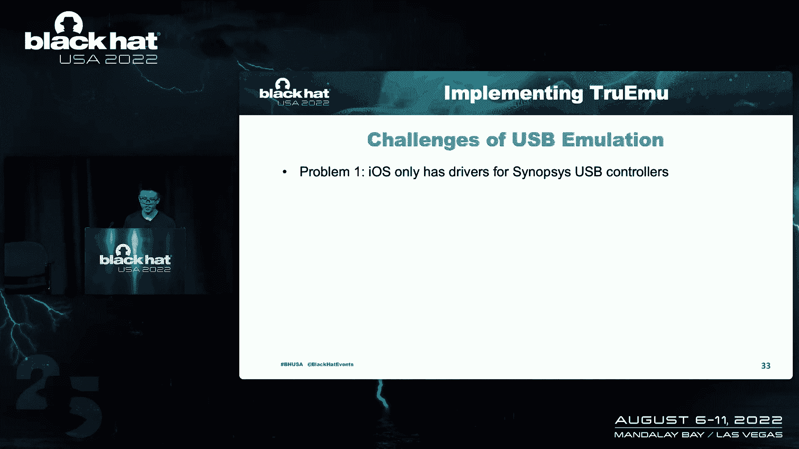

SPR设计就是为了解决这个问题，提升JIT编译器的速度。以下是一段切换权限的代码示例：

```c
// 路径A：切换到可执行模式
ldr x0, [x1, #exec_mode_offset]
msr S3_6_C15_C1_0, x0 // 快速切换权限

// 路径B：切换到可写模式
ldr x0, [x1, #write_mode_offset]
msr S3_6_C15_C1_0, x0 // 快速切换权限
```

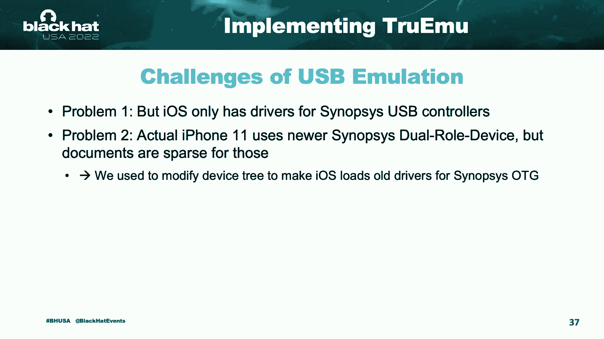

`MSR`指令是关键。它通过更改SPR配置的页面权限寄存器来实现快速切换，无需刷新缓存，因此运行速度极快。

**在QEMU中的实现挑战**：为了在QEMU中实现此逻辑，我们需要：
1.  解码自定义指令`G.Enter`和`G.Exit`。
2.  重写页表逻辑，因为模拟器不再以传统方式理解页面权限。
3.  目前我们尚未完全解决所有问题，例如仍然需要TLB刷新，这可能会在权限更改时影响性能。

### USB支持

你可能会问，为什么需要USB支持？原因如下：
1.  **用于恢复系统**：恢复是安装iOS操作系统的过程。
2.  **用于网络连接**：例如，通过USB进行SSH连接。
3.  **连接其他设备**。

然而，实现USB支持面临挑战：

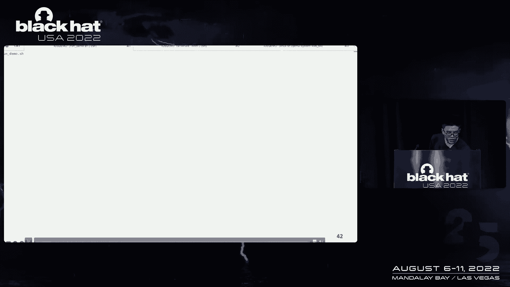


1.  **驱动程序文档**：iOS使用Synopsys的USB控制器驱动。Synopsys的硬件IP数据手册通常需要付费获取。但有一个变通方法：其他硬件制造商（如Intel）在使用Synopsys IP时，会发布相关文档，其中USB部分与Synopsys的文档基本相同。
2.  **新控制器支持**：实际iPhone使用的是更新的Synopsys控制器，其公开文档更少。我们最初通过强制iOS加载旧控制器驱动来解决，幸运的是，我们现在已经能够模拟新控制器。
3.  **设备模式支持**：QEMU本身不支持USB设备模式（因为它模拟的是PC）。我们需要实现此功能。

**我们的解决方案**：我们将iOS虚拟机的USB主机控制器通过Unix管道连接到外部。软件层与QEMU中模拟的控制器（如Synopsys USB或EHCI）通信。这些控制器再通过代理设备与物理层通信，彼此之间通过套接字或Unix套接字进行数据交换。

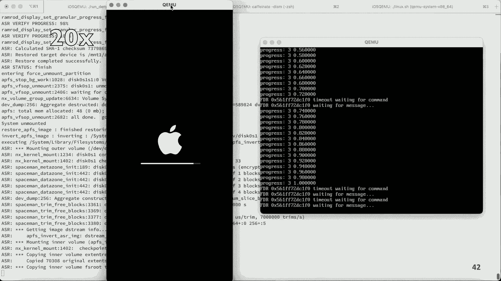

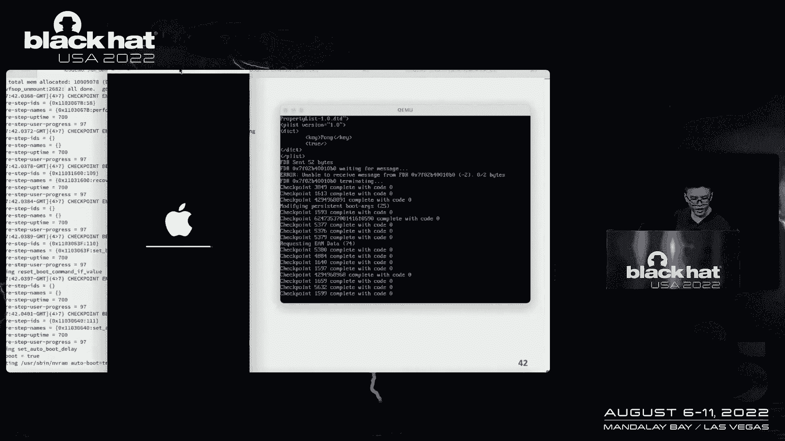

## 研究应用演示 🧪

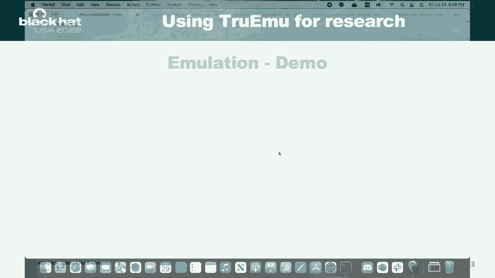

上一节我们深入探讨了技术实现，本节中我们通过几个演示来看看如何将TruEMU用于实际研究。


### 演示一：恢复iOS系统

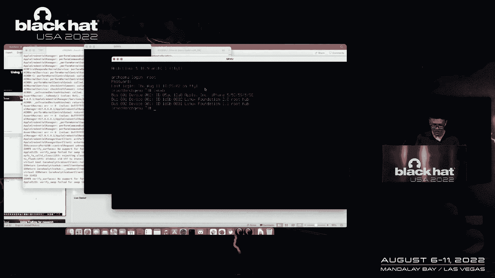


在这个演示中，我们将尝试在模拟器中恢复iOS系统。左侧是iOS虚拟机，右侧是作为宿主的Linux虚拟机。我们在Linux上运行`idevicerestore`工具开始恢复过程。恢复过程需要几分钟时间。完成后，设备会重启（我们覆盖了重启行为以便录制）。整个恢复过程耗时约11分钟。

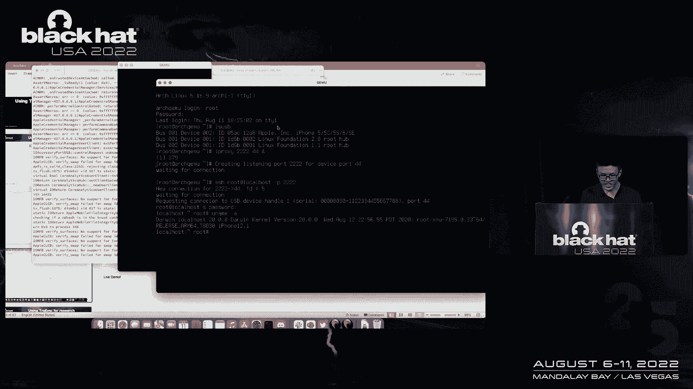

### 演示二：获取Shell并探索系统

我们启动一个处于快照模式的iOS虚拟机（不保存更改）。在Linux虚拟机中，我们可以看到识别出的iOS设备。我们使用`iproxy`工具将本地端口2222转发到iOS设备的端口44。然后，我们可以通过SSH连接到iOS虚拟机。


连接成功后，我们获得了`root`权限的shell。可以运行`uname -a`查看系统信息，确认运行的是`iossim`（模拟器）。运行`sw_vers`可以查看iOS版本。我们还可以运行其他命令来探索文件系统（如`ls /`）或查看运行中的进程（如`htop`），这些都是在真实设备上运行的真实服务。

### 演示三：iBoot支持（实验性）

iBoot是iPhone的引导程序，用于恢复模式和加载内核。模拟iBoot的原因包括：
*   **信任链研究**：iBoot是信任链的一部分，研究它可以获得对内核的更深层控制。
*   **验证模型**：如果能运行iBoot，说明我们的硬件模型模拟得足够正确。

目前对iBoot的支持仍处于实验阶段。在演示中，我们启动了iBoot，可以看到引导横幅。在Linux端，我们可以使用`irecovery`工具查询设备信息，甚至获取一个有限的恢复模式shell。不过，发布版构建的恢复shell功能受限。

## 模糊测试支持 🐛

上一节我们展示了交互式应用，本节中我们来看看如何利用TruEMU进行自动化的漏洞挖掘，即模糊测试。

为了支持模糊测试，我们实现了**快照功能**。因为iOS启动时间对于需要快速重复运行的模糊测试来说太慢。使用快照可以将周期时间减少十倍。

我们还为QEMU添加了**覆盖率支持**。由于我们运行在TCG模式下，可以很方便地报告代码覆盖率。


### USB模糊测试

我们尝试对USB协议栈进行模糊测试。流程如下：
1.  AFL以持久模式运行，并fork出QEMU进程。
2.  QEMU恢复到一个初始状态的快照。
3.  一个虚拟USB主机从AFL读取输入，并发送给iOS虚拟机处理。
4.  如果iOS内核崩溃，会报告给AFL；如果没有崩溃，也会报告给AFL用于生成新的测试用例。

### 系统调用模糊测试

系统调用模糊测试的流程类似。在iOS虚拟机内部，我们运行一个接收AFL输入的自定义程序，并根据输入执行系统调用。如果发生内核恐慌，则报告给AFL；否则结束当前周期并恢复快照。

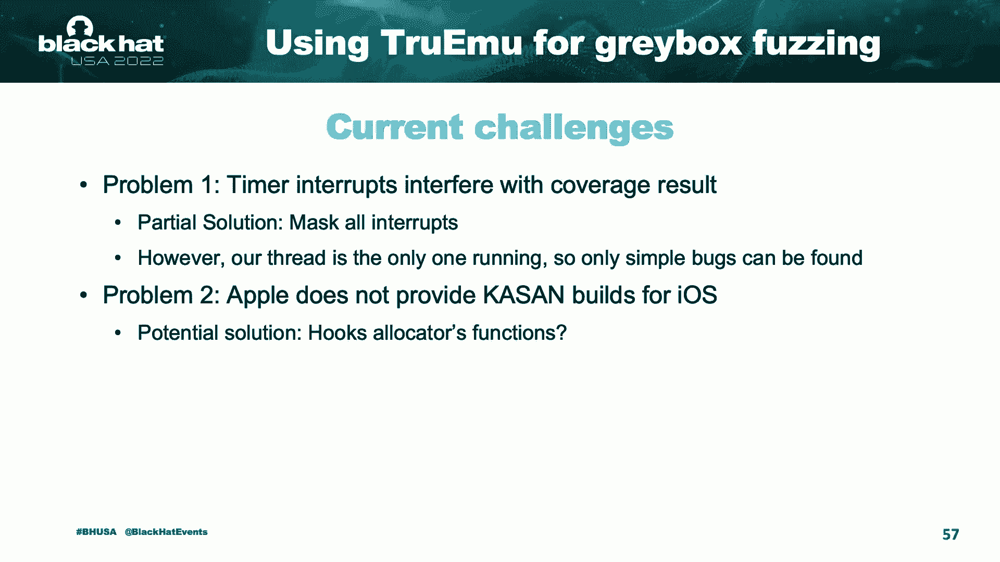

系统调用模糊测试的速度通常比USB模糊测试更快。然而，模糊测试仍面临挑战：
1.  **定时器中断**：会干扰覆盖率结果，导致结果不一致。我们的解决方案是屏蔽所有可能的中断。但这又带来了新问题：没有中断，当前线程会一直运行，iOS无法进行线程调度，这可能会阻碍模糊测试的进行。
2.  **缺乏消毒器**：苹果不提供iOS的消毒器构建版本。我们考虑挂钩内存分配函数来监控iOS的行为，但这远非完美方案。

## 未来路线图 🚀

上一节我们讨论了当前的研究工具，本节中我们展望一下TruEMU的未来发展计划。我们计划实现和完成许多功能：

*   **完善图形显示**：实现正常工作的帧缓冲区和GPU模拟，以支持iOS GUI。
*   **触屏支持**：实现触摸屏模拟，让用户可以像操作真实设备一样与模拟器交互。
*   **模拟Secure Enclave**：这是iOS安全架构的核心组件，包含大量安全相关功能，模拟它将非常有趣。
*   **改进模糊测试器**：目标是发现真正的安全漏洞。

为了实现这些目标，我们需要社区的帮助。项目已在GitHub上开源。你可以通过多种方式参与，例如协助逆向工程、直接向代码库贡献，或者支持基于Arm Mac的努力（因为Arm Mac与iOS共享许多外设，知识可以迁移）。

在开发过程中，许多项目对我们帮助巨大，特别是Asahi Linux团队，以及其他一些有用的项目。

## 总结 📝

本节课中，我们一起学习了TruEMU项目。我们探讨了当前iOS研究方法的局限，了解了TruEMU免费、开源、支持多版本、便于调试和模糊测试的设计目标。我们深入研究了其通过解析设备树、构建桩模型、逆向工程来模拟硬件的实现原理，并重点分析了苹果自定义CPU特性SPRGXF和USB支持的实现挑战。通过演示，我们看到了它如何用于系统恢复、获取Shell以及运行iBoot。我们还了解了其如何支持USB和系统调用的模糊测试，并讨论了当前面临的挑战和未来的发展路线。


总之，构建一个功能完善的iOS模拟器并非易事，但完全可行。它不仅能让我们深入探索苹果设备，还能运行真实的应用程序。我们希望TruEMU的努力能够降低iOS安全研究的门槛，让更多人关注iOS安全，从而使其变得更加安全。