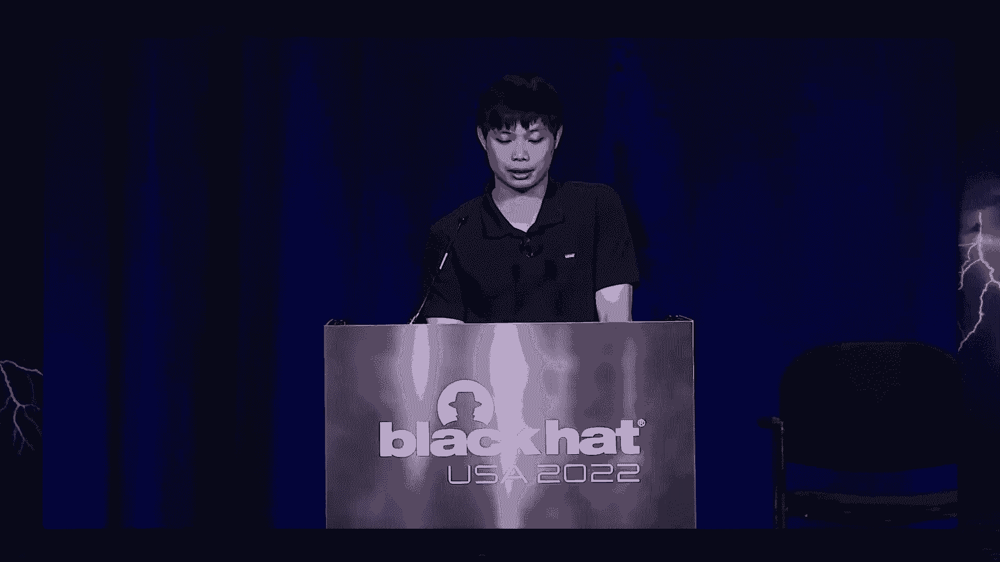
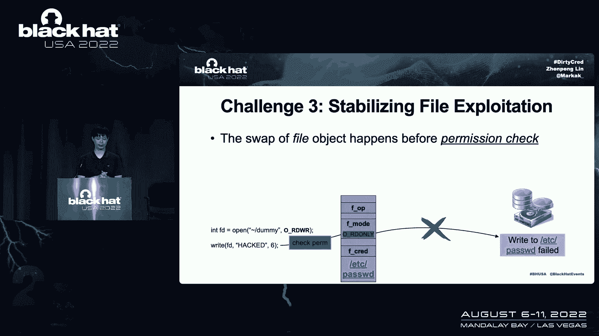
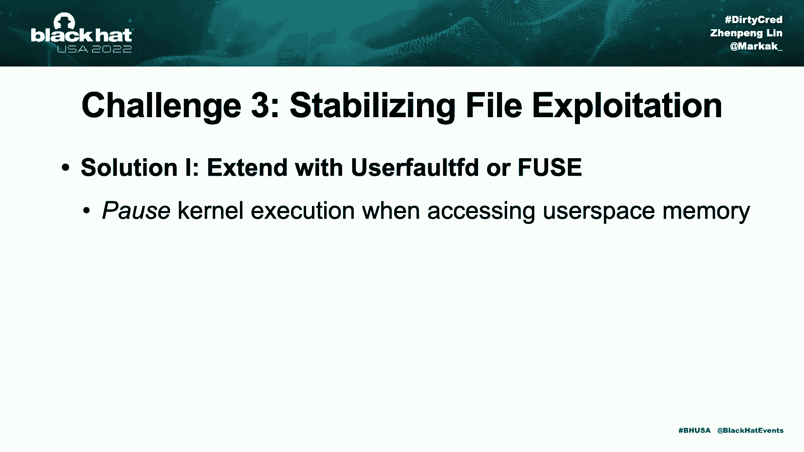
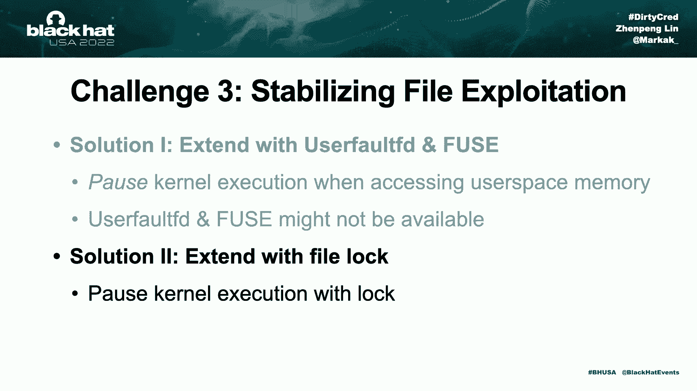
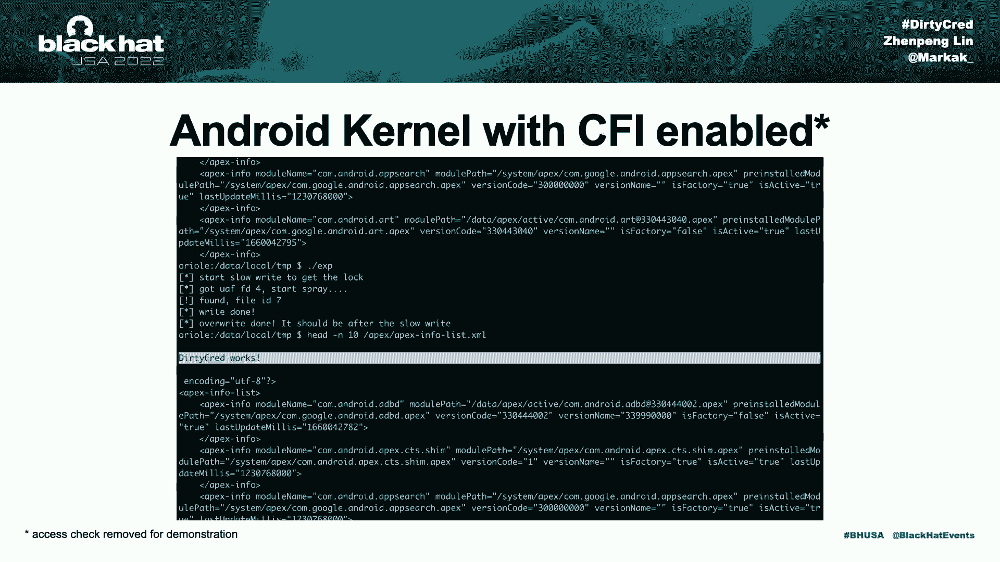

# P84：095 - Cautious： A New Exploitation Method! No Pipe but as Nasty as Dirty Pipe - 坤坤武特 - BV1WK41167dt

谢谢你的介绍，所以欢迎来到我的演讲，我将从介绍我们开始。

我叫阿金，我是西北大学的博士生，我的研究重点是系统安全，我发现了盒子利用bug并修复BU，中间那个家伙是顾武汉，他也是西北大学的博士生，他是个CTF的人，它们的研究兴趣非常相似，2。

我们俩都得到了易烊千玺的帮助，他是西北大学的教授，所以三十五，这是在标题中提到的，三十五是以内核漏洞命名的，简历二十二，零八四七，这是Linux内核子系统中的一个未初始化的bug，该bug影响内核V5。

8及更高版本，Pad最有趣的地方之一是它的开发，与传统的内核开发不同，它不会劫持控制流，这是一个只利用数据的开发，所以不需要抢劫，它不必绕过病例，有开发的效果也是不同的，它使用内核特权执行代码，而是。

它可以覆盖任何文件，只要我们有读取权限，有这样的能力三十五，您可以演示本地权限升级或Android系统，三十五是如此强大，吸引了如此多的关注，但根据我的理解，我们从35个中学到的是。

我认为我学到的最有趣的事情之一是只有数据的攻击是强大的，它带来了很多好处，首先，仅数据攻击方法可以允许您编写通用攻击，普遍是什么意思，这意味着他们跨不同的内核开发代码A，不做任何修改的不同架构，第二次。

它不必处理CFI，这是对岩石的有效缓解，cfi正在启用android内核，这使得Android内核开发变得更加困难，第三次，大多数缓解措施侧重于保护控制的完整性，Linux内核中很少的缓解。

仅数据完整性，这就是为什么没有效果，利用肮脏路径的缓解措施，所以我们需要这些缓解措施，这一切听起来都很有趣，但是三五并不完美，前三十五个不能从集装箱里逃出来，主动逃离容器只能在特定条件下进行。

整体与容器相互作用，在这种情况下，三五可以重写主机上的文件来执行命令，这可以在主机什么都不做的情况下实现，换句话说，三五不能主动逃离集装箱，第二个三五只是一个bug。

它不是一种可以使其他bug受益的通用利用方法，在这次谈话中，我想介绍一种新的开发方法，叫做肮脏的哭泣，需要30个的高级想法是交换这些内核凭据，这种方法有几个优点，首先，这是一种通用的案例开发方法。

这很简单，只需要几步，但很有效，第二次，类似于肮脏的管道，您可以只写入数据，爆炸，不处理CFI和抢劫的东西，所以用脏，您能够主动逃离集装箱，这是肮脏做不到的，所以先在这里总结一下。

所需的是一种通用的开发方法，嗯，三十五是一美元，第二次，两者都只能生成通用的数据，第三次，因为它们是数据，所以它们可以绕过CI，第四个三十学分能主动逃离集装箱，人民行动党无法持续下去，但更重要的是。

肮脏的管道是一个已经修复的bug，所以线已经被去掉了，没有可用的缓解措施来防御，所以人群的威胁仍然存在，三十次信用攻击，内核凭据，什么是内核凭据，总之，内核凭据是根据内核文档在内核中携带权限信息的属性。

它们是线性内核实现中用户权限和能力的表示，有两种主要类型的凭据，任务凭据和打开值凭据，任务凭据用于每个内核任务，而打开文件凭据将特权信息封装到打开的文件中，凭这些全权证书，秘密检查作用于他们来检查特权。

我将给你一些内核如何实现它们以及如何使用它们的例子，第一个任务凭据，它在Linux内核中实现为稻草红色，每个内核任务都引用一个在热上分配的强读取，信用用于检查非特权用户的用户权限，当有一个新的信用时。

信用是不特权的，产生新内核任务的非特权用户，内核将在空闲内存插槽上分配一个非特权垃圾，如果用户具有特权，内核将在堆上分配特权信用，具有特权凭据的用户被视为根用户，这就是内核使用任务凭据的方式。

下一个打开文件凭据，它实现为草根文件，类似于吸管右的Linux内核，它存储在内核堆中，将在内核堆上创建一个新的原始文件，打开文件或文件时，草编文件包含了我们需要关心的几个字段，首先，它包含如何打开文件。

比如说，在切片上，文件以读写模式打开，那么F模式字段将具有相应的标志，敲击的文件引用了打开它的用户的权限，秸秆文件对切片上正在操作的文件进行编码，草编文件对我们刚刚打开的虚拟文件进行编码，当文件打开时。

文件的访问信息将被传输到结构文件，所以内核检查稻草文件，看看是否允许访问，所以让我们来看看这个例子，当我们尝试将内容写入刚刚打开的文件时，内核将检查此文件中的F模式是否包含红旗。

因为我们在正确的佣金中打开文件，这样权限检查就满足了，最终内容将被写入磁盘，然而，如果文件是以只读模式打开的，它没有指定许可权，内核将在F模式字段中创建一个带有三个标志的文件对象，我们将尝试写入此文件。

其余的调用将被拒绝，因为对文件的权限检查将失败，然后最终写入磁盘将失败，这就是内核使用打开文件凭据的方式，所以考虑到背景，然后我要谈谈这个内核凭据中的肮脏攻击，质量的高级思想是交换内核凭据，特别是。

它将非特权凭据与特权凭据扭曲，在以下内容中升级特权，我要谈谈两种攻击途径，它们攻击任务凭据和打开阀门凭据，首先攻击任务凭据，Linux内核，每个内核任务都引用堆上的稻草，攻击的第一步是利用内核bug。

释放属于攻击者任务的非特权信用，一旦信用被释放，内存插槽将被臀部分配器标记为释放，在第二步，我们产生新的特权内核任务，它确实将在内核堆上分配特权凭据，堆分配器将重用空闲内存槽，然后把新的cron它。

这一步之后，攻击者任务的信用将从非特权请求更改，创造特权信用，然后他们可以作为特权用户进行操作，这就是肮脏破解攻击任务凭据的方式，接下来我将讨论攻击如何打开文件凭据，它是内核实现中的一个文件。

结构文件用于在访问我们打开的文件时检查权限，文件系统的正确操作将在工作中做真正的内容正确，所以说，攻击打开文件凭据的第一步，就是释放内核内存中的文件结构，此步骤应该在权限检查满足后进行。

但在开始写入文件系统之前，在内核堆内存中释放原始文件后，内存槽变得空闲可重用，在第二步，我们打开一个要重写的文件，比如说，我们打开ETZ密码文件，因为它是密码文件，对于未预览的用户不可写。

我们在只读模式下打开它，此操作将在内核上分配一个带有只读标志的新文件结构，堆，臀部分配器将重用空闲内存，然后最终这个分配将回收我们刚刚读取的内存插槽，这一步之后，内核堆中的罢工文件将被交换。

从虚拟文件到密码文件，因为对文件的权限检查已经在，这个电话不会被拒绝，即使文件的F模式真的只是，在第三步，当内核继续执行时，它将在磁盘上执行实际的文件，这一次，因为我们已经交换了文件结构。

您实际上将内容写入etc密码文件，这就是攻击打开文件凭据的方式，所以总而言之，人群跟随三步发起攻击，前三个攻击者没有使用漏洞的凭据，第二次，通过分配特权凭据来回收空闲内存插槽，第三次，交换凭据后。

攻击者可以像以前的用户一样操作，这三个步骤听起来很简单，但这样做首先是有挑战性的，信用要求凭据对象上的能力，当漏洞不具备这种能力时，这是具有挑战性的，这是因为信用和文件对象都分配在专用内存缓存上。

而大多数漏洞不会发生在这两个内存缓存上，事实上，它们可能发生在通用内存C上，我主要在内核中使用，除此之外，我们的解决方案是将脆弱性能力，在下面，我要谈谈如何枢转无效的权利，这是不粘合的对吧。

以及使用免费乘车和枢转无效免费，它是双免的，比如说，所以首先PVD无效的权利，旋转邀请的右功能以释放凭据对象。

我们的想法是利用包含对凭据对象引用的受害者对象，让我们看看右边的代码，请求键关闭结构，包含对类对象的结构的引用，当它被分配到内核堆时，它的内存布局可以和左边的图片相似，我们有一个受害者对象。

它包含一个指针，指向它自己的内存缓存中的凭据对象，从堆中获取堆溢出，我们把这么大的物体从溢出的物体上移开，因此，信用字段将位于溢出内存区域，以便使用，我们将自由对象的使用与受害者对象重叠，同时。

信用字段也在使用自由权利的内存区域，下一个，我们触发漏洞并部分覆盖指针，引用另一个凭据对象，凭据对象由引用计数管理，指针更改将导致最后的引用计数不平衡，当我们触发漏洞的释放。

我们将用回火引用释放凭据对象，这就是我们如何保持它的价值来写，对于无效的免费漏洞，我们有两个引用同一个对象的引用，所以可能的内存布局可以是这样的，在第一步，我们从反向中释放易受攻击的对象，第二次。

我们释放同一内存缓存中的所有对象，它最终将为缓存释放内存页，在第三步，我们分配了一堆凭据对象来回收自由内存页面，这个过程称为交叉缓存攻击，在这之后，易受攻击对象的内存插槽将被凭据对象占用，因此。

剩余的引用将指向凭据对象，最后我们利用参考文献，它是释放凭据对象的悬空指针，这是在值ID自由中旋转的过程，第二个挑战，如何将特权凭据分配为非特权用户，在Linux内核中。

非特权用户附带非特权任务凭据，因此不能直接分配特权凭据，一个简单的解决方案是等待特权用户这样做，但这是不可预测的，可能会影响成功率，所以我们应该看看更确定的东西，我们发现有两种类型的解决方案。

一个来自用户空间，我们可以触发特权用户空间进程，带有根的Linux内核可执行文件，我可以上升为根用户，所以他们带着证件来，通过简单地执行它们，我们可以强迫内核分配特权犯罪，而不是我，d，x，立方体。

一些以根用户身份运行的恶魔，还可以在内核凭据中分配特权凭据，比如说，作为一把钥匙，我们可以通过建立与系统的连接来与它交互，它将为我们分配一个特权，另一个解决方案来自内核空间。

特权信用可以通过新的内核分配给一些人，这个课程，如果用户空间向内核发送太多请求，内核将产生新的内核工作者来处理请求，它将为这些工人分配新的特权证书，结果，内核空间的另一种方法是调用用户模式帮助器。

即从用户空间加载内核模块，当请求用户模型帮助器时，内核将产生新的内核线程来执行用户空间二进制文件，结果，这将分配新的特权凭据，这些是我们第二个挑战的解决方案，第三个挑战是稳定文件利用。

当我们攻击打开的文件凭据时，交换打开的文件凭据时，我们可以混淆内核写入数据到另一个文件。

做交换的时机真的很重要，如果交换在权限检查之前开始，文件对象的F模式将是只读的，这导致了权利的剥夺，如果交换发生在写入磁盘后，内核只会写虚拟文件而不是ITC密码。

因此交换必须在权限检查和实际文件之间进行，这个时间窗口对攻击的成功至关重要，但这次我们知道的很小，因为将内容写入文件非常快，在这段时间里做交换，这些小的时间窗口可能是不稳定的，甚至是看不见的。

所以我们的解决方案是延长时间窗口，使攻击具有确定性。

第一个解决方案是我们可以利用use for use来发布内核执行，在这个时间窗口内，当内核访问用户空间内存时，这是通过使用for fd来管理的，或使用内核执行将暂停，在内核V之前四点十三。

我们可以通过内核执行，它导入我们的向量函数。

让我们看看切片上的红色V函数，它是将矢量数据写入文件的实现，函数将首先检查，佣金，检查满足后，它检查文件结构是否使用红色权限创建，内核从用户空间导入矢量数据，这是我们可以暂停内核执行的地方。

这项技术被用于霍恩的CV 20的开发，十六，四，五个，五个，七由内核代替V四点，十三，这是最后一次，正确道路功能的实现，在权限检查之前，我们的向量的导入已经被移动。

所以即使我们可以在向量的导入处暂停执行，我们再也无法延长时间窗口，所以我们应该找别的东西，事实证明，我们可以暂停执行，就像泛型执行正确的功能一样，函数在红色的额外层。

这个调用使不同的文件系统在调用自己的正确函数之前使用它，换句话说，它将是由我们大多数系统中的红色汽车引起的，在他们权限检查之后，在函数开始的实际文件之前，您将尝试在用户空间缓冲区上创建页面错误。

以避免可能的数据锁定，而这个页面确实将访问用户的最佳内存，结果，我们可以利用此访问权限发布当前执行，这样我们就可以延长时间窗口，第一个解决方案需要使用fd或fuse来暂停执行。

但有时这两种技术是不可用的。

例如在码头工人中，所以我们应该开发别的东西，其他一些解决方案他们没有使用这两种技术，最后我们发现在剩下的文件系统中有一个犯规锁，对吧，可以利用的，首先什么是文件锁，Linux内核。

每个文件都有自己唯一的i ode对象，文件日志由i know对象维护。

锁机制用于文件系统正确操作，这是函数，切片上的函数是EX T四个文件系统的正确操作，在函数的开始，内核将尝试锁定对象的i节点，写完之后，锁就会被释放，这种锁定机制确保多个线程的权限将按顺序完成。

让我用这个图表来说明这是如何工作的，假设我们有两个线程，说读A和线程B，线程A和线程B同时运行并写入同一文件，在执行正确操作之前，它们都将通过访问权限检查，线程A将锁定来自i节点的文件。

而线程B将不得不等待锁，直到线程的右边完成，并用这个锁释放锁，正确的操作将一个接一个地完成，问题是什么，如果线程A写入大量数据，比如说4G，可能需要十几秒，那么线程B将不得不等待至少相同的时间来获得锁。

这在权限检查和执行正确操作之间留下了很大的时间窗口，用这种方式，我们可以扩展时间窗口，开发可以确定地进行，所有的权利，演示演示时间，所以我们用这份简历来演示。

所以我们从左边的一个低特权用户开始。

它的中心是内核四点十八分，在右边。

是1到20，有内核的5点4分，在进行攻击之前，密码完好无损，两个系统中的利用代码具有相同的检查MD五校验和，这意味着有相同的x y码，然后我们构建构建并运行漏洞利用，最后，让我们看看，最后我们调整快进。

这种行为可以将特权升级到根，我们也有一个演示或享受它与内核CFI启用，那个，我们删除了一些检查，以确保此漏洞可以被触发，或者享受它，因此，最初该文件不能被无特权的用户读取和写入，它完好无损。

然后我们运行漏洞利用，然后最终我们锤炼内容。

所有的权利，所以在这里我想总结一下人群的一些优势。

首先，它是一种通用的开发方法，可以针对不同的bug授权内核开发，该方法适用于容器和内核，第二次，方法很简单，它只是交换内核凭据，但它非常有效和强大，作为一种数据方法，不必处理KSLR和CFI。

现在没有公开的缓解措施，第三次，你可以骑一个肮脏的管道，就像通用开发一样，他们可以工作，他们可以在不同的内核上工作，而不需要任何代码更改，所以我们有这么强大的开发方法，我们能做些什么来减轻它并保护用户。

我们有什么缓解的建议吗，是呀，基于对象类型，不在以前的标签上，如此无特权的凭据，以前的凭据将共享相同的内存缓存，它们会互相重叠，因此，它们可以在考虑到这一点的情况下进行交换，我们的解决方案很简单。

我们将特权凭据隔离到不同的内存区域，特别是，我们把它们解成虚拟内存，所以不再有交换和交叉缓存攻击，我们有一个原型实现，你可以在我的GitHub中找到代码，最后，我的演讲中的一些要点，首先。

我们介绍了一种名为Dirty的新开发方法，三十四的核心概念是交换内核凭据，升级特权，第二个实现这个想法，我们制定了一个有原则的方法来应对不同的挑战，第三次，脏Quenabled内核开发，他们利用旁路。

Linux内核中可用的所有防御，并遍历不同的内核，版本和体系结构，最后但并非最不重要的是，我们对30人进行了有效的防御，辩方隔离了特权证书，解决了这个问题，从根本上说，我所有的谈话。

我要再次感谢我的合作者对我的帮助，我想，感谢达克爵士为危机提供了这个可爱的标志。

