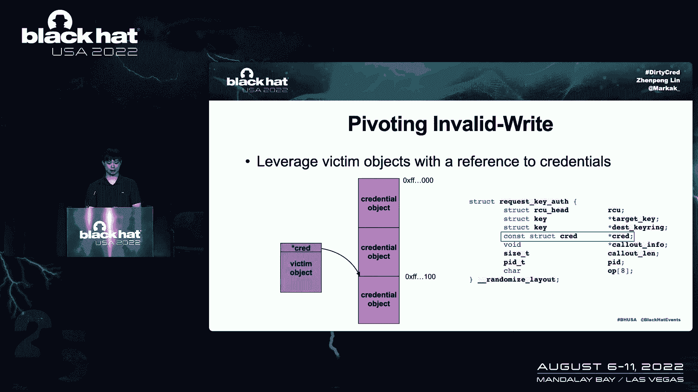
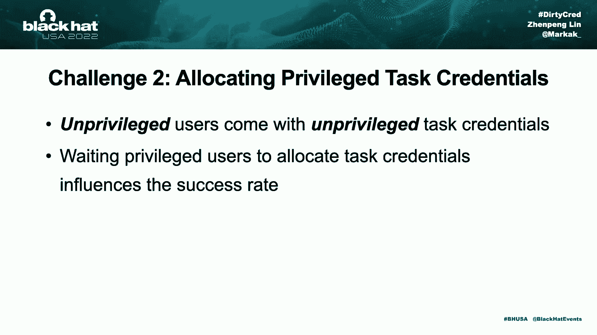
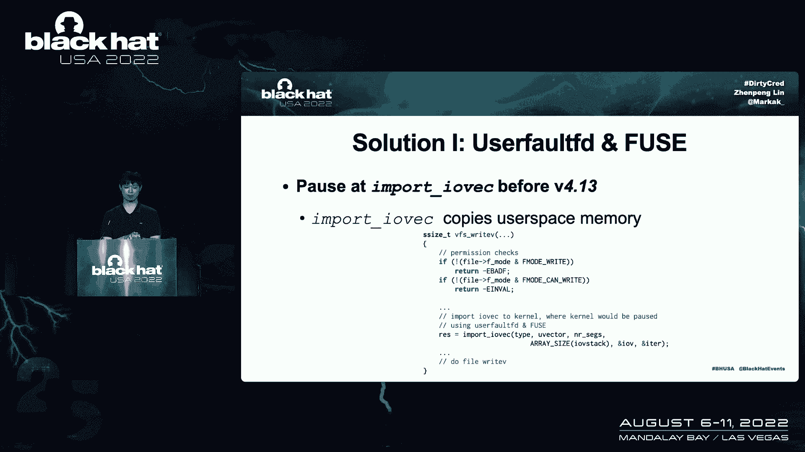
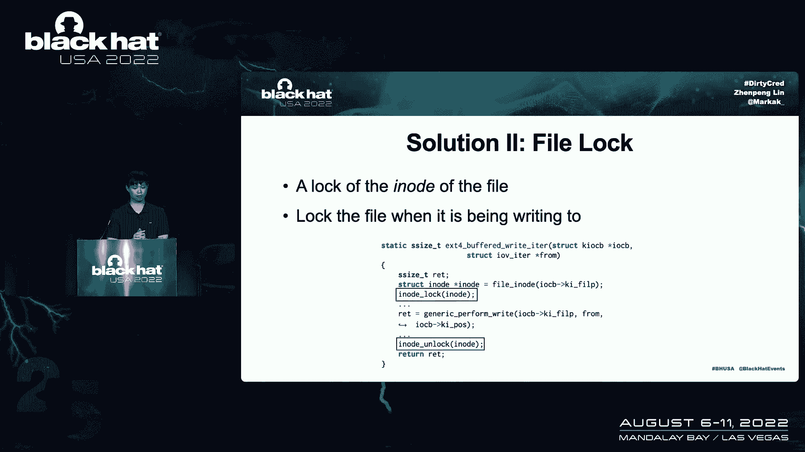
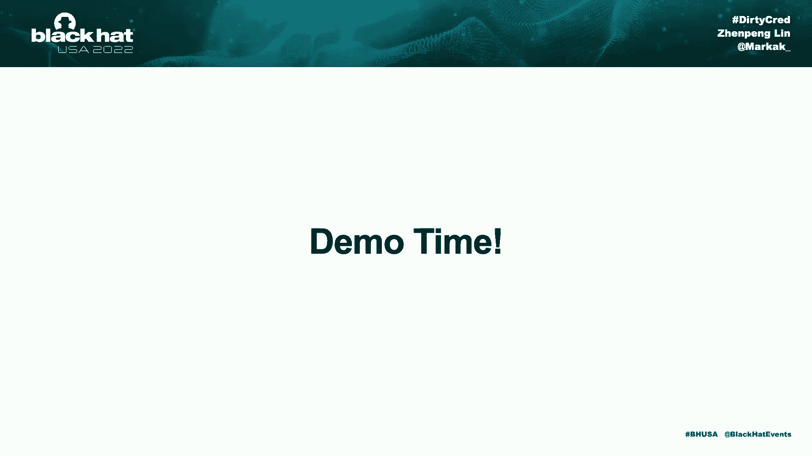
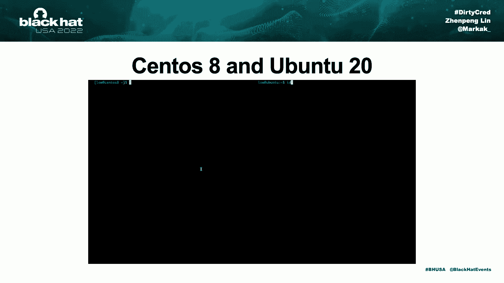
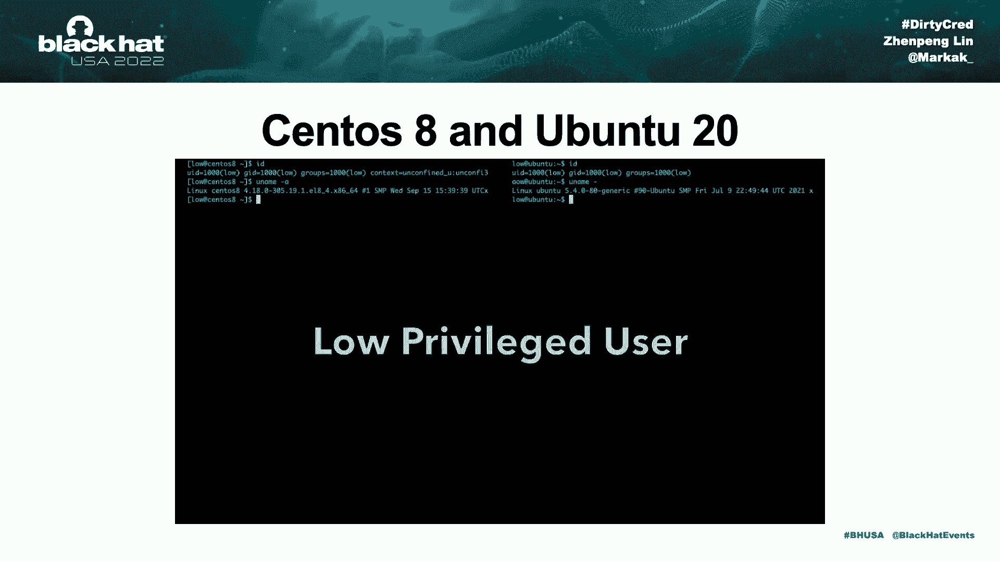
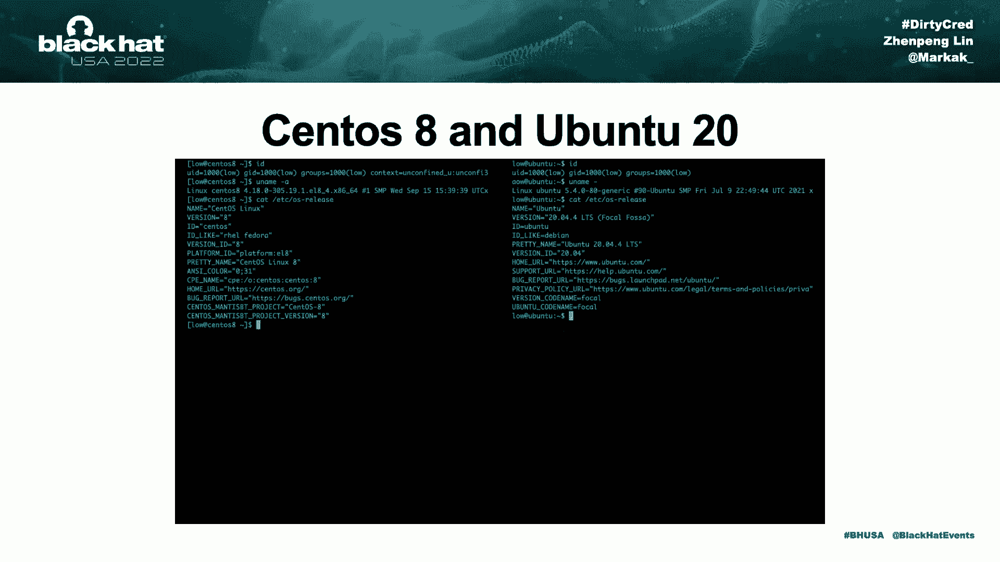
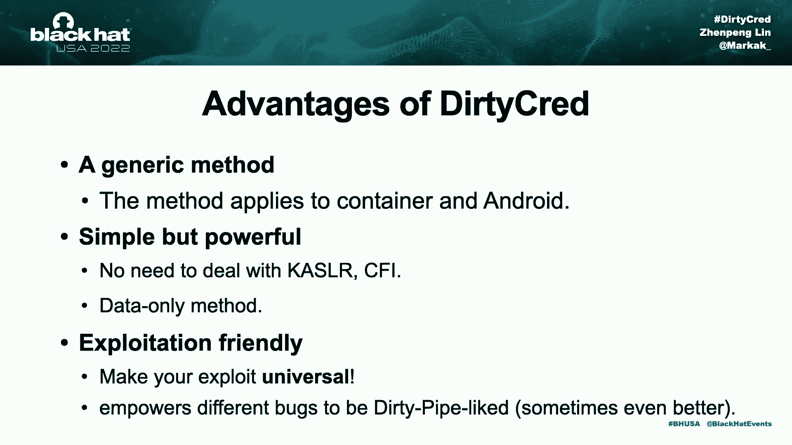
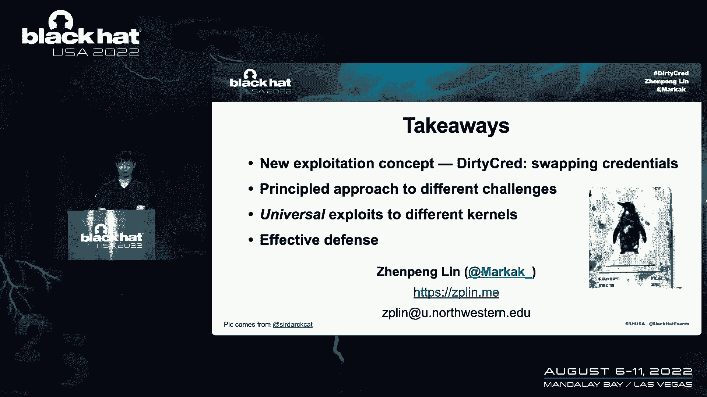

# 课程 P84：095 - Cautious：一种新的漏洞利用方法！虽非管道，却与脏管道一样危险 🔓

在本节课中，我们将学习一种名为 **Dirty Cred** 的新型内核漏洞利用方法。这种方法的核心思想是交换内核中的权限凭证，从而实现权限提升。与传统的控制流劫持不同，它是一种纯数据攻击，能够绕过许多现代安全缓解措施。

---

## 概述与背景 📖

我是阿金，来自西北大学的博士生，研究方向是系统安全。我的合作者顾武汉同样来自西北大学，我们的研究兴趣相似。本次演讲将介绍我们发现的 **CVE-2022-0847** 漏洞，即著名的 **Dirty Pipe**。

**Dirty Pipe** 是 Linux 内核子系统中的一个未初始化漏洞，影响内核 v5.8 及以上版本。它最有趣的一点是其利用方式：它不劫持控制流，而是进行纯数据攻击。这意味着它不需要绕过 KASLR，也不必处理 CFI。其效果也不同：它不以内核权限执行代码，而是可以覆盖任何我们拥有读取权限的文件。这种能力使得 **Dirty Pipe** 能够演示本地权限提升或攻击 Android 系统。

**Dirty Pipe** 的强大吸引了大量关注。我们从中学到的最有趣的一点是：纯数据攻击非常强大，并带来诸多好处。首先，纯数据攻击方法允许编写通用利用代码，这意味着同一份利用代码可以在不同内核版本和架构上运行，无需修改。其次，它不必处理 CFI，而 CFI 是 Android 内核中有效的缓解措施。第三，大多数缓解措施侧重于保护控制流完整性，而 Linux 内核中很少有措施保护数据完整性，因此对 **Dirty Pipe** 这类攻击无效。

然而，**Dirty Pipe** 并不完美。首先，它不能主动从容器中逃逸。其次，它只是一个特定的漏洞，而非一种能使其他漏洞受益的通用利用方法。

---

## 引入 Dirty Cred：一种新的利用方法 🚀

在本次演讲中，我想介绍一种新的利用方法，称为 **Dirty Cred**。它借鉴了 **Dirty Pipe** 的高级思想，但目标是交换内核凭证。这种方法有几个优点：
1.  它是一种通用的漏洞利用方法，步骤简单但有效。
2.  类似于 **Dirty Pipe**，它只操作数据，不处理 CFI 和 KASLR。
3.  使用 **Dirty Cred**，能够主动逃离容器，这是 **Dirty Pipe** 做不到的。

简单总结一下：
*   **Dirty Cred** 是一种通用的利用方法。
*   两者都只进行数据操作。
*   因为操作的是数据，所以可以绕过 CFI。
*   **Dirty Cred** 能主动逃离容器，而 **Dirty Pipe** 不能。
*   更重要的是，**Dirty Pipe** 是一个已修复的漏洞，而 **Dirty Cred** 作为一种方法，其威胁仍然存在。

---

## 内核凭证详解 🔑

**Dirty Cred** 攻击的是内核凭证。那么，什么是内核凭证？根据内核文档，内核凭证是在内核中携带权限信息的属性。它们是 Linux 内核中用户权限和能力的表示。

主要有两种类型的凭证：
1.  **任务凭证**：用于每个内核任务。
2.  **打开文件凭证**：将特权信息封装到打开的文件中。

内核通过检查这些凭证来实施权限控制。

### 任务凭证的实现与使用

任务凭证在 Linux 内核中实现为 `struct cred`。每个内核任务都引用一个在堆上分配的 `struct cred`。凭证用于检查非特权用户的权限。

*   当非特权用户创建新内核任务时，内核会在空闲内存槽上分配一个非特权 `struct cred`。
*   如果用户具有特权，内核将在堆上分配特权 `struct cred`。
*   拥有特权凭证的用户被视为 root 用户。

### 打开文件凭证的实现与使用

打开文件凭证实现为 `struct file`，类似于 `struct cred`，也存储在内核堆中。当打开文件时，会在内核堆上创建一个新的 `struct file`。

`struct file` 包含几个重要字段：
*   `f_mode`：文件如何被打开（例如，读写模式或只读模式）。
*   `f_cred`：引用打开文件的用户的权限。
*   `f_path`：对正在操作的文件进行编码。

当文件打开时，文件的访问信息会被传输到 `struct file`。内核通过检查 `struct file` 来判断是否允许访问。

**示例**：
*   如果我们以读写模式打开文件，`f_mode` 字段将包含相应的标志。尝试写入时，权限检查满足，内容将被写入磁盘。
*   如果文件以只读模式打开，`f_mode` 字段将只有读标志。尝试写入时，权限检查将失败，写入操作会被拒绝。

---

## Dirty Cred 攻击原理 ⚔️

**Dirty Cred** 的高级思想是交换内核凭证，特别是将非特权凭证与特权凭证互换，从而实现权限提升。下面介绍两种攻击途径：攻击任务凭证和攻击打开文件凭证。

### 攻击任务凭证

Linux 内核中，每个内核任务都引用堆上的 `struct cred`。

攻击步骤如下：
1.  **利用内核漏洞释放凭证**：利用内核漏洞，释放属于攻击者任务的非特权 `struct cred`。一旦凭证被释放，内存槽将被内存分配器标记为空闲。
2.  **分配特权凭证**：触发新的特权内核任务（例如，通过执行 setuid 程序或与特权守护进程交互），该任务将在内核堆上分配特权 `struct cred`。堆分配器会重用上一步释放的空闲内存槽，将新的特权 `struct cred` 放入其中。
3.  **凭证交换完成**：此时，攻击者任务引用的 `struct cred` 已从非特权变为特权。攻击者随后可以像特权用户一样操作。

### 攻击打开文件凭证

`struct file` 用于在访问打开的文件时检查权限。文件系统的实际写入操作由 `write` 函数完成。

攻击步骤如下：
1.  **释放文件结构**：在满足权限检查后、但开始实际写入文件系统之前，利用漏洞释放内核内存中的 `struct file`。释放后，内存槽变得空闲可重用。
2.  **打开目标文件**：打开一个我们想覆盖但无写入权限的文件（例如 `/etc/passwd`）。由于没有权限，我们以只读模式打开它。此操作会在内核堆上分配一个带有只读标志的新 `struct file`。堆分配器会重用第一步释放的空闲内存槽。
3.  **执行写入，完成覆盖**：当内核继续执行最初的写入操作时，因为 `struct file` 已被交换（从指向虚拟文件变为指向 `/etc/passwd`），且权限检查已在第一步通过，所以实际写入磁盘的内容会进入 `/etc/passwd` 文件。

---

## 实现攻击的挑战与解决方案 🧩

这三个步骤听起来简单，但实现起来有挑战。

### 挑战一：如何释放凭证对象？

大多数漏洞不具备直接释放 `struct cred` 或 `struct file` 的能力，因为这些对象分配在专用的内存缓存上，而多数漏洞发生在通用内存缓存上。

**解决方案**：将漏洞能力“嫁接”到凭证对象上。我们有两种方法：
1.  **嫁接 Use-after-Free 漏洞**：利用一个包含对凭证对象引用的受害者对象。通过堆溢出等手段，使漏洞对象的内存与受害者对象重叠，并部分覆盖指向凭证对象的指针。这会导致引用计数不平衡，从而在触发释放时错误地释放凭证对象。
2.  **嫁接 Double-Free 漏洞**：首先释放易受攻击的对象，然后释放同一内存缓存中的所有对象，最终释放整个内存页。接着，分配大量凭证对象来回收这些空闲内存页（称为跨缓存攻击）。这样，剩余的悬空指针将指向凭证对象，从而可以释放它。

### 挑战二：如何以非特权用户身份分配特权凭证？

在 Linux 内核中，非特权用户附带非特权任务凭证，因此不能直接分配特权凭证。等待特权用户操作是不可预测的。

**解决方案**：
*   **来自用户空间**：触发特权用户空间进程。例如，执行带有 SUID 位的二进制文件，或与以 root 身份运行的守护进程（如 `systemd`、`dbus`）交互，迫使内核分配特权凭证。
*   **来自内核空间**：通过向内核发送大量请求，促使内核产生新的内核工作线程来处理，这些线程会分配新的特权凭证。或者，调用用户模式辅助程序来加载内核模块，这也会产生新的内核线程并分配特权凭证。

### 挑战三：稳定地进行文件利用

当我们攻击打开的文件凭证时，交换时机至关重要。
*   如果在权限检查**之前**交换，文件对象的 `f_mode` 将是只读的，导致权限检查失败。
*   如果在写入磁盘**之后**交换，内核只会写入虚拟文件而非目标文件。
*   交换必须在权限检查和实际写入磁盘**之间**进行。

这个时间窗口通常非常小，因为写入文件很快。小的时间窗口可能导致攻击不稳定。

**解决方案**：延长这个时间窗口，使攻击具有确定性。
1.  **利用 `userfaultfd` 或 FUSE 暂停内核执行**：当内核访问用户空间内存时（例如，通过 `userfaultfd` 管理），内核执行会暂停。在内核 v4.13 之前，这可以通过 `write` 函数的向量写入路径实现。但在 v4.13 之后，向量数据的导入被移到了权限检查之前，因此此技术在新内核中失效。
2.  **利用通用 `write` 函数中的页面错误**：在权限检查之后、实际写入文件之前，`write` 函数会尝试在用户空间缓冲区上创建页面错误以避免数据竞争。我们可以利用对此缓冲区的访问来暂停当前执行，从而延长窗口。
3.  **利用文件锁**：当多个线程写入同一文件时，内核会使用文件锁确保顺序操作。如果线程 A 写入大量数据（如 4GB），可能需要十几秒，那么等待锁的线程 B 将在权限检查和实际写入之间面临一个巨大的时间窗口。我们可以利用这一点，确定性地进行攻击。

---

## 演示与总结 🎬

我们使用一个漏洞（CVE编号）在两种不同内核版本（4.18 和 5.4）的系统上进行了演示。攻击前，`/etc/passwd` 文件完好。运行利用代码后，攻击成功将低权限用户提升为 root，并修改了 `/etc/passwd` 文件。即使在启用内核 CFI 的系统上，攻击也成功了。

### Dirty Cred 的优势总结
1.  **通用性**：它是一种通用的利用方法，可针对不同的漏洞实现内核利用，适用于容器和物理机环境。
2.  **简单有效**：方法核心只是交换内核凭证，但非常有效和强大。作为一种数据方法，它不必处理 KASLR 和 CFI，且目前没有公开的缓解措施。
3.  **可移植性**：类似于 **Dirty Pipe**，它可以作为通用利用代码，在不同内核上工作而无需任何代码修改。

### 缓解措施建议 🛡️

面对如此强大的利用方法，我们如何防御？我们的建议是基于对象类型的隔离。

目前，特权和非特权凭证共享相同的内存缓存，它们可能互相重叠，因此可以被交换。我们的解决方案很简单：将特权凭证隔离到不同的内存区域，特别是将它们分配到虚拟内存中。这样就不再可能进行交换和跨缓存攻击。我们已经有一个原型实现，代码可以在我的 GitHub 中找到。

---

## 课程总结 📝

本节课我们一起学习了 **Dirty Cred** 这种新的内核漏洞利用方法。

*   我们介绍了 **Dirty Cred** 的核心概念：**交换内核凭证**以实现权限提升。
*   为了实现这一想法，我们制定了一套有原则的方法来应对不同的技术挑战。
*   **Dirty Cred** 实现了通用的内核利用，能够绕过 Linux 内核中可用的所有防御措施，并适用于不同的内核版本和体系结构。
*   最后，我们提出了一种对 **Dirty Cred** 有效的防御方案：**隔离特权凭证**，从根本上解决了问题。

感谢我的合作者以及为本次演讲提供帮助的各位。