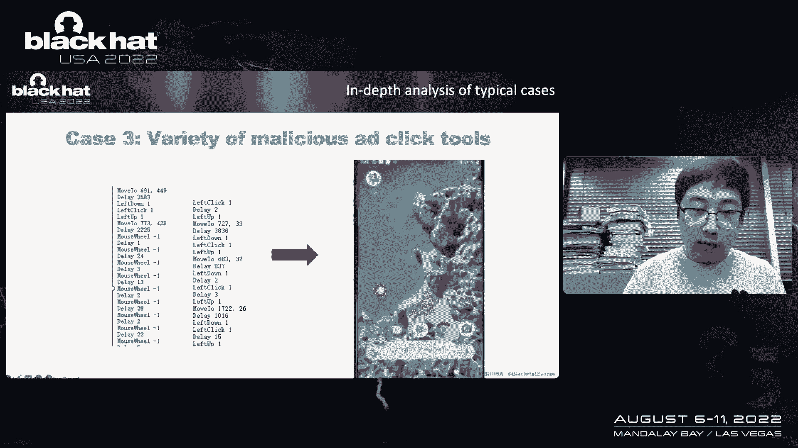
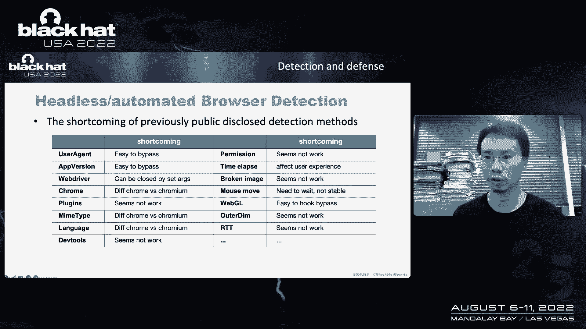
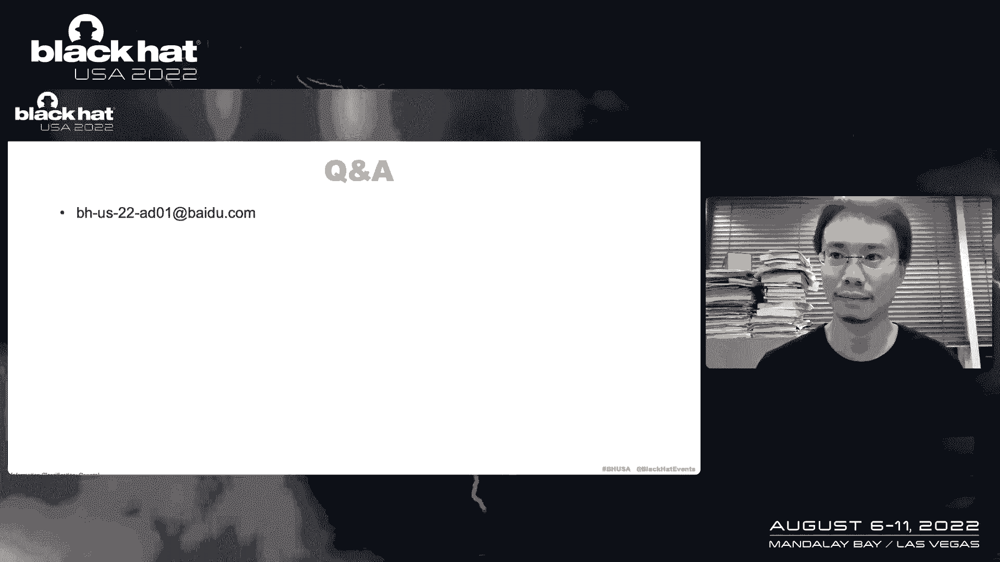

# 课程 P85：096 - 对抗百亿规模互联网地下产业：广告欺诈篇 🔍

在本节课中，我们将学习互联网广告欺诈的背景、地下产业的运作模式、常见的技术手段，以及如何检测和防范这些欺诈行为。我们将通过分析典型案例，深入理解这个价值数千亿美元的灰色产业链。

---

## 广告业背景与欺诈成因 🌐

上一节我们介绍了课程概述，本节中我们来看看广告业的背景和欺诈发生的原因。

根据过去几年全球互联网公司的财务报告，全球广告业的规模已达数千亿美元。广告是大多数互联网公司的主要商业模式。典型的互联网模型包括社交网络、搜索引擎、应用商店和短视频。

当互联网平台公司成长起来时，它们获得了大量的用户和广告商。广告主不断花钱在互联网平台公司推广产品。互联网公司通常试图打破仅在自己媒体（如网站、应用程序）上展示广告的限制，开始向第三方开放广告客户库，形成所谓的广告联盟平台。

大量的广告商通过广告联盟平台在多个子媒体上展示广告。例如，广告商投资一百元，广告联盟平台公司会得到30元，第三方应用程序获得70元，形成一个三方共赢的局面。

广告计费方式包括：
*   **CPC**：按点击计费。
*   **CPM**：按展示计费。
*   **CPA/CPI**：按安装或行动计费。

广告欺诈发生在媒体与广告平台之间。媒体想欺骗平台以不正当获利分红。广告欺诈也发生在广告商之间。一般来说，广告商的预算是有限的，如果他的预算被恶意点击消耗，他的竞争对手可以用低成本来获得更多的客户。

---

## 典型案例分析：恶意SDK与自动点击 🤖

上一节我们了解了广告欺诈的成因，本节中我们通过具体案例来看看欺诈是如何实施的。

在安全分析过程中，我们在一个大数据分析中发现了一些恶意行为。一个SDK被合并到许多著名的应用程序中。该SDK会悄悄地动态加载DEX恶意文件。

该恶意SDK会请求最新的补丁。如果环境是安全的，云服务器会给JS打补丁。在一系列复杂的请求之后，最后获得配置文件和自动点击文件。

以下是恶意SDK的工作流程：
1.  SDK评估了几个不同的来源，并下载一个DEX文件、一个4R5文件和一个JS文件。
2.  当JS请求服务器时，目标URL、关键词、点击阅读和其他任务信息已经下载到应用程序中。
3.  JS开始加载目标URL到一个不可见的WebView中。
4.  几秒钟后，注入自动点击脚本操作网页。

为了在代码中执行更多的Java函数，采用了JS桥技术。例如，首先在SDK中注册一个名为`base`的JS桥。当在JavaScript代码中调用`base.getDeviceInfo()`方法时，同样的方法将在Java代码中执行。

为了在后台启动一个不可见的活动，这里使用了活动容器技术。需要实现自己的窗口管理器和视图路由，还需要钩住一些类，让活动在自定义的环境中运行，这样安卓系统就找不到这样的窗口。

在分析了技术之后，让我们来看看这个案例的组织结构。后门开发公司拥有一些广告商的频道号。在URL中找出一个等于特定值的频道。当用户点击这些广告时，这些通道会得到一个回扣。然后他们整合回代码，并将它们引导到JS文件中，卖给大数据分析公司，最后许多著名的应用程序集成了这个恶意的SDK，但开发商并不知道。

---

## 典型案例分析：软件捆绑与浏览器插件 🕸️

上一节我们分析了恶意SDK的案例，本节中我们来看看另一种通过软件下载传播的欺诈手段。

当我们需要下载一些软件时，可能会去一些软件下载网站。在下载页面上，它们通常有本地下载按钮和“建议下载”按钮。选择“建议下载”实际上并没有提高速度，相反，部分软件被绑定并安装，甚至更广泛的插件会被静默安装。

下载并安装该目标下载器后，下载器会判断是否有杀毒软件，然后向服务器报告，获得静默安装软件的任务。同时，下载程序还将判断系统使用的浏览器，并将相应的插件CRX文件复制到相应的路径。它只需要复制，用户没有感觉。

这个浏览器插件包括拦截请求、修改页面并执行JS脚本的功能。它可以完全控制请求和响应页面。后台脚本将检查请求URL是否是目标，内容脚本用于为不同的任务注入代码。

让我们看一个例子。当用户访问视频网站时，恶意浏览器插件的脚本首先将检测它是否是高质量的用户，目标账户和关注计数都是从云服务器获得的。服务器不需要更新页面，只需要返回不同的任务。

从另一个角度来看，如果插件检测到用户正在访问电商网站，比如一些比价网站，插件将替换渠道ID。如果用户最终购买了产品，被替换的渠道会得到一个佣金，这就是它可以通过恶意插件获利的原因。这也是为什么软件网站让你用下载器下载而不是直接下载。

---

## 地下产业常用工具与技术 🛠️

上一节我们看到了欺诈的具体实施方式，本节中我们来总结地下产业常用的工具和技术。

恶意广告点击工具常用一种名为“易语言”的编程语言。易语言使用中文作为代码，因为学习门槛低，已经成为许多地下工业集团的首选编程语言。程序代码是用中文写的。易语言的开发社区尤其活跃，除了沟通技术问题，它还支持通过支付定制特殊功能。

以下是地下工业的一些常见工具：
*   **精易模块**：这是一个默认包含在易语言中的Web操作库。除正常功能外，还支持设置屏幕高度、模拟触摸等参数。
*   **队长模块**：这是最受欢迎的浏览器自动化库。它使用的是Chrome内核，开发者可以轻松操作浏览器实现自动点击、修改数据、模拟设备指纹、注入JS等操作。
*   **移动端点击工具**：例如，`Auto.js`主要用于记录输入、滑动、点击和其他行为，然后在必要的时候回放。这类软件被地下工业用来模拟真人点击广告。与使用JavaScript代码模拟滑动相比，这种录制的触摸轨迹更像真人的行为，而且不容易被风险控制系统发现。

高层地下产业集团的特点是他们可以大规模远程控制用户设备，类似于在数千台设备上安装后门程序。他们采用大量的仿真技术、隐藏技术和反检测技术。

与高层地下群相比，低级团伙使用各种工具实现本地模拟点击功能。他们可能没有渠道将恶意代码集成到主流应用中，因此可以使用浏览器库进行二次开发，如模拟用户代理和硬件信息，或者使用无头浏览器和一些IP代理工具、触摸模拟工具来点击目标。

---

## 广告欺诈检测技术与解决方案 🛡️

上一节我们了解了攻击者的工具，本节中我们来看看如何检测和防御这些广告欺诈行为。

地下产业的技术能力有了显著的提高。我们需要通过技术手段准确地分离恶意点击，以减少损失。检测方案主要针对以下几类威胁：无头浏览器、不可见WebView、移动端模拟点击工具和恶意浏览器扩展。

**1. 检测无头浏览器**
无头浏览器大多基于Chrome DevTools协议。典型的无头浏览器库包括Puppeteer、Playwright和Selenium。
通过调试Chromium源代码，我们发现Puppeteer启动Chrome时，会开启远程调试端口，然后通过WebSocket发送控制命令。这个启动通道是一个关键的检测点。
受到侧信道概念的启发，我们可以通过观察不同操作的时间和资源消耗来检测。例如，我们可以通过JavaScript强制进行内存复制操作，但只有当浏览器处理了DevTools实例时，才会执行此代码，从而可以检测是否在无头环境中。

**2. 检测不可见移动WebView**
这类恶意软件从云中动态加载恶意代码，高度定制，并使用JS桥将JavaScript脚本注入不可见的WebView。
我们有两种检测方法：
    *   第一种是通过大规模的样本农场，动态运行所有应用程序，观察代码的动态加载和分析WebView行为。
    *   第二种是通过JavaScript检测。恶意软件的关键技术是在页面中找到广告的位置并模拟用户行为。我们可以检查页面中是否有隐藏的登录页面，一旦发现异常信息，就可以回溯找到样本进行分析。

**3. 检测移动端模拟点击工具**
我们可以通过分析点击行为来检测。例如，编写一个点击脚本运行两次，这两次点击之间有毫秒级的时间差。我们可以检测增强工具产生的点击和滚动轨迹的坐标。
在安卓系统上，我们也可以关注触摸事件，如触摸压力、触摸范围，这些数值与人类不同。
对于云手机形态，通常由固定的硬件和机房提供。如果发现许多相同的设备在同一时间访问，就可以探测到云手机。我们应该收集尽可能多的WebView功能，因为即使用户代理或IP改变，网络特征也会保持稳定。

**4. 检测PC端恶意浏览器扩展**
恶意浏览器扩展的关键特性是拦截请求、重定向URL和向网页注入JavaScript。
对于URL重定向，我们可以引导浏览器访问一个我们生成的、带有特定签名的URL。我们在服务器端监控请求，如果URL参数被更改，就意味着浏览器有恶意扩展或驱动。
对于JavaScript注入，我们的检测方法是使用CSP特性。我们制作的网页采用非常严格的CSP策略，比如拒绝跨域请求。当恶意软件扩展尝试在页面中插入JavaScript时，将发生验证错误并向服务器报告数据，甚至包括浏览器扩展的名称，这是追踪地下产业的关键。

---

## 总结与建议 📝

本节课中我们一起学习了互联网广告欺诈的完整链条。

我首先介绍了广告业的背景，广告联盟是如何形成的，以及欺诈发生在哪里。然后选取了三个典型案例，对地下产业的结构进行了分析，并总结了关键技术特征。接着，我们介绍了检测项目是如何解决这些问题的，并提供了具体的解决方案。

对于广告产业链的建议如下：
*   **对于广告联盟平台**：应该相互分享信息，因为地下产业经常在多个平台上作案。
*   **对于应用程序开发者**：应该仔细审查集成的第三方SDK，选择大型、信誉好的广告联盟平台进行合作。
*   **对于浏览器开发者**：应该通过增强浏览器扩展加载的安全检查来防范恶意插件。

通过法律和技术手段的结合，我们可以有效地对抗广告欺诈，维护健康的互联网生态。