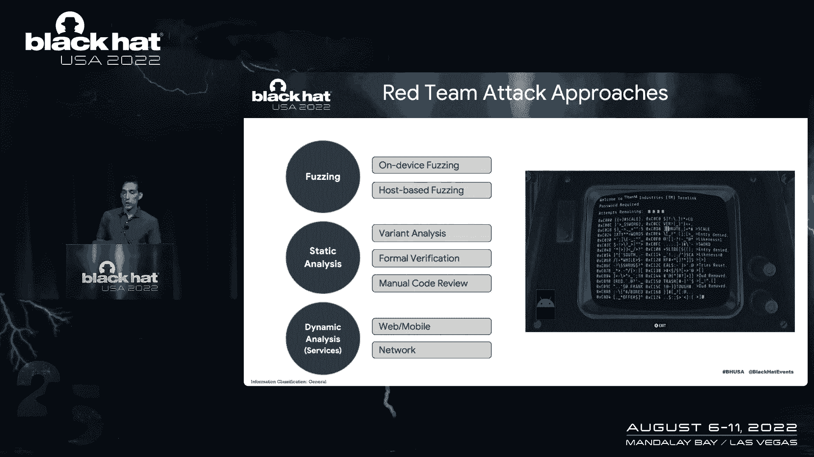
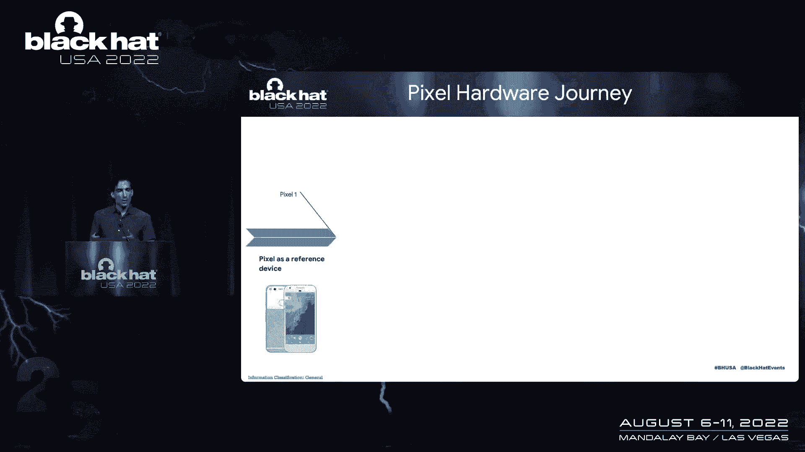
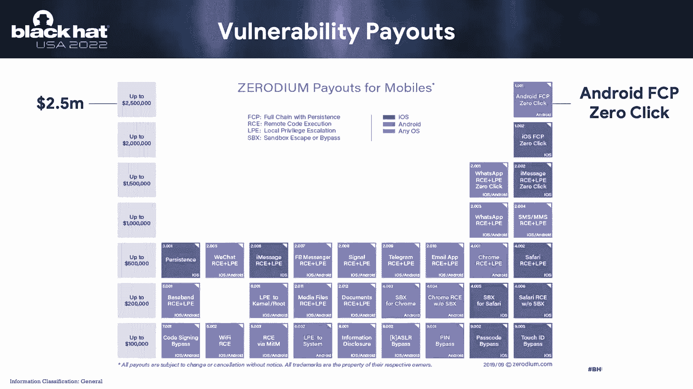
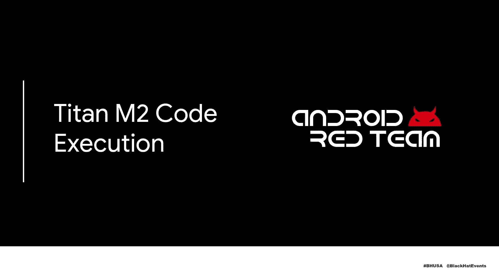
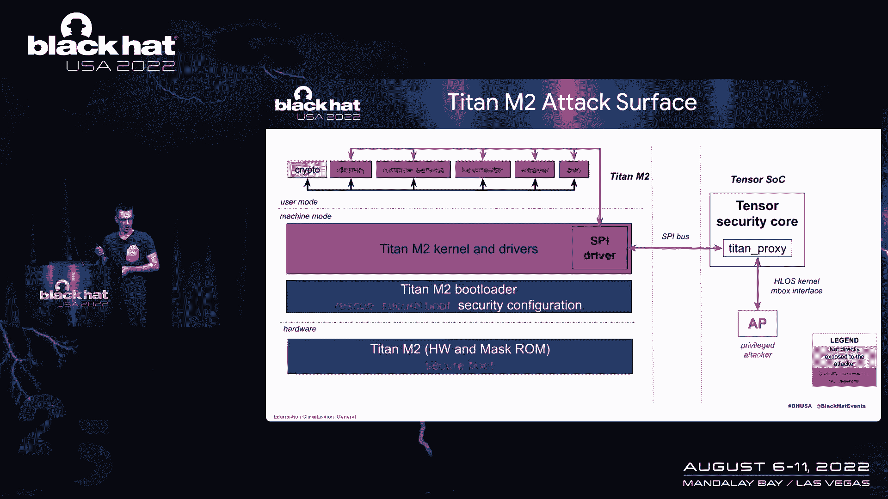
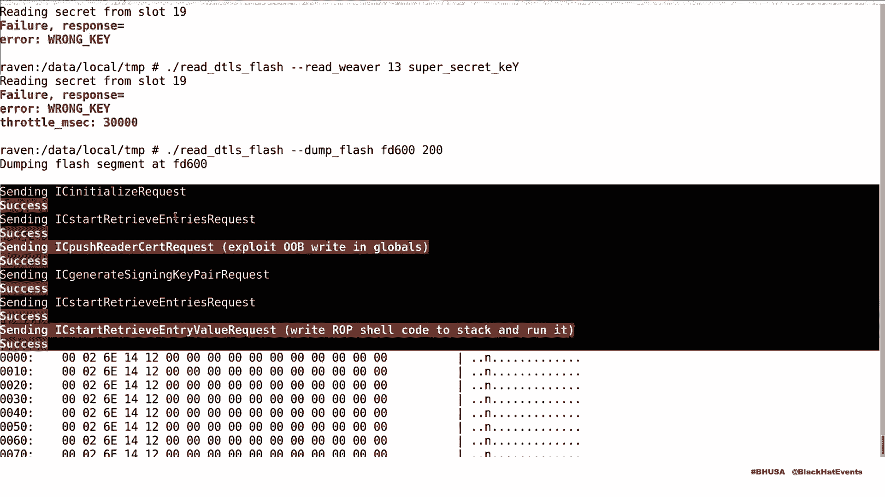
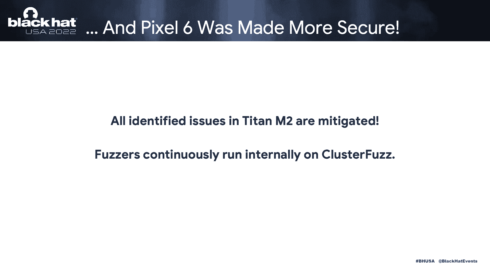
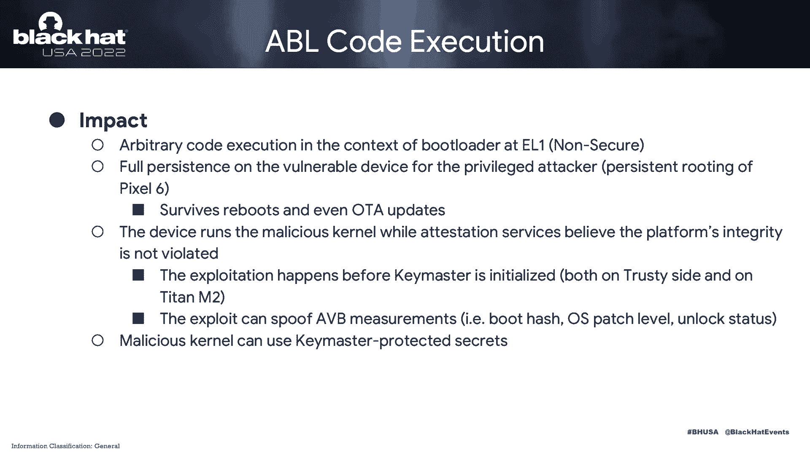

# 课程 P86：097 - 谷歌如何重新构想手机，以及我们如何对其进行红队测试与加固 🔒

在本节课中，我们将学习谷歌如何为 Pixel 6 重新构想一款手机，以及安卓红队如何对其进行安全测试与加固。我们将深入了解 Pixel 6 的新硬件架构、关键攻击面，并深入探讨在 Titan M2 安全芯片和 Android Bootloader 中发现的高影响力漏洞及其利用过程。

---

## 团队与使命 👥

我们是安卓红队，为谷歌工作。我们的使命是通过攻击关键攻击面，在真实攻击者之前发现并修复有影响力的安全问题，从而保护 Pixel 和安卓系统。

我们的工作主要通过红队参与、工具开发（如模糊测试）以及深度参与修复过程来完成。这有助于我们验证安全假设，并为安全决策提供信息。

---

## Pixel 的安全演进与攻击趋势 📈

上一节我们介绍了团队使命，本节中我们来看看 Pixel 手机的安全演进历程。

Pixel 系列手机在安全方面经历了多次迭代。Pixel 3 引入了 Titan M 安全芯片，这是一个重大进步。而 Pixel 6 则构建了自定义的 Tensor SoC，并添加了额外的安全飞地，其中最重要的就是 Titan M2 芯片。

从攻击者视角看，漏洞利用的趋势正在向底层移动。随着应用被沙箱化，攻击开始从操作系统层下移到内核、固件甚至 ROM 代码级别。这些底层的漏洞对攻击者极具吸引力。

一个支持证据是漏洞赏金定价。数据显示，第三方市场对安卓完整攻击链的漏洞定价远高于其他移动平台，这表明安卓平台的安全性正在提高，漏洞利用变得更困难。

---

## Pixel 6 的攻击面 🎯

了解了安全趋势后，现在让我们聚焦到 Pixel 6 的具体攻击面上。

下图展示了谷歌 Tensor SoC 的高级攻击面。浅蓝色部分是之前 Pixel 已有的功能更新，深蓝色是 Pixel 6 新增的，主要是 Tensor 安全核心和 Titan M2 芯片。红色部分是我们红队测试并帮助修复过的攻击面。

我们将重点关注两个攻击面，它们也是本次演示的核心：
1.  **Titan M2 安全芯片**
2.  **Android Bootloader**

尽管我们将在课程中讨论一些高影响力的代码执行漏洞，但我们有信心 Pixel 6 是迄今为止最安全的 Pixel 手机。这是因为我们通过模糊测试、静态分析提高了代码覆盖率，并与功能团队合作优先修复和强化了系统。

---

## 深入 Titan M2 安全芯片 ⚙️

上一节我们概述了攻击面，本节我们将深入第一个核心组件：Titan M2 安全芯片。

Titan M2 是 Pixel 6 上处理高价值秘密、提供物理攻击防护的核心安全元件。它基于自定义的 RISC-V 架构，运行完全重新设计的操作系统和固件栈。

以下是 Titan M2 的关键安全机制：
*   **内存保护策略**：通过物理内存保护寄存器和自定义扩展，使代码段不可写，数据段不可执行。
*   **任务隔离**：使用 PMP 寄存器确保不同任务不能读写彼此的堆栈和全局数据。
*   **文件系统隔离**：每个任务都有独立的文件系统来保存其秘密。
*   **系统调用 ACL**：内核向应用暴露的系统调用受到访问控制列表策略限制。

我们的任务是在 Pixel 6 发布前，主动识别并帮助缓解 Titan M2 固件中的问题。模糊测试是我们的核心方法。

我们采用了两种方向的模糊测试：
1.  **基于主机的模糊测试**：得益于固件实现，我们能为部分模块构建 x86-32 位版本，从而创建了高性能的模糊测试器，并利用了地址消毒剂等工具。
2.  **基于模拟器的模糊测试**：使用功能团队提供的完整系统模拟器，覆盖那些无法在主机上构建的组件（如直接与加密硬件通信的模块）。

我们总共开发了三个模糊测试器，它们相互共享测试用例，确保了攻击面的广泛覆盖。

---

### 漏洞发现与利用链 🔗

通过运行模糊测试器，我们积累了一批初始问题。并非所有问题都直接来自模糊测试，但模糊测试在引起我们对问题代码的关注方面发挥了关键作用。

我们发现了标识任务中的一个越界写入漏洞。攻击者能够控制公钥和长度参数，从而将任意数据写入受控地址。

为了将原始的越界写入提升为代码执行，我们利用了标识任务中的全局变量。通过精心组合多个命令，我们可以覆盖堆栈上的返回地址，从而在标识任务的上下文中执行任意代码。

获得代码执行后，我们的最终目标是泄露受 Titan M2 保护的高价值秘密。我们发现了 Weaver 任务保护的秘密。Weaver 为秘密提供密码保护存储。

虽然每个任务的文件系统是隔离的，但 ACL 策略存在一个缺口：有一个系统调用能够将 Flash 页面直接映射到 SRAM 中。标识任务可以调用此系统调用，从而绕过隔离，直接从 Flash 中读取 Weaver 存储的秘密。

我们通过组合四个 ROP 小工具来调用必要的系统调用，最终完成了攻击链。

---

### 漏洞演示 🖥️

以下是攻击演示的关键步骤：
1.  在 Pixel 6 Pro 设备上，我们首先向 Weaver 写入一个自定义秘密。
2.  使用正确密码可以成功读取该秘密。
3.  使用错误密码时，Weaver 会拒绝并限制尝试。
4.  利用我们发现的漏洞和编写的 Shellcode，我们直接转储 Flash 页面，在不提供密码的情况下读取了秘密。

尽管我们能够发现漏洞并实现代码执行，但所有问题都在 Pixel 6 发布前得到了修复。更重要的是，我们开发的模糊测试器已集成到安卓的持续模糊测试基础设施中，为 Titan M2 固件提供持续的安全保障。

---

## 深入 Android Bootloader 🔄

现在让我们转向第二个核心组件：Android Bootloader。

ABL 是安卓启动链中非常重要的一环。它在加载内核之前锁定安全设置、实现安卓验证启动、承载恢复环境，并负责加载和验证内核签名。由于其较大的攻击面和历史安全问题，我们将其纳入了本次审查。

我们的审查重点之一是 Fastboot 处理程序。在审查过程中，我们通过手动代码审计发现了一个不寻常技术漏洞，最终导致了代码执行。

该漏洞存在于 GPT 分区表处理程序中。解析函数会根据 GPT 头中声明的大小来分配缓冲区并加载数据，但这个头部信息未被验证。攻击者可以通过篡改 Flash 中的 GPT 头，欺骗 ABL 读取超出缓冲区大小的数据，造成堆缓冲区溢出。

ABL 使用基于堆的链表实现，因此经典的堆溢出利用技术在此有效。此外，设备上有多个闪存磁盘，每个都有 GPT 头，这意味着该漏洞可以被多次利用。

利用过程如下：
1.  准备第一个 GPT 头，使其在读取后覆盖堆中的空闲块头，将其大小改为一个很小的值，并指向堆栈区域附近。
2.  当代码尝试分配下一个缓冲区时，由于大小被修改，它会沿着链表到达我们指定的位置（即堆栈区域）。
3.  我们覆盖包含返回地址和其他寄存器的调用帧，从而控制程序计数器。

获得控制后，我们利用一个配置错误的内存区域（标记为可读、可写、可执行）来存放并执行我们的有效载荷，从而完全控制 ABL。

此漏洞的影响非常严重：
*   **持久性**：攻击源自 Flash，因此在重启甚至 OTA 更新后依然存在。
*   **绕过验证启动**：利用发生在密钥库初始化之前，攻击者可以欺骗测量值，让恶意内核通过验证，从而使用受密钥库保护的秘密。

---

### 漏洞演示 🖥️

在演示中，我们将 Pixel 6 设备连接到笔记本电脑。我们准备了攻击载荷并写入 GPT 头，然后重启设备以激活攻击。

设备成功启动后，我们检查安全启动状态，显示为“生产”模式，证明安全启动仍处于启用状态。然后，我们执行自定义的 Fastboot 命令 `oem rootkit`，该命令可以任意读取和修补内存，这证明了我们已获得对 ABL 的完全控制。重启设备后，攻击依然存在。

我们发现的漏洞已被评估为高危，并已在设备上修复。

---

## 总结与启示 📝

在本节课中，我们一起学习了谷歌安卓红队如何对 Pixel 6 进行安全测试。

我们的红队在 Pixel 6 中发现了有影响力的安全问题。对于尚未投资红队的安全项目，我们强烈建议这样做，它能提供对抗性视角和宝贵输入。

尽管模糊测试能帮助我们扩展能力，但审查裸机代码依然不易。良好的硬件抽象层和模块化设计能使这个过程更轻松。

在进行安全审查时，我们注意到一些低级组件缺乏基本的缓解措施。我们正与各功能团队合作评估其实施可行性。

最后，我们想强调，Pixel 6 是迄今为止最安全的 Pixel 手机。我们讨论代码执行漏洞，恰恰证明了没有“号角软件”，以及通过红队主动识别安全问题的积极价值。谷歌 Pixel 和安卓功能团队高度重视安全并支持修复工作。

我们的工作永无止境。行业中的红队通常在产品部署后进行检查，这能产生深远影响。如果将红队集成到软件开发生命周期中，就能在发布前抓住这些问题。