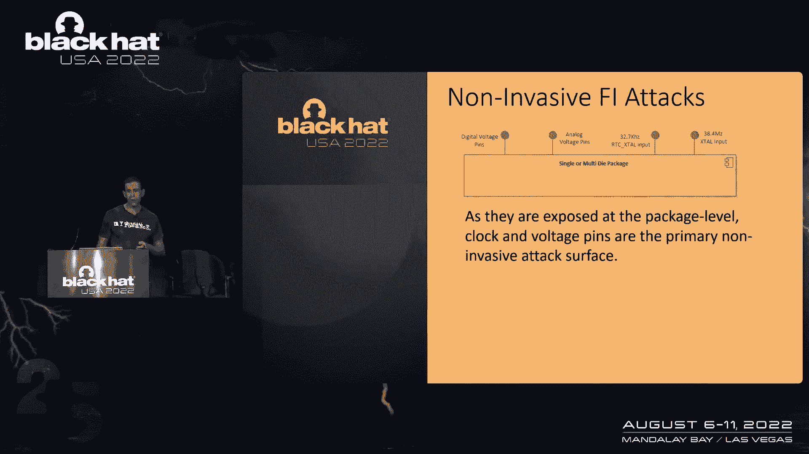
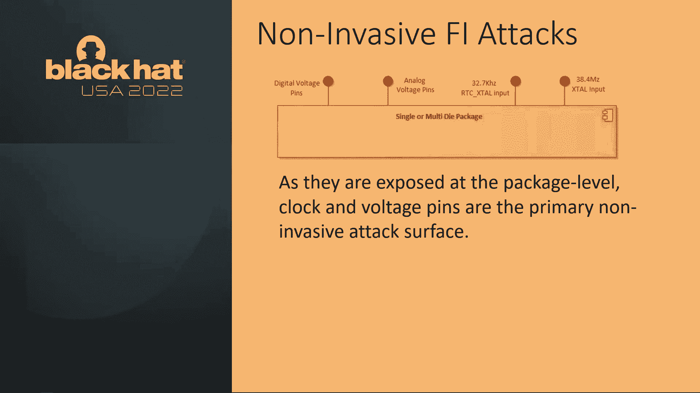
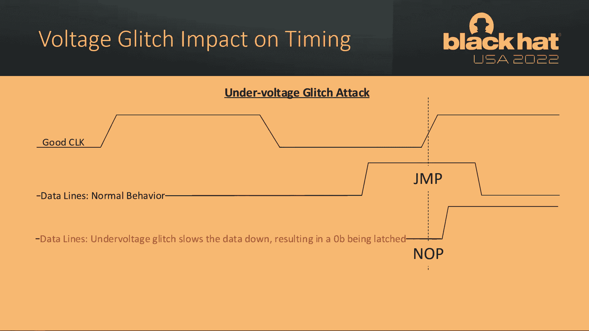
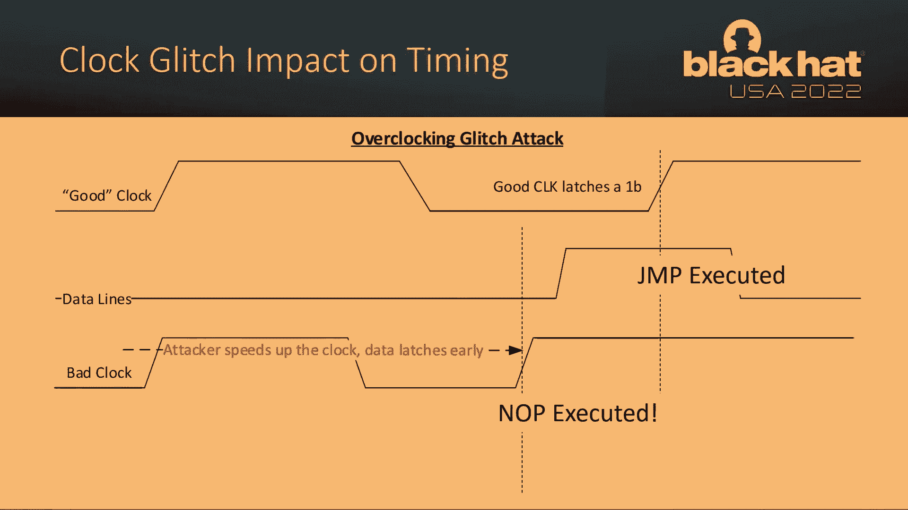
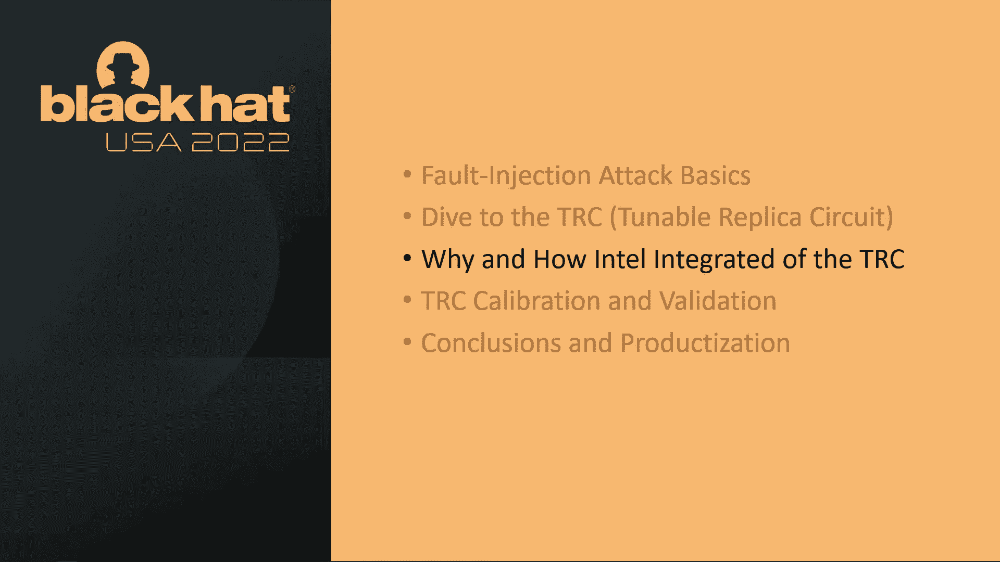
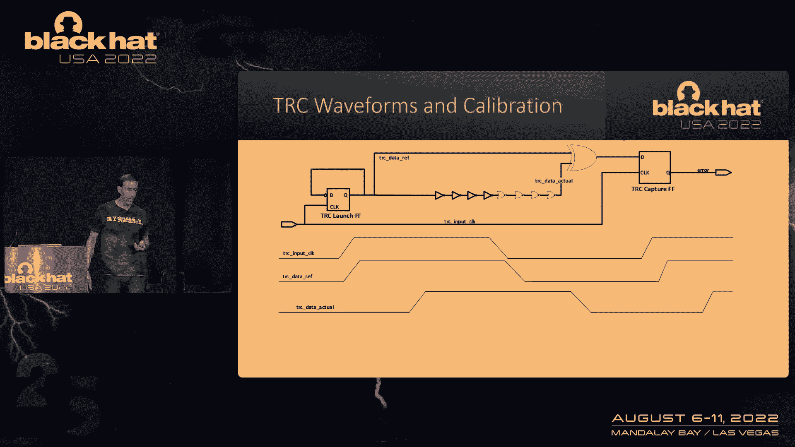
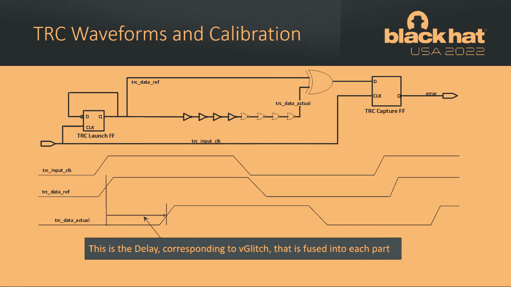
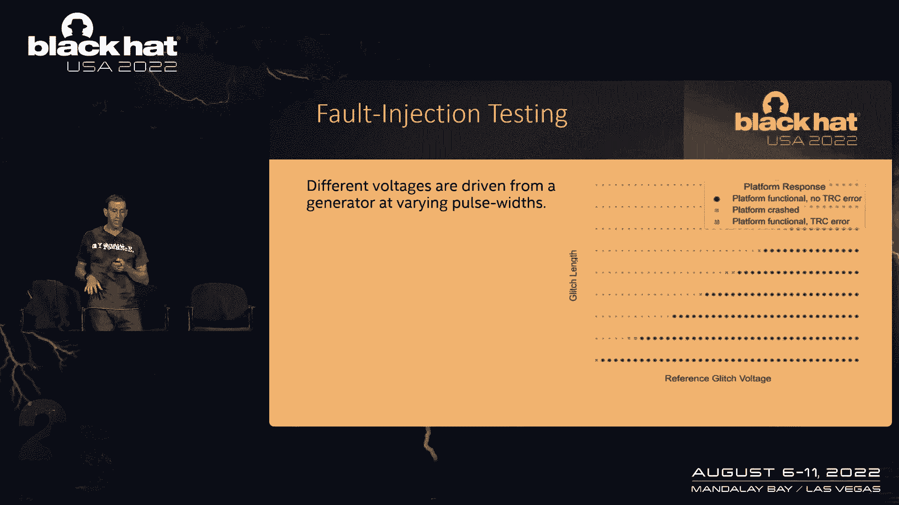
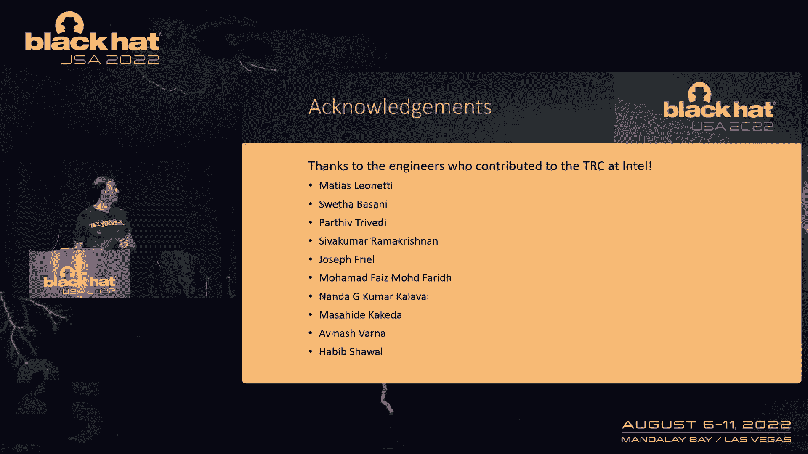

# 课程 P87：故障注入检测电路的设计、校准、验证与集成 🛡️

在本节课中，我们将学习故障注入检测的基础知识，并深入探讨英特尔采用的可调谐复制电路技术。我们将了解其设计原理、如何集成到产品中、关键的校准与验证过程，以及最终的应用效果。

## 故障注入攻击基础

上一节我们介绍了课程概述，本节中我们来看看什么是故障注入攻击。攻击者试图通过非侵入性手段干扰电路，使其产生错误，但又不至于导致整个系统崩溃。

重点是非侵入性故障注入攻击。这类攻击不涉及物理修改芯片引脚或开盖。

以下是主要的非侵入性攻击类型：
*   **电压攻击**：通过瞬间改变供电电压来影响电路时序。
*   **时钟攻击**：通过干扰时钟信号（如加快时钟）来影响电路时序。
*   **电磁辐射攻击**：也称为EMFI，通过电磁脉冲干扰电路。
*   **热攻击**：通过快速改变温度来影响半导体特性。

这些攻击的主要目标是芯片的数字与模拟电压轨，以及来自外部晶体的时钟输入引脚。

## 攻击者的目标与原理

了解了攻击类型后，我们来看看攻击者具体想达成什么目的。攻击者的核心目标是**导致电路时序失效**，从而让芯片执行非预期的操作。

电路时序失效之所以危险，是因为它可能导致数据锁存过早或过晚。在欠压攻击下，数据锁存可能过早发生，导致锁存到错误的值（例如锁存到0）。

一个关键问题是：什么指令的值与“0”最相关？答案是**条件跳转指令的“否”**。因此，故障注入攻击的“圣杯”是**将一条条件跳转指令（Jump）转换为无操作指令（NOP）**。例如，在安全引擎验证固件时，如果能使验证失败的跳转指令失效，系统就可能执行攻击者植入的恶意固件。

那么，这如何与时序关联呢？在标准时序下，数据在时钟上升沿被正确锁存。如果通过降低电压使数据信号变慢（延迟），而时钟不变，原本应锁存的“跳转”指令就可能被错过，从而变成“无操作”。类似地，如果加快时钟，时钟上升沿会提前，也可能导致数据锁存失败。

攻击者理想的操作是在极短时间内（例如一个时钟周期内）将电压降至极低或大幅改变时钟频率，以精确触发时序错误。

## 可调谐复制电路简介

既然攻击通过破坏时序来表现，那么解决方案也应聚焦于检测时序异常。这就是可调谐复制电路的核心思想。

TRC最初是为了检测硅片老化导致的时序衰减而发明的。由于故障注入会导致类似的时序异常行为，因此TRC也能用于检测电压、时钟、电磁和热攻击。

TRC是一个相对简单的数字电路，主要由三部分组成：
1.  **发射触发器**：在输入时钟边沿启动信号。
2.  **可调谐延迟链**：一条可以精确调谐的路径，用于匹配电路在最坏情况下的标称时序。
3.  **捕获触发器**：用于判断被监测信号是否因延迟过大而出现时序错误。

其核心公式或逻辑可以简化为：`错误 = 异或(数据参考信号, 延迟后的数据实际信号)`。在时钟采样时刻，如果两个信号不同，则输出错误标志。

## TRC 工作原理详解

上一节我们介绍了TRC的组成，本节我们来深入看看它是如何工作的。关键在于那条可调谐延迟链。

在标称（无攻击）情况下，数据实际信号经过延迟链后，在采样时刻与数据参考信号保持一致，异或结果为0，不报错。

当发生攻击（如电压降低）时，数据实际信号会变得更慢，延迟进一步增加。导致在采样时刻，数据实际信号尚未达到预期值，而数据参考信号已变化。此时异或结果为1，捕获触发器锁存错误标志，表明检测到时序故障。

因此，TRC本质上是一个**时序哨兵**，它被校准在安全边缘。一旦电路时序因攻击而劣化并越过这个边缘，就会被立刻发现。

## TRC 在英特尔产品中的集成

了解了TRC如何工作后，我们来看看英特尔如何将其付诸实践。英特尔将TRC集成到了其平台安全核心——**融合安全与管理引擎**中。

CSME是英特尔平台（如客户端PCH）中的一个嵌入式子系统，负责安全启动、可信根、集成TPM等高安全性功能。保护CSME免受攻击至关重要。

TRC被集成在CSME的“系统代理”分区中。它监控输入CSME的电源和时钟。一旦检测到故障注入攻击，TRC会输出错误信号，导致CSME被安全隔离并复位，从而阻止潜在的攻击行为。平台本身不会复位，以最小化对用户的影响。

选择集成TRC的原因包括：物理攻击工具日益普及且成本降低；英特尔将安全视为持续演进的过程；以及提升集成TPM模块的抗物理攻击能力，使其更接近独立TPM的安全要求。

## TRC 的校准与验证

设计并集成TRC只是第一步，确保其在大规模生产中正确可靠地工作至关重要。这依赖于精密的**校准**和严格的**验证**。

校准的核心目标是避免**误报**和**漏报**。误报会导致系统无故复位，影响用户体验和产品可靠性；漏报则意味着攻击未被发现，危害安全。

校准始于一个关键概念：**电路时序失效电压**。这是指导致电路功能失效的电压阈值，通常只有攻击才能达到。在校准时，需要在标称电压下测量电路的固有延迟，然后根据已知的“电压-延迟”特性曲线，推算出在V_fault电压下对应的延迟值。

这个计算基于直线方程 **`y = mx + b`**，其中y代表延迟，x代表电压，m和b是全局参数。每个芯片在制造测试时，都会测量其标称延迟，然后通过该方程计算出其独有的、对应于V_fault的校准延迟值，并将该值通过熔丝编程到芯片中，以配置TRC延迟链的长度。

如果校准延迟过长，在正常电压波动下就可能误报；如果过短，则可能无法检测到真实的攻击。

验证则通过构建复杂的测试矩阵来完成，覆盖不同的攻击电压、脉冲宽度和时钟干扰。目标是确保TRC的检测边界（红色报警线）紧贴在系统崩溃边界之前，形成一个完整的保护罩，没有漏洞可钻。

## 总结与结论

本节课中，我们一起学习了故障注入攻击的原理、英特尔可调谐复制电路的设计与工作机制、其在CSME中的集成策略，以及确保其有效性的大规模校准与验证方法。

TRC的优势在于：用一个纯数字电路检测多种物理攻击；易于移植到不同制程工艺；并且面积小巧。通过与合作方的严格测试验证，TRC已被证明能有效抵御相关的故障注入攻击。

这项技术是英特尔持续提升平台安全性的一个例证，它从检测硅老化出发，最终演变为一道重要的硬件安全防线。