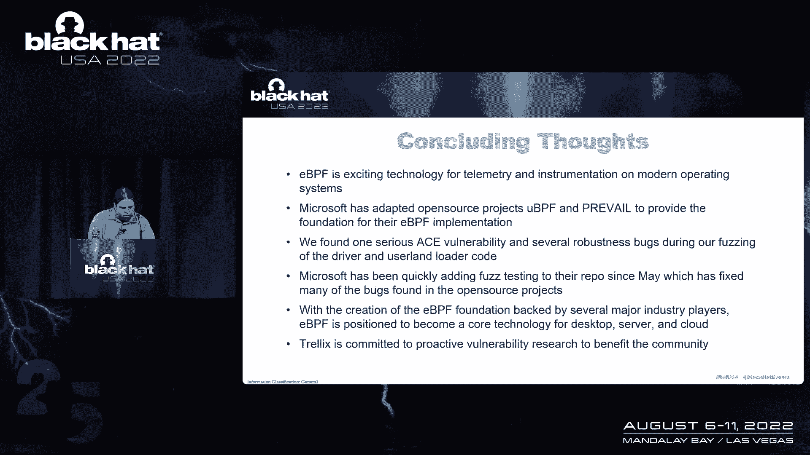

# 课程 P89：eBPF 在 Windows 上的实现与安全研究 🚀

在本节课中，我们将学习 eBPF 技术，特别是其在 Windows 平台上的新实现。我们将探讨 eBPF 的技术栈、安全模型、攻击面，以及如何通过模糊测试和代码审计来发现其中的漏洞。

---

## 什么是 eBPF？🤔

eBPF 是一种虚拟 CPU 架构。它并非真实存在的物理 CPU，而是一个软件模拟的 CPU，类似于 JavaScript 引擎或其他仿真 CPU。它最初设计用于网络数据包过滤，作为 Linux 中伯克利包过滤器的一部分。如今，它已发展为一个更通用的内核模块扩展执行环境。

这是一种在内核中运行代码的方法，代码运行在虚拟 CPU 上，并以沙箱方式进行隔离。你可以使用标准 C 语言编写程序，包含一些特殊的头文件，然后使用 LLVM 将其编译到这个自定义架构中。之后，在 Linux 端，你可以使用传统的系统调用将这些程序加载到内核上下文中，在网络层实现钩子，或转换为代码检测回调。

该系统专为高速网络数据包检测、修改以及连接用户空间与内核函数的能力而设计。这一切始于 1992 年 BPF 被添加到 Linux 内核。如今，它已成为前沿技术。

如果你使用过 `tcpdump` 或 Wireshark，并使用过滤字符串（例如指定某个 IP 和端口），实际上你正在与内核中的 BPF 实现交互。这些过滤字符串在幕后被编译成 BPF 程序，然后这些代码被跳转到内核中执行。这些钩子以高性能方式实现，我们称之为经典的 BPF 实现，专门用于网络过滤。

---

## eBPF 的演进：从经典到扩展 🔄

大约八年前，在 Linux 内核 3.18 版本中，BPF 的概念被扩展为通用的执行环境。指令从 32 位扩展到了 64 位，并增加了使用持久数据结构（如数组、链表或哈希表）的能力。这使得 eBPF 程序能够在监视网络流量或函数执行时，跨不同的调用存储数据。

在 Linux 端，这一切都通过一个名为 `bpf` 的系统调用接口实现，该系统调用包含许多子操作和特性。它的设计类似于一个设备 I/O 控制接口，可以在单个内核接口后隐藏多个命令。

eBPF 的一个独特之处在于它为这些程序实现了一个静态验证器。因为代码被加载到内核中，所以需要增加一些安全保证。因此，不仅有虚拟 CPU 执行环境，还有一个相当简单的静态分析过程，试图确保内存安全和程序在有限时间内终止。

eBPF 的应用包括网络仪表、负载均衡、监控和遥测等。目前，该环境在 Linux 端已相当成熟，有 Go、Rust、Python 和 C 的后端与之接口。最终，它们仍会调用系统调用。

如果你在 Linux 上使用 Microsoft Defender for Endpoint 或 Kubernetes Cilium 等产品，那么你已经在使用 eBPF 基础设施。

过去几年的 Black Hat 大会上，我们也看到了一些关于 Linux eBPF 实现的讨论，关注红队应用。例如，将代码注入可执行文件的能力，用于绊网风格的二进制执行白名单。

---

## 焦点转向 Windows 时间线 ⏳

2014 年，eBPF 被添加到 Linux 内核。截至去年 5 月，微软宣布计划将这一平台引入 Windows。由于 Linux 是 GPL 内核，Windows 无法直接采用其代码，因此必须重新实现整个技术栈。这引入了一套全新的代码，实现了我们在 Linux 端看到并已被广泛采用的功能。

所有迹象都表明，eBPF 将成为未来遥测的通用平台。2021 年，微软宣布实现了两个网络钩子，可以通过 eBPF 程序进行交互。开发者使用完全相同的编译器工具链（LLVM）为这个虚拟 CPU 输出完全相同的字节码。

2021 年 8 月，微软宣布代码已趋于成熟，并添加了约 68 个 API，这些是标准 Linux API 集的一部分，用于执行 eBPF 仪表。2022 年 2 月，他们发布了首个在 Windows 上运行的有效 eBPF 程序实现——Cilium 四层负载均衡器。从去年 5 月到今年 2 月，他们或多或少实现了最小可行产品。

---

## Windows eBPF 架构概览 🏗️

正如前文所述，整个系统都位于 Windows 内核中。从 Windows eBPF 项目的图表可以看出，有几个不同的组件在用户空间和内核中协同工作，以创建这个整体系统。

具体来说，微软采用了两个开源项目：
1.  **rBPF（基于 BSD 许可的 io-visor ubpf 实现）**：这是虚拟 CPU 和即时编译器。
2.  **PREVAIL 静态验证器**：这是一项学术工作，旨在增强静态分析引擎周围的安全保证。

接下来，我们将深入研究这些组件。

---

## 当前执行情况与安全模型 🛡️

在 Linux 上，eBPF 可以钩住用户空间和内核中的函数，以及进行网络检测。在 Windows 上，目前只关注网络堆栈，主要用于云空间、虚拟网络和负载均衡等场景，例如动态重写数据包并将其分发到其他系统。

eBPF 作为一个独立组件交付，并与微软沟通。他们指出，这种交付模型的设计使得在编写这些程序时（它们本质上是内核模块），你无需通过标准的驱动程序签名和验证过程。因此，你有一个更快的适用性模型。

由于这里的代码都是 MIT 许可的，第三方产品（如 XDR 或终端检测与响应平台）也可以使用它，并将其作为整个系统的一个组成部分在 Windows 上工作。

就像使用 Clang/LLVM 后端一样，你编写一个简单的 “Hello World” 风格程序，其中包含一些特殊的 API，允许你执行诸如打印到屏幕或日志等操作。你会看到一个注释显示 `SEC("bind")`，这表明我们将在 ELF 文件中添加一个特殊的部分，其中包含这个特定的函数。

eBPF 程序本身是一个函数，但它们确实有能力相互调用。如果你编译一个 “Hello World” 程序，你会看到生成了一个 ELF 文件。在文本段中，实际上没有零字节大小，但有一个名为 “bind” 的新段，其十六进制大小为 68 字节。这就是我们编译的程序所在的位置。

你还可以使用 `llvm-objdump` 来检查该部分，并在底部看到这个虚拟 CPU 的指令表示。

eBPF 可以实现不同类型的程序，对应于你要利用的钩子类型：
*   **XDP**：在网络栈的最底层，数据包直接从网络驱动程序到达，在真正进入 Windows 内核其他部分之前。在此层实现的 eBPF 程序实际上可以重写数据包，并在操作系统从技术上接收它们之前从盒子中重新发送。
*   **Bind**：允许响应端口绑定、接受和监听的程序。
*   **Cgroup 和 Socket 操作**：与组和套接字操作相关的钩子。

这些 API 允许你与映射交互、创建映射、拉取/存储数据、调用其他程序、查明运行在哪个 CPU 或线程上等。

---

### Windows eBPF 的安全模型

它允许我们在内核中运行未签名的代码。因此，实现中的任何安全模型中断都将是一个驱动程序签名执行绕道，因为我们已经将代码放入内核。如果安全保证无效，我们就可以打破它们，这当然意味着我们在内核中获得了本机代码执行。

目前，Windows eBPF 的实现还非常早期，没有函数指针挂钩，只有基本的网络功能。但正因为如此，对内核对象或 API 本身的处理就成为了攻击目标。

我们必须记住，你必须是管理员才能与此子系统接口。因此，攻击模型或多或少是：内核作为管理员，我们已经可以从内核读取内存。所以，我们真正要寻找的是越界写入或获得完整代码执行的能力。

字节码由 LLVM 生成，然后由静态验证器加载，以确保它没有违反安全保证。在 Linux 端，这部分攻击面对非特权用户可用。在 Windows 实现的源代码中，确实有评论表明，未来其中一些 API 将向标准用户开放。

---

## 核心安全组件：PREVAIL 验证器与 uBPF 🔐

PREVAIL 是静态验证器的名称。它使用抽象解释来进行指针分析等操作。例如，检查你是否对从 API 返回的指针进行了空值检查，然后才能实际解引用它。它内置了所有这些分析，理论上比 Linux 内核中的验证器更健全。

与经典实现相反，eBPF 可以在其他 eBPF 程序中实现循环和尾调用。

uBPF 的有趣之处在于，它可以同时在用户空间和内核上下文中运行（“u” 代表用户模式或用户空间）。这也意味着我们可以利用这个虚拟 CPU 在其他上下文中，而不仅仅是 eBPF 栈。例如，它可能成为 Lua 或 V8 的替代品，或其他地方的 JavaScript 引擎。总的来说，这是一个非常有趣的平台。

---

### 安全保证

1.  **指令限制**：由于是高性能过滤器钩子，每个函数有 4096 条指令的限制。静态分析实际上可以展开循环，并确保程序会终止（旧的停机问题），但因为对执行有限制，它们能够证明它实际上会终止。
2.  **指针安全**：它试图确保当你解引用指针时，它们指向你控制并有权访问的缓冲区范围内。
3.  **返回值检查**：对返回值进行基本检查。
4.  **堆栈指针范围**：堆栈指针在范围内。
5.  **专用内存**：有一个专用的虚拟机内存块来执行所有这些操作。
6.  **未来增强**：服务本身可以在虚拟机管理程序中运行，未来可能集成代码完整性模式。

---

## 攻击面与研究方法 🎯

因为我们是管理员，所以我们希望以管理员身份执行代码。你能做到的第一种方法是：如果加载来自第三方项目的安全模块或 eBPF 模块（例如，从 GitHub 下载并编译 eBPF 程序以在你的系统上收集遥测），这是一种攻击。你将获得用户模式管理员权限。

其次是公开 RPC 端点的可信服务。这是一个受保护的进程，具有高特权，被认为是可信计算基础的一部分。因此，任何漏洞都相当于直接访问内核。

当然，还有静态验证器或 JIT 引擎本身。如果其中任何一个在处理代码时发生越界读取或写入，这将是一个漏洞。还有一个解释器模式，同样的想法。

然后是一个完整的 I/O 控制层，它有自己的处理 I/O 控制请求的实现，然后才与 eBPF 子系统本身接口。

最后是这些钩子本身，它们钩住网络数据包层。这些是抓取数据包准备以及 eBPF 平台可以访问的数据结构的地方。那里发生了一些内存管理，这些钩子本身可能暴露在通过网络数据包攻击的潜在远程攻击面上。

---

### 用户空间 API 集

这包含在 `ebpfapi.dll` 中。基本上，这是用户空间管理员能够加载 BPF 程序、卸载、获取加载内容列表、添加映射、查询系统等的地方。它相当于直接执行系统调用。

它附带两个工具：一个独立的称为 `bpftool` 的工具，以及一个插入 PowerShell 的插件。

为了模糊 API 层，我们知道这基本上是给它一个 ELF 文件、发出叮当声，或者给它一个原始的字节码流，然后将其传递给验证器。我们最终以两种不同的方式模糊了这一点：对 PREVAIL 和 uBPF 独立运行模糊测试一段时间，发现了一些崩溃。我们在 Linux 上独立地对这些组件进行模糊测试的输出，然后通过这些加载器工具在 Windows 上运行它们。

我们发现的第一个重大漏洞是这种方法的结果。它击中了第一个攻击目标：我们发现了一个漏洞，可以通过加载包含此 eBPF 字节码的 ELF 文件来实现远程代码执行或任意代码执行。这个特殊的漏洞会导致堆损坏，它对用户控制的指针进行 `free` 调用。

如果管理员要加载过滤器，然后在该框上执行远程代码执行作为管理员。下面显示的输出显示了一个堆块上有一个损坏的后缀模式。如果我们看看它说腐败地址的位置，我们看到有四个。因此，这种攻击最终将允许你控制空闲指针，这通常不是一个可利用的场景，除非你对内存有足够的控制。

这里有一个小调用堆栈，显示了我们是如何到达那里的。这是在 eBPF 程序的析构函数中的 `free` 调用，它正在处理一系列 eBPF 指令。它只是试图释放所有表示指令的对象。分配发生的方式是由于处理 ELF 文件本身中的重定位项。

所以你生成一个 eBPF 程序 ELF 文件，有一个重定位区。当它被解析时，这是在循环中完成的。因为这是一个 ELF 文件，你可以要求在任意的内存位置，你对内存有很高的控制力。你也有一个循环结构。当它解析这些不同的部分时，你当然可以有多个部分。因此，良好的内存控制与基于循环的解析器相结合，意味着这是一个可利用的类 bug。

---

### 服务层：PPL 进程

这主要实现了一个 RPC 端点，你可以调用一个 API。它的 API 只是验证和加载程序。你传递由第一个 DLL 从 ELF 文件中提取字节码后准备的数据结构，现在已经准备了一个数组或数据结构来保存指令并传递给验证器。

这里可用的攻击面是 PREVAIL 验证器，以及验证成功后最终进行的 JIT 编译。API 很有层次感，所以有几个 API 调用可以让你达到相同的点。无论你使用的是 DLL 还是 RPC API，它们都调用同一个 API 调用。所以当我们对 DLL 进行模糊测试时，实际上也已经通过 RPC 端点进行了模糊测试。

我们对这些组件单独进行了模糊测试：PREVAIL 验证器和 uBPF。

**PREVAIL 验证器**：你可以去看看论文。这是一个多项式运行时的 eBPF 验证器，使用抽象解释层。这真正意味着他们用了很多数学来尝试进行指针分析。它可以在 uBPF 方便的任何地方使用，并附带一个独立的验证工具。我们利用 AFL++ 对它进行了模糊测试，发现了一些崩溃。

**uBPF**：uBPF 可以在解释模式或 JIT 模式下运行。uBPF 没有实现任何映射或辅助函数，它只是一个纯虚拟 CPU。所以我们真的只是想越界读取或写入虚拟 CPU 环境之外的内容。

如果我们模糊解释模式，又发现了一些崩溃。在 JIT 模式下，它变得更加疯狂，出现了各种可利用的崩溃。但事实证明，围绕这一点的启发式方法并不那么好。

当我们发现所有这些 bug 时，我并没有把它们都提交给这些开源项目，因为首先，我还不知道这些最终会进入 Windows；其次，因为很多都是低级问题。最终，我在等待一个在有意义的上下文中使用 CPU 的更重要的项目。

这是我们在 uBPF 销毁中显示的一个漏洞：当它试图终止程序时，它正在释放虚拟机，在这种情况下指针已损坏。

这些组件位于这个 eBPF 服务中。我们用 WTF 来模糊这两者，但实际上，一旦我们到了这个组件，微软在 6 月份的某个时候开始做他们自己的模糊测试，最终 bug 无法到达或已经被修补。所以 eBPF 服务本身，PPL 服务结果相当干净，就可利用的 bug 而言。

---

### 内核驱动程序 I/O 控制接口

最后，我们想切换到发现这个内核驱动程序公开了什么，因为那真的是一切最终都会结束的地方。它公开了一个 I/O 控制接口。此设备对象上的调度确实需要管理权限。所以我们在寻找未签名的代码执行，理想情况下，通过 I/O 控制公开的接口，允许你解析函数、映射和加载程序，获取下一个程序 ID，与环形缓冲区和数据结构交互等。

这是大多数有趣的攻击面存在的地方，因为它在内核上下文中。我们不能使用简单的 AFL 风格的方法或交叉模糊测试，我们真的需要想出另一种方法。

在这种情况下，我们利用了名为 WTF Fuzzer 的工具。这个模糊器的工作方式是：我们从内核调试器获取完整操作系统内存的快照，将其写入磁盘，然后有一个组件使用 Bochs（x86/x64 模拟器）——这是一个基于仿真的快照模糊器。最终，这允许我们在我们想要的任何功能（无论是用户空间还是内核）的入口点设置断点，并替换传递给这些 API 的缓冲区的内容，进行我们的模糊测试。

这样做的另一个好处是它是分布式的。你可以运行一个服务器，它使用 TCP 套接字通过线路进行通信，从客户端实现一个线束。你或多或少只需要编写三个函数：插入测试用例的、将新模糊的数据移动到内存快照中的缓冲区，然后进行一些初始化，用于捕获交换上下文的调用，或其他要修改的函数，或者你只是想强制终止你的模糊会话。

由于时间有限，这只是对 WTF 作为内核模糊处理的强大工具的简要介绍。你得自己去看得更远一点，但最终它附带了一个演示模糊器，能够完成类型-长度-值网络模糊化，使用多个数据包。

我们修改了它，这样就不用钩住网络套接字，我们钩在设备下面的控制文件 API。你将在调用堆栈中看到，最终从你通常调用设备的用户空间 I/O 控制，它通过几层，直到你到达内核侧处理程序。我们每次迭代替换这些缓冲区的内容。

然后我们不得不使用基于 JSON 的序列化格式，可以容纳多个 I/O 控制请求。所以我们在这里的全部目标是能够一次处理一打 I/O 控制，操纵相同的映射或程序，查找各种漏洞类。最终，我们序列化 I/O 控制数据缓冲区的内容，并在其周围添加一点元数据，以便重新执行那些请求。

当我们运行 WTF 客户端时，它看起来是这样的。左手边是迭代号，它覆盖了多少块。这里每个客户端的执行频率相当低，大约每秒 15 到 20 次执行，但那是因为我们要一次发送多达十个 I/O 控制请求。所以我们在内核中激活了很多行为。如果你只做一个，它可以快十倍。当然，我们可以在许多 CPU 上扩展它。

所以我们最终使用了大约 40 个核心，在服务器端每秒执行 300 次。当你初始化它的时候，它启动并向你显示它开始接收来自客户端的信息。最终，我们要寻找保存为崩溃的输出，然后我们可以重播和测试。

---

### 内核驱动程序模糊测试结果

我们的内核驱动程序模糊测试的结果确实出现了几次崩溃。不幸的是，其中大部分是健壮性检查层崩溃。因为你已经是管理员了，所以我们确实有越界读取访问违规。当然，这会破坏系统并导致内核恐慌。在一天结束的时候，你知道你已经是管理员了，所以从技术上来说，如果你想，你可能会关闭系统。

但这是调用堆栈。正如我提到的，eBPF 核心调用协议处理程序，我相信这就是我们在数据中喷出的地方。

还有一个是 uBPF 销毁 API。这是我提到的我在用户空间发现的相同的 bug，但这里它存在于内核中，因为内核里面有 JIT 引擎，或者里面有解释器。因此，相同的代码既存在于用户空间，也存在于内核中。因此，这取决于你如何与 API 接口，你可以在用户空间或内核中触发这些 bug。

总的来说，我们在这里的目标是：如果我们能找到可利用的 bug，那就很好。我们做到了