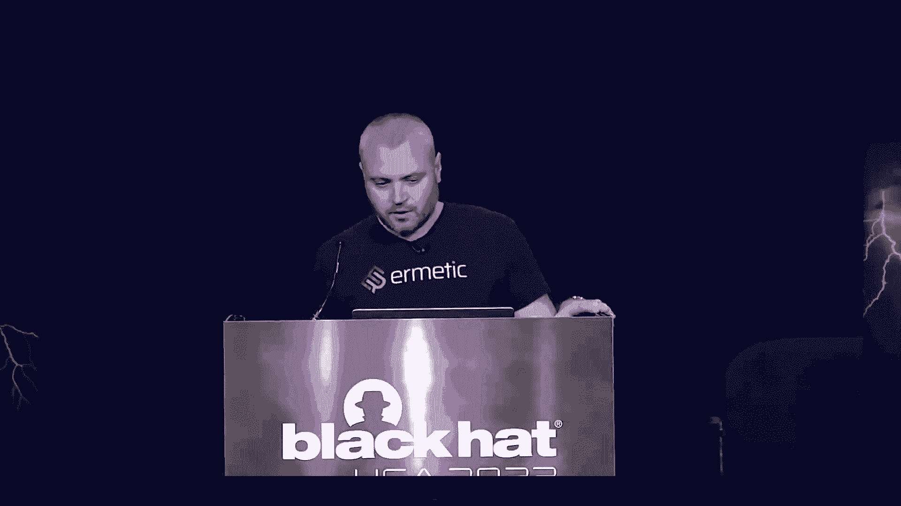

# 课程 P9：009 - IAM 敲门人 👤🔐

在本课程中，我们将学习云基础设施中的身份与访问管理核心服务。我们将探讨不同云服务提供商在IAM实现上的关键差异、潜在的安全风险，以及防御者可以采取的改进措施。

---

## 概述

我是服务是控制对云资源每一次访问的网关，必须受到保护。本课程将主要关注多云环境中IAM的潜在风险，浏览不同云基础设施之间的主要差异，并讨论那些所有供应商共享的结构性薄弱点。

---

## IAM 基础概念

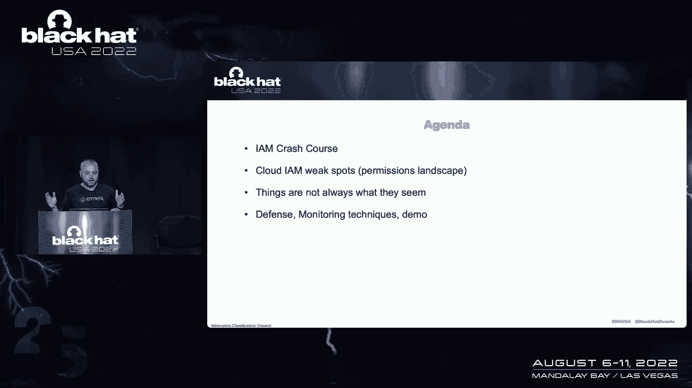

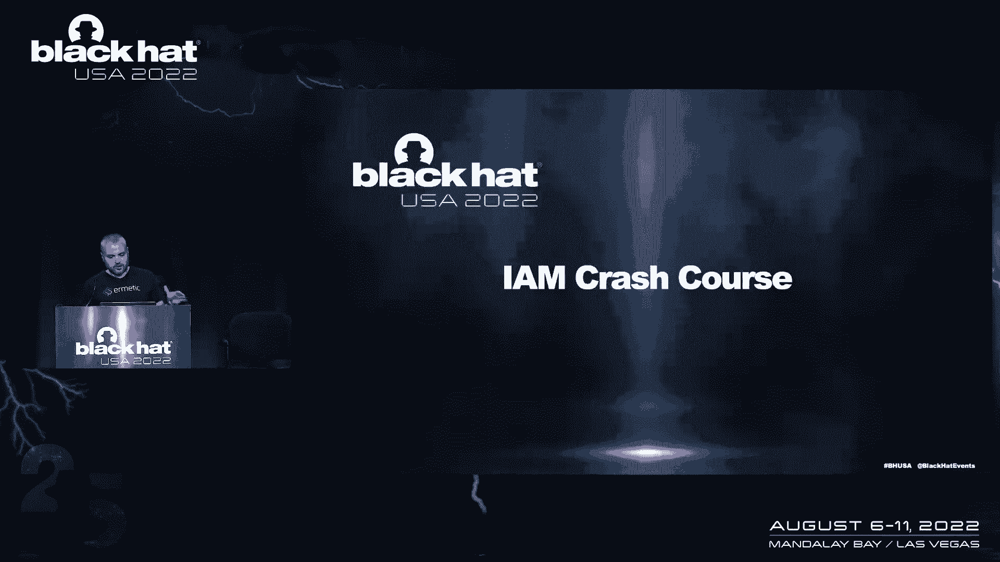

上一节我们概述了课程目标，本节中我们来看看IAM的基础构成。

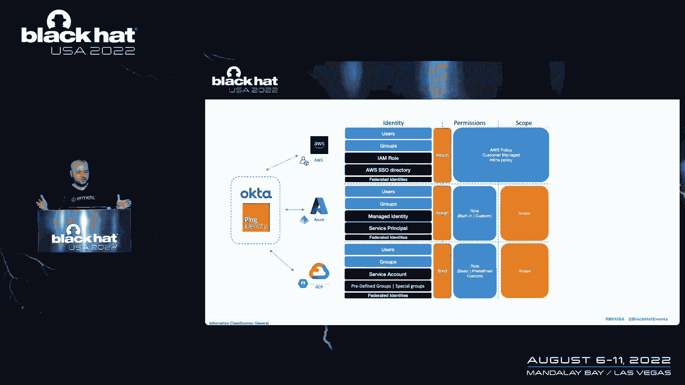

IAM由身份和权限文档组成。身份是任何可以根据IAM服务进行身份验证的实体。权限文档定义了谁可以访问什么以及在什么条件下访问。

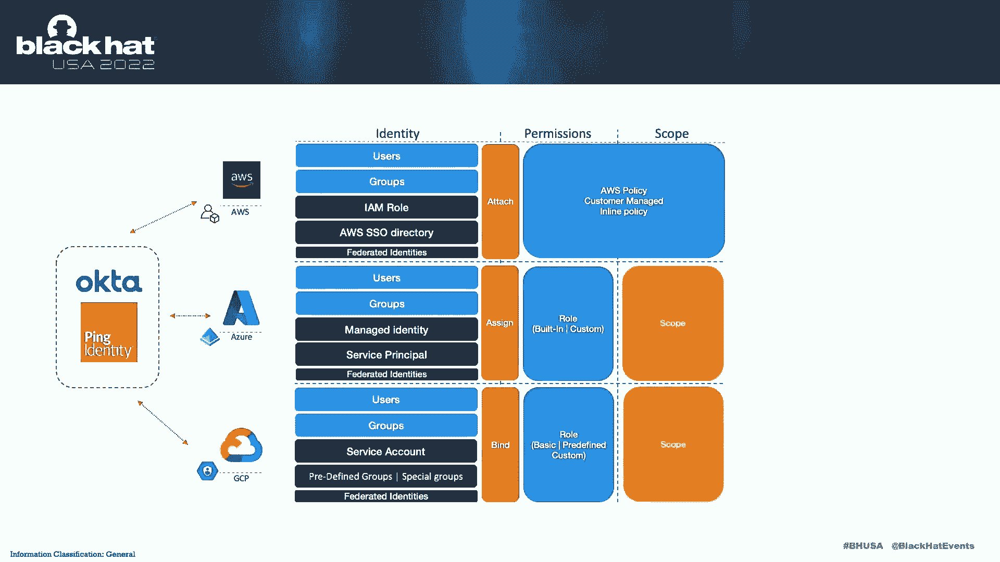

每个云提供商都有自己独特的身份类型，但也共享一些通用类型，例如用户和组。此外，还有一些代表所有经过身份验证的用户或项目捐助者的特殊实体类型。

身份可以分为两个主要类别：
*   **人类身份**：例如云账户的用户。
*   **非人类身份**：例如服务账户、托管身份，这对云安全至关重要。

权限文档通常以JSON格式存在，并与身份进行关联。这个关联操作有时被称为“附加”或“绑定”。

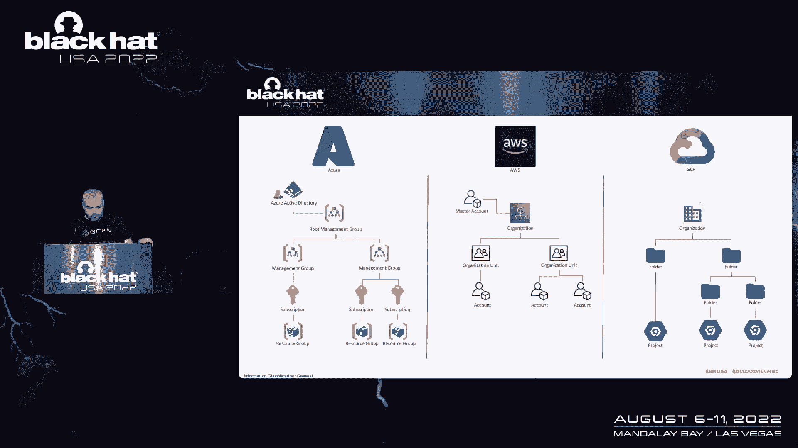

---

## 主要云提供商的IAM差异

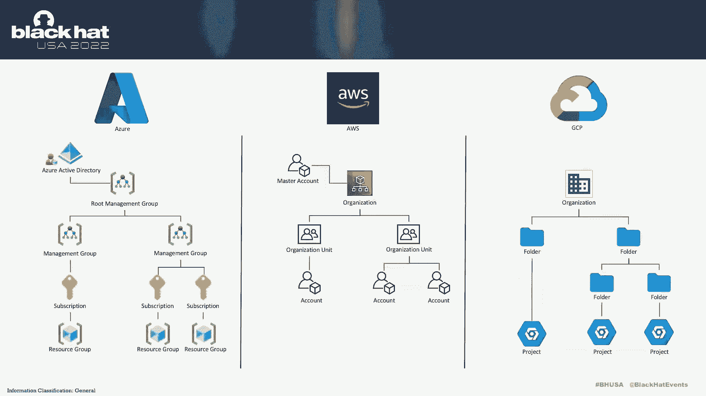

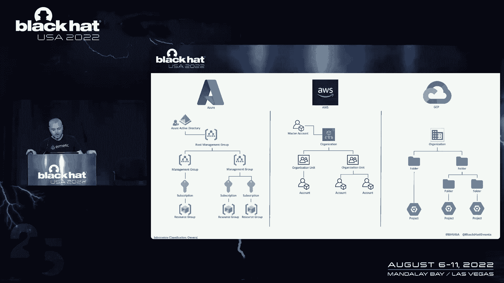

了解了基础概念后，本节我们来看看三大云提供商在IAM实现上的主要区别。

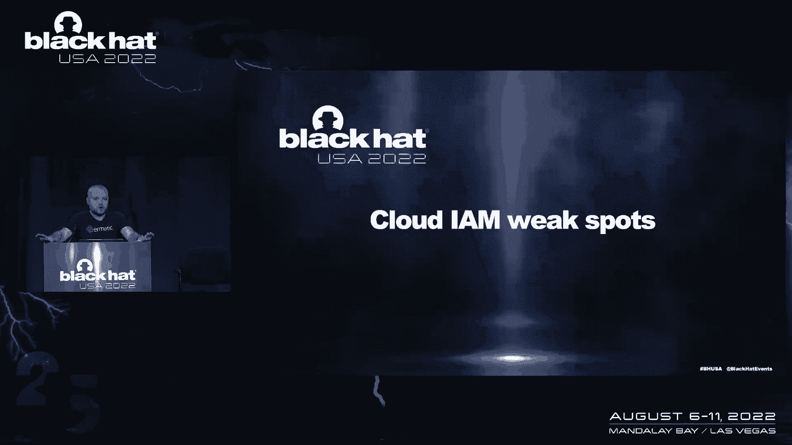

第一个主要区别在于**访问模型的作用域限制**。
*   **Azure** 和 **GCP** 允许将权限文档的效果限制在特定范围（如资源组、项目）。
*   **AWS** 的作用域定义方式则大不相同，通常基于策略本身内的字符串操作，限制性更强。

第二个主要区别是**访问模型的基础**。
*   **AWS** 的访问模型在很大程度上基于身份策略。
*   **GCP** 和 **Azure** 是身份策略和具有完全管理功能的扩展身份提供程序的混合体。

此外，AWS有一个称为“单点登录”的服务，它本质上是一个迷你目录，可以更方便地管理对多个账户的访问。

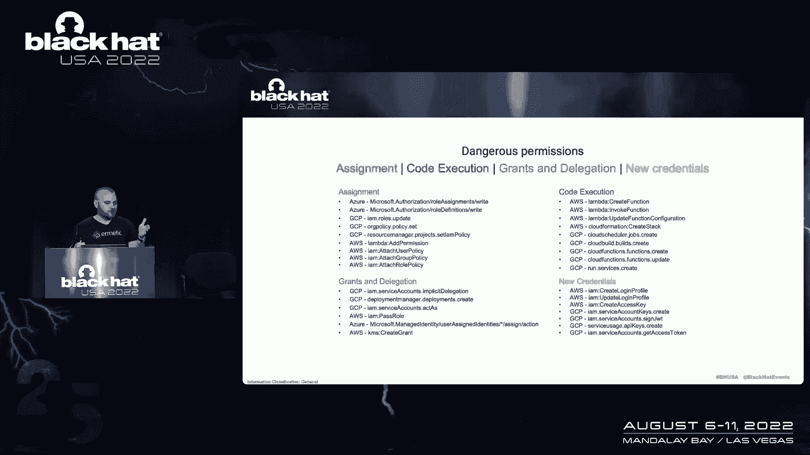

---

## 云资源组织结构

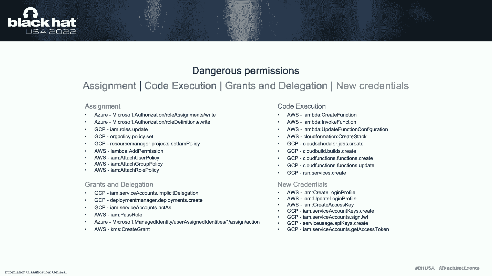

上一节我们介绍了IAM模型的差异，本节中我们来看看云资源的典型组织结构。

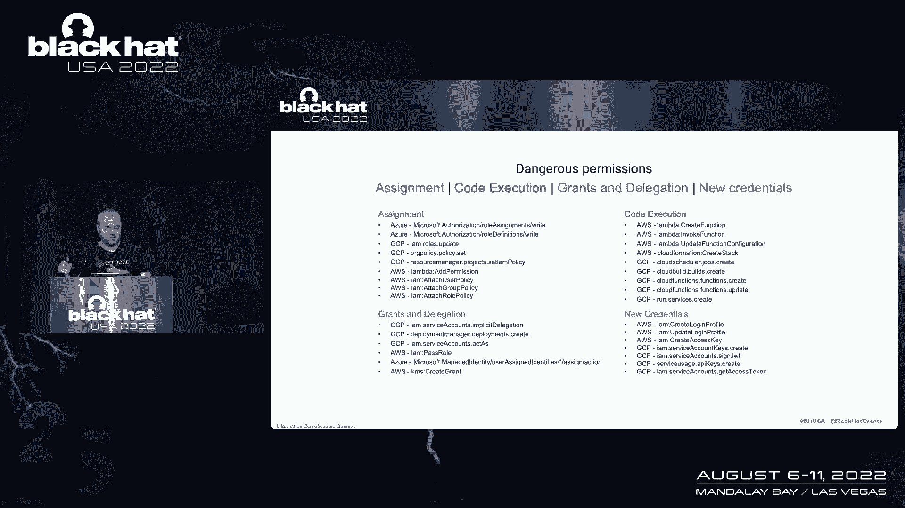

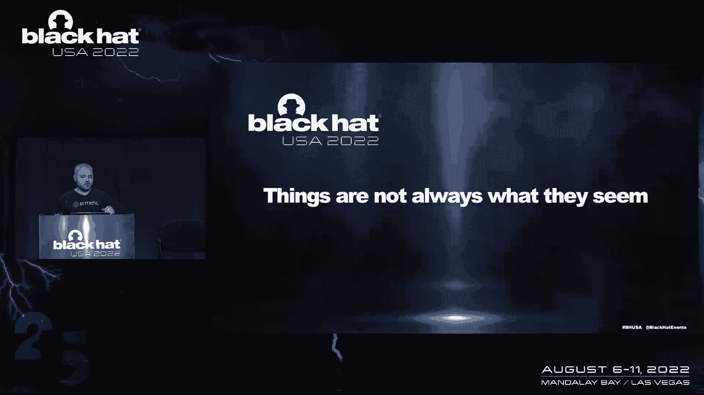

所有云提供商都允许以类似的方式在某种资源容器中组织资源。
*   **AWS**：基本容器是“账户”，可以组织到组织单元中。
*   **GCP**：基本容器是“项目”，可以组织到文件夹中，最终形成组织资源。
*   **Azure**：基本容器是“资源组”，每个资源必须至少属于一个资源组。

作用域限制的差异也影响了资源组织结构。Azure和GCP使用组织结构中的容器来限制访问作用域，而AWS的作用域则是在策略中定义的。

---

## IAM权限的重要性与风险

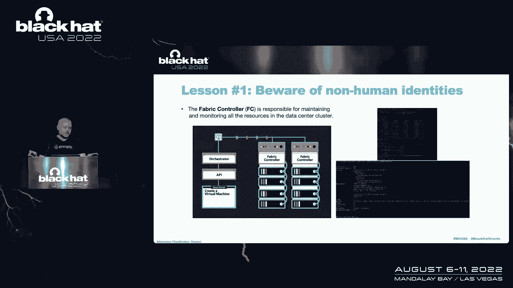

理解了组织结构后，本节我们深入探讨为什么IAM权限如此重要且风险极高。

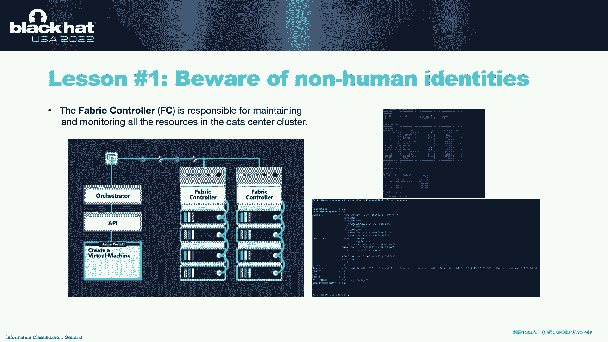

IAM基础设施使用数千甚至数万种不同的权限。攻击者通常只关注管理权限，并需要满足以下条件：
1.  访问暴露在互联网上的IAM服务。
2.  一个有效的安全上下文（如受损的凭据或令牌）。
3.  附加了足够权限的文档。

攻击者感兴趣的特权操作可以分为以下几类：

以下是攻击者可能利用的几类特权操作：
*   **分配操作**：例如，将身份分配到新组。每个云提供商都有独特的、可能被滥用的分配权限。
*   **执行权限**：例如，创建或修改无服务器函数以执行代码。
*   **创建新凭据**：这是持久化的经典技术，每个云提供商都有多种允许创建或编辑凭据的权限。

---

## 非人类身份的管理与风险

上一节我们讨论了权限风险，本节中我们聚焦于一个关键部分：非人类身份。

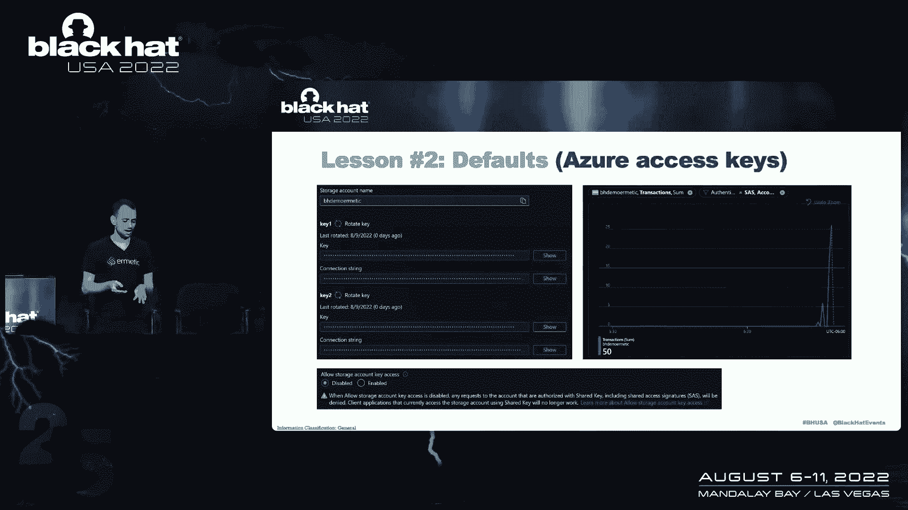

非人类身份是现代云基础设施的关键部分。它们允许工作负载进行身份验证，而无需在应用程序中存储秘密，这本身是一种安全增强。

每个云提供商都有自己的非人类身份实现（如AWS的IAM角色、Azure的托管标识、GCP的服务账户）。其核心流程是：工作负载发送一个HTTP请求以获取令牌，唯一的限制是请求必须来自该工作负载内部。

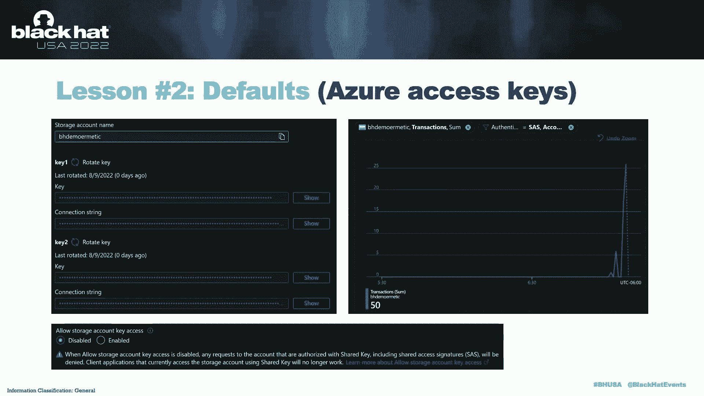

然而，如果管理不当，非人类身份会带来新的风险。例如，如果攻击者拥有足够的权限，他们可以启动新实例并为其分配高特权角色，从而升级权限。

此外，还有**混合/托管身份**，它们将云中的托管身份附加到本地数据中心的机器上。这些身份的长期秘密存储在本地机器上，如果这些机器被入侵，就会带来风险。

---

## 默认配置：攻击者的朋友？

讨论了特定身份的风险后，本节我们来看看一个普遍问题：默认配置。

默认配置有时会成为安全弱点，因为它们的固有特性是普遍且宽泛的。我们需要理解不同云服务提供商对默认配置的不同处理方法。

**AWS 管理策略**
AWS管理的策略是由AWS拥有和管理的JSON策略文档。由于AWS不知道你账户中资源的具体名称，这些策略的资源字段通常使用通配符（*）。这可能导致一些听起来无害的策略（如`ReadOnlyAccess`）实际上授予了对账户中所有资源的读取权限。

**Azure 默认角色与访问密钥**
Azure倾向于使用默认角色，但选择合适的角色可能很困难。此外，创建存储账户等服务时，会默认生成一对**访问密钥**。这些是永久性凭证，可以直接绕过整个IAM系统来访问数据，且很难被禁用，因为Azure内部可能也在使用它们。

**GCP 基本角色与默认服务账户**
GCP有基本角色（查看者、编辑者、所有者），这些角色权限广泛。默认情况下，为许多服务创建的服务账户会被授予这些基本角色（通常是“编辑者”）。如果为计算引擎实例分配了具有“云平台范围”的默认服务账户，一旦该实例被入侵，就可能导致完整的账户接管。

---

## 日志记录的局限性

在讨论了配置风险后，本节我们转向另一个关键防御层：日志记录。我们需要理解其局限性。

我们依赖日志来了解情况、进行检测和事件响应，也用于构建更精确的权限（遵循“使用或失去”原则）。如果日志不完整，我们就无法安全地移除未使用的权限，导致权限蔓延。

日志的局限性包括：
*   **成本**：某些数据操作日志可能非常昂贵。
*   **未记录的API**：某些API操作可能不被记录。例如，AWS中可以通过特定的S3复制操作进行跨账户数据泄露，而源账户不会记录此活动。
*   **日志分布**：在Azure中，日志是分布式管理的，需要手动整合，这可能导致日志遗漏。
*   **日志操作本身**：攻击者可能试图删除或篡改日志以掩盖踪迹（例如，AWS CloudTrail日志摘要需要用户主动验证）。

在多云环境中，日志管理的复杂性呈指数级增长，因为需要处理不同的日志模式、格式和含义。

---

## 防御措施与最佳实践

在了解了诸多风险后，本节我们来看看防御者可以采取哪些措施来改善安全状况。

**1. 限制错误的影响范围**
*   理解并正确使用每个云平台的安全边界。例如，AWS账户是一个相对强大的安全边界，而Azure资源组只有在正确配置权限的情况下才是安全边界。
*   利用组织级策略（如AWS的SCPs、Azure的Azure Policy、GCP的组织策略）来全局性地限制高风险操作。

以下是几个组织策略的实践示例：
*   在AWS中，拒绝根账户访问，拒绝删除CloudTrail跟踪。
*   在GCP中，禁用自动为默认服务账户授予IAM权限的行为。
*   尽可能避免使用永久性凭证，并保护人类身份。

**2. 权限构建策略：黏土雕刻法 vs 大理石雕刻法**
*   **大理石雕刻法**：从一大块宽泛的权限开始，逐步削减。挑战在于难以确切知道需要移除哪些权限，容易导致权限过度保留。
*   **黏土雕刻法**：从零开始，逐步添加所需的最小权限。挑战在于开发初期难以确定所有需要的权限。

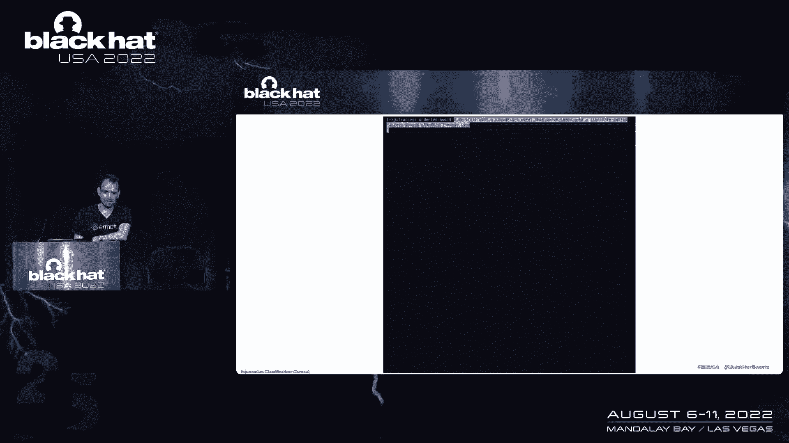

推荐采用**混合方法**：不要从最宽泛的权限块开始，而是尝试使用较小的权限模块进行组合，这样即使没有精细调整，风险也相对可控。避免因为权限被拒绝信息不明确，而直接添加过大权限块的行为。

**3. 利用工具辅助**
使用工具来帮助分析权限、模拟访问和清理未使用的权限。例如，可以使用工具分析CloudTrail中的“拒绝访问”事件，精确找出需要添加的权限，避免盲目授权。

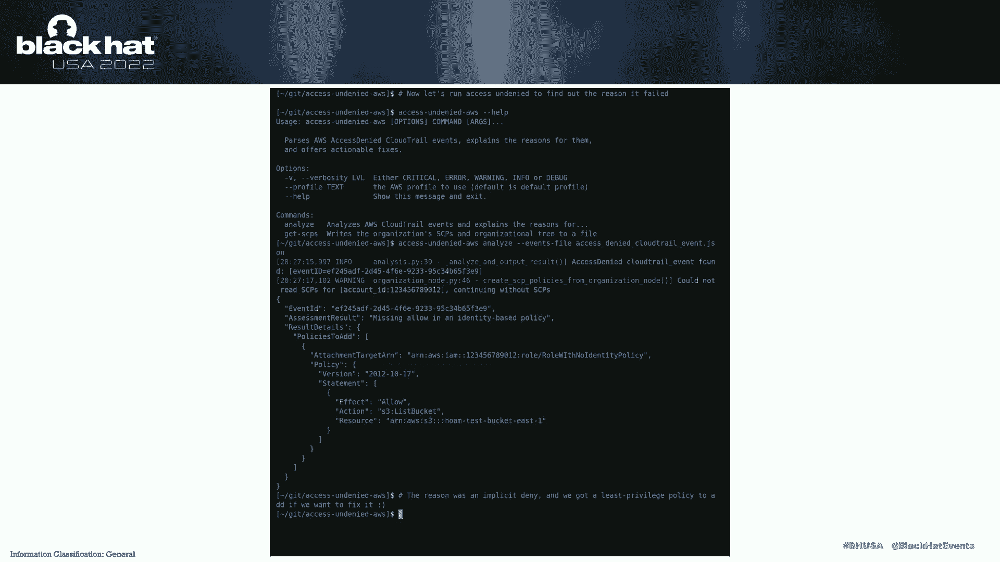

---

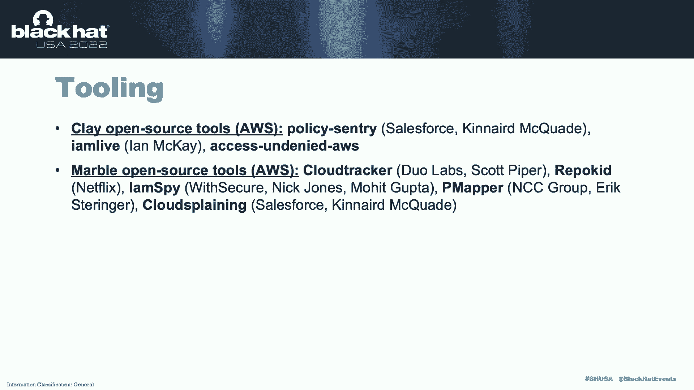

## 总结

在本课程中，我们一起学习了多云环境下身份与访问管理的核心知识。我们探讨了不同云提供商在IAM实现上的关键差异，分析了包括非人类身份、默认配置和权限模型在内的各种安全风险点，并了解了日志记录的局限性。最后，我们讨论了通过限制影响范围、采用合理的权限构建策略以及利用辅助工具来加强安全态势的实用方法。保护IAM这一云资源的访问网关，是确保云安全的基础。