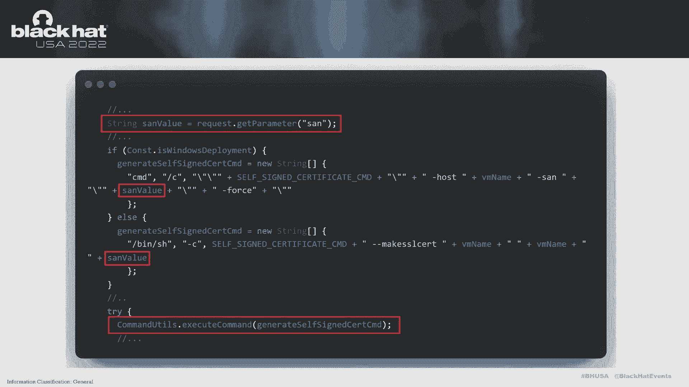
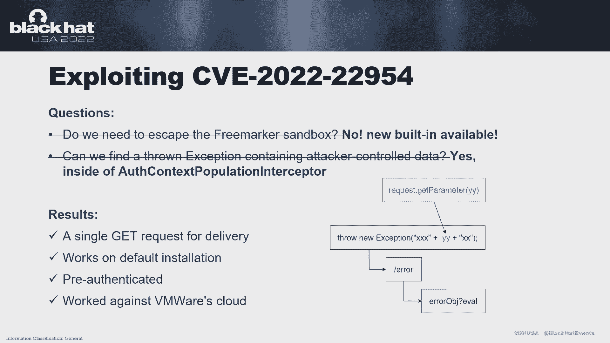
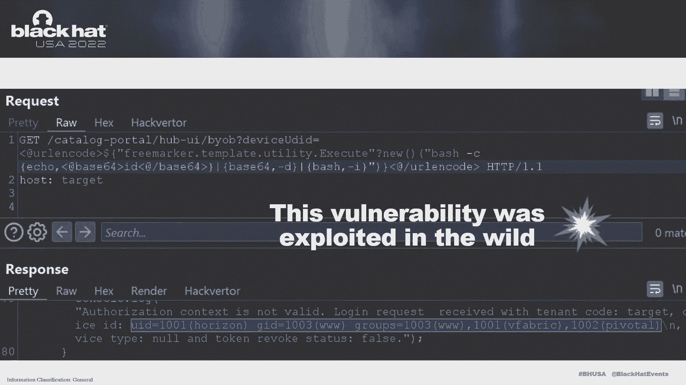
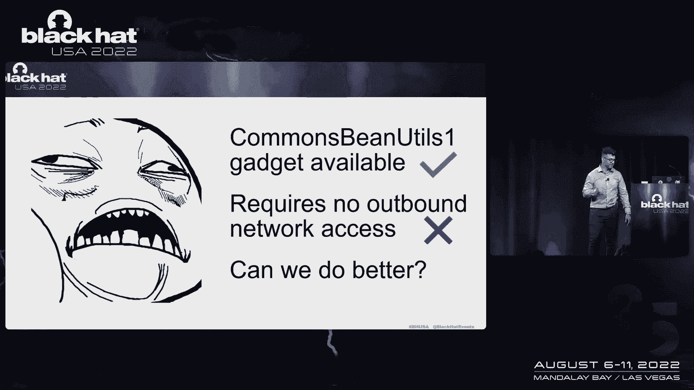
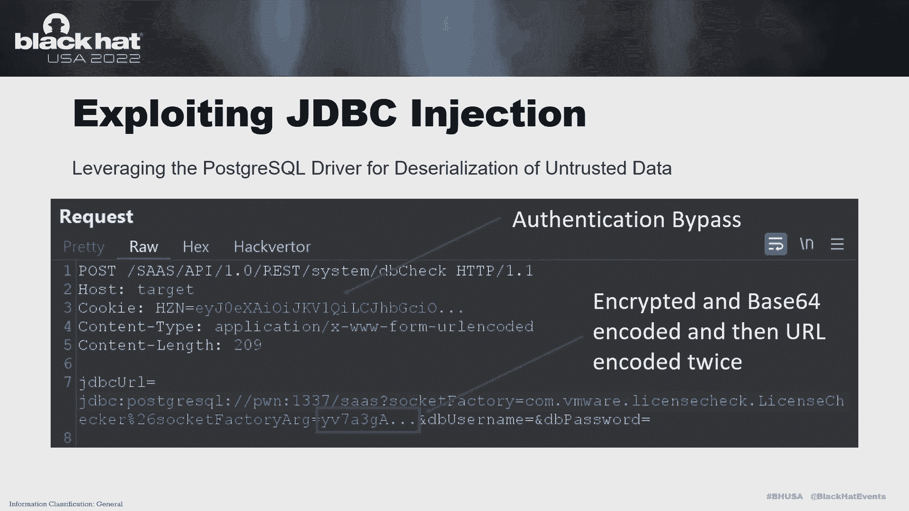
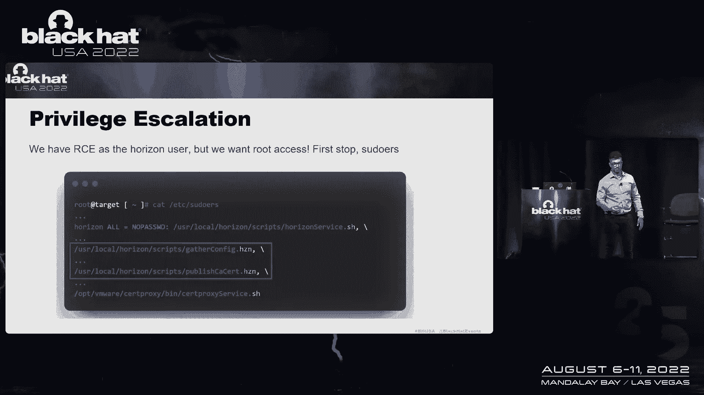
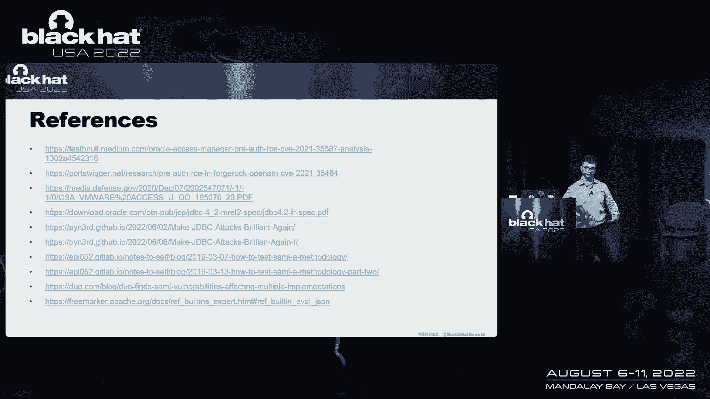

# 【转载】Black Hat USA 2022 会议视频 - P10：010 - I Am Whoever I Say I Am： Infiltrating Identity Providers Using a 0Click Ex - 坤坤武特 - BV1WK41167dt

谢谢你来听我的演讲，嗯，我是谁，我说，我稍微改变了标题，包括了功绩的S，关于我是谁的一点背景，我是360的安全研究员，作为脆弱性研究所的一部分，呃，我还开办了一个培训班，所以如果你喜欢这个演示文稿。

请随意查看，呃叫做全栈网络攻击，我在过去的一些会议上讲过话，也接受过那些，其中一些会议，在过去，我已经发现了超过一千五百个高影响或严重的漏洞，去年和前年我都玩过PTO，所以我们要讨论今天的议程。

首先是什么是身份和访问管理。

然后我们将研究身份验证，更高级别的授权，然后我们将快速讨论一些过去对其他解决方案的攻击，我是Oracle访问管理器等解决方案，锻造，岩石，打开AM和VMware工作区，一次访问，我们将进入。

我们将在本演示文稿中讨论的bug的发现，以及其中一些的开发过程，然后我们将讨论一些结论和要点，所以让我们先覆盖一下，什么是，我是，它是将身份和访问管理集成到一个单一的解决方案中，所以你有身份。

一方面是认证，也就是验证，那就是，我是，不管是谁，我说，我是，我向系统提交全权证书，系统验证这些凭据，这通常是通过密码身份验证来完成的，或联邦身份验证，例如单点登录技术，通常。

主要用于单点登录技术的协议是samul或安全断言，标记语言，另一方面，有访问或授权，它是特权或权限的验证，对于已经经过身份验证的用户，通常来说，用于此的协议是开放的，授权或宣誓，该协议通常在使用。

另一种结合该技术的协议，称为Java Web令牌，所以我真的是攻击者的主要目标，对呀，你有，这是一个，它是一个技术栈，包括身份验证，授权，它必须暴露在外围，特别是对于Oauth组件。

它有一个复杂的技术栈，使用几种身份验证协议和授权协议，和这些系统中的其他几个组件，所以违反我是解决方案，嗯是真的很关键的权利，因为它有钥匙，王国的所有钥匙，基本上对一个组织来说。

这些是从系统中窃取的凭据，或者那些重新伪造的令牌，可以对其他系统重播，外露，攻击可以进一步进入网络，更多的信息可以被窃取，诸如此类的事情，所以你一方面有身份另一方面有权限，并组合成单个安全解决方案。

卖给很多机构放在周边，因此，让我们进行高级联邦身份验证，第一步，用户通过服务提供者发出资源请求，第二步，服务提供者将请求重定向到标识提供者，第三步，然后，用户向标识提供程序发送身份验证请求和资源。

这两种类型的请求，第四步，标识提供程序验证身份验证请求，并发回签名响应以确保数据完整性，将响应签名折叠到服务提供者，最后，服务提供商验证用户是否被授权，它授权访问该说话资源。

并返回带有原始资源请求的响应，好的，就像我说的，另一方面，申请批准，你现在有一个二，这有点不同，因此用户已经经过身份验证，并且应用程序向该用户请求权限，以授予对特定资源的访问权限。

这通常是通过一个弹出框来完成的，比如说，用户说，好的，我授予该应用程序访问资源的权限，然后申请获得资助，并将其发送到授权服务器以获得访问令牌好的，最后，该访问令牌用于获得对资源的访问权，自然地说。

所以我们这里有一些有趣的点，对于身份验证通常只在服务器端进行--显然是对的，和授权结合了客户端和服务器端组件的混合，所以为了认证，对于塞缪尔来说，存在明显的XML税。

因为Samul是基于XML数据结构的，因此，您有令牌传递漏洞，如外部实体注入，呃，服务器端请求伪造，您还可以完全在系统中触发丢失的验证，例如，您可以对系统进行身份验证，他们根本不验证签名，因此。

您可以完全通过签名响应对系统进行身份验证，但也有绕过签名验证的能力，在某些情况下，使用XML签名包装或XML规范化，嗯，但这些类型的漏洞是，嗯，已经过了差分类型的bug，因此。

它们要求攻击者获得已经存在的示例响应，分配样本响应，所以这可以通过信息披露，也可以通过已经对系统进行身份验证，作为低特权用户，比如说，所以我尽量避免对这些类型的漏洞进行审计。

尽管它们仍然对这些类型的授权系统有很大的影响，你有喜欢，我说，客户端类型的攻击，所以你可以有一个想法，下面是访问访问令牌的步骤，攻击者可能使用某些客户端类型的攻击来泄露授权代码。

或通过跨站点脚本的访问令牌，跨站点请求伪造，打开，重定向，或者点击劫持，我们已经在，在野外做的，也是虫子赏金的一部分，这或多或少是账户接管，风格，类型，脆弱性，对呀，所以现在让我们来看看过去对，我是。

解决方案，呃，我们将研究的一些产品是Oracle访问管理器，甲骨文的旗舰，i是解决方案，并与Oracle或Web逻辑应用服务器捆绑在一起，这实际上是一个独立于甲骨文身份管理解决方案的产品。

然后你就打开了锻造石，它最初被称为Open所以Open AM是Open的一个分支，所以它是由福特德罗克的开源项目维护和开发的，但后来在2016年他们创造了一个锻造岩石我从开放所以，它变成了一个闭源产品。

话虽如此，尽管代码基础非常相似，即使有六年的发展差异，最后我们有了VMware工作区一次访问，它以前被称为VMware身份管理器，是VMware的旗舰解决方案，对市场来说相对较新。

但它仍被几家财富500强公司使用，并有一些技术债务，当然啦，所以我们要看的第一个bug是CV221，三个，五个，五个，八十七，这是对不可信数据的反序列化，它是预先认证的，基本上没有任何限制。

它允许RC对抗OEM 11G的系统，但在生命结束的时候，当这个虫子被报告时，但它也适用于OEM 12g，这不是生命的终结，但它在最新的OEM 12G补丁上不起作用，这是因为Oracle删除了端点，嗯。

由于一些代码重构，他们实际上并不知道漏洞，嗯，所以基本上甲骨文真的没有什么可以做对的，所以这是一个有趣的看到，就像是结束的一天，一天的弱点或者半个零天，然后是cb 2 1 3 5 4 6 4。

这是另一个不受信任的数据在锻造岩石开放上午，这很有趣，因为它是在第三方组件中，与实际原始代码库分开的第三方库，我们可以在这里的代码中看到，该漏洞来自获取参数j do页面会话，传给了六十四垒。

基本上解码了，并传递给反序列化函数，漏洞的局限性也是没有的，并允许进行预身份验证的RCE，它被锻造岩石修补的方式，在他们的AM解决方案中，是通过删除易受攻击的库J到，很久以前由太阳微系统公司开发的，嗯。

但有趣的是，它也是在开放的AM中修补的，和补丁呃，你可以看到那里，向前看，呃，白名单反序列化，检查，呃，那里有危险的阶级，让我们看看列表中的第三个漏洞，呃，这是CB220，呃四十六，这非常有趣。

因为这影响了VMware工作区的一次访问，这是一个命令注入，它通过生成和安装自签名证书功能来实现，而且很简单，实际上，当您查看代码时，很明显，但我想对这个漏洞提出的有趣的一点是，它来自这个沙子参数。

它嵌入在Linux或Windows中的命令字符串中，所以如果软件部署在Linux或Windows上，命令注入会起作用，在这两种情况下，他们都使用了命令shell，所以你不需要做任何额外的争论。

对命令注入中针对的特定二进制文件的攻击，您可以使用shell来获得远程代码执行。

但我注意到这个漏洞的额外有趣之处在于，它实际上在20世纪20年代就在野外被开发了，最重要的是，它实际上需要作为管理员用户进行身份验证，它还需要进入端口八四四三，这是一个通常不在系统上公开的管理端口。

它也有CSR代表保护，这意味着攻击者不能在客户端风格的攻击中使用它，他们不能通过电子邮件或类似的方式传递，他们实际上需要从客户机到服务器利用它，所以他们需要有证书，基本上，如果我们简单地看补丁。

vmware构建了一个名为输入验证utils的类，并且里面有一个名为有效的方法，他们只是用Rex字符串做了一个白名单或允许列表检查，它非常坚固，足以阻止攻击，所以让我们来看看目标选择和漏洞发现。

所以你可以想象，我发现VMware工作区很有趣，因为它在外表上有20世纪20年代的脆弱性，在野外爆炸的，它也有一个没有预先认证的RC的历史，所以这对我来说超级有趣，它有一个系统的单点故障。

它在系统内部有相同的复杂协议或网络协议，然后呃，他们有很多技术债务，嗯，主要来自三密码，所以这个软件最初是由三密码机开发的早在2010年，所以我们也有一些技术债务，所以让我们来看看我是如何发现22的。

二二九五四，挺有意思的，我在测试一个API端点，只是用一些半列，我被扔了一个500英镑的错误，作为一个普通的宠物，或者我觉得这很有趣，所以我想进一步挖掘看看服务器的回复。

我得到了这个堆栈跟踪和这个错误消息，说这里有一个，不是阀门吗，它是在这个模板里面的，自定义错误，我们在那里有一个堆栈跟踪，它提到了自由标记，所以我把一两个放在一起。

我意识到我想我在这里得到了一个模板注射，我以前从来没有看过模板注射，所以我觉得这很有趣，嗯，真正的错误归结为，使用自定义错误TL脚本中的阀门，嗯，潜在的攻击控制数据可能会进入那个阀门。

所以经历了一点春天，从一点点后退，好好思考，这是如何表现出来的，这个错误是如何产生的，我决定看看Spring是如何处理错误的，我发现Spring允许开发人员映射错误，并将其设置为默认错误处理程序，因此。

每当在应用程序中引发异常时，它会跳转到斜杠错误，呃控制器，控制器内部的处理程序，它将尝试优雅地处理这个错误，对，看代码，我发现你是类UI错误控制器，有错误映射，所以我在那里设置了一个断点。

我看到它达到了几个不同的功能，它首先到达获取错误页面函数，然后最终到达处理的泛型错误，然后处理一般错误，最终返回自定义错误FTLS页和该页内部，在返回该页之前，它使用错误消息设置错误对象。

它潜在地控制了我们包含的注入的绳子，所以我在错误处理程序上设置了断点，我知道我在开玩笑的错误信息，对呀，我打了半电话，我看到了错误消息，我想得很好，我如何找出这个错误消息的正确位置，这是从哪里来的。

所以我很自然地决定在系统或代码中搜索异常流，最后我在弹簧核心里发现了一些有趣的代码，我发现弹簧芯里面有倒置的四点二点四，默认情况下，它们启用严格的惠普防火墙，这或多或少像是一个内部Web应用程序。

Spring框架内部的防火墙或内部WA，它们检查请求中的特定恶意字符串，特别的，呃，传递危险的参数之类的东西，这或多或少是一种美化的否认者，是的，他们假设开发人员不需要分号，不需要特定的字符编码。

诸如此类的事情，我们看到它肯定击中了这个异常消息，请求被拒绝了，因为等等等等，这是我触发bug时得到的相同错误消息，所以我不得不后退一点，我不得不给它一些时间，让它沉下去，我决定在谷歌上搜索一下。

我发现了这个堆栈溢出的帖子，解释了这个问题，它真的归结为以前，呃，自由标记，两点三点三点一，开发人员将使用阀门传递JSON字符串，在两点三点三点之后，自由标记的一点，他们揭露了一种叫做阀门的方法。

强调JSON，这是一种更安全的处理字符串的方法，把它传给JSON，我进一步调查了这件事，以及开发商所期望的自由市场，开发人员将JSON对象传递给自由市场模板，所以它不指望对字符串的预处理。

所以开发人员有点困惑，决定使用阀门，它导致了几个安全问题，所以从更高的角度来思考这个问题，我说好，好的，我们这里有什么，我们有一个自由标记注射，我们需要逃离自由市场沙箱吗。

这是我的第一个问题第二个问题是，我能找到我可以部分控制异常的异常消息吗，并将攻击控制数据注入其中，以正确触发注入，好的，在NBC的春季节目中，配置通常是在Java代码本身内部完成的，不在XML文件中。

在这个特殊的例子中，是在Web配置类中，和Web配置类内部，他们有以下代码来定义如何创建自由市场工厂，一切都很好，他们使用自由市场违约和频繁的市场违约，使用沙箱，所以这很好，但他们错过了一些事情。

他们首先忘记禁用调试，这就是为什么我们得到了调试消息，对于自由市场堆栈跟踪，诸如此类的事情，所以他们必须禁用，默认情况下调试处于打开状态，他们也忘了禁用set新内置的解析器类解析器。

所以本质上攻击者可以提供一个类，这可以被实例化并用作攻击，在自由记号笔里面有一个著名的类，你可以用来获得RCA，如果实例化它并向它传递字符串，好的，所以我们不必绕过沙箱，我们已经有了新的内置设备。

让我们来看下一期，让我们试着找一个例外，对我们可以注入，我决定看看弹簧拦截器，因为拦截器是发生在控制器控制器代码之前的代码模式，所以本质上拦截器用于身份验证之类的事情，CSRF令牌检查。

饼干支票之类的东西，所以我决定看看拦截器，看看他们在做什么，我知道那是预先认证的代码，这对我来说很有趣，所以我又回到了我的Web配置类，我看了看他们是如何定义所有的拦截器的，那个特定的应用程序。

我开始一个接一个地检查拦截，我到了第三个，这是Auth上下文，人口拦截器，他们接受了参数，您所做的设备和设备类型，并将其传递给Auth上下文实例，Auth上下文，生成器实例，然后呢，当然啦。

构建是在代码上调用的，然后那些设备的值，id和设备类型直接传递给该对象上的属性，然后如果请求无效，然后它会抛出带有这些值的异常消息，设备类型和设备ID，所以现在我们有了，我们有我们需要的一切。

我们有所有的配料，我们有一个有效载荷交付的单一请求，它在默认安装下工作，它是预先认证的，甚至可以对抗VMware。

云，这个漏洞看起来就像一个get请求一样简单，我在VMware工作区一号上打开了RC，这种脆弱性实际上是在野外被利用的，我尽量把细节保密，但逆转，研究人员把它分开，应用程序找到了补丁。

并很快找出了问题所在，并为此发布了一个漏洞。

不幸的是，所以让我们看看我开发的另一个漏洞，这是呃热，呃，这里，卡特代表三个月亮女神，或者在利用链中使用了三个bug，所以我觉得这是个好名字，这个漏洞实际上有两个组成部分。

有一个客户端组件和一个服务器端组件，但我只想在这次演示中专注于服务器端，因为我没有太多的时间，但客户端很有趣，如果你想进一步了解，演示结束后，代码可以在GitHub上获得。

所以第一个漏洞是访问控制服务身份验证旁路，这很有趣，这是他们实现Oauth的方式，第二个有点不正确，它不符合规格，他们有两个不同的班，所以有两个不同的漏洞，易受攻击的模式，但他们基本上暴露了两种方法。

生成激活令牌并激活一个或两个客户端，然后呃，它们允许攻击者使用现有的或两个客户端来获取客户端机密，或可能的赠款，正确的工作方式，如果我们看看这个系统，当我登录并玩了一下它的时候。

我实际上发现有两个默认或两个客户，他们有系统和管理的范围，所以这就像在系统中有硬编码的凭据，本质上，所以让我们先看看攻击是如何工作的，攻击者请求生成激活令牌，端点并在默认或两个客户端中的一个中传递。

在这种情况下是ACS，系统返回激活令牌，然后攻击者将该激活令牌发送到激活端点，当然，系统会返回一个客户端ID，而客户端机密完全未经身份验证，它只是在系统中，我们拿回客户的秘密。

所以本质上我们现在拥有的是绕过客户端的能力，二的作用和直接访问，并发送拨款申请，客户端凭据，批准向系统提出的请求，然后说，好的，现在给我一个信物，因为我得到了我在这里得到了资助，我得到了客户的秘密。

把访问令牌还给我，现在我可以使用访问令牌了，访问系统上的任何资源，作为系统或管理范围级别，这是一个有趣的bug，因为它完全不需要出站访问网络，不与其他攻击者系统交互，它完全是建立在框架内的。

所以要了解下一个漏洞，让我们来看看Java数据库的连通性，或者JDBC，Java为开发人员提供了与Java接口的抽象级别，呃，数据库技术，为了鼓励跨平台开发，这个想法是。

Java开发人员并不真的需要知道应用程序使用什么数据库技术，如果他们坚持JSR二二一规范，对了，这些驱动程序实现了Java SQL，呃，驱动程序接口，这里的问题是。

驱动程序为任何JDBC注入提供了一个非常大的攻击面，所以在我们进入bug之前，让我们快速地看看这个特殊的类，这是DB连接检查控制器，这实际上实现了忽略CSF处理接口，所以本质上。

对这个控制器的任何请求也可以从客户端完成，从客户端攻击，在这个控制器内部，他们有一个名为DB Check的方法，这是在JDBC URL中传递的，然后传递给check连接方法，然后经过几层提取。

我们最终找到了司机经理，但没有得到连接，这是JDBC注入的实际接收器，现在有几种利用JDBC注入的方法是公开的，目前的情况，袭击我的汽车司机，Postgres H双驱动器，呃。

你有db两个阿帕奇德比甚至我的卷布驱动程序，好的，不是所有的都能达到RC，但他们中的大多数人都为我做了有趣的一个，是MySQL驱动程序和Postgres，因为这些是安装在系统上的驱动程序，但有趣的是。

实际系统使用的是Postgres数据库，在引擎盖下，所以Minecraft驱动程序是技术债务对吧，坐在系统中根本没有被利用，让我们看一下样品请求，所以如果我在攻击老鼠QL。

使用鼠标代码驱动程序攻击JDBC注入，会是这样的攻击，首先，我们绕过身份验证，获取HN cookie，然后我们向该端点发出请求，DB检查，我们传入JDBC字符串，将其指向攻击者控制的MySQL服务器。

那个攻击者控制了我的QL服务器，会把一个Java对象送回来，然后系统会意识到Java对象，希望实现远程代码执行，就毛孔注射攻击而言，我做了，这有点棘手，因为，它实际上不需要返回攻击控制服务器的有效连接。

对于毛孔驱动器，但它确实需要一个连接回来，如果我们利用足球工厂的不安全解组技术，这需要攻击者提供任意类，该类用单个参数参数实例化，字符串参数，在春天的背景下，他们有一个，它们有应用程序上下文类。

上下文类，这些类基本上可以解编组，可以通过URL提供的um和xml有效负载，好的，所以让我们看看有效载荷，像这样简单的事情，您传入进程生成器，并且将Initiation方法设置为start。

你说启动并执行这个字符串，有趣的是，这甚至不是一个bean类，但它仍然有效，这不是一个有效的Java bean在所有进程构建，另一点要指出的是，不幸的是，此攻击需要对攻击者计算机的出站网络访问。

我的世界驱动程序也需要对攻击者机器进行出站攻击，所以我有点挠头，我知道身份验证旁路不需要任何出站访问，我有点像，你知道的。

如果没有网络出站访问，我怎么能得到这样的攻击，尤其是因为我想瞄准云，我有普通的豆子，你两个一个用麦片工作的小玩意，我就像，好的，这是这是伟大的，我甚至不必在这里想出一个Java小工具。

但它需要出站网络访问，我在想我怎样才能做得更好。

我决定再研究一下代码，我发现了一个叫做许可证检查器的特殊类，它在构造函数中使用一个字符串参数，那就是字符串被传递给许可证句柄实例中的设置状态，这基本上是基于64的解码，并作为数组传递给序列化。

作为字节数组，从那里读取整数，如果整数匹配特定值，然后是过去的反序列化下划线V二，然后呢，当然，字节数组随后被解密并在引擎盖下序列化，所以很不错，无需出站网络访问，基本上我们有我们的攻击。

我们绕过了身份验证，我们可以把它指向Postgres，使用Postgres驱动程序，指向一个甚至不存在于任何网络或任何东西上的服务器，并使用许可证检查器类，并传入将在服务器上序列化的加密字符串。

所以是的，我们可以做得更好，如果你继续努力，你知道很幸运，我们有个小问题，我们以地平线用户的身份执行任意代码，这是一个设备，我在测试，我说我心想看，我想尝试获得根访问权限。

你知道仅仅让地平线用户代码执行是不够的，我说让我们试着获得根访问权限，所以当我看电器的时候，我做的第一件事就是，我看着伪文件对了，看着好。

作为地平线用户，我可以执行哪些脚本或事情，原来有两个特定的脚本，嗯，我可以执行很多脚本，但当时对我来说很有趣的两个，它是收集配置和发布的CCERT，所以第一个公布了证书，获取一个输入文件。

并使其所有者可读可写，这基本上让我能够泄露等等影子文件，比如说，我可以随意阅读文件之类的东西，但我需要更多，我需要弄清楚我还能做什么，但它让我可以阅读主人的作家，所以我发现收集配置脚本。

允许我拥有根自己的文件，所以我可以简单地链接，调试配置点文本并将其指向根自己的文件，我们在那一点上已经做得差不多了，所以在这张截图中，我们有，呃，显示根自己的文件。

这是pseudo is文件的一部分脚本之一，并将此处的权限显示为地平线，因此，我们通过利用漏洞获得根访问权，但这里的想法是，它改变了特定文件的所有权，并将其更改为可写，然后我们以本地用户的身份编辑文件。

并将其作为pseudo执行，我们得到我们的根壳，您可以看到该脚本实际上是在伪，也有，所以现在让我们有一点演示时间，我们拭目以待，你看这里。

你们现在应该可以看到屏幕了，它会确保系统，目标系统启动，所以我要运行我的电脑，现在首先我要抓住我的IP，好的，让我看看这里，好的，我就把这两个换成一个，三十一岁，希望一切顺利，我们绕过认证。

触发反序列化，等几秒钟，我们应该有我们的，把命令放在那里，所有的权利，让我们进入幻灯片。

所以嘿凯特结果。

不需要出站网络访问，在默认安装中工作，根据客户机和服务器奶酪根访问进行预身份验证，在VMware云上工作并利用，甚至在修改伪脚本后进行清理，不要让你的组织有一个单一的失败点，对呀。

所以在你的周边有一个像IAM解决方案这样的系统，真的是一个单一的失败点，那么你手里就有一个严重的问题，不要偏离OL 2的规格，事实上，不要偏离任何复杂的协议栈，嗯，并在实现自由标记时禁用新的内置。

事实上，在实现第三方库时，只需小心不安全的默认值，嗯模板引擎很复杂，你知道的，尽管他们可能会启用沙箱，您可能还有其他问题要检查，对攻击者来说可能不安全，您确实希望始终检查实现中的协议或错误，对呀。

你总是想仔细检查他们是如何实现特定协议的，可能会有一些稍微偏离的东西足以让你接管一个系统，总是试图一起改变漏洞，一起改变原语，即使只是这里的一点脆弱，那里有一点脆弱，把它放在一起，看看你能做什么。

你能把它推多远让放弃比屈服更难，我看到的一件事，通常是人们在看系统，或者他们即将完成某事，然后他们只是我不能完全解决它，就把它留在正确的地方，但不要放弃，继续努力，那里有一些参考资料。

我将在这次演示后发布代码和博客文章，关于漏洞的更多细节，比如说，关于两个客户端是如何生成的，诸如此类的事情。

有什么问题吗？