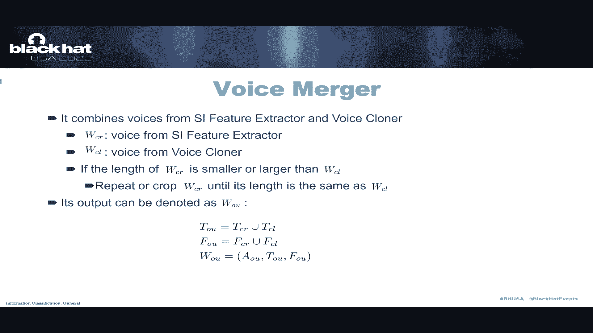
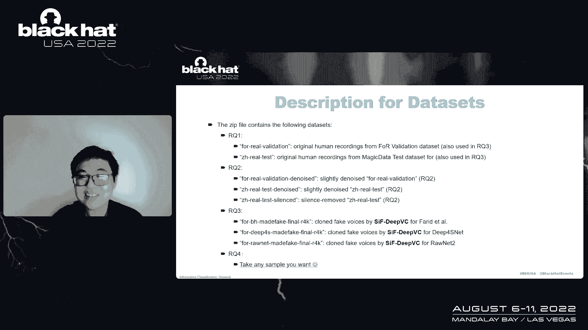
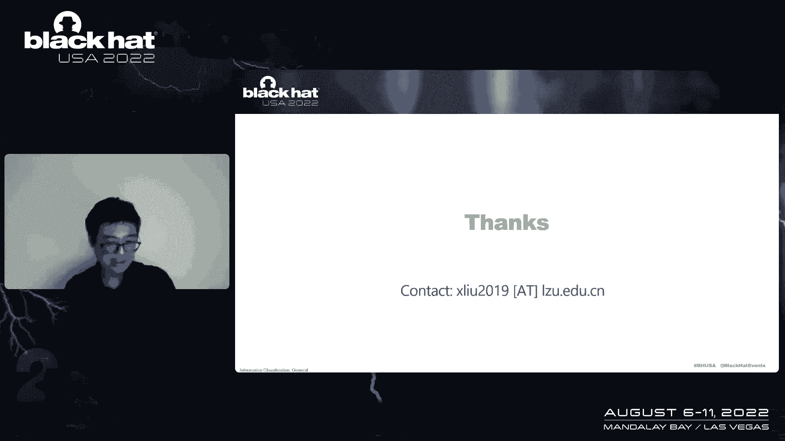

# P11：011 - Human or Not： Can You Really Detect the Fake Voices？ - 坤坤武特 - BV1WK41167dt

因为你收到了来自中国的问候，你叫我，呃，对不起，非常，呃，这是我的第二顶黑帽子，对我来说很遗憾，由于旅行限制，不在拉斯维加斯，我希望你们能在这场流行病中找到一些，呃，我的城市仍处于封锁状态。

这次简报的动机很简单，一开始我们想做一个探测器，为了为了为了声音，然后他们在谷歌学者上搜索论文，结果很令人失望，呃，关于这个主题的出版物很多。几乎所有人都报告了非常好的表现，平均值实际上是98%。

有几个甚至达到了一百，呃，1。看来我们已经没有什么可做的了，我们当然是保安，系统没有绝对的安全性，呃，然后他们决定找到一种方法让人们，这些假声音，绕过这个，看起来很结实，探测器，呃。

这些发现非常令人惊讶，呃简而言之，呃，看起来所有的探测器都是胡说八道，是啊，是啊，对现实世界环境来说不可能的废话，呃，这次简报会有两位发言人，我和我的搭档唐元先生，呃，他是个好的开始，呃，顺便说一句。

呃，他还是个本科生，这是他第一次在，顶级会议，像黑色的帽子，呃，他有点紧张，他女朋友在现场直播，轮到你了，我是个大学生，大学是我第一次来这里放弃演讲，嗯，我是，我受够了，现在我要，呃，给我的种植园，嗯。

我们将首先给出一个精确的规定功能的声音，然后我们将用检测器总结现有的特征，之后我们将介绍我们绕过探测器的方法，所以称之为安全度，然后是评估部分来证明我们的发现，呃，现在我们来讨论一下什么是合适的。

我们一直在接触机器创造的东西，比如说，所以我们可以从严肃的声音中判断出来，它不是人类，但现在图片是由AI合成的，听起来像真人，呃，我们可以看到基于废物的犯罪已经在进行，呃，二十世纪以前。

早期的语音合成系统是主要的，而且很难模拟人的声音，呃，后来的语音合成方法，很容易确定它的特征，学会癌症H的AI感性的演讲是通过一些自然，很难察觉，语音由合成器和黑社会持有者生成，这些方法已经很成熟了。

人类很难弄清楚你的演讲是大还是，他做不到，但是呃，但也许一个程序可以，现在我们要调查现有的探测器，呃，适配检测的方法有很多，呃，所有现有方法都报告性能不佳，基于计算机视觉的方法被转换为，呃。

将方法转换为图像并进行分类，呃，三种银基方法几乎百分之百，我费率，和其他方法也导致性能，嗯，但做这个数学真的在现实世界中观察，那不是，呃，这些方法有问题，他们使用了真实的数据集。

没有考虑相关图片中的旋转，呃，在这里，我们提出了一个新的概念，叫做人类特征中的言语，这是一个不应该经常用来决定人类的特征，比如说，无意义句子与背景噪音，呃，不同语言，它们与说话者没有关系。

在任何功能中都有扬声器的新概念，呃，我们提出了一种叫做安全的废物柱方法，我们看到，我们在很长的路上看到西方的安全，基于深度学习和口语，我们将使用许多功能，我们就用这个工具，呃。

我们进军扬声器电子邮件功能与现有的人工智能与角落，呃，我们构建了一个叫做扬声器的工具，每个特性中的许多特性以获得我们想要的特性。

然后这两个会移除特定的频率并调整太阳的值，然后提取的特征将与AI被屯合并，呃，废物部分，呃，编码器和表座已经，呃，厌恶的方法和一个小方法。

在Denoto清除Sundata和Coda产生的废物中的嘈杂部分，为了减少特征，我们根据分析师使用安全呼吸的录音构建演示，呃，当我们播放原始录音时，所以我的意思是，现在我认为最摧毁灵魂的事情之一是交通。

它影响着世界各地的人们，它夺走了你的生命和你的，现在我将演奏贝威，我会给每个人1000万美元，未来是非常现实的，我想对我来说可以，呃，对我来说是不够的，绕过最先进探测器的方法，我们的人是这样说的。

我们能够浪费注意力，和现有的探测器帐户，扬声器特征和部分特征向量，决定什么更好，很多，我们从真实的方式收敛特征，用特殊的方式，我可以伪装成目标的朋友，向目标借钱，或发表危险言论，测试和庆祝者。

最重要的一步不是说话者事件的特征来自人类的方式，呃，我们用振幅，时间，皮带，呃，和频率来描述一个特定的，描述特定的音频文件，呃，我们构造一个函数，将振幅设置为零，并将特定时间。

结果是我们压制了所有的声音，以杀人头而闻名，而一些扬声器在现实中的特点是存在于西方的，上面我们要去的是他的策略的一部分，并把它和制作它的方法融合在一起，让它感觉真实，四个头的部分听起来像噪音。

但我们减少了它们的体积，我们生成单词前后的图像，我们可以看到，呃在拥有之前找到了声音的图像，我们说大多数高海拔的人类排泄物都在甜心以下，在拥有这些东西之后，呃，低于四个头，呃，嗯变得众所周知。

所以我要播放一段从巴黎分心的录音，和掩码的演示，录音的价值可能会更低，呃，这就是当我们移动上面的东西时发生的事情，呃为了，但当我们为他的手机移动下面时，就会发生这种情况，um录音，呃，只是听起来像噪音。

呃，嗯，而它等于扬声器现实功能，所以我们可以把它和状态智慧合并，没有超脱，让它感觉很好。

呃，很容易从扬声器组合到复杂的方式，大学，特征，指导员，和罪恶，许多工具无法完成这项工作，呃，这些是康威夫妇的图像。

前后有细微的差别，但是您可以看到这个微小的差异使网页变得明智，真实的，呃，按照上面的步骤，我们成功地制作和掩膜，我们只说话，我会给每个人1000万美元，我们探测器市场的状况将，呃，这是我们所有的样品。

我们说结合演讲者邀请的功能和现有的，艾是用这个橙色的录音，所以我的意思是，现在，我认为最摧毁灵魂的事情之一是交通，它影响着世界各地的人们，它夺走了你的生命和你的，呃，路是对的，很特别。

我们将其与输出语音的方式合并，我会给每个人1000万美元，绕过十大。

呃，我的学校演讲者将和评估部分，谢谢。告诉你你需要可爱的屏幕，你需要去，呃，我将介绍这次简报的评估部分，呃，这次简报不仅仅是一个比例，所谓正常，呃，语音攻击框架也被用来垃圾现有的检测器。

我们提出问题来评估这项工作，RQ第一，在现实世界中，阅读检测方法是至关重要的，rq 2，呃，说话者在相对特征上确实影响了现有的方法，前两个问题是关于说话者在我们目的的相对特征上的有效性。

另外两个是为了我们的安全，dvc，呃，只是想说清楚，呃，基准数据集，呃，开源，开源数据说这些是其他作品，呃，包括英文版，边距版本，并且没有一个被使用，包括在现有讲座的出版物中，首先，呃。

我将介绍探测器中的探测器，呃，我们选择了第四个尺寸之夜，uh是最新的基于CC的方法，呃，我们使用了作者开源的植入，端到端方法的规则，作为基线，为了证明，三个第二个第三个是，呃，第一种CB方法，顶级会议。

事实上，我记得是在C，我们还在黑帽美国使用开源的实现，拥有一个没有，最后一个是，呃，它被称为深部太阳，呃，我们知道我们找不到这个的开源代码，我们尽力联系作者，但我猜这里没有反应，第一个。

第一个是现实世界环境中的真实单词sp to，我们知道符号是不平衡的，呃，大多数演讲，大多数符号都是否定的否定的，因此，人类的言语远不止是固定的言语，所以公关对现实世界的发展是非常重要的。

这个实验的结果表明，没有一个fp是可以接受的奖励，我们可以从桌子上看到，当他们更改数据集时，只需更改数据集，百分之十九以上是不可能得到回报的，第二个赞助商在这里，呃，我们需要这个实验来知道，做做。

这些特征很少影响检测方法，呃，一共有四个，这个实验有两个部分，呃，我们对目标声音的降噪和频率去除，理论上，不影响是不是假声音，检测结果不应改变，如果这些特征不影响检测，但是呃。

在噪音的结果中，检测结果是不断变化的，现有的检测方法都受到背景噪声的显著影响，呃，我们可以看到，呃，性能更好去除背景噪声后比以前表现更好，它表明噪音可能有助于假语音检测，绕过施加购买的检测。

接下来我们需要，我们试图消除沉默，前后的沉默说，呃，人类的声音，呃只是，嗯哈哈哈嗯，在消除了那些沉默之后，检测结果也发生了变化，这样我们就可以，我们可以看到沉默的部分，也会影响探测器，我们可以看到更多。

呃，三个探测器都受到沉默的影响，他们表现得更好，不管它表现得更好，或者更糟或者更糟，呃，我们可以看到它会，其实它，会影响检测结果。

在那个时代，它表明说话者的相关特征确实被检测系统记录下来了，作为特写导演的一部分来阻止，确定一个特定的符号是否是人类的语言，我们可以用，我们可以在活动功能中通过扬声器绕过这个检测系统，因此。

我们认为争论的答案是肯定的，我们可以把它们当作有用的，在第三次评估中，呃，我们用，我们用一个自建的安全安全风投来进行这些东西的实验，我们的系统能不能通过这种检测方法来检测一个声音是这个实验的关键。

在这个实验中，我们删除了基线数据集中误报为阳性的符号，然后对于每一个人类录音，我们生成四个新的录音，呃，假录音，当然啦，呃，第一个我们不是，我不是跟你开玩笑，这个假的，声音，这个声音是假的。

第二个今天天气很好，我发给你的第三个，我们有的号码，聊天很有名，我在中国，你能借我点钱吗？呃经常用，你明天需要来办公室，呃，只是为了社会工程，当然啦，结果表明，我们的框架生成的假录音具有更高的负肉。

它的意思是，录音比人类更人性化，我们可以从表中看出差距已经达到100%以上，呃，我们比基线好得多，我们的负面影响，呃比现在多得多，远高于基线负值，因此，我们认为问题三的答案是肯定的。

最后一个我们要回答的问题，因为人们能理解我们的框架产生的演讲吗，呃，我们设计了一个随机的，呃，随机尺寸，和单盲实验来验证录音是否清晰易懂，事实上，我们用三个，我们有300张唱片你可以从我的幻灯片上看到。

呃，结果很清楚，都挺好的，呃，我想你有，你们已经听过演示了，是啊，是啊，这个实验，实验表明没有，自我产生的声音和人类的声音几乎没有区别，也许相信人们能很好地理解安全压抑的输出声音，因此。

问题四的答案是肯定的，通过四个问题，呃，我们已经验证了扬声器的相关特征，这里有一些外卖，一开始，演讲，生成与检测，呃，我们介绍如何生成它，并强调检测方法及其问题，我们提出了一个新的工作攻击。

可以绕过现有的纹理，第二个，呃，防御这些假声音的困难，这些是殖民地的声音，可以比人更有人情味，也有跑向蓝方的风险，现有的解决方案远非有用，不要把它们放在你的生产中，决赛，呃。

我们还为未来的研究人员提供了一些新的数据集，我们构建它们并开源一些高质量的新数据集，我们深深理解生殖的重要性，生殖能力，本次简报的所有项目代码都可以在GitHub上获得，呃，我们的这个中包含的一些代码。

呃来自以下项目，呃，您可以下载它们并自己构建并测试这个，我们在这个项目中使用的数据集也向公众开放，呃，我们已经提供了下载，你可以得到全科医生，从谷歌驱动器上获取P，请注意这个疗法的大小大约是七点。

8千兆，它是，很高兴成为。

呃，下面是数据集的表达式，我们把它们分成了四个问题，呃，包括来自F o r数据集的真实验证数据集，和中文版，两个神奇数据中的数据集，我们也给媒体，新闻界，数据集，呃，比如说，被否定的和被消除的沉默。

第二个和第三个，呃，我们用这个，我们提供了自己产生的声音和测试现有探测器的声音，就像你一样，因为你可以听这个数据集中的符号，呃，因此，通过数据集，您可以，可悲的是，我们现在真的检测不到假声音。

但也许我们将来可以做到。

在我们的最新研究中，我们已经建立了一个，基于时尚的方法，与扬声器的创新功能，使符号百分之百地出现，通行证，现有的探测器是百分之百的，只是，我们需要大约十分钟的时间来生成模糊，放屁符号，呃。

我们也会很快发布合适的版本，此外，我们希望将来会有更多新的探测器，我们也在努力，呃，找到了检测野外工作的方法，感受现实世界生产环境的声音，谢谢大家收听这个，我们现在是来问问题的，呃，你们所有人。

你也可以给我发邮件和我讨论这个项目，呃。

