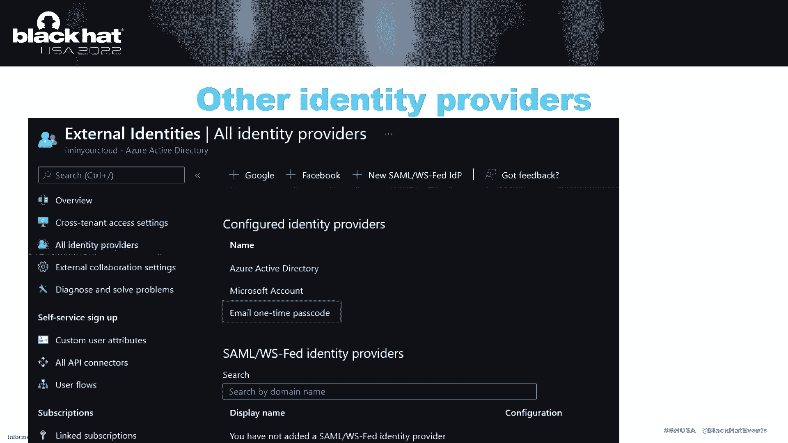
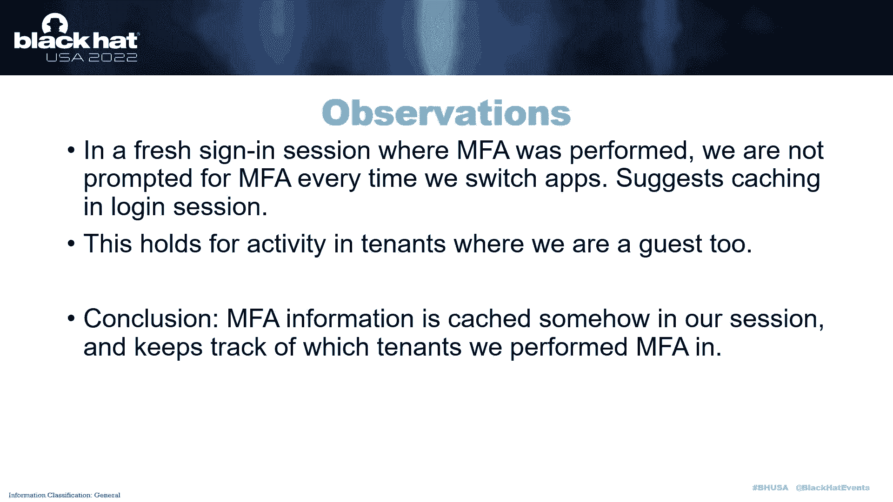

# P13：013 - Backdooring and Hijacking Azure AD Accounts by Abusing External Identities - 坤坤武特 - BV1WK41167dt

嗨，大家好，欢迎来到我的会议，通过滥用外部身份后门和劫持Azure帐户，我是德克·莫诺玛，我很高兴能在这里和大家见面，关于我的很短的一点，我是迪肯，我来自荷兰，今年，我创办了自己的公司。

专注于Azure广告和活跃的目录咨询和研究，我也喜欢写关于这个主题和工具的博客，如果你想，你可以在Twitter上关注我，在下划线deon，在我们深入讨论细节之前，让我们从一些定义开始，一些重要的概念。

所以这次演讲是关于蔚蓝的，与Prem上无关的活动目录，活动目录和Azure，它真的是蔚蓝一切的中心身份平台，微软365作为你的资源管理器，或任何第三方SaaS服务器，您希望连接到它并将其用作身份验证。

所以我们在这里谈论的不是虚拟机或网络，我们真的在谈论蔚蓝的身份部分，如果你在看蔚蓝，从安全角度来看，重要的事情之一是租户，因此，租户就像是一个组织的AER广告的单独实例，大多数组织将有一个主要租户。

比如说，链接到他们的微软，365项服务，他们可能有多个租户，但它是蔚蓝的一个重要安全边界，因此，您不应该能够访问不同租户中的数据，因为那已经不属于你了，如果我们说的是房客，我们这里也在讨论合作。

从这个意义上说，也有外部身份，所以一个外在的身份真的很容易，这是你的房客没有管理的任何身份，因此，它可以是另一个租户的本地身份，甚至是不同的身份提供者，所以它可能是一个个人微软账户，谷歌账户。

甚至就像一个只基于电子邮件地址的虚拟帐户，我们以后会看到中国人的谈话，我们将讨论外部合作，所以两个租户之间的协作，我在这里设置了一些街区，所以通常我们会谈论租户A和租户B，左边的租户是租户A。

这是我们正在寻找的主要租户，所以这是我们要么攻击要么防御的组织的租户，租户B可能是外部方或跟踪器控制的租户，在我们利用某些东西的情况下，所以在外部合作方面，有一个房客，有另一个组织的房客。

我们想让租户访问的账户，所以在租户A中，所以从另一个组织的角度来说，那里的用户被称为家庭租户，账户在房客身上，为此，从租户的角度来看，被租户A称为资源租户，因为它是外部租户，如果我们有外部帐户。

在Tena中创建来宾帐户，这与，到家庭男高音中的帐户，在租户B，所以这两者之间有联系，账户是相互联系的，我们稍后会看看它是如何工作的，所以在这个设置中，我有两个租户，主要租户，租户A是海曼你的云。

我通常在那里做研究，为此，我还建立了一个二级租户，在这个场景中，我们都在查看默认设置，因此，没有特定设置的特定削弱，这将使某些攻击成为可能，但默认情况下都是可能的，我们也没有使用任何特定的B2。

b会给某个租户更多特权的信托，所以让我们开始看看如何，邀请流从BOI的角度来看，所以如果我们在我们的房客里，在你的云租户的眼睛里，我们可以添加一个新用户并说嘿，这是外部用户。

我们想邀请他们到我们的房客那里，所以我把这个邀请发送到邀请我的电子邮件地址，该用户将收到一封电子邮件，因此电子邮件将包含邀请接受链接，如果他们点击它，他们会得到一个接受屏幕的提示，如果他们点击接受。

然后在，我是你班上的房客，他们用他们的帐户登录，但在另一个房客身上，所以在这一点上，邀请我用户，它仍然存在于十字架的Tendev中，但它正在访问，我是说你的云租户，如果你看看组织的观点。

您看到此帐户存在于两个可能的租户中，你可以在它们之间切换，这就是最终用户的看法，现在我们要开始看看它在引擎盖下的样子，我们有几个选择，所以如果我们看一种低级的东西或其他信息，有各种各样的选择。

所以第一个也是官方支持的是微软图形，这是微软365的官方API，也包括天蓝八十，你可以从那里查询很多东西，但它并不总是包含所有的信息，所以还有一个API，这更接近于蔚蓝广告的实际表现。

这是天蓝色的广告图，所以它是一种较低的水平，它只覆盖蔚蓝广告，所以没有其他服务，有时也可以使用官方的内部版本，获取比生产环境中支持的更多的信息，所以这个是不推荐的，但这对我们作为研究人员来说更有趣。

我通常更喜欢最后使用Azure ID图，当然还有门户，我们也在其中做各种演示，这可能使用微软图形或广告图形，这取决于您在这次演讲中使用的功能，我们将使用实际广告图和微软图的混合，也用我的工具roon。

它是道路工具的一部分，这是广告图的前端，所以它允许你离线收集所有信息，然后很少从GUI的角度进行编辑，所以看一些较低级别的东西，我通常喜欢先看审计日志，因为实际上a中的任何操作都将创建一个审计日志事件。

我们可以看到哪些属性被改变了，所以这是邀请救赎的活动，所以当客人帐户，邀请被赎回了，我们看到这里的一些属性被更新了。

最有趣的可能是替代安全ID属性，所以我们看到这里添加了一些数据，如果我们在角色中查看图表的结果。

我们还看到替代安全ID属性现在被填充，它说了一些关于身份提供者的东西，一把钥匙和一种类型，所以可能有一个指向用户帐户的链接，现在我在某个地方看了一下那把钥匙可能是什么，因为它是以64为基数编码的。

你可能会从这里猜到，实际上，如果我们解码，我们把它编码成十六进制格式，我们得到一个十六进制数，如果我们查看我们邀请的用户居住的租户，我们看到它有相同的ID，所以这个属性称为net id。

这就是把两个账户联系在一起的原因，因此，来宾帐户在替代安全ID中有一个属性，并链接回网络ID，家庭帐户的财产十好的，这就是它在GUI中的样子，结果是什么，所以我想知道，我们也能从纲领性的角度邀请人。

我发现了一些有趣的文档或一些第三方项目，那是很久以前的事了，它基本上说嘿，您可以使用此工具和使用一些帖子请求赎回邀请，并且使用JSON有效载荷，所以我就说嘿，这听起来很有趣，尤其是因为它具有相同的特性。

所以Alsec的ID，它可以是替代担保财产，和其他一些属性，作为邀请票，对我来说也很熟悉，所以如果我们想用编程的方式使用这个，我们将使用外部用户的网络ID，嗯，我们可以查询。

这样我们就可以在家庭租户中查询，我们可以用图查询它，我们还可以从发给用户的任何轴令牌中提取它，因此，如果您有该用户的访问令牌，会有PU ID索赔，这是属于帐户的相同的净ID，我们还需要邀请函。

因为这就像是一种秘密信息，这与邀请有关，我们可以，嗯，我们需要的，但事实证明，我们实际上可以查询这些邀请，因为它是广告图中邀请的用户的属性，所以我们最终得到了这个简单的帖子请求，我们通过API赎回邀请。

我们可以指定自己的身份，所以网络ID，还有电子邮件，并使用我们之前查询的邀请票，我开始调查这件事，我很快就遇到了一些问题，所以你会期望，您需要一些特权角色来以这种方式修改帐户，但事实证明那不是真的。

因此租户中的任何用户都可以为任何被邀请的用户赎回邀请，有点奇怪，而且，员额请求中提供的任何信息都没有得到实际核实，所以我可以使用任何接受的电子邮件，我可以假装我是在一个完全不同的组织工作的人。

我也可以将它链接到任何目录中的任何外部帐户，因为它只是基于网络ID参数，未检查且最后一次，但尤其是所有的邀请票，所以这个秘密，兑换邀请所需的秘密部分，租户中的任何用户也可以查询。

所以如果我们对广告图形有这个很好的要求，我们应用了一个过滤器，它说用户状态等于支出接受，所以这些都是还没有阅读还没有兑换邀请的用户，然后我们从广告图中选择邀请票，所以这很好地给了我们用户的电子邮件地址。

以及兑换此邀请所需的邀请票，我们可以，当然，也可以从目标帐户查询网络ID，所以在这种情况下，我在查询我另一个房客的新的低预使用者，您将看到该用户的净ID显示为查询的输出。

当然我们可以用一个简单的网络厨师食谱，回到基础六十四表示，如果我们把它都放在邮政请求中，您在前面看到的使用邀请票和net id，我们得到一个回应，它说嘿，这个邀请现在被外面的保安接受为客人了。

这不是电子邮件地址，我们将其链接到的合法帐户，我们看到了替代的安全思想，它链接到流氓帐户的净ID，如果你不换房客，我希望这有点可读性，所以在右上方你可以看到，这是租户中的新低预用户，在底部你说，请看。

这现在链接到局外人安全L电子邮件中的客人，我们从那里偷了，邀请。

还有一个有趣的部分是，没有办法真正看到这一点，所以如果你是一个蔚蓝广告管理员，有人劫持了你的邀请，并将其链接到一些任意的账户，你永远也找不到，因为它只是基于这个二进制属性链接的。

但是您不能在其他租户中看到净ID，它在GUI中向你展示的一切，它是一个外部ID，嗯，但不是它实际上链接到哪个账户。

所以简短的版本，基本上，租户中的每个用户都可以查询未赎回的邀请，或者只是如果你经常重复，只是比用户更快，它实际上是被邀请的，他们可以在没有对提供的信息进行任何验证的情况下赎回邀请。

管理员也没有办法找到哪个账户，它与现在的一些影响场景有关，如果你不熟悉那里的外部帐户，它们经常用于外部供应商，比如说，需要一些多余的，无论是在你的广告本身，还是管理Azure订阅或资源。

但也可能是邀请了一个帐户，并在80年立即获得特权卷轴，因为当你邀请它的时候有一个用户界面，它说嘿，这个帐户应该扮演哪个角色，如果我邀请供应商的人，我给他们的客人帐户特权，比如说。

有人可以立即劫持邀请并成为全球管理员，我的房客，这也绕过了允许，外部协作域列表，因为我们在域没有被实际验证之前看到了，因此您可以向允许域发送邀请，然后将其链接到一个完全不同的租户的帐户，最后，当然啦。

因为任何用户都可以这样做，如果帐户被泄露，攻击者可以劫持不同的来宾帐户，如果他们的账户被发现并补救，他们仍然可以访问他们的客人帐户和任何被授予访问权限的资源。

你怎么知道的，嗯，所以如果你是一个管理员，你想知道嘿，这发生在我身上，有一些这个的痕迹，所以如果你看看左边的审计日志，我们将看到常规的邀请流，然后通过应用程序赎回邀请，它被称为微软邀请接受门户。

这是作为应用程序完成的，使用右侧的某个ID，我们看到流氓救赎，在这种情况下，战斗由用户赎回，即联合并执行POST请求的用户，通过API赎回邀请，现在你可以，当然，为此写一个查询，我写了一个KQL查询。

您可以使用，在你的房客身上寻找这个，如果你发现任何结果，我希望你不要，但如果你找到任何，你可能有一个信息被别人偷走了，所有的权利，到目前为止，我们看了GUI流。

我们还研究了客人账户是如何在测量图中表示的。

让我们离开微软的图形，因此，外部标识在Microsoft图中有一个有趣的属性，它被称为恒等式属性，少了一点，里面的信息少了一点，所以我们没有看到二元的好处，比如说，但有趣的是，这与图表的对比。

Microsoft图实际上允许您修改这个Identity属性，因此，在ID图中，您不能修改安全属性，甚至不是全球管理，但在显微照片中，你实际上可以做到这一点，所以我在想，好的。

假设我们可以修改用户的身份，拥有正确的特权，现在，我们能用它做什么，比如我们可以在那里输入什么值，这会给我们带来一些有趣的东西。

所以我看了一下默认情况下现在有什么身份提供者，您有其他Azure活动目录，它们是有效的标识提供程序，你也有微软账户，你可以在这里添加谷歌或脸书或其他IDP，但这不是违约，嗯。

但对我来说最突出的是电子邮件，一次性帕斯科，这是一种新的，这是一个有趣的，因为它允许您向用户发送邀请，没有Azure广告账户或微软账户的，它允许他们只根据他们的电子邮件地址登录，所以这里没有真正的账户。

这是一个奇怪的虚拟帐户，可能存在，也可能不存在，在微软管理的一些Tenon中，但这是一种非常简单的表示身份的方式。

所以这里我们来看看我邀请的一个用户的Microsoft图，那没有任何账户，所以它会用电子邮件登录，我们称之为电子邮件OTP，我们看到，在这种情况下，身份只是说登录，我联合发行人是磨坊。

这是EMO OTP的问题类型，分配ID的问题只是电子邮件地址，如果我们看看图表，我们看到了非常相似的东西，身份提供者是磨坊，关键是电子邮件地址，但以64为基数编码，我在看，好的，我们可以修改这些身份。

属性，因为如果我们能修改这个，我们也许可以将帐户链接到其他外部身份，原来，当然，全球管理员可以做到这一点，用户，管理员可以用正确的权限做这个应用程序可以做，但令人惊讶的是，用户可以修改自己的身份。

我知道哪里需要，我有一种感觉，这是为了一些B两个C的情况，但我明白了这一点，因为我在看实际的用户角色定义，如果你看看这个，它说明了用户可以做的所有事情，基于资源本身的条件，这里写着好。

它可以更新身份的属性，但只是为了他们自己，这给出了一些有趣的攻击场景，所以如果我们有临时访问帐户的权限，或者我们有一个具有正确委托权限的范围有限的访问令牌。

我们可以通过修改Identity参数来后门这个帐户，并将其链接到我们控制的一些外部帐户作为攻击者，其中一些情况是，如果您有临时帐户访问权限，例如，您受到恶意软件攻击，你在某人的笔记本电脑里是临时的。

您可以将帐户链接到您自己的帐户，另一种情况是如果您，比如说，使用Ficode钓鱼，您将获得一些刷新和访问令牌，但你不能就这样对账目做任何事情，但您可以通过最后更新身份的属性来赋予它。

如果您以某种方式接管了一个应用程序，具有用户登录的正确权限，您还可以获得这些访问令牌，有足够权限修改这些属性的，所以让我们来看看这种攻击是如何工作的，所以首先我们看看原来的，所以我们在看新的低用户。

我们看到这些身份只是正常的，因此它使用用户主体名登录，这只是我们房客的土生土长，所以让我们创造，让我们走后门，这些身份，所以我邀请了一个OTP账户，这个是磨坊，在SE外面。

您可以看到这个帐户是在交叉十租户上登录的，所以我在我的攻击者租户中邀请了这个帐户，我要把它链接到该组织的租户，我们正在攻击，所以我用帐户访问权限修补了这个，我说嘿。

现在我的签名类型是从这个邮件地址联合起来的，电子邮件地址是mail otp，如果我们再看同一个身份，我们看到现在有两个身份，所以首先仍然使用主体名称，但第二个身份是我们刚刚链接到的电子邮件OTP信息。

如果我去那个OTP账户，我可以简单地换房客，所以我可以说我已经在这里签到了，我要切换到，我是你的云租户，它说嘿，我找到了一个你可以在这里使用的身份，它被称为磨机OTP用户，如果你点击那个。

您注意到您作为新低用户登录，使用我们控制的电子邮件地址，所以我们只是把这个新的低预帐户重新链接到一个电子邮件地址，和攻击者的控制，我们现在签署了，我是说你的云租户，所以这确实需要一些预先存在的访问。

但是这个真的很容易修改，我想去一个外部账户，而且换回来也很容易，所以我们可以用一个空参数来完成同样的POST请求，这将把帐户切换回正常的签名名称，我们甚至可以使用旧的访问令牌，现在账户又完全正常了。

所有的权利，所以用户可以自己做这件事，但还有一些更有趣的场景作为额外的奖励，我们得到这个特权升级，因为用户管理员根据定义不能重置密码，例如，来自较高特权帐户，因此用户管理员不能重置全局管理员的密码。

因为这将是特权的提升，但是它们可以修改全局管理员的标识属性，或者基本上任何其他用户，这样他们就可以接管更高特权用户的帐户，在租户中，甚至还有一个更简单的方法来做到这一点，所以如果您是用户管理员。

就像我说的，你不能重置密码，这是一个非常漂亮的按钮，上面写着将帐户转换为B两个B帐户，你可以这样做，嗯，你甚至可以从GUI中做到这一点，您可以简单地将全局管理员转换为B 2B帐户。

使用您控制的B 2B电子邮件地址，然后你自己就是全球管理员，所以它是如何工作的，就像我说的，这完全是在GUI中，所以我们有一个全球管理帐户，我们修改了电子邮件地址，以指向Cross Tendev的流氓。

然后我们邀请他们去b 2 b，所以我们把这个帐户转换为外部帐户，然后我们用外部帐户登录，我们看到我们是一个全球管理员，因此短版本用户管理员可以将任何帐户转换为B两个B帐户，包括较高特权帐户。

您可以通过GUI来完成此操作，或者向Microsoft Graph发送两个简单的POST请求，当然还有，如果我们把这个和我们之前看到的结合起来，你甚至不需要用真实的账户兑换邀请。

您可以只做API来赎回邀请，并将其链接到任何外部帐户，它将是完全看不见的，所以这也有缺点，它对有邮箱的帐户不起作用，因为Azure ID拒绝更新电子邮件地址，但是您可以切换回修改Identity属性。

您仍然可以将帐户链接到电子邮件OTP用户，有一个警告，所以如果你转换一个帐户或修补他们的身份，您只是更改了主身份验证，这样你就可以用电子邮件地址登录了，而不是用密码。

但是如果帐户配置了MFA并需要MFA，这仍然会起作用，所以MFA在这种情况下会化险为夷，或者至少你会这么想，因为我也看到了房客和他们是如何工作的，所以说，如果我们有这个，如果您有受害者帐户的设置。

配置为MFA的攻击者帐户和配置为MFA的攻击者帐户，那么如果我们把这些联系起来，所以说，如果我们通过修改身份来劫持帐户，或者我们把它转换成一个B两个B帐户，如果我们在MFA上签名。

方法仍然是受害者帐户的方法，所以原始的，所以只要用我们自己的MFA方法登录，我们自己的房客不会让我们进入，给受害租户，我对MFA有一些观察，所以说，当然，如果您在会话登录中执行MFA，你不必那么做。

就像你登录的每一个应用程序一样，因为那样你就会，所以这表明，有一些缓存，当你在登录会话中做MFA时。

它也适用于我们是客人的租户的活动，所以如果我有我的主要帐户，我签到了另一个房客，我在那里有自己的MFA方法，我不需要一直重做这整个脱脸，因此，这表明MFA信息缓存在会话的某个地方。

它跟踪我们是否在哪些租户中进行了MFA，所以基于这些假设，我尝试了一些新的东西，我把这个帐户称为重新绑定，因为听起来很酷，基本上我们有攻击者的帐户，它有自己的相同的方法，你应该你应该永远记住。

如果我们做交叉租户的事情，我们要看的总是源身份，所以在这种情况下，嗯，此会话来自攻击者，链接到哪个账户并不重要，因为它总是攻击者的帐户，它可能正在租户中执行身份验证，但那是一样的。

所以我们能做的或者我所做的是，我首先邀请攻击者到房客那里，合法地，攻击者现在有一个来宾帐户，他们可以配置自己的和相同的方法，现在，如果我们删除这个帐户，所以来宾帐户消失了，攻击者帐户仍然存在。

但它不再有访问效果租户的权限，但是如果你保持同样的签约环节，并且将受害者帐户链接到攻击者帐户，猜猜会发生什么，它缓存MFA信息，所以如果我们链接这个帐户，攻击者仍然可以在登录会话中获得MFA信息。

您实际上可以作为受害者帐户进行身份验证，其实你会想，哦，你已经做过MFA了，但它不看哪个账户，您为，所以说，如果您有登录会话，你可以简单地在一个完全不同的租户中做MFA。

我们可以用我们所有的技术来做很多事情，但我制作了一个很好的小视频，在这种情况下，我正在使用用户管理员进行攻击，还有我说过的另一个场景，但这一切的好处是，整个攻击只能通过点击GUI来完成。

所以你不需要任何图表目标什么的。

让我们从头开始，所以我们首先攻击攻击者帐户，这是一个基本上是在右边，所以我们邀请这个流氓账户，我们为它创建一个客人帐户，它会收到一封电子邮件说嘿，你被邀请参加这十个，所以现在在，我在你的云中。

我们接受这个邀请，所以我们把那个客人账户和我们的身份联系起来，在攻击者租户中，所以我们必须批准，参考帐户需要一点时间，然后我们现在有一个客人帐户，因为MFA是必需的。

它会要求我们为我们新创建的客人帐户注册MFA信息，所以在这种情况下，你会看到Max Authenticator应用程序，并使用虚拟应用程序，因为我想一直用我的电话。

但基本上我们现在正在为这个帐户注册MFA信息，就这样做了，现在我们使用我们的攻击者帐户作为受害者10中的客人登录，我们可以看到这个，现在我们要做的是，我们实际上可以再次离开客人租户。

这将删除我们的客人帐户，所以你可以自己作为客人来做这个，你可以说离开，客人帐户将被删除，但我们还是签了名，所以我们现在要做的是把受害者的账户转换成一个B 2 B账户，或者基本上将其链接到流氓用户。

所以我先更新电子邮件地址，然后使用转换来击败海滩功能，这将转换帐户并将其链接到攻击者的电子邮件地址，这有时可能会失败，因为它还在后端更新，现在它被转换了，我们会收到一封电子邮件。

所以现在我们接受转换帐户的邀请，我们再次单击接受，实际链接我们的账户需要一段时间，然后它给我们签到，所以我们没有看到任何提示，但我们还是签到了，我们现在是另一个用户，我们是受害者用户。

我们可以在门户中看到这一点，所以在这种情况下，我仍然在攻击者租户中登录，你可以换租户，这里仍然只显示攻击者租户，但一旦我们刷新它，那么我们实际上会看到受害者的tenis现在也是可能的。

我们可以切换到他们的，所以现在我们在受害者房客身上签到了，我们可以转到我们在活动目录中的帐户，看看它实际上是同一个用户，所以在左边你可以看到带有一英镑的用户ID，在右边。

你可以看到我们登录的是完全相同的用户，所以我们现在接管了账户，不需要做MFA和Azure，我们在认证中所做的事情，所以如果我们去签名日志，我们看到我们验证了它，并且更改了帐户名，当然啦。

因为我们接受了邀请，您可以看到这里的需求是多因素身份验证，但你也看到MFA的要求也很满足，因为我们的代币包含了MFA的声明，实际上是为我们铸造的，当我们做认证的时候，所以这样，嗯，只要更改帐户身份。

就可以绕过MFA，你可以做到这一切，当然是在我们接手这个帐户之后，我们和MFA签约了，这样我们就可以在帐户中添加我们自己的MFA方法，使旁路永久，现在如果您是用户管理员，您可以更改帐户的密码。

您有登录所需的MFA信息，整个袭击的简短版本，所以MFA信息似乎缓存在签名会话中，基于你的身份和你的家庭租户，加上目标租户的组合，在FA中没有与实际账户的链接，只查看租户级别，因此。

如果您首先创建了一个新帐户，你注册你自己的和信息，你一直登录到同一个会话，您可以通过离开组织来删除来宾帐户，但它仍然会兑现你的会议，你在租户中使用MFA登录，所以如果你重新链接帐户。

你可以通过把它转换成一个B 2 B账户来做到这一点，就像我们在视频中看到的，也可以通过电子邮件LTP进行，通过修补Identity属性转换，你可以重新绑定那些账户，你可以绕过MFA和Azure。

不会再提示你了，因为您已经为您的JMate帐户做了，所以这里的一些场景，如果您的帐户访问权限有限，例如具有正确作用域的额外令牌，您可以将其转换为完整的持久轴，包括和一个需要它的地方。

如果您只能访问帐户密码，你也可以绕过，FA和有条件访问，如果不是所有申请都需要，所以我经常看到的是人们需要MFA，例如：三百六十五，但您仍然可以登录PowerShell模块，仅使用密码，如果你有代币。

您可以修补Identity属性，绕过MFA，注册MFA信息，您可以登录到任何其他您想要的应用程序，当然，作为用户管理员帐户，您可以将您的特权提升到全局管理，包括绕过他们的MFA。

您也可以绕过MFA在租户中的任何其他用途，现在我听到你们中的一些人认为我实际上没有使用外部身份，没有人可以邀请客人，我在这里安全吗，嗯，否，所以有一些替代方案，而不是邀请客人帐户。

您也可以先将自己的帐户临时链接到某个外部帐户，假设你有自己的账户，例如用户管理员，您将其链接到电子邮件LTP帐户，您可以在不同的租户中创建它，因此用户已经被邀请，所以你不需要自己邀请它，嗯。

你注册了MFA信息，然后你把它断开，然后将其链接到其他帐户，然后你可以绕过MFA而不阅读客人帐户，因此，这消除了实际邀请外部用户的要求，这基本上绕过了外部协作的所有安全控制。

所以我试着把一切都放在最严格的设置下，我喜欢阻止用户发送邀请，甚至明确阻止外部帐户，禁用OTP方法并不重要，攻击仍然是可能的，因为我们已经用EMO OTP登录了，在这一点上，我们做了一个账户。

实际上不再检查了，电子邮件OTP是否在十年内启用，所以，当然啦，我向微软报告了这些事情，我报告说，这是今年3月的四期独立杂志，所以没有验证的客人战斗赎回在几周内很快就被刺伤了。

通过将他们的帐户转换为B来从最小提升到全局管理，两个B是在四月固定的，MFA通过帐户重新绑定的旁路昨天被修复了，所以在最后一刻。

后门账户身份仍在调查中，所以我知道他们正在关注这件事，他们正在努力修复，但至少你还可以，所以你仍然可以修改这些身份，并将其链接到电子邮件OTP帐户，但是您不能再使用此技术绕过MFA，嗯。

所以一些建议结束，嗯，如果你是防守者，嗯，只需删除那些尚未赎回邀请的帐户，它们就躺在那里，如果有人再次找到旁路，他们可以接管这些账户，大多数租户，我分析确实有一些外部用户，总是有用户躺了很多年。

只是没有兑现他们的邀请，嗯，您可以在广告中锁定来宾邀请权限和来宾访问设置，所以当然不要给你的来宾用户你的普通用户拥有的权限，因为这样他们就可以列举出租户中的所有东西并感受到各种信息。

您通常不希望您的用户只是邀请他们想要的任何人，让他们接触你的八十个房客，因为ssette支持更多的场景，当然，如果您正在使用此功能，哪些租户实际上可以使用，以及战斗可以发送到哪些域。

有一些新的功能可以让你限制，客人可以访问和所有其他东西，当然，您可能需要查看审计日志，如果真的有人这么做，所以你可以使用我在Gist上发布的查询，在我的GitHub上，它有一个邀请劫持的kquery。

当然，你也可以搜索用户修改他们自己的身份属性，因为这在审计中也很重要，最后，在所有应用程序中强制实施MFA，而不是有选择地，因为如果有这种情况，你可以绕过MFA，使用您可以获得的某些令牌。

没有A会在你的防御中留下一个洞。

所以谢谢大家的关注，嗯，如果有任何问题，他们很乐意回答，否则你可以在推特上给我发一个DM。