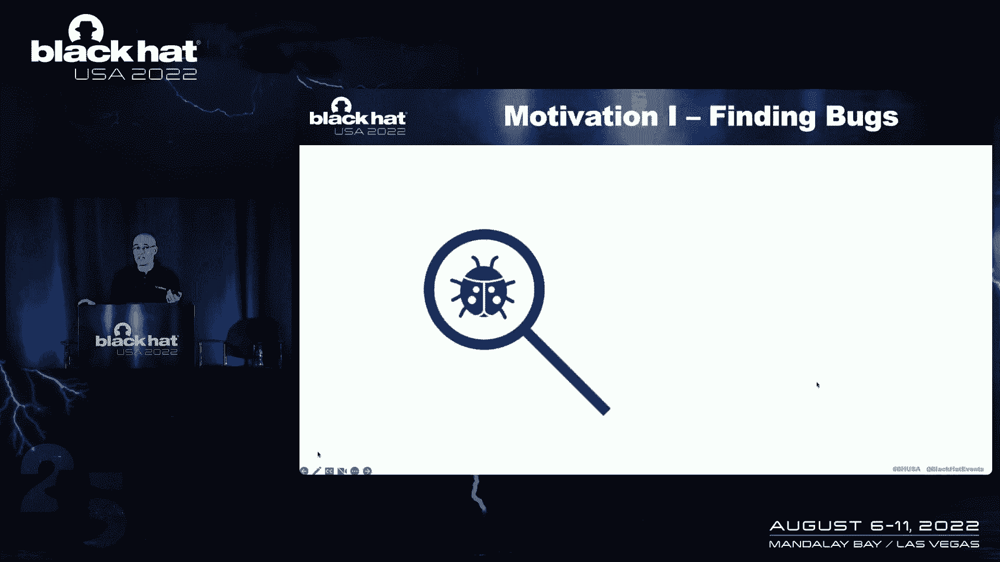
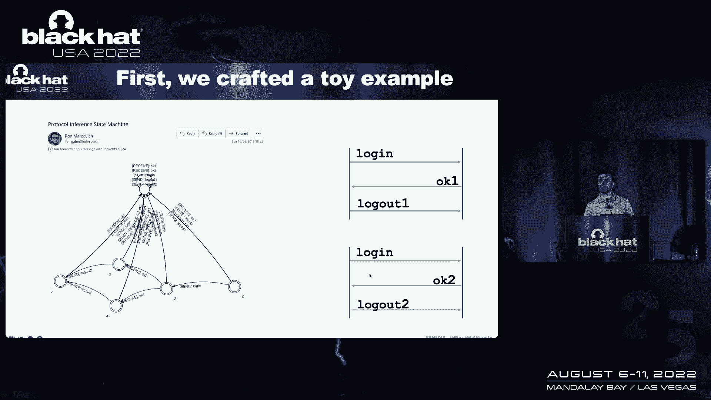
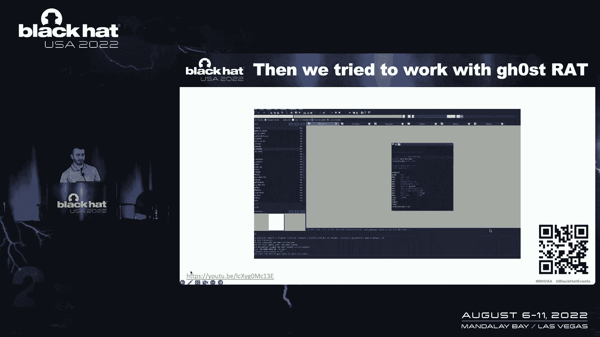
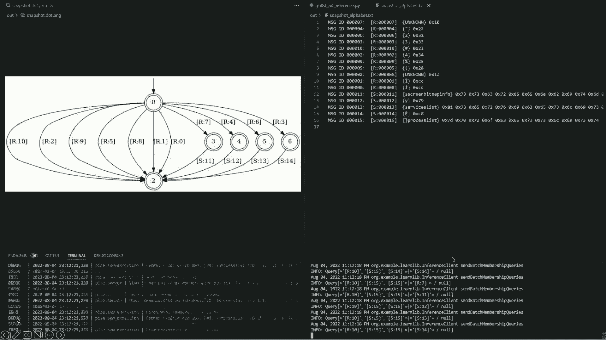
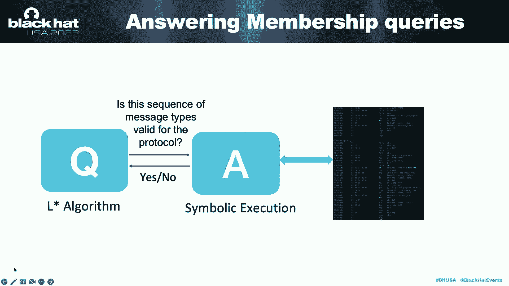
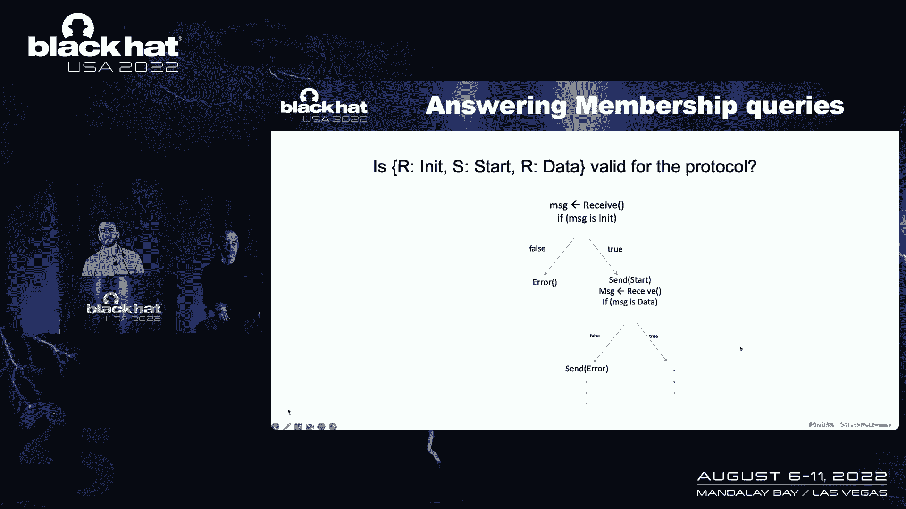
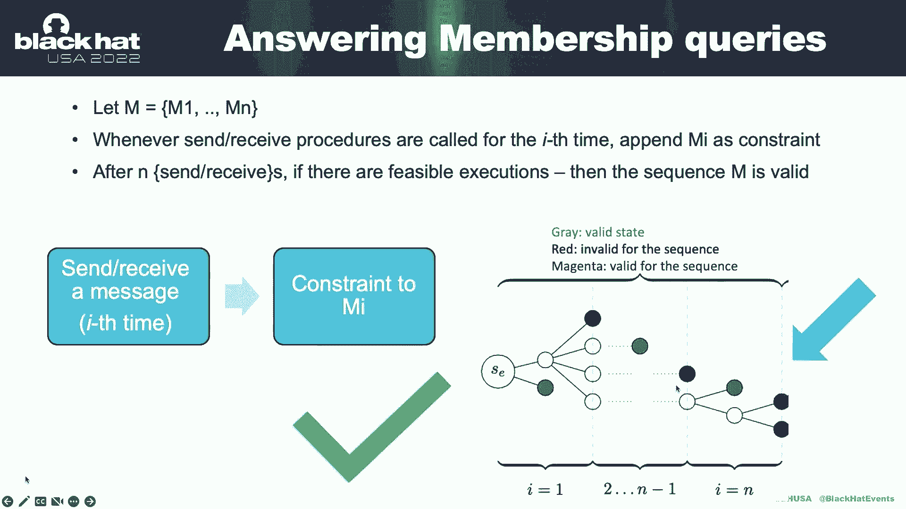
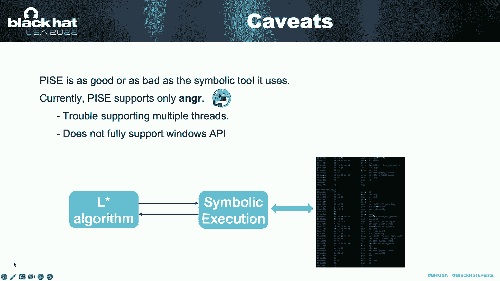
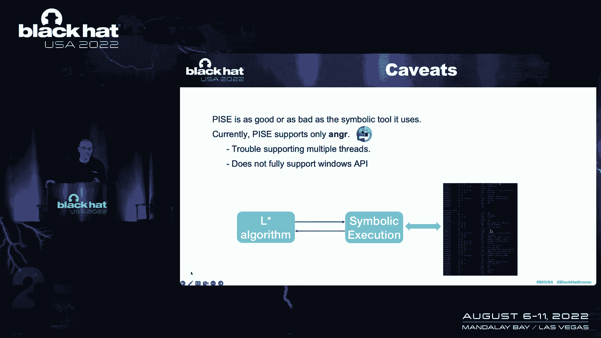
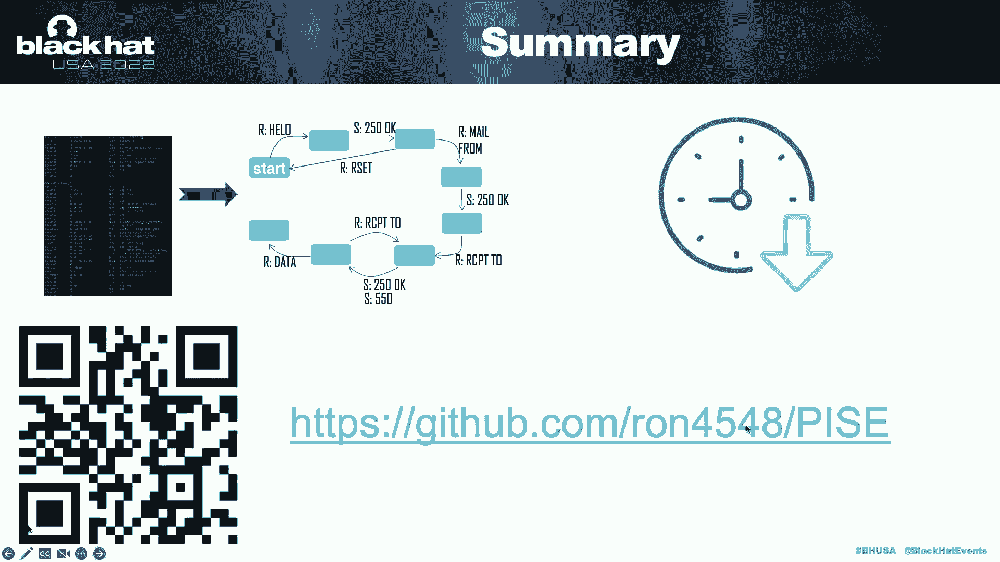

# P14：014 - Automatic Protocol Reverse Engineering - 坤坤武特 - BV1WK41167dt

我很高兴欢迎罗恩·马尔科维奇和。

您是否尝试过执行和分析恶意软件，它希望从远程指挥和控制中心接收命令，却发现此服务器现在不可用，不可用，你也没有该恶意软件过去的流量捕获，所以你真的不知道适合恶意软件的正确命令。

为了让它在那一点上开始做一些有趣的事情，你几乎只有一个选择，就是对恶意软件进行静态反向工程，非常手动，这是一项需要大量时间和精力才能弄清楚的任务，恶意软件的通信协议是什么，今天，我们提供给你。

是一个工具，将帮助您自动提取恶意软件的通信协议，或任何其他直接从它的二进制可执行文件，所有的权利，所以和每个人在一起，我叫一个马克维奇，我是技术学院的硕士生，所有这些研究都是我论文的一部分，这个。

我是加宾·凯利，我是高级建筑设计师，技术和劳伦斯主管，我也是Roer的杰出研究员，以前我是国家研究之城，Laboratrafael和斯坦福大学访问学者，如果没有我们的第三个合作伙伴，这项研究是不可能的。

技术学院的格林伯格教授，好的，所以我们今天的议程，首先，我们将讨论什么是协议逆向工程，以及为什么这是一项重要的任务，然后我们将讨论什么是a，并向您展示一些演示和示例，最后。

我们将谈谈披萨是如何发挥其魔力的，好的，让我们从动机和背景开始什么是协议逆向工程，所以让我们把，比如说，英语会话，和，假设你想学习用英语交谈的规则，现在让我们假设你不认识一个英语单词。

你不是真的想从零开始学英语，你只是想学会在正确的时间背诵句子啊，为了能用英语交谈，比如说，你只是想知道，用高音或低音开始英语会话是合适的，如果有人问你，你好吗，一个可能的答案是好的，不是，比如说。

星期二，好的，所以协议逆向工程就是学习对话的规则，但我们学习的对话规则不是两个人之间的，但是在两个程序之间，两个程序之间的对话规则被称为协议，这是一个名为轴表示状态的协议的示例。

每个状态表示程序期望接收的消息，或者派人去那个特定的庄园，比如说，下面是服务器端FTP和状态机的部分视图，在这里我们可以了解到，处于初始状态的服务器希望接收，和低信息，这是收到的列。

然后在下一个状态下它应该发出250好的信息，然后在第三种状态下如果他们收到两条消息中的任何一条，来自或重置的邮件，并根据实际消息，他们会收到的，它会把他们转移到下一个状态，另一个重要的信息是消息格式。

例如，我们想知道收到的两条消息，实际上我们收到的所有以角色开头的消息，然后是空白，然后两个，然后是列等等，等等，所以当我们说可执行文件的协议逆向工程时，我们实际上是指学习协议状态机。

以及由该可执行文件实现的协议消息格式，好的，所以现在我们明白了什么是协议逆向工程，让我们来谈谈，我们为什么要做这个第一个动机是寻找bug。

并非所有的程序都是完美创建的，它们是协议中的实现bug，您可能会错误地实现协议，让我们看一个例子，假设有一个客户机与服务器对话并向其发送一些数据，另一个服务器，我们将需要停止接受完成消息后的数据。

假设服务器中有一个bug，它将在完成消息后接受数据，因此，攻击者可能会利用此bug，所以基本上我们想发现这样的虫子，一个选择是简单地做测试，这很好，但是测试通常不会覆盖协议的每一个状态和所有的角落情况。

所以另一个选择可能是协议逆向工程，这意味着从程序中提取协议状态机，然后将其与预期的协议状态机进行比较，看看有没有出入，另一个动机是寻找后门，让我们举一个例子，攻击者在您的软件中植入了后门。

现在使用巧尽心思构建的命令，它将获得访问，好的，所以很明显测试不会发现这个bug，因为特殊命令不是协议的一部分，对呀，所以发现这个向量的一个选择是做协议逆向工程，从程序中提取协议状态机。

然后看看是否有不应该存在的奇怪命令，这是另一个动机，前面提到的是分析恶意软件，假设你有一个恶意软件，你想给它喂正确的答案，正确的命令，为了让它做一些有趣的事情，停止玩它，并分析它，所以你需要做的。

您需要知道它所期待的命令，为此，您可能需要进行协议逆向工程，并了解恶意软件需要哪些命令，所以希望你现在明白了协议逆向工程也是一项重要的任务，但不幸的是，逆向工程也是一项艰巨的任务。

因为这是非常手工的过程，它只是打开了一个逆向工程，像IDA这样的程序，开始分析实际的二进制文件，一点一点地找到确切的通信协议，这是非常困难和耗时的，可能需要几天甚至几周的时间，取决于可执行文件的复杂性。

所有的协议实际上都在我在国家研究中心的最后一个职位上，我见过许多研究人员在这个完全相同的问题上苦苦挣扎，它很沮丧，令人沮丧，他们花了很多时间来做他们的工作，这实际上是他们最初激励我们进行这项研究的原因。

我们的目标很简单，给定一个可执行文件，我们想，尽可能神奇地自动地，从，我们也有一些关于非假设的假设，为了把研究做得尽可能实际，首先，我们不假设我们有过去的交通捕获，这意味着我们甚至不知道协议的合法信息。

这就像学习英语会话的规则，非假设是我们不假设我们有一个活跃的协议码头，这意味着有一个远程可执行文件将与我们的可执行文件对话，比如说，在模型案例中，数控服务器坏了，它将不再与恶意软件通信。

所以在我们的类比中，我们只有一个说英语的人，我们假设我们没有可执行文件的源代码，我们只能依靠二进制代码，如果你喜欢，在我们的类比中，我们想学习英语会话的规则，通过简单地窥视说英语的人的大脑。

现在你明白我们的研究是关于什么的了，让我们看看底线，看看运行中的工具，所有的权利，谢谢你Gabby现在你知道什么是协议逆向工程了，让我们讨论我们工具的开发并看看它的实际应用。

所以当我们刚开始这项研究的时候，我们创建了一个非常简单的玩具示例，这个示例基本上是一个实现非常简单协议的客户机，在本协议中，客户机只需向服务器发送登录消息，然后根据服务器的响应。

要么是OK 1要么是K 2响应，我们要么注销一个，要么退出，我们开始手动对这个客户进行逆向工程，然后我们一步一步地自动化这个过程。

这是一封来自对时间的电子邮件，呃，我们的方法可以反向工程这个客户端的协议，但后来我们想做一些更现实的东西，所以我们和，和一个我们在网上找到的smtp客户端，并分析了它的协议。

在这个过程中，我们还开发了几个优化，以提高我们的方法的性能，是的，是的，这是从第一次，我们的方法可以对SMTP客户端的状态机进行反向工程，我们的方法还可以为这个客户机反向工程消息格式。

所有这些信息都只从客户机的二进制文件中提取，是啊，是啊，但后来Covid来了，观众中有没有人不知道今天的缩放是什么，继续这项研究，想用一些更现实的东西来工作，我们寻找一个老鼠或恶意软件，我们可以使用。

Rat是一种远程管理工具，它是由攻击者安装的，然后它允许他们远程控制机器，幽灵昂首阔步就是一个例子，它是一条非常著名的路线，我们在那里申请，我们在这条路线上应用了我们的方法。

所以让我们看看我们的工具在行动。

首先，我们在发送和接收二进制消息的函数中手动标识。

稍后将讨论为什么这很重要，然后我们，呃，我们创建了一个Python代码段，该代码段使用我们的工具提供，二进制文件上的信息以及发送和接收消息的过程，我们的工具是由一个服务器组成的。

该服务器直接与二进制文件交互。

和实际学习协议状态机的客户端，所以当我们启动客户端和服务器时，学习，协议的逆向工程发生，正如你所看到的，状态机是一步一步地学习的，以及您可以在右边看到的协议的消息类型。

现在，这是一个时间推移，但整个过程花了两分钟，这项工作可能需要几个小时甚至几天，我们的工具做两分钟，所以说，是啊，是啊，所以在这里，这是幽灵小跑协议的最终状态机，这个过程可能需要几个小时，偶数天，呃。

拿了工具，呃，表演两分钟，所以嗯，一旦我们知道什么是原始逆向工程，一旦我们看到工具在行动，我邀请Gabby讨论到目前为止的内部工具，好的，我希望你印象深刻，对吧，向右两分钟，那是，而不是两个星期，好的。

所以让我们看看魔法是怎么做到的，好的，所以我们的工具实际上是由两个组件组成的，客户端和服务器，或者两个或一个问题组件和一个回答组件，客户机是问题组件，这是将状态机，它学会了，但只是问问题。

它是基于一种算法算法，称为算法，它就会，我很快就会描述的，回答他们的部分就是回答，这个组件，它是基于符号执行，这是服务器，好的，让我们来谈谈，问题部分，算法，这是一个自动学习算法，粗略地说。

只是一个将状态机，好的，它是建立良好的协议算法，那是，1987年由达纳·勒提出，它的目的是识别一个未知的正则集，从成员和非成员国的例子，在我们的情况下，在正常的集合中。

只是协议允许的所有消息交换的集合好的，它本质上是使用协议来描述的，协议状态机，它通过简单地找到这个集合的成员和非成员的示例来学习这个状态机，换句话说，它只是问这种类型的问题，是给定的消息交换。

议定书所重视的，算法只是一遍又一遍地问这样的问题，它假设有人会说话或什么东西可以回答这样的问题，根据这些问题的答案，然后它会构造更多这种类型的问题，然后它将一点一点地学习协议状态机。

现在算法不会深入到它的细节，但它非常聪明，非常高效，所以它不需要询问每一个或每一个消息交换，为了获得状态机的完整视图，问题的数量就像它所说的那样，因为它们被称为成员资格查询，它的成员查询数。

它会问的只是一个多项式，在议定书的数目和国家中，例如，如果你回到英语会话，如果算法现在喜欢学习英语对话的协议状态机。

对话的规则，它会简单地问这种类型的问题，这段对话有效吗，在打招呼，然后收到一个低，然后说，你好吗，我很好，这是有效的英语会话吗？它再次假设某物或某人可以回答这个问题，答案应该是肯定的，另一个问题可能是。

这次谈话有效吗？嗨，你好，你星期二吗，那就是，当然应该是不，客户端发送任何消息的协议，服务器发送开始消息，然后服务器接收数据并完成，假设最好的算法，我想，我学习了该协议的协议状态机。

所以它会简单地问这种类型的问题，比如说，服务器可以接收init消息吗，然后发送开始消息，服务器可以背靠背地接收两条init消息吗，好的，这类问题并基于那些，这些问题的答案。

然后它将一片一片地收集协议状态机，但是这里有一个问题，当我解释的时候，到目前为止你注意到了吗，我们的假设，我们的基本假设，我们不知道协议的合法信息，那么算法怎么能询问这些消息的序列呢。

如果它不知道实际的信息，这就是问题所在，所以让我们说，为了算法的阐述，让我们假设我们确实知道协议的信息，然后我们会放松这个假设，向你展示真正的算法是如何工作的，所以总结一下算法的问题部分。

关于简单提问的问题，是对协议有效的给定消息类型序列，不管是不是为了协议，它希望收到是或否，回答这些问题的部分是基于象征性的处决，这是我们唯一的部分，在我们的工具中，它与实际的二进制可执行文件交互。

符号执行的组件，简单地尝试在可执行文件中找到有效的执行路径。

与信息相对应的，到问题组件询问的消息序列，如果有效，则对应于手头消息序列的执行路径，那么答案应该是肯定的，否则应该是没有，now run将深入研究应答组件和符号执行。

所有的权利，所以再次谢谢你，Gabby，嗯，所以让我们讨论一下什么是象征性的执行，符号执行是一种静态分析方法，它是一个非常强大的，但在我们的情况下，它允许我们，是啊，是啊，所以说，象征性执行。

在我们的情况下，允许我们探索二进制的执行，遵循一组给定的约束，当我们谈论约束时，我们指的是程序输入的约束，嗯，让我们看看，比如说，呃，这里，程序输入是，呃，插入变量x和y，输入是A和B。

所以如果我们想找到所有匹配的处决，a大于三的约束，那么符号执行引擎将找到这两个执行，但是如果我们也加上一个约束，b等于2000，七百八十九，那我们就只剩下这一次处决了。

那么我们如何使用符号执行来实际检查，如果消息类型序列对协议有效，我们分析，所以让我们看看我们怎么做，嗯，假设我们得到了初始化开始数据的序列。

然后程序从网络接收消息，然后我们添加约束，即此消息是其中的类型，这边，符号执行将丢弃不遵循此约束的执行路径，我们现在只考虑程序的真正分支，然后当程序发送开始消息时，我们将消息限制为Start。

符号执行表示编程确实发送了一个start方法，并恢复此执行路径，然后当另一次调用接收时，我们将其限制在第三条消息上，即接收数据，使符号执行只遵循执行路径，其中接收到的消息实际上是数据，这样。

我们就留下了执行路径，遵循消息类型序列的约束，我们可以说序列对协议有效，现在，让我们看一个例子，说明如果序列在协议中无效会发生什么，当第一条消息，当我们被问及最初接收数据的顺序时。

符号执行插入接收消息的此约束，然后真正的分支被丢弃留给我们一个错误的执行，这边，我们知道行刑，没有遵循消息序列的二进制文件的有效执行，我们得出结论，该序列是无效的，所以要把这个正式化。

假设我们得到了一系列消息类型，然后每当程序中发生发送或接收，然后我们添加约束来匹配这个，匹配适当的消息类型，因此我们，我们实际上可以把它作为所有处决的修剪树来说明。

当我们最终只剩下按照这个顺序执行的处决，如果在这个过程结束时，我们至少剩下一个遵循约束的有效执行，那么我们可以说该序列对协议有效。

还记得我们说过我们将消息约束到序列，我们得到了，我们怎么做好，为了做到这一点，我们需要拦截象征性的执行，每当调用二进制文件的传感器接收过程时，因此，我们需要使用我们的方法。

手动标识实际发送或接收消息的过程，在这个例子中，这是SMTP示例，它是smtp right函数，将一行写入套接字，或者从套接字读取一行并接收消息的smtp get行，所以是的，这是我们方法的用户的要求。

但是有一个问题，还记得我们说过我们事先不知道协议的消息类型，所以我们需要发现它们，我们怎样才能做好那件事，我们扩展了方法的符号执行部分，并说每当一个序列对协议有效时，它还将返回一组消息类型。

这些类型可以遵循顺序，给定，该算法还进行了扩展，以便收集消息类型集，一步一步，因此，消息类型集实际上是动态学习的，让我们在一个例子中再看看，因此，假设符号执行验证了其中的接收序列，最初。

所以我们只剩下真正的树枝了，然后我们等着看什么消息类型可以遵循序列，所以程序然后发送数据消息的符号，符号执行引擎有一个特点，让我们可以得到例子，获取该消息的值，所以我们要做的是。

我们得到了在序列之后发送的消息的示例，我们稍后将讨论如何处理这些示例，但让我们看看另一个例子，所以如果我们得到init和start的顺序，我们想知道什么消息类型可以遵循这个序列，嗯，好吧，再次。

我们只剩下执行对这个序列的约束，并等待程序井中发生另一次发送或接收，接下来发生的事情是程序接收到一条消息，但我们不能像刚才那样发送信息，因为接收到的消息是一个符号值，不知道。

我们需要在这里做一些其他的事情，我们所做的是让要传递的消息由程序传递，一旦消息传递，正如您在本例中所看到的，程序检查消息的某些特征，然后象征性的处决很清楚，如果我们处于这种情况的真正分支。

消息必须以标识为数据消息的下划线开头，所以我们实际上等待消息传递，只有这样，我们才能从符号执行引擎中获得示例，对于接收到的消息的可能值，所以它不是它不是完全未知的，但请记住，我们得到了一组例子。

为了那些消息。

我们需要从这些示例中得出一个消息类型，所以有很多方法可以做到这一点，一个对我们有效的简单方法是简单地找到所有消息的共同特征，表示公共字节，所有消息值相同的字节，在一组示例中，通过这种方式。

我们使用消息的公共特性来识别接下来的消息类型，让我们看一个例子，所以假设我们得到了这组例子，我们看到，所有这些消息的共同特征是接收到消息的格式。

收到，空格到冒号等，等等，所以其实，我们将用这种格式来描述接收的消息类型，所以要绑在一起，我们刚刚讨论过我们的算法使用L星，以便询问消息类型序列在协议中是否有值，符号执行首先验证序列是否有效。

如果序列有效，它还提供了可以遵循顺序的消息类型，算法，然后给我们一组消息类型然后一步一步地学习，所以让我们看一个说明性的例子来总结这一切，假设l star算法询问这个空序列在协议中是否有效。

在大多数协议中，实际上在每个协议中，空序列被认为是有效的，象征性的执行将回答TS，这个序列是有效的，和一条消息--可以遵循顺序的消息类型是接收init的，因此，它被添加到消息类型集中。

然后L算法询问在其中接收是否是有效的序列，象征性的处决回答是的，它是一个有效的序列，可以遵循此序列的消息类型是星形数据和芬兰语，然后它问它开始是否是一个有效的序列，符号执行回答这是一个有效的序列。

并且可以遵循的消息类型集是已知的，已包含在消息类型集中，然后它询问最初接收数据是否是有效的序列，象征性的处决会回答不，它不是一个有效的序列，询问无限和数据是否是有效的序列，是呀，它是一个有效的序列。

一次又一次，消息类型集没有显示任何新的内容，然后询问数据和完成中的序列是否有效，和象征性的执行答案，是呀，这是一个有效的序列，但是没有可以遵循此序列的消息类型。

所有的权利，这就是我们方法的内部，我现在再次请Gabby总结和结束，谢谢。好的，谢谢罗布，嗯，所以在我们总结这个工具的一些警告和限制之前，正如你所看到的，我们的工具与二进制可执行文件交互的唯一方法。

使用符号执行，这意味着我们的工具和符号执行引擎一样好或一样坏，我们使用它目前使用的，p只支持一个名为anger的符号执行引擎，这是一个很棒的工具，它做了很多伟大的事情，嗯，然而，它确实有它的局限性。

比如说，它在支持多线程方面有些困难。

并且不完全支持Windows API，这意味着两个，还有披萨工具，这绝对是我们未来的工作，以扩大或获得和平支持，而不仅仅是符号执行引擎来支持工具，更多类型的可执行文件，总而言之，你刚刚看到了一篇文章。

工具，这将允许您自动提取通信协议，并从可执行文件中，从而急剧增加，减少你所需的时间，分析恶意软件或任何其他可执行文件，它可能需要几分钟而不是几天甚至几周，因此，我邀请您下载该工具并访问回购，开始玩它。

