# 【转载】Black Hat USA 2022 会议视频 - P15：016 - A New Trend for the Blue Team： Using a Symbolic Engine to Detect Evasive F - 坤坤武特 - BV1WK41167dt

下午好，大家好，我是来自One的Morris，欢迎来到会议的部分，我们将讨论我们是如何提出一种新的批判性方法的，价格和执行，有效检测各种恶意行为和勒索软件，我们后面提供的引擎。

可以克服当前静态和动态分析的一些瓶颈，这也是我们所认为的，这是未来蓝队的新趋势，我是火星，我目前是TS One产品计算和过去研究的经理，我经常在大型会议上发言，com或会议。

但这是我们团队第一次在美国舞台上分享，我们很荣幸，和我的同事们，他是TX One网络的认真研究员，他还专注于Windows攻击技术和研究，哦，畅销书的作者也是，除非一个人被绞死，也是一名研究员。

它需要一个网络，是一个CTF玩家和一个专注于主要方式的人，研究与窗口安全，在今天的网上，我们将开始新的景观，讨论目前静态和动态检测的局限性，下一个，我们将展示为什么我们使用符号执行，我们的想法从何而来。

我们的引擎在哪里提供什么功能，最后，当我通过现实世界的样本，我们将使用勒索软件常用的技术，作为样品，比如CC 32，他们准备好了，装载机和工艺，Hallo和数千个勒索软件的税率为基础。

最后是我们的工具让孵化以一种更社区的方式运作，和第一次介绍，供以后审查，我们知道男性工资有很多种不同的恶意软件有不同的行为，但它们对系统都有不同的影响，但今年最近，我们注意到。

对各种垂直方向产生巨大影响的原因，所以我们想帮助我们的防御队都带来了强大的层防御勒索软件，我们也注意到并吹捧许多人想象兰斯通学校团体正在起飞，如此幸运的伯爵，和缓刑攻击，呃，在不同的时间点逐渐增加了它。

当然，在我们的观察中，什么叫声仍然是最高的，鸟类数量逐渐有法令规定，也适用于我们准备的那些复杂的勒索软件，我们为这些不同的原因准备了一个比较，我们想知道什么样的行为，所以你可以看到我加密的不同方式，呃。

他们有一个语言跟踪您的过程，持久性，以前的收集和恢复等行为，还有成功，或者像两点零，它们非常复杂，但或几乎超过了技术，但我们知道，由于关键点被解雇的原因，Land具有部分加密或完全加密。

我们可以根据这个来判断原因，我们有行为，看路是如此复杂，在实践中是如何检测的，传统签名基写序列，基于启发式基础的API代码的汇编指令和行为列表，这段代码是为图形而来的，有许多行为方式。

如系统应对的行为序列，但它们都是不同的问题，什么限制或进步将被计算在内，比如说，签名库将需要一个非常大的签名数据库，很难在行为上很好地击败样本，基于动态执行被绕过的更高风险，这也需要很多时间来扫描。

代码库也需要实时连接互联网，所以有不同的问题，困难的问题，E和超脱的问题，所以选择这样，无论是静态的还是动态的能量分析，动态耗时扫描，更新签名的需要，无法识别变异，和样本。

和其他令人难以置信的进步是我们想要解决的问题，但我们也试图不仅判断恶意，在活页夹中有更多的洞察力，我们想探测它，所以让我们分享我的头，首先在我们的方法中，之前有三项研究表明蜘蛛，非常感谢他们的贡献。

他们提供了许多想法来建立我们的，呃，完成我们的研究，所以2005年的第一次，它是一个轻量级的更多与模板，提出了基于数据参考关系的，这是非常，呃在当时是一个很正常的概念。

但不幸的是这项研究并没有发布任何可以用于蛋白质的工具，看看这个概念，提出迟来的种类不能用来解决样品的问题，在某种程度上，二千零一八年的开始，研究人员使用隐马尔可夫模型来识别观察样本的问题，但它是嗯。

如果参数太少，它不可能是分析分析，呃，并不是所有的API参数都有很多使用功能，所以有一些让我们为以后的研究做一些限制，到后面，最后一次是在2000年，语义通过中立网络方法。

它可以在语义标签处检测变体样本，但不幸的是，他们闻到了人有车床扩展的能力，为什么被认为是一种变体，至少是更多的研究，更适合分类，基于那些智慧和那些研究，我们还总结了我们的人基于移动分析引擎的符号执行。

及其语义库和指令标签的类似连接，语义和各种模块的组合，我们可以在更多的二进制中有效地识别技术内容，那么为什么我们什么是象征性的问题，为什么我们选择这个作为更多的执行。

是一个利用上游符号分析计算机科学领域知识的程序，而不是提取值，作为程序信息变量，并得到各路径的输出结果，你可以看到的程序是通过符号执行的，所以在这里我们可以看到h较大的门路径被审问，并设置为分析的约束。

到程序集，但我们知道执行力非常强大，但要不是抵押贷款，基本的恶意行为大多是滥用API，所以我们只想，我们只关注从主函数到Win的两个函数的数据引用过程，它是参数，所以API和参数之间的关系。

我们可以使用指令标签库，呃，评估各种行为是非常有用的，我们稍后会这样做，当我们使用象征性处决时，我们注重利用轻量化与轻量化零件扩散的关系，这是周长函数之间关联的解，这足以解决更多分析的问题。

所有静态分析的风险都很低，而且没有被机动性绕过的风险，并基于语义分析，假阳性，假阳性非常，非常低，所以整个土地，呃所有，呃，可行的，他们是非常可行的，我们可以用，他们什么，这就是为什么我们选择。

对于我们的引擎，为了我们的象征性引擎，有五个模块，我串联起来提供功能，组的控件，模块的函数控制负责传递，的每个控件，呃，代码块帐篷和分析，这个边距负责连接每个参数和函数的关系关系。

标识的指定API对其内容负责，识别的功能，嗯，也是阿卡迪亚样本函数，AlModule负责模拟，编译器他们来了，他们编译空间，所以通过这样的引擎我们可以，我们将骑的是创造一个，呃。

尝试一个象征性的US语义签名作为规则，并将其输入发动机，连同要扫描的目标，结果可以在很短的时间内得到，而且不仅仅是为了确定它是否恶意，但我们也可以描述一下二进制文件中的恶意行为。

二进制罐头中的二进制罐头，根据规则，我们可以有几秒钟从几秒钟到一分，我们可以很快得到结果是静态和稳定的，关于每个模块和我们实验的更详细的信息，我会交给我的同事说。

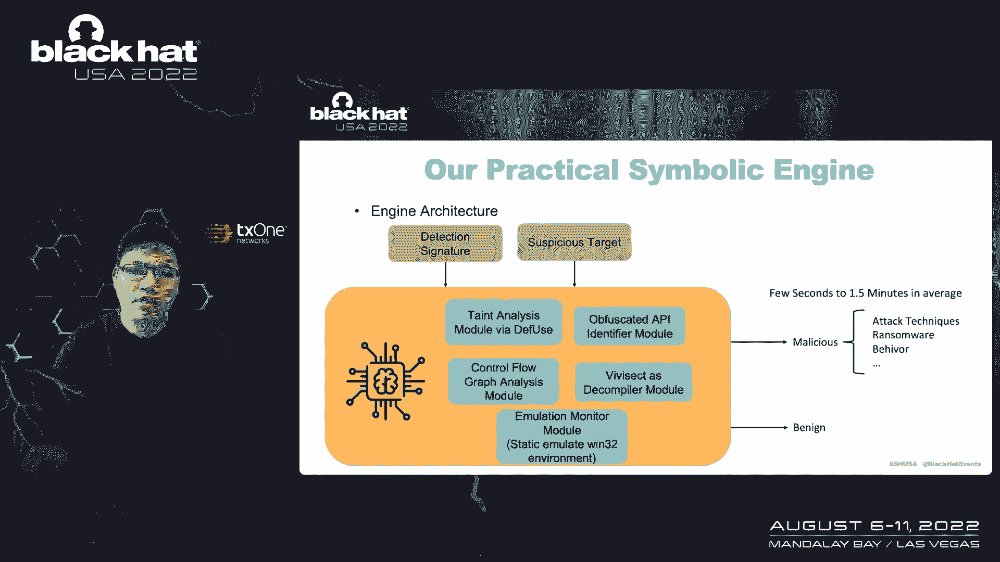

我们有图形的设计控制。

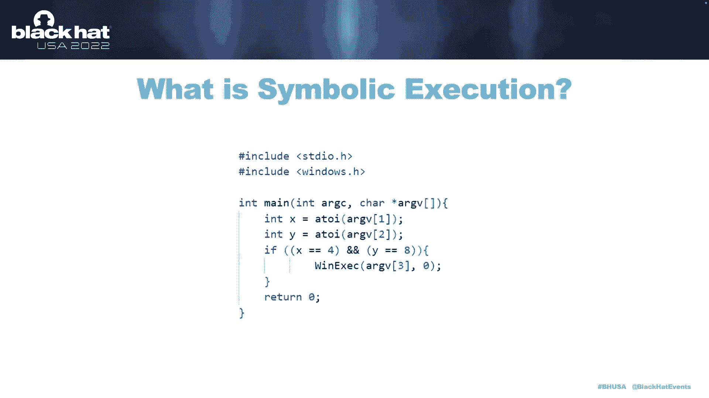

分析引擎可用于将给定函数传递到coblock中，并分析每个装配指令，一个接一个地在椰子椰子块里，另一个设计是棕褐色，分析实际上是我们的，我们的发动机是为了，每个函数调用都不会实现，相反。

将给出一个唯一的值作为每个函数的返回值。

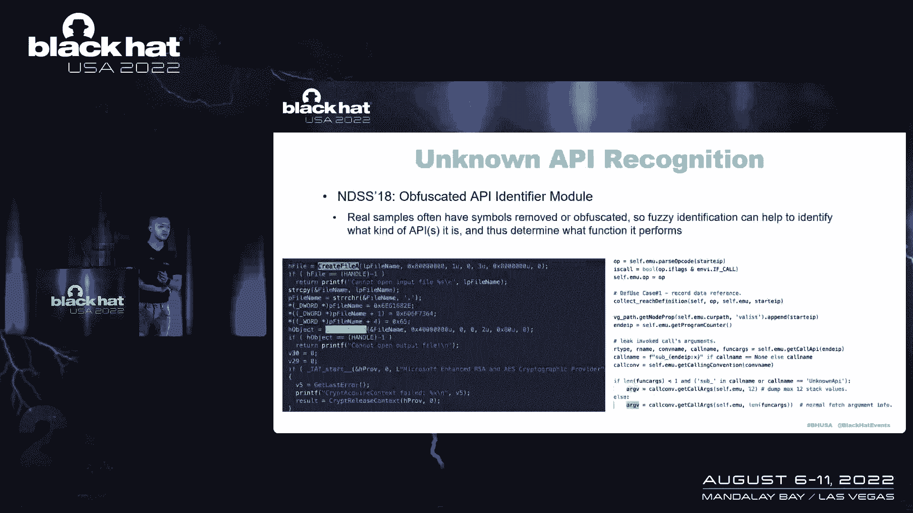

虽然呃，倾向分析是非常强大的，但实际上很多时候很简单，实际上是完全带状符号，在二进制中没有任何nn，所以我们需要克服二进制的问题，二进制文件中没有任何API和函数。

所以我们想用这篇论文的成功来处理这种问题，有可能推断最初的API n，所以如果我们，我们在这个API上遇到了一个我们可以把我们的引擎，我们将转储未命名的API，并且可以用来识别原始API需求，在这里。

我们首先创建了一个简单的原型，用于静态分析原型，静态分析程序文件，并检查每个函数的每个参数，我们可以做很多有趣的实验，比如说，如果我们检查第一个参数表看起来像一个泛型泛型权利。

第三个参数看起来像Create Always。

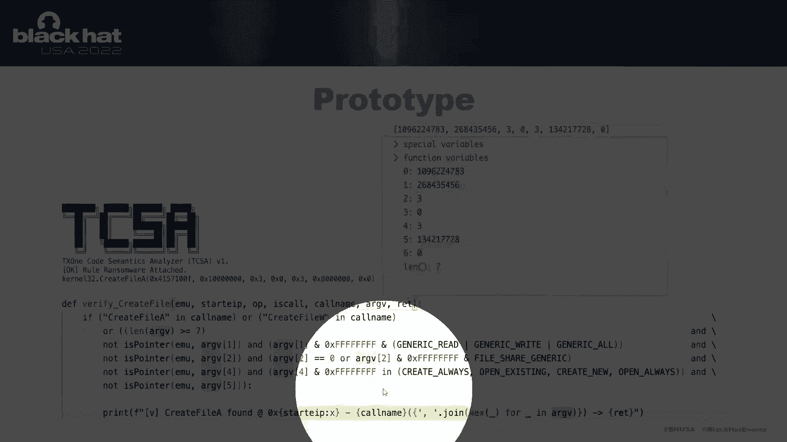

或者打开它，我们可以说语法与创建的文件的形式相匹配，所以我们可以说，哦，它可能是指令可能是这里的创建文件。

所以我们我们用这个原型扫描所有新鲜的样本，在公共汽车上的样本中我们看到了很多有趣的猫，我们拿了其中一个是狂欢，狂欢是一个非常著名的，很受欢迎的RIN井，完全默默无闻，并且二进制文件中没有任何API。

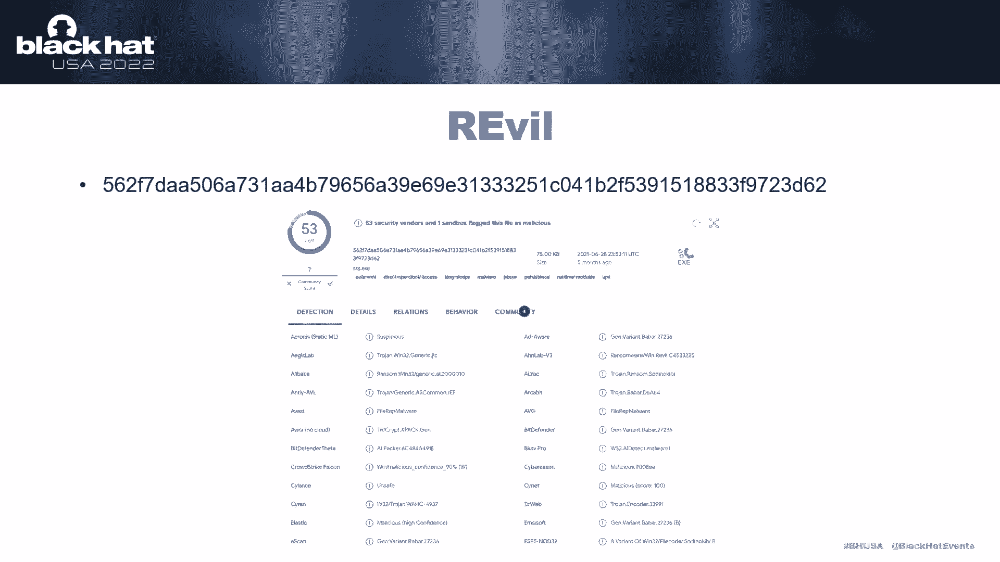

在这里我们知道，展示实际上有一个函数表来记录它在二进制文件中需要的所有API，只有在运行后，您才会看到哪个Windows API在该点内。

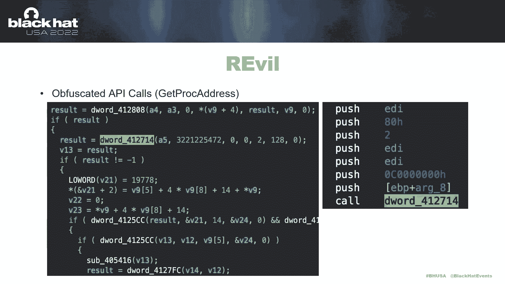

这里有一个例子，你可以看到指针在41 2 7和14。

指针，我们真的不知道哪个API在点内，对呀，但在这里我们的发动机没有在样品中运行错误。

它可以探测到，哦，这个示例只是这里的创建文件API。

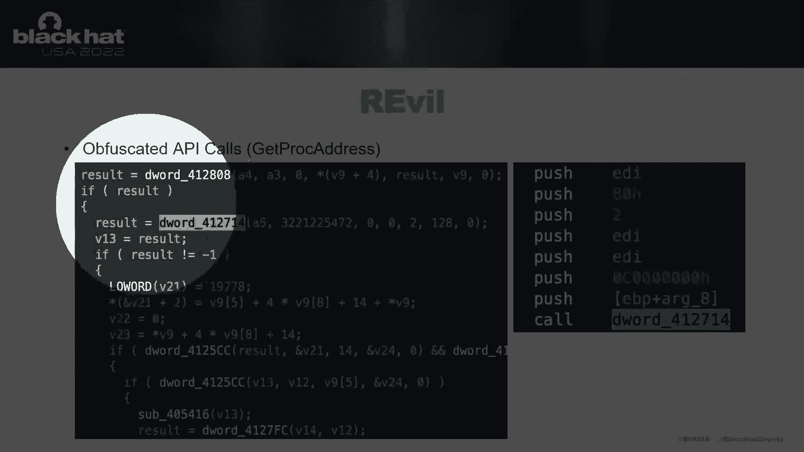

因为根据木桩上的参数。

我们还使用项目Pro对同一个点进行双重检查。

它是相同的功能点，相同的功能点就像创建一个文件或不创建一个文件，所以在这里你可以看到结果和结果，你可以说，哦，这个指针是这个点的返回值，被用在关闭的句柄上，所以我们可以说。

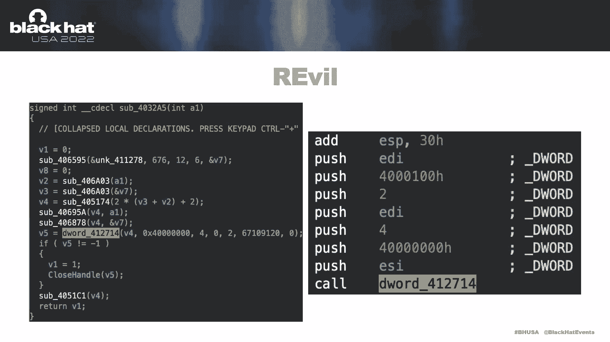

哦，这个API只需创建一个文件，所以呃，在我们的结果中，我们听一张照片，你可以看到我们的原型，我们的原型可以识别所有看起来像，在二进制文件中创建一个文件，随着实验的成功。

我们想把这个很酷的想法变成一个强大的分析引擎，帮助研究人员处理这种如何解决的问题，马里到野外，我们的引擎T R T X一个叫做语义分析器的，它将Viv集构建为反编译引擎，任何研究人员都可以。

可以给我们的引擎一个程序文件，引擎将在二进制中传递这个二进制的每个函数，并对每个函数逐一分析每个装配指令，同时，您将规则的复制功能，您将收到一个事件，内存集和地址，同时，所以实际上你的角色。

你能知道大量的特殊API或内存管，呃，牛排或任何可疑行为，只是在你的规则下面有趣，这里有一个简单的样本，你可以看到，我们写了一个很简单的复制函数在这里只打印出来啊，传递过程中的装配指令。

如果指令有API，这是这里调用的一个函数，此指令具有函数名，我们可以打印出函数，这里也是所以结果你可以看到这里我们可以说。

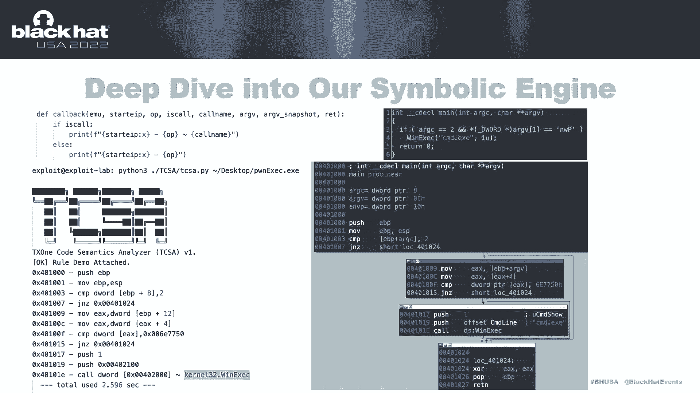

哦这个节目，我试着使用API，我们执行。

我们执行API来运行某种exe文件或其他文件，除此之外我们可以说，该规则还可以获取每个函数代码的参数数据。

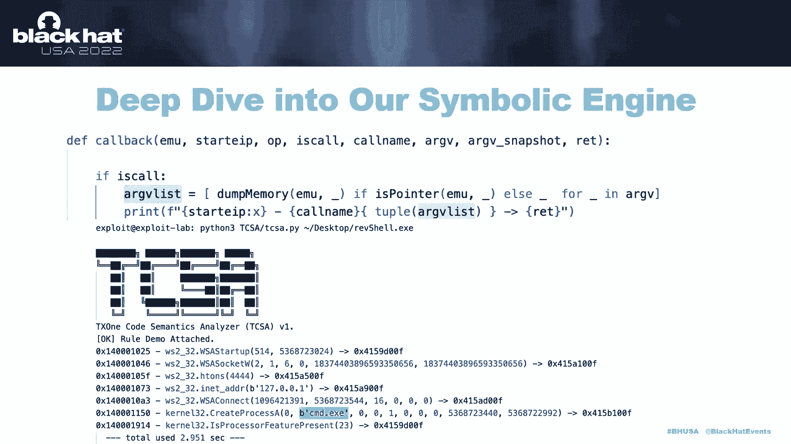

所以这里有一个样本你可以说，哦这个坏了，我试着利用创作过程。

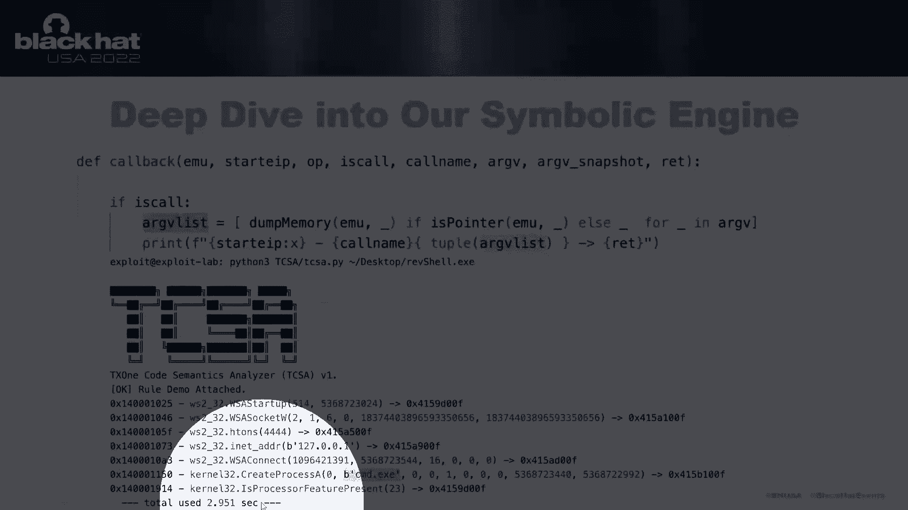

这个API运行某种可执行文件，如C和D，这个程序尝试使用创建一个文件并在这里创建一个新的CMD文件。

但在这种行为之前，你可以看到这个程序文件，尝试使用WSA连接到远程。

因为这样基于冷淡的关系，你可以说，哦，这个程序文件有能力做反向反向反向外壳，我们的引擎是纯静态的，但是仍然需要实现大量的API，否则程序将不能作为进程正确运行。

例如，就像我们所知道的，就像长库，获取处理器地址并获得整整九点。

大多数API是作为进程运行所必需的，所以我们在一个环境中，我们做必要的影响，在我们的环境中实现必要的API，所以这里的每个人都可以写我们的tr规则。

每个tr规则都有这三个复制功能科尔伯特在你的眼睛里清理。

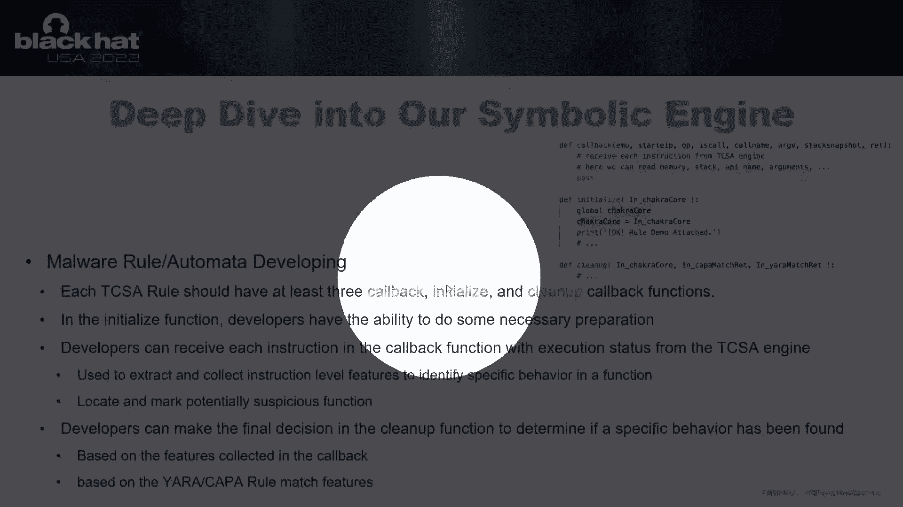

在你的统治下可以在眼睛里做必要的准备，也是您的规则可以接收关于读取汇编指令的事件，一个接一个的每一个函数，所以你的规则实际上可以记录这些特殊的行为，指令标签中每个函数的所有可能行为。

然后TR引擎分析所有的函数和调用函数，规则的clean函数将接收一个事件，同时引擎会发送一个关于Yara规则的信息，夫妻规则可能会导致，所以你的规则可以你的角色可以对这个项目做出最终决定。

所以在这里我们想展示很多演示，关于CC散列的值得注意的演示，反光装载机和工艺万圣节和租赁者，这种攻击被广泛使用，非常受欢迎的一个，被编辑人员广泛使用，所以我们想。

特别是我们想解释如何使用我们的tsr引擎来晒黑，所以他从一个非常基本的例子开始，像CSC哈希，正如我们所知，如果您给CSC哈希CC哈希函数一个红色的数据，您将收到CC哈希哈希函数，会嗯会读。

将从数组中一个接一个地取出数据。

用公制数做XOR行为。

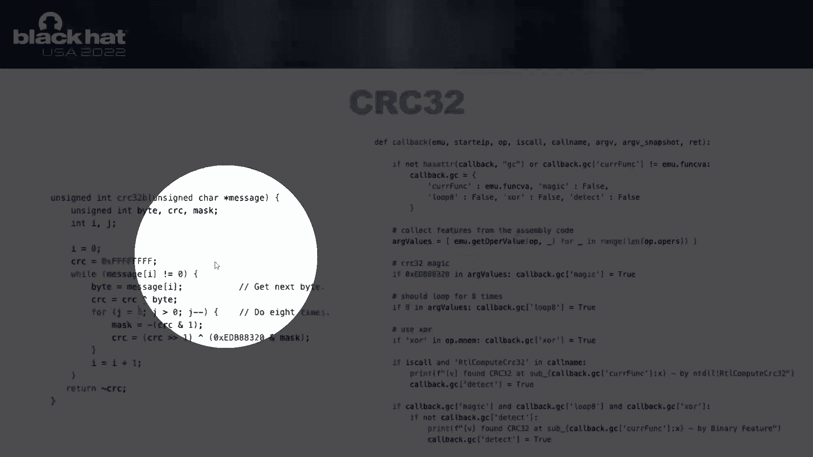

E D是为了做韵律数，做X或八次，所以说，如果我们的规则能看到，哦，二进制中有指令，试着用神奇的数字，EBD在一段时间内做X或某种数据，这样我们就可以确保，哦，这绝对是一个CC哈希行为，就在那里。

所以这里有一个简单的，在结果上你可以看到，哦，牙齿是发动机检测，有CC行为。

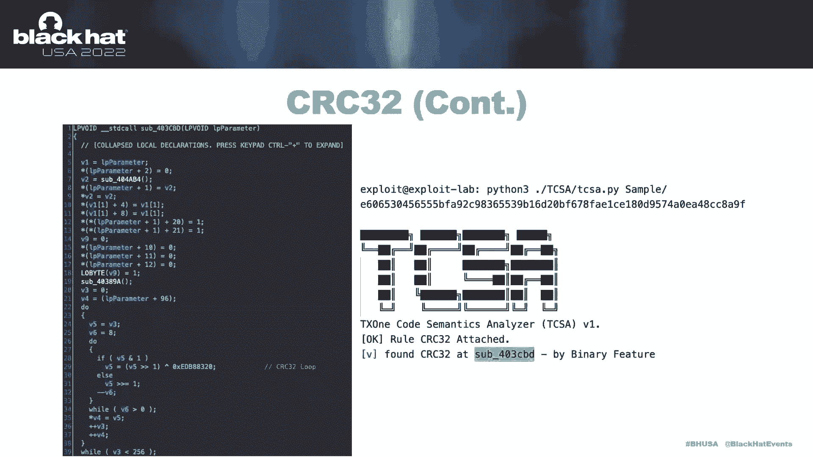

就写在Atlus上，在你所看到的结果上。

这里真的是一个CC计算，但是我们知道CC哈希非常简单，对，这是非常简单和明显的检测，所以我们想介绍另一个更复杂的，是指装载机和呃，攻击者，通常使用反射顺序将DLL作为Shainto远程进程进行注入。

和这个技巧到高过程，所以高度恶意软件本身，所以也指装载机是高度变异的，非常棘手，对于一个典型的模式，这里是反射装载机的三个步骤设计--首先是，它将尝试传递其可选标头的图像大小，在它的记忆中。

以确定需要分配给多少空间，将整个模型二进制文件存储到内存中，第二步就是，传递其宇航员头的数据字典，以确保修复mali的指针表，获取函数指针地址，最后一步是传递其可选标头的入口点地址，看地址。

Mali唤醒恶意软件二进制文件的输入功能，所以一块钱，我们来设计一下，这是这里反映的顺序，只需三步设计，在这里，一旦我们知道装载机的设计，所以我们可以写一个tr引擎规则，检测层的TSR规则。

引用行为的负载在这种二进制中或不在二进制中，例如，在这里我们可以，我们可以说，哦，如果我们检测到某种指令，让我们啊，那里的指示，只是想比较一下，呃，某种带有神奇数字的数据，p或mz，我们可以说，哦。

让我们肯定地试着看看新兴的哈德结构，在它的记忆中，所以我们可以把这个特殊的结构列入观察名单，在下面的代码中，如果有，尝试使用以下任何代码，使用悬挂的，在观察名单中，喜欢用这样的。

例如使用带有观察列表中图像大小的虚拟定位，我们可以说，哦，它试图将某种恶意软件二进制文件挂载到内存中，或者你试图通过观察名单中的重要词典，我们可以说它试图修复，这张桌子对男性很重要。

或者您试图传递入境点的地址，我们可以说，哦，它试图醒来看看入口功能，唤醒更多的二进制，所以一旦我们的规则在一个函数中同时检测到所有三种行为，我们可以说，哦，它肯定只是这里和这里的反光装载机。

我们在嗯上选择一个新鲜的样品，就在七月，同时，它在这里的一个巨大的样本上，这里只有八个entor体贴是一个maoi样本，但我们的引擎在那一刻可以检测到，哦，这是非常准确的哪个函数有能力做反射加载器。

所以根据T锯，基于T边规则，我们可以有效地解决，这种问题，最高度变异的Malo Wei，很难再通过模式来解决，我们要介绍另一个更复杂的是万圣节过程，恶意软件隐藏自己的另一个典型技术是。

这种攻击是实用的技术被编译器广泛使用，所以我撞上了一个数字t 1 0 5 5，也是一个黑客，通常使用这种技术拿着文本运行，在良性进程中运行在Muli二进制文件上，所以啊，受害者很难注意到。

他们真的在攻击控制之下，通常这个全息标本，完全模糊和完全剥离的符号，所以我们更进一步来解释，我们使用TCR引擎来检测这种，所以这个过程有三个步骤，以下，第一步是攻击者会使用。

创建进程以在挂起模式下运行进程，并使用Get Read联系人查看新进程的PB结构，一旦攻击者控制了，得到PB结构地址，然后攻击者可以呃修改出现的最好的呃，要扫描的PB结构。

扫描到切换人机模块来控制人机模块，所以说，呃，下载后如何设计行为和攻击者可以控制主exe，所以一旦过程醒来，他会运行一个多二进制文件而不是原来的程序文件，所以一旦我们知道设计中的过程是如何保持的。

正如我们提到的，下面的流程的第一步是使用创建一个流程来创建一个新的挂起的流程，对呀，所以我们的规则可以有一个观察列表，列出所有API调用的外观，我创建一个过程，然后在TR引擎分析了所有的功能之后。

实际上我们可以对这些特殊的API进行国际象棋，就像这里的创意过程一样。

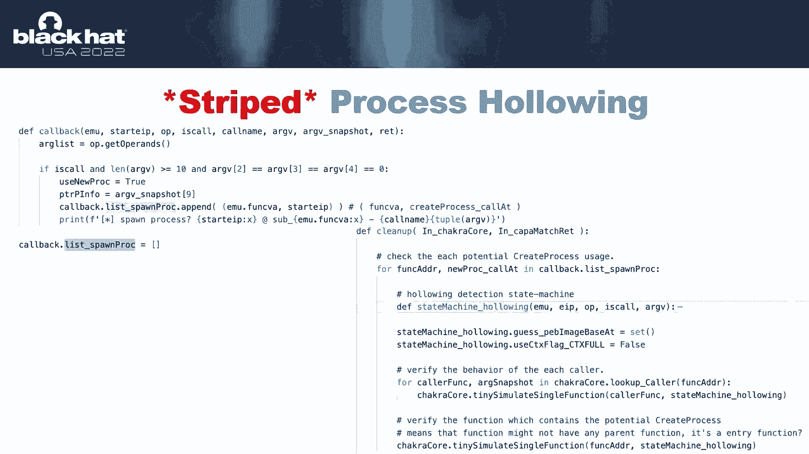

TR TR TR引擎提供API微型模拟器仿真功能。

这个API可以让我们创建一个新的微型模拟器，在特定地址上运行，并完全模拟了代码的其余部分，并提供另一个API是本地条目的瞭望呼叫者，函数的函数，基于控制流图，在这里，当那些模拟器运行时。

实际上他们会执行复制函数，代码的其余部分有任何敏感行为。

只需在复制函数中，所以在这里我们可以做，倾向于分析线程和处理过程价值。

与死者和牛肉神奇的数字，在模拟过程中，我们可以检查是否有任何代码在下面的调用是非常，有任何文化可以使用，比如获取阅读联系人，或在内存中写入部件以切换到切换到修改合并，光伏结构的最佳。

所以我们可以确保这肯定是在努力遵循过程，因为他是他试图控制男人EXE模块，所以在我们的实验中，我们称之为，我们称今年所有的样品为新鲜样品，它们完全被贴上了摄入行为的标签，我们真的很好奇。

其中有多少实际上是万圣节行为的典型过程，所以我们总共收集了233个样本，高达61%的土地实际上是一个典型的过程，在我们做反向工程后，其余的土地，我们发现那实际上是一个黑客工具。

现在我的同事汉克将获得下一个奖项，更复杂的一个是如何使用TSI引擎来检测原因软件，好的。

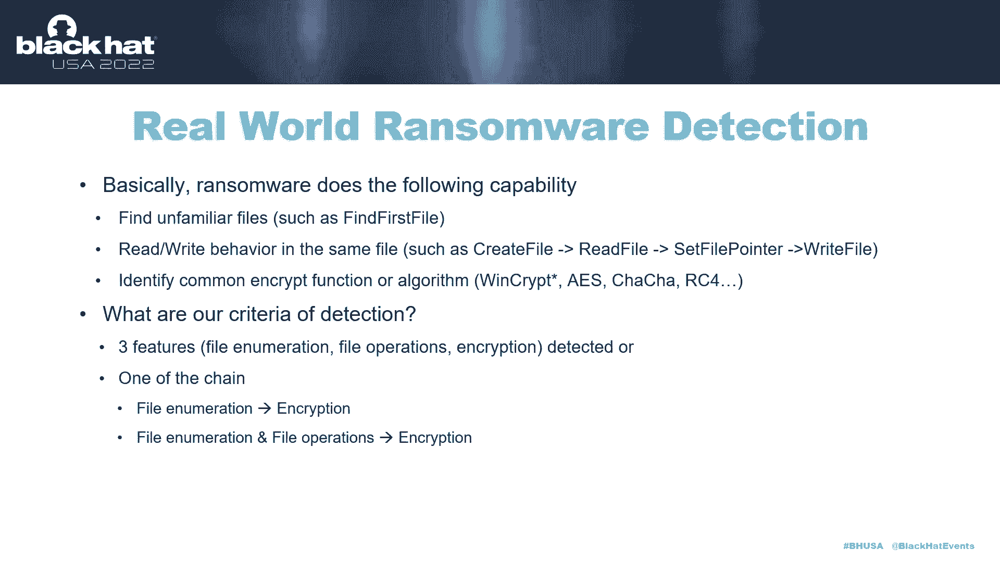

感谢圣哈马斯的介绍，还有你好，每个人，我是汉克，我要谈谈我们两个是如何被发现的，在那里我们建立了储层检测的标准，我们必须了解…的三个共同特征，因为我们的标准是基于这三个共同的特征，它们是适度的文件。

用于操作和文件加密，首先，这三件事依次发生，所以首先勒索软件在磁盘上的多个文件中，然后触发文件操作，这意味着为每个文件创建文件句柄，每个文件的文件内容也被读写，每个文件内容都由原因软件加密。

为了确保我们的检测目前正在检测最近的工作，所以我们还实现了功能链来帮助我们过滤掉侦探特征，不属于和工作，我们试图检测两个函数，第一个是文件枚举到文件加密，下一个是文件枚举，连同文件操作到文件加密。

所以现在你明白我们的标准了，我想向你们展示这三个共同特征的规则的实施。

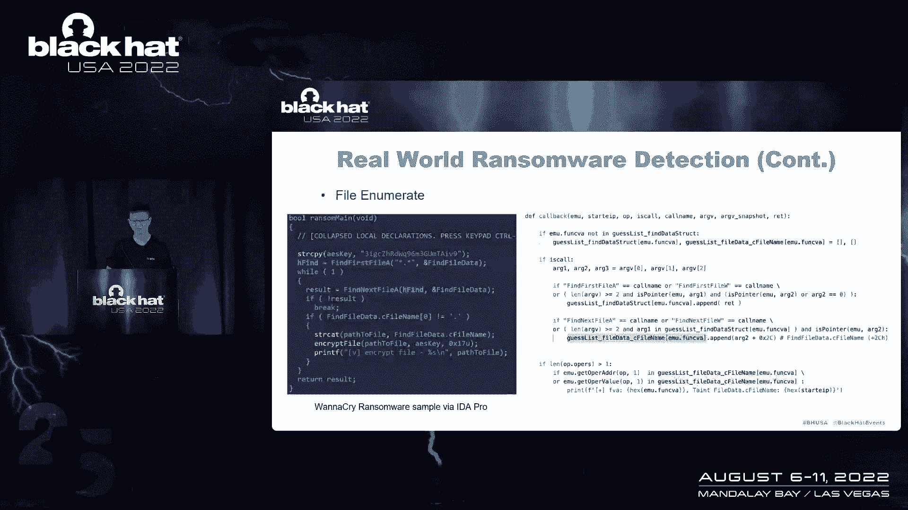

所以这里是文件枚举中的第一个文件枚举，我们试图识别条带，I第一个文件和调查结果文件，然后我们比较五个第一个文件和，发现X文件的第一个参数，然后我们可以分析文件名的使用情况，因此。

我们可以很容易地在检测日志中记录文件名的使用情况，所以当一些人也许你可以看到日志，分析理性方式是如何运作的，所以在我们理解了工具的第一个特性之后，我想向你展示下一个下一个是文件操作，以及对于文件操作。

我们试图识别条带，创建文件和其他与文件操作相关的API，然后通过创建文件分析文件句柄，帮助您了解规则是如何工作的，我想向你展示更详细的检测过程，比如说，我们分析文件操作的工具。

它将文件句柄存储在局部变量中，哪一个在状态，然后期望每个文件操作从局部变量加载文件句柄，用半身像突出显示的指令，表明我们可以成功地检测Barbuk勒索软件中文件操作的特征，第三个特征和文件加密。

我们采用了由滑冰识别规则和基于专利的规则组成的高级策略，以及明显的滑冰识别规则，用于识别Windows API的条带加密功能，所以这是我们两个中三个共同特征的规则，我想向你展示我们的检测日志是如何。

为了验证我们的工具是工作的，我们可以查看这个检测日志，我们带来了三个不同的运行，并验证了他们的日志，你会看到里面的三个共同特征，这在每个检测日志中，第一个是野蛮人，在您可以看到文件浸没的地方检测到。

我们可以把它和木筏上的斯内尔进行比较，这也使得许多潜在的文件在我们的拘留中被使用，虽然，然后在文件操作中，我们还回忆了一些文件句柄，呃，从我们的工具，您还可以查看此日志以验证真正的文件操作在哪里。

然后在文件加密中，你也可以做同样的事情，这是一个完整的过程，我们可以，您可以按照此步骤查看，我们实际上可以检测到工作，所以下面我们有另一个，有个地方叫做黑暗面，因为他们在同一个过程中。

所以我会很快地通过这个，在黑暗面，我们可以很容易地检测文件信息和文件操作以及文件加密，然后B锁呢，我们可以做同样的事情，因为我们没有太多时间来分享这个，好的，所以不是，我想向你展示我们如何提高检测能力。

对，因为有很多加密算法，在现实世界中，并不容易实现这个基于和基于规则，为了阴暗面，它利用了定制的单元格是二十个，它有一个定制的矩阵，我们可以检测到它，因为它在我们的检测中，现有检测规则。

所以我们从黑暗面捕捉特征，我们实施基于专利的规则来检测它，另一个例子是大约七个，关于七个有两件事，第一个是R5加密，这个等式也不在我们的规则中，所以我们只是实施基于专利的规则来检测它。

另一个是FS打开的，因为，正如我前面提到的，我们专注于清晰的文件，但是遣散费将使用FS打开而不是查询文件，所以我们只是实现了一个基于专利的规则来识别FIS打开的顺序，所以我们可以检测到这个。

我们还做了一个大规模的实验，一整年我们都在收集样本，哪个标签是由三个不同的流行防病毒供应商为企业总计编写的，有一件事你需要知道，嗯，共计，样品标签作为理由，好吧，现在意味着你将加密文件。

有一个非常令人惊讶的，所以我们也用商业沙箱过滤掉一些样本，它真的在加密文件，这样我们就可以收集它们作为我们最后的简单设置，最后我们有一个令人印象深刻的检出率大约96%。

这里有一张关于Renson器皿家族的表格，我们可以检测到，我们可以探测到64个家庭，我们也可以检测到它在这些家族中的变异，所以说，然而，在我们的实验中仍有一些未被发现的样本，比如说，手掌较深。

它使用了一种未知的加密算法，以前没有识别过，所以，就像以前一样，我们为黑暗面，来实现识别这个，我们也想要，这就是所有这一切更多的是作为一个理由，所以我们做了一个假阳性实验，发现，最后我们有一个零左右。

这表明我们的工具真的可以检测勒索软件，所以现在我想寄一个回家，将总结我们的演示文稿。

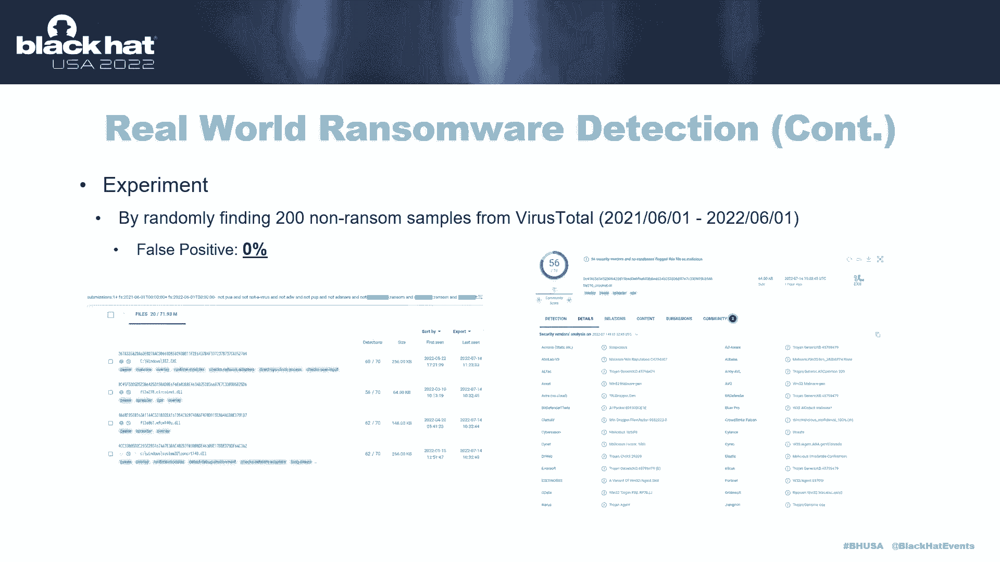

好的，谢谢。谢谢。汉克，最后一部分是未来的工作，并指出，这里有一个完整的外卖点。

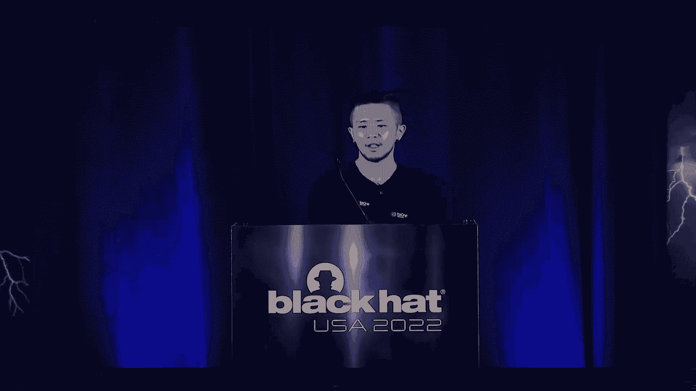

首先，我们在这次会议上意识到，现有的检测技术强度较小，而局限性是很难完美的柔软，世界上高度变异的原因和第二点，我们使用符号执行来检测这些多个，恶意攻击，并展示出良好的效果，这又是用专利很难实现的。

最佳更多检测，第三点是我们的实验表明，例如轻量级符号解决方案可以解决现实世界的简单问题，它对模糊有很强的抵抗力，最后一个是我们希望这个引擎能帮助世界上的蓝队，所以我们在GitHub上发布它。

并希望社会各界能与我们一起制定规则，以加强，这是我们在GitHub上的tr引擎的二维码，我们希望有更多的研究人员加入我们研究这个引擎。

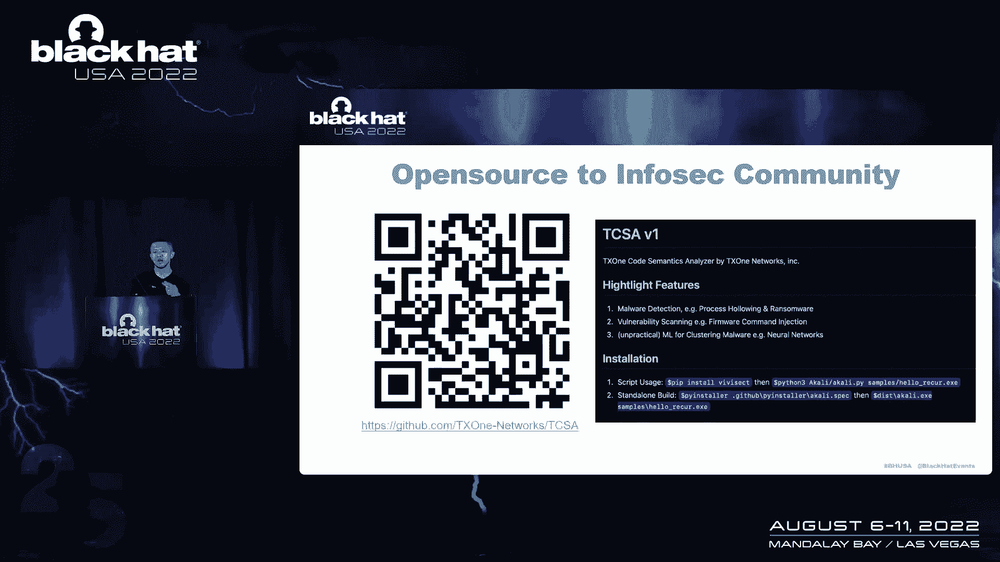

感谢收听，我们是一体的，如果你有任何问题，请随时问你一个问题，或通过推特或链接联系我们，谢谢。