# P16：017 - The 8th Annual Black Hat USA NOC Report - 坤坤武特 - BV1WK41167dt

我是骗子，我是巴特，所以嗨，我们运行黑帽敲门，我们到底是谁，让我们看看这是否行得通，来吧，来吧，单击或单击，单击不起作用的单击器，否，这是用什么，键盘砰，留着吧，匪徒，我叫尼尔·维勒。

你们都知道我是骗子，因为我不喜欢我的名字，但除此之外白天我是主动威胁评估的全球领导者，晚上为IBM X部队，我这么做是为了一顶黑帽子，这是我的第二十次黑帽秀，所以二十年前。

杰夫·莫斯把这个网络交给了一个孩子。

但它成功了，所以黑帽网络，和我一起长大，我也是一个部门，在def con头，我在那里运行所有的比赛项目，在演示实验室里，我经常在会议上发言，写了一些书，我喜欢保安，我总是讨厌退而求其次，因为你的更大。

我叫巴特•斯坦普，我现在一直在做这件事，十五年一天天，我是网络证人的高级秘书，我们交换了位置，如果你们不交换位置，他离开了我，参与社区做一大堆其他事情，但不是像他这样的名单，那就是我，我没有，我没必要。

你想离开，我刚做了，我想你。

这不是真的，我们住的地方离彼此只有二十分钟的路程，我们经常见面，所以我们不是一个人做这件事，那就太荒谬了，这个摄影人，哦，这是一个非常糟糕的，在小屏幕上看起来不错，无论如何。

现在看起来像是和土豆一起拍的，它实际上是一个非常昂贵的相机，那是敲门队，你知道我们模糊了什么，他们的脸是为了隐私，我们开始了，好的，我本想怪在，凯西，一切都很好，如此如此，是啊，是啊，这就是团队。

有相当多的男人和女孩帮助做这件事，就像我们带了一队朋友，本质上有一个叫做技术助理的团队，我们选出了15个，你知道的。

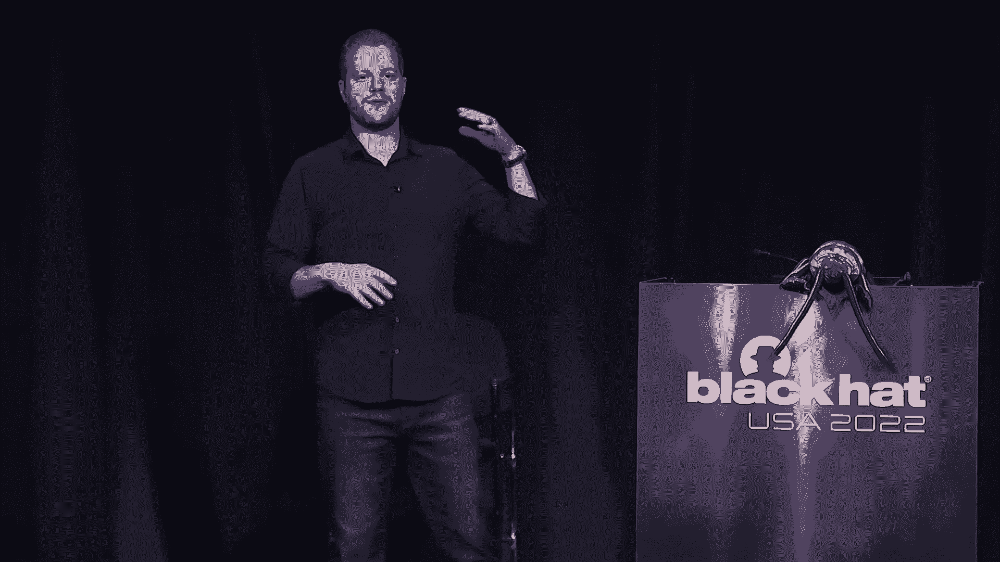

他们自愿抽出时间来帮助我们让这个网络运转起来。

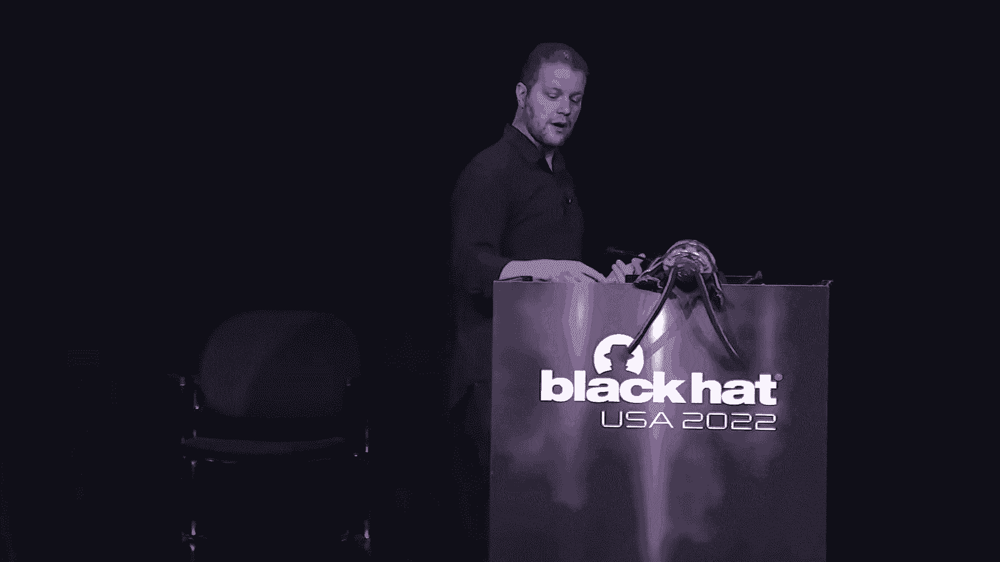

但显然这张照片里有超过15个人，因为我们也和合作伙伴一起这样做。

正如你所看到的，有一点变化，尽管我们有帕洛阿尔托流明斜线，呃世纪链接，他们改了名字，这对我来说也很困惑，但是没关系，我们就跟着它走，思科取得了相当大的进步，今年做了更多的工作。

然后Gigammon仍然为我们提供水龙头，把所有的数据都拿到那些工具里。

是啊，是啊，所以我们将向你展示把这个放在一起所需的所有东西。

有齿轮，名单似乎在继续增长，我们一直在谈论这个问题，以后我不会再打雷了，但它已经进化了，很多人已经走了很长的路，感觉还有很多事情要做，是啊，是啊，我想我们以前谈过这个，但当我们最初开始的时候。

所以我参加的第一个停电节目，我们有一个思科，二千六百路由器，几个颈部齿轮开关，那些旧的思科APS里面有Oroco金卡，你想把天线粘在墙上，就像耶，所以我看到了一点笑声。

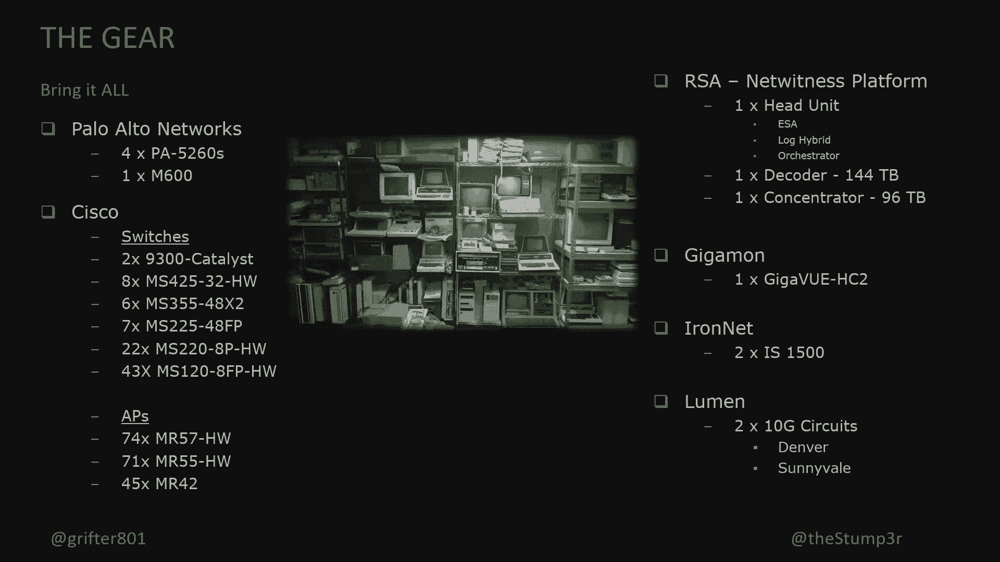

和观众席上老人的一些微笑，所以这是一个艰难的方式，我们不会一个一个地检查清单上的所有东西。

但是帕洛阿尔托带来了防火墙解决方案，思科今年加强了交换和接入点的工作，但他们也提供雨伞，你在展台上看到的所有移动设备上的威胁网格和安全管理器，以及注册，网络证人提供日志，数据包和端点，以及配器。

一大堆设备在展会期间现场存储每个包，Gigammon再次提供了查看所有数据的点击，把它弄到所有那些工具上，以及一些开源工具，irnet再次提供了更多的可见性，然后流明又提供了两个10G的电路，我们得到。

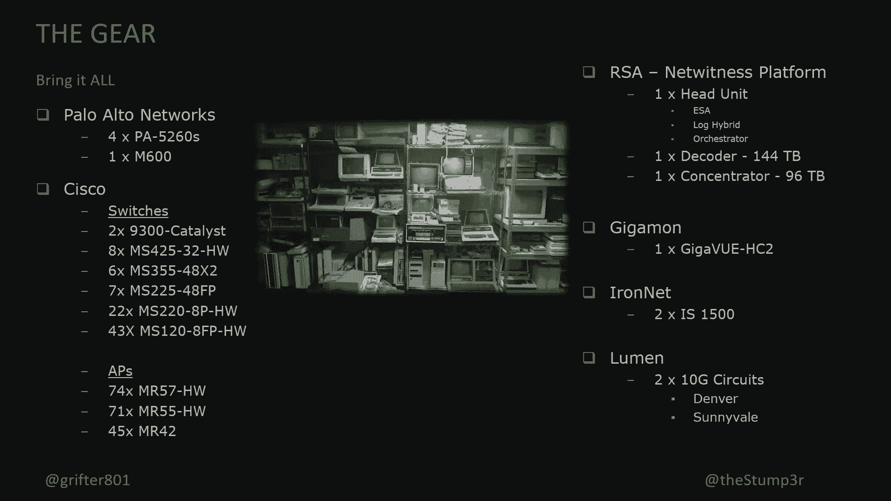

所以我的意思是有一个很好的谈话点，那里有更多来自思科的东西，今年，就物理设备而言，所以思科一直是一部分，他们是过去的搭档，大概六七年，帮助我们解决威胁网格和恶意软件分析，思科雨伞之类的东西。

So So软件支持，对呀，而是两个，今年新加坡展前六天，我试图分享我们在这里面临的一些挑战，你马上就会听到为什么，但今年新加坡展前的两个六天，为我们提供无线和交换的合作伙伴说你知道嘿。

因为设备短缺和仍在持续的流行病，我们将无法支持这22场演出，我们去了，做那个，你知道谁能帮我们弄到装备，谢天谢地，我们这样做了，思科认识一个人他有很多硬件，是他们，他们说我们把你弄对了。

他们在紧要关头进来了，并提供了我们去新加坡所需的所有装备，所以他们带着摩洛哥人进来了，我们把一切都安排在新加坡了，把那个齿轮烧坏了，我们就像没事一样，让我们看看美国展会上会发生什么，所以我们在这里。

所以谢谢思科保释我们。

建筑学，所以你看到有多少电话出来，这是一个更合乎逻辑的布局，你可以看到大部分，老样子，老丹佛，开关上的冗余土地，然后我们得到两个防火墙，提供所有第三层，他们是整个网络的网关。

对于我们拥有的每一个VLAN和每一个网络，贾蒙，再次将数据提供给所有工具，开源，irnet，净证人，以及我们想在那里查看的任何其他工具，我们去年谈到的另一件大事，但很明显去年有点不同。

这提供了一些额外的要求，会说所有这些现在都是正确的，所以去年很明显大部分都是这样，但在1919年情况并非如此，所以现在我们对AV团队有了更多的要求。

他们需要什么，就网络连接而言，多个VLAN，几乎所有房间都有多个网络，所以我们必须把它们拿出来给他们，他们在我们后面，但我们必须在所有房间里都这样做，所以整个变化的转变，大流行后，职位合作伙伴变更职位。

一切，有点回到我们的步伐，但尽可能多地，保持简单，而且大部分都是一样的，是啊，是啊，你知道它是，总是有调整的，把所有的东西，就像巴特付出了很多努力，还有这里的史蒂夫·芬克，我们的犯罪伙伴在敲门。

我让你决定mf代表什么，我们知道，你是对的，就是这个意思，所以我们有很多仪表板，对了，里面有很多东西，我们正在使用的东西，我们实际上用的是对，它们是我们的信息工具，你可以到前面的敲门区。

进去看看仪表板上有真实的数据，正在发生的事情，中间的那个只是一个开源工具，我们喜欢谈论它，因为它闪闪发光，就像我们每次敲门都需要一张长椅地图。

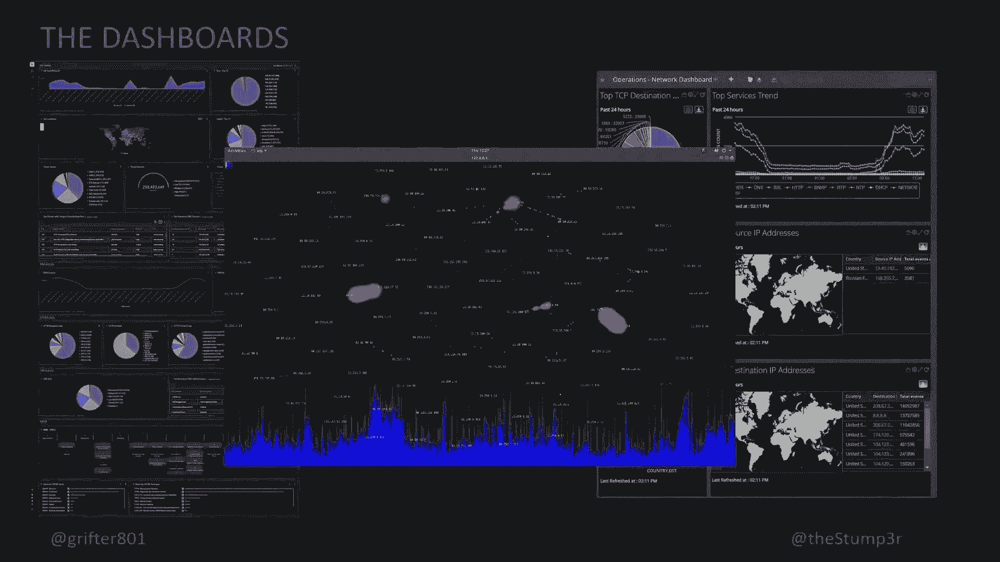

其中一个是网络上最健谈的前50名或50名主持人。

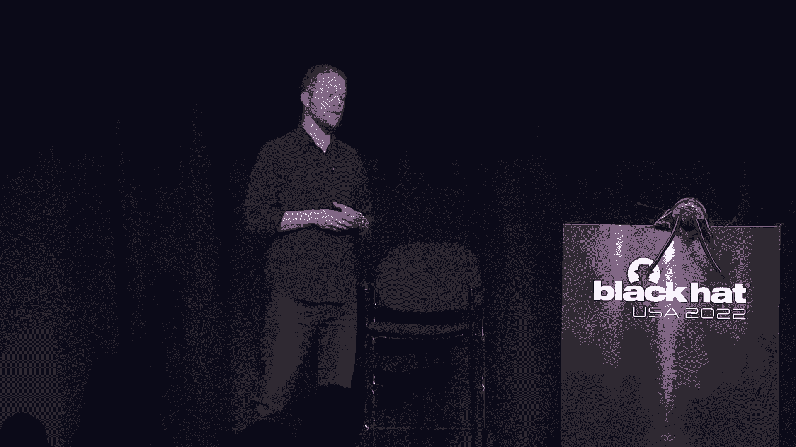

当你看到绿色移动时，它告诉我们他们在经过什么，那是tcp红色是udp，icp看起来是白色的，它允许我们直观地查看网络，只是看看发生了什么，这些小数据包只是经过的正常数据，但随着更多的车辆通过。

它们会变得更厚，所以光剑风格的看起来是很多交通，我们要做的就是看着这样的东西说伙计，有大量的交通被转移到那里，那是什么，我们去网络证人小组，我们说嘿，你能从这两个人中间看看他们经过的是什么吗？

或者如果我们看到一个看起来像烟火的扫描，它只是向所有这些不同的主机发出，所以我们会像，他们在送什么，或者你知道他们是什么，为什么他们要和所有这些不同的人交流，以后也记得IP，我们会再多谈一点。

是啊，是啊，所以再一次，仪表板是真的，有一堆不同的东西，我不会什么都读给你听的，我们只有三十分钟，我们实际上更想听到问题而不是你想听我们说话，但你可以看到下面所有的设备，我在这里看不清。

所以你认为他们也不能在这上面读，但你看到的是网络中设备的数量，较大的山峰是昨天，然后今天我们拉雕像的时候，大约是一点半。

所以成千上万的独特设备，它们是什么，在哪里，那些不同的东西是，是我们试图跟踪的事情之一，对呀，我们需要支持什么，我们需要在哪里部署更多的设备，也许是因为有一群人在上面的不同区域，作为实际物理空间的地图。

然后我应该把它剪下来放上曼德勒湾，但它实际上告诉我们，哦，以下是我们部署的一些设备以及它们的位置，大部分都在世博馆，或，你知道的，就像他们四处走动一样，试图用那里的iPhone扫描你的徽章。

我们注意到其中一个在游泳池边，所以我们就像有人在逃课，是啊，是啊，我们得到了他，所以我想补充一点，我们最近看到的仪表板，我们之间聊了一会儿，你可以看到成吨的数据进入骗子的整个点，你知道听不到你走。

这都是惊人的数据，这一切都很好，通常当你坐在袜子里做分析师的时候，这里有大量的数据，在某种程度上，我和骗子现在跑来跑去的次数更多了，不一定用手在键盘上，不一定要从那么深的角度看待每一件事。

他的长椅是OIP，我可以看着它我们在房间里跑了五分钟，回答别人，看看事情看起来还好，不知何故，你让它看起来很好，但除此之外就不够了，就像白天一样。

我现在明白了一点，想要内容提要的执行角度，想要红、绿、黄，一些更简单的事情，一切都很好，当我走出去的时候，我不会马上被叫回来的。

或者我应该留下来，因为一切都是红色的，所以只有几个陌生人在看红绿灯，所以我们有一些统计数据，对呀，所以看着这些，这些是让我们看看总设备，我在那边看不见，我是说我可以，但我得跑到观众席里，这很奇怪。

你看得很近，是啊，是啊，我又喜欢了，如果你想让我把它捡起来拿出来，像那样不，所以超过一万个独特的设备，367种不同的物联网设备，你可以看到上面有一个小东西，上面写着一个高风险，我们就像。

我想知道那是什么，但是你知道很多不同的应用程序，你可以在，他们是苹果设备的类型，组成与网络相关联的大量设备，然后你知道，向下移动到带窗口的个人电脑，Linux是前五名，Linux个人电脑，是啊，是啊。

诸如此类的东西，就像这样，只是很高兴知道，就像这样，这就是联系，它是这样做的，也是一个值得注意的统计，对恶意站点的近94，000个DNS请求，对呀，你们真恶心，这将是一个非常明亮的幻灯片。

下一个道歉，但又一次，只是更多的统计数据，对呀，所以看看网络上传递的东西，我们正在做的事情之一是我们使用，你知道的，巴特提到，净证人，我们做日志，数据包和端点，端点只是注册机器。

我们永远不会要求您在设备上安装某些东西。

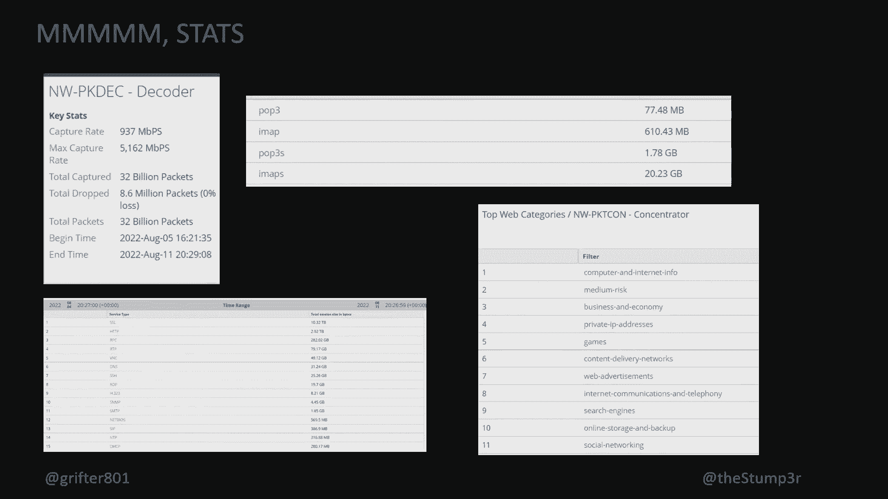

如果你做了，我们会请你离开，哦，我们正在捕获通过这个网络的每一个数据包，对呀，我们不做解密或类似的事情，但我们确实记录了数据包我们这样做是为了当我们进行调查时，我们可以回头看看里面有什么。

如果在组织中不使用数据包捕获，今天就做，那不是网络证人的插头，我不在乎，如果你直接把它写到磁盘上，如果您没有进行完整的数据包捕获，把那玩意儿修好，我们做一些加密，是啊，是啊。

所以在过去的几天里，很多数据包飞过网络，他们中的32亿人好吧，所以我们用了一个B，我们就像，我要留着它们，他们太可爱了，然后你可以看到，你知道电子邮件流量的类型，网络上有多少数据是加密的，电子邮件与。

你知道的，而且是的，你看到的是流行音乐3，有一些流行三，我们马上就会看到一点，然后我喜欢的是顶级网络类别，是电脑和互联网，第二个是中等风险对吧，就像又像，你真恶心，就像就像，哦嘿。

让我们去做一些可怕的事情，所以当你进入前三名的时候，已经有恶意软件和其他有趣的东西了。

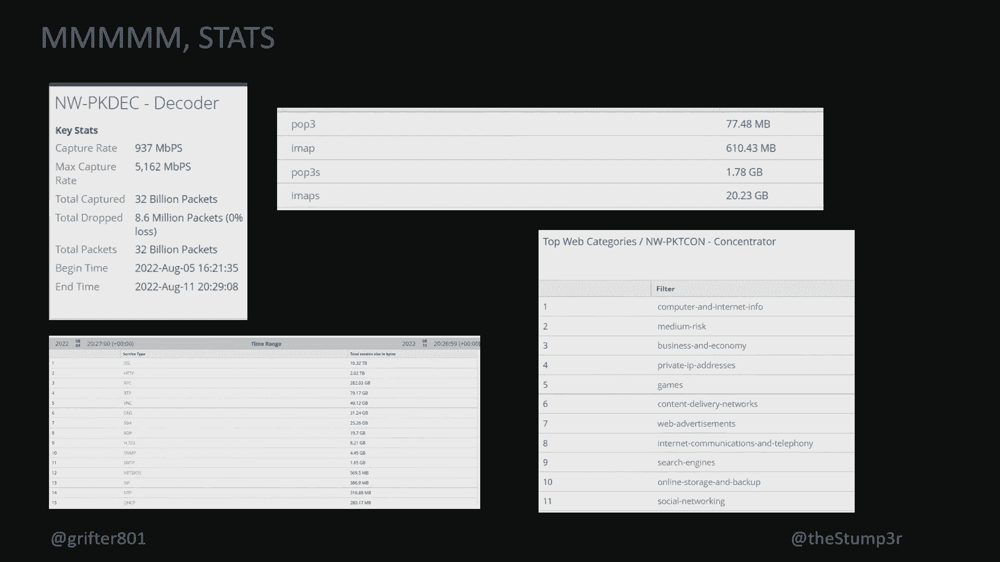

你在黑帽子，嗯是的，你想把这个DNS，所以雨伞是我们没有的一个很好的工具，就可视化而言，据我们所知，在我们获得捕获数据之前，我们知道一些DNS。

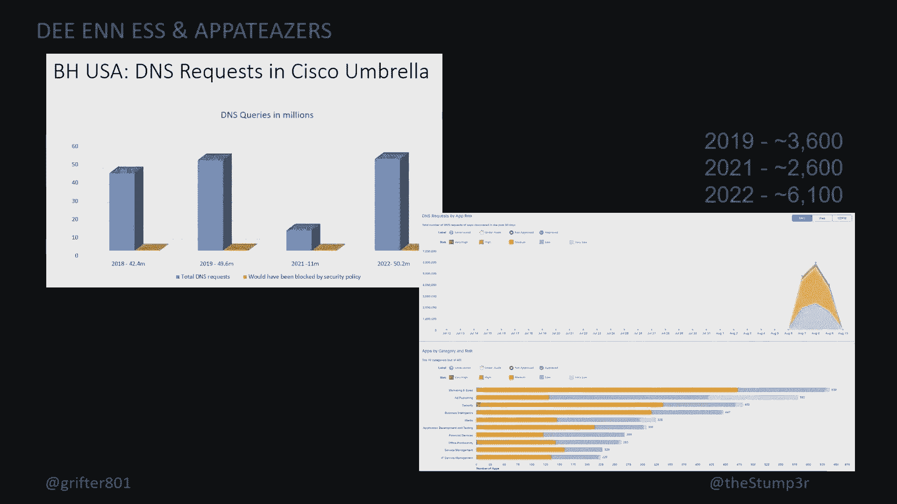

但很高兴看到一些网站得到了什么。

其中一些数据，我们不一定会把东西挡在外面，有一些规则你以后会看到的。

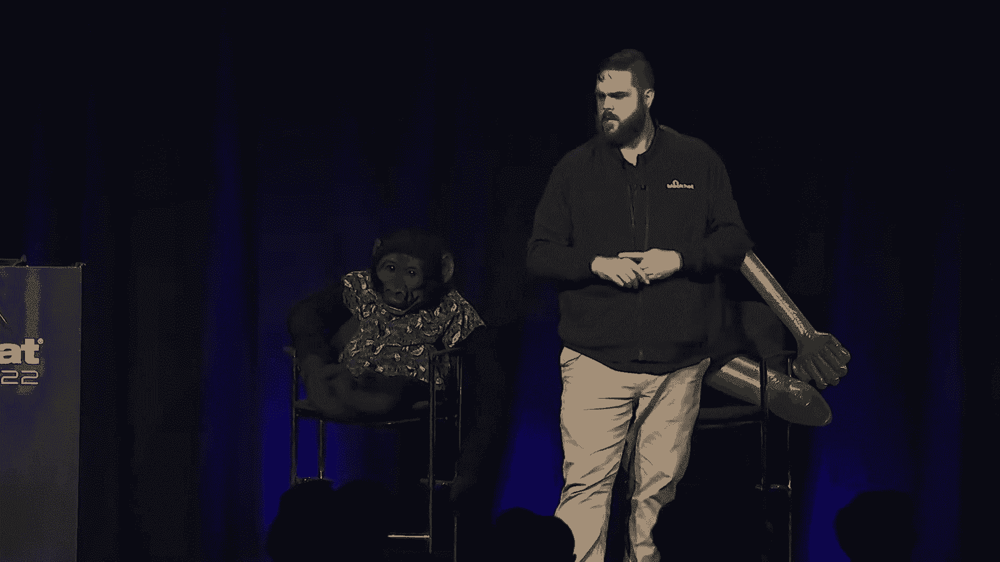

但我们没有，我们不走任何东西出去，所以这是我们的统计信息工具，基本上，但是你可以看到在过去的四年里DNS查询的数量，那就是2018年，我们什么时候达到四千九百万，很明显在21码处蘸酱没有20码处。

然后是二十二，我们以50分超过了219个数字，两百万DNS请求，是啊，是啊，然后在右边，有应用程序，在网络上通信的独特应用程序，所以你可以看到这些数字也在增长，今年是20196100年。

所以这一切都是关于应用程序的，宝贝。

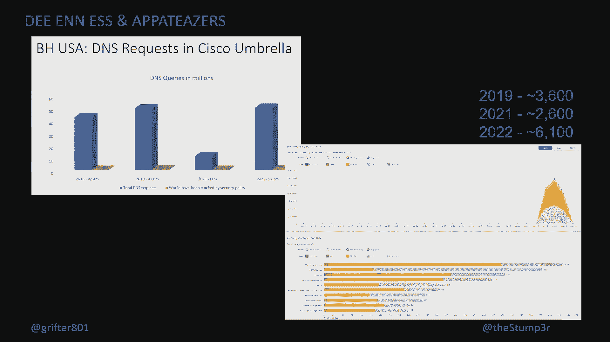

我们做这个幻灯片，就像每次我们做这个演讲，我们这样做只是为了给你一些，我想关于我们的目标的背景信息，敲门的目标是什么，以及这些年来它们是如何变化的。

最终敲门的主要目标，我们称之为敲门是有原因的，因为我们更换了每一个路由器，开关，防火墙和接入点在这栋楼的这个网络中。

就像我们拥有所有的设备一样，我们在曼德勒湾唯一使用的是墙上的电线，所以我们从我们的齿轮上插入，它在别的地方弹了出来，所以只有墙上的电线，所以主要目标稳定。

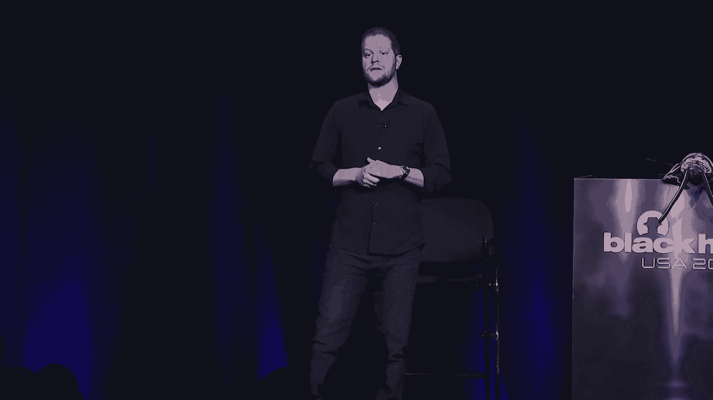

保持网络畅通，像培训班这样的事情，或者对世博馆里的人来说，注册之类的事情，所以让我们谈谈我们的稳定性，这里有一个培训班很早就遇到了一个问题。

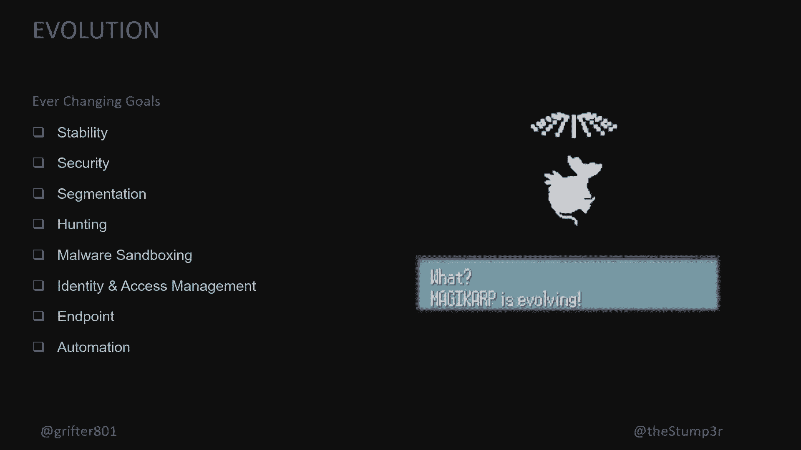

在星期六早上上课的时候，我们部署了敲击人员在那里排除故障，我们在里面呆了几个小时或做了一些事情，他们很生我们的气，对呀，他们是这样的，我们依靠网络，我们需要这个工作，人们花几千美元来这里。

所有这些都是对的，所以我们在里面发疯，试图弄清楚事情，我们在看我们的数据，和他们的，我看到了平的时间，最大的或最长的，我见过的平时间，你知道58秒，我就像，它不是说，主机此时无法访问，但没有，就像。

我想让你知道这有多糟糕，所以我觉得有点被侮辱了，但最后我们又对网络进行了一整天的故障排除，疯狂的学生，疯狂的教官，我要拿回我的钱，这一切，最后事实证明这不是我们的错，但它是什么，有一个服务在图像上运行。

教练有，所有使用，这本质上是因为他们可以看到其他学生，它只是放大了网络上的流量，直到它跪下，我们四处走动，禁用了这项服务，我们可以看着ping时间越来越快，直到最后它们是20毫秒，我们就像。

这就是我们所期望的，所以稳定是最重要的，因为如果它不稳定，就像人们很生气一样，所以这是头号目标。

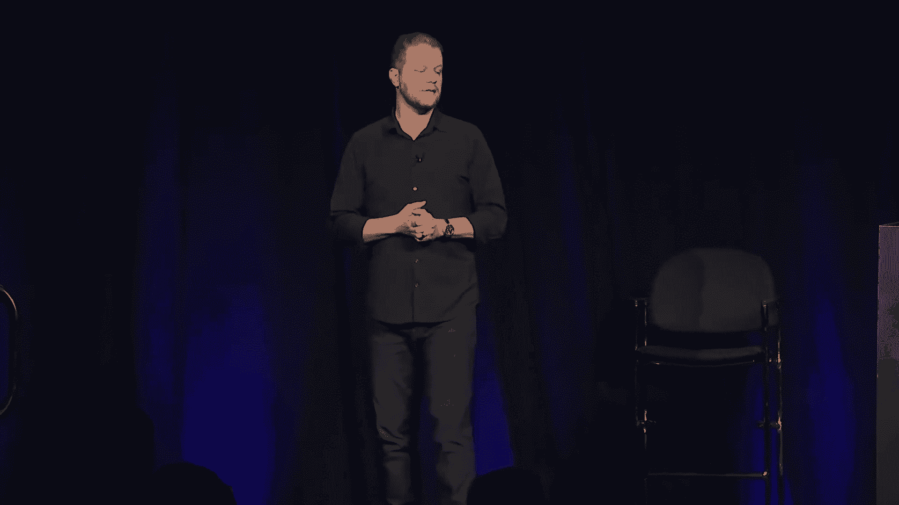

之后是安全，所以这就是为什么我们是敲门砖，我们是一个网络运营中心，我们做袜子做的所有事情，我们有包裹，日志，你知道，记录端点，源解决方案，威胁情报平台，就像所有的一切，你说出它的名字。

我们已经得到了它在那里，但我们是敲门砖，首先也是最重要的，我们很早就知道分割在网络上是必要的，我们了解到，因为在停电的早期。

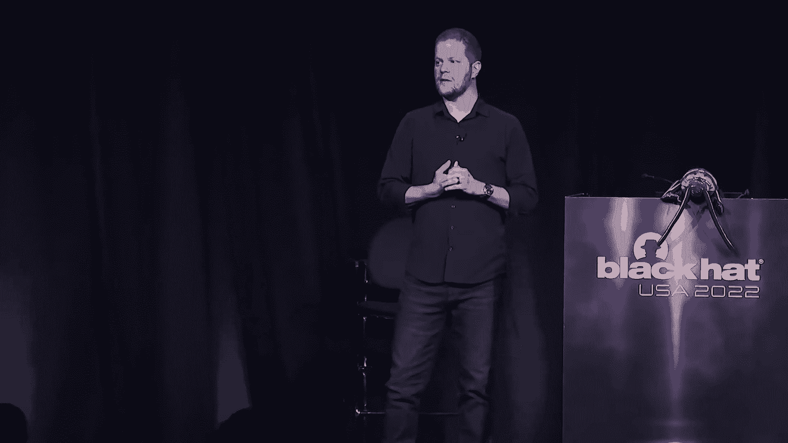

那是狂野的西部，人们会进入网络，在他们的课上学到一些东西，立刻攻击隔壁的同学，对呀，所以我让你笑，喜欢哈哈，是我，可能是你，谢谢，谢谢你这么说，甚至不是教室，我记得有一年媒体得到了媒体室。

哦耶，互相攻击，互相攻击，媒体就像打架一样。

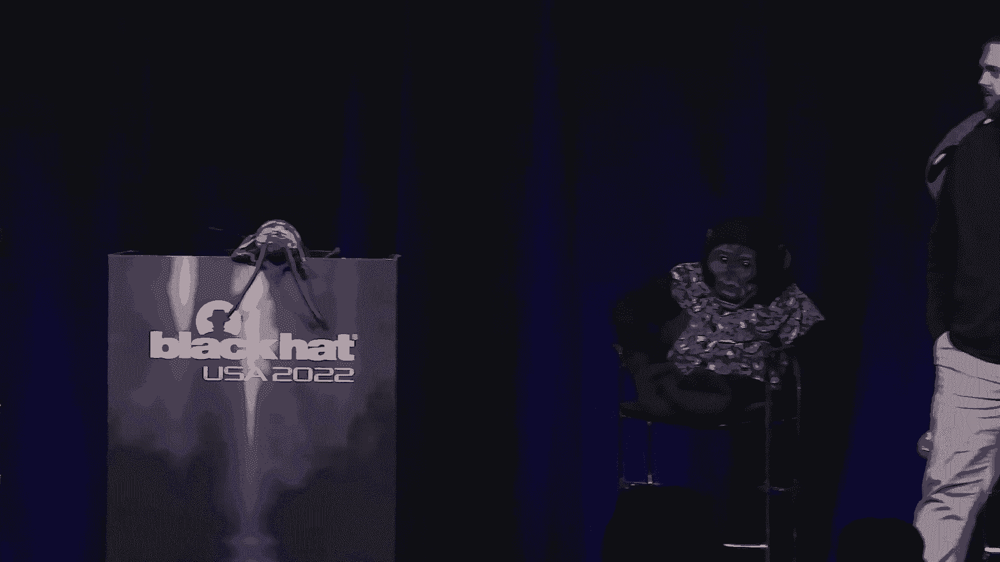

有人告诉我攻击，让我试试，我刚刚做了一个关于这个工具的采访。

如此部署，然后我想他们最终成为了故事，因为后来他们发现，其他记者写了他们，所以一旦我们完成了分割。

它转向了狩猎，我们想了解网络中到底发生了什么。

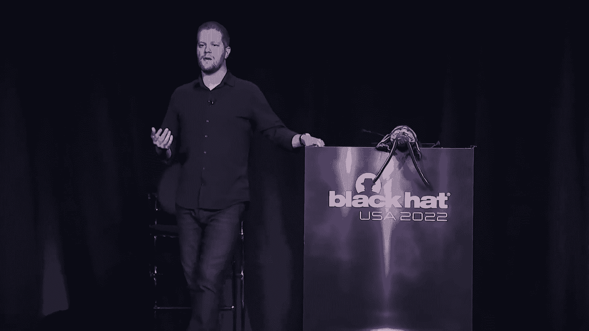

关于黑帽网络的事情，每隔五分钟我们就会看到会导致公开事件的交通类型，在任何一个足球运动员身上，你们其他人都知道这个世界，问题是，我们不能对事情保持警惕，因为我们会被淹没，我们在找一根针和一根针，对呀。

这个网络上没有干草，只是针而已，所以你看到的，当你走进门的时候是一群人坐在边缘，是拉斯维加斯，是啊，是啊，所以它只是，只是人们坐在边缘，那些人是我们的团队，他们来自西斯科帕洛阿尔托，他们是铁网公司的。

他们是威胁猎人，我们使用威胁猎人，因为最好的威胁狩猎仍然是由人类完成的。

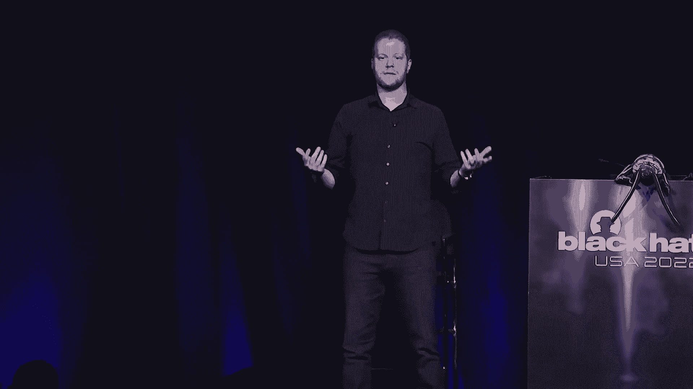

我会和任何不这么说的人战斗，我会用身体和你战斗。

向我冲过来，让我们把话说完，然后我们现在就战斗。

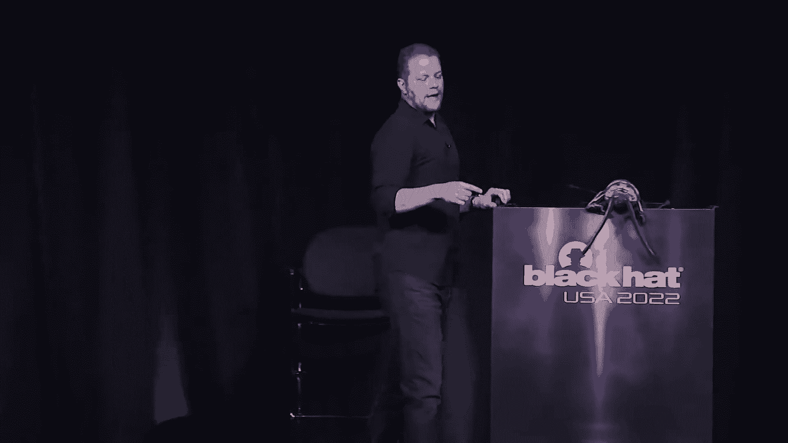

我们是沙箱权利，所以当我们看到一堆有趣的东西在网络上传播时，任何文件，如可执行文件，dls，pdf，任何获得足够高风险分数的东西，我们把那个证人扔进威胁网格，把它放进沙箱里，把它打开，看看它有什么作用。

和它互动，看看我们能不能学到什么，身份和访问管理是我们试图确保当配置更改完成时，我们知道是谁干的，只有少数人能做出这些改变，再次将端点，我提到的是注册，这真的只是旧病复发，然后iOS设备。

在世博会的地板上和Reg上，你喜欢的，扫描你的二维码，最后是自动化，所以我们使用一个源解决方案来寻找命令和控制的通信量类型。

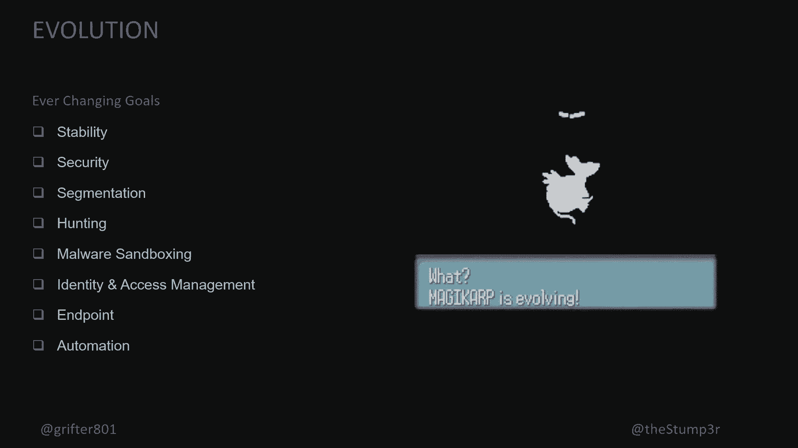

就像立即出现，就像在网络上一样，插上电源，我们就像，那是去C2服务器对吧，明文全权证书，如果我们看到这些东西我们过去会走到教室，就像以物易物，我会出现，就像，我们需要看到，IP地址，废话废话，是的。

但它没有规模，不是在这个规模的节目，所以现在我们要做的是，我们看到那些东西，我们调查它们，如果事实证明我们就像，那真的很糟糕，我们会给那个人建立一个俘虏传送门，说嘿，我们看到这种类型的流量来自您的设备。

或者我们在设备上看到了加密挖掘活动。

这是意料之中的，忽略这个，如果它没有被敲门声阻止，我们将向您展示数据包捕获，日志和一切，关于进化的事情又是，我们谈论我们已经走了多远，感觉还有很多其他的事情我们想做，所以说，它是它是它永远不会结束。

我们想继续所有这些空间，也看看其他的，所以是的，这是一个，它是不断进化的野兽，GIF的存在只是为了让你抓狂，因为它从来没有真正进化过，我永远不会变成西尔多斯。

它只保留了三个，所以说，你要接这个吗，你想让我去拿吗，所以这一个所以所以很多这就是我们，这些其实是松弛的截图，我们在这里想指出的很多事情，我也是，是所有这些合作伙伴之间的工作。

我们再次称之为合作伙伴有很多原因，我们一直在谈论这件事，他们不会，这些人是小贩，他们付钱来敲门，我们选择了他们，他们和我们一起工作，但他们也都在一起工作，产品之间发生了变化，因为卖主，都在里面。

他们在敲门时在黑暗中看到的东西，但这指出了有人在一个平台上看到的东西，我都不知道是谁先看到的，我在整个狩猎过程中都指出了这一点，看到另一个人在保罗和思科那边走了过去，开始调查，这是夏洛克老鼠，对呀。

就是我们，所以有很多东西，这些只是又一次喜欢的例子，这是那种东西，我们看到我们去，有人在做演示吗，有人在做实验室，这种类型的活动与他们正在上的课相对应吗，如果没有，这可能真的是恶意的。

然后在这些对话中你可以看到这里有八个回复。

有人在里面说，我检查了这个，我和这个班对应，那个是干净的，我检查这是坏的，我做了我们认为这很有可能是一次真正的袭击，所以它只是想让我们能够确认，这是我们需要告诉个人的吗，你会经常听到这句话。

那个黑帽是世界上最敌对的网络之一，这是真的，如果你只看交通本身，都是那些针，但在现实中，当我们做完的时候，可能有更多的人离开这里比他们来的时候更安全，因为我们让他们知道，你出现了，这东西在你的机器上。

所以你知道这就是这里的目标，我想我们还没有看到有人在现场被感染，这是当我们看到C2出现时通常会看到的东西，当有人已经被感染，我不在网络上，所以嗯，所以Reg的情况，今年我们经常被攻击，我想我不知道。

如果你们很高兴离开你们的房子。

但就像核心基础设施，比如对WiFi网络的协同攻击，许多活动指向注册服务器，红色的服务器对我们来说就像皇冠上的宝石，我们得保证它的安全，都是你的信息，对某人来说，拥有两万个名字和地址可能是相当有价值的。

以及世界顶级安全研究人员的所有信息，对呀，所以我们看到了很多对注册网络的攻击，他们，你知道我们也调查这些，不管是身体上的，因为有时候就像有人在摆弄东西，或，或者你知道像这样的事情，就像，哦。

有人试图用一些东西来打击它。

这就是发生在，懈怠是某人说嘿，我看到这个废话废话去看，是啊，是啊，那看起来很糟糕，正常情况下，任何类型的攻击或恶意流量点或注册，它不应该在那里，所以就像，我应该阻止这个吗，是呀，挡住它，继续。

然后有一个小重击，一只像小猫一样的鼹鼠在底部拍打东西，所以这是我们在这个网络上唯一阻止的事情，因为我们不想激怒演示之神，所以某人的演示不起作用，我们只屏蔽我们可以肯定地说的话，像这样的事情不应该发生。

所以这就是发生的时候。

你得到了这个，是啊，是啊，所以说到Reg和稳定性，我们分享了一个故事，我们会谈论其他人的趣事，哈哈哈，我们现在将分享我们的一个。

所以如果你周六早上在这里训练，你要注册，他们把你送到你的班上，有和没有徽章，没有徽章，停电了很短的时间，我们自己造成的，所以我们从中吸取了一些教训和东西，就像我之前说的，记住P。

关于IP的一个有趣的事情是我们再次喂养它，那是所有的数据包，那就是那就是包，你可以在前50名客户中看到，不管它在地图上显示的是什么，我们通常把服务器留在MDF中，在获取数据的水龙头旁边。

您可以运行一个客户端，但是客户机到服务器的通信仍然是，所以一旦我们打开工具，这里发生了一些事情，如果你愿意，他们是，我们在同一个开关上，因为我们错误地把注册放在了同一个开关上，这通常不会发生。

这又是一个教训，这种情况不会再发生了，但基本上我们把整个上行链路都压在了开关上，我想它派出了九百六十场演出，第二什么的，它是它是坏的，它不工作，它不工作，通常，所以我们搞砸了，我们从中学到了。

发生了很多事情，所以也，IP是我们通常不是这样运行的，我们通常运行V和C，当它在服务器机房的时候，但我们已经把它清理干净了，还有其他一些问题，代码已经重写了几次，它减少到五行或类似的程度，V和C有问题。

我们没有做，我们忘记了是的，所以我们搬起石头砸自己的脚，我是说，它不是这样设计的，我们已经安排好了，注册应该在一个单独的网络上，从我们将要使用的管理网络，因为我们，你知道，使用很多不同的工具。

做任何事情，那些需要分开，但不知何故，当我们部署它时，我们插上了同一个开关，其中很大一部分是。

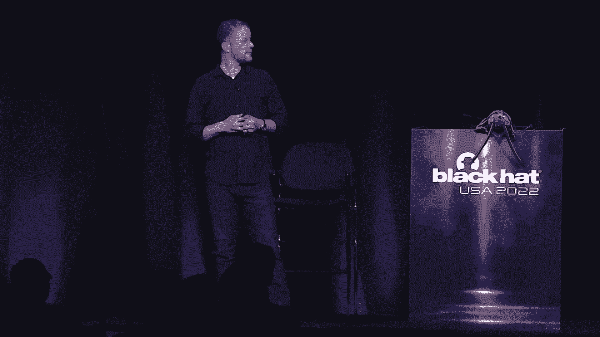

我们已经欠了很多人的人情了，因为我们有一些额外的开关，我们已经没有预料到的额外事情，供应链思科在最后一刻通过，有一些人握手以获得额外的，是啊，是啊，老实说，这是一个，它是一个喜欢。

要同时发生多少次失败才能发生这种情况，我想我们说了三个，我认为发生了三个同时发生的失败来实现这一点，但你知道当它发生的时候，它确实发生了，所以在通往成功或失败的道路上，黑客不喜欢太阳。

所以我们选择了失败，所以说，我是保安，所以这是每一年，如果你已经参加这个演讲几年了，我们给你看了一些东西，有一家保安公司，要么是场地，要么是拥有黑帽子的公司，他们进来做私人保安的事情。

他们发送他们所有的电子邮件通信，在清澈的地方，我们加薪了。

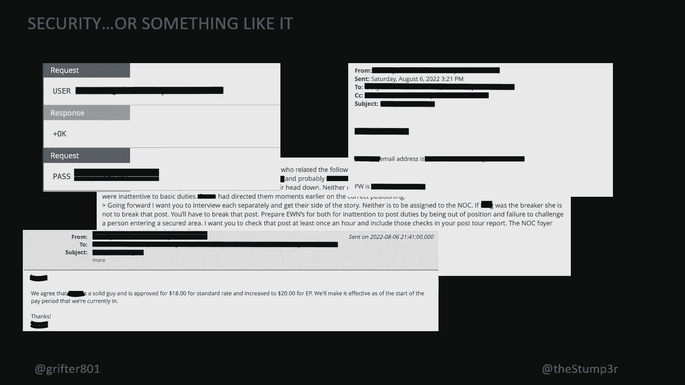

有人被解雇了，在大楼外，我看到那封邮件了。

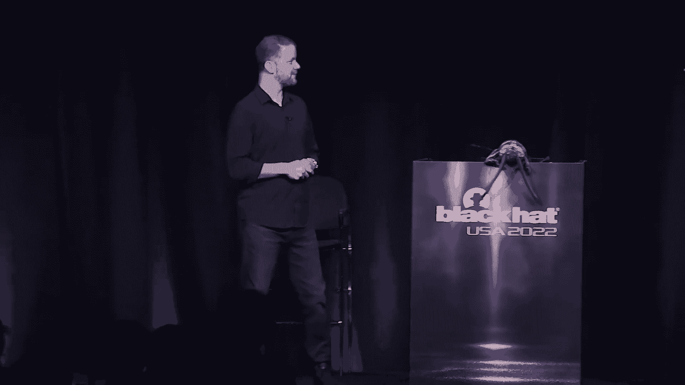

哦，他得到了，他做到了，他被解雇了，不管怎样，谢谢你，是啊，是啊，所以我们总是喜欢，这里的物理安全根本不能保护他们的电子邮件，我们可以看到发生的每一个事件，然后你说你知道不，这家伙是个可靠的家伙。

我们要和他赛跑。

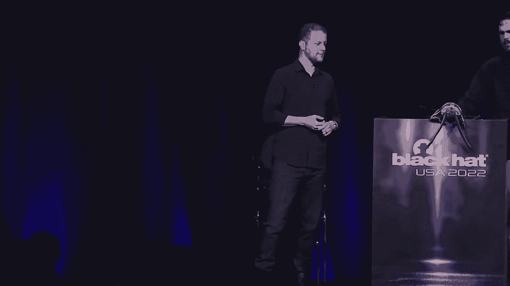

所以这是，你知道只是一个，你知道关于，你知道，IoT，那么有什么意义呢，我们说有一个，你知道大约400个不同的或独特的物联网设备出现在网络上，问题是他们中的一些人并不那么伟大，我不知道你有没有听说。

但有些不是很好，在这种情况下，我们有一些人，他们部署了一个摄像头，就像他们家里的运动探测器，它在播放视频和时间点，就像一幅画，就像它会拍照一样，然后他们把它放在手机上的应用程序上什么的，一切都很清楚。

另一个是我们自己的东西，后面有一些设备，有人安装了一个物联网网络摄像头，肖恩，它很大，是啊，是啊，我知道你又回来了，影音的人说我们今年不在谈话中，我们是因为他们已经在过去了吗，我还没有。

然后我看到这个很抱歉。

肖恩，我们仍然爱你，好兄弟，这是对的，所以这让我们发现了很多，像一个远程喂食器，对某人来说，猫的名字实际上是加菲猫，这就是为什么我们觉得这很有趣，但一切都很清楚，然后我们编辑了一点。

所以你不能进去惹可怜的加菲猫，但我们有我们需要的东西可以随时喂那只猫，它已经被命名为加菲猫，显然他们有宠物档案，这一切都过去了，我相信你不能，在那里已经够难的了，但它说大自然很懒。

所以加菲猫是一只非常懒的猫，是啊，是啊，令人震惊，我们去喂那个小，做一个好的电视节目猫咪，API，这是我们发现的有趣的东西之一，这个是网络证人，一个挖了一点的猎人，这是一个工具，用于外国，嗯，外币贸易。

所有的数据都是你可以在应用程序中滚动并看到，他们看到的一切都被加密了，是四四三，然而，当他们做任何交易时，如果他们的帐户有变化，上述货币的交易，API调用是清晰的，所以说，那个是那个搞砸了。

我们发现那个证人，一次又一次，我们挖掘并发现的有趣的事情之一，说保安，不管是你的抵押贷款报表，你在给一所大学发电子邮件，如果你以前听说过，或API调用您的外币，我是说再来一次，这只是其中的一件事。

它就像，你不能相信应用程序正在做他们说的事情，他们火力全开，线鲨，好好看看吧，看看这个包，看看它在发送什么，因为你不知道如果你不去看，我们刚刚看到了一些与民族国家相关的恶意软件。

当我们在一家通信公司的个人设备上挖掘它时，那将是那个州的目标，所以我们会和他们聊天，但是是的，把你老婆藏起来，把你的孩子藏起来。

