# P17：018 - Ret2page： The Art of Exploiting Use-After-Free Vulnerabilities in the Dedi - 坤坤武特 - BV1WK41167dt

and without further，ado，i'd like to welcome，today's presenter yang wang。

good morning and evening welcome to my talk，my name is wang yong，i focus on enjoy and brother。

vulnerability research，you can follow me on twitter，my dm is open by the way。

while my friends wants to know，if there are some jobs in canada for foreigners。

he is also of vulnerabenergy researcher in synape，i really appreciate your sharing of the job information。

here is a agenda，i will briefly review the conventional ideas and，steps of exploiting a usf。

vulnerability in the general cash，and the details，why is the technique，of course。

catch attack has to be a planned，when exploiting a uf bug in the dedicated cash。

then i will introduce return to page a new and gla，exploitation technique，specifically。

i will review the critical parts of both slap and ballocator，and i will detail they will learn cross。

catch attack techniques and discuss，and i will also detailed the king idea and accounts conception。

module behind the new is exploitation technique，you can learly understand the technique。

i will discuss two typical uf，vulnerability，fixed the last year detail。

how to exploit those two vulnerabilities，respectively，the last part just summarize，i talk in indians。

carlo，there are two main categories have cash in general，and dedicated cash for general cash。

just invoke key mamma and key free api to allocate，and free a heap object for dedicated cash。

the cash is created for a specific time，the cash must be provided when allocating and。

freeing as the million attack surface，have been reduced in recent years。

few bugs can be exploited from the，untrusted app context in andrew carlo。

the second bug in the eo subsystem，and the fourth bug in the t t y driver fixed last year。

caused a little attention，even if the second one was explored in the wild。

the last year there are no public explots against the，andrew。

carl like the dirty pile before discussing，how to exploit a ua f vnability in the dedicated cash。

let me briefly review to typical androy exploits about。

how to exploit a usf vulnerability in the general cash。

the first uf werbin is savage twenty twenty zero，zero fourty one。

they related the bundload object is allocated in chema one，hundred and twenty eight。

cash in order to make color pointers to fake a balload object，the public explored spring。

the eo item objects to refuse the fed，bunload object after leaking the color address of the bounder load。

they pod use send messages，spring technique to obtain the right primitive then corrupts。

some fields of the，leaked pointers to obtain a a r w primitives。

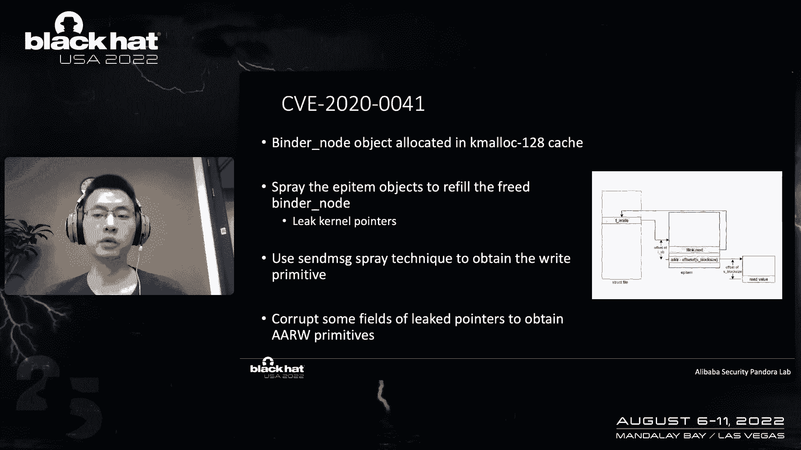

the second one is also a bounder bag，they exploit spring sequential file objects to obtain。

colors slide，and it also use epo item objects to obtain，a a r w primitives。

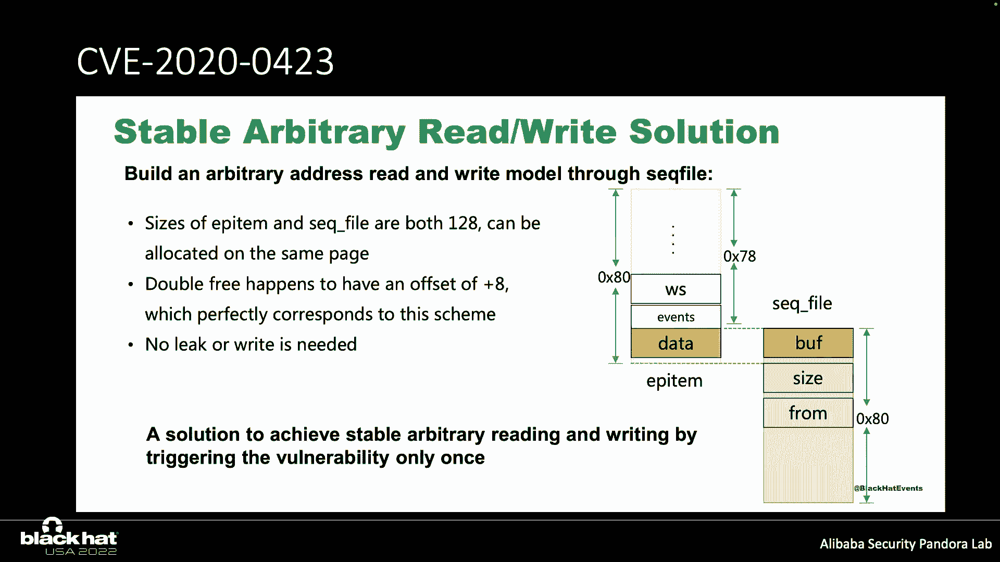

it's easy to find out that the，sequential file objects is indeed allocated in the general cash。

however，the epitem object seems to be allocated in the，dedicated cash to remove the doubt。

let's dive into the source code，when creating a new slug cash。

it were first try try to find an aliens，cash is the aims to reduce the memory fragmentation。

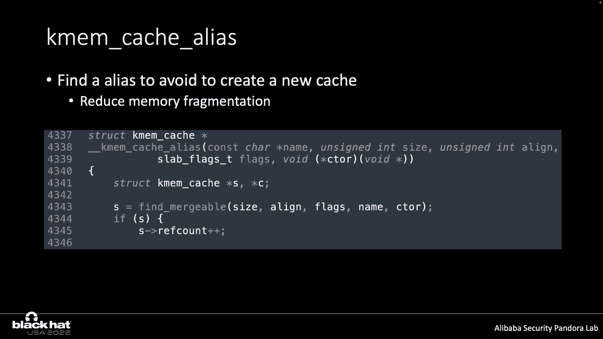

the slab merge configure is usually enabled，is the maswitch if the new cash has a constructor。

it can be merged into another cash，without any special flag。

the new cash will be merged into another cash，which basically has the same configure。

so that's why the epitem objects are eventually，allocated in the general cash things changed from andrew。

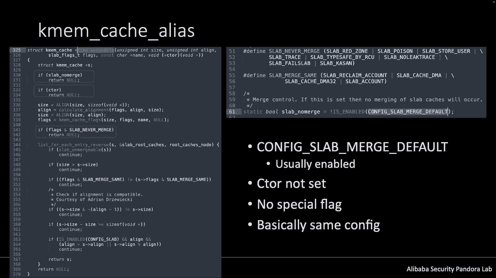

carlo，four point nineteen the sequential field has its own cash。

and the slab account is said that means both of the two。

catches will not be merged into the general cash from angetto。

roeleven both free list，random and free list，harden are enabled in my view is a kind of ooov。

mitigation，and the alien switch is still on from android，carl。

five point for the aliens switch is off by default。

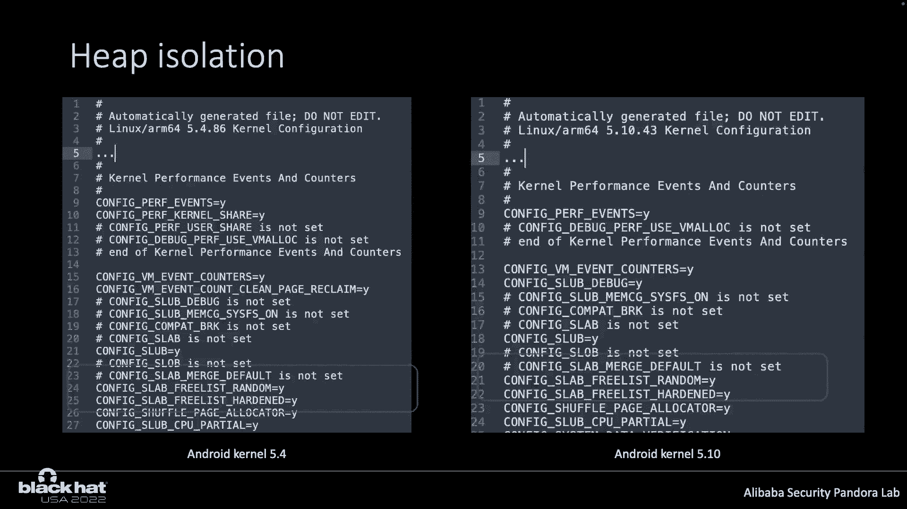

that means the dedicate cache will never be merged into the general cash。

the cost is increasing the memory fragmentation，obviously different types of objects。

allocated front key mx still share the same catch，so to exploit a bug in the dedicated cash。

cross catch，attack techniques，have to be applied to make different types of oobjects。

share the same memory，a second part，here is a typical example of，how to exploit a uf bug。

the king point is that one of beats is overlapped with the freed object a。

so how to refuse the freed object a reliable to answer。

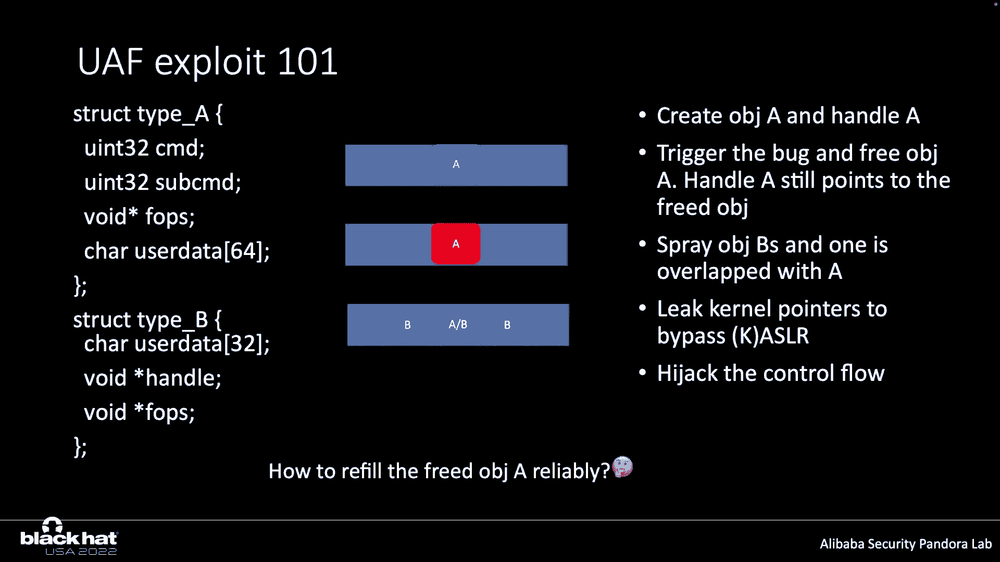

this question，let's dive into the slap allocator here。

i list some important fields of the king memory，cash now just focus on the cpu lab and the load fits。

the cpu catch cpu，sorry，the key memories catch cpu is allocated per cpu call this。

we can pin a process to a specific cpu call by setting the affinity。

we can simply recognize that there is only one cpu，core for android devices。

the long uniform memory architecture does not be able enabled。

so there is only one cpu cash load when allocating an object。

it first tries to allocate from the free list，the free least points to a physical page here。

the pity frame，number，eleven zero zero，its so called fast pass when page。

eleven zero zero is full page，twenty twenty zero zero will be moved into the free list。

now the partial list of kememory，cash is empty page。

thirty three zero zero in the partial list of kememory，cash load，will be moved into the free list。

after all the pages in the partial list of a camemory，cash load are full of objects，a new page，one。

three three eight will be allocated from the body allocator，when freeing an object of a pages。

thirty thirty three zero zero and page fourteen，four zero zero，respectively。

the two pages will be added to the partial list of key memory，cash cpu，the pages are you are in a。

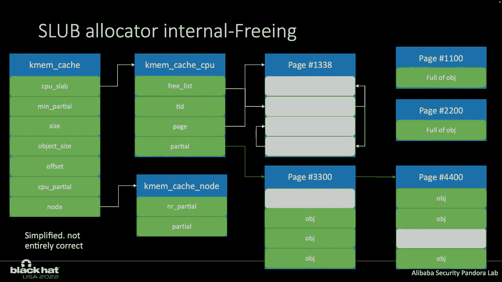

so called freeze state，catch cpu is a large than cpu，partial page。

twenty two zero zero and the page eleven zero zero will be added to the，partial list of a camera。

key memory，cash load not this camemory，sorry，sorry，not the hero。

cash cpu with the number of pages in the partial list of kememory。

cash load is the large than million casual，the empty page。

eleven zero zero will be freed and reclaimed by the body allocator。

suppose a user handle is associated with the freed object a。

it is possible that it is allocated from page，twenty，twenty，twenty，twenty two，the lazlo。

it doesn't matter when spring object b，it's probably is that the fed。

object a is refused the fast path，makes it reliable。

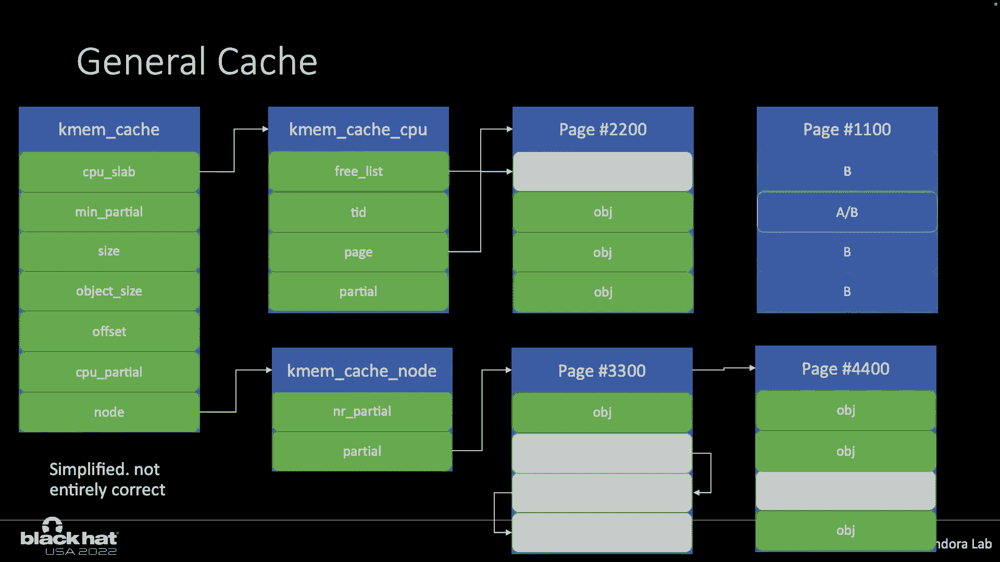

things become complicated with a freed，object is allocated from the dedicated cash here。

both a and b have their own，cash，so spring optilb cannot refuse the fed objea。

be refused with the other types of objects，uh，it's possible to free。

the related physical page and the page can be allocated to other cashes。

so the fed object a can be refused by this in direct way。

but how to reduce the freedom physical page reliably to answer，this question。

let's dive into the physical page，allocator，this is the classical ballocator，i take from the book。

the allocator maintense blocks of free pages，where each block is a power of two number of pages。

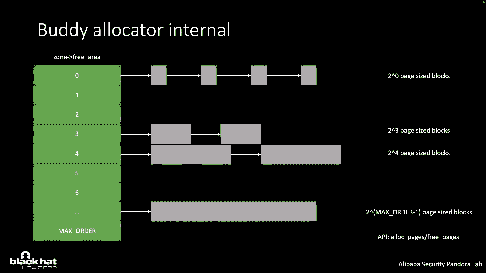

you can learly understand the free page management，i put the two allocators together here。

the order of the cash is three，it means that the slap slap page contains，eight physical pages。

and the partial list of both came memory，catch cpu and key memory，catch load are empty。

and the the order of compound pages，one three three eight and five three three eight is three。

so page，one，three three eight will be allocated when allocating a new object。

when pg one three three eight in four page，five，three three eight will be allocated now。

there is no third order，compound page，when pty five，three，three eight is ful the fourth order。

compound page，eight one zero，zero will be spilled into bodies，now we began to begin to free。

the objects specifically accept the page，eight one or the eight make all other pages。

partial were empty，and the most important things that the number of pages in the。

partial list of kememory，cash load is a large and really cap millie partial when page，eight one，zero。

eight is empty it will be reclaimed，as the body page，eighty eight，one zero zero is still free。

the two third of other，compound page will be merged in merged to form a fourth order，complepage。

so that's basically，how a slap page is handled by those two allocators。

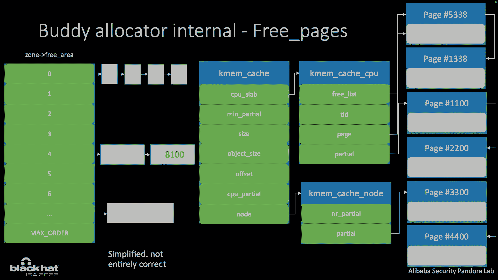

in fact，there are several zones based on the migregation type。

here is the basic idea about cross catch attack is the limcarl。

the first step is springing the objects，not only the current slap page exhausted。

but also all the pages in the partial list，must be occupied the red block。

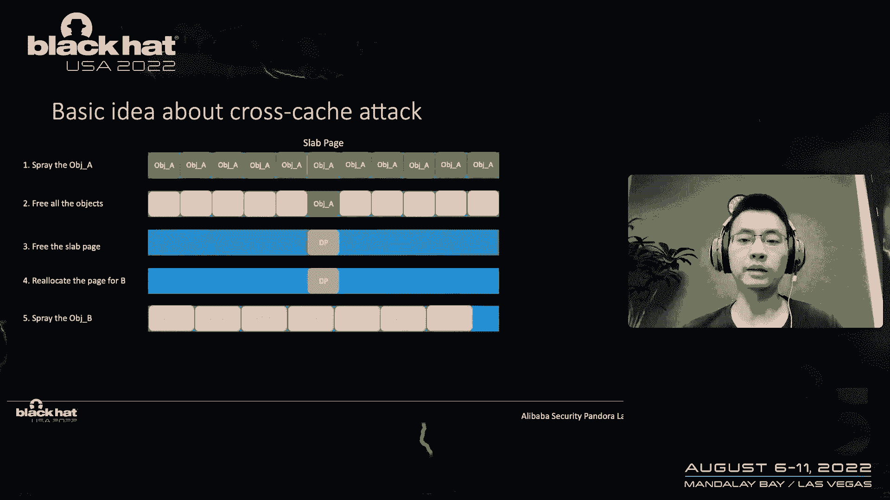

represents the vulnerable object after trigger in the uf bug。

all the objects in the current slap page afraid，make the current slab page empty next。

the slap page is reclaimed by the body，allocator when spring object be it was first exhaust。

the partial list of both key memory，catch cpu and keep memory catch load the cash。

you will require more pages，if the free page is successfully is allocated for the cash。

object b can be over overlapped with the，vulnerable object a to cross the slab。

catch the related pages must be the free state，so the step one，two，three is required and to allocate。

lose that page is required to exhaust was a free select page，first，this is the reason。

why cross catch attack is the memory and time，consuming and less deterministic。

in two thousand fifteen win xi，published a paper from my own，opinion。

i recognize it as a cross cash technique。

the key point is that all the physical pages，which can be allocated for slave。

allocator are nearly mapped，so we can repeatedly call the map cisco to spring。

the pages until the specific page is mapped into the user space。

as the physical pages are nearly backed the car address of the，dangling pointer is always validated。

seven years ago，i used this idea to exploit a type conference bag。

you can find this slide on my github，here is the steps to feel the uf sockets。

they epod repeatedly call the end map，cisco until the free socket returns a fixed fixed time，step。

oversity it's time and memory consuming，but why sorry。

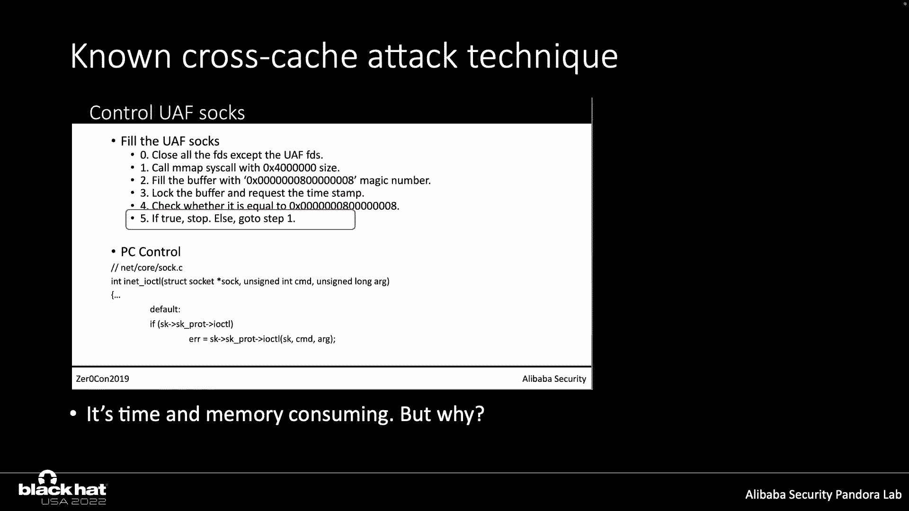

there are lots of flags to be set when allocating a page here。

you just focus on the migregation type and the page order for slepage，it's unmovable。

when allocating a page for a user address，the migration type is immovable。

i take the figure from your hslide，roughly the different migregation。

types of pages are stored in the different page，free list，it looks like the cross cash。

so it's time and memory consuming now。

we know the answer to this question，the page order is different as mentioned before the high order。

pages can be spilled into now，or no other pages so is required to exhaust，the。

no other pages first meanwhile，the migregation type is different。

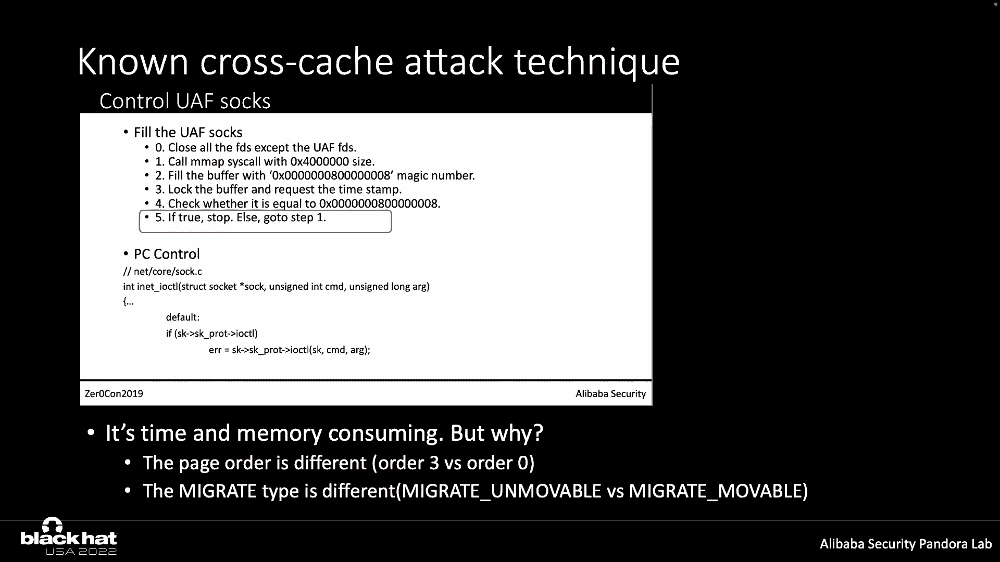

and we freeing a single page，it will be added to a cash list based on the migration type。

so the page can be reallocated，very soon uh，it's impossible to reduce the page by map。

cisco more generally，the lone cross catch technique is useless with the。

order of a slide page zero now，let me introduce the cross cat tag technique return to page。

the core concept is allocating the same order，and the migration type pages，which can be read。

object x to refuse the fed object，increase the possibility of reusing the target slab page。

and the content of the freed object can be legged and modified by reading，and writing the pages，uh。

it's next time and the member consuming and more deterministic uh。

but it's but it's but the limitation is overse，usually。

since the content of the pages can't remain intact，operation on the object。

the step one two three can not be avoided，i talked about it，the previous and saf some tricks。

this can be used to shape the hyphone try，and make the every allocation，more determine alistic。

and here i list s，uh the old friend pile subsistence，gives us，one page allocation。

both the user space and color space，can read or read it，the pages order is under the control，uh。

it can uh，we can let the color to the dirty job，uh the lo and drivers can give us。

some totally control pages，uh，but it maybe it might might be different，uh。

due to the windows specific implementation，uh，the gpu drivers can also give us。

some totally control pages，uh，but it's not a universal，uh。

i this called this code slifei take from adrenal gpu driver。

the io us disco can give us some totally control pages，however。

it is blocked under the anchuntrusted apple domain，uh you can use it under the。

sheldon，shelden。

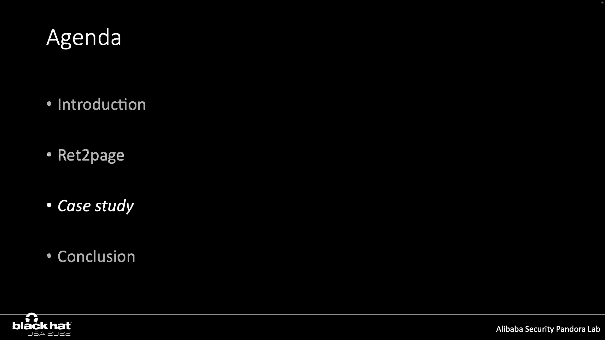

the third part，to nearly understand the return to page，exploitation technique。

i will detail how to exploit those two highlighted，vulnerabilities，fifth the last year，uh uh。

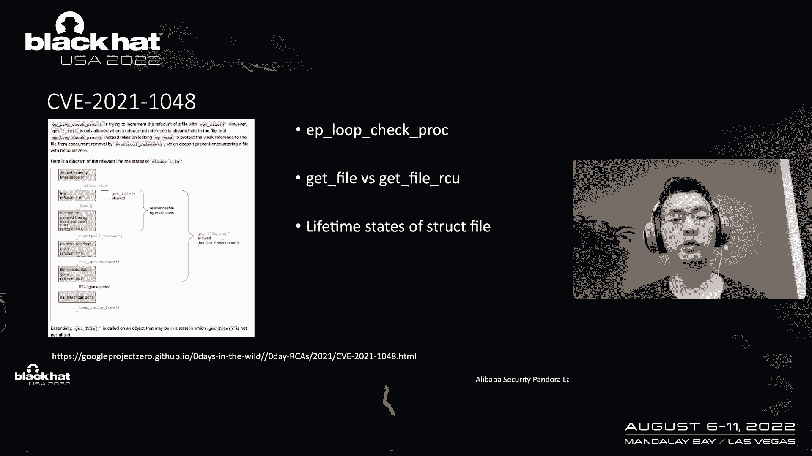

you can find the briefly root，cause analysis on google project throblog。

so when inserting an eo f descriptor inside another evil file，descriptor。

uh it was first performed the loop check，especifically uh it will traverse was a u evil items。

recursively uh，if the related field is not uh eal field，and it has not been added to any link list。

the reference count will be increased，increased unconditionally to the regular regular field。

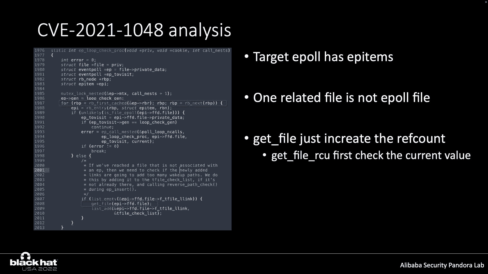

will be put at the end of a yo control cisco uh，although the whole process is a protect by epimetx uh。

the regular field can be closed uh virus，the ford handle。

specifically task，a creates an epifand adds a bundfd to it，descriptor to another，evil file。

descriptor a during the loop check，if the bounder field is submitted to free。

before increasing their referencount，the bounder field can be submitted to free again，uh。

if you are interested in，how to control the thread or living。

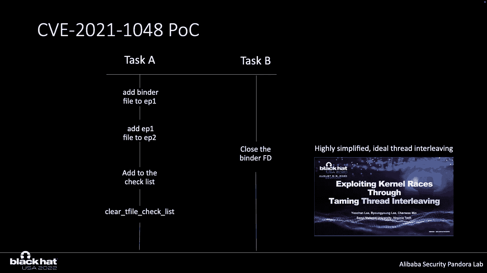

and just check out this slide before triggering the bug，we should shape the cash uh。

make sure that the number of the freed objects is large and secure，partial。

and the number of pages in the partial list of kememory。

cash load is the large than mini mini partial，then trigger the bag and refuse the freedom fields。

the target field will be freed uh when clearly the target flink list，uh。

we can close was the other fadescriptors to make the，slap page back to ballocator。

there is a handle related to the freedom field，but we don't know which one is。

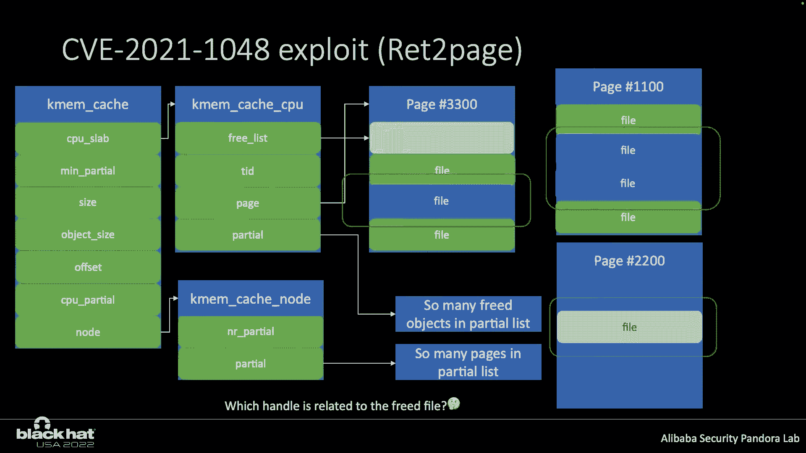

since the page就是shady的，between ual space and color space。

s m a p5 p a n mitigation is naturally by past，as discussed previously，the content of the page。

how to bypass k a s l armitigation。

because that the panding fields are opened with red olin wood。

so we can set the fed feels mode as read，only then repeatedly cosplay splice，cisco to check。

whether the fd is a target descriptor，you know it just returns the banda descriptor error。

since since both in an outfields are not pfeels，the delies function just returns the invited value error。

so based on the different error codes，the target handle can be figured out。

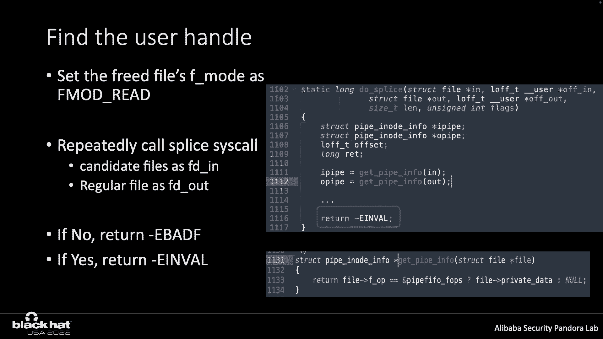

we have to find a way to bypass，k a s armitigation for android devices。

the colors slide is to make abbland，and cannot extend across one，gigabyte alignment，bandary。

the limitation is derived from mv，eight m m u are hdware，and the most important things that。

there are only sixty four beats for randomization，so uh。

it's possible to get the colors slide in a short time，but how to guard color crush。

since the feel has no vantfoperation，it's easy to panic。

the color due to nonpoint of the reference were invited the color dress。

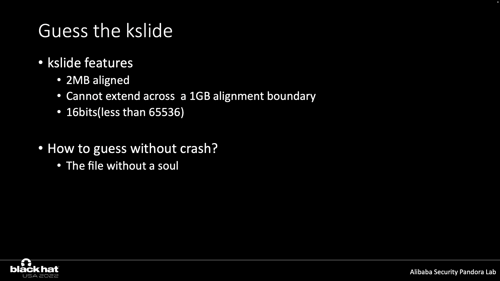

it's similar to finding the user handle，it just requires sitting the parameters carefully here。

the fd in must be long the value when the color slide drawn。

the fd in will not be recognized as a pepperfield，so it returns the invalid value error。

when the colors slide right，it will return a pile error，because the oyis not zero now。

we can figure any type of a few，and the page is under is under control uh。

it's easy to obtain a a r w primitives，i will talk about later。

the bug was this bug was first disposed to liko by yang hong。

but also found by me before either was fixed the，vulnerability was finally lexi robot。

row security ability in may last year，although jn details，how to exploit against the deban colonel。

the exploit code cannot work on an android devices。

i successfully rooted the epixel two to five，and other android eleven flagship。

flagship devices at that time from johz post。

the object is allocated in the general cash。

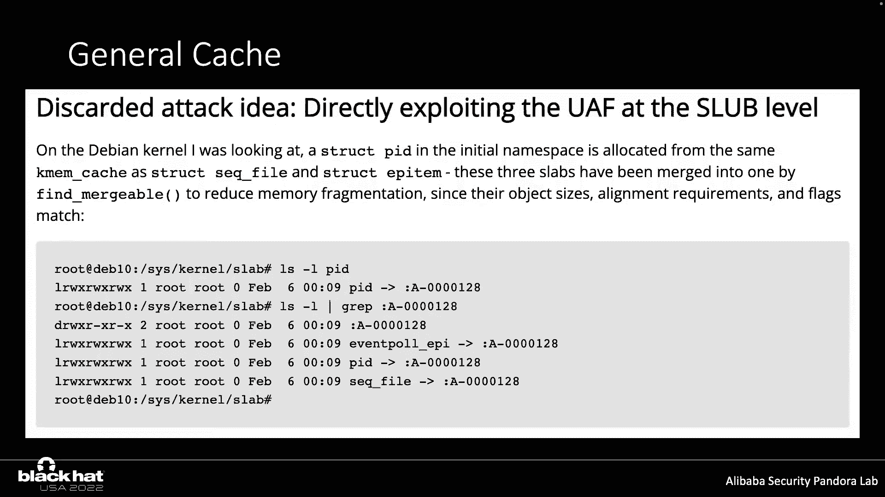

but it's not such simple in android carl，branches for color，four point，four uh。

indeed the pd object is allocated in the jelo cash，however for color four point lighting uh。

it's not as discuss，the previously a cash with slap account，cannot be merged into the general cash。

so basically for the old color like four point four，the objects is allocated in the general cash。

and therefore the upstream color branch，the object is allocated in the dedicated cash here。

i just focus on the abstring color branch。

when i reviewed，this is io control handler，i found the code is likely bu，look at the real circle。

the code release the old pd object of real pi，real t t y object and assign a new one to it。

however it use the spring lock of t t y objects，that's the spring log of real t t y object。

when sending a command to the master driver，the t t i object represents the master and point。

and the real tt object represents the sleep and point uh。

but when sending a command to the sleep driver，both of the objects represented the sleep and point。

so we send comments to the different driver drivers，drivers can count one three pp i d a。

and then the context switch happens，another story，can also put the p i d a。

it's reference cis decreased twice，if it's reference czero a will be destroyed。

there are three different types of hash list in pad object，the pi link array of the task，struct。

object is used to attach to the pad object，a p i d object is allocated uh。

when creating a thor u process for new process，was the types of p i d objects are attached for new thread。

only the pad type，pd is attached as larson，should be pattention to is that the pages order is zero。

the hyphone try is very similar to the progress，exploit，as the single page will be reallocated。

soon using the pipe page，now we have the same question，and the answer is almost same。

as the page is under our control，uh，we can set the pointer of page，list，head to zero。

uh and we can fork a new process and attached to the raid object，the task struct address。

can be liked by reading，the page，look at the red circle uh，if the lamb space，uh is echo uh。

the nr value will be returned uh，otherwise it's just return zero。

and the p a d lab space is not enabled on android carl，branch。

the lab space is always in need p i d lab space，uh is a coral data pointer。

as the page is under our control uh，then folk a new process。

and attach the test struct to the freed object，freed pad，now，it points to the task struct list。

清洁清洁在p i p g d of the newly spoon process，it will point back to the page that means uh we can override。

and they redirect，a pointer of an object to the control page，and the task struck of one page。

liked uh，we can redirect some pointers here，i choose the it feels struct。

because the f d table is storing it。

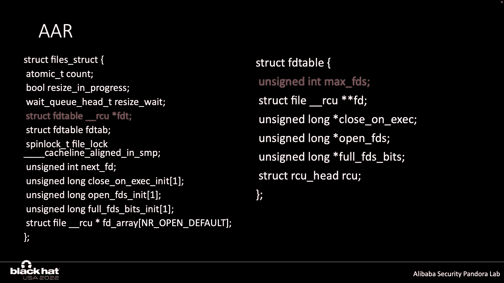

and the mask，ifty can be read from the process status。

the pointer to the page，the f d，the f d table，pointer is controyed。

so we can use it to point to anywhere，and read four bays，each time by reading the status，uh。

basically，it's the aa r ability，now uh we we can also fake any fields，uh we can craft a few。

meta data in the page，here i fake a pipe f，by controlling，the page of a pipe buffer，uh。

basically in the a r w primitive is obtained。

so here is the demo。

five minutes，mr wang，five minutes。

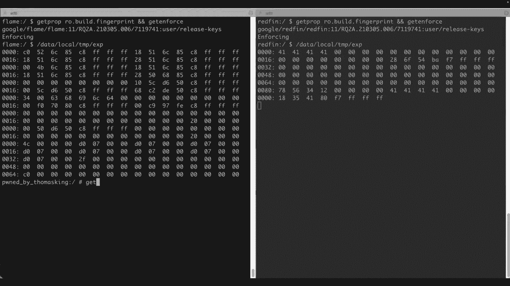

so takeaways uh，the the interval of both slap and body，allocators have been alerysis uh。

return to page，uh，new and gla exploitation technique has been detailed uh。

those are two vnerabilities have been discussed，and the employees have been fully detailed uh。

here are the reference，ok that's all，thanks uh by the way，since this slide还是chili的呃。

you can find the current version。

