# P18：019 - Monitoring Surveillance Vendors： A Deep Dive into In-the-Wild Android Full - 坤坤武特 - BV1WK41167dt

我很高兴欢迎克里斯蒂安·罗素上台。

所有的权利，嘿嘿，大家欢迎来到我们今天的演讲。

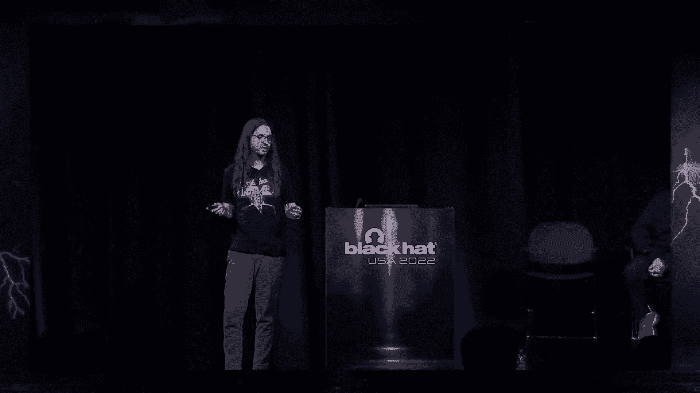

我们将讨论几个Android全链，我们在21年通过监控监控供应商在野外发现的，这是我们在你的左手边你有心雨和理查德，他们在安卓恶意软件研究团队工作，他们致力于保护Android免受恶意软件和攻击。

右手边是我，克里斯蒂安，我在谷歌的威胁分析小组工作，我将在几张幻灯片中更多地谈谈我们的工作，所以这个演示的主要部分是深入研究一个利用，我们发现作为一个完整链条的一部分，新雨将带领我们渡过难关。

但在此之前，我会给你一些背景，是什么标记了我们，以及这些完整链的一些例子，之后理查德将学习一些后期开发技术，我们在游戏商店发现的一个漏洞，在我们总结之前，还有一点关于为Android辩护的内容。

所有的权利，所以谷歌的威胁分析小组或标签肯定，我们的目标是保护谷歌和我们的用户，我们这样做的一个方法是，我们经常在野外狩猎零天，你可以在右手边看到，嗯，回到1919年，我们报告了在野外发现的七个零天。

二十分之一五二十分之一二十分之一，所以对我们来说这是相当好的一年，到目前为止，在22年，我们报告了三个，我们在野外发现的零天，在这里发现这些，我们正在做的是，或，我们正在做的一件事是。

我们正在追踪三十多个不同的商业监控供应商，嗯是的，正如我提到的，他们就像我们在跟踪30多个，所以我们经常看到媒体上提到的少数几家公司，这是一个非常繁荣的行业，有很多不同的公司参与其中。

我们看到的一件有趣的事情是，其中一些团体实际上在分享，或者在彼此之间出售功绩，所以有一个案例我们有一个铬强烈逻辑定律，我想是在21年我们看到几个团队使用相同的漏洞，所以这里也有某种形式的公司。

所有的权利，接下来，我会谈谈我们在2021年发现的两个Android全链，这是两个不同的监控供应商的两个完整的链，第一个是我们在1921年10月发现的，它被提供给当时最新的安卓设备，他们利用了两个漏洞。

其中一个是铬的零日来执行，在Chrome的渲染过程中，它被严重的沙箱，从那里他们需要逃离沙箱，他们在利用一个时代参考，Linux内核中的漏洞计数，这个漏洞有趣的是，它实际上很快就被修复在上游内核中。

所以他们推出了补丁，就像，或者一个补丁的bug，然后就像修好了一样，我想是一周后，所以很快，但不幸的是，在Android中，只有第一个补丁被选中，所以它让Android脆弱了大约一年，我觉得，不幸的是。

这不是第一次发生这种情况，另一个被称为坏活页夹的漏洞也是如此，这已经被公开记录了很多，这也很快在上游内核中得到了修复，但到达安卓花了一段时间，是啊，是啊。

所以沙箱逃脱公园里的这条完整的链条有一件事很有趣。

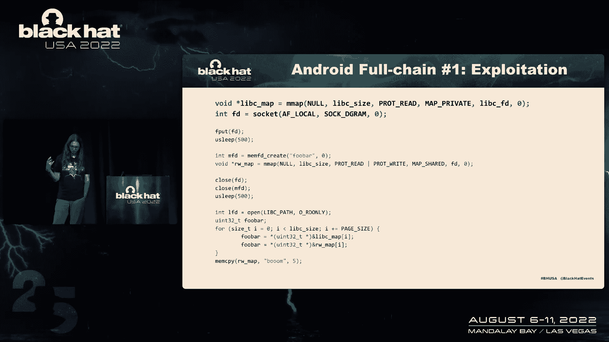

所以当他们利用这个时代的参考，计算漏洞，他们有一个非常有趣的开发技术，我只想提到，因为耶，我觉得很酷，我想我以前从未见过这种记录，所以是的，因此此漏洞为攻击者提供了。

在Linux内核中释放文件结构的能力，同时您仍然有来自用户空间的对它的引用，作为文件描述符，所以你有一个非常经典的免费场景后使用，嗯，这种开发技术的目标是，这只是开发的一部分，但是监视者选择利用的方式。

能力是正确地访问代码，他们在这里做的是他们可以正确地访问lib c，当他们写信给LIPC时，这些变化，将镜像到系统上的每个进程中，所以有效地利用这一点，您可以在每个使用Slip c的进程中执行代码。

这就是一切，和步骤，第一步是映射lib c，哪个是你用地图的目标，然后呢，创建可以在其上触发此漏洞的文件描述符，所以I在原始代码中，我是说有一个巨大的虫子触发器，但我用输出代替了这个。

它是释放文件结构的内核API，所以只是把它提炼成一张幻灯片，所以更容易看到，但是是的，所以下一步就像你触发了一个bug，所以现在您有了一个文件描述符，它指向内核中释放的文件。

您可以通过创建一个MFT来快速替换它，它将占用最后一个空闲文件结构，然后将其映射为可读和可写，现在我们想再次释放这个，所以因为我们通过创建另一个文件来替换以前的文件结构，用户空间中的这两个文件描述符。

实际上指向内核中相同的文件结构，所以通过关闭两次，我们可以再次释放文件结构，我之所以要做两次，是因为Linux内核对此有两个引用，文件，一个是通过创建mft，一个是通过做m映射，所以我们读了。

我们再次取代它，所以现在这个MFD共享内存映射，它有对上一个文件的引用，您知道它应该像一个共享的mefile，但现在它实际上又是lib c，这就像是开发技术中有趣的部分。

他们所做的是循环浏览lipc中的每一页，因此，您可以在每个页面中循环这个循环，这确保内核将从这里将页面加载到内存中，但有趣的是，当您这样做是为了可读和可写的映射时，Linux内核就像敏捷的处理程序。

我们将查找与此内存映射相关联的文件，现在实际上是lib c，因为我们在所有页面上都有错误，果仁很开心，我们将lib c页放入可读和可写内存映射中，然后我们可以覆盖它，这将反映在每一个过程中。

这个特殊的监视供应商用它在某些系统调用中注入shell代码，如果它在正确的过程中运行，它将加载并植入，这是第一个完整的链条。

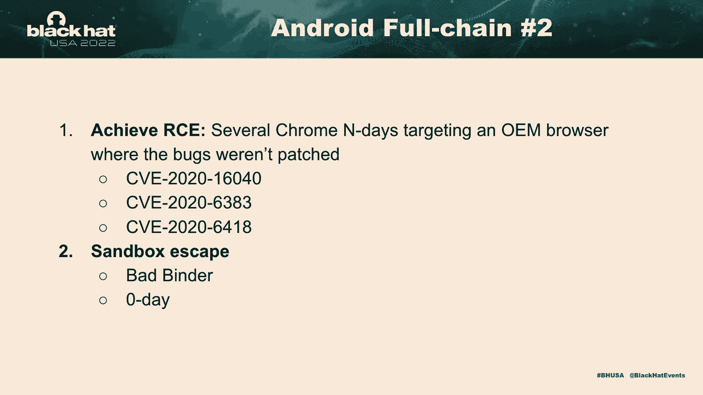

所以第二个，这与新宇和理查德将要谈论的开发直接相关，嗯，这个监控供应商使用了相当多的，这是一个有点不同的策略，所以与其用零天对抗铬，他们实际上是针对一个基于Chrome的浏览器，在补丁上落后于铬。

所以他们可以用N天来对付这些浏览器，因为那是零日，基本上取决于浏览器的版本，他们有三个不同的bug，他们会与他们的漏洞捆绑在一起，三明治的脱离部分是为了脱离铬，在某些情况下。

他们使用了我前面提到的糟糕的活页夹漏洞，但在其他情况下，他们实际上使用了连续的一天，你会听到更多关于这个的，但很快，但首先，让我带你回顾一下，对于这样的目标用户来说，它是什么样子的。

所以发生的第一件事是用户收到一个一次性链接，他们点击它，当他们点击它的时候，它们被重定向到攻击服务器，这个利用服务的工作，取决于浏览器版本，版本等等，在这两种情况下，为了监视渲染，他们的目标是铬。

所以他们有某种铬的利用，在Chrome的渲染过程中获得代码执行，至少在我们发现这个漏洞的时候，我不确定现在是不是一样了，但是他们滥用Chrome WebAssembly代码映射，因为它们以前是可读的。

可写可执行文件，所以他们放了一些shell代码和l f加载器，是啊，是啊，通过跳到这个精灵装载机，它们加载本地特权，升级利用，我就把它交给你，给你，我们要深潜到我们捕获的零点，也是在去年11月固定的。

这是一份简历，所以它可能是去年最复杂的Android内核专家，它也可能是历史上最复杂的，就其根本原因分析和开发技术而言，所以基本上我们捕捉了两个主要版本的漏洞，所以X光机是最近早期设备的目标。

和额外的B目标是最近的设备，所以一切开始，一个非常简单的特性是用户可以将文件描述发送到其他进程，通过发送消息思科的SCM奖学金图。

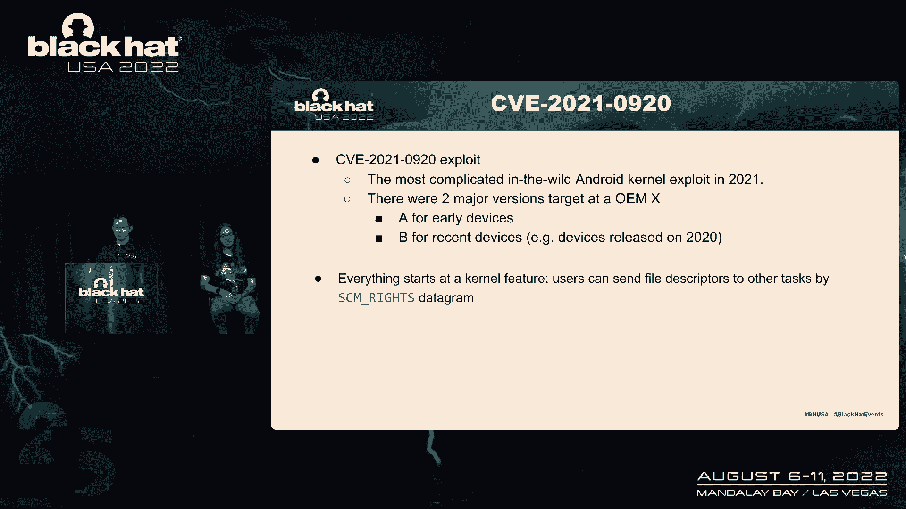

假设我是一个套接字文件，我派了一个手机去找B组，所以在内核中发生的事情是，首先内核分配结构，称为KMS得到鲍勃或插座缓冲区，或者又名，因为KB将套接字缓冲区追加到接收器队列，正如您所看到的。

套接字缓冲区中有一个字段，指向另一个新分配的结构，在刻度上称为A和P，它包含一个由五个指针组成的区域，指向飞行中的火灾，所以从我们接收者的角度来看，它接收到了信息。

因此套接字缓冲区将从接收器队列中移除并获得空闲，内核将根据文件A安装另一个文件描述符C，正如您所看到的，文件A现在有两个引用计数，好的，所以说，然而，让我们考虑以下场景，就像我是水疗中心。

我给B发送一个单元格，给B发送一个单元格。

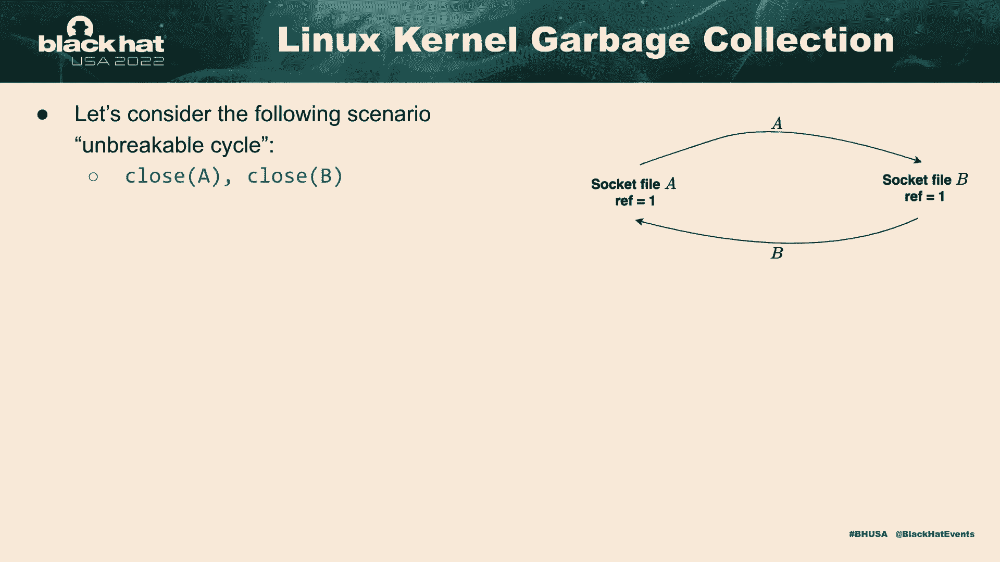

然后在用户空间中发生的事情是使用乌鸦A和B，所以内核没有办法破坏文件A和B，因为他们还有一个参考计数，但是使用这个程序没有办法再接近了，因为五个离散已经从某种可描述的。

这就是为什么我们在Linux内核中需要一个政府收集器，例如，每次你打电话，在垃圾收集系统矩阵中关闭此卡，识别潜在垃圾的方法是实现一种叫做平面计数的东西，所以在飞行中的意思很简单，你知道飞机上是否有文件。

然后我们只需增加引用计数，在飞行中，你可以看到王牌，事实上是一个，因为A在飞行中，所以同样的，它在行计数不是一个，如您所见，这里的引用计数等于帐户，所以这可能是潜在垃圾的好迹象。

但如果我们考虑到这个循环，情况并不总是这样，就像a和一个细胞到b把一个细胞送到alpha，送出去成为B和B到A，所以如果你使用太空程序，关闭a和b，这里发生的是A引用计数等于飞行计数。

bin帐户等于引用计数，所以A和B被认为是潜在的垃圾，但它们实际上不是垃圾，因为我们可以从五个discalpha中得到五个平方b，我们可以从五个反叛者那里得到五个平方。

所以从我们政府收藏家的角度来看首先，a和b被认为是潜在的垃圾，所以A和B被放入一个名为俗气下划线候选者的全局列表中，然后是在飞行中扫描GZ候选人，假设内核扫描第一个，所以它会检查一个接收器Q。

所以特定的q是b，因为B也在GC候选人中，什么样的做法是减少计件量，所以B平坦计数从2递减到1，同样，计数也减少到零，然而，由于B计数仍然高于零，因此，所以B不被认为是垃圾。

要做的是在飞行计数中递归还原，所以一个计数中的蜜蜂将恢复到两个，有效的ACE将从0恢复到1，没有人被认为是垃圾所以，然而，如果你考虑到maton的易碎循环，a和b被认为是潜在的覆盖范围。

所以他们被放进GC候选人中，和扫描弯曲过程将导致以下结果，所以它们都被认为是垃圾，所以内核的最后一步是创建这个垃圾是通过删除，并释放套接字缓冲区，然后到A B中的五个，所以我们也有两种方式调用接收消息。

所以如果我们调用没有巨大峰值标志的接收消息。

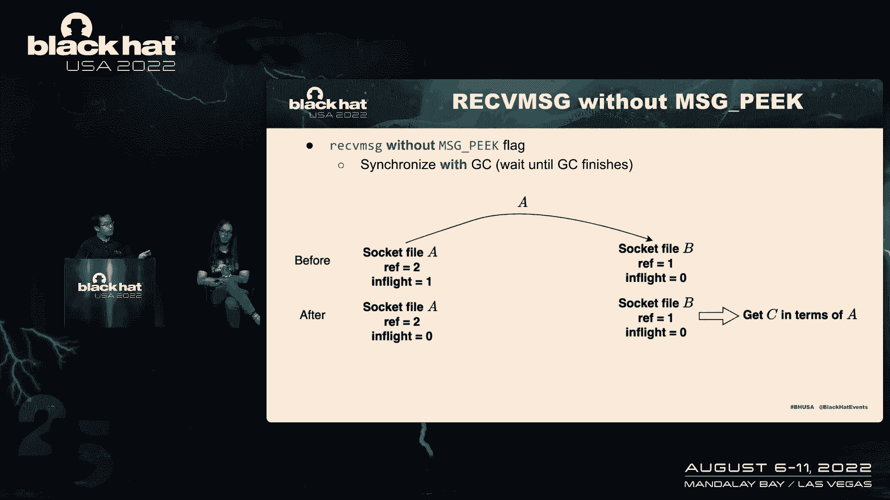

首先，它将与GC同步，这意味着内核将安装一个新的文件分发器，但在GC结束之前，所以说，在内核中发生的事情是，接收器将删除并释放套接字缓冲区，并安装另一个，呃，找到这个描述，然而。

如果我们用巨大的峰值标志调用接收消息，它与GC不同步，这意味着我们可以用消息猪标志让三分之一的呼叫接收消息，同时还有另一个线程在做GC，也从接受者的角度来看，它不会删除套接字缓冲区。

所以和内核仍然会安装另一个战斗分散体，这样你就可以看到，ACE参考计数得到提升，好的，所以现在我们真的想介绍一个能力场景，就像我说的，这里的问题是，带有大量标志的消息与GC不同步。

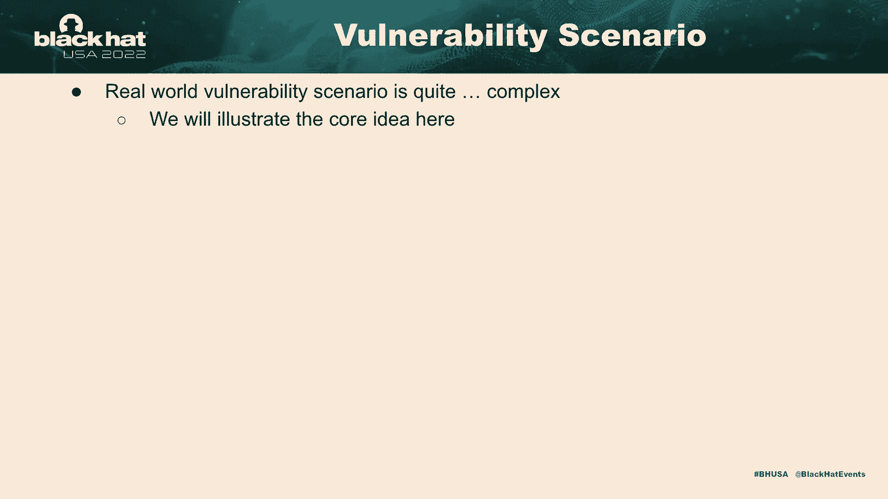

所以会有一个文件，参考文献不能升高，但是你知道，这种漏洞很难触发，因为你知道大多数时候你听到的是嘿，文件引用不能偶然减少，那么怎么做呢，如何通过电梯免费获得用户文件引用计数，然而这很复杂，不幸的是。

我们不打算在这里讨论细节，但我们将举例说明call idea，嗯，所以你知道这里收到消息的车与，呃，有巨大的峰值和GC，所以它需要是一个非常复杂不一致的状态，和这里的各种其他风险条件。

其中它导致套接字缓冲区中的用户空闲，所以你知道我们必须创建三个主线程，一个线程做GC，两个两个任务来接收带有所有结果的消息，信息pflag和通过一个非常教练。

其中一个接收器将接收用户空闲套接字缓冲区对象，所以这里的补丁其实很简单，你知道它只是被称为旋转日志和旋转，都在两行中，以确保像消息峰值一样，他们将在Letes的GC和，有趣的是。

当前的bug是在2016年发现的，你可以看到你可以检查这个电子邮件线程，呃，因为它是一个公众在这种电子邮件给我们，呃，不幸的是，补丁没有被接受，所以这意味着任何坏演员都会看到莱纳斯这样的电子邮件线程。

可能会想出一个针对新闻和用户的漏洞，好的，所以现在，让我们来看看A是如何做到的，所以A是旧设备，所以首先，你知道在离开的过程中会有很多，以及赢得风险条件的方法，很有可能产生尽可能多的垃圾。

这也是检测的好兆头，事实上，会有很多威胁，包括彼此，对臀部的一些威胁，为四个bugon修复内核结构的三个威胁，也会有很多威胁影响我们的时间表，通过非常，非常酷的选择，你有一个有用的物体的机会很小。

也得到一个臀部，所以这就是为什么X光试了一百五十次，弹簧套接字缓冲对象的遗忘。

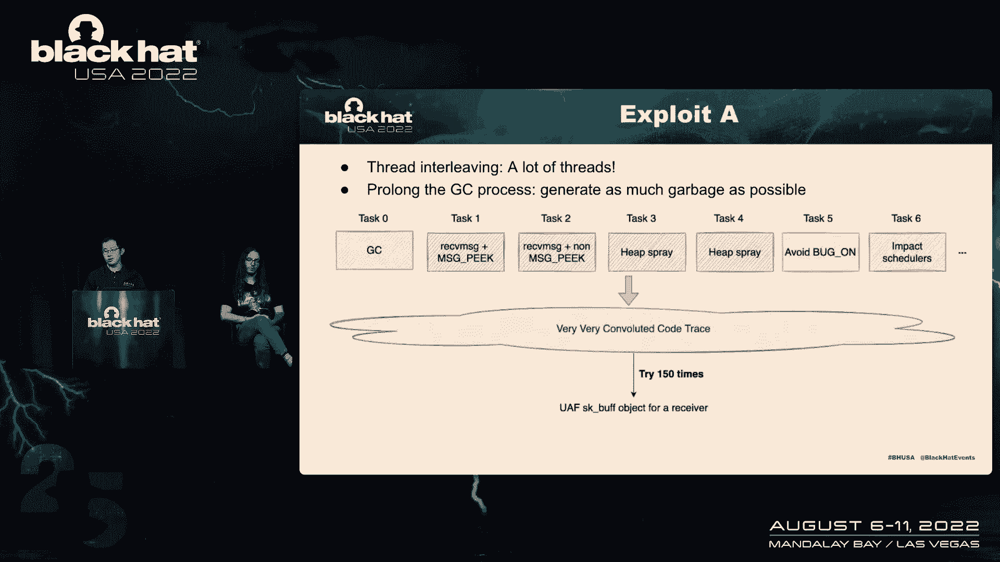

也喷在缓冲对象上不是，这并不容易，因为缓冲区对象是从单独的缓存中分配的，所以这意味着传统的历史技术不起作用，但是有一种叫做交叉捕捉垫的东西，就是你知道。

如果我们能释放同一个实验室页面中的所有SO缓冲区对象，因此页面可能有机会被写入页面分配器，可能被其他缓存使用的，这可能会受到正常的忏悔史技术的影响，但机会很小。

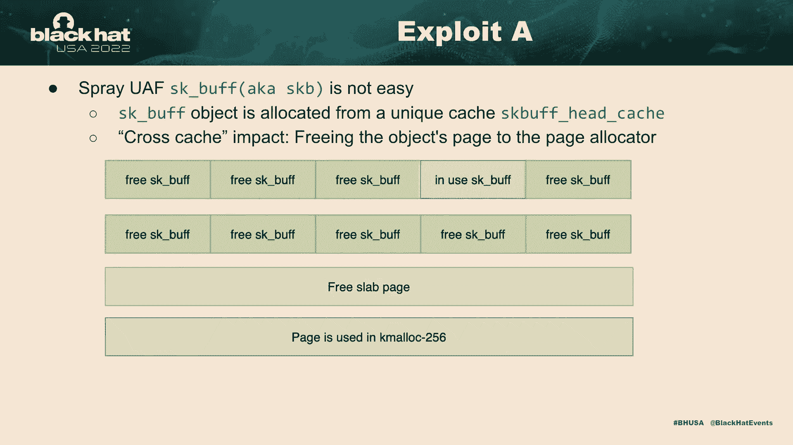

内核中发生的事情是，如果我们调用接收消息光盘，内核将把地址从CAV数据复制回您的基础，现在的问题是我没有信息披露，我应该读什么地址，所以对于X SAA来说，非常有趣，因为它读取物理地址。

并读取页面大小数据计算出M D五个哈希值，与512个值的哈希表进行比较，这样就可以计算内核基偏移量，那么为什么它实际上读到，读取固定地址，所以我们相信这是因为奥克斯在六臂上发明了内核。

基于主流内核前的实现，并基于，它只随机化了九个碱基和四个k对齐，因此攻击者通过一种方法来访问价值，不能只在本地，所以通过一个半任意的，专家能够迭代任务，并从它的一个子进程中找到精确的类型结构。

并得到地址的地址，我是说，如果你运行你的Android设备，使用低于四点十四的版本，或者写地址限制喜欢我的两个那个和使用，使用空间程序能够读写对象，您可以寻址以便获得任意正确的原语。

他们实际上有一些非常罕见的东西，叫做内核错开，所以这里的基本思想是你知道，如果用户空间程序初始化UNIX地址并将其传递给内核，什么样的工作是施放mecopy，从单位地址复制，正如你所看到的。

这里的地址来自千伏，因为我们控制了KB，所以大概如果我们控制了SQB SK。

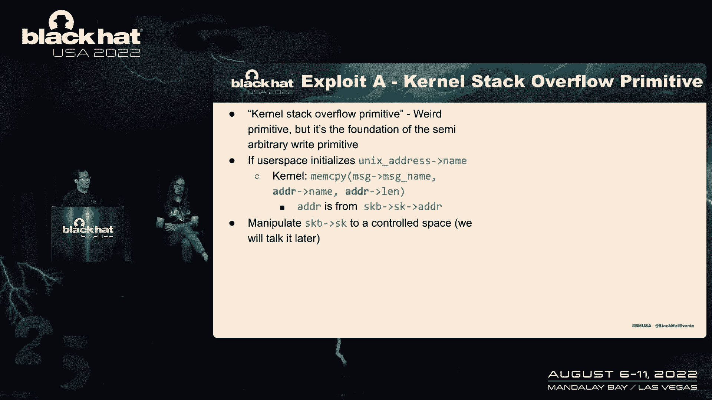

然后我们可以制作一堆流，所以如果我们有堵流，我们可以从仓库中裁剪很多堆栈变量，或者在消息中裁剪三个六，所以这是一个很大的图表，这是堆栈溢出的受影响区域，如果我们能控制SCP K。

所以这样做的方法还是通过特权访问，在mais中从来不用x。

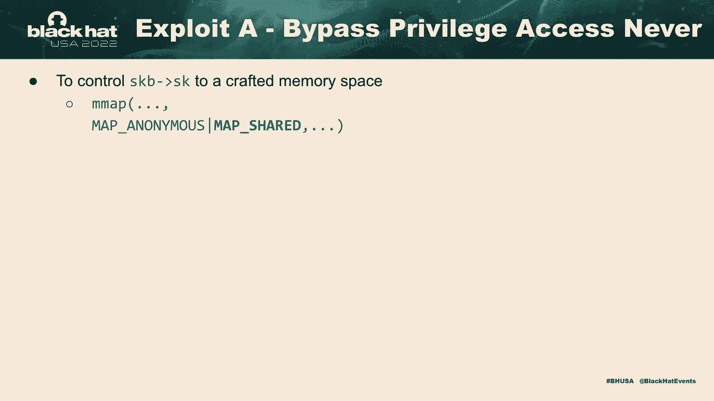

使用map属性创建用户空间内存，因为地图商店的财产没有版权机制的支持，所以第一次读取内存会触发，所以结果，当前将分配一个页面，X射线能够使用它的半读原语来找到，转储整个内核堆栈并查找指针或页指针。

并使用Page to Verge宏获取相应的内核地址，呃，换句话说，呃，这个，呃，呃，专家能够，你知道的，获取相应的内核地址，但是用户空间内存和内核空间内存映射到相同的物理页面。

然后您可以从用户空间内存中制作所有类型的数据结构，并有效地触发流的堆栈，所以一旦你这样做了，并触发堆栈流，这里实际上看起来像。

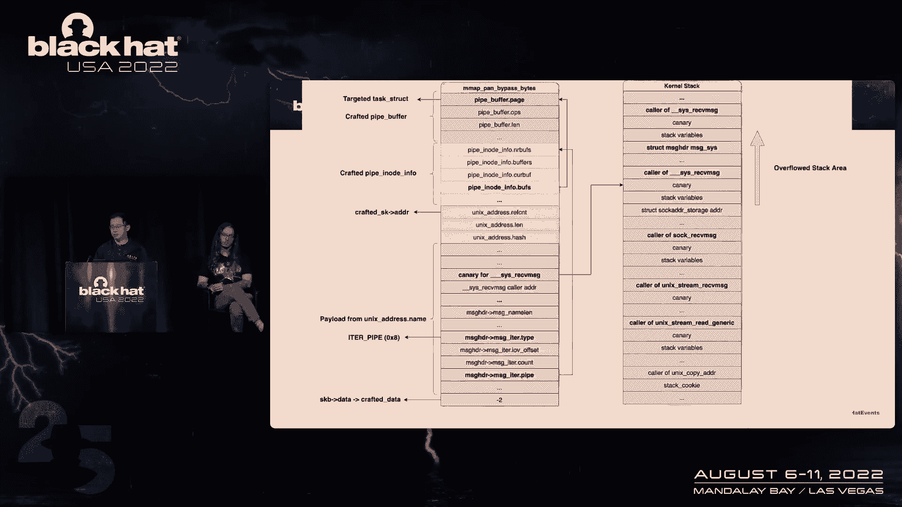

所以首先，有一个非常关键的um堆栈变量叫做消息头被破坏，所以每次当接收者呼叫接收消息时，内核将使用损坏的消息头，然后我们有点相信嘿，我们使用管道数据结构，所以您将查看假管道数据结构。

所以这里正确的目的地地址是，它指向税收结构，源地址现在点是kV数据，它只是指向它指向你的Q字，你用负2填充，所以结果，如果接收者调用接收消息，呃，的，将利用假管道数据结构，所以地址限制将是嗯。

高估作为事情，所以使用空间计划可以上游，你写从到做得到一个真正的特权，好的，所以呃，让我们来谈谈，比如说，b所以导出七，b针对最近的版本，所以你知道，呃，任何时候我们对套接字缓冲区有什么用处。

千伏数据可以自由地，如果你知道，如果我将文件发送到另一个任务，内核将倡导一个名为FP列表的结构，它包含一个空中五指针，指向飞行中的战斗，好的，所以当SVP部分如此，我们可以在SD数据上做历史来解释。

到新分配的lcm，所以这里的策略策略是XP样本花费大约80，向新装置开火的五项免责声明，然后从接收端它可能会收到80个内核文件地址，所以你知道会有几个文件结构占据整个板页面，好的。

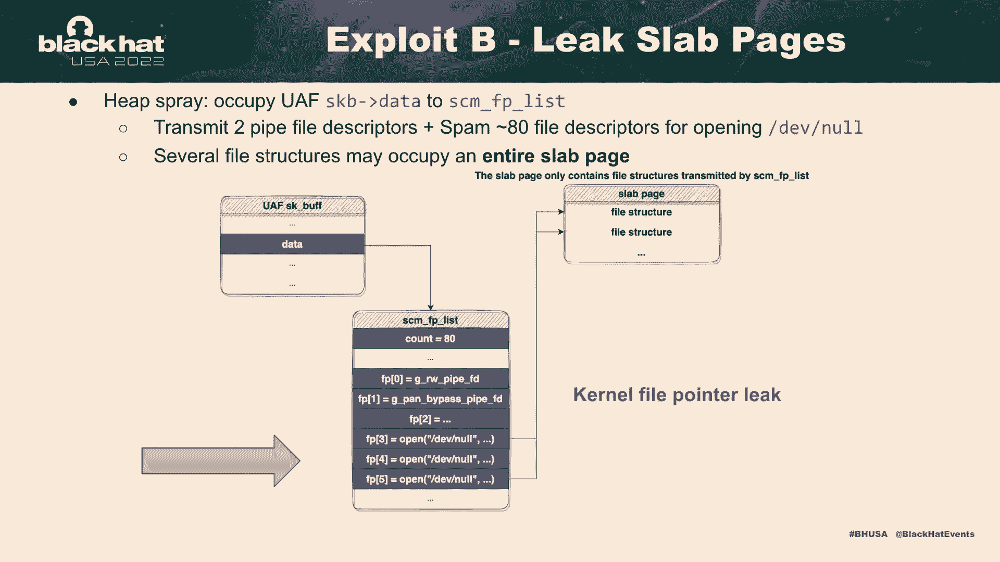

所以如果我们关闭这些战斗机描述符，通过发送插座图来做臀部三，这意味着我们可以控制整个堆栈页，然后我们可以在这里制作各种假的管道数据结构，到这是页面的控件，所以这里的下一个问题是如何连接我们的正常文件。

到假包数据结构，所以这就是没有联系的原始国王要拯救的，所以当受害者告诉接收用户免费插座时，套接字缓冲区，嗯，它可能会在链接上调用叫做p的东西，通过在KB上弹跳并覆盖下一个并变态到一些，呃，恶意的，呃。

地址，那么在取消链接中发生的事情是普通文件。

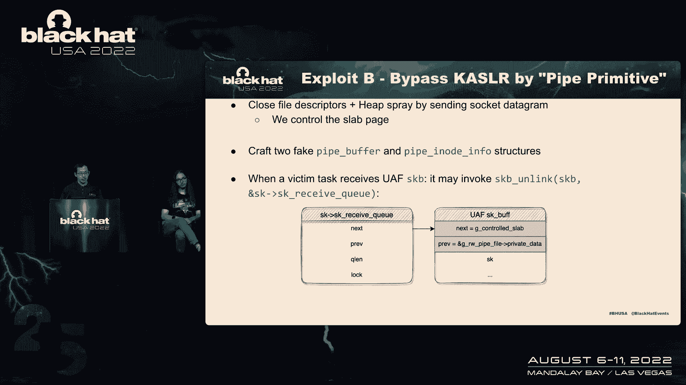

或者更具体地说，是信息中的管道，所以信息中的管道指定内核，我们必须遵循管道缓冲区来读写原语，这里的下一个问题是管道缓冲区操作没有初始化，所以我们现在可以用这个假的管道结构。

现在混合初始化管道的是管道缓冲关闭很容易，只需将一个字节写入管道，所以内核为我们初始化UP，并且通过读取用于占用堆栈页的套接字，我们可以泄露整个堆栈页面，包括管道缓冲器。

这样我们就可以有效地绕过AERA，我们也可以做一些叫做管道迁移的事情来绕过以前的访问，总结一下，我们通过操作管道缓冲区页和类型缓冲区偏移量，我们可以在正确的原语中实现内核。

这是绕过药物硬件水平的又一种方法，用户访问覆盖，我们称之为PI原语，我们看到，你知道为什么在20 20中用这个把戏吗，因为你有绿色的右周长，您可以获得代码执行，您可以恢复一种简单的表地址。

因此了解更多信息，现在请继续打开我们的项目零气体块，请欢迎理查德谈论后开发技术，谢谢。

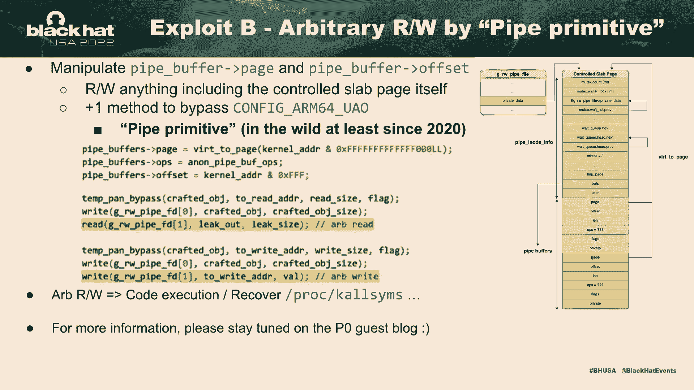

在这一点上，攻击者已经得到了上校重写，所以你可能认为下一步是普通的Setsse Linux到允许的，所以你变成了UID零，然而，在这种情况下，有关的目标设备具有提供额外保护层的虚拟机管理程序。

读取包含SE Linux强制的内存，所以你不能编辑它们，和非特权用户模式进程不允许调用有用的函数，比如RKP，覆盖学分或关闭电源命令，因此攻击者需要找到其他方法来改变SE Linux。

并设置他们的用户ID，所以对于SE Linux来说，利用代码找到一些重要的静态变量，通过分析SE Linux相关内核函数中的指令，他们找到了一个ADP指令，如果你知道手臂装配工，它引用了一些数据。

查找指令，你知道数据的地址，然后利用代码可以提取SE Linux策略，对它进行一些修改，刷新，重新加载数据库，有效地，SE Linux已经被允许，那么UID零呢，这有点复杂，实时内核保护机制。

信任自己的可执行系统，bin smd exe作为特权进程执行，所以这给了你一个启动后门的初始入口，第二个可执行文件，简单的perf用于使完整的后门运行。

所以这是如何在SMD EXE中注入一点shell代码的，这确实使用RKP重写信用，因为它是一个受信任的特权进程，因此它将自己设置为根UID零，全后门已经放入简单的Perf。

所以d exe然后运行简单的perf，此时，我们将整个后门作为UID零运行，SE Linux有效地处于许可模式，攻击者用这个做什么，首先，这几乎是你所期望的，他们从设备上上传了很多信息。

专注于社交媒体数据库，消息，那种事情，这里的列表并不全面，我们在幻灯片上没有空间来容纳所有的路径名，但你可以在顶部看到社交媒体的东西，底部的Android帐户数据库，有一个拼写错误用红色突出显示。

我们稍后会讲到，从设备上复制各种数据后，然后攻击者通过并再次禁用许多系统安全设置，他们更改的设置比这里显示的要多，但是我们没有空间在幻灯片上，所以设备现在被其他恶意软件攻击的风险增加了因为安全设置。

自动更新，等，已残疾，一些第三方防病毒应用程序也再次卸载，可能会使用户面临更大的随机其他恶意软件的风险，最后，后门可以自己清理，如果它被命令这样做，现在克里斯蒂安前面提到过CV二十九二二一五。

所以我想回去看一个特别的例子，作为9月下旬时间线的提醒，2019零号项目的玛蒂·斯通识别了漏洞并标记了，219安卓修补漏洞，我们写了一些探测来利用，把它发出去看看我们能找到什么。

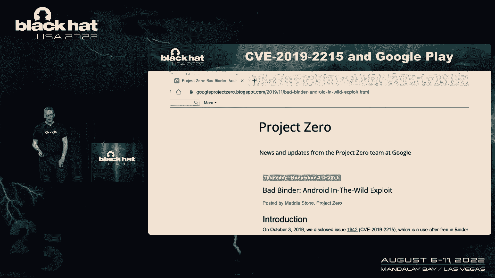

那么我们发现了什么，我们发现了一个CV201921215的漏洞，更有趣的是，它包含了对几个Android应用程序的引用，其中一个在这里显示，选择VIO查看器工具包，我们发现它的时候它正在播放，有趣的是。

它是在1919年2月上传播放的，大约七个月前我们，它知道CV 201922。5的存在，你可以在这张幻灯片的右手边看到，这是一个相当全面的权限列表，这个图像查看器有，为了在设备上呈现图像。

您可能不需要所有这些，第二个应用程序不起作用，那是一个非市场应用程序，伪装成谷歌的应用程序，使用谷歌驱动器图标，Pictivio查看器工具包，没有很多安装，当我们发现它的时候。

我们看到了不到30个终身安装，在1920年的有效载荷之间有许多相似之处。

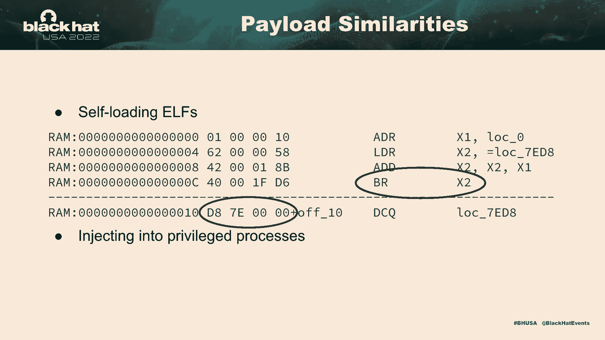

和2021年的有效载荷，ELF文件导出了一个函数，它本质上是一个自装载机，调用为内存中的位置修补elf文件的函数，就是那个时候，处理所有的重新定位并解析所有的导入，幻灯片上显示的是我们看到的其他东西。

有时精灵头被一个相当简单的垫片覆盖，它调用自加载函数，这是六十四位垫片，有另一个非常相似的三个两个位，因此，您可以将L文件视为一团shell代码，把它留在记忆中，跳进那个记忆块的开始，它自己加载。

所以一切都修好了，没有额外的麻烦，就像在二千零二十一年一样，在二零零九年，有效载荷被注入各种特权进程，在安全设置上有相似之处，禁用文件以复制要卸载的应用程序，等。

我们在这里看到了同样的拼写错误在219个有效载荷中，就像在二十一世纪一样，配置文件实际上已经有一段时间没有在那个位置了，所以说，也许攻击者只是没有清理他们要复制的标准文件列表，对呀。

我们对这个好的本地有效载荷做了什么，任何写成手臂或手臂64的东西，你必须有可执行的内存来运行它，因此，如果您可以看到一些意外的可执行内存出现在您的进程中，看看记忆中的内容可能会很有趣。

这里显示的信息来自我们运行Chrome的内部分析系统之一。

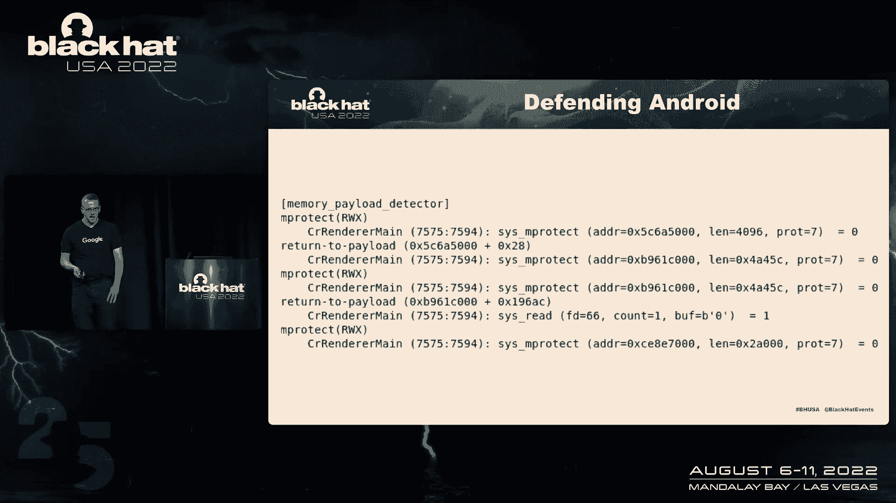

我们给了铬，简历二十一六零四零再次利用，克里斯蒂安前面提到的，如果你看这里，我们可以看到一个有趣的长度的内存块正在被读写执行，然后稍微往下我们可以看到一个系统调用正在返回到这个。

潜在可疑的读写执行内存块，所以里面肯定有一些代码，开心的，我们的分析系统捕捉到了这个内存斑点，并为我们保存了它。

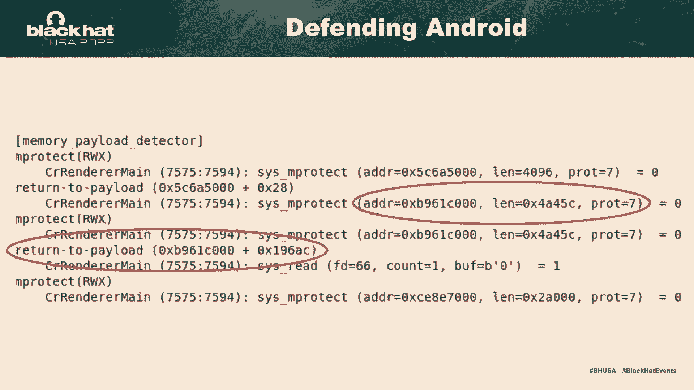

所以这是潜在可疑记忆的开始，第一件可能引起你注意的事情是，在一个相当不寻常的偏移处有一个精灵头，通常你会希望在页面的开头看到ELF标题，或者正如我前面提到的，取决于你在看什么，在这种情况下。

可能会被跳入自加载代码的垫片覆盖，这里L文件之前的数据是另一个垫片，这个可能稍微有趣一点，它将一些数据从一个位置复制到另一个位置，然后它从elf文件跳转到自加载导出，所以是的，这个TLDR。

这是新宇刚刚详细解释的利用有效载荷，所以这让我们绕了一圈，发现Chrome远程代码执行正在野外使用，它包含了一个有趣的有效载荷，结果是零日，2011年的有效载荷与旧的有效载荷有一些非常强的相似之处。

在这两种情况下，有关的漏洞都与修补不匹配有关，你可以在Android和Linux之间调用它们，也许一个补丁没有应用在一个，而它被应用在另一个或某些东西被遗漏了。

cb202120920是一个非常复杂的漏洞，而且开发起来相当复杂，开发人员想出了一些相当有趣的行为原语，以便使一切都正常工作，研究和实现所有这些一定花了他们一些时间。

所以他们显然有足够的资源来做到这一点，因为它可能不会成功，安全行业就能越快地找到并修补这样的东西，我们就能更好地保护我们的用户，监控行业就会花费更多的时间和金钱来维持他们的能力，我们需要减少时间。

它需要我们去探测事物，修补东西，并获得更新，为了继续保护人们，我们能做的更快的反应，越好，希望像漏洞奖励计划这样的东西会有所帮助，因为它鼓励人们向我们提交东西，他们会得到一些奖励，所以有了这个。

我想这就结束了。

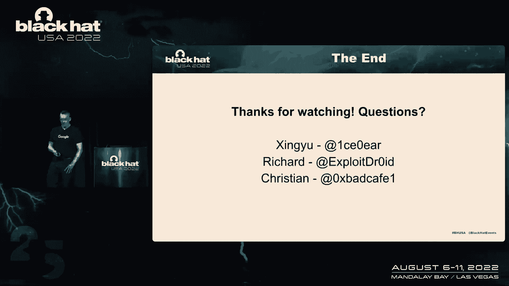