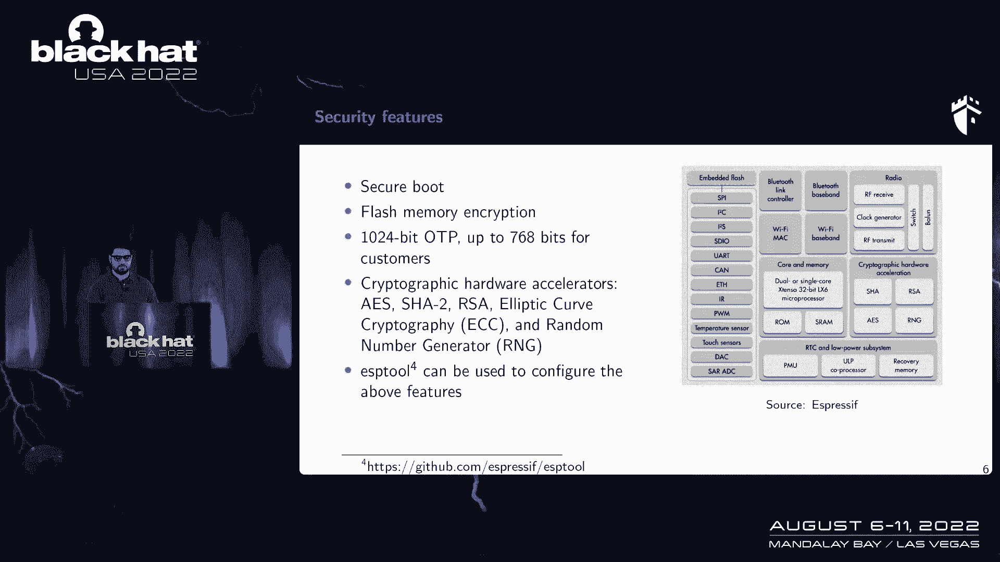

# 【转载】Black Hat USA 2022 会议视频 - P19：020 - Unlimited Results： Breaking Firmware Encryption of ESP32-V3 - 坤坤武特 - BV1WK41167dt

你好，每个人，我叫卡里姆·阿卜杜勒拉蒂夫，我是分类帐公司的硬件安全专家，今天我要展示无限的结果，破坏…的固件加密，（尤指），三十二伏三，这是我和奥利维尔的合著，里约和阿德里安·蒂尔。

为什么我今天要做这个演示。

我想你们大多数人都知道，（尤指三十二个），这是一个非常著名的微控制器，这是一个低功耗的SoC，它已经在市场上部署了几年，浓缩咖啡实际上宣布，到2018年，它在市场上销售了1亿台设备，对我来说很重要的是。

它最近被部署为一个主要的微控制器，供应商是区块流，实际上会找到一个E，p，2V3芯片和一个外接闪存，但是，外部闪存用于存储加密固件，但是，固件加密密钥存储在ESP中，三十二伏三，注入和侧通道攻击。

为了提取密钥，耶，p2v3，不是E，p，二v一，比如说，顺便说一句，没有任何E，p，三十二伏二，所以关于ESP二V一，它在1919年受到了有限结果的攻击，主要思想是他们已经攻击了安全。

启动和肉体加密机制他们使用Bar，强力故障注入，使用更多的小故障，为了在上电时干扰使用保护位，在成功的故障之后，他们已经拿到钥匙了，固件加密和密钥安全作为对此攻击的反应，表现力强的宣布（尤指）。

主要思想是补丁，新版本对攻击效果有限，所以新版本，（尤指），三个，二v三，有几个功能，如新的安全引导，他们使用基于RSA的安全引导，以避免在问题中存储任何私钥，也正如浓缩咖啡宣布的那样。

这是我演讲的提纲，首先我要介绍ESP32V3的安全特性，在那之后，我将向你们展示一个自制的故障注入装置，我要用它来评估，ASP排序到V一，我的意思是用电磁滤波器注入来再现有限结果的攻击，在那之后。

在ESP32 V3上应用同样的场景，在那之后，我会发现一条新的攻击路径，使用侧通道攻击破坏固件加密。

我将以供应商的答复和结论结束。

所以关于ESP 32的安全功能，嗯，（尤指三十二）有许多特点，但让我集中讨论芯片本身的安全特性。

所以它有一个安全的引导，它有肉体加密，还有128字节的otp以便存储一些秘密，比如rsa，随机数生成器与椭圆曲线，也是，您可以使用ESP工具来激活上述功能，和ESP工具，它是一个开源工具，由表现力提供。

你可以在GitHub上找到它，比如说，关于IUSE组织。

使用，正如我告诉过你的，它就像一百二十八字节，它被分成四个槽，比如说，第一个插槽，第一个插槽被使用并保留给系统，为了系统的目的，为了存储芯片本身的设置，我是说闪存加密模式，安全模式，它是否被激活。

比如说，你可以找到第一座和第二座，为了存储Flash加密密钥，还有一排安全引导密钥，最后一个插槽日志3用于用户应用程序本身，嗯，它可能会说不可能通过软件访问，在蓝色的一个和第二个街区，因为它们受到保护。

如果使用保护位，从自身恢复到行李箱中，唯一负责读取这些密钥的实体，实际上是已经使用这种键的ESP32的硬件，在上电的过程中，为了什么，执行闪存解密或执行安全引导，让我谈谈安全引导。

他们有两个版本的安全引导，他们有安全引导版本一，比如说，所以主要的想法是，如果你有一个固件，固件，它有一个引导加载程序和公钥，主要的想法是你有一个密钥它存储在第二块中，比如说，它负责安全引导。

此密钥用于加密引导加载程序，和使用256的公钥，之后输出被散列，使用512轴，为了产生我们所说的消化和消化，摘要是闪存中的一个存储库，在上电的过程中，执行相同的过程，然后进行比较，以便决定是否继续。

根据比较，如果它是正确的或不好的，关于闪存加密。

正如我告诉过你的，这是ESP32的一个安全特性，主要思想是保护存储在外部闪存中的固件，从任意轴，以及闪存加密，使用蓝色的用于加密和解密，Flash内容，为了加密闪存，使用解密，为了解密肉体。

他们使用加密，然后在上电的时候，闪存解密，比如说，执行，然而，他们用一种叫做关键调整的东西，为了每32字节更改一次密钥，这个键的调整就像一个地址依赖，所以如果你知道地址，您可以生成关键调整。

所以最后你会发现它就像一个常数，它只是用来换钥匙的，每设置两个字节，在加电过程中从肉体操纵的第一个槽，是存储在地址一键十进制HM的引导加载程序数据，因此您可以使用以下命令。

以便激活和存储Flash加密密钥，通过ESP工具，即有限结果的攻击，因为他们在上电时专注于分散保护位的故障，你可以看到这里的红色，他们已经登记了权力，上电时的功耗特性，黄色是电压，芯片本身的电压源。

你可以发现在加电过程中他们开始注入一些小故障，你可以看到这里的电压降，这是正确的时刻，已经出现了故障，一旦扩散保护位已经执行了成功的故障，之后呢，您可以执行内存读取命令，和安全引导。

现在让我谈谈错误的注射设置。

为什么我们需要或为什么我们执行错误，所以主要的想法是在执行敏感操作时扰动芯片，比如说，如果你有一个正在运行的安全引导，你可以注射，让我说，电磁故障注射，或激光或球棒故障注入。

以便在执行安全引导期间支付安全性或签名验证，如果你有一个正在运行的ES，您可以在执行ES期间注入错误，以便使用差分故障分析执行或攻击密钥，比如说，嗯，我要集中精力，在我对电磁故障注射的评估中。

我要用一个自制的有故障的注射工具，我们称之为硅测试仪，为了注入电磁脉冲，主要的想法是你有一个非常高的电压储存在盖子里，这个电压实际上是施加在，这里，它就像鹌鹑一样为了产生电流，电流会产生电磁场。

电磁场将与，试图产生或扰动芯片的芯片表面，我正试图注入缺陷，该工具能够注入高达1K伏的故障，我要用它来进化。

为了获得一个非常稳定的设置，我们决定制作一个BCB，所以主要的想法是这里有一个ESP 32，在PCB的顶部，之后是外部闪光灯，我们选择了一些VD别针或眼睛，为了在实验过程中控制VIDT的值。

这里还有一个外部振荡器来控制时钟，关于电磁故障注射装置，所以我用的是硅测试仪，为了注入电磁脉冲，我在这里用了一个振荡器，为了监控实验过程中的功耗，我用xy是这里的桌子，为了移动芯片表面的探头。

我还用了脚手架，它是在我们的内部制造的一块板，第一次，我在努力，证明电磁故障注入工具的能力，为了注入成功的断层，所以我将首先在一个有故障的应用程序上应用错误的注射，在一个非常简单的应用程序代码上。

在p32v1上，这是唯一能做的事，目标实际上是确保我拥有的工具是有效的，并保留一些参数以便进行下一步，下一步，当然啦，是再现缺乏有限的结果，之后呢，我将遵循我在ESP上做的相同的场景，三十二v一。

在asp六十二v三上重复一遍，看看有没有区别，让我谈谈E上的电磁故障注入，p，c，二v一，你可以看到左边这里，这是一个小故障代码，有一个循环，主要思想是向，柜台，同时，我要扫描芯片表面的电磁探头。

用五百电压扫描所有芯片表面后，我是说脉冲值，关于脉冲的极性，我的意思是我注入了一个积极的极性，我正在扫描每个点500个试验，马达马厩大约200微米，我发现这里在右边上面，我发现了一个非常有趣的区域。

在那里我获得了成功的断层，我可以从循环中跳过，所以这意味着我拥有的故障注入工具是有效的，我可以用它获得一些成功的假，所以现在下一步是现在繁殖，对有限结果的攻击，（尤指），我遵循的步骤。

就像第一件事是你有，你有固件，你加密，您存储加密的固件和外部闪存，之后，您启用固件加密，通过我在这里显示的命令，之后，我开始跟踪芯片的功耗，在启用闪存加密期间或期间，我发现这里有一个非常有趣的早期活动。

上电后，这可能非常有趣，以便在这一时期拍摄或注入断层，为什么，因为我期待，如果您在这段时间内操纵了保护位，嗯，所以我用的场景，我只使用了一个单一的过滤器注入脉冲这里计数，在那之后。

我要初始化一个脉冲发生器，就像脉搏套房，以及偏移量并控制它们，之后我要重新启动芯片，然后在重新开始的时候，我要注射一些食物，如果故障成功，之后，我将执行read命令，为了甩掉他，扫描芯片表面后。

我已经获得了一些成功的故障，然而，我获得了两个不同的成功，你可以在实验日志后找到，比如说，这里看第四个。

你可以发现这是我已经存储的正确密钥，然而，在五分钟内，我只把这个键翻了一点，为什么只有一点区别，因为有可能当我在加电过程中注入故障时，也许我也破坏了问题的价值，它们是从芯片本身操纵的。

所以这实际上不是永久的错误，但如果你。

如果您已经在某个时间内注入了错误，在它的BOR期间，所以我开始记录板迹以防故障成功，在这里你可以发现这是正确的时间，你可以在这里找到电磁脉冲的影响，在上电的时候，在右边你可以找到我已经获得成功的区域。

评估，所以我已经你注入成功的错误，以便甩了我们，再现了对p 2 v 1的有限结果的攻击，我只用了一个故障，单脉冲，成功率接近零点六。

现在让我复制或采取同样的场景。

（尤指三井），让我回顾一下增加到，呃，到p2v3，所以零，更多的ES，比如说，所以商店只是公钥，这不是秘密，他们融合了，而且新版本更难，比对抗故障注入攻击更难，以及由表达式宣布的软件和硬件。

他们还增加了另一个功能叫做你被禁用以停止交流，用引导电车来执行这种读存储器命令，所以同样的场景，我有一个毛刺应用程序，我又开始扫描，ESP三二V三芯片采用电磁故障注入，我保持了相同的攻击参数。

我还获得了一个成功的故障，我是说试图从电缆应用程序的循环中跳过，所以我能够成功地从这个循环中跳过，你可以在这里找到一个非常有趣的变焦，他们已经获得了成功的故障，嗯，这意味着E。

P62 V 3没有配备完整的注射计数器，如，比如说，有故障的探测器之类的，所以芯片没有任何针对故障注入的对策，但现在让我试试美国对p2v3的攻击，我遵循了同样的场景，我有钥匙，我把它藏在保险丝里了。

我启用了固件Flash加密，我把加密的肉储存在外部存储器里，我开始跟踪功耗，我发现上电过程中的功耗，以防（尤指三十二个），从e，p，c到，v，one是完全不同的，所以你现在可以看到区别了。

这里加了三个不同的方块，所以这意味着他们没有相同的靴子，他们可能有一些验证块，它们是为了对抗错误的注射攻击而添加的，这意味着我需要多个故障才能执行成功的攻击，所以我改变了攻击场景。

我试着随机化故障的数量，我在这里也遵循了同样的场景，我初始化脉冲发生器，我也恢复为芯片，在上电时试图注入，之后，如果故障成功，我已经我会执行，如果读取内存命令，我想在这里强调一下，没有激活。

您暂时被禁用，好的，很不幸，我没有获得任何成功的故障，我得到的唯一东西我得到了零，就是故障不成功的情况，或者我作为超时获得，为什么我获得了很多时间，芯片崩溃了好几次，因为我注入了电磁错误注入。

连续几个脉冲，所以这意味着电磁故障注入对芯片非常具有攻击性，如果你连续注射几个脉冲，尝试了几次，芯片崩溃了，事实上，所以目前我的情况是好的，我有一个新版本的芯片。

似乎ESP C2V3有一个不同的行李箱电车，可能需要多个故障，不幸的是，使用电磁电压注入，几个脉冲对芯片很有攻击性，我获得了很多时间，所以我得找到另一个攻击场景。

或其他攻击路径，在使用攻击的调查期间，我开始看浓缩咖啡的文件，试图找到一些不同的东西来这样做，我刚发现他们没有谈论侧通道攻击，没有任何对策，所以也许如果我要把文本场景切换到侧通道攻击，并瞄准闪存解密。

也许我会得到很好的，所以这是我拥有一个已经批处理的芯片的动力，并找到另一个攻击场景，所以我一直想做的是瞄准加密，上电时解密，在那之后，如果我能成功地做到这一点，我可以控制Flash内容，之后。

我可以进行我们所说的相关功率分析，为了攻击肉体，详细描述了这次袭击，让我强调一些侧通道的基本知识，例如泄漏检测，那么我们为什么需要泄漏检测，所以假设你有耳朵，是的在芯片上运行，以及芯片的功耗，例如。

非常低，你无法识别ES的子弹，所以最好执行这种统计工具，如泄漏检测，为了准确地定位ES在哪里，所以我们实际上用它来减少评估的时间，你可以在文献中找到几种技术，例如V或T检验中的信噪比，例如。

这里我要使用信噪比，您可以在这里使用以下公式，其中x是导轨特征，铁路肖像，y是值的标签，作为相关功率分析，这是一个非常著名的侧通道攻击，主要的想法是，例如，如果您有一个ES或您有一个加密操作。

当你测量加密操作执行过程中的功耗时，功耗就像一个键依赖，所以这意味着，如果你有一个ES，您将在执行此ES期间记录功耗跟踪，您可以建立一个离线模型，比如说，试图假设所有的键，如果您的目标是密钥的一个字节。

所以你会有256个关于钥匙的假设，在那之后是正确的假设，将给出模型和测量本身之间的最大相关性，之后的模型你可以用几个泄漏，泄漏模型，例如锤击重量或锤击距离，比如说，如果你的目标是肯定的。

我们总是喜欢在Xbox上表演汉明重量，是Xbox的输出，因为我们相信盒子是最消耗的部分，在执行ES期间，侧道攻击它，所以我现在需要的是，我需要一个高端示波器，为了捕捉上电过程中的电源痕迹。

我也有一个ASP，脚手架板顶部的62个芯片，在那之后，我要启用闪存加密机制，它可能会再次回顾闪存加密期间发生的事情，所以它是用来保护外部内存的，第一块里有一把钥匙，它是用来加密和解密肉体的。

这个键每32字节调整一次，然而，从外部闪存操作的第一个地址是地址1K，这是一个引导加载程序，它存储在外部闪存中，所以这意味着如果我能控制地址，它就像外部闪存中的引导加载程序。

然后我可以在上电时锁定固件解密，我可以收获，我可以表演，我开始查看上电过程中的功耗，当固件加密被激活时，所以你可以在这里找到红色的芯片的功耗，穿着黄色的衣服，我开始窥探外部闪光灯的I时钟。

以便查看数据在哪里被操纵，因为我告诉过你，被操纵的第一个槽，是存储在地址一键的引导加载程序，所以你可以看到这里有两个槽，闪存加密一号，我是说沟通的那个，还有通讯二，之后有两个区域A和B。

所以目前引导加载程序的第一个插槽，我是说前32个字节被操纵了，无论是A变焦还是B变焦，所以为了确切地知道他们在哪里，三个两个字节被操纵，我将对BootLoader本身的值执行错误，所以我要按照这个场景。

我有一些随机的三个两个字节，例如生成，在那之后，我要举起闪光灯，并在地址的闪存上写入字节，一把钥匙，十六进制，之后我要恢复芯片然后捕捉我们的踪迹，我开始看动物园，比如说，并在引导加载器上运行。

看起来曲线在这里，引导加载程序的的三个两个值，你可以在这里找到，L很吵，所以这意味着在这个区域内不操作前32个字节，其实，在那之后，我试着做同样的事情，但在僵尸周围，比如说。

所以我在这里发现了一个非常非常清楚的，你可以找到一个三三两两的山峰，这意味着值，引导加载程序的三个两个字节在六月的这里被操纵，因此，这意味着在操作引导加载程序的第一个插槽后，所以这意味着闪存解密是在。

为了知道ES到底在哪里执行，你可以看到我有一个32字节的操作，从肉体，被分成16个字节，每个字节之后是一个ES，它运行了两次，以解密肉体，所以我开始触发，其中第一个插槽和第二个插槽的密文。

密文是被操纵的，所以现在我可以看到，好的，我在这个区域的纯文本上有错误，我也有，例如密文，密文上的，所以中间会有ES，所以我锁定了密码文本第一个插槽的s和错误，我发现这里有一些字节。

所以这意味着第一个插槽的加密是在，我也重复同样的，针对引导加载程序最后16个字节的愤怒，这是一个地址为这里一个钥匙的商店，所以这意味着在这个区域之前有一个被执行的区域，所以现在，我很确定ES。

它被操纵的地方，我是说ES，例如引导加载程序的第二部分，所以它实际上可能在这里被操纵，所以我可以在这里表演侧通道，每次在OTP上换钥匙，因为它就像一个OTP，所以我不能知道，其中年份的中间值被操纵。

但为了确定从执行的时区来看，我开始扭转注册会计师的结果，我知道，例如K三，我开始瞄准K3，运行相关功率分析，并看到k三的最大相关性，例如，我可以找到最大的峰值，所以如果我能找到正确键的最大峰值。

这意味着是的，这个变焦是ES，例如，第二个引导加载程序插槽在此区域期间被加密，所以我发现了几个K 3的最大峰值，例如正确的历史记录，这里三个一二三，所以现在我很确定ES是在这里执行的。

但我现在的问题是我已经没事了，我设法参加了100公里的比赛，但是每次我写的时候都用外接闪光灯，光线，有一个，闪光的书写和限制，所以我只有十万个痕迹，所以每次我不得不，我得把肉去掉，再打一闪。

我发现有一个，行为之间有一定的区别，因为每次更换闪光灯可能会产生噪音，所以我们决定制作一个Flash模拟器，我的意思是存储32个字节，一个移位的随机32字节，在脚手架上注册，并在上电时将其交付给MCU。

所以在这种情况下，我将能够注册无限的跟踪，当我取下闪光灯时，我用了Flash仿真模拟器，我能够找到并改进，实际功耗的信噪比，你可以在这里找到，例如，几条互相依赖的电源线，我在这里用的是什么。

我用了一个非常简单的对齐方法来对齐它们，为执行这种相关功率分析做好准备，我开始追踪历史，正确的历史，比如说，所以我在这里找到了，这是正确键的最大相关性，我是说历史，你可以发现它是一个。

正确的键和其他键假设之间有很大的区别，这意味着我可以在这里进行相关功率分析，成功的，我使用的泄漏模型，我在第一轮和第二轮都用了汉明重量，我用第一轮和第二轮两个盒子之间的汉明距离。

实际上这种调整是为了找到第二轮的模型，它带着我去攻击一些我已经无法攻击它们的键，使用正常的汉明重量模型，就像第一轮一样，否则你会找到三把钥匙，不是很好，攻击成功，所以你要做一些蛮力攻击。

例如为了很好地攻击那些键，所以现在我可以收集更多的痕迹，我能够，例如，获得200万个跟踪，所以我得到了我得到了像两百万跟踪，我把它们对齐了，我开始表演我们所说的关键等级，为了衡量攻击的成功。

我是说当你增加痕迹的数量时，正确的键是1，这意味着这是正确的键，我能攻击除了K零之外的所有键，例如，在大约400 K的痕迹内，然而，如果你想攻击零号键，你不喜欢用蛮力，你必须等待，例如两百万条。

才能很好地攻击它，目前，我还必须激活，（尤指三十二度），比如安全引导和你的艺术禁用，对我来说，其实，这种安全特性不是很重要，因为安全引导在闪存解密后已经执行，所以第一个执行的第一个操作是肉体加密。

也因为你在这里是残疾人，我们不在乎，您被禁用，因为我们没有与芯片通信，是一个很好的芯片，为了执行这种读存储器命令，因为我用的是，所以在激活所有安全功能后，我能攻击所有的键，固件加密的所有密钥。

用于固件加密的，密钥的32字节，正如我告诉过你的，这里只有零键，不稳定，但你要等待更多的痕迹，最多一，一百五十万，比如说，得到一个非常稳定的攻击。

或者提出这把钥匙，这很容易，其实，所以现在的实战，所以我开始投资我获得的技术成果。

我一开始就提到了，也就是块流jWallet，不幸的是，它没有将引脚存储在单片机内部，PIN在Blockstream的服务器上进行验证，所以我现在唯一能表演的，的，外部闪光灯，它有用户的公钥和私钥。

可以与Blockstream的服务器通信，所以如果我能，如果我能够攻击用户的私钥，这意味着我可以克隆设备并注入一些后门，所以我所做的实际上只是把V3中的ESP32去掉，从，只要把它放在PCB上。

开始重复实验，我把所有的钥匙都扔掉了，正如我告诉过你的，在400公里比赛中，我有所有的钥匙，除了零键，可以很容易地提前，所以现在你可以发现这是Dead的加密固件，我用钥匙我真的做到了侧通道攻击。

为了解密，我能够获得用户的私钥，用于与区块流服务器的通信，我可以注入后门，比如说，执行事务，到替换地址，我们所说的，甚至发起了攻击。

我来谈谈供应商。

回复和我开始交流的结论，去年十月表现出色，我们开始互相谈论对策，以及他们如何改进产品，今年5月，他们发布了一份关于这次袭击的安全建议，安全咨询的结论是，这次攻击适用于所有，尤其是市场上的三十二个筹码。

c三s三，嗯，不幸的是，他们将无法修补这种漏洞，他们要做的是改变硅，实际上在他们的安全咨询中，对抗侧通道攻击，所以让我总结一下，你可以看到我已经为一个P提供了一个D硬件评估。

利用电磁电压注入和侧通道攻击，所以根据实验结果，我证明了ESP32有一个硬化的引导电车对抗错误的注入攻击，当我发现我无法攻击这次旅行时，采用电磁电压注入，我改变了场景，文本场景到侧通道攻击。

我可以扔掉整个钥匙，用于固件加密，用400公里赛跑，这项技术是通用的，适用于所有浓缩咖啡产品，在最后，我只想说，仅仅防止错误的注射是不够的，供应商也应该考虑这种攻击，并将它们与错误的注射结合起来。

所以这意味着如果你是供应商，因此，您必须认真考虑将故障注入和此类信道攻击结合起来，共同对抗。

