# P1：001 - Leveraging the Apple ESF for Behavioral Detections - 坤坤武特 - BV1WK41167dt

你好，黑帽子，感谢您加入我们的谈话。

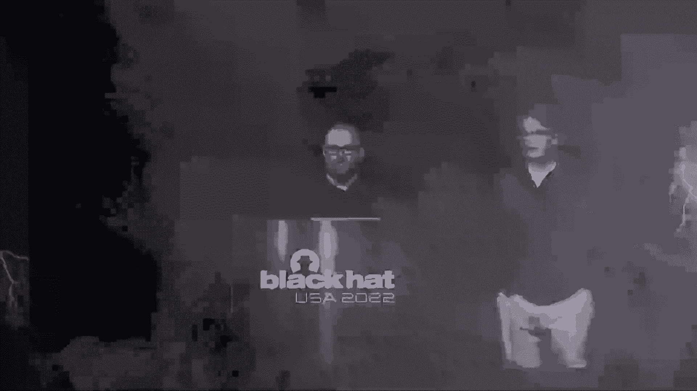

关于利用端点安全框架进行行为检测。

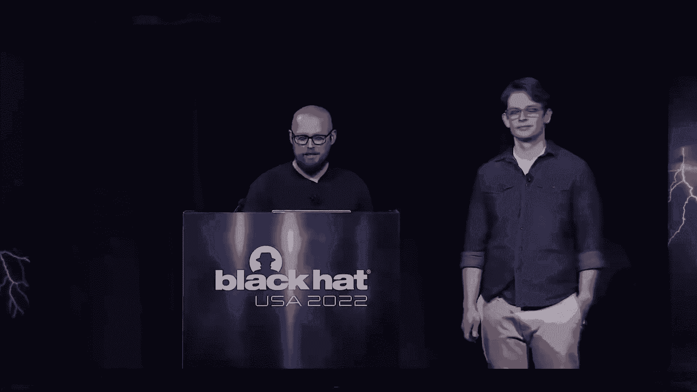

我是杰伦·布拉德利，我在这里和我的同事马特·贝诺一起介绍，我们都在JP威胁实验室工作，我们专注于寻找检测Mac OS设备上恶意活动的新方法，在过去的几年里，这意味着非常倾向于苹果端点安全框架。

今天我们想分享一下我们在监控方面取得的成功，对于以不应该的方式运行的应用程序。

如果你在这里，很有可能，您可能对端点安全框架略知一二，但不管你的暴露程度如何，我们要后退一步，把它放在上下文中，那么端点安全框架是什么。

因此，如果您正在为操作系统构建端点安全工具。

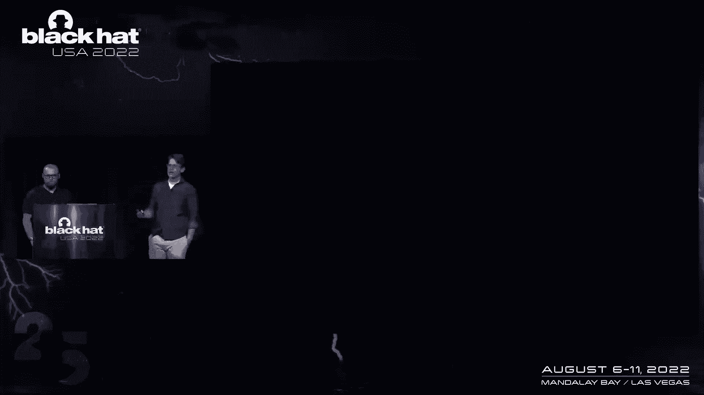

你真的需要两个基本的东西，为您的分析和检测提供信息，第二个是对探测采取行动的能力，施加可能扼杀一个过程的权威，或防止删除或修改文件，等等，历史上的内核，操作系统的核心。

是一个我们可以访问这些数据并发挥这种权威的地方，所以直到最近，如果您正在为Mac OS开发端点安全工具。

您将构建一个内核扩展，你可以这样做，为您的事件信息打开BSM审核跟踪，您有混沌内核编程接口用于控件，有点有限，还有强制访问控制框架，它有供应商正在寻找的控制，但它没有得到支持，无证。

表面上禁止任何人进入，但苹果除外，所以即使苹果承认，内核扩展很难开发和维护，最终它们会造成新的安全漏洞，因为即使是一个小bug也会导致内核恐慌。

所以说，这些限制确实是Mac OS安全创新的一大障碍，所以为了保护他们的内核，给安全供应商什么，他们需要在10月15日制造工具，苹果推出端点安全框架，这样做，他们有效地在用户空间提供服务，事件。

丰富的事件信息源，以及对探测采取行动的管制，所有这些都不会在内核中增加任何额外的不稳定性，所以不是内核扩展，供应商现在可以构建存在于用户空间中的系统扩展，它的工作方式是，当一个事件发生时。

内核将信息发送到所有第三方系统扩展，订阅特定事件的，像进程创建和退出这样的事情，文件创建，未链接的挂载事件，那种东西，大多数ESF事件有两种不同的类型，您有通知事件和授权事件，它们都传递相同的信息。

但是通知事件只是为了通知，所以他们让系统扩展知道发生了什么，系统扩展可以以它认为合适的任何方式使用这些信息，也许它会向控制台弹出警报，或者它正在将数据转发到SIM卡，相比之下。

授权事件实际上支撑内核中的活动，因此扩展使用其检测逻辑评估事件数据，并确定当事件失败时是否应继续此过程，系统扩展检查系统扩展发送拒绝响应，现在行动结束了，当然啦，这只是一个插图的视觉表示。

因为所有这些发生的窗口都非常短暂，以保持性能，所以静态检测从反病毒的早期就开始了，他们继续留下来，因为它们是检测恶意软件的有效手段，呃，基于Auth事件的工作方式，ESF很好地补充了静态基阻塞，呃，嗯。

事件的执行被搁置，第三方扩展可以快速扫描它，决定是否允许它执行，所以说，什么是，在这个小时间窗口中可以扫描的一些静态行为，嗯，它可以是各种各样的事情，但如果我们要阻止什么，我们最好。

真正确定这不是应该被允许运行的东西，因为再一次，我们最不想做的事情就是破坏用户的Mac OS体验，所以出于这个原因，传统的妥协指标非常有效，团队ID或开发人员在过去被识别为恶意是啊。

是快速查找和阻止文件哈希的简单方法，你知道的，已知恶意软件的文件指纹，然后呢，当然啦，Yara规则也很有效，允许我们扫描字节，字节模式或字符串，如果我们看到我们不喜欢的，就会阻止，当然有，其他选项。

如机器学习算法，但又一次，最终，无论您最终针对什么进行测试，几乎都需要立即返回结果。

所以这自然引出了我们谈话的重点，也就是行为检测，这种行为检测的想法已经存在了一段时间，随着安全供应商真正完善，它们的价值增加了，开发正常应用程序活动的基线，而不是更可疑或邪恶的事情。

所以这种检测的缺点是它们往往有更高的，假阳性比率，因为我们正在观察一个更广泛的活动模式，而不是更客观的东西，就像文件哈希，但当这些执行正确时，这是一个值得的交易。

因为它允许我们识别像恶意软件这样我们以前从未见过的东西，或者以前从未见过的活动模式。

所以举个例子，我们称这个为假文件扩展名。

我们将从一些非常简单的事情开始，所以在这个例子中，用户转到其临时目录中的finder，他们发现了一种叫做PDF的PDF，现在一封信，临时文件中的PDF可能很奇怪，足以自行检测。

但我们可以仔细看看这个，当他们检查这个文件时，他们会发现这实际上是一个樱井真子可执行文件，伪装文件扩展名，以这种方式使用矛盾的文件扩展名，是书中最古老的把戏之一，攻击者将使用此方法试图混入用户的文件。

或者操作系统，和，有点讽刺的是，这些廉价的规避策略导致了我们最好的探测，因为在良性的背景下，它们很难被证明是合理的，大家可以看到，我们在这里所做的只是将创建或写入临时文件的行为。

并进行一些额外的检查以确定它是否真的有任何兴趣，所以说实话就像贝诺说的其中一些可能本身就很有趣，例如，可执行文件上的PDF扩展名。

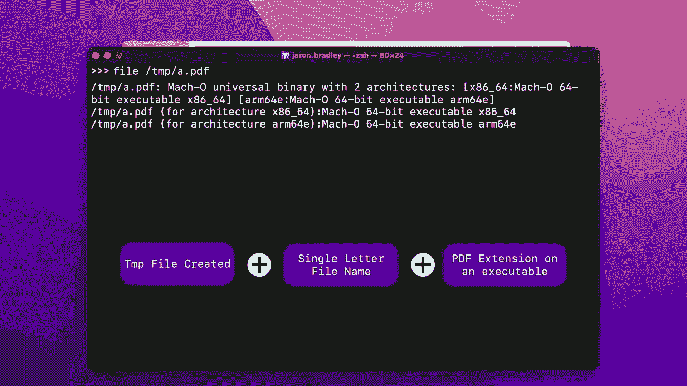

很可能是自己发现的，但是如果我们想采取额外的奇怪行为，比如，哦，这是这是临时目录中的，或者它有一个字母文件名，这些都是很奇怪的事情，如果我们想进一步，加强和加强探测。

我们可以寻找多个这样的东西来创建一个检测。

我们将演示其中一个探测的更深入的例子。

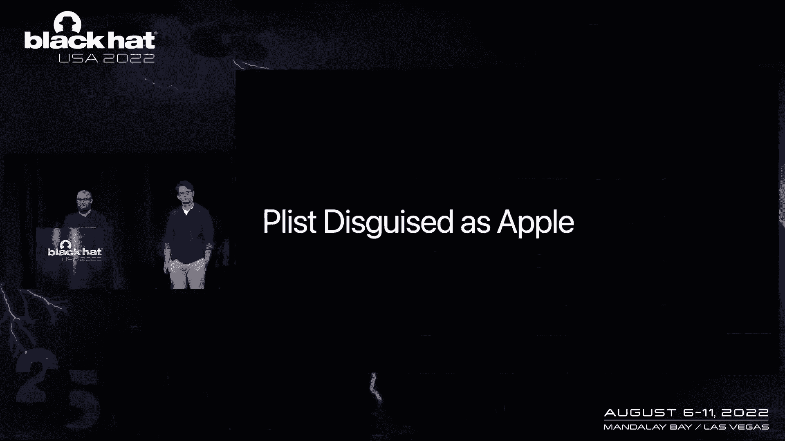

我们称之为P的东西伪装成苹果，所以在系统库的启动代理目录中，发射代理是会运行的东西，通常在系统启动时运行，当您的系统启动时，这里我们有了发射剂应该是什么样子，这个属于Mac OS诊断代理。

我们实际上通过简单地查看文件名Apple来说明这一点，鼓励开发人员效仿并命名所有启动代理和守护进程，使用反向域名表示法，所以通过查看名为com apple的文件，此诊断代理P列表。

我们应该立即知道这个p列表是操作系统的一部分，属于苹果，所以很久以前，恶意软件作者也发现了这个事实，所以他们开始调用他们的恶意守护进程和代理，com苹果点填空，使这些代理也融入操作系统。

所以如果我们看看这个文件，我们看到这个代理会启动这个诊断助手，这是这个可执行文件。

是一个Apple二进制文件，并由Apple正确签名，就像它应该的那样。

所以让我们来看看这是如何伪造的，或被攻击者虐待。

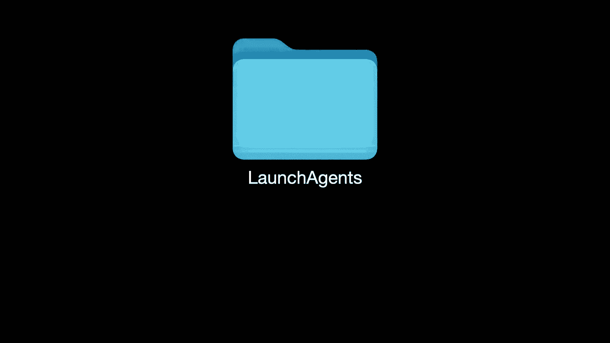

所以我们要寻找的是用户，发射代理或发射恶魔目录，一个新的P列表的添加，这是我们检测到的第一件事，但我们看看，他们在文件名中使用了com苹果标识符吗说实话，我们可以停在这里。

如果有什么东西在SIP保护系统之外，启动代理目录，它在用户的文件夹中，这可能足够可疑，可以看看，但我们发现了一些假阳性，所以我们可以通过做一些额外的检查来改进这种检测，所以我们要做的是看看P列表。

我们在可执行文件上作用域，它打算在登录时运行，这将给我们一条路，所以我们可以在那个路径上进入可执行文件，我们可以运行代码签名检查，如果这是使用com Apple P列表的东西。

我们应该希望或期望这是一个可执行文件，也是苹果所有的，在本例中，代码签名信息返回为未签名，这是非常可疑的，我们可以自信地触发检测以进行进一步分析，所以多年来这一直是一个非常可靠的检测，值得指出的是。

虽然这些天，当我们看到这个触发，它通常是较新的间谍应用程序之一，这是广告软件过去经常做的事情，但我认为他们花了这么多时间在战壕里，他们已经被许多不同的安全产品用这种技术抓住了，那是他们已经远离的东西。

到目前为止，我们已经讨论了很多关于不同的行为和检查，使用文件活动执行，让我们了解一些可疑过程活动的背景情况，所以我们将在这里举一个例子，展示一个执行事件。

假设你可能是个威胁猎人，您在splunk中遇到了进程执行事件，在本例中，我们只是用一个简单的cut命令进行演示，所以对于那些不熟悉cut命令的人来说，它通常用于自行拼接从另一个命令传递给它的数据。

它真的什么也没告诉我们，我们要在这里展示，我们如何在此事件中使用其他字段，获取系统上发生的事情的上下文，所以接下来我们将使用父进程ID，并获取运行cut命令的进程，它主要是一个在shell中使用的工具。

所以父母是ZH也就不足为奇了，在这种情况下，我们真的开始获得一些有用的上下文。

这是当我们拿同样的事件，我们查找负责任的，在本例中指向终端应用程序，正如我们所看到的，这个过程开始描绘一幅更好的画面，到目前为止，我们已经确定用户打开终端。

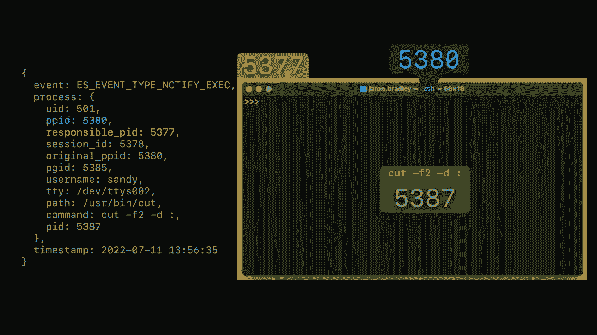

他们选择的shell是默认的zh，他们执行cut，然而，正如我之前所说的，这个还是，呃，这幅画还有更多，自己切割对我们没有太大的帮助，但至少我们知道这可能是一个用户。

因为它是通过终端GUI应用程序执行的，但是通过在此事件中获取进程组ID值，我们可以确定这个命令的进程组ID领导者是什么，它的价值是相当呃，相当有名，嗯，但在威胁狩猎中，它得到的关注比它应得的要少。

我们不仅可以抓住，一组管道命令的前面是什么进程，在本例中，系统探查器，但我们也可以执行搜索，查看共享同一进程的所有进程，组ID本质上重建执行的确切命令，所以这种方法不能总是在我们演示的时候采用。

这里有一个标准作业控制行为的示例，但总的来说，这是一个很好的方法，获取如何执行一组命令的上下文，在这种情况下，我们可以看到执行的命令是用来获取串行的，运行它的设备的ID，它被合法的应用程序和脚本使用。

以及一些执行侦察的恶意软件，是进程组的集合，会话ID为我们指出控制这些组的过程，这就是，我们可以去获取一些终端内实际运行的额外上下文，所以在本例中，它属于登录进程，在选择shell之前。

终端在执行时运行它，因此，从显示发生简单cut命令的单个事件，我们能够使用所有的PID字段。

以确定正在发生的事情的确切背景，然后通过一些简单的查找，我们甚至可以整理在这个终端中运行的命令历史记录。

所以让我们来看看一种可以发现的攻击行为。

使用我们刚才讨论的一些技术，所以在这个特殊的演示中，我们正在研究一种流行的离地谋生技术，所以在这个技术中，攻击者将在其服务器上托管脚本，他们会把它卷曲在受害者机器上，但直接将其输送到系统上的解释器。

这是一种吸引人的技术的原因是因为这样做，光盘上不存在恶意文件，因此，您可以通过这种方式避开大多数静态检测，因为脚本实际上只存在于内存中。

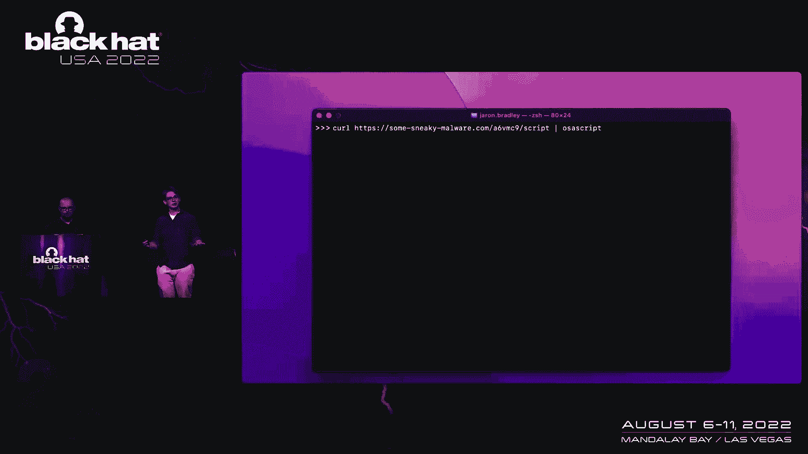

现在，虽然这不会创建文件，也不是完全无法追踪，如果你有那个网址，服务器还在运行，你可以去，比如说，这是将托管在服务器上的神话代理，科迪·托马斯的《仍然可用》，但你创造了额外的步骤，真的要避开任何检测。

不是在寻找这种技术，特别是。

所以如果我们现在寻找苹果的脚本，在本例中，它是正在运行的解释器，我们在工艺历史记录中检查它，我们将看到它是在没有参数的情况下运行的。

它只是作为脚本运行。

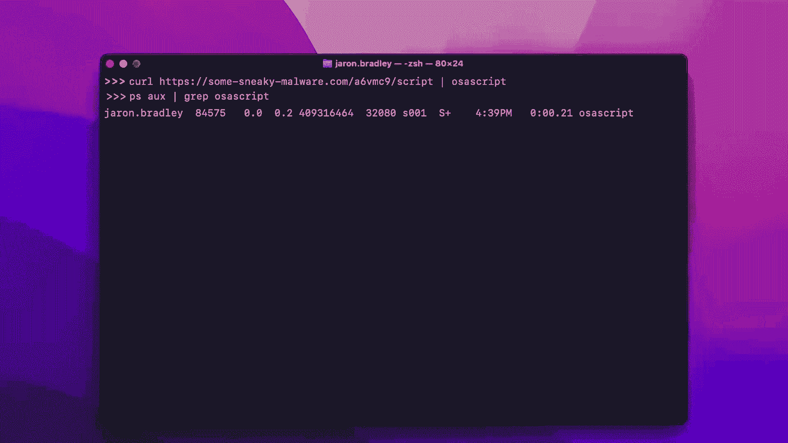

使用ESF数据跟踪此类活动，我们要寻找的是解释器的执行。

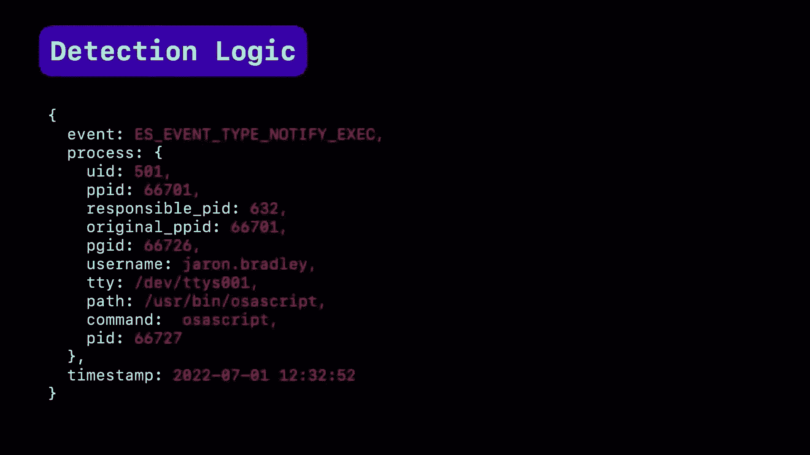

在本例中，脚本或Apple脚本，如果你在下面的命令中往下看，没有附加命令，这是一个很好的赠品，无论运行的是什么，脚本以这种方式直接通过管道传送到解释器，所以我们可以开始揭示管道到脚本的方式。

就是通过查看进程组ID，所以如果我们按照进程组ID，我们看到它将我们引向curl命令，一旦我们有了这个链接，我们相信这种在陆地上生活的技术，至少到了突然警觉以便进一步分析的地步。

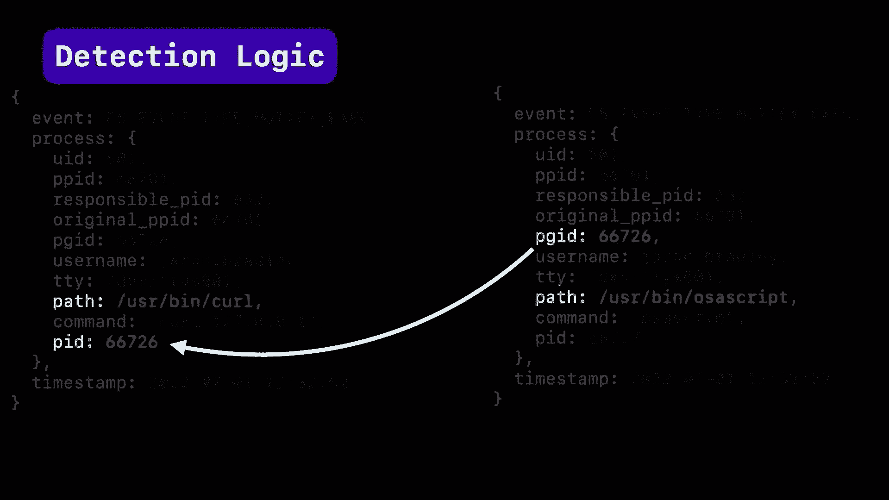

所以让我们来看看另一个开车回家的样本，再次的用例，进程组ID聚光灯是Mac OS上索引文件和文档的功能，当他们创造它的时候，通过索引来做到这一点，它这个，这个索引，通过获取在这些文档中找到的关键字。

并使它们在搜索中容易找到，所以当你按命令和空格键时，您可以输入一个关键字，轻松地找到您要查找的文档，即使你不记得你把它保存在哪里，这是一个超级有用的功能，我一直在用它。

但是任何对我们有用的功能通常对攻击者也有用。

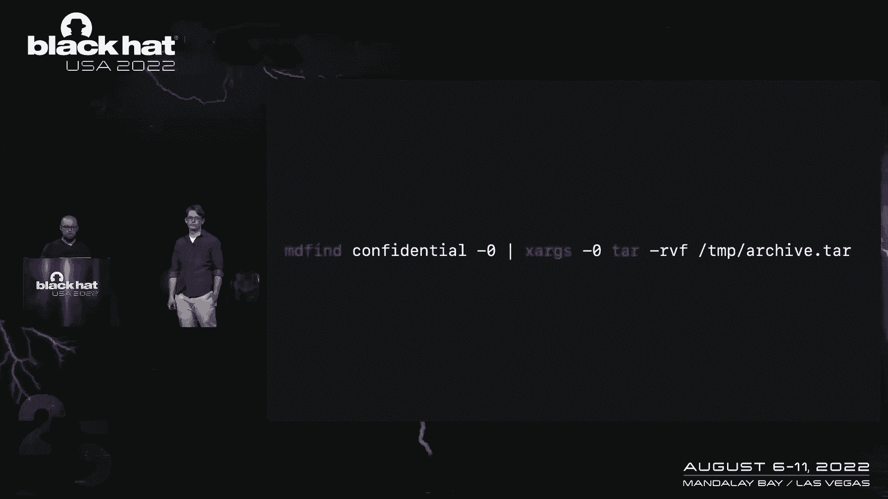

所以md定义的是使用这个聚光灯功能的命令行等价物，因此攻击者可以很容易地搜索不同的关键字，试图在硬盘驱动器上查找包含这些关键字的文件，比如密码路由，帐户，或机密。

所以一个攻击者，一旦在系统上，可能会使用如下所示的命令，基本上他们运行的地方，md很好，他们得到了一份包含机密一词的文件列表，然后他们把这些文件中的每一个立即输送到存档，现在他们只需要填满存档。

他们有一个巨大的档案，里面装满了机密文件。

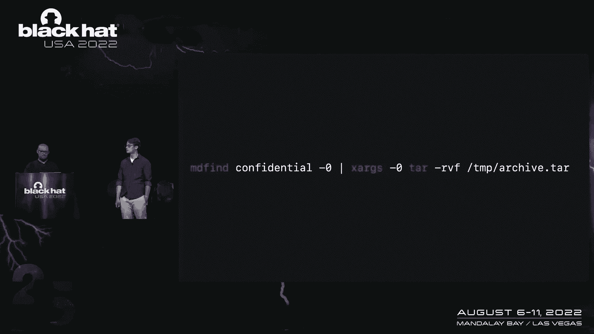

所以为了检测这种情况的发生，我们要寻找的是一个内置的存档工具的执行。

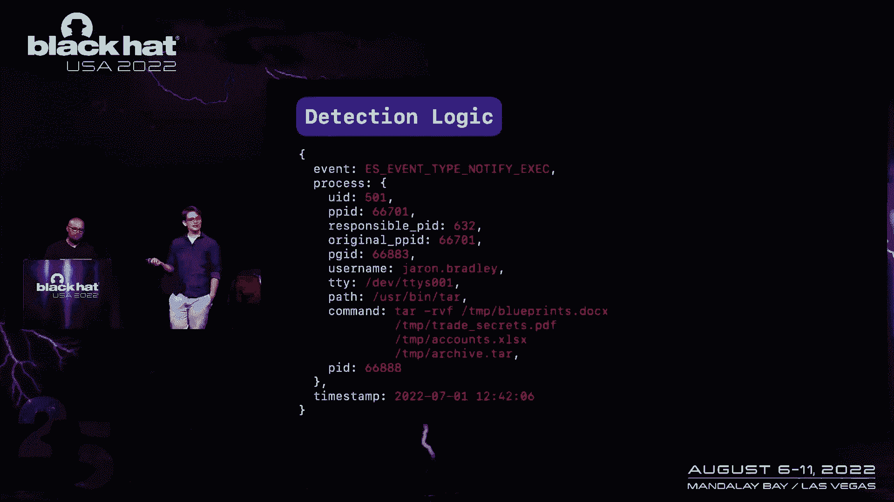

在这个例子中是焦油，所以下一个问题是我们问，这个tar执行的过程组思想是什么，在本例中，按照这个过程，组id将自然地引导我们找到md find，当这个链接已经建立时。

我们有理由相信tar是在一串命令下运行的，从MD Fine开始，这种技术很可能被使用到了这样的地步，我们可以弹出警报，作进一步分析，值得指出的是，虽然这种技术，虽然有趣。

仅限于完整磁盘方面之外的可用内容，透明透明度的资产方面，同意和控制，还有一些有用的东西，我们将在我们的一个高级检测中对TCC进行更多的研究。

所以我们讨论了一点我们称之为标准检测的东西，现在，我们想进行一些需要，更多的检查以确定应用程序，匿名，我们将在这里讨论的三个探测都是在我们发现，或者了解到零日漏洞，然后我们找到了一种方法来检测这些漏洞。

如果这些漏洞被滥用，所以我们在这里讨论的一切都已经补丁了，但我们仍然想确保在这些补丁发生之前，我们在探测他们，如果发生这种情况，所以我们首先要讨论的是一个守门人旁路，从一段时间以前。

所以今年出现了许多不同的旁路，围绕文件旋转，检疫和守门人，这两个都是安全特性，内置到Mac OS中，帮助用户确保他们只运行代码，由可信的开发人员正确签名并在这张幻灯片中公证的。

我们看到一个用户下载并运行了一个名为有毒应用程序的应用程序，这就会导致，在这个守门人身上，像这样的事情的提示。

主要是因为该应用程序完全没有签名，因此不受信任，所以去年，塞德里克·欧文斯，发现了一种允许应用程序错误地通过看门人检查的方法，他不得不在黑帽这里谈论这个，所以当我们听说这个漏洞时，我们创建了一个检测。

并很快发现了Schslayer恶意软件的变体，在野外滥用它，所以在滥用这个旁路之前，Schslayer开发人员不得不说服您覆盖Gatekeeper，因为他们不想签署恶意软件。

他们会说服用户通过字面上的方式覆盖Gatekeeper，在安装程序图形中为重写过程提供说明，因此，这只需右键单击应用程序，选择打开而不是双击它，看起来很基本，但我们总是看到用户上当。

我们确实看到这仍然会导致一些提示，通知用户此应用程序是从Internet下载的，但最终他们可以选择继续下去，如果他们愿意，当右键点击应用程序时，这就是旧的杀手恶意软件安装程序的样子。

以下是带有看门人的Schslayer恶意软件，将网守旁路嵌入，它看起来只是在下载的应用程序上简单地双击，用户的游戏结束了，他们不必写信，单击应用程序或单击各种提示警告。

这个完全没有签名的恶意软件会执行和执行一堆后台活动，而用户却一点也不知道，这里要做的另一个注意是，尽管这看起来像一个PKG安装程序，它实际上只是一个使用PKG图标的武器化应用程序。

但是旁路实际上是如何工作的，它适用于应用程序不包含信息p列表文件的情况，它使用脚本作为主要有效载荷，所以如果这两件事是真的，它将从守门人的安全检查中获得批准的印章，它将被允许执行，所以说。

让我们倒带一点，想想我们如何真正检测到这一点，所以首先，当双击启动应用程序时，它发送一条消息启动D，然后打开应用程序，所以这就是我们要寻找的东西，启动d是父进程，现在，显然。

系统上运行的大多数进程都有Launch D的父进程，但通过将此纳入检测，我们可以减少假阳性，所以我们的下一个检查是检查，以确保我们实际上处理的是一个应用程序包，这可以通过分析命令行来完成。

当应用程序被双击时，但我们可以很容易地在命令行中查找这个说明问题的字符串，点应用程序内容的参数，Mac OS，如果我们看到这根弦，我们有信心我们正在处理一个应用程序，所以接下来。

我们将确保正在运行的过程实际上是构建的，口译员，所以我们所做的就是寻找任何一个内置的解释器，当时，还有几个后来被弃用了，但这些都是可用的，在Schslayer的例子中，实际上是Bash在跑。

所以接下来我们要做的是确保，因为这个旁路的一个要求是可执行文件是一个脚本，我们将查看可执行文件，以确保它不是某种类型的Moko二进制文件，它实际上是一个剧本，所以你可以通过API来做这件事，检查。

魔法咬，不管你的口味是什么，然后最后，我们要确保我们能抓住这个，在守门人看的那一刻，为此，我们依赖于守门人的一种特殊怪癖，以便减轻不同的漏洞，当你双击一个类似dmg的应用程序时。

Gatekeeper实际上会将其移动到随机文件路径，防止它访问外部资源，这个特殊的功能被称为应用程序易位，所以这就是我们要找的，以确保这是在看门人检查的时刻发生的。

会错误地通过检查，所以让我们快速看看这一切是什么样子的。

从ESF的角度，请注意，我们几乎可以再次进行所需的所有检查，通过在单个Exec事件上旋转，所以我们要做的第一件事是检查父级是否启动，D下一个，我们要看一下命令行参数，并确保其中引用了应用程序。

而不是检查命令行参数，我们还可以检查ESF在执行时提供的脚本字段，在本例中，我们确实看到应用程序是在命令行参数中引用的，所以接下来我们将获取可执行文件的路径，准确地查看它是否与解释器语言匹配。

在这种情况下，它确实如此，我们看到它已经被狂欢了，然后我们将从命令行参数中获取应用程序，并检查以确保它不是一个moko，当然，对于这个旁路，我们只关心剧本，因为这就是所有的工作，所以最后如前所述。

我们将检查这个应用程序是否被Gatekeeper分析，因为我们只想在网守旁路发生时触发，所以您实际上可以使用脚本，就像你在应用程序中的主要有效载荷一样，苹果确实允许这样做，但当这样的事情发生时。

我们想在搭桥时触发这个。

如果用户将来仍然想运行此操作，这取决于他们。

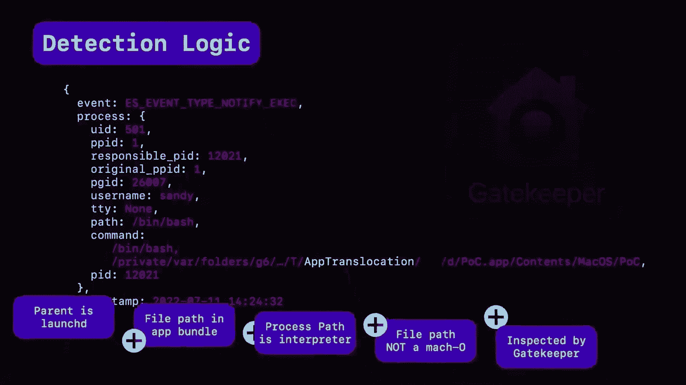

这就是当我们听说零日存在时我们付诸行动的探测，几乎在我们把它推出来的时候，我们检测到层恶意软件滴管在各种环境中触发。

这告诉我们恶意作者确实看到了价值，并逃避了这些看门人的检查，并且确实看到了不必花时间签署代码的价值，或者为你知道的任何类型的，代码，签字，费用。

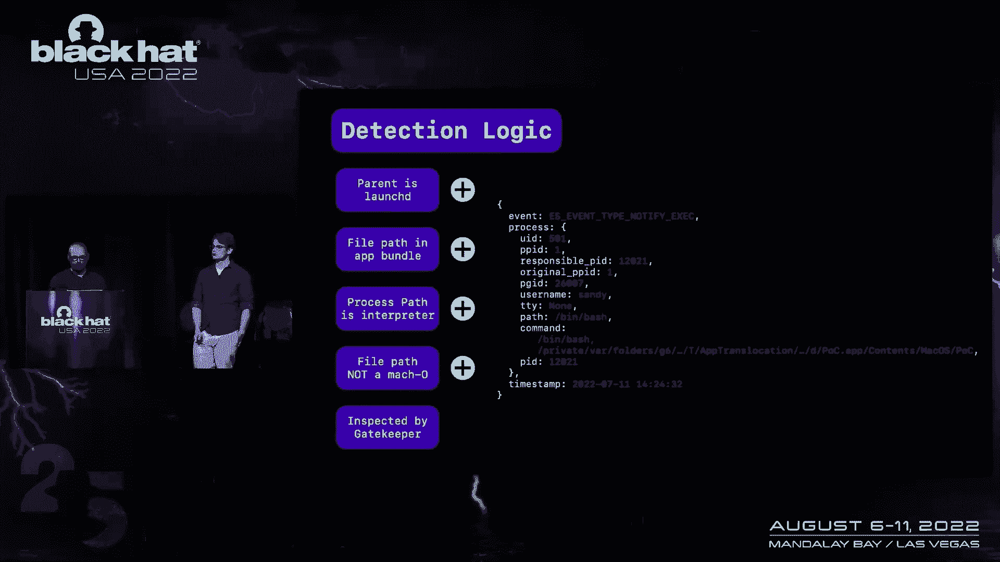

所以接下来我们要谈谈TCC旁路，我们之前暗示过，就像我们之前展示的那样，tcc是一种特性，用户可以授予特定的应用程序权限，做具体的事情，例如捕获键盘输入，把麦克风录下来。

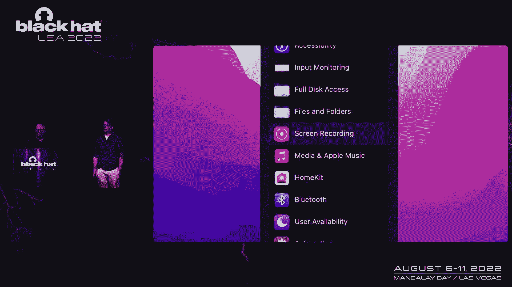

或者录屏，因此，当应用程序试图执行操作时，比如记录屏幕，会提示用户询问他们是否要批准应用程序的此操作。

所以也许我们看到这个提示被绕过的更令人担忧的时候之一，在野外被XCS集恶意软件，零日使用对这个恶意软件来说并不新鲜，事实上，当时它还利用了另外两个零日，具体来说，我们将重点关注它试图使用的零日。

为了获得屏幕共享权限，恶意软件会从，查找系统上已经存在的各种应用程序的列表，并可能在恶意软件代码中持有屏幕录制权限，它将这些应用程序称为捐赠者应用程序。

在这些申请中，有，当然啦，缩放，因为在这一点上，许多用户在他们的系统上安装了缩放，以远程共享他们的屏幕，为此，它已经拥有屏幕共享权限，恶意软件作者发现的是，如果他们将应用程序包放置在已经存在的。

我们将这个更新应用程序称为，在这种情况下，他们实际上可以继承权限，现有的捆绑包持有。

所以如果我们回到TCC设置，这实际上是现在正在发生的事情，但是，附带应用程序将获得权限，它将获得权限，但它不会出现在这个软件列表中，因为它能够做到这一点。

所以现在攻击者所要做的就是记录屏幕，并且不会向用户显示任何提示，我认为这里一个重要的收获是，别以为有人会花时间在Mac OS上，当，事实上，恶意软件已经花了时间试图找到解决这个问题的方法，保持更隐秘。

这也是通过苹果脚本完成的，恶意软件，有些人可能会说这让这更令人印象深刻。

所以当这个恶意软件运行时，它将触发端点安全框架执行事件，我们检测的方式，这是为了查找正在打开的应用程序，我们会看看通往第一个的道路，确定我们正在处理一个应用程序，接下来我们要检查的是。

该应用程序是否嵌套在另一个应用程序中，现在记住，缩放只是这里的例子，理论上，它可以是具有所需tcc权限的任何应用程序，所以现在我们有了一个外部应用程序和一个内部应用程序。

我们可以开始把它们当作两件独立的事情，值得指出的是，开发商这样做是完全合法的，把一个应用程序放在另一个应用程序中是正常的行为，然而，我们希望这两份申请的签署信息将匹配。

所以这就是我们如何能够寻找这是非法的，所以你检查捐赠者申请，给它一个代码签名检查，在这种情况下，它是缩放应用程序，惊喜，惊喜，它是由缩放合法签名的，所以接下来我们要检查应用程序。

我们应该期待它也被缩放签署，如果这是一个合法的更新应用程序，在恶意软件的XCS中，它作为临时签名回来了，那是一面巨大的红旗，这就是我们正在寻找正在执行的应用程序的检测。

我们正在寻找将该应用程序嵌套在另一个应用程序中的应用程序，然后我们检查外部应用程序签名信息，看看它是合法的，对于内部应用程序，当我们检查签名信息时，如果这是非法的，我们会看到三个案例中的一个。

不匹配的团队ID与临时签名的外部应用程序不匹配，根本没有签名，如果这些条件得到满足。

我们自信地弹出警报进行进一步分析，所以说，让我们谈谈我们能够检测到的最后一个守门人旁路，这个漏洞实际上是J自己发现的，给道塞尔朱基，当苹果公司给他的简历打补丁时，他被认为是简历上的一员。

所以要理解这个特殊的旁路，我们首先要快速分解Safari的一些基本知识，所以当Safari用于下载文件时，尤其是像带有应用程序的zip文件，您可能已经注意到它击中了下载文件夹，几乎瞬间拉开拉链。

这是默认行为，这是Safari中一个名为打开保存文件供下载的功能的一部分，这是苹果认为安全的文件，可能围绕这一点的思考的一部分是类似于应用程序的东西，虽然感觉文件实际上是一个目录包，不能直接下载。

您经常会看到以这种方式压缩的应用程序，并使用此自动解压缩功能，那种抽象的方式，以便最终用户感觉更合乎逻辑。

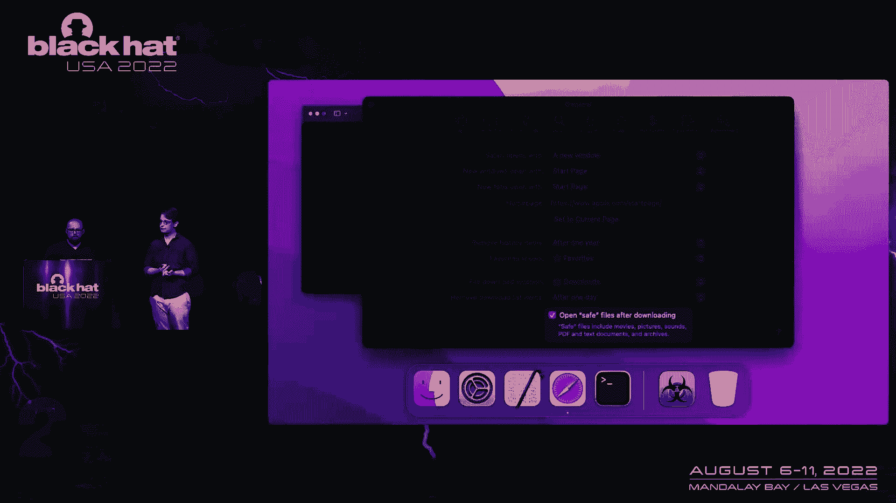

所以如果我们再快速倒带一次，然后使用端点安全框架以慢动作观看所有这些，我们实际上会看到，在通过Safari下载存档后，Safari沙箱实际上负责创建临时目录，然后处理将存档解压缩到该目录中，因此。

Safari沙箱将接受隔离扩展属性，并将其应用于新解压缩的应用程序，这一部分实际上非常重要，因为当应用程序第一次打开时，系统检查其扩展属性，如果此隔离扩展属性在打开的应用程序上。

系统知道它需要在第一次启动时由看门人检查。

所以当我们浏览互联网搜索恶意软件时，我们遇到了一个游戏网站，它通过zip归档以申请表形式托管游戏，所以在我们下载了这些游戏之后，我们注意到他们不知何故绕过了看门人的提示，尽管完全没有签名。

所以经过进一步调查，我们实际上注意到，扩展属性没有放在应用程序目录本身上，它只应用于该应用程序下的递归内容，事实证明，Gatekeeper只关心该应用程序是否有隔离，上面有没有标记。

所以我们注意到这并没有真正发生，如果我们通过另一个浏览器下载应用程序，然后手动解压缩，在这种类型的场景中，所有隔离属性都将按预期显示，所以这告诉我们问题出在Safari Auto的拉链上，不仅如此。

但我们也注意到，如果我们用苹果内置的，同上命令解压缩我们自己的存档，也会导致同样的隔离bug，这告诉我们，这个bug可能会在操作系统上深入得多，在某个地方，因为它影响了至少两种不同的非存档技术。

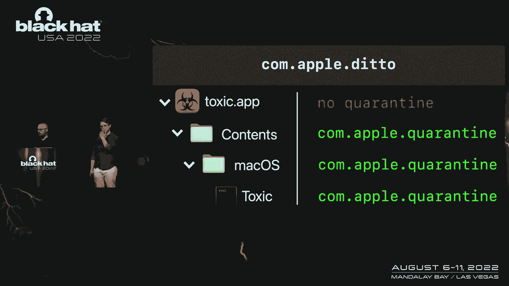

就像它一样，事实证明，此问题存在于物料清单功能中，材料清单就像所有文件的收据，可能是安装程序或存档在系统上留下的，逻辑上，这种收据技术与PKG安装程序联系得很好，然而，Mac OS也构建了引用。

也为zip文件构建和引用炸弹，只是在任何地方都没有很好的记录，因此，在从普通的zip文件中取消应用程序存档时，右边看到的炸弹，这里将跟踪每个未存档的文件，归档逻辑，然后检查炸弹中的每个文件。

并恰当地应用隔离属性，所以说，我们注意到的一件大事，在十六进制编辑器中分析普通的zip应用程序是，第一个zip文件头从根应用程序目录开始，在这种情况下，隔离属性将始终按预期应用，但是。

我们从网上下载的zip文件，在不知不觉中绕过了守门人，另一方面，他们缺少了这个根级别的标题。

相反，它们从应用程序的内容目录开始，所以如果我们从这些修改过的zip文件中取出一个，并删除顶层头。

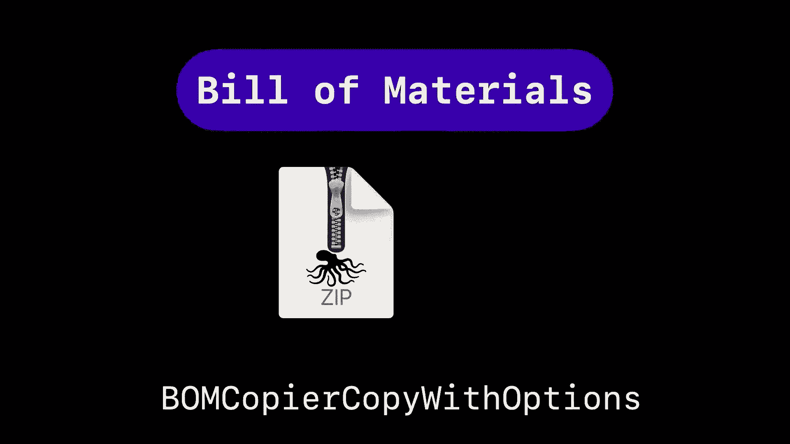

我们在这里看到，当炸弹再次被解析时，在右边，炸弹中缺少应用程序根目录，然而，应用程序将继续解压缩并正常运行，但是当引用复制隔离函数时，它引用物料清单来应用检疫属性，它最终丢失了应用程序目录本身。

因为材料清单在这一点上是不同步的。

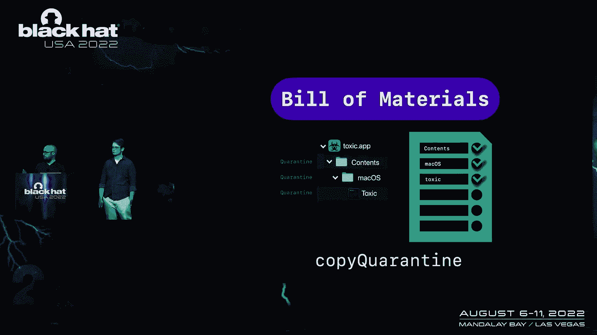

因此，再次使用端点安全框架作为我们的基础，我们如何检测这种情况的发生，所以我们从查找文件重命名事件开始，我们在寻找那一刻，当Safari代理从其临时文件移动时，新应用程序返回下载文件夹。

然后我们确保它实际上是Safari沙箱经纪人，那就是采取行动，然后我们做一个，我们确保它实际上是一个有问题的应用程序，那被移动了，然后呢，我们确保原始位置是临时目录。

沙箱代理创建的。

当它解压缩文件并将其移回下载时，然后最后，我们进行扩展属性查找，以确保实际应用了隔离属性，所以这个检测很有趣因为通过观察内置的安全系统，并确保它按预期完成工作，我们可以一般地检测何时发生了网守旁路。

即使我们不知道我们要找的技术是什么，是Safari沙箱代理正在下载的一个应用程序，但不知何故，没有隔离属性，我真的认为这凸显了这些行为检测的美妙之处，因为，它们可以让我们掌握我们甚至没有发现的技术。

然而，我们的谈话就这样结束了，我们今天展示的，只是一件工装。

它以端点安全框架提供的事件为基础，但伟大的是，ESF是苹果可以专注于提供操作系统的可见性，开发人员可以把权力放在一边，该如何处理这些信息，并构建检测，发动机，以及他们能想到的最多的任何东西。

很高兴有这些活动，我们使用，来自，曾经来自，各种复杂的来源现在以一种有组织的方式从苹果精简，这样我们就可以专注于利用事件，而不是担心自己创造它们。

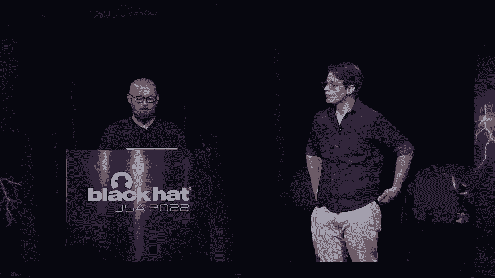