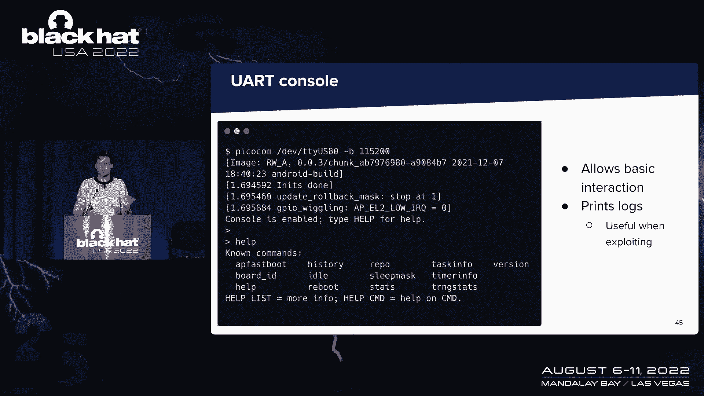

# 【转载】Black Hat USA 2022 会议视频 - P22：023 - Attack on Titan M, Reloaded： Vulnerability Research on a Modern Security C - 坤坤武特 - BV1WK41167dt

好的，我叫马克西姆·罗西巴隆，和我的同事一起，甜瓜，我们要谈谈泰坦和芯片，以及我们如何对其进行能力研究，你可能已经注意到了，如今，智能手机供应商倾向于在智能手机中集成硬件安全模块。

而最关键的安全依赖于这个模块，设备的关键安全特性，这些模块具有加密功能和硬件对硬件的保护，逆向工程或故障注入，他们的大部分设计都是硬件和软件，只有芯片制造商或有时供应商知道，然而。

对于美国安全研究人员来说，这些组件是整个设备安全的关键，这也是今天演讲的动机，我们将向您展示我们是如何对泰坦进行漏洞研究的，M芯片，所以谷歌为他们的像素设备设计的安全芯片。

我们希望我们今天向你们展示的东西将对其他研究人员有用，谁会面临类似的目标。

所以我们都是夸克实验室的安全研究员，我们在一个处理嵌入式设备的团队中工作，我们做了目标，我们对移动目标也很好奇，现在我们要谈谈泰坦和芯片，所以事实上，昨天有一个很棒的谈话，关于谷歌的一些人。

关于红队是如何，泰坦M二号装置，所以我们今天说的泰坦设备是老一代的，在这个设备上，它被引入了，事实上，从像素三开始到像素五，我猜，在这个设备上，你会，你会学到，将实现智能手机的关键安全功能。

其中你会发现安全的靴子，你会发现解锁功能，嗯，使用密码上的PIN码，也是拱顶石，这可能是我们今天最重要的一个，此功能允许Android应用程序在安全环境中生成和使用密钥，意思是巨人和芯片。

每当这个功能依赖于安全芯片时，它被称为坚固的盒子，现在重要的是要记住这个chi是与主CPU分开的，从应用程序处理器，你只有一只手，运行在芯片上的主系统，这个应用程序和你有另一个芯片。

泰坦和芯片通过硬件总线一起通信，现在作为客户机服务器模型，根据谷歌，这个芯片已经推出了，为了减轻广泛的侧面，影响Amtrazone的通道攻击，以前我提到的特性被实现到。

现在这个泰坦M是基于手臂皮层M三个架构，这对于微控制器来说是很常见的，固件离我们很近，但它是基于开源操作系统，称为EC C代表嵌入式控制器，它是由谷歌设计的。

它的目标是Chrome OS项目的各种微控制器，这就是为什么它很简单很小，比如说，它几乎没有动态分配，大多数代码都在运行一个任务，可以与更大的应用程序进行比较，OS现在是我们今天感兴趣的两个硬件老板。

或者首先是用于与应用程序处理器通信的SBI Boss，使用Android和默认情况下不可用的UI总线，但我们将向你展示如何在一些设备上找到它，UART用于日志和极简控制台，现在。

让我们放大Android与泰坦尼克号的通信方式。

所以你有i boss，在主CPU上，你有一个内核驱动程序，可以安卓SPI通信，并将IO L接口公开给，事实上，你只有一个维度与这个驱动程序通信，它叫θ点d。

它的作用是将从服务接收到的各种消息分派给驱动程序，现在，很明显，我把它们叫做L，用于硬件抽象层，每个功能有一个服务，所以一个给水晶，一个是枯萎的。

这项服务将把API中的通用Android转换为定制的东西，在这里这样做，他们用原始buff，一个由谷歌设计的著名风格化框架，感谢我们，事实上，定义，protobub定义可在IP存储库中获得。

所以对于今天将要展示的不同工具来说，这将是非常方便的，这不是我们第一次谈论泰坦和芯片，事实上，去年我想去欧洲，我们在这个芯片上进行了第一阶段的研究，可以归纳如下，所以我们做的第一件事是反转固件。

我们通知了FMware文件，接下来的事情是为了帮助我们。

在这个反向步骤中，我们想和芯片互动，首先在Android上，我们实现了一个免费脚本，以便嗅探所有正在进行的通信，所以我们上钩了城堡恶魔，多亏了这一点，我们能够看到应用程序发送的所有消息。

我们还实现了我们的工具，我们称之为客户，以便向芯片发送海关自定义命令，所有工具只运行一百，但是有一些评论会和芯片交换，由它们发送到芯片，对不起，主CPU的引导文件夹，为了看看发生了什么。

我们想在硬件层面上做同样的事情，这是你在左边看到的照片，这可能是我们去年至少在视觉上展示的最令人印象深刻的东西，多亏了我们的同事菲利普的神奇之手，他能解决的那个，芯片在突破板上的64个引脚的年龄。

然后回到智能手机上的足迹打印机，多亏了这一点，我们能够从硬件层面与芯片交互，接下来我们做的是找到漏洞，最重要的是不要打分，允许我们闪存任何旧的VMware，副作用是所有的数据都会从芯片上抹去。

现在使用此漏洞，我们已经能够降级到一个和一个旧固件，我们发现我们通知了一个能力，然后我们利用了这个能力，我需要允许我们在芯片上执行代码，并最终泄露固件的各种隐藏部分，包括引导运行。

我们将讨论模糊以及它是如何，它对这个目标有多有用，尽管它很受限制，没有，我们没有消息来源，有很多硬件交互，但我们可以得到有趣的结果，所以我们将讨论两种方法，首先黑匣子起毛，在这种情况下。

我们根本不知道芯片里发生了什么，我们还将讨论基于弹药的引信，在那里我们对发生了什么有了更多的了解，但我们需要，我们将向您展示一些优化结果的技巧，下一件事是，我们将向你展示我们是如何在没有任何。

D汉堡或堆栈，我们发现的能力痕迹，以及如何感谢这个漏洞，我们已经能够在芯片上执行代码，并危及芯片背后最重要的安全财产之一。

所以我不会让达米亚诺谈论黑匣子傅，像那个巨人一样开始测试芯片的时候，I’我是一个人起步的第一步。

用黑匣子起毛，这里我们所说的黑匣子是指，当我们对目标只有非常有限的能见度时，我们想测试我们所拥有的我们所需要的，实际上只是向此目标发送消息的通道，然后一个信号告诉我们发生了什么，所以在我们的情况下。

这是由我们开发的定制客户端提供的，用于与芯片通信，我们可以发送任意的信息，我们可以在模糊中变异，嗯，在花哨的工作流程中，然后得到一个返回代码，它会告诉我们处理我们的信息的结果是什么。

你可以在这张幻灯片上看到他们，一般来说，我们对那些召回感兴趣，大于或等于两个内部错误的码，这是，比如说，当船坠毁时我们得到的，所以说，通过在我们的非客户中插入一个突变体，突变体被带到突变体之上。

因为我们利用了可用的语法，它实际上使用起来相当简单，我们从一个空的语料库开始，但我们确实试着设置一些字段，让我们通过某些检查，以确保我们可以探索更多的州，当然，我们保留输入，生成一些有趣的返回代码。

现在我们做了第一个关于旧版本皮毛的活动，我们知道的皮毛有一些弱点，我们设法发现了一堆，其中一个实际上是我们利用的缓冲区溢出，通过卷起皮毛，所以这告诉我们这种方法是有效的。

我们用当时最新的皮毛重复了同样的程序，我们发现了两个指向一个旧观点的评论，在使廉价崩溃的参考，所以我们像其他漏洞一样报告了这个漏洞，这件事被认为不够严重，不会出现在安全公告上。

有趣的是所有这些结果都是在几分钟的模糊处理后产生的，所以这在某种程度上表明这种方法是有效的，我们得到了虫子，所以这是积极的，它也是，正如我所说，相当容易到位，我们正在真实的设备中测试。

所以我们得到的肯定是可复制的，但同时有一个众所周知的限制，当谈到黑匣子引信时，那就是我们可能只是在锻炼目标的浅状态，我们也容易用这个返回代码出现假阳性，我们实现的启发式和检测是一个相当复杂的。

我们只检测那些产生有意义的返回代码的bug，情况并不总是这样，所以底线真的是。

很难知道目标是怎么回事，所以那时我们想继续前进尝试探索一种不同的方法，那就是基于仿真的模糊。

这是因为我们知道电影是如何工作的，我们一直在逆转它，我们也知道如何泄漏内存的某些部分，当我们需要这样做的时候，多亏了我们通过回滚固件来利用的漏洞，所以我们可以把这个放在一起，模仿我们笔记本电脑上的皮毛。

这样我们就可以控制正在执行的内容，我们对Fuzzer也有很好的反馈，如果我们想做报道，导引引信，所以要模仿电影人，我们有，当然有很多不同的框架，最后我们决定用独角兽，这是一部电影，也就是。

这是一个建立在QU之上的框架，它只允许模拟CPU而不关心整个系统的仿真，这是我们真正想要的，所以我们可以很容易地设置它，并对其进行调整，以检测更多的bug。

独角兽的一个非常有趣的特点是它与AFL集成得很好，我相信大多数观众都会很熟悉的，AFL Plus有一个独角兽模式，基本上可以让你模糊任何东西，你可以，你可以用独角兽模仿，你只需要注意骑你的写作。

您的输入在仿真脚本的内存中的某个地方，然后你会得到经典的AFL体验，也允许，比如说，使用自定义突变体，这是我们广泛使用的东西，关于基于仿真的模糊处理的另一个很好的特性是，您可以，你想要什么都行。

你只需要一个入口，您要设置的一些属性，例如寄存器的值和内存映射，然后是你想退出执行的点，所以这给了很多自由，同时，我们，当然啦，需要考虑到我们想保留它，与攻击者实际能够到达的表面一致。

但有一个攻击面暴露了，我们以前没有探索过，是SPI救援功能，所以这个功能允许通过发送一个新的电影来闪现一个新的电影，以幻灯片上看到的特定格式，这是通过引导加载程序完成的。

芯片上的用户数据将被擦除，所以因为这是一个相当有趣的格式，我们想检查这是否真的处理正确，所以我们首先把这个特征的手放在皮毛上，嗯，我们做的方式是用，正如我所预料的那样，自定义变异体。

我们使用了格式模糊器，在本例中，有一个项目允许生成和解析二进制文件，遵循特定格式，它现在运行的是AFL的修改版本，不幸的是，不幸的是，我们在这次活动中真的找不到任何有趣的bug。

但是仍然必须为这个特性构建一个仿真脚本，让我们进入了逆向工程的下一个层次，我们发现了一些至少我自己，我无法理解简单的静态反转，当你需要整理如何让它工作的时候，你会走得更远一点。

所以一个例子是哈希中的字节，零字节被替换为一字节，这是在这个过程中发现的有趣的东西，但后来我们想回到任务中，所以重复同样的运动，但是使用仿真，这次又是这样，我们以铅原始buff为基础，突变体。

我们主要专注于三项任务，实际上是两个身份和密钥主人，还有织布，但它相当简单，那里没有太多可探索的，至少从模糊的角度来看，所以第一个问题是我们真的能找到我们所知道的相同的虫子吗，否则我们不会有任何进展。

答案是肯定的，但除了一个，这实际上会让我看到这种方法的局限性，因为我们都知道天下没有免费的午餐，在这种情况下，仿真总是一个，是您真的不知道如何模拟的依赖代码吗，我们做的方式。

它只是钩住了那些我们知道实际上不可能实现的功能，呃，模仿，嗯，在这种情况下，检测仍然不完美，因为我们只有在独角兽崩溃时才检测到bug，但如果有一个北方，或者已映射的页面中的损坏，我们真的无法察觉。

然后没有完整的系统仿真，这是我们的选择，但当然没有全系统航空，你不会得到那些需要，例如，调度器，这就是我们没能再次找到的原因，我提到的那个bug，但这种方法的真正好处是什么，就是你可以调整很多。

你可以想出启发式和钩子，试图寻找，你知道不应该发生的事情的特定模式，我们已经，比如说，检查我，最终从引导ROM读取的副本，映射在地址零的，这是一些bug的模式，我们想再次检查，这是可能的自定义钩子。

但在某种程度上，在你反向工程的多少和你的反向工程的多少之间是有权衡的，想出这些调整，你最终让你父亲跑了多少。

但我们今天展示的也是我们发现的一个具体的弱点。

这是名为Parfind digest internal的函数中的一个漏洞。

这是一个在请求中传递关键参数对象的函数，具体地说，这是一个弹跳，正好一个字节的权利，它被设置为正好一个，所以我第一次遇到这个，我想好吧，这可能是个小问题，没有办法利用它，但让我带你走过，在这里。

您可以看到函数的组装和反编译视图，这是易受攻击的指令存储字节，所以一个字节指令，但是有一些支票，实际上在偏移量上有很多检查，所以让我们从三个二位值开始，我们只关心最低有效位字节，因为应用了掩码。

这对我们来说很有趣，但那一口要经过很多检查，所以首先它需要小于或等于4，所以我们失去了所有的节拍，然后是一个有点复杂的有点明智的操作，暂时忍耐一下，如果我们把一切都放在一起，最低有效位只能为零。

二百五十五个可能的值中的两到四个，那么我们能做什么呢，嗯，实际上有多种方法可以获得这段代码，正如我告诉过你的，它是一个在不同消息中处理这种类型字段的函数，别忘了巨人有静态记忆，布局对象总是在同一位置。

所以如果我们能在正确的位置写一个字节，我们也许能得到一些有趣的东西，你知道的，从简单的拒绝服务到改变一些领域，让我们在其他地方腐败。

我们可以做很多事情，我们所做的是我们生成了我们能到达的所有可能的地址，然后我们试着一个接一个地检查看看我们能用它们做些什么，我们到达了这样一个地步，我们明白了记忆中有这种结构，我们称之为密钥主PI数据。

我们可以覆盖一个字段中的一个字节，我们称之为请求地址，命令请求地址，所以这是一个结构，旨在保存关于，SPI交换密钥母版，专门的任务，每个任务有一个，以及我们正在覆盖的实际字段，是表示地址的。

其中密钥主消息最终将被存储，所以你可以从1992 C8看到，我们到1 0 1 C 8，所以现在请求将存储在离它们应该存储的地方很远的地方。

这是有趣的部分的开始，但首先不要忘记，我们所要交流的，泰坦M芯片是我们的鼻子客户，所以我们所能做的就是按照我们喜欢的方式强迫信息，通过我们的二进制发送，然后得到一个返回代码，也许写了代码二。

如果芯片崩溃，但不多，所以你可以想象，开发和调试一个漏洞是一个相当大的挑战，但是有一个，到目前为止，我们一直把一张王牌藏在洞里，Max简短地提到了我们可以访问的U艺术，这要归功于主板上暴露的两个引脚。

所以我们在这些引脚上焊接了两根电线，我们最终得到了这个UART控制台，这其实很简单，你除了要求芯片之外什么也做不了，关于版本和统计数据之类的东西。

但它是骗子日志打印的地方，所以说，尽管这并没有提供任何关于哪里出了问题的信息，当某件事不起作用时，这在编写漏洞时非常有用，因为我们总是可以尝试触发一些日志，看看我们能不能把它们放在U艺术上。

所以我不会去说，没有时间检查泰坦和芯片的内存布局，所以我们只想把我们的请求写到新的地址，基本上看看会发生什么，所以我们发送越来越大的有效载荷，同时监控U艺术，好的，所以我们派更大的，更大和付款。

在某个时候，我们意识到芯片开始破碎，那么如果我们实际上放置一个记录任务的函数呢，就在这一点上，芯片开始崩溃，我们得到的实际上是U艺术上的日志，它告诉我们我们正在触发一个函数，我们正在执行代码。

发生什么事了？这可能是我们的客人，至少，这是一个由某个任务推入堆栈的地址，那可能是在执行后必须回到那里。

从现在开始事情变得非常复杂让一个专家，我们需要搬到别处去，因为我们不能在那里写任何rochain，它是相当笨重的，但我们实际上是在发布一篇博客文章，还有此漏洞的利用详细信息。

但现在我要把它交给马克斯因为我们所取得的影响，所以让我们看看这个漏洞的影响，不仅在芯片本身，但在整个系统安全上，对我们来说很好的事情是找到一个记忆区域，既可写又可执行的，这样我们就可以写代码了。

但没有这样的区域，那么，我们可以尝试的另一件事是重新配置内存和权限，通过玩一种叫做内存保护单元的东西，但在泰坦上，这个PU有一个自定义接口，我们没有花足够的时间来扭转它。

所以我们能做的就是重用电影中已经存在的代码，在哪里，就像做抢劫链，就像道解释的那样，这样做，我们再次在我们的鼻子客户端工具中实现了一个漏洞，这次是根据我们刚才介绍的零日，所以说，因为我们没有降级固件。

这次数据没有被擦除，这意味着我们可以泄露芯片内存中的所有秘密，和你在链接下面看到的评论，我在这里说的那个也是，我们泄露了位于地址零的前16个字节，在地址零，你有靴子电车。

所以您可以看到引导运行的第一个字节，但是我们能对这个漏洞做一些更有害的事情吗，在设备上更有害，我们能泄露坚固的盒子钥匙，但在我回答这个问题之前，让我们先来看看什么是强盒子。

所以它是Keystone的硬件背面版本，它允许应用程序在安全的环境中生成和使用密钥，意思是巨人和芯片，但是泰坦没有储存任何钥匙，而是，密钥存储在称为密钥块的对象中，在泰坦内部加密并使用密钥加密，钥匙。

这种意志是由几个内部元素产生的，现在，然后这些密钥块被加密安装在Android文件系统中，因此，每当应用程序想要使用strong box中的密钥时，它有系统将密钥块B发送到芯片，芯片会解密关键斑点。

并使用密钥执行操作，所以有趣的是注意到，呃，只要根用户可以，只要用户，所以root可以访问Android文件系统中的所有密钥锁，所以它可以使用任何键，但它应该永远无法提取，现在，我们感兴趣的事情是泄露。

用于派生此密钥加密密钥的几个元素，但简而言之，有一个元素存储在无法从操作系统读取的内存区域中，所以这不是去坚固盒子的方法，取而代之的是，让我们看看使用的注释，实际使用这些密钥包并执行加密操作。

所以最初的命令和我们现在感兴趣的命令正在运行，它包含了，嗯，关键词斑点和关键词的特征，算法，密钥大小和这样的信息，每当芯片收到它，它会解密关键的斑点，然后将解密的数据保存在固定地址的某个地方。

以便以后使用，所以现在我们应该看看我们要去哪里，另外两个命令对我们来说并不有趣，但简而言之，它们允许系统和芯片对其中包含的数据执行操作，所以我们的策略很简单，首先呢，我们得到了关键的斑点，呃。

设备中的关键斑点，它们存储在数据库中，在Keystone目录中，至少从十二岁开始，然后我们用它伪造一个大的操作请求，我们把它送到芯片上，芯片会把它解密，然后我们利用一个漏洞泄露这个。

从芯片存储器中解密的密钥，所以现在是现场演示的时候了，我就叫道，帮我做这个。

所以说。

在这里，您应该看到我们的演示应用程序在像素三上运行，一种设备，运行古老的版本，所以让我先，所以每当我在这个应用程序中输入一个秘密，应用程序将生成一个强框密钥，然后用它对其进行加密，所以它会打印密文。

你可以在屏幕上和日志上看到，所以我们有IV和密文，接下来我们要做的是在我们使用我们的能力之前，所以说，以下是我使用得很好的第一个命令，首先还有下一步，我需要阻止城堡，恶魔，因为这有点锁定了与司机的通信。

我们的工具是一个将直接与司机通信，我们开始了，现在我使用我们实现的泄漏KB命令，此命令将简单地列出可用的键blob，所以存储在数据库中的强框中，所以我们看到只有一个，与我们的O应用程序相对应的那个。

所以接下来的事情是我们会泄露它，希望它能奏效，是啊，是啊，所以你看到的字节，AES密钥的密钥的所有字节，用来编造这个秘密的，所以接下来的事情是，我们将简单地将这些值转换为Open SSL接受的格式。

因为我们将使用开放SSL，我会从备忘单上复制粘贴一些，因为我不知道，我会把键上的空格去掉，因为否则我不会高兴的，所以现在我只留下密码文本来打开SSL，好的，我提供iv，然后钥匙，伟大，所以我们开始了。

我们解密了我们的秘密。

所以不是为了视频。

好的，所以在实施这次袭击之前，有几个条件必须遵守，所以嗯，首先，我们需要能够与芯片对话，所以在我们的案例中，我们根植了设备，没事的，但在现实生活中，你需要其他能力，当然要到那个地步。

你可以尝试的另一件事是直接交互，在硬件层面上与SPI老板，喜欢记住图片，我在这个演示文稿的开头显示，下一个条件是访问密钥BLOB，所以在这里，您需要有足够的权限来读取数据库。

或者您可以找到一种方法来绕过基于文件的加密，听起来可能更难，所以这只是为了强调，在能够放置标签之前，在现实生活中必须遵循的几个额外步骤，尽管拉托被开发，现在，我想给你看这个缓解，无论何时实现应用程序。

无论何时声明所有参数都要使用强框键，有可能加上我们强调的这种厌恶，所需的用户身份验证，什么时候设置为真，的，密钥斑点将被第二次加密，从用户密码中派生的值，所以每当用户。

每当应用程序尝试使用此关键blob时，用户将被要求输入密码，以便，当然，最好的缓解措施是更新固件，自从我们向谷歌和雪东报告了这个漏洞，所以现在是时候得出结论了，再加上一些外卖。

所以首先泰坦是一个有趣的目标，尤其是因为它对整个系统的安全非常重要，我们证明了有了黑匣子，你可以很容易地得到表面的虫子，但是基于仿真的姿势对这样的目标更有效，即使有一些技巧你需要到位，优化结果。

我们发现了我们提出的这个关键的零日，它允许我们执行，在芯片上卷曲，从芯片内存中泄漏几乎任何东西，所以我们利用这个漏洞就足以泄露坚固的盒子钥匙，就像安装在设备上的任何坚固的滑雪板一样，最后一件事是。

我们要感谢谷歌，并转到漏洞报告，以及在今天之前努力修复一切，这样我们就可以为您披露漏洞，所以这个演示就到这里结束了，嗯，你可以在这里找到一个链接，我们就会，我们会很抱歉。

我们将把这次演讲的所有材料推送到我们的GitHub存储库中。

