# 【转载】Black Hat USA 2022 会议视频 - P23：024 - Android Universal Root： Exploiting Mobile GPU ⧸ Command Queue Drivers - 坤坤武特 - BV1WK41167dt

好的，嗨，谢谢大家今天能来，我们的演示文稿是安卓通用路线，利用XPU驱动程序。

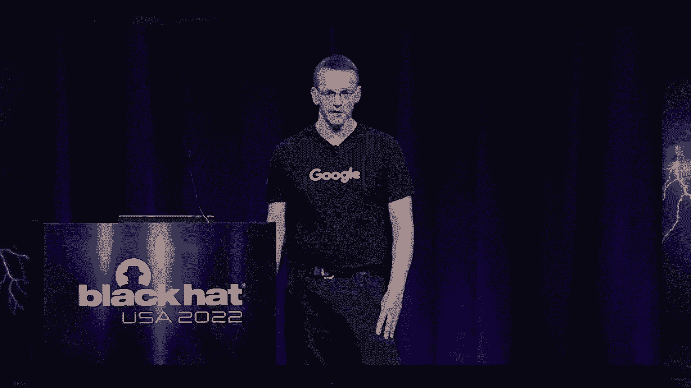

我们见到你了理查德和约翰，我们都是谷歌安卓安全和隐私组织的成员，新宇和我是安卓恶意软件研究团队的安全工程师，约翰是api程序的项目经理，谷歌内部的努力，旨在协调发现和修复漏洞，今天。

我们将和你谈谈Android上的一些路由漏洞，我们从一个，在引发这项研究的野外开发中，然后我们将通过内部研究的一些结果，然后最后覆盖Android合作伙伴漏洞倡议。

这就是我们在很久以前修复内部发现的原因，到现在大约十年了，在多个Android驱动程序中都有一系列类似的漏洞，整个家族被称为框架根，基本上，由于驱动程序中的bug，mmap处理程序，用户模式可以创建读。

内核内存的写入映射，这在当时是一个常见的问题，从幻灯片上列出的漏洞数量可以看到，但问题被认识到，情况有所改善，我们将要讨论的第一个更现代的开发是MTKSU，趋势微发了一篇博文。

你可以在这里看到一个Android恶意软件，他们发现博客文章的主要焦点是利用简历，两千一九二，二一五又名坏活页夹，但如果在博客的更深处，他们还提到了第二个漏洞。

媒体技术苏趋势微将恶意软件归因于一个APT组织，每个人都喜欢合适的，所以我们想看看，我们很快发现自己在XDA开发人员论坛上。

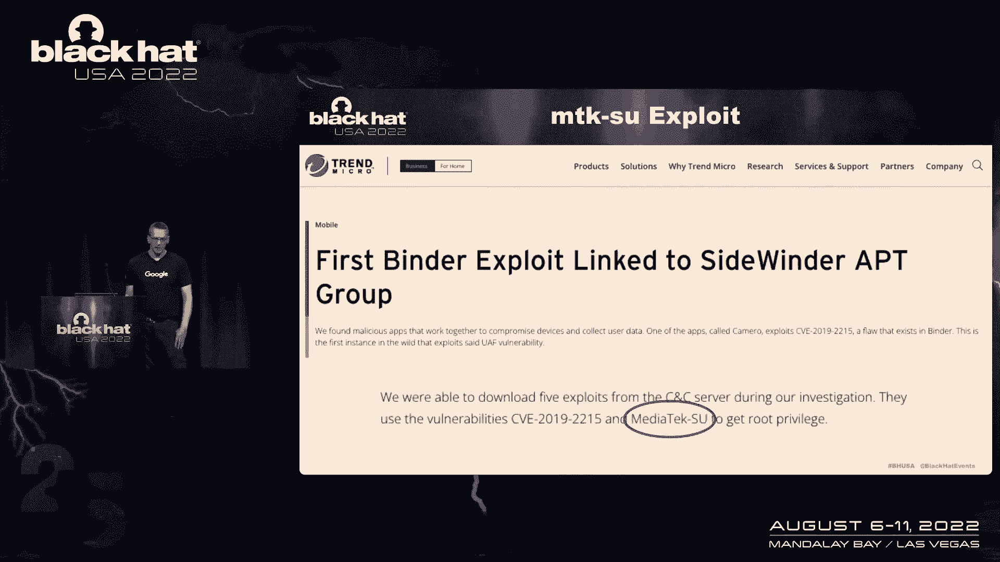

mtksu支持的亚马逊Fire高清设备的首次发布，随后很快发布了第二个版本支持更广泛的硬件，今天仍然有人在硬件上测试这个版本并报告它是否有效。

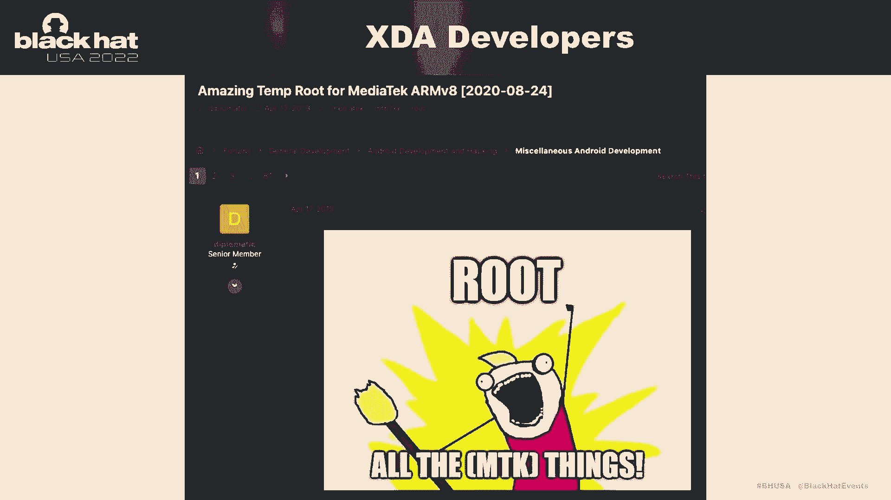

这是MTKSU在我的一个测试设备上运行的视频，用-V表示详细选项，这样它就会显示所有的调试输出，它在这里，这样我们就可以看到它是，呃，查找了一些内核符号，你可以看到一些内核地址漂浮在那里。

然后在最后UID零SE Linux是允许的。

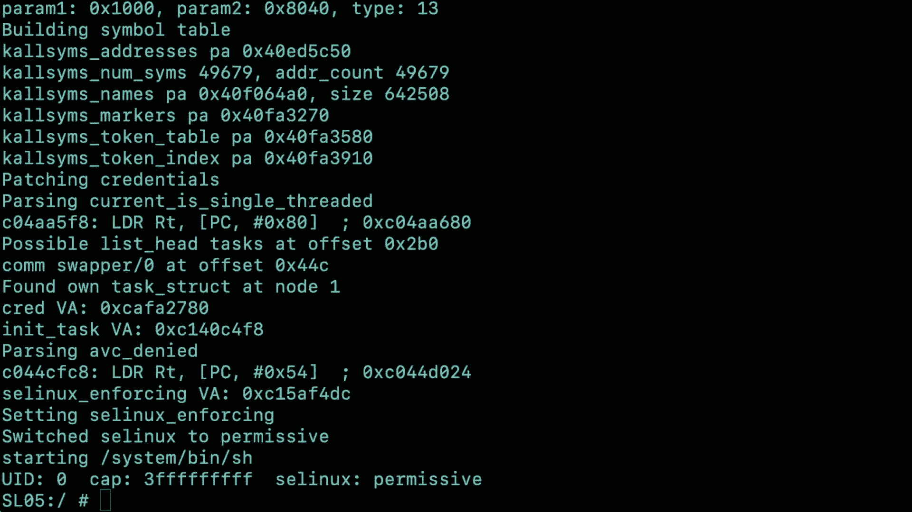

所以这里有三件最重要的事情，它做的第一件事是通过内核符号表，获取函数名称和地址，接下来的两个步骤，该漏洞查看几个函数的代码，实际上是通过寻找访问某些变量的特定指令来寻找特定的指令，呃。

该漏洞可以获取这些变量或结构的内存地址，连同指令的结构偏移，这意味着它可以找到执行攻击所需的各种数据，较少的硬编码数据使利用更加可移植，嗯，如果你想想安卓，有各种各样的内核和设备。

以及碎片化和OEM定制，因此，如果您试图维护配置地址的硬编码列表，工作量太大了，如果漏洞能自己找到东西，它使它更便携，王根谁，你们中的一些人可能还记得曾经是Android路由解决方案的大型提供商。

他们采用了硬编码的方法，带有地址和偏移量的配置，等，他们的一项功绩，我们发现它实际上有5000多种安卓组合的配置，设备和内核，这是我们发现的最大的一个，其中一些人的数量要少得多。

但这仍然是一个巨大的工作量来保持空，KSU没有那个。

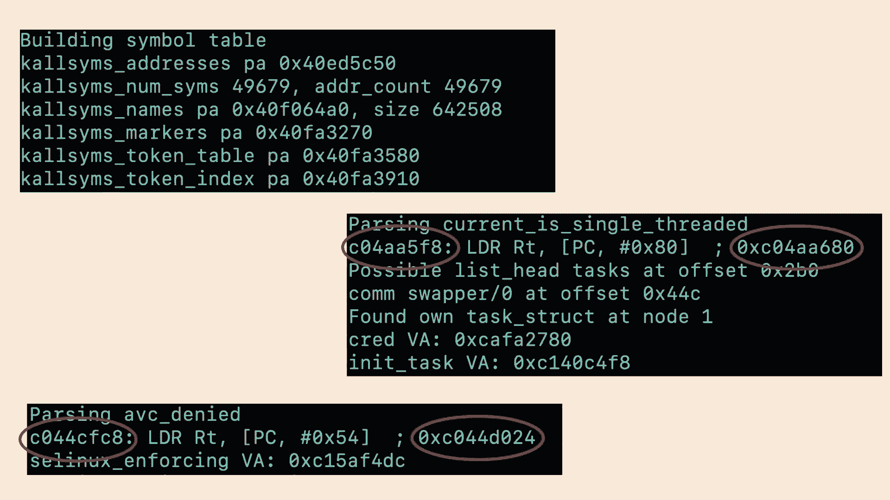

它只是找到它需要的东西并去争取，漏洞打印了很多关于它在做什么的信息，但它并没有给出太多关于它是如何做到这一点的线索，所以上面的重要弦，这些是传递给开放系统调用的各种东西，然而。

如果你对二进制文件进行反向工程，他们不在，字符串被混淆了，在可执行文件中实际上有超过250个混淆的字符串，大多数都没有引用，这三个是通过修改的DJ B两个哈希查找的。

以便让去混淆的版本通过它们到达系统调用，一旦你有了设备节点，就像这里一样，我们在这里可以看到，设备节点可通过常规访问，驱动程序支持八进制，基本上，允许用户模式将操作码缓冲区从用户发送到内核，移动。

然后写，通过这个i八进制写能力f，现在司机正在做它设计的事情，它只是设计和配置，我没有想到以后会有人来，并试图出于不同的目的虐待司机，初始修复非常简单，改变SE政策，打开设备或发出选择器。

正如您所看到的，利用失败了，它不能初始化，可能有预装的应用程序，他们现在需要访问设备来做他们需要做的事情，但您可以通过进一步的SE策略来解决这个问题，该策略明确允许这些应用程序，或者。

您可以实现一个进程外，如何公开特定功能，而不是通用的传递给驱动程序，这将有性能问题，虽然并不总是适用，与早期的Framer根系列的漏洞相比，MTKSU更复杂，但它的最终结果完全相同。

我们最终读了XDA开发人员论坛，呃，是最初发现MTKSU漏洞的个人，并利用它，没有谁的工作，我今天可能就不会站在这里和你说话了，带有一个有趣的漏洞，其他司机呢，如果考虑chrome渲染器过程。

gpu驱动程序需要是可访问的，它在一个非常严格的沙箱中运行，但它需要做图形操作，GPU驱动程序是非常复杂的性能，一个非常重要的焦点，其中一部分涉及到在用户模式和内核之间映射内存的大量关注，或者GPU。

所以它符合我们所说的许多领域，Android的GPU制造商并不多，ARM和高通，我们倾向于看到那些在合理的定期基础上的安全报告，呃，但想象力技术为VR提供动力，我们找不到很多这方面的安全报告。

如果你不熟悉Power VR，在不同的地方有很多Power VR硬件，以及安卓设备，Power VR此前曾被苹果使用，在谷歌笔记本里，电视，一些台式计算机，甚至无人机。

所以这似乎是一个适合进一步研究的领域，这样我就把事情交给新宇了，谁来告诉我们其他的研究，谢谢。就像，我们只是说不可能。

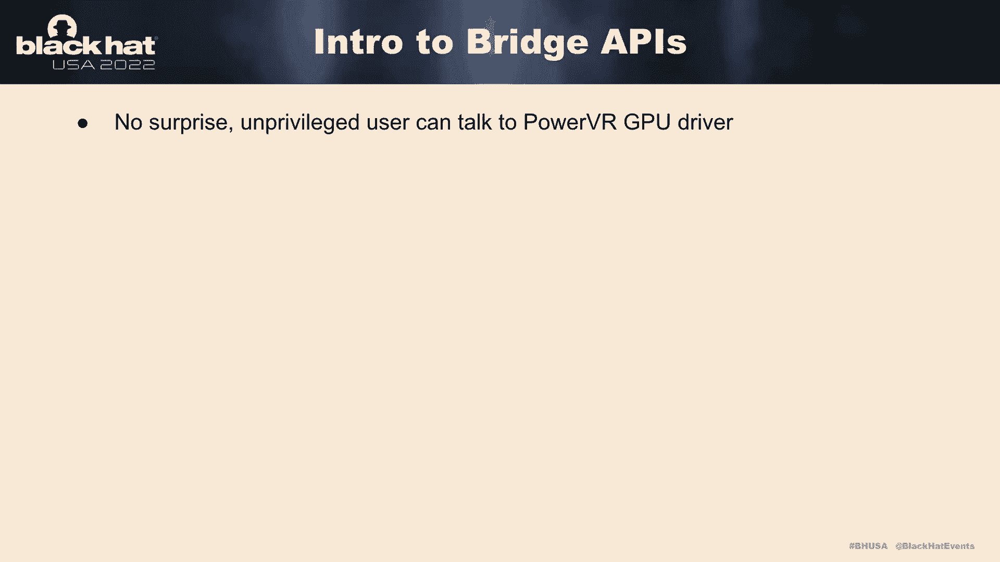

我们可以限制以前的用户访问可能是GPU驱动程序，每个GPU驱动程序向用户空间导出数百个内核API，私人开发商称他们为，桥梁功能的桥梁API，嗯，所以基本上他们是与设备驱动程序交谈的三个步骤，就像。

你知道的，打开装置和电子响应，所以更具体地说，用户空间程序已经可以使用Cisco提供的函数组ID函数ID，以及传递给设备驱动程序的数据的输入，所以除法驱动程序会看看ID。

调用准确的免费GIS并将结果发送回用户，好的，以下是呃，桥梁API工程，所以第一步是创建内核缓冲区并复制用户输入，调用内部内核函数，然后将结果返回给用户，不幸的是，每一步都是错误的。

所以让我们来看看第一步，例如。

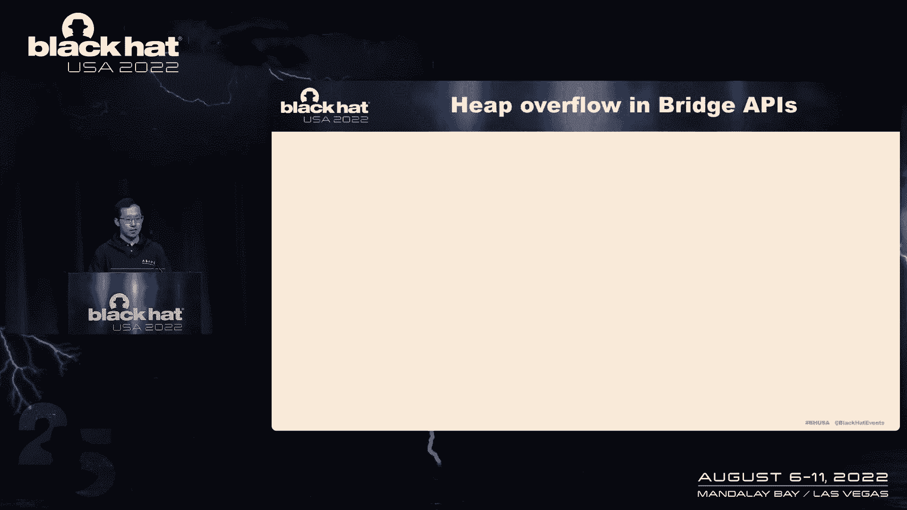

如果我们要调用特定的桥API，我们必须指定组ID和函数ID，在右边，您可以看到Divide驱动程序是如何以这种方式导出数百个API的，所以计算缓冲区大小的方法是简单地只计算用户输入。

所以会有一个非常明显的积分流应该发生在这里，这导致奥杜邦保持正确，你也可以看到虚空驱动程序可能有很多沙形检查，但他们总是检查，如果这里的现场总是在零度以上，所以基本上它什么都不做。

它们还在GPU框架中创建了大量的旅行，因为所有的桥接GPS都是这样实现的，所以谷歌为这个问题分配了几份简历，呃，但好消息是有时角流可能会抵消细胞，呃，假设您分配的缓冲区大小为溢出。

但是MEM副本的大小也溢出了，所以这里的流动相互抵消，实际上没有安全影响，尽管代码保留了一个非常错误的方式，酷，所以让我们来看看这里的第二步，嗯，第二步是调用内部内核函数，所以基本上有三种类型。

内核函数创建一种使用对象，释放对象，好的，所以呃，这样我们就有了一套设置DPI，它所做的是创建内部对象，使用对象进行计算，然后返回一个句柄给用户，处理一些几乎可以预测的事情，好的，所以如果我们仔细看看。

除驱动程序创建对象增量引用，对一个的引用，然后递增引用计数，呃，用圆木保护，因为我们要做一些内部计算的事情，然后引用来了，它也受到日志的保护，好的，我们还有一套简短的桥梁治疗。

所以英国组合Y要做的是用手柄找到一个物体，从用户空间和递减引用计数提供，好的，所以如果罗马人计数装饰是有害的零，然后在A是自由的之后，所以这些是我们想看到的国家，你知道增量的第一个线程，引用计数。

然后三个发生在第三个线程上，第二个将引用计数从一二读到一，然后做一些事情被调用，然后ACE引用不能递减，免费的，一切看起来都很好，然而，如果我们在这里有第三个邪恶的推力来进一步减少，从1到零的引用计数。

所以从网络免费开始，然后发生了什么，第一个线程来这里做点什么，但A也是免费的，因为每个桥API都是这样编写的，就其同步基础设施而言，所以基本上，最喜欢，用户以这种方式攻击了几十个内核API，自由脆弱性。

所以想象技术也需要几个月的时间来解决这个问题，因为很明显你不能用一把大锁来锁定整个世界状态，否则我们会有一个巨大的性能打击，所以这里的最后一步，将度假村复制回用户，所以它基本上是做你知道的。

除法驱动程序试图初始化并吃掉对象，将肿瘤学数据复制回真实空间，所以这里发生的是，你知道我们有对象a，和除驱动程序尝试通过做某事函数初始化对象A，然后它会将数据复制回您的空间，所以这里有一个问题。

如果做某事感觉很早，则IS未初始化，所以你很容易泄露臀部指针，或者通过使用人员大小以这种方式传递内核，这是一种非常稳定的泄露各种信息的方式，我们还有其他问题，比如你知道的，上游参考流。

用于所有类型用户费率的流，会有很多典型的内存损坏风险条件，但是这些bug肯定是可以探索的，可以加载任何合适的设备，但是，我们不打算做深潜，了解如何利用这些bug，因为我们有更强大的东西。

所以让我们来看看内存管理，所以你知道我们有一个CPU，我们有GPU，这里会发生很多内存映射，就像CPU将分配映射到物理页面的虚拟页面，同样，gpu也会将虚拟页面映射到物理页面。

还有一种叫做共享虚拟内存或SVM的东西，这基本上意味着CPU和GPU将分配自己的，分离不同的虚拟页面和到相同物理页面的映射，以便很好地传输数据，让我们来看看物理页面是如何管理的。

以及GPU如何建立从带有GPU的虚拟页面到物理页面的映射，好的，所以这里有一个重要的概念，称为PMR或物理内存资源的PStand，所以美国的SWIFT计划导致了很多美国人来到这里，在我的手柄上。

pmy句柄的意思是用户空间程序告诉gpu驱动程序，就像嘿，这是一堆物理记忆，我想预订，请把圆周率手柄还给我，以及以后的使用，这个节目，可以通过创建GPU或CPU的手柄，虚拟内存分配。

因为我们已经为内存映射保留了一堆物理内存，所以你知道，韩国PMO将参与无线电，很多来自空间的争论，你总是可以很快地争论，因为争论并没有说这是很好的，例如，如果你说嘿，我想减去两个物理页面。

你会因为自动刻录而得到内核崩溃，类似地，如果您想创建GPU虚拟虚拟页面，你还必须在这里传递很多论点，例如，如果我说，哦物理学，物理映射偏移量为-2，那么电流就会崩溃，因为所有的人都读到了。

所以你可以利用其他边界问题来确保，您可以映射到所需的物理页面，因为你有按钮的读数或原始的酷，所以我们还有另一个有趣的弱点，如果我们想要一个GPU映射，所以我们要操作IO木。

所以如果我们想在ARM 64架构上操作IU，那我们就用手臂给它做手术，但是有一个桥接API，我们可以告诉除法驱动程序嘿，我们实际上在地图上，所以除法驱动程序，GPU驱动程序将以这种方式安装页表。

中初始化页表，我晚了六岁，所以结果，因为我们有一个新的架构，调用的页表已损坏，一旦使用这个名为mmap的程序，你可以立即看到各种有趣的数据，因为页表已损坏，嗯好吧，所以让我们来看看CPU方面。

所以CPU侧嗯，您可以分配一堆虚拟页面并映射到物理页面，因此，一般来说，用户空间程序必须保留一个Prima句柄，对分水岭司机说嘿，我想回来，我想在未来的几年里有一堆物理页面。

然后可以将p模式传递给mmap，因此，Divide驱动程序将为您映射虚拟页面，设备驱动程序也有一个叫做侦察的东西，用于出于安全目的检查内存映射的数量，我们将在后面讨论，例如。

如果我们有两个虚拟页映射到相同的物理页，那么我重新计数等于三，因为默认情况下，好的，我们还必须在这里讨论另一个概念，在内存中调用，所以痛苦记忆用于从设备到主机的数据传输并调用它，我的理解是。

为了避免呼叫和数据传输，预先分配一些物理内存，所以适当的装置有缺口I，在那里您可以将应该由p保留的物理内存固定在一起，所以一旦你这样做了，所有固定存储器都被认为是存储器中的数据传输。

这里有一个超越痛苦的全球国家作为安全目的的武力，你也可能有，你也可以打电话给另一个桥来解开你画的Facebook页面，所以这些脸书页面将被转移到一个全球杀戮，以便稍后出现。

然后全局状态未支付将更新为true，所以你知道，假设我们输出页面abc，然后我们在页面abc，因此页面abc将被插入到全局列表中，那么如何释放这些页面，原来，动力装置寄存器意味着一种伸缩器。

所以收缩器是一种内部覆盖路线，所以当记忆被绑在一起的时候，将调用扫描对象回调，它释放全局列表中的所有页面，好的，所以说，让我们说，如果我们分配页面abc和我们导致未付abc。

然后我们有全球主义者abc对，所以我们可以再次解开同一页，所以全球IS将是ABC ABC，因此，我们将有一个双三版的问题，所以如果你记得之前有几片，我们这里有一个叫做超越痛苦的全球国家。

所以这是为了防止物理页面上的任何双重冻结，但为什么它不起作用，所以事实证明PI在生产中没有启用，只有当代码静态时才启用，当检查器启用时，所以如果有人试图检查，答案将被启用，但在生产中，它什么也不做。

这就是V 2 9 2 0 1 2大概是，如果我们访问现有的安全检查，如果Facebook页面被映射到其他地方，就像你知道的，我们有，I rev，数一数，所以物理页面不允许疼痛，所以让我解释一下。

如果我们在这里调用下面的函数，首先我们做一架钢琴，我的手柄，我们通过地图创建虚拟页面，我们不能解开记忆，因为如果我们能做到，那么这里发生的是虚拟页面，我们又回到了物理页面，稍后将通过链接免费。

有点黑眼圈，然而，这里有一个特定的逻辑错误来绕过安全检查，如果我们先创造，然后解开内存秒，一定会成功，因为在这个时候我们没有映射任何记忆，所以这些页面已经被放入全局免费稍后。

然后我们可以调用一个地图来绘制这个地图，映射以获得一堆虚拟页面，所以这里发生的是，我们将有一堆虚拟页面，映射到将通过以下方式释放的物理页，有点黑眼圈，这样我们就可以有效地触发Linshiner。

通过一次又一次地这样做，将不够的内存压力推给Linkernel，因此，我们将有一堆虚拟页面映射到物理页面，那以后就免费了，所以这就是电视21，三九八五大概，它是在二月下旬被发现的。

所以绕过安全检查是一个非常微妙的逻辑错误，一个用户空间程序最多可以读写三个物理页面，我个人称之为动力路线，好的，让我们来一个例行公事，但还有一个问题，有些设备不允许你在GPU设备上结束。

尤其是如果您有一个具有更高版本DK的设备，好的，如果你在这里查看保单，大家可以看到，这将是，一群用户能够在GPU设备上映射地图，如果你的太空程序真的不允许在GPU设备上映射，如何打开API单词，因为。

从GPU驱动程序分配的CPU虚拟地址，所以我所做的是看看这个开放的城市，库的库实际上是由几个供应商库实现的，所以如果你有一个仪表技术设备，您可以看到您和中级技术供应商库的强大功能，用于实现所有API。

通过反转这些供应商API，我基本上有两个资金，所以这里的第一个发现是，新的空间供应商库具有比内核模块更严格的安全检查，到地图GPU驱动程序并获取虚拟页面，虚拟页面地址返回，这是同一个Linux的旁路。

所以我们这里有一个子进程，叫做监督者API名称模拟，这里的子过程是鹦鹉的皮特里过程，因此，当子进程试图创建PMMR时，因为父进程能够拦截所有这些都是由Petrees调用的，这样我们就可以。

所以我们可以问，以便劫持父进程，子进程的控制流在创建PIS后立即在PMI上引起，然后子进程将使用供应商库来映射GPU驱动程序，并取回一个虚拟地址的CPU，这样我们就可以作为Linux有效地绕过。

并引发流动性问题，所以这里的最后一部分是关于如何制作一个设备，类似于管道旁的设备，呃，但人类的心智力量要强大得多，因为它是物理页面是免费的，所以通过漏洞的力量，这个设备会有很多问题，您可以跨页表。

你可以交叉二进制，你可以攻击，你知道在记忆中，崩溃的方式还是传统的方式，所以我要谈谈，呃，中国方式，所以首先，我要做的第一件事是用不同的名称生成所有子进程，因为我们可以阅读新的免费物理页面。

我们可以找到确切的测试结构，地址是正确的，然后我们可以通过记分卡找到受害者的档案，例如，我们可以控制阿什曼的私人数据，所以我们可以使用Ashman的i调用来实现绿色右原语。

下一步我们要做的是转储内核映像，嗯，你知道PM标记结构有一个名为注释的字段，由您的空间指定，轻击只读指针，这样我们就可以转储大量当前的信息，并找到，强制执行也是如此，把它关掉。

最后一部分是你的右交叉结构，所以有一件事我想，我想说，因为我们正在写我们正确的组合页面，所以我们可能有一段时间没有CPU捕获。

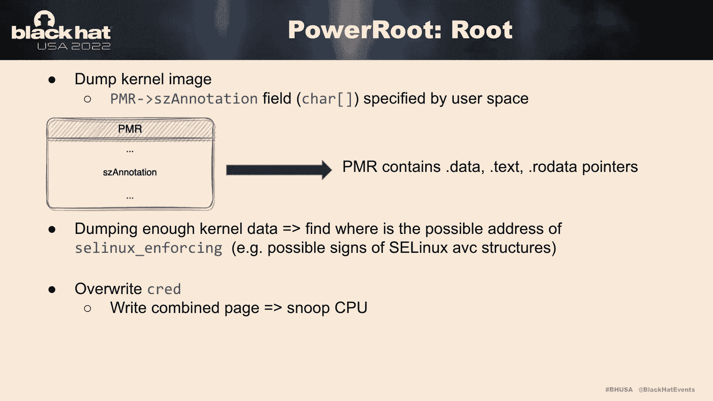

这是抢劫随机设备的演示视频，它是这个星球上最流行的设备之一，所以让我们开始吧，所以现在让我们试着创建很多PM结构，查找内核数据指针，然后在这里创建很多子过程。

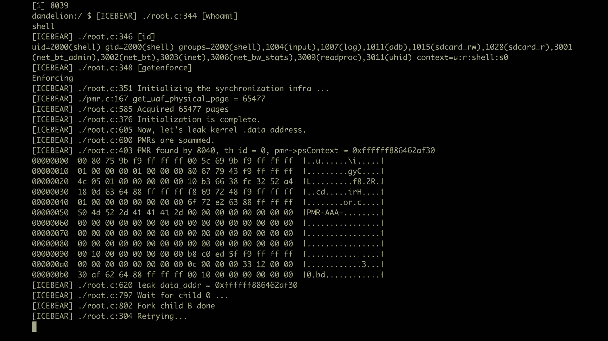

所以可能需要一段时间，现在我们找到了我们拥有的文件结构，就像一个私人数据，所以我们可以用阿什曼来做一个正确的原语，然后我们可以转储大量当前的信息来找到零件在哪里，其中链接和强制是，然后我们可以晚点关掉。

然后这里的最后一步是获得一个根进程，所以在这里努力工作的方法是，你知道的，搜索物理内存，又是物理记忆，并试图找到我们的凭据文件，一旦我们找到它，我们会篡改所有重要的字段，就像你加到零一样。

所以我们有一个rua，可能需要一段时间取决于确切的记忆，这取决于物理记忆的情况，就像有时你可能会等一会儿，但请记住，这种电梯很稳定，因为你不必学历史，你不用担心Kalign。

你唯一能做的就是再次搜索记忆，并找到您想要的有趣的内核结构，所以基本上意味着如果你用这个漏洞标记设备，设备不会崩溃，所以在我等待的一段时间里，现在我们已经劫持了查询结构，我们在读我九设备上有比例。

我们现在可以控制设备了，谢谢你，请为约翰介绍一个免费项目而工作。

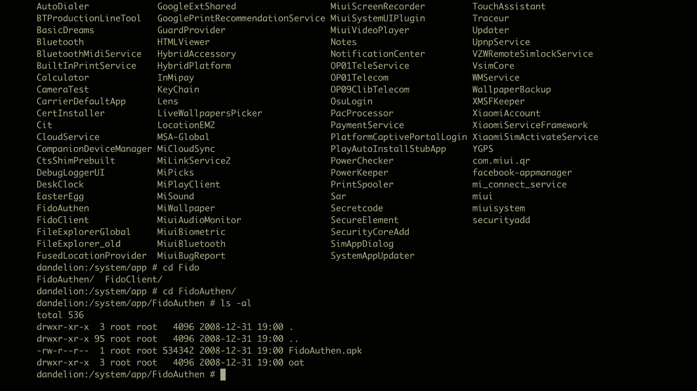

谢谢。朱尼尔和理查德发现的漏洞是谷歌，广泛努力使安卓生态系统更加安全，我们寻找知情合作伙伴的方式，然后公开披露这些安全漏洞都是通过这个程序发生的，称为Android合作伙伴漏洞倡议或简称API。

所以我相信你很熟悉，Android整合了整个行业的安全功能，我们总是试图确保我们的设备是真正安全的，我们还要求开发人员和设备制造商遵守这些高标准，也是这一努力的一部分，我们有一系列现有的项目。

我相信你们中的许多人可能已经熟悉了，其中之一是谷歌bug Bunny程序，还有安卓bug bunting程序，Android合作伙伴漏洞倡议，为这套有针对性的Android OEM增加了另一层安全性。

它的工作方式是，任何团队中的任何谷歌员工，如果他们发现影响第三方OEM的漏洞，可以通过API报告他们的发现，然后我们把这个弱点，进行复制，识别所有有效的合作伙伴构建。

然后向受影响的OEM合作伙伴披露这些构建和问题，最后，我们有公开披露和补丁咨询，所以我不确定有多少人知道这个链接，但屏幕上的链接是我们所有公开披露的问题的链接，通过这个程序，你应该看看。

我敢肯定没有多少人知道这件事，所以对于这个VR的力量问题的具体案例，这个过程有点复杂，问题是我们的任务不是，只是向想象力披露拥有和管理Power VR的技术。

但是有这么多下游原始设备制造商也利用这些驱动程序，所以我们要做的是，我们必须首先向想象技术揭示，在这项研究中发现的所有各种CBS，并确保想象力技术拥有资源，他们需要发布补丁。

然后我们去了所有下游的OEM，我们确保他们一旦有了补丁，并确保他们也有能力去实现补丁，最后，我们在我前面提到的问题跟踪器上披露了所有这些问题，下面的陈述是由想象技术提供的，它触及了如何。

他们希望继续参与应用程序视图程序，造福于这个空间的整个行业的安全，我想用一些对开发人员和研究人员的关键收获来结束这次简报会。

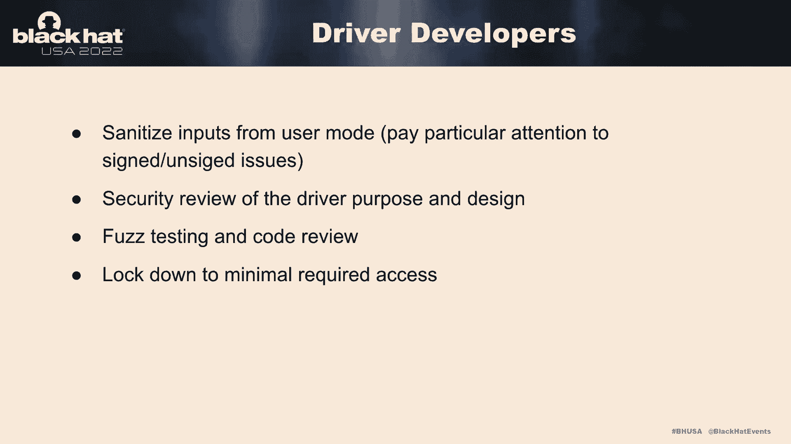

本质上，驱动程序开发人员的收获归结为两个主要的事情，第一个，从用户模式消毒用户输入，特别注意有符号和无符号问题，第二次，确保您将可访问的功能锁定为所需的最低功能，驱动程序开发人员可以更进一步。

将驱动程序限制在一个非常清楚的目的上，并确保你融入了绒毛，测试和代码审查作为开发生命周期的一部分，对于研究人员来说，内存映射和可见性往往是一个反复出现的主题，在这个空间里。

各种硬件处理单元有多个cbs和驱动程序，在过去的几年里发现的，除了我们在这次演讲中提到的发现之外，高通和三星CBS在资源幻灯片的最后，如果你真的想了解更多，潜在的问题仍然存在。

这些Power VR问题以前是否被发现而没有报告，我们发现的一些问题可能不难识别，我可以从第一手经验告诉你，有一件事，你发现，VR发行的第一力量，不久之后，其余的人也跟着来了。

ioctopfuzzing不一定很简单，这与几年前发生的另一个黑帽子谈话有联系，在参考资料幻灯片中，讨论了用接口感知模糊内核驱动程序，作者真的用这种方法找到了媒体技术中的其他简历，CMDQ驱动程序。

这些bug是用更简单的方法和更简单的方法发现的，如果这次谈话激励你出去，并找到自己类型的漏洞，我鼓励你记住，您可以将这些类型的问题提交给Android bug绑定程序，他们将在那里接受评估，然后评估。

看看它们是否对安卓设备或生态系统有潜在的影响，所以最后，我们想分享这个资源列表，资源，与驱动程序开发人员的资源，研究人员，和整个安全界，如果你想深入研究这项研究。

所以我真的很感谢你们今天来参加我们的谈话，我们期待着回答您的问题。

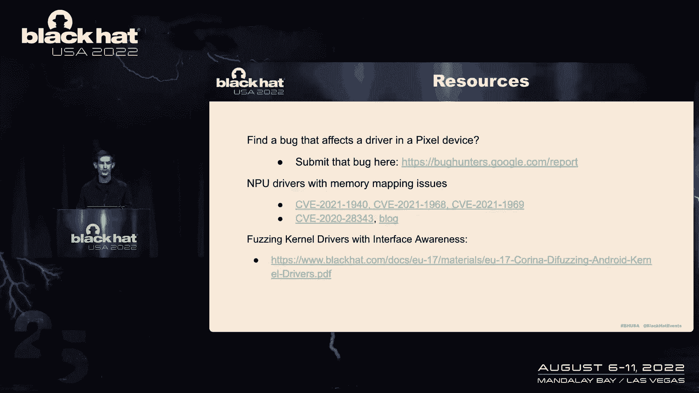