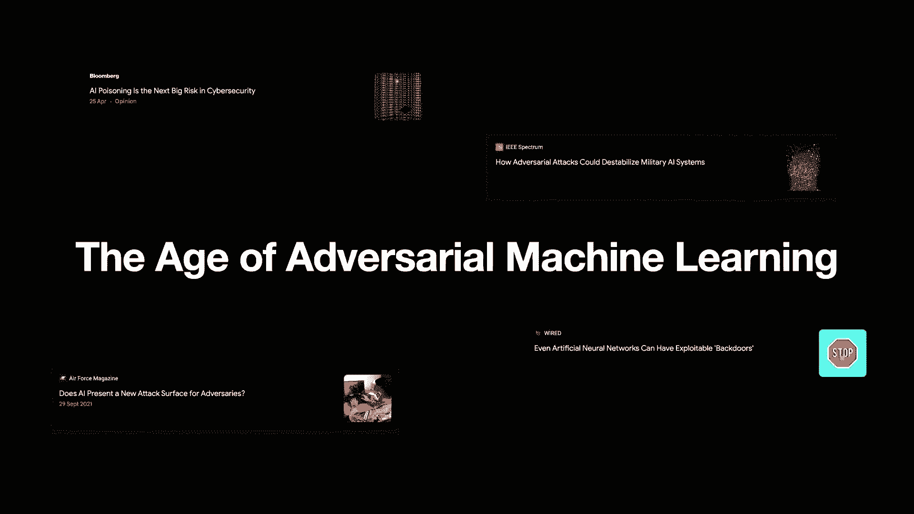
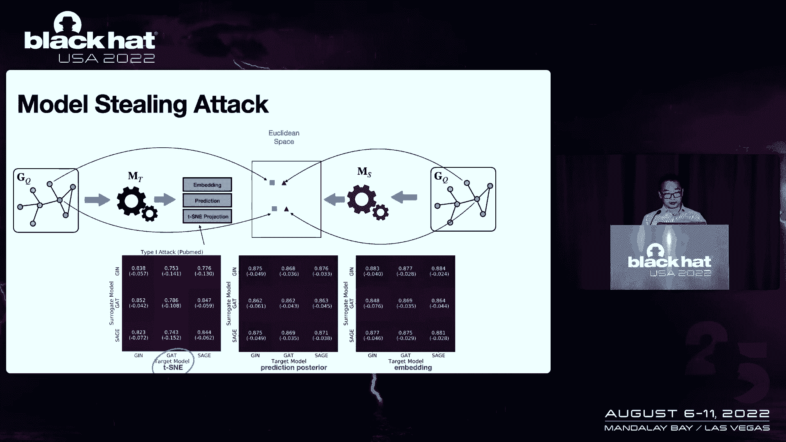
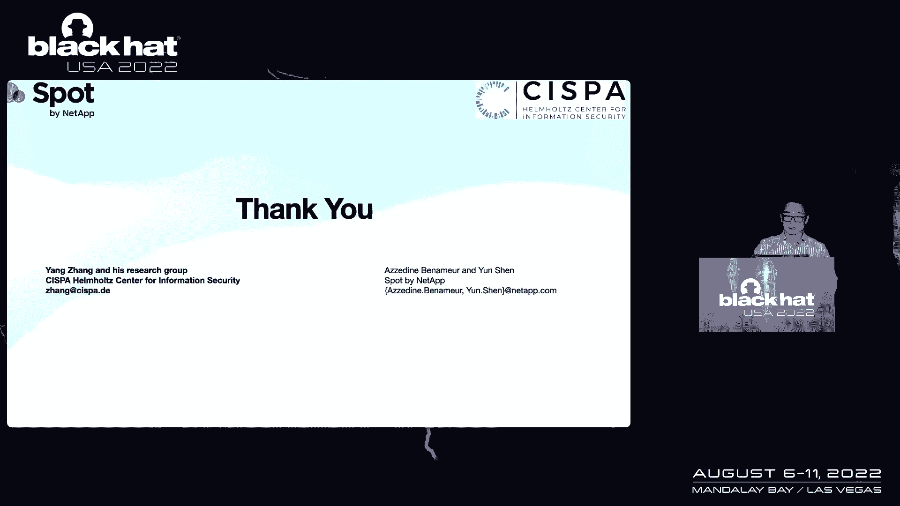
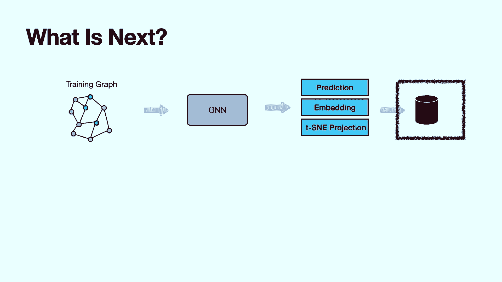
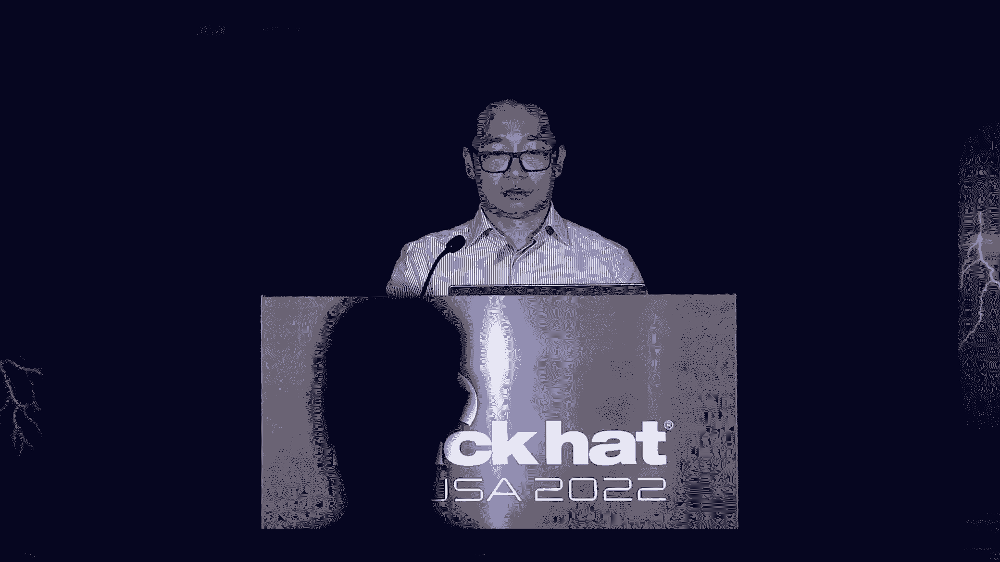
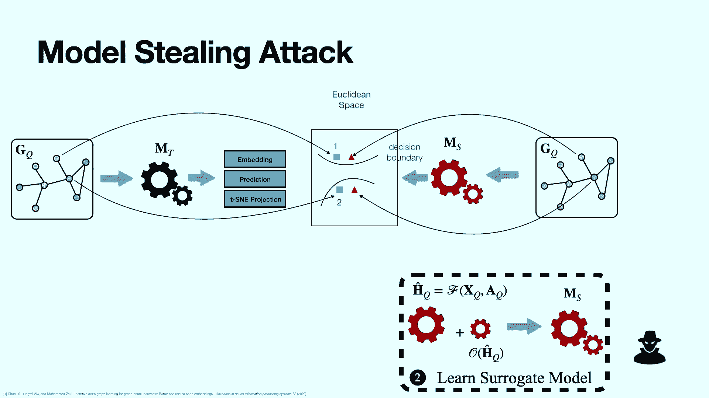

# P24：025 - All Your GNN Models and Data Belong to Me - 坤坤武特 - BV1WK41167dt

早上好，下午好，晚上好，本演讲是关于评估图神经网络模型的安全态势，主要投稿人是Dr，在过去的几十年里，从面部识别到语音识别，以及最新的大规模语言模型和文本到图像生成器，但今天我们要远离图像和文本。

音频视频，我们要谈谈，图，他们无处不在，这并不是一个陌生的概念，它们有任意的大小，例子很多，社交图知识图，您的购买历史记录，喜欢用户项，相互作用图，即使是分子，它们可以表示为分子图作为应用程序。

也到处都是，你上电子商务网站，他们有一个推荐给你，我们找到了你可能感兴趣的项目，你上社交网络，他们实际上会告诉你，你知道有人，你想和他或她联系各种各样的事情，最近药物E的发现有了新的趋势。

所以不是在实验室里看分子的毒性，你可以用图神经网络来做毒性预测，所以这几乎是普遍的，图的应用与传统的深度神经网络，在过去的几十年里，他们被证明是非常成功的，但它们是为网格设计的，像图像或序列，参阅文本。

鉴于成功。

图神经网络是在2014年发明的，基本上，目标是映射输入图，就像图表不容易被我们的计算机使用一样，进入欧几里得空间，变成矢量，所以在这种情况下，你可以开始在计算机中使用它来做到这一点。

有一种叫做消息传递的技术是由图神经网络使用的，所以基本上他们只是以递归的方式聚合你的劳动力信息，并基于不同的技术，您有不同的聚合器，例如图卷积网络或图同构网络，一旦你把节点映射到欧几里得空间。

可以根据向量之间的距离开始做节点分类链路预测，如果我们进一步进入图形级别，你实际上会有一件事，是图级别映射的核心概念，你有节点嵌入吗，你有一张图表，你有K个节点，你想压缩成一个向量。

所以整个图用一个向量表示，如果你这样做，你可以去那里，在可视化上做图形分类和匹配，你也可以像我之前提到的那样做毒性预测，这些是应用程序和图形级别，只是一些背景和所有这些大公司，你说出来，谷歌推特。

他们都在做这个图神经网络的不同应用，意味着它几乎是看不见的，但它在后端的背景中，支持你的日常生活，而且是的，黑暗面来了。

如果你在谷歌新闻上这么做。

你可能会看到这里做的所有截图，这是个大话题，最近，是关于机器的，模型本身，我们很同意空军杂志，就像，人工智能是否代表对手的攻击面。

所以让我们来谈谈图神经网络是否真的是一个新的攻击面，我会谈谈四次袭击，我将从链接链接识别攻击开始，这次攻击的目标是识别，这里实际上是场景，我们在节点分类任务中构建了图神经网络。

攻击者的能力是他们可以突破，你存储后部分数的地方，什么是有效的场景，让我们把这个巨大的社交网络，比如说，你把它输入图神经网络，你花了几个小时，你生成每个节点的后部，你不经常这样做。

所以你存储在对手的数据库中，破坏存储结果的数据库，他们可以开始推断，你不想谈论那个信息，把它放进接触追踪框架里，如果两个病人连接在一起，那里有太多的先验信息，他们是怎么做到的。

所以这实际上是我们谈论的红色和网络钓鱼攻击，所以在上面的那个得到后面的分数，它们实际上只是两个向量，对呀，只需简化这里的示例，他们可以立即使用后验相似性来计算，如果这大于阈值。

在这两个节点之间存在一个链接，否则，即使是我们也不会采取这种非常简单的方法，表演还算可以，但不是很好，然后我们考虑第二种情况，因为攻击者已经知道，该后验分数由图神经网络模型生成。

我使用阴影数据集自己建立一个模型怎么样，这是他们在承受压力后可以做的，在他们的本地环境中，与他们目标的远程模型没有交互，他们做的是他们有影子模型，他们有阴影数据集，他们会建立自己的影子模型。

仍然作为图神经网络，从那里，他们会得到所有节点的后部分数，因为它们实际上控制着整个环境，他们可以创建一个MLP作为他们的攻击模型，比如说，他们可以利用这两个后部学校的串联在一起，用正负边训练。

一旦他们这样做了，好的，他们会很像它拿着这个，比如说，如果后面的分数实际上有四个，如果他们一起联系，你会得到一个八维向量，假设您破坏的数据库，将它们连接在一起，这意味着六维，所以有一个维度不匹配。

你不能轻易做到这一点，一个简单的解决方案只是通过，我们尝试的是统一这个攻击模型的输入，所以我们有一个不同的距离函数来统一后验分数，同时，我们使用四种不同的熵，来计算我们应该训练的后验分数之间的差异。

然后我们建立这个攻击模型，一旦你破坏了数据库，您可以看到您有统一的输入，那么你的模型就有效了，简单解决方案，就像，直接计算后验分数之间的相似性，你在这里看到的一件重要的事情是。

您实际上不需要使用相同的数据集，目标模型是训练，比如说，您可以在这里使用一个站点，它是一个引文图，它实际上可以改善从那里的蛋白质数据集重新识别的链接，我们只是切换护理，我们谈论后部分数。

如果攻击者实际上从您的环境中获得了图形嵌入怎么办，这里我把这两个放在一起，将更容易看到这两种攻击的价值或后果，第一种是属性推理攻击，所以基本上攻击者可以推断基本的图属性，从嵌入的图，第二个是。

他们实际上可以推断，如果某个子图存在，则图通过其图嵌入，我从这个开始，简单回顾一下，图嵌入，只要记住，整个图由单个向量表示，简单回顾一下，在我们前进之前，这里有一个场景，我们建立了图神经网络模型。

任务是分类，首先，破坏数据库以获得图形嵌入，第二次，他们可以查询图神经网络模型，因此，这是堆栈、链接和提要的属性之间的区别，一个大背景就像你有一个私人图形数据库，你把它们泵入图神经网络。

你得到了图形嵌入，对于图形嵌入，您不需要每次都这样做，除非你有一个新的图神经网络模型，所以只做一次就像是一个自然的过程，并存储在数据库中，攻击者实际上破坏了数据库，他们能做对什么。

因为你会认为它们只是向量，他们可能不会有那么大的伤害，他们能做的第一件事是从这个矢量中推断，这实际上是一个大约有四个节点的图，举个例子，1。你是怎样首先达到这个目标的？攻击者必须有自己的辅助图。

如果我们把它放在分子图环境中，对呀，假设你做分子毒性预测，他们很容易得到一组这些辅助分子图，这只是一个查询，图神经网络模型，并获得类似于图形嵌入的响应，所以从那里开始，他们将在本地建立攻击模型，应力后。

他们这样做了，看一眼图形嵌入，与主题模型没有进一步的交互，他们只是建立了一个MLP模型，字面上，就像攻击模型，他们可以使用，有接地齿的节点数，因为他们已经控制了辅助图，例如。

他们已经知道第一个辅助图有四个节点，第二个实际上有五个节点，所以他们放进不同的桶里，将帮助他们大致估计图形的大小，在这样做的时候，火车，他们的攻击模式，他们只是把他们攻破的图形嵌入到攻击模型中。

他们可以成功地从这个图中估计节点数，和性能方面，没关系的，伊什，我们使用了五个公开使用的台架数据集，比如说，如果我们把酶，比如说，第一排，第二个数字，你可以看到越远，无法推断出细粒度信息。

但他们实际上可以合理地推断出这个图的大致大小，但这并没有给攻击者增加多少价值，所以这里有一个图表，我估计实际上有四个节点，我能得到的不多，然而，还有一种攻击是子图推理攻击，攻击者可以推断，比如说。

这里有一个三角形回忆，我们可以估计图的大小，把它们加在一起，它将进一步减少攻击者重建图形的搜索空间，如果我们进一步将其框入分子图，概念就像，如果你有这个百万美元的分子图，好的，攻击者只要把这个嵌入。

他们实际上可以推断，如果他们在分子图中有一个具体的子图，然后通过估计图的大小，它们可以逐渐缩小搜索范围来复制你的分子图，对呀，这就是这次袭击的影响，他们是怎么做到的，同样的事情，攻击者仍然要有，辅助图。

他们对查询进行对话，远程图形，建立神经网络模型，得到图的嵌入，这个本地模型唯一的功能是生成子图嵌入，你对压力权感兴趣，这其实是一个局部模型，然后他们组合图形嵌入，使用此子图嵌入的查询，它们可以产生负对。

它们还可以产生积极的周期，因为他们知道三角形存在于辅助图2中，以此类推，诸如此类，一旦他们这样做了，他们可以建立一个放大器模型，同样的事情，一旦他们从你的数据库中得到图形嵌入，他们可以开始将子图嵌入。

把它们组合在一起，泵入攻击模型，我们的评估显示，将这两件事结合在一起的最好方法是使用图嵌入差异，比如使用图嵌入和子图嵌入之间的区别，训练攻击模型，表演看兽人，代码或分数可能在零点六到零点八之间，五个。

或者类似的东西，但它相当好，如果我们把砖块稍微换一下，我们看看这些攻击，我们基本上已经涵盖了，基础的基础就像攻击者实际上可以破坏你的数据库，如果您保护您的数据库，你储存的所有东西，存储在您的环境中。

你几乎可以防止这两种攻击的发生，对，因为他们没有嵌入，他们没有后面的分数，他们无法实施这些攻击，所以外卖部分来了，一个是安全的基础设施，你可能听说过这些建议，对这个图模型的态度。

它们的输出内部有有意义的信息，所以它们不仅仅是数字，下一步是什么，保护数据库，您阻止链接，红色和网络钓鱼攻击，属性推理攻击，子图推理攻击，他们在管道上能做什么，模型本身，你花钱连接你的数据。

你花钱建立图神经网络模型，模型本身真的很有价值，对正常，你只要打开这个模式，为客户服务，那可能是你要做的，那就是我们要和模型讨论的地方，提取提取攻击是，攻击者将忠实地远程复制模型的功能。

他们也不想突破你的安全边界，说说细节，所以你有这个模型，你建造它，你训练它，你向客户提供回应，您可以保护您的基础设施，你接受我们刚才提到的所有建议，你向客户敞开心扉，您提供了一个安全的API。

这样客户就可以查询图神经网络模型，并从模型中获得响应，并构建它们的下游应用程序，一切都很好，然而，如果你从攻击者的角度来看，他们可以假装是顾客，他们为你的订阅付费，交易进入安全API。

这里没有你能察觉到的东西，因为顾客，他们的目标是得到回应和回应，复制模型的功能，整个过程是这样工作的，不要被这个工作流程吓到，我会一个一个地扩展到他们，这很简单，如果攻击者已经有了图表。

他们可以对目标模型进行查询，然后他们就可以得到回应，它们实际上可能没有图形结构，假设它只有用户配置文件，但他们没有用户之间的联系，他们要做的是建立一个图表，我是说那里的一些结构，并查询目标模型。

我就不细说了，你有推荐信吗，和，在最坏的情况下，如果您的系统中没有这个框架，攻击者实际上可以使用k n算法来获得最小，对于最小结构，并查询目标模型，这是第一步。

他们只需要从他们所掌握的数据中建立一个图表，它们实际上有图形结构，他们将不得不充分利用反应，从目标模型，我们实际上讨论了三种情况，目标模型可以返回加载嵌入，他们可以用，返回后部学校。

或者他们可以退回迪士尼投影学校，我是说迪斯尼是一个，框架，他们只是将高维数据投射到三维或三维三维或二维空间中，你可以很容易地想象它们，他们如何返回查询图，他们只是将这个查询图泵送到目标模型。

目标模型会将响应发送回来，回想一下我们之前谈到的是那种，还你，被认为是嵌入或预测或迪斯尼投影的向量，他们只是，你把它们映射到欧几里得空间，可能有些东西是这样的，同时，同样的卷曲图将被泵送到。

一种代理模型，他们也会从代理模型中得到响应，他们可能不会，假设他们不是，他们不匹配，在袭击者离开的那一刻，第一个目标是确保他们使用第一个损失函数来移动三角形，靠近正方形，这个损失函数的基础是。

保持欧几里得空间中相似的空间连通性，代理模型和目标模型之间，一旦他们这样做了，他们想要实现的第二个目标是分类，因为我们认为这种攻击是在负载分类任务中进行的，假设这两个节点有不同的类。

从目标模型的角度来看，它们有不同的决策边界，泰只需要确保这些三角形放在相同的边界上，同样的阶级，这就是为什么我们使用交叉熵损失作为第二步来推动这个，以确保代理模型会做出同样的决定，就像目标模型一样。

现在谈论结果，结果是相当迷人的，第一件事是像攻击者，他们可以在目标模型架构中进行攻击，你只需要知道目标模型是使用图神经网络模型，所有的权利，所以他们可以有不同的代理模型，例如图卷积网络。

或者他们可以使用图同构网络，只要项目，我是说模仿目标模型的行为，所以一切都将是三角形，方块，它们将被推到一起，好吗，所以这是攻击者的核心目标，和，评价结果显示，攻击者只能使用目标模型大约3%的训练数据。

像这样，比如说，如果你用十万K，我的意思是训练数据集的大小是100k个节点，只有攻击者，您需要使用三个K查询复制目标的性能，我指的是你的模特，我们的评估显示，在这里你可以看到，假设目标模型是由图建立的。

鼠尾草和攻击者利用基因，它是图同构网络来复制您的功能，就预测精度而言，大约有2%的差异，我们发现的第二件事是二维T投影，可以成为新的攻击面，这是相当可怕的，因为我们测试的迪斯尼投影是二维的。

这意味着一个节点将由两个坐标表示，对呀，你只要像正方形或三角形一样投射，它在这个VEX中有非常少的信息，我是说就像我们预测的那样，但事实并非如此，我们评估我们表明是的，有性能下降。

因为节点只有两个浮点数表示，但攻击者仍然可以以相当好的性能复制该功能，例如，如果你把目标模型看成G，图注意网络和代理模型又是gen，差距大约是百分之四十，对呀，这是一项大工作，但是如果你看看。

目标模型作为基因，代理模型作为图圣人。

性能下降只有7%，这意味着攻击者真的可以从您的模型中复制某些功能，这几乎是我想在这里传递的信息，我们能为辩方做些什么，防守很棘手，通常的方法是添加扰动，比如在你的反应中添加一些随机噪声，所以说。

例如这里，如果你用高斯噪声，所以这些方块将被随机推到，我是说，而不是原来的位置，被推到其他地方，然而，如果你看第一个损失函数，功能，这个损失的核心功能是确保无论你有什么项目。

攻击者模型将跟踪欧几里得空间，所以在这种情况下，你将无法远离，仅仅是通过扰动，你不能让我们说，减少攻击，我们的评估显示，这两个需要，让我们说，把这两个数字，比如说，既微小又嵌入，△是高斯噪声的标准差。

我们改变噪音，并表明攻击者仍然可以跟踪你的目标模型，并仍返回合理的业绩，所以我的意思是，我们把这个作为未来的研究方向，看看我们如何找出方法，在不减少模型功能的情况下，同时，攻击者无法复制您的。

您的目标建模，外卖来了第二部分。

第一件事是监视你的模型日志，你可以调查的一件事是了解客户，如果他们真的向您的系统发送一些奇怪的查询，因为你会看到如果你是一个有腿的顾客，也许一开始他们会把图表发给你，预测可能会有一点波动。

但作为一个成熟的客户，如果他们突然给你发一些信息，你注意到性能无缘无故地下降，和其他客户，表现还是很不错的，意思是某事某事不对劲，你可能得盯着你的锁，对于那种顾客来说。

弄清楚他们向你的系统泵入什么样的数据，第二件事是评估，图神经网络模型的安全和隐私态势，就我个人而言，我会用笔测试你的图神经网络模型，这代表了一个新的攻击面，就像前面的例子一样，比如说，就像这个模组提取。

你有你的安全边界，你有你的安全API，一切都按规定是安全的，但还是，你的模型可以被攻击者复制，这很可怕，所以这意味着你必须认真地找出与你的模型竞争的不同方法，安全态势。

并了解通过向客户公开您的模型会产生什么后果，以及你可以将什么样的防御机制应用于模型，确保一切都好，您的功能不会被攻击者复制，我是说，方便社区，我们发布代码，它们都是开源的，您可以随意获取源代码。

并适应您的框架或环境，了解您的系统在多大程度上暴露于不同的攻击，为此，我的结论是。

我的演示文稿，我准备好回答问题了，隐私姿态，很难让我回到，到这里的管道，隐私，你能做的事情，你说的第一件事是像，我会谈谈审核图表的事，你能做的第一件事是确保，您的培训图不会被未经授权的人员访问。

这是第一件事，第二件事就像，后部也给未经授权的人，所以在这种情况下，他们没有原始的后部分数，培训数据的嵌入，关键信息就像原始训练图，他们肯定是私人的，但是训练数据的变换向量也是，我是说，这么说吧。

它对私人信息还是相当敏感的，因此，您必须保护原始数据和转换后的数据。

拜托了，请到麦克风前提问，拜托了，在中间的过道，谢谢。你能多谈谈尺寸和规模吗，随着这些天非常大的模型的出现，你认为这些攻击和防御同样适用于十亿参数模型吗，或者千亿个参数模型，你能再重复一遍你的问题吗？

你能谈谈，如果这随着规模的变化而变化，所以我们有非常大的参数模型飞来飞去，在演示文稿的前几张幻灯片中做很酷的事情，你谈到的一些改变的技术，当你超过100K节点训练集和更大的模型时，所以你的问题就像。

如果训练数据大，功能种类，仍然被查询复制，是啊，是啊，这是个好问题，我是说，如果这确实需要这个功能，比如说，如果你把社交网络，社交网络总是达到数千万，你得到你的模型的第一件事是相当复杂的，理解决策边界。

这对我来说可能更容易，向下到这里的决策边界，稍等一下。

所以决策边界可能很复杂，我不得不说这真的很复杂，你能做的一件事我是说，从攻击者的角度来看，它们可以泵入稍微大一点的查询数据，理解我的意思到了什么程度，举个例子，在这个欧几里得空间里，对呀，输入查询。

并且始终可以了解查询数据的决策边界，这是你能做的一件事，从那里，您可以微调您的查询到某些透视图，例如，您可以改变负载特性，直流边界可以改变也可以不改变，这样您就可以理解节点是否未来。

我的意思是GRAF图神经网络对节点未来很敏感，它实际上对图结构很敏感，你就会明白，回答你的问题，袭击者，他们必须输入更多的数据来理解决策边界，如果你的数据达到数千万，我会说。

攻击者必须和你的客户呆在一起，作为你的客户至少几个月来掩盖他们的特征，希望他们能够取代你的模型的功能，但仍然有可能。

你说的五分钟，五分钟，桑教授，呃，你提到过大约3%的这种规模的人以前袭击过，你觉得呃，随规模变化，说喜欢，如果你试图复制十亿，呃，脸书模型，我们还没有做任何大规模的测试，因为我们的测试达到了，二十个吧。

我是说不是20小时，大概在十万到二十万之间，我们达到的规模是3%，我们设想对于图表，的，在经典图论中有一个叫做活动的性质，就像共享相似未来的节点，他们在图表上会很接近，所以在这种情况下。

也许如果你使用社交网络，假设尺寸太大了，像数千万，但你的决定边界可能很简单，因为您有一组数据组合在一起，例如，你有他们对黑帽子感兴趣的人对吧，他们可能会互相联系，就像一个非常，就像这个完整的图。

几乎相当密集的图，从决策边界的角度，一旦地图进入欧几里得空间，节点会彼此靠近，就像一个集群，所以在这种情况下，你的决定界限很简单，攻击者仍然可以使用相当少的数据来查询您的模型，并复制功能。

我是说再来一次。

