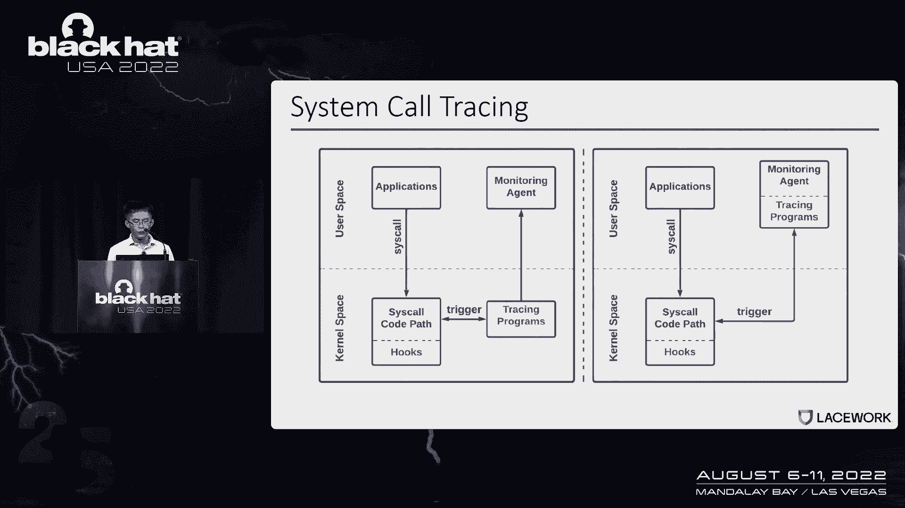
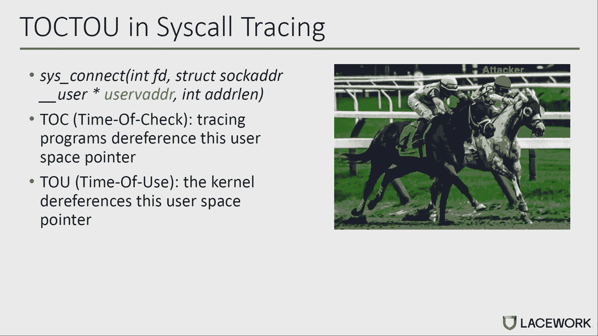
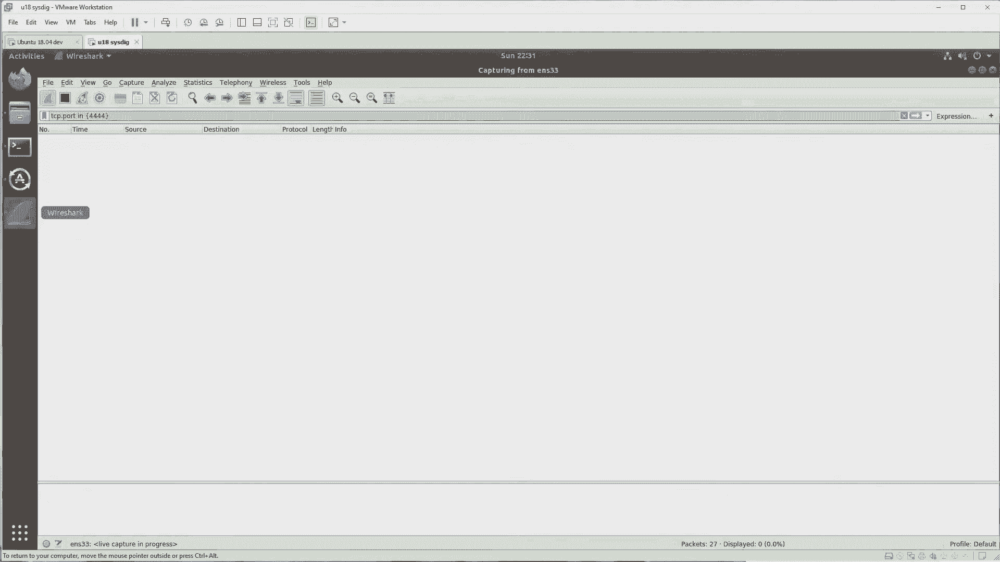
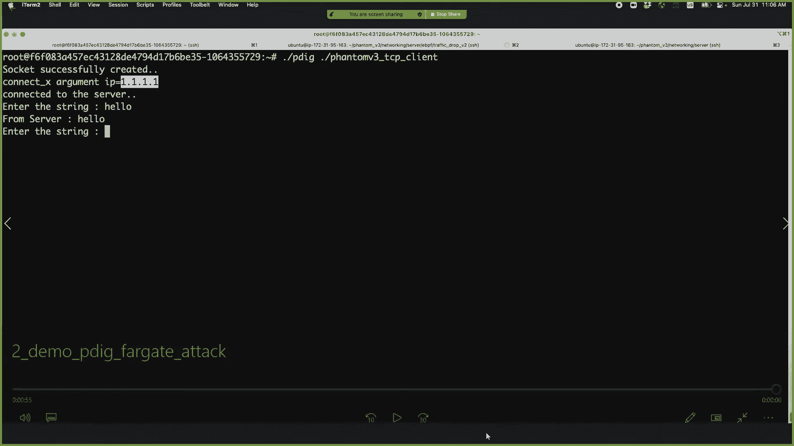
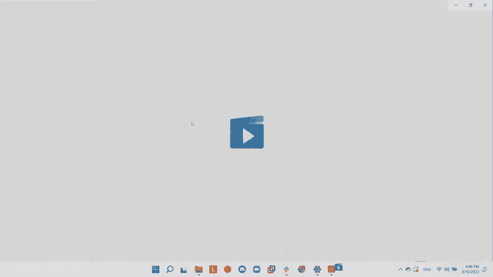
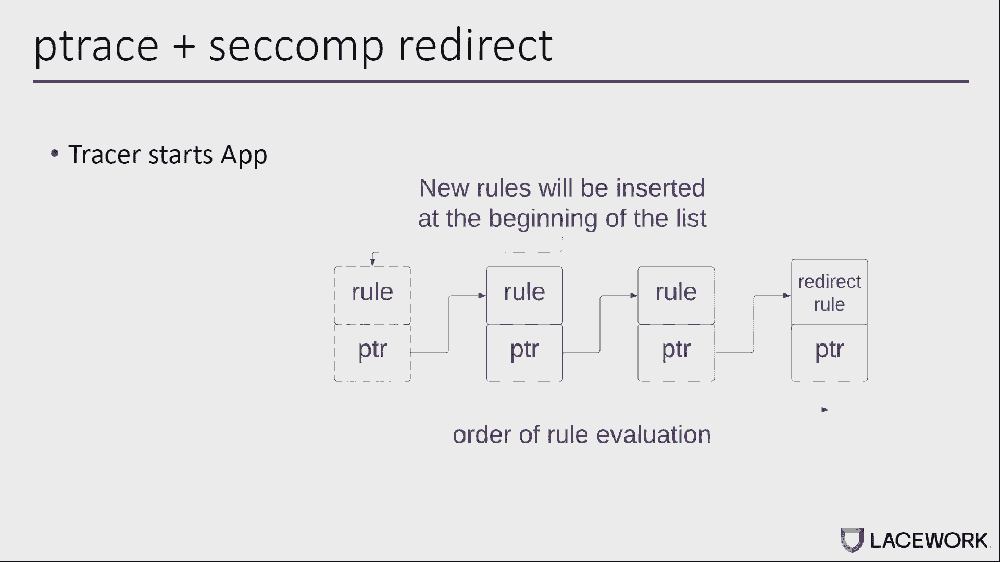
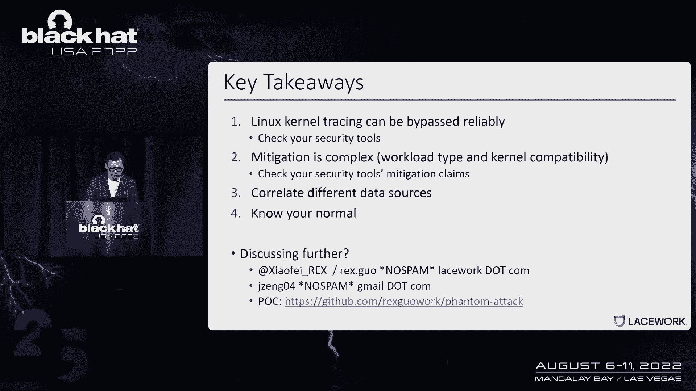

# 【转载】Black Hat USA 2022 会议视频 - P25：026 - Trace Me if You Can： Bypassing Linux Syscall Tracing - 坤坤武特 - BV1WK41167dt

好的，每个人，谢谢。感谢大家来参加这次演讲，我叫雷克斯，这是我的联合发言人朱利安，所以你可以在网上读到我们，我们今天有很多事情要做，所以我们就直接跳进去，所以想象一个老练的攻击者。

妥协您的Linux生产环境，他启动了一个shell漏洞日志，然后执行一个反向外壳返回到他的机器，然后他发现这台机器上运行着一个易受攻击的pseudo版本，然后尝试读取Etsy阴影文件。

看看有没有什么有趣的东西可以破解，然后他还发现他可以通过读取SSH来移动到另一台机器上，处理环境变量，于是他高兴地搬到第二台机器上，当他庆祝的时候，他发现他的资产不见了，所以他又解雇了RC。

这次没有运气，很快他发现他的资产被锁了，所以现在让我们看看故事的另一面，当一切都发生时，而这些软件监视器，处理信息，机器上发生的所有系统调用，所以说，比如说，当执行反向shell时，会有连接和呼叫。

可能还有其他的取决于技术，当攻击者试图读取Etsy影子文件时，将有一个打开或打开的应用程序系统调用，现在的问题是，如何使用这种可见性来实际执行威胁检测，所以我们想用一个非常简单的检测规则来说明这个想法。

所以这条规则是说，嗯，我想检测正在读取影子文件的不可信程序，我来解释一下规则，规则是说，如果系统调用在，它有重新许可，文件名参数指向影子文件，而且该程序不在允许的程序列表中，我们就会发出警报。

所以您可以看到，您可以快速地构建非常复杂的规则，甚至可以使用多个系统调用，但所有这些逻辑都依赖于这样一个事实，即系统，被称为软件的软件能够正确地提取数据，所以在这次谈话中。

我们将深入研究被称为跟踪的系统是如何工作的，然后呢，我们将讨论被称为跟踪软件的系统中的漏洞，一旦我们了解了漏洞，我们将讨论如何实际利用这些漏洞，然后我们将以减轻和外卖来结束，是啊，是啊，谢谢休息。

正如在思科中提到的，跟踪对文本RE非常重要，因此，这张图为您提供了思科跟踪的概述，一个是对拦截的希望，还有追踪程序，因此当应用程序发出系统时，调用内核，执行系统或co pass。

如果CO通行证中有任何地方，附加追踪程序将被触发以收集季节信息，并将这些数据发送到监视器代理以检测红色，训练程序可以在内核空间中实现，如左图所示。

或作为监视器代理的一部分作为用户空间程序实现，如右图所示，所以用来收集像简单参数这样的数据的程序被称为跟踪程序，这个程序可以附加到不同的钩子上，比如跟踪点，K专业，或p迹。

您可以直接使用Linux本机机制作为培训程序，或者您可以实现自己的培训程序作为内核模块，EDF专业版，或用户空间程序，第一种用于物理拦截的骗局被称为跟踪点，它是用于Cisco拦截的内核中的静态钩子。

线性内核为该点提供六个输入和六个出口，如果我们把追踪程序连接到三叉戟上，跟踪输入和跟踪退出的函数调用，您使用相同的参数，触发器，追捕程序，第一个参数称为Rex，哪些相同的论点，第二个参数是id。

也就是系统号，tripoint不提供开销，但它只提供静态的愤世嫉俗的拦截，您也可以使用动态钩像帽使用电缆，您可以根据思科公司通行证中的几乎任何指示注册培训计划，当指令执行时，追踪程序会触发。

K是动态方法，但与你的树点相比，有点慢，而且，您需要确切地知道数据是如何存储在内存和寄存器中的，为了获得有用的信息，喜欢争论，p树为思科跟踪提供了一个用户空间解决方案。

类似于跟踪点的是Cisco进入和退出的稳定钩子，使用p迹，您不需要实现任何内核程序，作为一个培训程序，但只需要用户空间程序，与前两种方法相比，优化时性能的p跟踪开销更高。

您可以结合第二个Cisco筛选以获得更好的性能，但是如果我们使用汇编代码来发出调用，这种方法很容易被绕过，你们中的许多人可能听说过云工作负载保护产品，该产品通常提供高级威胁检测，基于这个是什么追踪。

有不同种类的云工作负载，像虚拟机容器，关于客户主要虚拟机，服务集装箱，其他服务容器也是如此，它通常由云提供商分配和维护一个需求，因此您通常无法访问主机，下表总结了如何将跟踪技术应用于不同的工作负载。

在云端，用于虚拟机，我们可以完全访问主机，所以我们可以使用任何类型的绿巨人追逐程序，对于旅游，您可以使用PF内核模块和教师Pedic，我们以后再谈这次旅行的集装箱或客户专业，vm。

因此您可以拥有与虚拟机相同的选项，只要我们有足够的能力来使用你提到的这些容器，你没有三个D主机，所以我们只能用p迹作为钩点，并在用户空间实施培训计划，而不是用法罗，EDF和内核模块。

Falco使用了类似的技术来跟踪系统核心，它是CNCF中的开源项目，在内核空间中得到了广泛的应用，在用户空间中使用跟踪点支持内核模块和EVF Pro，PC是在P Trace学院的基础上开发的。

P dig被委托用于无服务器工作负载的系统跟踪，所以我们没有入侵其他安全监视器特工。

但我们相信隼的流行代表了一个被社区广泛接受的邀请，不幸的是，这种模仿为整个问题所困扰，这是我们使用的检查时间，让我们接Kinect系统电话，比如说。

kinesis调用的第二个参数是一个名为user的用户指针，指向用户空间中套接字地址的地址，在我们检查追踪程序的时候，确实引用了这个用户空间指针来获取您的soaddress，及使用期间。

内核确实引用了相同的用户空间指针来再次获取套接字地址，然而，在时间或检查与时间之间，我们使用用户指向的来自用户空间的内存，地址指针容易被此用户空间攻击者更改，所以在这种情况下。

插座的边缘可以在不同的时间之间不同，检查和时间使用，引起总的问题。

所以让我们进入下一个系统调用，它可以帮助您理解物理跟踪的总体问题，当应用程序发出轴或内核中，所以思科处理程序会检查，如果附加到静态钩子的任何跟踪程序称为Enter，像T追踪情景喜剧和追踪点。

如果这是真的，跟踪程序就会被触发，之后呢，Cisco处理程序将查找表，并跳转到connect调用以在套接字上创建连接，在返回我们的用户空间之前，处理程序将再次检查是否有跟踪程序连接到支架上。

因为被称为出口，像p迹，6 x到点，以此类推，如果这是真的，训练计划就会被抓住，所以正如我前面提到的，kinesis和call的第二个参数是用户，指向用户空间中套接字地址的指针。

此指针通过连接器和调用传递，并分配给不同的内核变量，用红色突出显示，称为将地址移动到内核的内核，将套接字地址从用户空间复制到内核缓冲区，然后呢。

内核将调用内部函数Six Connect文件在套接字上创建连接，基于内核缓冲区，这是Linux内核使用系统核心参数的时候，在内存复制功能之前，未创建内核缓冲区，所以说，称为回车。

或到内存复制功能之前的任何地方，用K，跟踪程序需要取消对用户指针的引用，或读取用户空间内存目录以获取套接字地址，正如我前面提到的，用户膜容易被攻击者从用户空间更改，在内存复制功能之后。

因此内核缓冲区是用套接字地址的一个副本创建的，不幸的是，总问题可能仍然存在，想想，如果我们将跟踪程序附加到称为exit的静态钩子上，像六个x点或p迹，跟踪程序可能仍然会引用用户指针来获取套接字地址。

再次，用户内存容易受到来自用户空间的攻击者的攻击，faro pd对所谓的进入和退出使用p跟踪，但只使用，只用了六把斧头，所以希望你对这次追踪的总体问题有所了解，在下一个源代码级别中，我交给雷克斯。

谈谈能力，虽然我们使用的例子是在内核五点七，但自从P树和跟踪点被引入以来，这个谈话问题就真的存在了，我们实际上与内核开发人员确认了这是预期的行为，因为这些特性最初是为性能和调试而设计的，和缓解方面。

他们推荐的是，你知道的，为了这种安全目的，软件需要实际监视内核内存，但听起来很简单，很快就会变成，当你实际实现它时非常复杂，当我们谈论缓解时，我们会谈论这一点，所以基本上我们向Falco报告了这个问题。

他们软件中的主要内容是他们必须通过对话来发出辅助退出，因为他们用了这个出口的树点p dig也用了这个出口的p迹，所以这将影响比零点更老的Falco版本，三一一，如果你用的是商业版本。

您可能想检查受影响的版本，我们在12月报道这一期，三月份有所缓解，部署的缓解措施是，他们会比较树点，他们会比较中心和CX的数据，如果有什么变化，那个电位将表明P dig的篡改企图。

他们还为P树作为中心部署了相同的缓解措施，也是P树作为出口，现在就，什么样的系统调用实际上受到影响，因此，我们分析了开放源码秋季规则中的重要系统调用，他们中的大多数人都受到了影响，此表中有两个例外。

一个是精确的系统调用，原因是当隼树正好，它们实际上进入并读取内核数据，所以他们没有完全依靠三分的结果，第二个是发送到和发送消息系统调用，所以后来，我们将讨论如何使用阻塞条件，利用顶部发出。

但是在发送到和发送消息中，我们没有找到影响阻塞状况的可靠方法，但也要记住，这两个系统的成本通常很高，这限制了它们的采用，好的，所以我认为漏洞，希望每个人都能意识到现在的弱点是什么。

让我们讨论如何实际利用漏洞，我们也不想获得任何额外的能力，在旁路，我们需要有一定程度的控制，我们希望开发是百分之百可靠的因为在这个游戏中，如果攻击者被检测到一次，那么整个行动就有潜在的风险，好的。

所以这给我们带来了两种开发策略，我们首先谈谈出口战略，这是我们在去年的迪恩做的研究，从那里你可以看到，跨核中断，但是为了利用这个延迟正确地管理旁路，一切都必须精确同步，我们必须注入精确的时间。

然后我们必须同步所有的数据操作，所以我们需要使用一个叫做F的user的系统，使用此系统调用有一些限制，第一个是如果你使用的是Docker容器并且你启用了默认的情景喜剧配置文件。

那么第二个配置文件实际上将阻止系统调用，所以这在容器里不起作用，另一个限制是，大多数云工作负载都不是，不使用用户五，所以这个系统调用的使用表明有异常，这实际上是Falco去年部署的缓解措施，因此。

他们检测用户对系统的使用情况，好的，所以去年我们回去了，我们想你知道，我们怎么，我们如何克服这个限制，现在为了做到这一点，基本上意味着当我们注射时，我们不能精确地同步。

但如果我们能注入一个非常非常长的延迟呢，那么我们就完全不需要担心同步了，这个主意听起来很简单。但问题是我们如何真正做到这一点，所以我们实际上找到了两种方法来实现这一点。

实现这一点的第一种方法是使用阻塞条件，现在我将更多地讨论阻塞条件，第二种方法是使用第二个COM来延迟系统，称为执行，那么我们所说的现在获得块的系统是什么意思，如果你想想基本的机制系统调用。

它本质上是内核代表用户空间程序与一些资源交互，现在这些资源中有很多是我，o，设备，在内核将结果返回给用户空间之前，它们需要时间来响应，所以更具体一点，让我们看看联系并打电话，所以在这个图中有两台机器。

有一台客户机，有一台服务器，在客户端机器上，假设有一个应用程序，应用程序触发连接器并调用，正常情况下发生的是，然后您的第一个调用将击中返回路径，跟踪点p将读取参数，然后这叫做井出口。

所以现在你可能想知道，这只是计算机网络1-0-1，这里会出什么问题，现在想象下面的场景，他们会试着连接到他们的命令和控制服务器，这意味着他们也控制着服务器，所以想象一下这个场景。

我们有客户端和服务器现在在客户端，攻击者首先创建系统调用，读取系统成本威胁，会产生覆盖威胁，然后系统调用行将在调用系统调用时调用名为connect的系统，当这种情况发生时，然后客户端将重试。

但是每次客户端重试这个，嗯，延迟量由TCP拥塞算法控制，所以大概是，你知道的，现在考虑一个或多或少的指数延迟，有那么多的延迟，覆盖威胁有足够的时间覆盖用户空间内存，具有良性IP地址。

然后当它有足够的时间传播所有的内存副本时，跟踪点和p树将愉快地读取良性IP地址，所以我们将向您展示一个场景的演示。

好的，所以在这个演示中，有两台机器，就像我们在图表中说明的那样，所以现在你看到的是一台服务器机器，现在你可以看到服务器机器有一个以176结尾的IP地址，好的，然后在服务器上启动这个程序。

然后我们也启动一个监听服务器，在服务器端。

在客户端，我们要跑法尔科。

我们还使用钢丝鲨鱼来查看钢丝上实际运行的是什么，现在我们运行这个攻击程序它将试图连接到服务器，所以你看到它现在连接在一起了，它试图发送一些假的TRA，好的，所以客户得到了消息，对不起，我收到消息了。

但现在如果你看看Falcco报告的A结果，你可以看到它实际上说我们的客户正在与IP地址1通话，一个一个表明搭桥成功。

但现在如果你看看电线上实际发生的事情，然后它说你知道我们实际上在和IP地址说话，以176结束。

所以之前的演示是为EDF准备的，和猎鹰的内核模块版本，它使用跟踪点，现在我们将向你们展示如何为p做同样的旁路，在AWS上挖掘，法尔盖特，好的，所以你在这里看到的又是，服务器机器，IP地址以163结尾。

我们将启动TCP监听服务器，现在这不是一个火游戏机，所以P dig会启动我们的攻击者程序，所以这是同一个程序试图连接到服务器，你可以看到p dig报告的IP地址又是1one，不是一个不是一个。

这表明搭桥成功。

好的，现在你可能想知道，好的，这是用于连接系统调用，它实际上是否也适用于其他系统调用，所以我们实际上发现整个文件系统调用类也受到影响，其他一些依赖文件系统的系统调用也会受到影响，比如说。

确切的v和确切的原因是当你首先执行二进制文件时，因此他们也是下一个受到影响的人，我们将讨论如何利用文件系统调用，所以在我谈论如何绕过开放访问之前，都是跟踪，我来介绍一下菲尔兹。

所以很少有人通过系统框架来代表用户空间，用户库，也有明显的效用，所以在云场景中，字段经常用作远程存储字段，所以使用这样的字段，可以将远程对象挂载为本地文件系统，并将远程文件作为本地文件访问。

因为它是用户空间VSO，它提供更快的参与或发展，你通常不会告诉内核，下面是远程存储字段的示例列表，所以你可以看到它很受欢迎，从列表中广泛使用，你可以看到主要的云提供商都有自己的字段。

这是远程存储字段的通用体系结构，因此，如果用户空间应用程序或容器希望打开远程文件，它所做的与打开本地文件相同，基本上，它会向内核发出一个开放或开放的SSM调用，当请求到达VFS层时。

它将围绕使用内核驱动程序，然后使用像GCS这样的Spfire系统恶魔，使用恶魔将请求发送到远程存储，一旦响应从服务器返回，的，它将被允许通过原始路径返回到用户空间应用程序，我需要提到的一件事是。

客户端和服务器之间的延迟比物理延迟本身长得多，基本上我们可以利用这个长延迟来绕过随叫随到的开放访问，所以让我展示一下它是如何工作的，所以我们有被跟踪程序监控的恶意哭声。

物理线程正试图打开一个名为恶意文件的远程文件，基本上，它会向内核发出一个开放调用，过去的名称指向用户空间中的恶意文件名，因为文件是远程存储的，因此打开的请求将从内核到用户空间，然后到远程存储。

在响应响应之前，重写权可以跳入并尝试重写使用，从恶意文件名命名为九的过去指向的内存，五个名字再来，因为延迟太久了，CPU有足够的时间传播，对CP的所有副本的更改，呃，寄存器和存储器。

在响应返回后和返回用户空间之前，这个跟踪程序可以利用exit来读取cisco参数，比如说，过去的名字，不幸的是，过去的名称已从恶意文件更改为bin文件，这意味着我们的搭桥会成功，现在。

让我给你看一个演示。

左边是谷歌云存储桶的控制台，我们在GKE集群中部署了Farchole，我们登录到其中一个部分，然后我们检查了容器内的过程，所以我们有滑稽的特工跑进来，哪个将谷歌云存储桶作为本地文件夹。

然后T然后我们检查锁是否有法罗，所以我们生成了一个事件，因为我们只需登录PO，所以现在文件夹是空的，这意味着远程存储是空的，然后试图打开文件夹中名为恶意文件的文件，然后你检查末端，呃，本地文件夹。

因此文件是在远程存储中创建的，然后我们从Falco那里得到了一把锁，所以我们生成了一个事件，因为如果您试图打开恶意文件和实体文件夹，让我移除这恶意的火，所以它会把它从远程存储中移除，然后我们进行攻击。

你检查文件夹，因此恶意文件是由攻击代码创建的，呃，对于远程存储桶，我们检查效果锁，因此没有生成新事件，这意味着我们的下一个攻击座位，我会转到休息谈谈，呃，更多，并得出。

好的，所以现在我们要谈谈如何绕过系统，输入跟踪，所以如果你还记得前面的图表，当系统调用执行时，它击中了P树，然后击中了第二个COM，你知道的，和一堆其他的东西最终会被系统调用。

实际上将取消用户空间内存的引用，所以现在的问题是，我们能用情景喜剧来推迟执行吗，因此绕过P树作为中心，在我深入细节之前，只是一个关于薪酬的快速回顾，因此，它是一种内核级机制，允许开发人员指定，嗯。

你知道吗，允许或阻止系统调用，你甚至可以允许和阻止，基于称为参数的系统，您可以在此机制之上构建一个沙箱，这些规则很快就会变得非常复杂，需要更多的时间来计算，最后一个警告，我想强调一下。

情景喜剧中的第一个插入规则实际上是评估的，最后一个假设你会明白为什么这很重要，好的，所以旁路的想法非常，非常简单，如果你了解之前的攻击，在这张图中所有东西都在同一台机器上运行。

有一个系统调用线程将首先插入，一堆第二规则，就像常规应用一样，然后它将创建重写线程，然后它将调用名为Create的系统，然后，当您调用时，系统调用将传入一个指向用户空间的参数。

现在Petrus高兴地读了良性文件的论点，然后第二个检查开始了，你知道的，同时，重写线程将用恶意文件重写系统car参数，所以最后在这之后，我不能完成所有的计算，那么内核实际上将引用参数。

然后它会为我们创建一个恶意文件，所以我想提到的一个有趣的警告是，我们说的是平面模式下的桃子，现在你也可以使用P树加上情景喜剧重定向。

这意味着你可以使用p树来在监视器程序中设置一个规则，当你击中第二条规则时，规则会说现在将执行重定向回树，在这种情况下，如果树是启动应用程序，这意味着树是，假设应用程序运行第一个人并调用树。

或者会说让我插入第二条规则，这将是插入的第一条规则，所以如果是这样的话，那么以后，无论应用程序插入多少规则，不会影响对窗口的对话，因此，这将不是脆弱的，但如果树附加到正在运行的应用程序。

情况就不是这样了，因为无法控制应用程序是否已经插入计算机，好的，所以嗯，我们报道了不同类型的攻击，系统调用的不同部分，我们只是想快速总结一下，所以我们说彼得鲁斯是中心，为了缓解这一问题。

我们需要在加COM重定向上使用P，并确保它实际上正在启动应用程序，如果，如果应用程序已经启动，然后您可能想检查第二台计算机以查看，如果第二台电脑有什么异常，树点为中心，尽管谈话问题存在。

但我们没有找到任何可靠的方法来利用它，所以你可以利用，但现在追踪点作为这个出口是一个概率，它很容易受到我们在这里讨论的阻塞条件攻击，还有我们在def con 29中所做的，所以为了减轻这一点。

你知道这样做的一个方法是比较称为Enter的系统，还有一个叫做退出参数的系统，为了确保一切都没有改变，它很容易受到同样的攻击，为了减轻此跟踪跟踪位置，一个是我们需要在中心部署P树的所有缓解措施。

然后比较输入，这是退出参数，以确保您所知道的任何内容都没有改变，上一个我们没怎么谈的，在这次演讲中，是与内核内部函数挂钩的K探针，这是否真的可以被利用取决于哪个函数被钩住了，所以总的来说。

我们称之为监控的系统，我们看到的是取决于您想要支持的内核版本的数量，您可以选择RM Linux安全模块接口，因此，这将支付一定数量的系统成本，但是不同内核版本的支持是不同的，在一些较新的内核上。

您甚至可以使用BPF RN，但是如果您必须支持广泛的内核，和某个版本中的RM，没有您想要的系统调用接口，那么您可能需要查看其他接口，然后您很快就开始检查不同的内核版本，并确保所有这些接口都存在于内核中。

好的，所以嗯，结束，所以首先，让我们放大这项研究，也就是说，我们证明了Linux内核跟踪可以可靠地绕过，以许多不同的方式，在不同的中心和sx，所以如果您碰巧部署了类似的工具。

您可能需要检查您的工具是否确实安全，以抵御这种类型的攻击，因为我们只评估了开源解决方案，第二件事是缓解是非常复杂的，取决于该工具支持多少内核版本，因此，您还希望通过该工具跟踪缓解声明。

以确保以你现在想要的方式减轻，如果我你知道如果我们缩小从这个特殊的问题，如果我们从更大的角度考虑今天我们提出了一些基本的旁路，这并不意味着在未来，不会有新的绕过这种类型的追踪技术。

所以我想对于安全小组来说，嗯，我们建议您对环境有全面的可见性，因为如果我需要绕过所有不同的数据源，成倍地增加了我的搭桥难度，最后一个，但并非最不重要的，这是我们经常做的事情，至少工作，也就是。

思考环境中什么是正常的，我们对环境进行基线测量，因为如果你知道你的环境中有什么，那么即使攻击者能够更改这些值，他们必须选择正确的值来选择，否则，它们会触发某种类型的检测。

