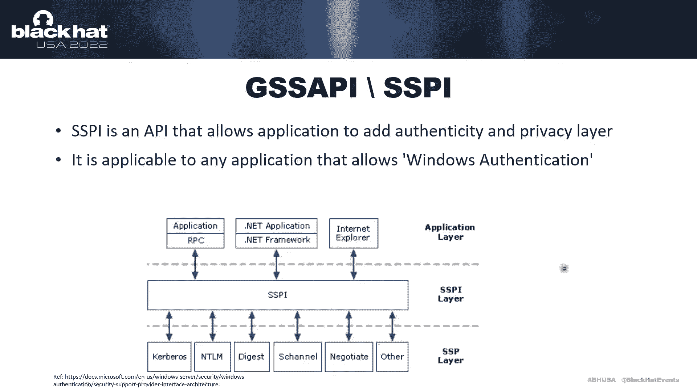
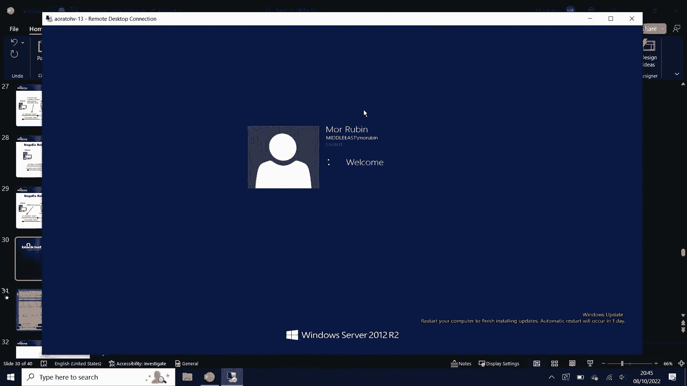
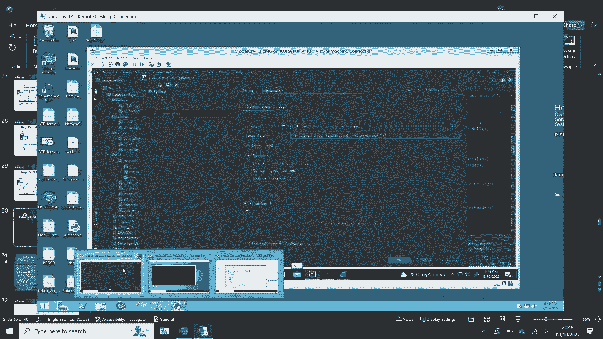
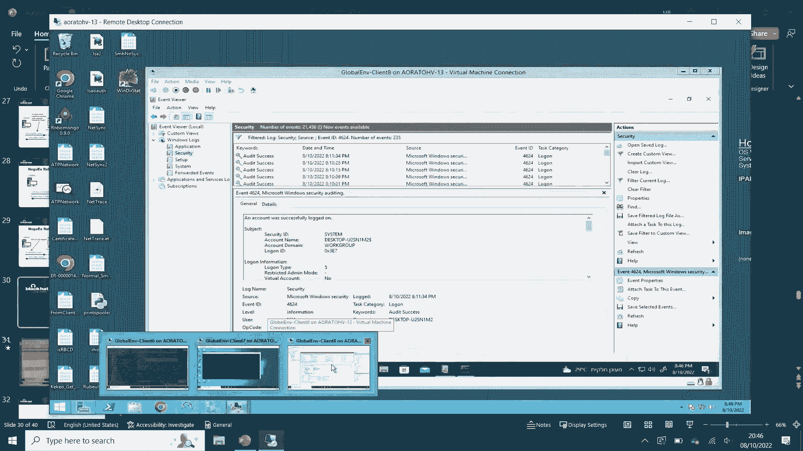
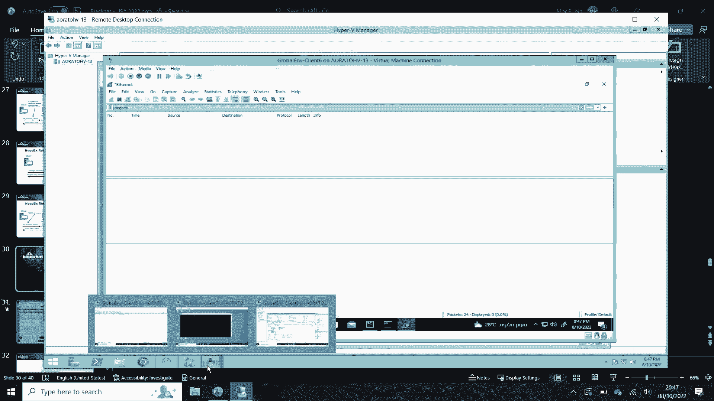
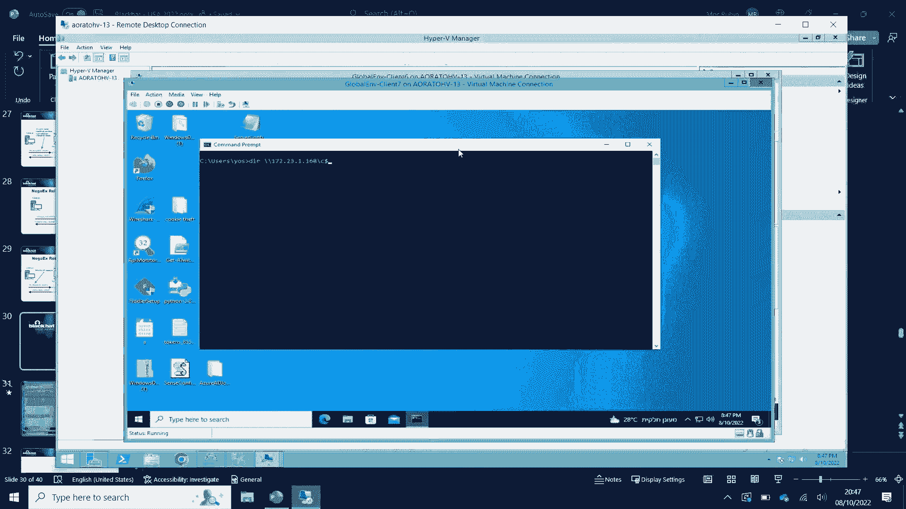
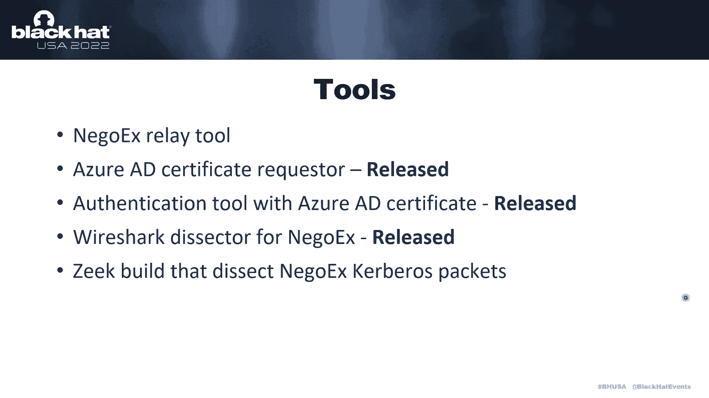

# P26：027 - AAD Joined Machines - The New Lateral Movement - 坤坤武特 - BV1WK41167dt

 [MUSIC]。

 >> Thank you。 >> Thank you。 Welcome to my session。 As I mentioned。

 my name is Maubin and I am a senior security researcher at， Microsoft。

 I mostly insist that in finding new attack vectors in。

 the on-prem cloud and which are mostly related to networking。

 And in this session we're going to show a new way to perform lateral。

 movement which involves a bit of on-prem， a bit of cloud and mostly， networking。

 So our agenda for today， we will first go over the introduction to the key， terms。

 We'll go over some things that you might already know just to make sure， we're on on the same page。

 Later on this information will help us understand a bit more about the main。

 topic for today which is NEGOX which is the new authentication protocol， for Azure AD joint devices。

 Later on we will see a couple of attacks that allow us to perform lateral。

 movement to another devices。 Then we will demo one of the attacks and see how we can hunt for them and。

 finish with takeaways from this session。 So let's start with the technical background。

 Our first topic will be Azure AD joint device。 As you may already know。

 Azure AD joint device is a device which is， connected directly to Azure AD and it's managed by Azure AD。

 In the case of Azure AD joint device， only Azure AD accounts can log。

 into this device and there are no local users by default。

 You can obviously add them but by default it does not exist on the。

 computer so only Azure AD accounts can log in。 The main two differences between the on-prem Azure AD。

 directory joint and to Azure AD joint。 First， how you query your organization。

 In Active Directory you mostly use LDAP to query the domain controller to get。

 information about entities and groups and so on in the Active Directory。

 While in Azure AD directory you mostly use graph API or state。

 calls to query Azure for information about your organization。

 The second main difference is the authentication protocols。

 While in Active Directory the authentication protocols are known， anti-alignment care boards。

 in Azure Active Directory the authentication， protocols are somehow over open AD and networks which will be a main topic for。

 today。 Aside note， I'm not going to talk about hybrid devices。

 I will connect to both Azure AD and to the on-prem。

 Everything I'm going to show is applicable to hybrid devices too but。

 since it's the same and you already know how to perform lateral movement in a。

 domain environment then I will not talk directly about hybrid but only to， Azure AD joint devices。

 So when talking about Azure AD joint device it's important to understand the。

 authenticated connections。 We have two main scenarios。

 the first scenario is when we want to authenticate， to SAS application。

 in this case we will use something called a PRT。 So for example when we want to authenticate to SharePoint Online we will。

 use the PRT to exchange for an access token and get access to the specific。

 application and the second scenario is where we are sitting on an Azure AD joint。

 device and we want to authenticate to another Azure AD joint device。

 In this case we will use something new which called P2P certificate or， P2P certificate。

 This certificate is issued by using the PRT and we will show a bit later how we， can get this one。

 So first let's understand what PRT is。 PRT as I mentioned is a primary refresh token and this is a JSON Web。

 token which contains claim on both the device and the user it was issued for。

 It means that if a user is connected to two devices then every device for。

 the same session of the user every device will have a different PRT and， same for devices。

 If two users are connected to the same device， same will be here and。

 we will have two different PRTs even though it's the same device。

 And this PRT can be compared to TGT， the Karyontik ticket in the on-prem。

 If you have the PRT and the session key bound to the specific PRT it means that。

 you are authenticated and this session key which is bound to the PRT。

 proves that you have the authentication material and you don't need to， authenticate again。

 So it's the same as TGT in way that TGT is being used to exchange for。

 ticket for the results in TGS。 And the PRT's can be exchanged for an access token to access the specific。

 application or in our case it will be used to get a P2P certificate which will be。

 used to access another Azure AD joint device。 So I already mentioned a couple of times。

 So a P2P Azure AD certificate is a special certificate which is issued by， Azure。

 As you can see the issuer is Azure AD， it's MS organization P2P access so it。

 means that it's only Azure AD， the one who can issue those certificates and it's。

 issued for a specific user and the user is the one who the PRT is related to so I。

 cannot use PRT to get a certificate for another user but only to the user which is。

 bound to the specific PRT。 And this PRT is valid for one hour only and is used to access any Azure AD device in。

 case only if you have permission obviously。 And once your device is joined to Azure AD by default it will be configured to request。

 a new certificate every time it's needed。 So you don't really have to do anything every time you want to access another Azure AD device。

 and your P2P certificate will be issued for you。 So now that we have a good understanding of the authentication materials let's dive into。

 the authentication protocols that will help us and be used later in NANGRX protocol。

 So our first protocol is Kerber or speaking。 So a couple of words about Kerber or as you may already know Kerber or is an authentication。

 protocol in the on-prem which uses tickets for authentication and it have six steps。

 The first step is the AS request and this step the client is send something called a。

 PRT data which is a timestamp lobby encrypted by a hushed password of the user。

 This data is later checked by the DC by the KDC with the key distribution center which。

 verifies the timestamp blog it decrypts it using the hash password which stores in this。

 database and if it's accurate then the KDC will provide a TGT， the KEDI-19 ticket and。

 the session key。 And later on those TGT and session key will be used in the TGS request together with。

 the resource you want to access to and the KDC will validate them again and will issue。

 a TGS which is a ticket granting service with a new session key which allows you to now。

 access the specific resource that you wanted to access using a Kerber or AP request and。

 later on the resource you access to will response with the Kerber or AP response with an arrow。

 or successful authentication and in Kerber or speaking the main difference is in the two。

 first messages in the Kerber or AP request and the AP response。

 This extension allows you to use certificates to authenticate to another to your domain instead。

 of using the hash password so in this case the pre-authentication data in the AP request。

 will be changed in a way that instead of using your hash password to encrypt the timestamp。

 instead you will use your certificate your private key to sign a specific blog which。

 called the PKO authenticator and you will send it to the DC。

 The DC will validate the certificate authority and everything about the certificate including。

 that it's still valid and will try to verify the sign data if it's verified using the public。

 key then the KDC will now return a ticket and the new NSS session key and now the session。

 key different from the normal cables can be all session key generated by the KDC and encrypted。

 using the public key or it could be derived by the defellment parameters which were sent。

 by the in the request and I'll send back in the response to so we have two options for。

 the session key and this is the main difference between cables and cable speaking and the next。

 authentication protocol is PKU to you which is public key user to user and this protocol。

 allows us to use cables messages for a authentication without the KDC so it means that we can now。

 access a perform a build-to-build authentication without the KDC so instead of going to the。

 KDC and requesting tickets every time we want to authenticate or to access a specific resource。

 we will now go directly to the resource itself and ask for a ticket from him so it's put out。

 the KDC from the question and let you go walk directly against the old resource and walk。

 with cable tickets without doing any change and in this case it will instead of using the。

 hash password you will be able to use cable speaking a pk in it which allows you to use the certificate。

 and our last authentication protocol it's already familiar just as API or SSBI which is a security。

 support provider interface which allows you to add an authenticity layer for your protocols so for。

 example over our PC or SMB you will be able to add cable also and telem authentication and it will。

 allow you to perform this authentication on top of your protocol so how it all mixed out together in。

 NEGOX so NEGOX as I mentioned is the authentication protocol on for authenticating to Azure ID join。

 devices and so and it works with the GSS API and cables and pk you to your messages so how it works。

 in that when you want to authenticate over SMB for example you will use GSS API to provide an。

 interface for NEGOX and over NEGOX you will send pk you to your messages to authenticate to the client。

 so NEGOX is an authentication protocol as I mentioned in which is enabled by default on every。

 Azure ID join device from I think a very previous vision of Windows 10 and by default on every Windows。

 11 and once your one your one-seal machine is on boarded to is joined to Azure ID then only two。

 protocols are provided for authentication and the NTLM and NEGOX as I mentioned before NTLM will。

 not work since you by default will not have local accounts so only NEGOX left to perform any。

 authentication to another Azure ID join device and this protocol have three main stages the first。

 stage is the initiating messages later on the next stage is the authentication messages and the last。

 step is the verification messages let's dive quickly over the messages CIO the walk and how。

 this protocol work so the first message is sent from the client to the server and this message。

 called initiate or NEGO in case of NEGOX the terms have been changed a bit and client is now。

 called the initiator or but I will call it as client because it's easier for us and the server。

 is called acceptor it's the same it's just a change in the world so the initiator NEGO have。

 only one purpose and it's to contain random this random will identify this specific session and it。

 will be used later for checksum in the verify in the verification part which is the last part of。

 the authentication NEGOX the second message which is also sent from the client to the server is the。

 initiator metadata which contains metadata on the authentication materials that are going to be used。

 so in this case you can see that in the next time we have token sign in public key it means that。

 we are going to use a certificate and ms organization p2p access this is the certificate authority which。

 we are going to be used and this is a joy dp to be certificate this is the certificate that is。

 being used in NEGOX and then once the server receives those two messages it will response with the。

 same two messages but now that will be called acceptor NEGO and acceptor metadata they will be the same。

 messages the acceptor NEGO will contain a different random from the initiator one and the acceptor。

 metadata will contain the same metadata information which is generated from jss quell metadata and this。

 is the initiating part of NEGOX protocol it doesn't really do anything you can just send anything you。

 want as long as it's valid and the second part is the authentication part this part the first message。

 which is being sent from the client to the server is the ap request it's not a cable or say it's a。

 request ap request but NEGOX ap request it's a new a message type and this message type contains。

 the change data which contains inside of it a pku to u part and pku to u part in the first ap request。

 in this first message will contain cable was became it a request and this request as i mentioned before。

 will be cable was became it with the certificate of the client of the azure dp to p certificate。

 and in this case the session key will be generated by defellman parameters so it's important to us to。

 know later on because we will use it in one of that text the fact that we cannot have the session key。

 and the next message is being sent back from the server to the client after the ap request was sent。

 and this is called the challenge message this message again contains a pku to u part but in this。

 case the pku to u part is pk in it a cable speaking it a s response and in this case you can see that。

 the server response with ticket and this ticket contains a realm which is which is well known pku to。

 you it's not the same as the domain but it's a default one for every every server and every。

 resource you will contact and again as i mentioned it will contain the defellman。

 defellman parameters which will be extracted by the client and will be used later to generate the。

 shared session key and once this message is being sent to the client the client forge another ap。

 request with the ticket with the ticket received from the server but in this case the ap request。

 it's the same name but the pku to u part is different it will now contain an ap request a normal cable。

 ap request with the message with the ticket and you will be performing the authentication in this part。

 and then the server will response with another challenge message which is now the pku to u part。

 of cables ap response again and in this step if everything works then the authentication in the。

 in this part is successful or fail but even if it's successful it doesn't mean that the。

 successful authentication of nagox is established but it only means that the the。

 this part is established so we have another part and the part is called verify it's the way。

 this is the last part of the authentication in nagox and this is the verify message。

 and the verify message contains check check sum over the previous set of messages in this case。

 you can see that the sequence number of this message is seven and since we started form zero。

 then it means that we're going to perform checksum here over the last seven messages the messages。

 or the initial nago initial to meta data except on nago except to meta data ap request challenge。

 and another ap request they are all will be checksum and the checksum will be provided in the verify。

 message and in this step this is a verify message which is sent from the client to the server and。

 the the server will verify the checksum and if it's if it's accurate then it will response another checksum。

 with another verify message which contains a checksum but in this case the checksum will be。

 different because it will perform a checksum over a different set of messages so not only those seven。

 and the checksum key is a bit special especially you cannot understand what how this checksum key。

 generated by using the documentation and in this step you need to what i did to find out what the。

 checksum key is to debug the else else while using nago exon performing an authentication。

 and then figure out that the checksum key is sent by the client or by the server depends on who is。

 sending the verify message and the checksum key is sent in the cables ap request or ap response。

 and is being used for the checksum so if you cannot open the cables messages you cannot get the checksum key。

 so this was the nago ex protocol and now that we have a good understanding of nago ex protocol。

 let's see what we can do with it to perform some attacks that will allow you as to perform lateral。

 movement to another azure with the joint device so first take its probably sound very similar。

 because it is very similar it's called nago ex and it's similar to obviously nt lm relay。

 and this attack relies on the fact that again the server and the client does not verify each other。

 so you can just say "I'm the server" or "I'm the client" if you enable and spoofed or anything else。

 and then since you can perform any relay that you want there really will be the same as in nt lm。

 where you will just relay the messages from one side to another but again it's not the same。

 protocol as nt lm so let's see how it works and what we can do differently or what we should do。

 differently so as I mentioned before the two the first part is the initiating messages so。

 those messages are just being sent i will not go over them because they have no real meaning。

 we don't really need them in this attack so we just relay them hases and continue and in this case。

 we are starting the authentication part and we have two two scenarios the first scenario is where。

 we receive the IP request from the client and we choose to relay it as is if you choose to relay。

 it as is as you can see in the cable was request body there is a special field called the address。

 which contains the client name and by default this field will be will contain the client name of the。

 machine initiated the and generated this IP request so if you'll choose to relay it as is it's okay。

 it will work we'll just relay to the server and the server will validate the IP request and。

 response with a challenge message the challenge message which which will be again related to the。

 client because we cannot open it because we don't have the session key since as I mentioned it generated。

 by the fieldman and we cannot generate or find the key so we'll just relay to the client and in the。

 second scenario we want to be a bit more sophisticated and we want to change the client name to avoid。

 some detections assuming that someone is detecting it and what we'll do is to change the client name。

 because if someone sees the original client name and the attacker IP it can easily understand that。

 this is not matching and we will be seen so in this case we can modify the IP request and。

 relay it as is add to the server and the same process will happen we will get the challenge and。

 relay it to the client and the next step is the IP request and verify message which are being sent。

 on the client to the server and in this case we don't need to modify the IP request in the first。

 scenario we did not modify anything so we again relay it as is the server verifies the verify message。

 and the IP request and if it's okay then the server will response with a challenge message。

 and a verify message and in this case if it's okay the session will be already established。

 between the attacker and the server and since we are attackers and we don't need those two messages。

 we can just drop them close the session with the client and we have an established connection。

 with the server and in the second case in the second scenario we chose to change the client name in。

 the previous message so now we will have the verify message which contains the checksum but now the。

 checksum will not be accurate since we changed one of the messages so in this case if we will send。

 it to the server we will get an invalid parameter error and negoex invalid parameter error so we will。

 not be able to use it and the session will be closed so in this case what we are going to use。

 to do is to force the client to authenticate to us again and if the client will authenticate to us。

 again again to the initiating messages will be sent to to the server and we will relay them as is。

 and then since we since the client already have a ticket for us and as you know in kerbos client。

 ticket stores on the client and if the client remember that you have a ticket for the server。

 then you will not request a new one so we will use that and since we initiate another。

 session and the client already have a ticket to the attacker then the client will directly use it。

 instead of asking a new ticket so in this case the client will go directly to the second set of。

 messages the ap request and verify in this case the ap request is the kerbos ap request in the pku。

 to your part and the verify message will contain a checksum which is made over those four messages。

 and this ap request and as you saw we did not make any modification so the verify message is now。

 occupied and the ap request is also occupied because it's generated by the ticket using the session。

 key which is known to the client so if you will relay them to the server then the server will validate。

 everything and we will establish a connection because all the messages are occupied so in this。

 case we managed to bypass the validation part of networks without knowing any session key or without。

 knowing any secret so let's demo this this one real quick let's hope it will work。

 so it takes a couple of seconds did you wifi， it's connected to a motion to his or takes time in the meantime i will just say if it will not。

 walk i will show a demo which i already prepared in advance but i will say that for now that i have。

 i'm going to show and i will have three machines one of them will be my attack machine。

 oh it works so here it is i have client six which is my attack machine which is going to one the。

 relay server client seven is hudgway the join device and it's going to be my victim machine and client eight。

 is going to be my target machine so it's means that client seven is going to authenticate to client six。

 and client six is the attack machine and it's going to authenticate to client eight。

 so from client six i will start my relay server and i will choose to modify the name as i just showed。

 i will just choose a random name， okay so choosing a very random name and i will start the server。

 and then i will also start a wall shark this is a special version of wires shark which i made a。

 modification to to pass the pku to your messages this is why i'm using a nego access filter right now。

 i think it will not work in a regular wall shark if you're tying it uh yourself and then instead of。

 spoofing i will directly authenticate to my attack machine from the victim machine。

 and let's take a look on the in server so as you can see we managed to dump some ashes and in this。

 case the hashes ashes will not give me anything because as i mentioned it's a device without local。

 accounts but it just proved that we have an authenticated connection and since we have in。

 sufficient privilege to the victim machine we managed to dump those ashes similar to until。

 i'm really and let's take a look really quick on the traffic。

 so if we will open the traffic and we will see the ap request which contains the cables became it。

 a request and we'll open everything and we will go directly to the care request body。

 and to the other spiel now we can see that this is client seven this is what we。

 have received from the original a client and then what we relayed is the new name that i just wrote。

 and if i will follow this a stream of packets we will see that i've relayed it as is without。

 modifying the verify message and i've received an error so what i did next is to force the client。

 to authenticate again to me as a tackle and this gave me as i showed you let's follow this。

 and now we can see that in the new session we have received the two initiating messages。

 we this is the only part of the relay i'm not trying a decline side but only to the server side。

 and we see that we just went directly into the ap request and the verify and then the session。

 is established and we managed to authenticate so we managed to very fast the validation part。

 and let's see how it looks on a the target device so we can see in the target device that we have a。

 windows four six to four of successful authentication and we have the account name with the domain of。

 azure ID and you can see the full upn of my account and if we will go to the authentication。

 package we can see that the it was being used in with nego extender and now we can see that the。

 walkstation name is what i just wrote and the ip is my tackle machine ip and not decline so we。

 managed to perform a successful authentication to the machine even though we made modification to。

 the cable or smesages which are being protected by the nego extender message so we still managed。

 to bypass them bypass the verification part so nice for us and let's go back to the next attack。

 okay so the next attack it's not really attack yet it's the preparation for the attack in this case。

 we will use the primary refresh token the prt to get a p2p azure ID certificate so how it will do it。

 we will first generate a csl which is a certificate sign-in request for the specific user。

 which the prt is bound to and then we will attach both the csl and the primary refresh token to a jwt。

 adjacent word token and we will assign this json word token with the session key bound to the specific。

 party once we have it once we assign it we can send this jwt to azure ID and then we will receive。

 the certificate in the x5c section and we've received an azure ID p2p certificate which is going to be。

 valid for the next one hour and since we have a valid p2p certificate what we will do we will just。

 simulate everything and pass this certificate to another machine and as long as we will have。

 permissions we will be able to simulate the smb messages and perform the networks authentication。

 and authenticate to another machine this will allow us to jump to another machine get certificates。

 we can dump those certificates from the local machine store because they are by default stored。

 in the machine store or we can dump the prt's or we can do anything else we can also add a log。

 an azure ID join devices and which will allow us to get constantly a prt and get new azure ID。

 certificates and it will allow us to move to another machines every time we want and harvest some more。

 and more prt's and certificates and move to another machine every time so now we saw a couple of attacks。

 that allow us to move laterally between devices let's see how we can hunt for those attacks our first。

 option is to use windows event we can use windows event 464 or 4625 to hunt for a successful or failed。

 authentication 464 successful authentication while 4625 is for failed authentication and as I。

 showed in the demo we'll have the azure ID account in the domain and the fully upn。

 and the authentication package is nenguextender it's important to know and then we will have the。

 workstation name and the ip as i mentioned and in this case i have attached a screenshot from。

 a real machine so in this case the attacker did not modify the name so if you see an。

 ever mapping between the workstation names and when ip's you can easily understand that this is a。

 malicious connection because the ip does not match to the name so it's easy to a hunt for suspicious。

 logins with or also you can find a weird authentication from another devices with users that are not。

 supposed to be connected to those devices the second option is to use the traffic analysis。

 and there are plenty of open-source traffic analysis or anything else and you can use them to pass the。

 pku to your part and if you pass the pku to your part you can extract the serial number and the。

 subject this will allow you to find cases where the same serial number have been used from two。

 devices and in the case of the real attack or in case of someone stealing the the p2p certificate。

 from the machine you will be able to see that this serial number was being used from two different。

 devices and not even in the same time it could be in frame of one hour because this is the time。

 the certificate is valid and it will help you find some more suspicious attempts and the mitigation。

 parts as you may know you cannot mitigate someone stealing your credentials and prt and azurey。

 the p2p certificates are the same as your a password so if someone steal your password。

 i cannot really do anything and you cannot really protect your device you can obviously patch the。

 device it will be other for tools like mimikatz to harvest the prt but there is no other way and。

 the second option to mitigate the nagwax say relay when it's done over asmb you can you can enable。

 the asmb signing this will force the attacker to use to sign the asmb messages and since the。

 attacker does not have the session key and it cannot get the session key because the first session。

 key is generated from the fileman then the attacker will not be able to sign the messages。

 and the relay will still work the attacker will still be able to authenticate to the device but。

 the attacker will not be able to do anything on the device itself so it will force him to close the。

 connection so the tools have been used are the nagwax relay which i just demo and second tool is the。

 azurey the certificate request tool which is the prt to certificate the third tool the left tool is。

 the pass the certificate authentication tool with azurey the certificate and for research i've used。

 wildshark i modified wildshark to add the sector for the pku to your part over nagwax and allow you to。

 find nagwax messages easier and then i also modified zik to pass gss api nagwax over gss api。

 to extract the pku to your messages the serial numbers and everything from the certificate itself。

 it's all available in gita benon so you can download it and use it to find and research on your own。

 and the last takwai is from this session as i mentioned since the some part is dealing your。

 certificates or anything else then patching is not really enough it will not protect you from everything。

 but it still may mandatory to use the s&b signing since this is the thing that will protect you。

 against the relay as i mentioned it's something new i didn't know i don't know if someone is using。

 it right now but it's a new way to perform lateral movement and since we all know that the main。

 lateral movement is being used for years then i assume that it will also be used we already know。

 that the attackers are joining new device to azurey d so since they are already joining new device it。

 means that they can get a p2b certificate so they are one step from authenticating to your device。

 and the last thing is hunting as i said it's it's a new tax office and so it's very important to。

 drag and search if they are successful authentication since they are no。

 and not enough research in this area so it's extremely important and that's it thank you。

 thank you， [Music]。