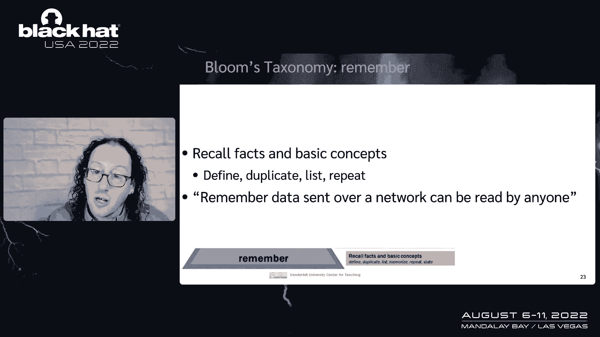
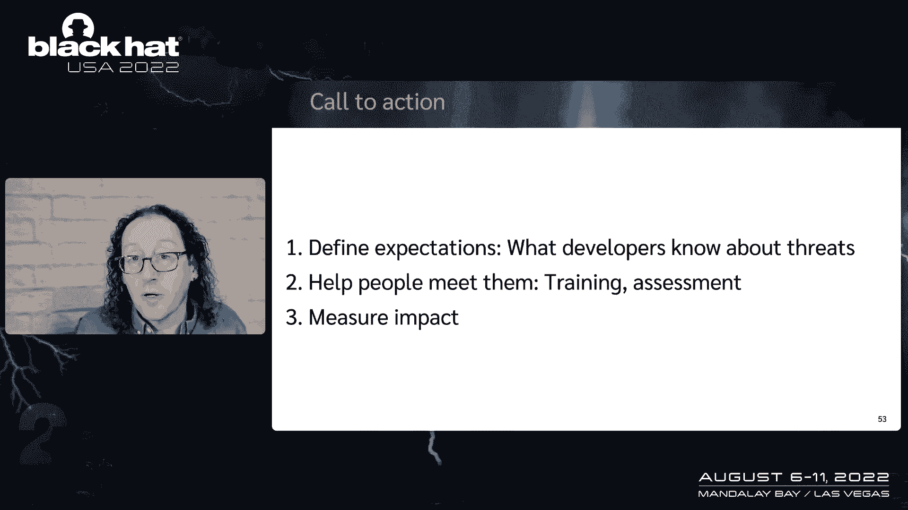

# P27：028 - A Fully Trained Jedi, You Are Not - 坤坤武特 - BV1WK41167dt

谢谢。我希望今天能和你在一起，不幸的是，我一直感觉不舒服，自私地决定我要把这件事留给自己，而不是带给你们所有人，所以今天我想先做个小测验，你在这张照片中看到了多少绝地武士，只要喊出答案，我没有听到。

我听到一个，顺便说一句，那个是陷阱，卢克，天行者还不是绝地，在这张照片中，你看到了多少绝地武士，所以说，无，我们在这里没看到任何绝地武士，我想从这个开始的原因，各种技能。

来自不同背景的各种各样的人聚集在一起，完成一个重要的目标，这个重要的目标是推翻一个邪恶的银河帝国还是运送一个产品，我们需要各种各样的技能来实现这一点，在网络安全方面，我们经常谈论绝地武士的必要性。

你知道，我会诚实，因为我爱，用星球大战来帮助讲故事，我认为要求每个人都成为绝地武士是一个糟糕的目标，英雄主义的期望，驱动倦怠史黛西·塞耶，今天下午晚些时候将就这个问题做一个演讲。

我真的很期待她对倦怠的看法，你知道的，做绝地武士并不全是乐趣，你小时候就和家人分开了，你被期望在没有依恋的情况下生活，很多人就是没有资格，他们的血液里没有合适的小魔法生物，即使你有资格。

即使你通过了训练，你成为绝地武士，很多绝地武士最终被西斯谋杀，被西斯谋杀，就是不好，所以这次谈话是一个训练有素的绝地，你不是，我是亚当，显示堆栈，并通过介绍的方式，我是黑帽公司的审查委员。

我帮助创建了简历，我通过我的公司在威胁建模方面做了很多工作，显示堆栈和关联，我想和你们分享我学到的一些教训，因为我做了大量的训练，帮助人们了解网络安全，我看到他们经历的一些挑战。

所以今天我想从安全问题开始，你知道吗，我们听到克里斯·克雷布斯谈论这个问题，谈供应链，谈论问题，当一切都变得数字化，随着越来越多的东西联系在一起，即使问题始于软件，有一种向左移动的想法，我要谈谈那件事。

我要谈谈什么，我们可以期待那些不想成为绝地武士的人，所以让我回到过去一点，这是切斯威克和贝洛文的书，防火墙和互联网安全将近三十年前，在第一章的开头，他们写道所有的程序都有bug。

大型程序甚至比它们的大小所显示的还要糟糕，这是三十年前的事了，我告诉你他们，我不想说他们不知道会发生什么，但我想从那以后情况变得更糟了，作为程序有bug的必然结果，安全程序有安全漏洞，我们知道。

所以我们可以问安全问题是从哪里来的，嗯，你知道，安全问题，就像我们使用的程序的其他方面，就像我们使用的程序的其他元素一样，来自开发商，开发商是，也许是我们在构建软件时面临的安全问题的解决方案，你知道。

我拿它开玩笑，作为开发人员，而且真的，我想它比那更广泛，是软件工程师，scrum大师，总的来说，把这些系统放在一起的人，并不意味着在构建特性时引入问题，但他们确实，开发人员实际上引入了一系列安全问题。

他们写得很好，有安全漏洞和缺陷，和缺陷比bug大一点，这是某种类型的设计问题，当他们未能编写安全功能时，他们引入了问题，我们需要以一种好的方式运行这个系统，当它们创建不可用的安全功能时，它们会带来问题。

当我想到软件的世界，我在想这个，主要是在一个模型中，有开发活动和生产，我们有不同的安全活动，我们有应用程序安全性，我们有行动安全来帮助我们保护道路的这两边，我们提供价值，在开发中，我们添加和删除bug。

在生产中，我们只有一堆安全简历，我们关心的问题，所以像节目和梅尔文教我们，我们在那些操作系统前面安装防火墙，我们部署场景来帮助我们管理警报，我们有像XDR这样的工具来帮助我们应对问题。

我们扫描生产中的东西寻找漏洞，我们对它们进行逆向工程，我想，我想用逆向工程这个词，因为这是根本，我们这里有一个逆向工程轨道，在黑帽子和固有的想法，我们反向工程的东西，我们几乎没有机会进入发展中的世界。

我们不能和开发商说话，所以我们需要反向工程，去了解他们在做什么，他们创造了什么，逆向工程也帮助我们验证这些东西，但它很大程度上是建立在这样一个想法上的，即有一个很大的差距，离开发商这么远。

他们在不同的公司工作，不同的部门，我们不能去和他们合作，什么将使它投入生产，但这一切，所有这些都集中在行动安全上，是基于这样一个假设，即我们有这个消防水管的问题，永远不会改变，在应用程序端。

我们开始看到技术，呃，像模糊静态分析这样的事情，更好的语言来帮助我们用更少的bug编写代码，通常被统称为让我们把安全转移到左边，这意味着让我们在，这意味着我们或他们的设计方式发生了变化，开发和部署东西。

它要求我们有新的不同的技能，这将安全转移到了左边的想法真的越来越受欢迎，这意味着不是在生产中做安全保障，我们进入分期或测试，甚至发展，解决问题的成本急剧增长，如果我写了一行有缺陷的代码。

然后我写一个单元测试，我发现了那个窃听器，修理起来很便宜，如果那个有缺陷的代码进入生产，我得去修理我的生产系统，如果bug代码在API中，这是一个有缺陷的API，它不能很好地进行身份验证。

它不能很好地进行授权，我可能得换API，如果我这么做了，我可能要支持V1和V2几个月，偶数年，如果bug API在Windows或iOS这样的平台上，我可能有数百万开发人员依赖它。

并修复图形需要这些开发人员中的每个人更改他们的应用程序，所以它可以和我平台的下一个驱动器一起工作，解决这些问题，以及在生产中和被其他人依赖可能是非常昂贵的，所以我们向左移动。

有时保安向左移动有点像右边的人，在橙色里，他们有一个目标，他们有一个把球灌进篮筐的计划，有时开发人员工程师会觉得自己是右边的人，在左边，抱歉，打扰一下，他们就像，等一下，这里发生了什么。

你为什么要这么做，这个，我不想让你这么做，我的目标是我们都为同一支球队效力，因此，向左移动需要我们改变正在发生的开发过程，这需要明确的责任，因为嘿，让我们面对现实吧改变是很难的，我们都厌倦了改变。

在当今世界，我们都厌倦了鞭打，以各种方式，不评判，当我这么说的时候，我只是承认，我们必须清楚到底是什么在改变，我们是否改变了交付品，我们要改变我必须做的任务吗，比如说，比如说，如果我改变交付品。

我可能会改变语言，我们正在编写软件，我们可以获得很多安全收益，这是一个很大的变化，在我做投票请求之前，我可能会通过填写清单来改变任务，我可能期望人们在开发软件时会有不同的技能。

当我们做出这些至关重要的改变时，我们以一种方式做这件事，为我们正在改变世界的人的目标服务，如果我坐在那里说，如果我坐在应用程序安全那里说，嘿亲爱的开发者，我需要你帮我换衣服，我就像，我不想换，拜托了。

asec，我是发布这个很棒的功能的人，这将使我们公司赚很多钱或为社区服务，或者任何价值，他们可能不会让ASEC高兴，所以我们需要让这些改变尽可能容易，我提到这些天我和很多组织合作，帮助他们做出这些改变。

我有时开玩笑说，我的工作只是问这个问题，谁提供什么，对他来说，并培训人们如何发生这种情况，我开玩笑说，我不知道我给你带来了什么，这看起来像什么是一个潜在的问题，如果我们能很好地回答，我们可以发展训练。

我们可以评估人们是如何被训练的，我们可以看到人们是否以清晰和可预测的方式工作，如果我们期望某人做他们工作的方式是明确的，他们更有可能在船上，所以有一个工具我变得非常喜欢。

在过去的几年里，也就是布鲁姆的分类法，我将简要介绍一下，但是布鲁姆的分类法是学习的基本工具，它帮助我们定义什么是学习目标，它帮助我们评估人们是否学会了，我们希望他们能学会，所以在分类法的底部。

你需要学习的第一件事是能力将是基本的事实和概念，只是能够记住他们，我们在列表中使用定义和复制等词，比如说。

我可能想让你记住，通过网络发送的数据可以被任何人读取，在这次演讲中，我想让你们做的就是记住布鲁姆的分类法是存在的。

它在分类法中有更高的级别是评估，能够证明我们的立场是合理的，我们的决定，我们用争论这样的词，为批评辩护，不安全，我们喜欢批评，嗯，所以我们可能会问一个问题，就像加密一样，防止这种进展。

判断人们是否获得了这些知识，关于布鲁姆的最后一件事，绽放，Bloom的分类法已经使用了很长时间，我给你这张幻灯片的唯一目标，你记得外面有很多工具，因为在最后，当我建议。

我们在定义我们期望开发人员拥有的知识方面做得更好，你可以去找像Bloom问题茎这样的东西，这些，和帮助我们定义我们想让人们知道什么的一百个动词。

因为我认为这是一个非常有帮助的工具来思考什么是安全工作，我们问不同的人，例如，如果你想成为黑帽的演讲者，我们希望你有，我们希望你能创造一些新的东西，如果你是试笔师，你要做评估工作，这东西适合生产吗？

如果你是开发人员，我们希望你了解一些关于安全的事情，我们不是这样教的，我们倾向于这样教一点，背着一个小家伙，向你解释当你九百岁的时候，希望你能理解所有这些安全问题，或者我们让人们倒立把盒子悬浮在空中。

啊，是啊，是啊，你知道，嗯，这是一个很酷的训练蒙太奇，我真的不确定，嗯，先生，你能解释一下这是如何帮助我打败银河帝国的吗，或者确保我的代码中没有SQL注入，因为我不知道我为什么要这么做，如果可以的话。

我们需要思考，如果你是开发人员，我们需要给你明智的训练，我们需要提供明智的培训，在可用的训练时间里，我对我们现在教开发人员的东西有很多批评，但我想关注积极的一面，我们需要帮助开发商找到并遵循铺面道路。

我们需要帮助他们识别危险信号，因为他们正在做一些有安全影响的事情，他们需要考虑他们，当我们考虑什么适合这里，你知道，我喜欢这些书中的每一本书，我从他们身上学到了很多，没有一个是小的，呃。

肯特·贝克的极限编程解释，这有助于启动敏捷革命，如果我们期待，每个开发人员都将知道Mike中的一切，霍华德和戴夫，勒布朗的书，或者罗斯的一切，安德森的书，或者神奇的shell程序员手册中的一切，嗯。

就是我们失败的原因，所以我们必须思考它是什么，要求一个普通的开发人员了解软件安全是合理的，我们需要使用的工具之一，所以在我说之前，当我们给人们这四本书的时候，发生的一件事是他们就像，我不知所措。

如果你想想你对不知所措的感觉，面朝，说，投资决策，你可以去读这样的书，说给我一个定义，目标日期基金和目标日期基金，说嘿，现在是22点22分，我计划在2050年退休，帮我想清楚，正确配置投资。

让我在2050年退休，他们为你这么做，这很重要，因为我们大多数人都不知所措，当我们在考虑我们的退休计划时，就像开发人员可能会不知所措一样，想着所有这些东西，我们要求他们学习，所以我们需要让它变得更容易。

我们可以使用的工具之一是分块，我们的大脑在模式识别方面很出色，处理数据块，你可能听说过短期记忆是7，正负二，很乐观，但它是关于大块的，这不是关于单个数据，所以如果你看这个序列，一二三，五个，八十三，等。

你不知道是什么，你可能只记得这些了，如果我要求你记住它，如果你知道这是一个斐波那契数列，您可以将这些数据作为一个单独的东西组块，如果你真的学过斐波那契数列，你会注意到，而你，你是，你想尖叫。

因为我漏掉了两个一，嗯，这是个陷阱，但我在做，因为你要证明你的大脑是用这些信息块工作的，它认出来了，如果你在知道21失踪的小组里，这是因为你的大脑做模式识别，这是至关重要的。

因为如果我们不定义我们想让人们理解的块，他们会，他们无论如何都可能，正如我所说，我们的大脑真的很擅长模式识别，甚至发明我们可能不认为存在的模式，所以我不得不问，我们希望普通开发人员知道的类别是什么。

关于克里斯·克雷布斯和他伟大的基调，今天早上他报道了一堆这些，他报道了威胁演员，他涵盖了合规问题，对我们来说，你知道，我个人认为这是一次很棒的谈话，但对于不安全的人来说，可能有点势不可挡。

我们经常尝试教普通开发人员，利用技术，我们试着教他们这样的事情，我觉得，如果你知道我的一些工作，你可能，你可能不会感到惊讶我认为我们应该教他们关于威胁的知识，回答问题的方法，会出什么问题。

我相信花了很多时间教人们这个，花了很多时间和高管在一起，什么会出问题，把我们的注意力集中在威胁上，它是如何参与的一个难以置信的强大框架，每个人都有答案，如果你问他们，并鼓励他们一直到高管，当我问主管们。

他们在担心什么，是什么让他们夜不能寐，然后我停下来等待答案，当我鼓励他们的时候，他们有答案，当我问正常的开发人员，你会怎么攻击这个，我得到了很好的答案，会出什么问题，充当雨伞，如果我们问。

只要问那个问题，我们的答案千差万别，我们有很多方法可以回答这个问题，我要在这里加快速度，跳过一些这个，但重要的是要想到，可能出错的不仅仅是虫子，不仅仅是缓冲区溢出和SQL注入，和内存安全。

是身份验证失败，是加密失败，它没有日志，也没有足够长的时间保存这些日志，它没有在我们的系统中建立MFA支持，这些缺陷很重要，所以嗯，当我谈到什么是，做副业的四种最好的方法是什么，我知道我在问开发商。

不是专家的人在这个分类法的专家端工作，所以他们需要我们提供具体的建议，当我谈到，个人理财实例，但你知道我去了，我在谷歌上搜索了一些建议，这不仅仅是匹配你的税收优惠匹配账户。

我发现了这50个个人理财小贴士，它们将改变，你想想钱五十，我得想50件事，看在上帝的份上，所以目标日期基金是一个很好的工具帮助人们避免思考，史蒂夫·克鲁格有一本关于可用性的可爱的书，别让我以为。

因为人们不知所措，他们有这么多事情要做，所以当我谈到每个工程师都需要知道什么的问题时，我一直在做几个项目，真的把我引向了这个问题，第一个是白皮书，快，价廉物美，马上就会向你展示其中的一些部分。

另一本是我今年秋天出版的下一本书，那本书的副标题威胁到了每个工程师都应该从星球大战中学到的东西，每个工程师都应该学习的副标题对我来说真的是一个坩埚，在思考每个工程师需要知道什么的问题时。

我要和你分享我的答案，但在我做之前，我想从一个简单的问题开始，这就是每一个缺陷都是独一无二的，如果每一个缺陷都是独一无二的，我们需要大量的安全专业知识，但如果有集群。

那么也许我们可以考虑我们需要的安全专业知识，并将安全专业知识与我们需要找到它们的系统知识联系起来，这样我们就可以将我们的安全知识应用于它并发现bug，也许这些虫子只是在一个统一的空间里。

也许这些缺陷存在于一个统一的空间和任何数量的系统知识中，任何安全专业知识都能帮助我们找到他们，也许这些安全缺陷真的需要更多的安全知识，我的安全专业知识越多，我发现的东西越多，或者也许。

这代表了我这些天的信念，嗯，我们不需要太多的系统知识，我们不需要太多的安全专业知识，找出系统中的大部分缺陷，我认为这些是轻量级的缺陷，我们踢翻一块石头，下面有东西在乱窜，我们都有过这样的经历。

我想我们中的许多人都有过踢翻那些岩石的经历，发现这些缺陷，所以如果这些缺陷是常见的，我认为我们应该改变与工程师合作的方式，所以我对我们应该如何做到这一点的建议是，我们应该让人们了解大步，跨步，代表欺骗。

篡改和否认，INO披露，拒绝服务和扩大权力，我们应该要求开发人员知道解析和可预测性会导致危险，我们应该让他们了解如何使用杀伤链将它们聚集在一起，这是四件事，我认为这是一套合理的知识，所以作为一个例子。

我们可能会说，欺骗必须以不同的方式解决，对于向机器或人进行身份验证的每一台机器或人，欺骗程序很容易，如果我在传统桌面上运行，一个程序可以与另一个程序对话，没有程序标识，移动平台上的方式。

我相信我们作为一个社区，在我们的每个组织中都需要定义，开发人员需要知道的，我认为这很重要，因为如果你和我对开发人员需要知道的东西有不同的看法，或者你和我还有你的同事。

和你的发展商推广委员会对发展商需要知道什么有不同的看法，我可以告诉你哪一组会赢，我可以告诉你，我们影响那些人的唯一方法，在招聘委员会，总结一下，留出几分钟的时间来回答一些问题，代码问题是许多问题的基础。

可能甚至大多数安全问题都在转移，当我说最多的时候，我说的是可用的安全性，如果我们在里面包括可用的安全性，我认为很明显，大多数安全问题向左转移是一个令人钦佩的目标，但只有当我们清楚改变时，它才会起作用。

到目前为止，我们还没有足够清楚我们需要做出的改变，所以你知道，叛乱建立在希望之上，当我们定义这些东西时，开发人员将更能够构建更安全的系统，目标是，希望，做出这种改变的原因是如果我们开发更安全的系统。

返工会比较少，会有更少的升级，人们在最后一刻出现，说嗨，Hi Security，我们忘了来找你，我们有这个东西，我们已经准备好出发了，我们打算明天发货，你能签个险吗？你去过那儿吗？你喜欢吗。

如果我们把我们的期望说得更清楚，我们可以减少这种情况发生的频率，我们可以减少那些升级的痛苦，我们可以提高我们正在构建的系统交付的可预测性，所以从这里走出来，我鼓励你，我们作为一个社区。

我们需要决定开发人员需要了解哪些关于威胁的信息，作为专家，我们必须帮助定义这一点，我们必须提出建议，就像我做的那样，我们得帮助人们认识他们，我们必须发展训练，那很管用，我们要测量如何，这是一个地址。

更可预测的交付目标，升级较少，如果我们做了这些事情，我认为我们正在为自己做一个非常积极的改进，我们在接下来的25年里建立安全。

我想说的是，非常感谢你的收听，我很乐意回答问题，我现在很乐意带他们去，现场直播，我会在掉期卡平台上，这是我的电子邮件地址，明天九点半以前你会拿到这些幻灯片，你可以拍一张照片，我认为这很重要。

我很想和人们谈谈这件事，谢谢你，谢谢。我想问你的问题是，你提到了风险，风险对我们中的一些人来说很重要，尤其是从事安全工作的人，关键的东西，你经历了努力，你做威胁建模，然后负责产品风险的人过来说。

那并不重要，那永远不会发生，所以你最终会遇到这种情况，在那里你和开发人员建立了关系，不管是硬件还是软件，然后在一天结束时，另一个小组说，是啊，是啊，别听他们的，你建议人们如何与风险仲裁者建立这种关系。

这样他们就不会失去他们所拥有的可信度，和那些在一天结束时必须实际实施这些事情的人在一起，我认为如果我们与建造这些东西的人接触，没人想当工程师，他们只在接下来的七个上安装了一个空速指示器，三七。

我们去风险委员会，当对那里有什么有分歧时，所以我认为第一步是减少，我们去风险委员会，然后第二个，我真的认为我们需要改变，我们做风险计算，但那可能是另一个谈话，也是，嘿查尔斯，很高兴听到你的声音，嗯。

所以我认为这是在发展理解，这就是风险所在，开发人员对此负责，谢谢。嗨嗬，我想问一下，就像，你怎么能嗯，比如处理需求，当你在建造一些东西的时候，从这个意义上说，所以我相信这很重要，就像我们想怎么喜欢一样。

定义这些增量变量，嗯，就像，使他们统一起来，对一切都一样，那么你如何接近，比如定义构建项目的这些需求，就像，我们应该总是有同样的最好，如何将此与此对齐，让我们说，每个人都应该拥有的知识。

那么你如何用它来喜欢，定义可预测的，可重复的要求，就像在这些项目的开始，所以当我开始从事软件工作时，开发人员承担了越来越多的质量责任，我们有独立的质量保证部门，那就是，开发人员被期望生产可靠的对不起。

可靠代码，他们被期望产生性能代码，所以如果我们不知道他们应该知道什么关于安全，我们不能指望他们把它写进需求中，但如果我们真的有期望，那么我们可以说，我们希望您考虑身份验证。

你不假思索地建立了一个完整的系统，怎么会这样？你没有想过欺骗威胁，当您编写这些需求时，每个开发人员需要知道的，嗨，谢谢你的介绍，我真的很喜欢，所以我想补充一个想法，虽然，当我想到绝地学徒。

我看电影的方式，真正的意义是你进入了这种情况，在那里你知道你是个初学者，你要学很多东西，如果你最终成为绝地武士，这并不重要，所以我想知道你做了关于人的陈述，我认为这很重要，我不知道。

如果我们还能够定义开发人员的基本知识需要是什么，听起来有点像你在说，我们可以让他们保持在较低的知识水平，这和我在电影里看到的不一样，对呀，所以所以所以我想做学徒，我一开始的想法是我们做了这个想法。

在叛乱中不仅仅有绝地骑士，我欢迎你和这里的人们，黑帽子，经常渴望这个绝地武士的身份很棒，但并不是每个叛乱中的人都渴望同样的事情，我并不是说这是秘密，只有少数人应该拥有的神秘知识，而是认识到地面部队。

战斗机飞行员，组成叛乱的机制，有不同的技能，他们花时间磨练，我们需要定义我们对他们的期望，在合理的时间框架内确保安全，这样我们就可以用它来实现它，我知道我又没时间了，你有其他方法联系我，都在这里。

对不起，今天我不能亲自来见你，非常感谢你能来，祝你接下来的节目愉快。